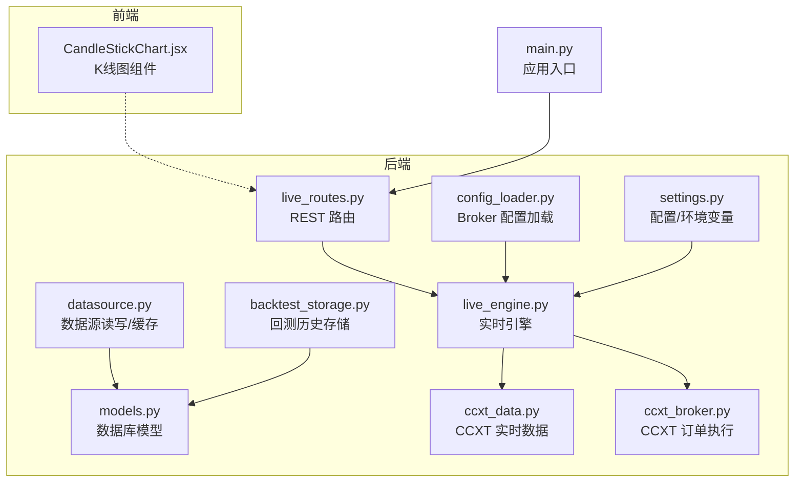
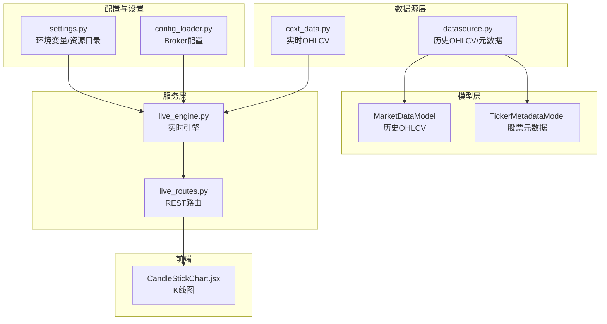
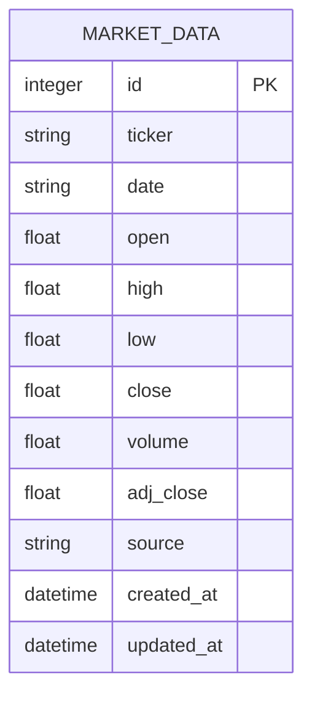
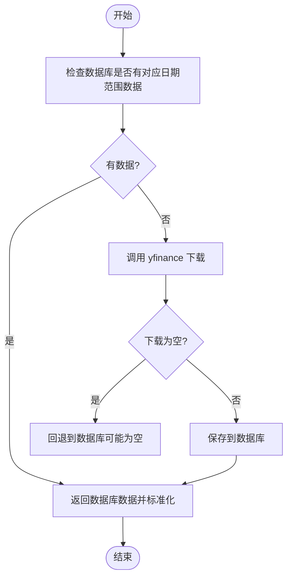
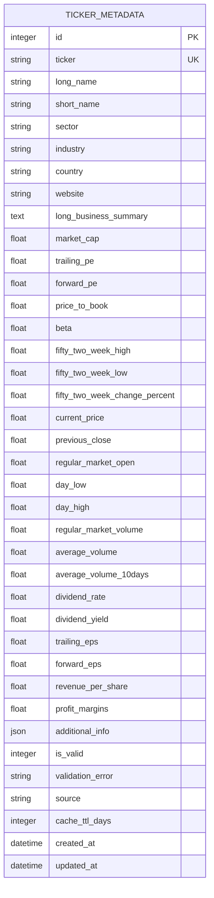
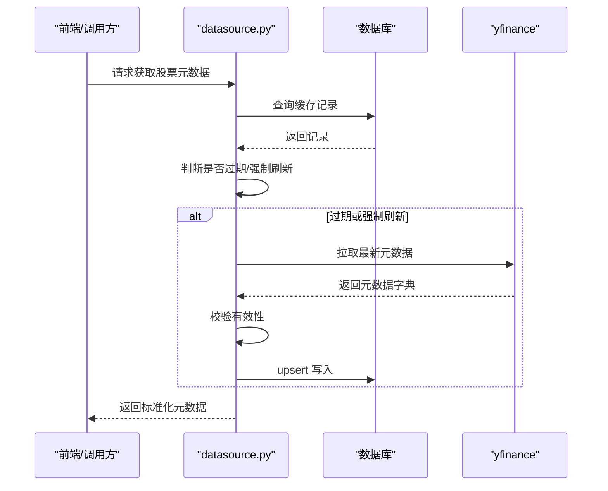
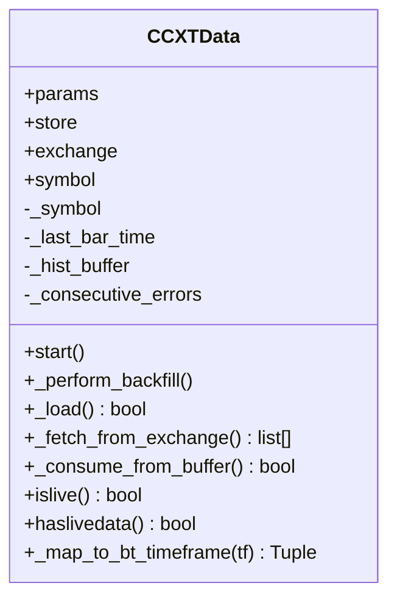
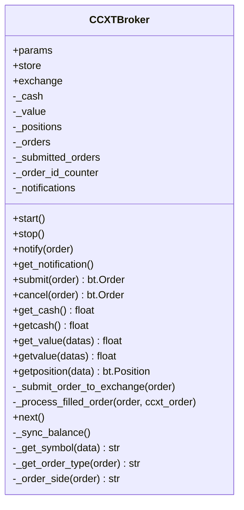
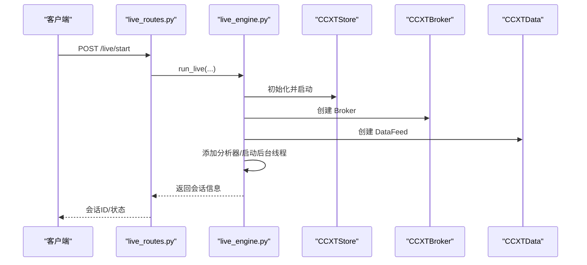
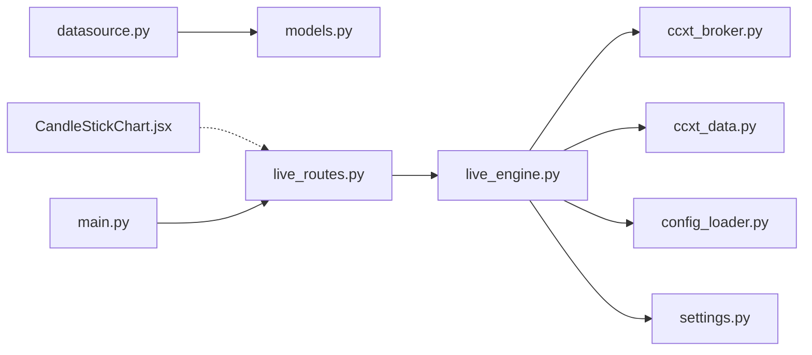

# 市场数据模型

<cite>
**本文引用的文件**
- [models.py](file://backend/src/db/models.py)
- [datasource.py](file://backend/src/db/datasource.py)
- [ccxt_data.py](file://backend/src/brokers/ccxt_adapter/ccxt_data.py)
- [ccxt_broker.py](file://backend/src/brokers/ccxt_adapter/ccxt_broker.py)
- [live_engine.py](file://backend/src/service/live_engine.py)
- [live_routes.py](file://backend/src/routes/live_routes.py)
- [settings.py](file://backend/src/config/settings.py)
- [config_loader.py](file://backend/src/utils/config_loader.py)
- [backtest_storage.py](file://backend/src/db/backtest_storage.py)
- [CandleStickChart.jsx](file://frontend/src/components/DataSource/CandleStickChart.jsx)
- [main.py](file://backend/main.py)
</cite>

## 目录
1. [简介](#简介)
2. [项目结构](#项目结构)
3. [核心组件](#核心组件)
4. [架构总览](#架构总览)
5. [详细组件分析](#详细组件分析)
6. [依赖关系分析](#依赖关系分析)
7. [性能考量](#性能考量)
8. [故障排查指南](#故障排查指南)
9. [结论](#结论)
10. [附录](#附录)

## 简介
本文件聚焦于“市场数据模型”，系统性梳理后端如何在数据库中持久化历史市场数据、缓存股票/ETF等基础财务信息，并在实时交易场景中通过适配器接入外部数据源（如 yfinance、CCXT）。同时，文档给出数据流、类关系、序列图与流程图，帮助读者快速理解从数据采集、入库、查询到前端展示的完整链路。

## 项目结构
围绕“市场数据模型”的关键目录与文件：
- 数据库模型层：定义 OHLCV 历史数据、股票元数据、会话/订单/持仓、回测历史、优化结果等表结构
- 数据源层：封装 yfinance 与数据库的读写、Ticker 元数据缓存与校验
- 实时数据适配层：CCXT 实时 OHLCV 数据流与回放能力
- 服务编排层：实时引擎与路由对接，提供启动/停止/状态查询等接口
- 配置与设置：Broker 配置、环境变量、资源目录
- 前端图表：K 线图组件接收后端返回的 OHLCV 列表

图表来源
- [models.py](file://backend/src/db/models.py#L1-L560)
- [datasource.py](file://backend/src/db/datasource.py#L1-L499)
- [ccxt_data.py](file://backend/src/brokers/ccxt_adapter/ccxt_data.py#L1-L288)
- [ccxt_broker.py](file://backend/src/brokers/ccxt_adapter/ccxt_broker.py#L1-L545)
- [live_engine.py](file://backend/src/service/live_engine.py#L1-L329)
- [live_routes.py](file://backend/src/routes/live_routes.py#L1-L423)
- [settings.py](file://backend/src/config/settings.py#L1-L81)
- [config_loader.py](file://backend/src/utils/config_loader.py#L1-L343)
- [backtest_storage.py](file://backend/src/db/backtest_storage.py#L1-L444)
- [CandleStickChart.jsx](file://frontend/src/components/DataSource/CandleStickChart.jsx#L1-L94)
- [main.py](file://backend/main.py#L1-L32)

章节来源
- [models.py](file://backend/src/db/models.py#L1-L560)
- [datasource.py](file://backend/src/db/datasource.py#L1-L499)
- [ccxt_data.py](file://backend/src/brokers/ccxt_adapter/ccxt_data.py#L1-L288)
- [ccxt_broker.py](file://backend/src/brokers/ccxt_adapter/ccxt_broker.py#L1-L545)
- [live_engine.py](file://backend/src/service/live_engine.py#L1-L329)
- [live_routes.py](file://backend/src/routes/live_routes.py#L1-L423)
- [settings.py](file://backend/src/config/settings.py#L1-L81)
- [config_loader.py](file://backend/src/utils/config_loader.py#L1-L343)
- [backtest_storage.py](file://backend/src/db/backtest_storage.py#L1-L444)
- [CandleStickChart.jsx](file://frontend/src/components/DataSource/CandleStickChart.jsx#L1-L94)
- [main.py](file://backend/main.py#L1-L32)

## 核心组件
- 历史 OHLCV 数据模型：用于缓存 yfinance 获取的历史行情，避免重复拉取，支持按日期范围查询与标准化输出
- 股票/ETF 元数据模型：缓存 yfinance 的公司基础、市场指标、交易统计与附加信息，带 TTL 控制
- 实时数据适配器：CCXTData 提供实时 OHLCV 拉取、回放缓冲、过滤未闭合蜡烛、错误重试与限速处理
- 实时订单执行适配器：CCXTBroker 将下单映射为 CCXT 订单，跟踪成交、更新资金与头寸，广播 WebSocket 通知
- 数据源读写：封装保存/读取 OHLCV、解析 yfinance 返回、构造统一字段、去重与异常处理
- 配置与设置：Broker 配置加载、时间框架/符号校验、环境变量与资源目录管理
- 回测历史存储：持久化回测配置、指标、图表文件名、AI 分析与策略代码快照

章节来源
- [models.py](file://backend/src/db/models.py#L393-L560)
- [datasource.py](file://backend/src/db/datasource.py#L1-L499)
- [ccxt_data.py](file://backend/src/brokers/ccxt_adapter/ccxt_data.py#L1-L288)
- [ccxt_broker.py](file://backend/src/brokers/ccxt_adapter/ccxt_broker.py#L1-L545)
- [config_loader.py](file://backend/src/utils/config_loader.py#L1-L343)
- [backtest_storage.py](file://backend/src/db/backtest_storage.py#L1-L444)

## 架构总览
下图展示“市场数据模型”在系统中的位置与交互关系：数据源层负责历史与实时数据的采集与缓存；模型层提供统一的数据结构；服务层编排实时交易；前端通过路由与组件消费数据。

图表来源
- [datasource.py](file://backend/src/db/datasource.py#L1-L499)
- [ccxt_data.py](file://backend/src/brokers/ccxt_adapter/ccxt_data.py#L1-L288)
- [models.py](file://backend/src/db/models.py#L393-L560)
- [live_engine.py](file://backend/src/service/live_engine.py#L1-L329)
- [live_routes.py](file://backend/src/routes/live_routes.py#L1-L423)
- [config_loader.py](file://backend/src/utils/config_loader.py#L1-L343)
- [settings.py](file://backend/src/config/settings.py#L1-L81)
- [CandleStickChart.jsx](file://frontend/src/components/DataSource/CandleStickChart.jsx#L1-L94)

## 详细组件分析

### 历史 OHLCV 数据模型与数据源读写
- 数据模型
  - 表名：market_data
  - 字段：主键、股票代码、日期（YYYY-MM-DD）、开盘/最高/最低/收盘/成交量、调整收盘价、来源、创建/更新时间
  - 约束：ticker+date 唯一索引
- 数据源读写
  - 保存：将 pandas DataFrame 转换为记录，逐条插入，遇到唯一约束冲突则跳过
  - 查询：按 ticker+日期范围查询，返回标准列名并补齐缺失的 Adj Close
  - 备注：若数据库无数据或失败，回退到 yfinance 下载并再次保存

图表来源
- [models.py](file://backend/src/db/models.py#L393-L435)

图表来源
- [datasource.py](file://backend/src/db/datasource.py#L97-L171)

章节来源
- [models.py](file://backend/src/db/models.py#L393-L435)
- [datasource.py](file://backend/src/db/datasource.py#L97-L171)

### 股票/ETF 元数据模型与缓存
- 数据模型
  - 表名：ticker_metadata
  - 字段：公司基础（名称、行业、国家、网站、摘要）、市场指标（市值、PE、市净率、Beta、52周高/低/涨跌幅）、交易统计（当前价、前收、开盘、日高低、成交量、均量）、财务指标（股息、EPS、营收/份额、利润率）、附加信息（JSON）、有效性标记、来源、TTL 天数、创建/更新时间
  - 方法：is_stale() 基于 TTL 判断是否过期
- 缓存流程
  - 优先查缓存，未命中或过期则从 yfinance 获取，校验有效性后 upsert 写入数据库

图表来源
- [models.py](file://backend/src/db/models.py#L437-L518)

图表来源
- [datasource.py](file://backend/src/db/datasource.py#L436-L499)
- [models.py](file://backend/src/db/models.py#L437-L518)

章节来源
- [models.py](file://backend/src/db/models.py#L437-L518)
- [datasource.py](file://backend/src/db/datasource.py#L217-L499)

### 实时 OHLCV 数据适配器（CCXT）
- 功能要点
  - 支持实时拉取 OHLCV，过滤“形成中”蜡烛，避免未来数据泄漏
  - 支持回放缓冲与批量抓取，提升“追赶”速度
  - 错误计数与休眠，防止高频错误循环
  - 时间框架映射：将 CCXT 时间字符串映射为 Backtrader 时间框架与压缩倍数
- 关键参数
  - ccxt_timeframe、compression、backfill_start/backfill、limit、pause、debug
- 生命周期
  - start() 可选回放历史
  - _load() 从缓冲区或交易所抓取新数据
  - haslivedata()/islive() 标识实时模式

图表来源
- [ccxt_data.py](file://backend/src/brokers/ccxt_adapter/ccxt_data.py#L1-L288)

章节来源
- [ccxt_data.py](file://backend/src/brokers/ccxt_adapter/ccxt_data.py#L1-L288)

### 实时订单执行适配器（CCXT）
- 功能要点
  - 将 Backtrader 订单提交至 CCXT，跟踪订单生命周期（已提交→已接受→已成交/已取消）
  - 更新资金与头寸，计算 P&L 并通过 WebSocket 广播订单、成交、头寸与 P&L 更新
  - next() 定期轮询订单状态，处理成交与取消
- 关键点
  - 支持市价/限价单类型识别
  - 从数据 feed 中提取 symbol
  - 同步余额（live 模式）

图表来源
- [ccxt_broker.py](file://backend/src/brokers/ccxt_adapter/ccxt_broker.py#L1-L545)

章节来源
- [ccxt_broker.py](file://backend/src/brokers/ccxt_adapter/ccxt_broker.py#L1-L545)

### 实时引擎与路由对接
- 实时引擎
  - 统一构建 store/broker/data，初始化 cerebro，添加分析器（夏普比率、最大回撤、收益、交易记录）
  - 后台线程运行 cerebro，状态机管理（starting/running/stopping/stopped/error），保存会话到数据库
- 路由
  - 提供启动/停止/状态查询/会话列表/可用交易所/订单查询/健康检查等接口
  - 参数校验：模式、时间框架、符号格式、Broker 配置

图表来源
- [live_routes.py](file://backend/src/routes/live_routes.py#L1-L423)
- [live_engine.py](file://backend/src/service/live_engine.py#L1-L329)
- [ccxt_broker.py](file://backend/src/brokers/ccxt_adapter/ccxt_broker.py#L1-L545)
- [ccxt_data.py](file://backend/src/brokers/ccxt_adapter/ccxt_data.py#L1-L288)

章节来源
- [live_engine.py](file://backend/src/service/live_engine.py#L1-L329)
- [live_routes.py](file://backend/src/routes/live_routes.py#L1-L423)

### 配置与设置
- Broker 配置
  - 通过 JSON 加载并使用 Pydantic 校验，包含交易所启用状态、适配器、市场类型、默认市场、纸/实盘参数、风控限额、通知通道等
  - 提供符号与时间框架校验、列出启用交易所
- 环境变量与资源目录
  - DATABASE_URL、LIVE_TRADING_ENABLED、默认交易所/模式、代理、AI 接口密钥等
  - 自动创建 images、strategy、config、frontend 等资源目录

章节来源
- [config_loader.py](file://backend/src/utils/config_loader.py#L1-L343)
- [settings.py](file://backend/src/config/settings.py#L1-L81)

### 回测历史存储
- 存储内容
  - backtest_history 表：回测标识、用户ID、标的、起止日期、初始资金、佣金、金额、策略名、关键指标（最终价值、总回报、夏普、最大回撤、交易数、胜/负数）、完整指标JSON、AI分析（多模型）、策略代码快照、图表文件名
- 清理策略
  - 保留最近 N 条记录，自动删除旧记录及关联图片文件
  - 对损坏 JSON 的记录进行清理并重试查询

章节来源
- [backtest_storage.py](file://backend/src/db/backtest_storage.py#L1-L444)
- [models.py](file://backend/src/db/models.py#L257-L316)

## 依赖关系分析
- 模块耦合
  - datasource.py 依赖 models.py 的 MarketDataModel/TickerMetadataModel 与 init_database
  - live_engine.py 依赖 ccxt_broker.py/ccxt_data.py/config_loader.py/settings.py
  - live_routes.py 依赖 live_engine.py 与 config_loader.py
  - 前端 CandleStickChart.jsx 依赖后端返回的 OHLCV 列表
- 外部依赖
  - yfinance：历史 OHLCV 与股票元数据
  - CCXT：实时 OHLCV 与订单执行
  - FastAPI/Daphne：REST/WebSocket 服务端
- 循环依赖
  - 通过延迟导入（如 WebSocket 管理器）避免循环引用

图表来源
- [datasource.py](file://backend/src/db/datasource.py#L1-L499)
- [models.py](file://backend/src/db/models.py#L1-L560)
- [live_engine.py](file://backend/src/service/live_engine.py#L1-L329)
- [ccxt_broker.py](file://backend/src/brokers/ccxt_adapter/ccxt_broker.py#L1-L545)
- [ccxt_data.py](file://backend/src/brokers/ccxt_adapter/ccxt_data.py#L1-L288)
- [config_loader.py](file://backend/src/utils/config_loader.py#L1-L343)
- [settings.py](file://backend/src/config/settings.py#L1-L81)
- [live_routes.py](file://backend/src/routes/live_routes.py#L1-L423)
- [CandleStickChart.jsx](file://frontend/src/components/DataSource/CandleStickChart.jsx#L1-L94)
- [main.py](file://backend/main.py#L1-L32)

章节来源
- [live_engine.py](file://backend/src/service/live_engine.py#L1-L329)
- [live_routes.py](file://backend/src/routes/live_routes.py#L1-L423)
- [ccxt_broker.py](file://backend/src/brokers/ccxt_adapter/ccxt_broker.py#L1-L545)
- [ccxt_data.py](file://backend/src/brokers/ccxt_adapter/ccxt_data.py#L1-L288)
- [datasource.py](file://backend/src/db/datasource.py#L1-L499)
- [models.py](file://backend/src/db/models.py#L1-L560)
- [config_loader.py](file://backend/src/utils/config_loader.py#L1-L343)
- [settings.py](file://backend/src/config/settings.py#L1-L81)
- [CandleStickChart.jsx](file://frontend/src/components/DataSource/CandleStickChart.jsx#L1-L94)
- [main.py](file://backend/main.py#L1-L32)

## 性能考量
- 历史数据缓存
  - 使用 market_data 表缓存 yfinance 数据，减少重复请求；按 ticker+date 唯一索引避免重复写入
- 元数据 TTL
  - TickerMetadataModel 支持 TTL，默认 7 天，降低 yfinance 调用频率
- 实时数据抓取
  - CCXTData 采用批量 limit 抓取与回放缓冲，提高追赶效率；过滤未闭合蜡烛避免未来数据泄露
- 数据库写入
  - 批量 flush/commit，遇到唯一约束冲突跳过，保证幂等
- 查询优化
  - 历史 OHLCV 查询按 ticker/date 范围排序返回，前端仅渲染必要数据

章节来源
- [models.py](file://backend/src/db/models.py#L393-L435)
- [models.py](file://backend/src/db/models.py#L437-L518)
- [datasource.py](file://backend/src/db/datasource.py#L97-L171)
- [ccxt_data.py](file://backend/src/brokers/ccxt_adapter/ccxt_data.py#L1-L288)

## 故障排查指南
- 启动实时会话失败
  - 检查 LIVE_TRADING_ENABLED 是否开启
  - 校验 exchange、symbol、timeframe 是否符合配置
  - 查看会话状态与错误消息
- 数据加载异常
  - 若数据库无数据，确认 yfinance 可用且返回非空
  - 若 JSON 损坏导致回测历史查询失败，系统会尝试清理并重试
- 实时数据不更新
  - 检查 CCXTData 的 pause/limit 设置与交易所限速
  - 确认 haslivedata()/islive() 返回正确
- 订单执行问题
  - 检查 CCXTBroker 的 next() 轮询与订单状态更新
  - 确认 WebSocket 广播是否正常

章节来源
- [live_routes.py](file://backend/src/routes/live_routes.py#L1-L423)
- [live_engine.py](file://backend/src/service/live_engine.py#L1-L329)
- [datasource.py](file://backend/src/db/datasource.py#L1-L499)
- [backtest_storage.py](file://backend/src/db/backtest_storage.py#L1-L444)
- [ccxt_data.py](file://backend/src/brokers/ccxt_adapter/ccxt_data.py#L1-L288)
- [ccxt_broker.py](file://backend/src/brokers/ccxt_adapter/ccxt_broker.py#L1-L545)

## 结论
本系统通过“历史 OHLCV 缓存 + 股票元数据 TTL + 实时 CCXT 适配器”的组合，实现了高效、稳定的市场数据供给。数据库模型清晰、数据源读写健壮、实时引擎与路由完备，配合前端 K 线图组件，形成了从前端到后端再到外部数据源的完整闭环。建议在生产环境中结合 Broker 配置与风控参数，持续监控实时数据质量与订单执行稳定性。

## 附录
- 前端 K 线图数据格式
  - 字段：time（YYYY-MM-DD）、open、high、low、close、volume
  - 组件负责去重、排序与自适应缩放

章节来源
- [CandleStickChart.jsx](file://frontend/src/components/DataSource/CandleStickChart.jsx#L1-L94)