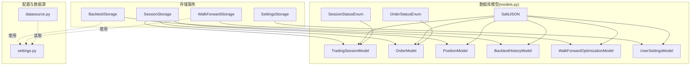
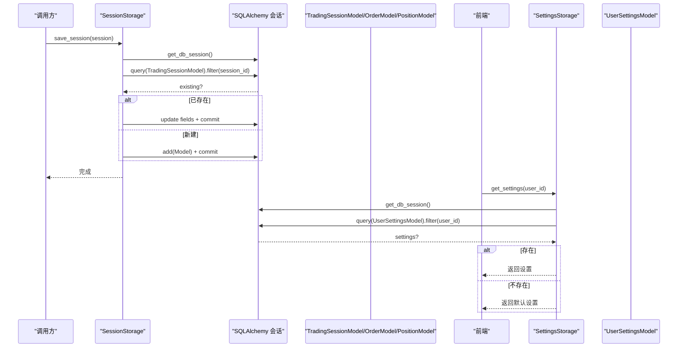
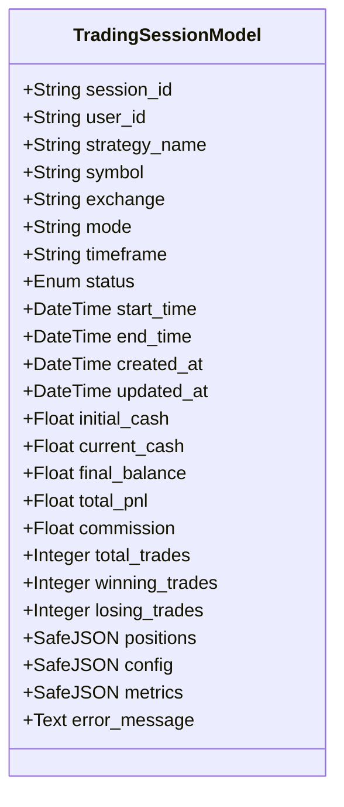
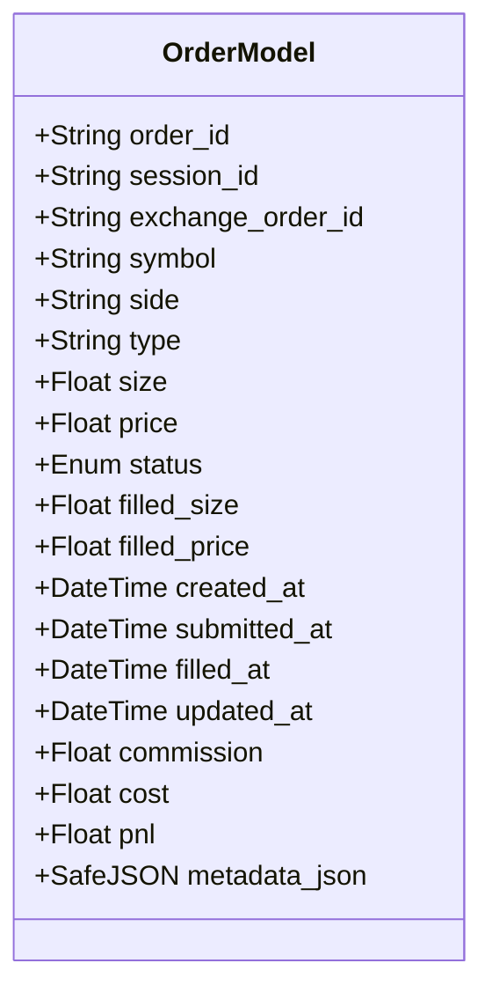
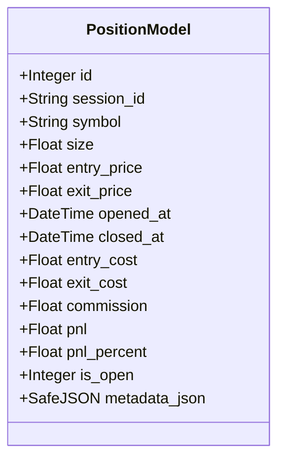
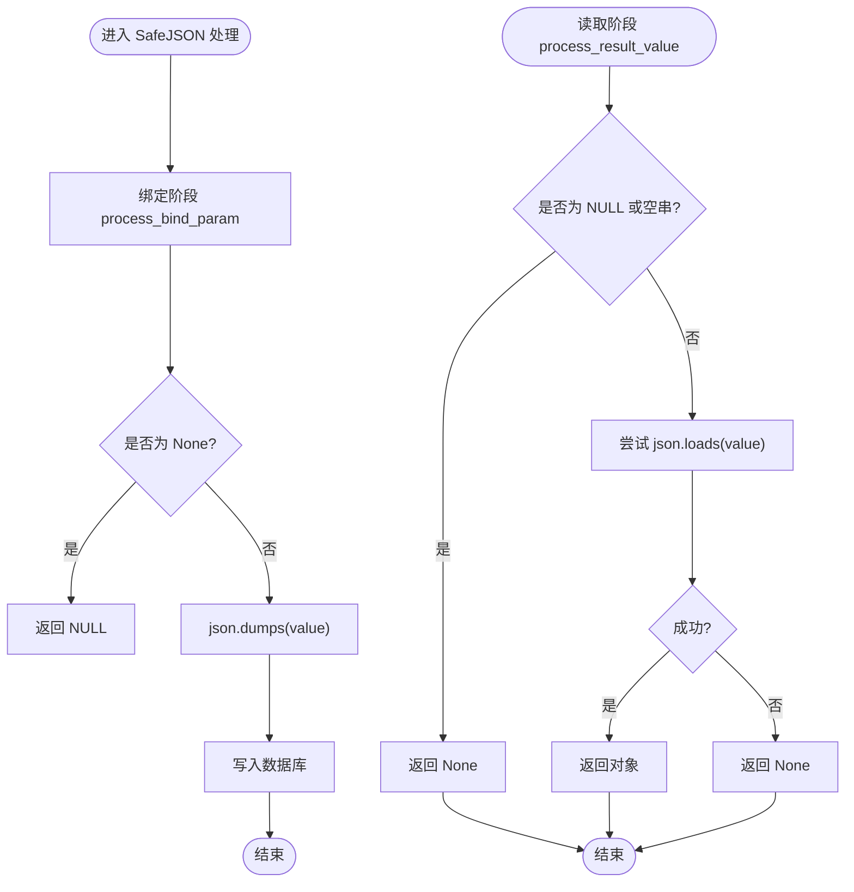
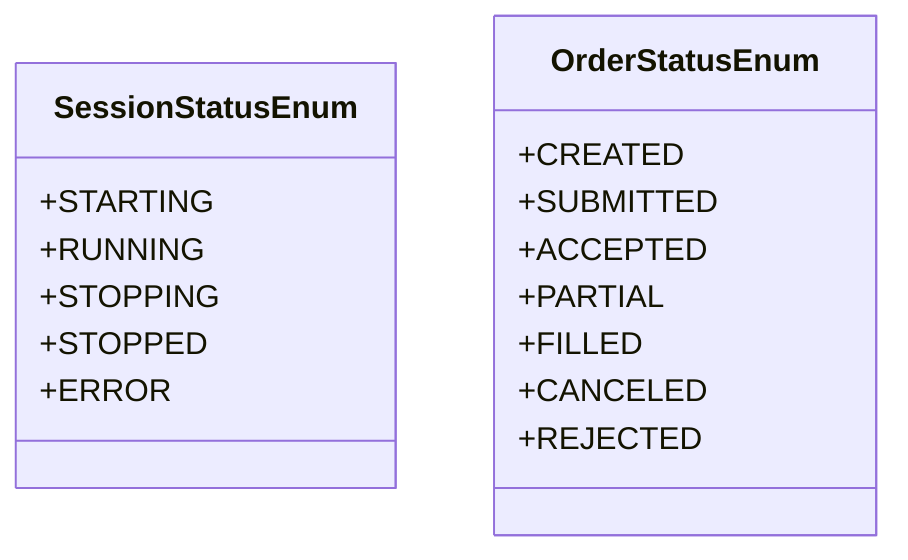
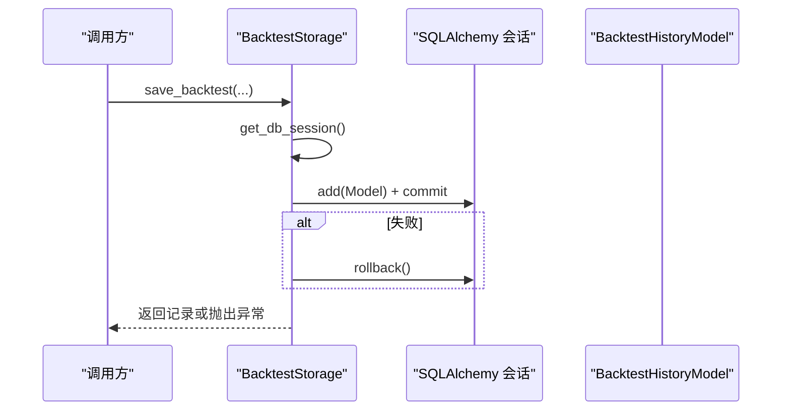
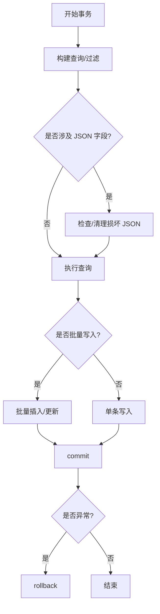
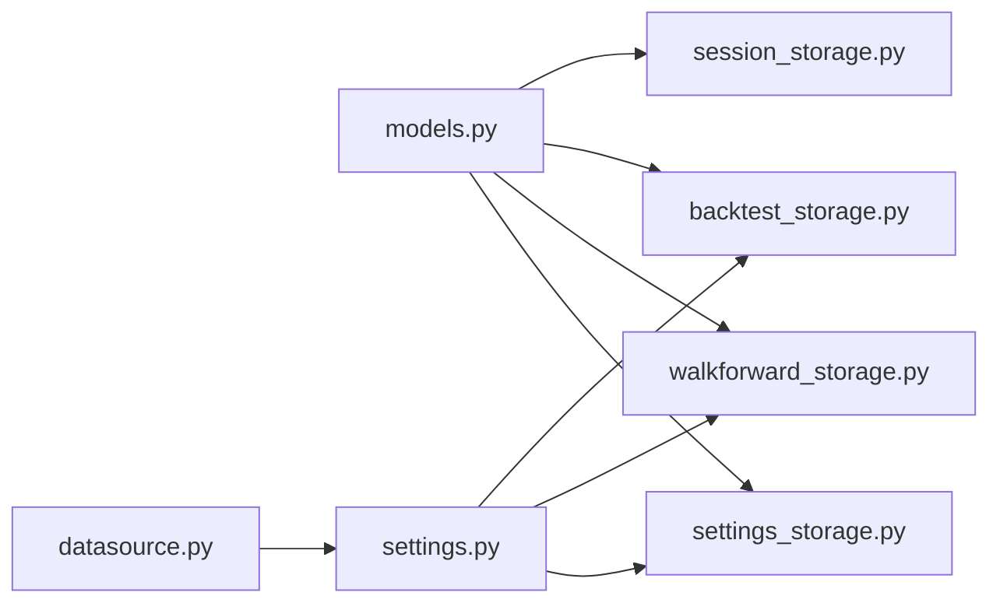

# 数据模型

<cite>
**本文引用的文件**
- [models.py](file://backend/src/db/models.py)
- [session_storage.py](file://backend/src/db/session_storage.py)
- [backtest_storage.py](file://backend/src/db/backtest_storage.py)
- [walkforward_storage.py](file://backend/src/db/walkforward_storage.py)
- [datasource.py](file://backend/src/db/datasource.py)
- [settings.py](file://backend/src/config/settings.py)
- [migrate_cleanup_json.py](file://backend/src/db/migrate_cleanup_json.py)
- [settings_storage.py](file://backend/src/db/settings_storage.py)
- [settings_routes.py](file://backend/src/routes/settings_routes.py)
</cite>

## 更新摘要
**已做更改**
- 在核心组件部分新增了UserSettingsModel数据库模型的详细说明
- 更新了架构总览图，增加了用户设置存储服务
- 在详细组件分析中新增了UserSettingsModel分析章节
- 更新了依赖关系分析图，增加了新的依赖关系
- 在数据访问层设计模式中补充了用户设置存储的最佳实践

## 目录
1. [简介](#简介)
2. [项目结构](#项目结构)
3. [核心组件](#核心组件)
4. [架构总览](#架构总览)
5. [详细组件分析](#详细组件分析)
6. [依赖关系分析](#依赖关系分析)
7. [性能考量](#性能考量)
8. [故障排查指南](#故障排查指南)
9. [结论](#结论)
10. [附录](#附录)

## 简介
本文件系统性梳理后端数据库模型与数据访问层设计，聚焦以下目标：
- 基于 SQLAlchemy 完整说明 models.py 中定义的实体（TradingSessionModel、OrderModel、PositionModel、BacktestHistoryModel、WalkForwardOptimizationModel）的字段、类型、约束与索引策略
- 解释 SafeJSON 类型装饰器的实现原理与 JSON 异常容错机制
- 阐述 SessionStatusEnum、OrderStatusEnum 等枚举的业务语义
- 说明数据库连接管理、事务处理与 ORM 会话生命周期
- 结合 backtest_storage.py、session_storage.py、walkforward_storage.py 等存储服务，总结数据访问层的设计模式与最佳实践（查询优化、批量操作、一致性保障）
- **新增**：详细描述 UserSettingsModel 数据库模型，用于存储用户的 AI 模型选择和自定义提示模板，支持匿名和认证用户的设置存储

## 项目结构
数据库相关代码主要位于 backend/src/db 目录，包含：
- 模型定义：models.py
- 存储服务：session_storage.py、backtest_storage.py、walkforward_storage.py、settings_storage.py
- 数据源适配：datasource.py
- 配置与环境变量：settings.py
- 迁移清理脚本：migrate_cleanup_json.py

图表来源
- [models.py](file://backend/src/db/models.py#L23-L471)
- [session_storage.py](file://backend/src/db/session_storage.py#L27-L123)
- [backtest_storage.py](file://backend/src/db/backtest_storage.py#L22-L116)
- [walkforward_storage.py](file://backend/src/db/walkforward_storage.py#L20-L113)
- [settings_storage.py](file://backend/src/db/settings_storage.py#L46-L257)
- [datasource.py](file://backend/src/db/datasource.py#L1-L156)
- [settings.py](file://backend/src/config/settings.py#L1-L81)

章节来源
- [models.py](file://backend/src/db/models.py#L1-L471)
- [session_storage.py](file://backend/src/db/session_storage.py#L1-L392)
- [backtest_storage.py](file://backend/src/db/backtest_storage.py#L1-L444)
- [walkforward_storage.py](file://backend/src/db/walkforward_storage.py#L1-L426)
- [settings_storage.py](file://backend/src/db/settings_storage.py#L1-L259)
- [datasource.py](file://backend/src/db/datasource.py#L1-L156)
- [settings.py](file://backend/src/config/settings.py#L1-L81)

## 核心组件
本节从“字段定义、数据类型、约束、索引”四个维度，逐个解析关键实体，并给出业务语义说明与使用建议。

- TradingSessionModel（交易会话）
  - 字段与类型
    - session_id：String(36)，主键，索引
    - user_id：String(255)，可空，索引
    - strategy_name、symbol、exchange、mode、timeframe：String，非空；symbol、exchange、timeframe 建有索引
    - status：Enum(SessionStatusEnum)，非空，索引
    - start_time、end_time、created_at、updated_at：DateTime，时间戳；updated_at 使用 onupdate
    - initial_cash、current_cash、final_balance、total_pnl、commission：Float；total_trades、winning_trades、losing_trades：Integer
    - positions、config、metrics：SafeJSON，默认值分别为 list/dict
    - error_message：Text，可空
  - 约束与索引
    - 主键：session_id
    - 多列索引：user_id、symbol、exchange、status
    - 时间戳自动维护：created_at 默认值、updated_at onupdate
  - 业务语义
    - 记录一次策略运行的生命周期状态、资金曲线与指标快照，支持崩溃恢复与历史回放
  - 使用建议
    - 查询活跃会话或按用户过滤时优先使用索引字段
    - 更新状态与指标时注意并发写入的幂等性

- OrderModel（订单）
  - 字段与类型
    - order_id：String(100)，主键，索引
    - session_id：String(36)，非空，索引
    - exchange_order_id：String(100)，可空，索引
    - symbol、side、type、size、price：非空/可空组合；side 取值“buy/sell”，type 取值“market/limit”
    - status：Enum(OrderStatusEnum)，非空，索引
    - filled_size、filled_price：Float；filled_at、submitted_at、created_at、updated_at：DateTime
    - commission、cost、pnl：Float
    - metadata_json：SafeJSON，默认 dict
  - 约束与索引
    - 主键：order_id
    - 索引：session_id、exchange_order_id、status
    - 时间戳 onupdate
  - 业务语义
    - 记录单次下单到成交的全生命周期，支持多市场、多币种、限价/市价等
  - 使用建议
    - 按会话分页查询订单时，利用 session_id 索引
    - 成交回报更新时，注意 filled_size/filled_price 的原子性

- PositionModel（持仓）
  - 字段与类型
    - id：Integer，自增主键
    - session_id：String(36)，非空，索引
    - symbol：String(50)，非空，索引
    - size（正为多头，负为空头）、entry_price、exit_price：Float
    - opened_at、closed_at：DateTime
    - entry_cost、exit_cost、commission、pnl、pnl_percent：Float
    - is_open：Integer，默认 1（1 表示 open，0 表示 closed），带索引
    - metadata_json：SafeJSON，默认 dict
  - 约束与索引
    - 主键：id
    - 索引：session_id、symbol、is_open
  - 业务语义
    - 记录开仓到平仓的完整周期，支持多标的、多方向
  - 使用建议
    - 查询当前持仓时，使用 is_open=1 与 symbol 索引
    - 平仓时同时更新 exit_* 字段与 is_open

- BacktestHistoryModel（回测历史）
  - 字段与类型
    - id：Integer，自增主键
    - backtest_id：String(36)，唯一，非空，索引
    - user_id：String(255)，可空，索引
    - ticker、start_date、end_date、initial_cash、commission、stake、strategy_name：非空或默认值；strategy_name、ticker 建有索引
    - created_at：DateTime，带索引
    - final_value、total_return、sharpe_ratio、max_drawdown、total_trades、winning_trades、losing_trades：数值型字段
    - metrics：SafeJSON，非空；ai_analysis：SafeJSON，可空；strategy_code：Text；plot_filename：String(255)
  - 约束与索引
    - 主键：id
    - 唯一：backtest_id
    - 索引：backtest_id、user_id、ticker、strategy_name、created_at、total_return、sharpe_ratio
  - 业务语义
    - 存储回测配置、指标、AI 分析与可视化文件名，便于检索与对比
  - 使用建议
    - 列表查询时优先按 created_at 或指标排序，配合索引
    - 删除记录时同步删除对应图片文件

- WalkForwardOptimizationModel（滚动优化结果）
  - 字段与类型
    - id：Integer，自增主键
    - optimization_id：String(36)，唯一，非空，索引
    - user_id：String(255)，可空，索引
    - strategy_name、ticker、start_date、end_date：非空或默认值；ticker、strategy_name 建有索引
    - train_period_days、test_period_days、anchored、optimization_metric：参数
    - initial_cash、commission、stake：配置
    - param_grid：SafeJSON，非空
    - created_at、completed_at：DateTime；status：String，默认“pending”，建有索引；error_message：Text
    - num_windows、avg_train_performance、avg_test_performance、avg_degradation_pct、train_test_correlation、consistency_score、overfitting_detected：汇总指标
    - windows、overfitting_metrics、combined_test_metrics：SafeJSON，可空
  - 约束与索引
    - 主键：id
    - 唯一：optimization_id
    - 索引：optimization_id、user_id、strategy_name、ticker、status、created_at
  - 业务语义
    - 存储滚动优化的参数网格、窗口结果、过拟合检测与汇总统计
  - 使用建议
    - 通过 status 字段进行任务调度与监控
    - 汇总指标用于快速筛选与排序

- **UserSettingsModel（用户设置）**
  - 字段与类型
    - id：Integer，自增主键
    - user_id：String(255)，可空，唯一，索引；用于区分认证用户和匿名用户
    - selected_models：String(500)，非空，逗号分隔的 AI 模型名称列表
    - code_analysis_prompt：Text，非空，代码分析提示模板
    - code_rewrite_prompt：Text，非空，代码重写提示模板
    - full_strategy_analysis_prompt：Text，非空，完整策略分析提示模板
    - created_at：DateTime，非空，创建时间戳，索引
    - updated_at：DateTime，非空，更新时间戳，onupdate
  - 约束与索引
    - 主键：id
    - 唯一约束：user_id（确保每个用户只有一条设置记录）
    - 索引：user_id、created_at
  - 业务语义
    - 存储用户的 AI 模型选择和自定义提示模板，支持匿名和认证用户的设置存储
    - 匿名用户使用 NULL user_id，所有匿名用户共享同一设置记录
    - 认证用户使用其身份标识（如 Logto 'sub' claim）作为 user_id
  - 使用建议
    - 查询用户设置时优先使用 user_id 索引
    - 更新设置时注意并发写入的幂等性
    - 提供默认设置作为 fallback 机制

- SafeJSON 类型装饰器
  - 实现要点
    - 绑定阶段：process_bind_param 将 None 映射为 NULL，其他值序列化为字符串
    - 结果阶段：process_result_value 对 NULL 或空串返回 None；否则尝试反序列化，失败则返回 None，避免 ORM 层抛出异常
  - 容错机制
    - 写入时忽略 None，保证数据库层不存空字符串
    - 读取时对损坏 JSON 返回 None，调用方可降级处理
  - 使用场景
    - 适用于复杂 JSON 字段（如 positions、metrics、param_grid、windows 等），确保查询与序列化稳定

- 枚举类型
  - SessionStatusEnum：starting、running、stopping、stopped、error
  - OrderStatusEnum：created、submitted、accepted、partial、filled、canceled、rejected
  - 业务含义
    - 会话状态：用于跟踪会话启动、运行、停止与错误
    - 订单状态：用于跟踪订单提交、接受、部分成交、完全成交、取消与拒绝

章节来源
- [models.py](file://backend/src/db/models.py#L23-L471)

## 架构总览
数据访问层采用“模型 + 存储服务”的分层设计：
- 模型层：定义实体与字段约束，统一使用 SafeJSON 与枚举
- 存储服务层：封装 CRUD、列表、分页、过滤、清理等操作，负责事务与异常处理
- 配置层：提供 DATABASE_URL 等环境变量，支撑不同部署场景

图表来源
- [session_storage.py](file://backend/src/db/session_storage.py#L59-L123)
- [models.py](file://backend/src/db/models.py#L63-L121)
- [settings_storage.py](file://backend/src/db/settings_storage.py#L64-L102)

章节来源
- [session_storage.py](file://backend/src/db/session_storage.py#L1-L392)
- [backtest_storage.py](file://backend/src/db/backtest_storage.py#L1-L444)
- [walkforward_storage.py](file://backend/src/db/walkforward_storage.py#L1-L426)
- [settings_storage.py](file://backend/src/db/settings_storage.py#L1-L259)
- [settings.py](file://backend/src/config/settings.py#L1-L81)

## 详细组件分析

### SessionModel（TradingSessionModel）分析
- 字段与索引
  - 主键：session_id
  - 复合索引：user_id、symbol、exchange、status
  - 时间戳：created_at 默认值、updated_at onupdate
- 业务流程
  - 启动/恢复：保存初始配置与资金信息
  - 运行中：周期性更新 total_pnl、total_trades、positions、error_message
  - 停止/错误：记录 end_time 与状态
- 最佳实践
  - 使用 status 索引快速筛选活跃/停止会话
  - positions 字段使用 SafeJSON，避免 JSON 解析失败导致 ORM 抛错

图表来源
- [models.py](file://backend/src/db/models.py#L63-L121)

章节来源
- [models.py](file://backend/src/db/models.py#L63-L121)
- [session_storage.py](file://backend/src/db/session_storage.py#L59-L123)

### OrderModel（OrderModel）分析
- 字段与索引
  - 主键：order_id
  - 索引：session_id、exchange_order_id、status
  - 时间戳：created_at 默认值、updated_at onupdate
- 业务流程
  - 下单：写入 order_id、session_id、symbol、side、type、size、price、status
  - 成交回报：更新 filled_size、filled_price、filled_at、status
  - 费用与损益：commission、cost、pnl
- 最佳实践
  - 按会话分页查询订单时，使用 session_id 索引
  - 成交更新需原子性，避免并发覆盖

图表来源
- [models.py](file://backend/src/db/models.py#L123-L173)

章节来源
- [models.py](file://backend/src/db/models.py#L123-L173)
- [session_storage.py](file://backend/src/db/session_storage.py#L269-L313)

### PositionModel（PositionModel）分析
- 字段与索引
  - 主键：id（自增）
  - 索引：session_id、symbol、is_open
- 业务流程
  - 开仓：写入 size、entry_price、entry_cost、opened_at
  - 平仓：写入 exit_price、exit_cost、closed_at、pnl、pnl_percent、is_open=0
- 最佳实践
  - 查询当前持仓时，使用 is_open=1 与 symbol 索引
  - 多标的并行管理时，注意 session_id 与 symbol 的联合过滤

图表来源
- [models.py](file://backend/src/db/models.py#L175-L220)

章节来源
- [models.py](file://backend/src/db/models.py#L175-L220)
- [session_storage.py](file://backend/src/db/session_storage.py#L314-L359)

### TradeModel（未在 models.py 中出现）
- 说明
  - 在本次仓库中未发现名为 TradeModel 的实体。若业务上需要记录逐笔成交明细，可在现有 OrderModel/PositionModel 基础上扩展，或新增 TradeModel 实体以承载成交明细字段（如成交编号、手续费、滑点等）。该建议为概念性补充，不对应具体代码文件。

[本小节为概念性说明，不直接分析具体文件]

### SafeJSON 类型装饰器实现与容错
- 实现原理
  - 绑定阶段：None -> NULL；其他值 -> json.dumps
  - 结果阶段：NULL/空串 -> None；否则 json.loads，失败 -> None
- 容错机制
  - 写入时避免空字符串污染数据库
  - 读取时对损坏 JSON 返回 None，调用方可选择降级或重试
- 使用建议
  - 所有复杂 JSON 字段均应使用 SafeJSON，确保查询与序列化稳定

图表来源
- [models.py](file://backend/src/db/models.py#L23-L41)

章节来源
- [models.py](file://backend/src/db/models.py#L23-L41)

### 枚举类型业务语义
- SessionStatusEnum
  - starting：会话启动中
  - running：会话运行中
  - stopping：会话停止中
  - stopped：会话已停止
  - error：会话发生错误
- OrderStatusEnum
  - created：已创建
  - submitted：已提交
  - accepted：已受理
  - partial：部分成交
  - filled：全部成交
  - canceled：已取消
  - rejected：被拒绝

图表来源
- [models.py](file://backend/src/db/models.py#L43-L61)

章节来源
- [models.py](file://backend/src/db/models.py#L43-L61)

### 数据库连接管理、事务与会话生命周期
- 连接管理
  - init_database 创建引擎与会话工厂，自动建表
  - 存储服务通过 init_database 获取 engine 与 SessionLocal
- 事务处理
  - 所有持久化操作均在 try-except 中执行，失败时 rollback，成功时 commit
  - 列表查询时对可能的 JSON 解析异常进行捕获与清理
- 会话生命周期
  - get_db_session 返回新会话实例
  - 每个操作在 finally 中关闭会话，避免连接泄漏
- 最佳实践
  - 单次操作内复用同一会话，避免跨会话事务
  - 对批量写入建议使用批量插入或上下文管理器

图表来源
- [backtest_storage.py](file://backend/src/db/backtest_storage.py#L33-L116)
- [models.py](file://backend/src/db/models.py#L225-L254)

章节来源
- [models.py](file://backend/src/db/models.py#L225-L254)
- [backtest_storage.py](file://backend/src/db/backtest_storage.py#L33-L116)
- [session_storage.py](file://backend/src/db/session_storage.py#L46-L58)
- [walkforward_storage.py](file://backend/src/db/walkforward_storage.py#L29-L41)

### 数据访问层设计模式与最佳实践
- 设计模式
  - 存储服务封装：将 CRUD、过滤、分页、清理等逻辑集中在各自 Storage 类中
  - 会话工厂：init_database 统一创建引擎与会话工厂
  - 异常隔离：每个方法内部 try-except + rollback，避免异常扩散
- 查询优化
  - 充分利用索引字段（session_id、backtest_id、user_id、symbol、status 等）
  - 列表查询前先 count，再分页，避免一次性加载过多数据
  - 对 JSON 字段的查询尽量通过过滤器或全文检索（如需）实现
- 批量操作
  - 批量插入：使用 add_all 或原生 SQL 批量执行
  - 批量更新：按状态或时间窗口分批更新，避免长事务
- 一致性保障
  - 事务边界明确，失败即回滚
  - 对外暴露的接口返回幂等结果，避免重复提交造成副作用
  - 对 JSON 字段的损坏进行定期清理（见迁移脚本）
- **用户设置存储最佳实践**
  - **默认设置**：当用户设置不存在时，返回预定义的默认设置，确保前端始终有可用配置
  - **用户ID归一化**：将匿名用户标识（"anonymous"、空字符串）统一转换为 NULL，确保数据库一致性
  - **事务完整性**：所有写操作在事务中执行，失败时回滚，确保数据一致性
  - **并发安全**：通过唯一约束（user_id）防止同一用户创建多条设置记录
  - **前后端同步**：提供 localStorage 到数据库的迁移机制，确保用户设置不丢失

图表来源
- [backtest_storage.py](file://backend/src/db/backtest_storage.py#L117-L182)
- [walkforward_storage.py](file://backend/src/db/walkforward_storage.py#L238-L308)
- [settings_storage.py](file://backend/src/db/settings_storage.py#L104-L184)

章节来源
- [backtest_storage.py](file://backend/src/db/backtest_storage.py#L117-L182)
- [walkforward_storage.py](file://backend/src/db/walkforward_storage.py#L238-L308)
- [settings_storage.py](file://backend/src/db/settings_storage.py#L104-L184)

## 依赖关系分析
- 模型依赖
  - TradingSessionModel、OrderModel、PositionModel、BacktestHistoryModel、WalkForwardOptimizationModel、UserSettingsModel 均依赖 SafeJSON 与枚举类型
- 存储服务依赖
  - SessionStorage 依赖 TradingSessionModel、OrderModel、PositionModel、SessionStatusEnum、OrderStatusEnum
  - BacktestStorage 依赖 BacktestHistoryModel、init_database、IMAGES_DIR
  - WalkForwardStorage 依赖 WalkForwardOptimizationModel、init_database
  - SettingsStorage 依赖 UserSettingsModel、init_database
- 配置依赖
  - 存储服务通过 settings.py 获取 DATABASE_URL
  - datasource.py 也使用 DATABASE_URL 作为数据源之一

图表来源
- [models.py](file://backend/src/db/models.py#L23-L471)
- [session_storage.py](file://backend/src/db/session_storage.py#L14-L21)
- [backtest_storage.py](file://backend/src/db/backtest_storage.py#L16-L21)
- [walkforward_storage.py](file://backend/src/db/walkforward_storage.py#L14-L16)
- [settings_storage.py](file://backend/src/db/settings_storage.py#L15-L16)
- [datasource.py](file://backend/src/db/datasource.py#L1-L15)
- [settings.py](file://backend/src/config/settings.py#L1-L40)

章节来源
- [models.py](file://backend/src/db/models.py#L23-L471)
- [session_storage.py](file://backend/src/db/session_storage.py#L14-L21)
- [backtest_storage.py](file://backend/src/db/backtest_storage.py#L16-L21)
- [walkforward_storage.py](file://backend/src/db/walkforward_storage.py#L14-L16)
- [settings_storage.py](file://backend/src/db/settings_storage.py#L15-L16)
- [datasource.py](file://backend/src/db/datasource.py#L1-L15)
- [settings.py](file://backend/src/config/settings.py#L1-L40)

## 性能考量
- 索引策略
  - 高频过滤字段建立索引（如 session_id、backtest_id、user_id、symbol、status、created_at）
  - 复合索引用于范围查询与排序（如 created_at+total_return）
- 查询优化
  - 列表查询先 count 再分页，避免全表扫描
  - 对 JSON 字段尽量减少反序列化次数，必要时使用投影字段
- 事务与锁
  - 控制事务粒度，避免长时间持有锁
  - 对热点数据采用乐观锁或版本号控制
- 清理与归档
  - 定期清理过期记录与损坏 JSON
  - 对历史数据进行归档，降低在线表规模

[本节为通用指导，不直接分析具体文件]

## 故障排查指南
- JSON 解析异常
  - 现象：列表查询时抛出 JSON 解析错误
  - 处理：存储服务在捕获异常后尝试清理损坏记录并重试
  - 预防：统一使用 SafeJSON，避免空字符串写入
- 数据库连接问题
  - 现象：连接超时或无法创建表
  - 处理：检查 DATABASE_URL 是否正确；确认 init_database 能正常创建表
- 事务回滚
  - 现象：写入失败但无异常提示
  - 处理：查看日志中的错误堆栈；确认 rollback 是否执行
- 迁移与清理
  - 使用 migrate_cleanup_json.py 清理损坏 JSON 记录
  - 定期运行清理脚本，保持数据健康

章节来源
- [backtest_storage.py](file://backend/src/db/backtest_storage.py#L250-L258)
- [migrate_cleanup_json.py](file://backend/src/db/migrate_cleanup_json.py#L27-L92)
- [models.py](file://backend/src/db/models.py#L225-L254)

## 结论
本数据模型与存储层设计以 SQLAlchemy 为核心，围绕“会话、订单、持仓、回测、优化”五大主题构建了清晰的实体与索引体系，并通过 SafeJSON 与枚举类型提升了数据一致性与可读性。存储服务层实现了完善的事务管理、异常处理与查询优化策略，满足生产环境对稳定性与性能的要求。**新增的 UserSettingsModel 和 SettingsStorage 为用户提供了持久化的 AI 模型选择和自定义提示模板功能，支持匿名和认证用户的设置存储，增强了系统的个性化能力**。建议在后续迭代中持续完善 JSON 字段的校验与清理机制，进一步提升系统的健壮性与可维护性。

[本节为总结性内容，不直接分析具体文件]

## 附录
- 数据源适配
  - datasource.py 支持从数据库、yfinance 与合成数据三种来源加载行情数据，优先级可配置
- 配置项
  - DATABASE_URL：数据库连接字符串
  - IMAGES_DIR：图像资源目录
  - LIVE_TRADING_ENABLED、DEFAULT_EXCHANGE、DEFAULT_TRADE_MODE：交易相关配置

章节来源
- [datasource.py](file://backend/src/db/datasource.py#L1-L156)
- [settings.py](file://backend/src/config/settings.py#L1-L81)