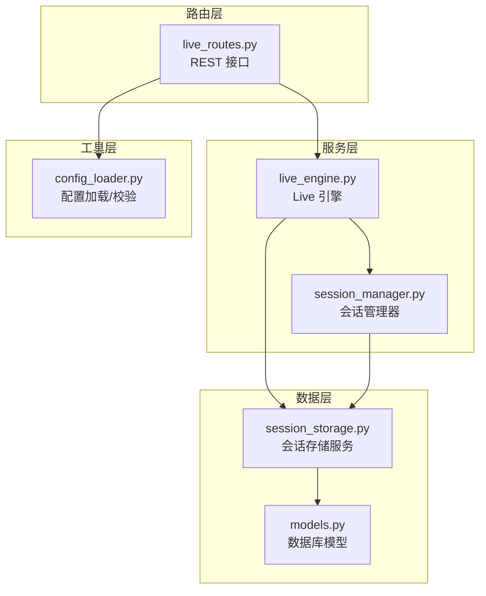
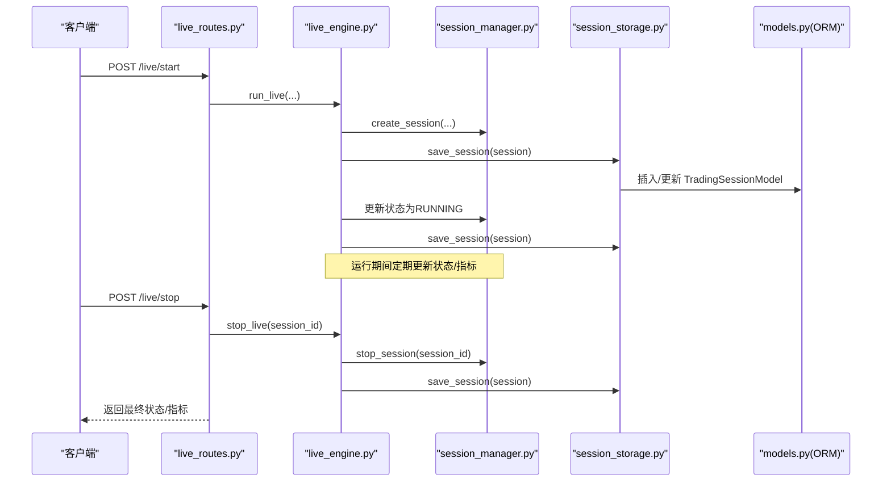
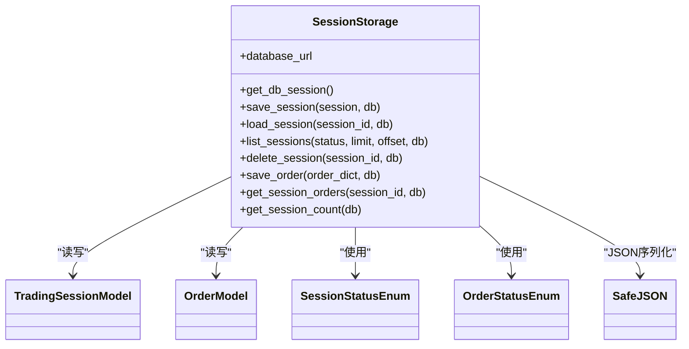
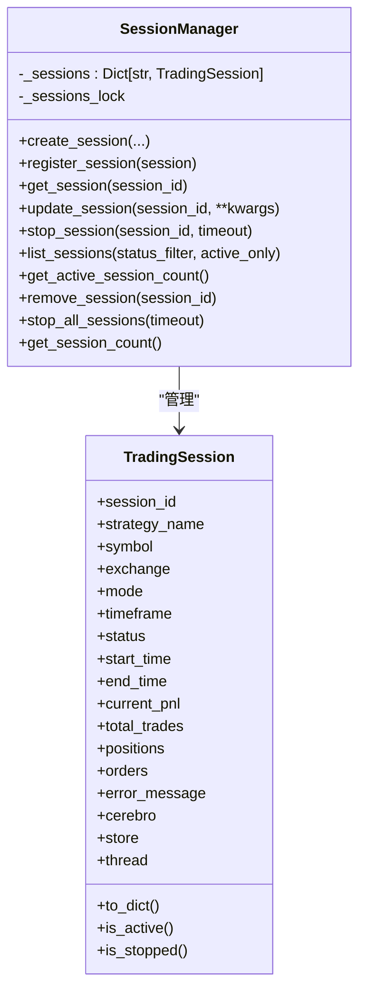
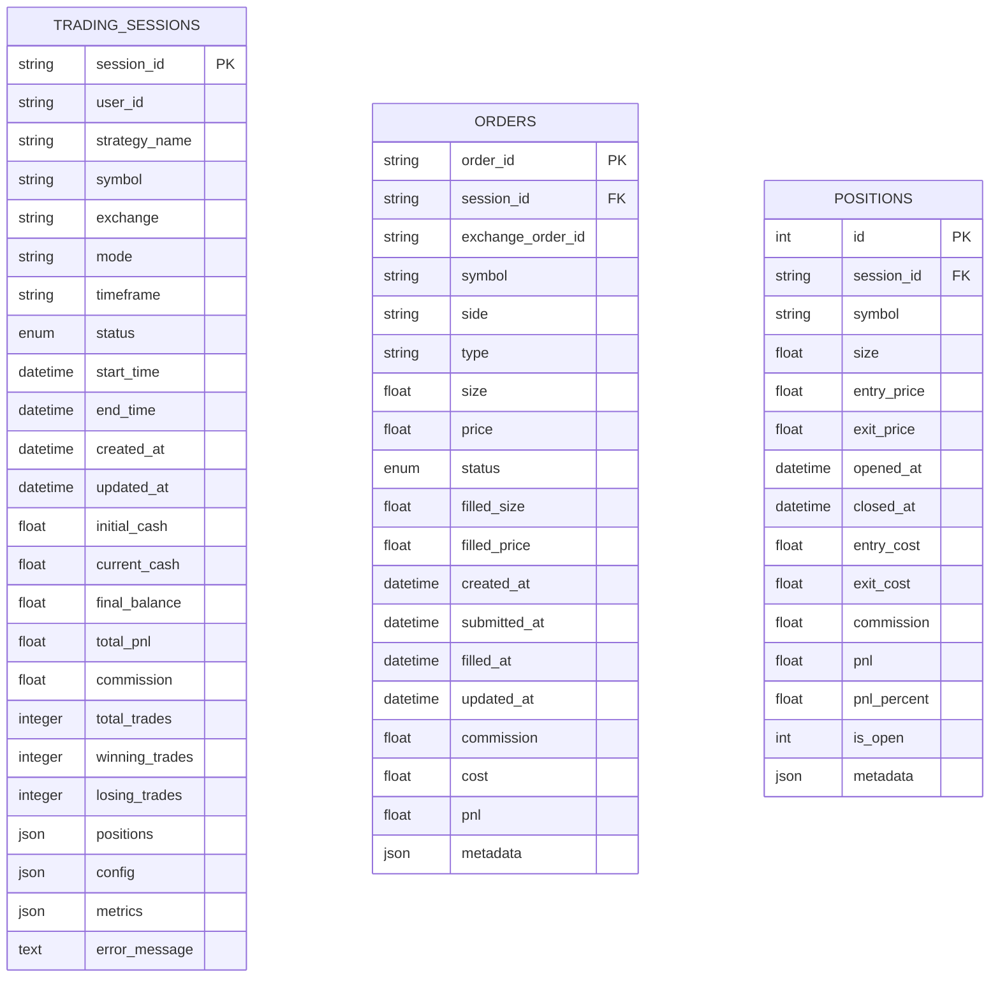
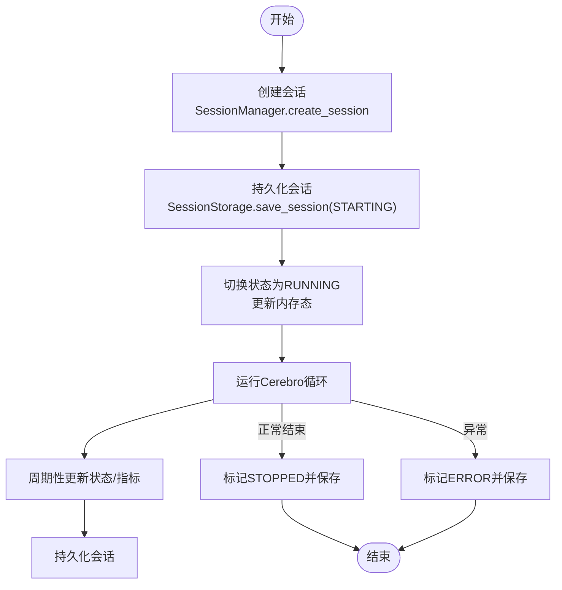
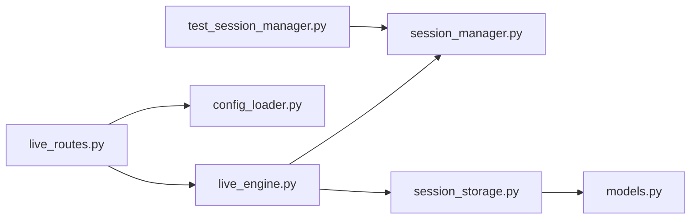

# 会话存储服务

<cite>
**本文引用的文件列表**
- [session_storage.py](file://backend/src/db/session_storage.py)
- [session_manager.py](file://backend/src/service/session_manager.py)
- [models.py](file://backend/src/db/models.py)
- [live_engine.py](file://backend/src/service/live_engine.py)
- [live_routes.py](file://backend/src/routes/live_routes.py)
- [config_loader.py](file://backend/src/utils/config_loader.py)
- [test_session_manager.py](file://auto_test/test_session_manager.py)
</cite>

## 目录
1. [引言](#引言)
2. [项目结构](#项目结构)
3. [核心组件](#核心组件)
4. [架构总览](#架构总览)
5. [详细组件分析](#详细组件分析)
6. [依赖关系分析](#依赖关系分析)
7. [性能考量](#性能考量)
8. [故障排查指南](#故障排查指南)
9. [结论](#结论)
10. [附录](#附录)

## 引言
本文件围绕会话存储服务（SessionStorage）展开，系统性解析其实现原理、与会话管理器（SessionManager）的协作方式、序列化与反序列化逻辑、生命周期管理策略（含超时与异常恢复）、以及在分布式场景下的扩展性与优化方向。同时结合实际运行流程说明系统重启后如何通过该服务恢复未完成的交易会话。

## 项目结构
会话存储服务位于数据库层，负责将交易会话、订单等状态持久化到数据库；会话管理器负责内存态的会话生命周期与并发控制；路由层提供REST接口；引擎层负责启动/停止会话并协调存储与管理器；配置加载模块提供交换所与风控参数校验。

图表来源
- [live_routes.py](file://backend/src/routes/live_routes.py#L1-L423)
- [live_engine.py](file://backend/src/service/live_engine.py#L1-L329)
- [session_manager.py](file://backend/src/service/session_manager.py#L1-L410)
- [session_storage.py](file://backend/src/db/session_storage.py#L1-L392)
- [models.py](file://backend/src/db/models.py#L1-L433)
- [config_loader.py](file://backend/src/utils/config_loader.py#L1-L343)

章节来源
- [live_routes.py](file://backend/src/routes/live_routes.py#L1-L423)
- [live_engine.py](file://backend/src/service/live_engine.py#L1-L329)
- [session_manager.py](file://backend/src/service/session_manager.py#L1-L410)
- [session_storage.py](file://backend/src/db/session_storage.py#L1-L392)
- [models.py](file://backend/src/db/models.py#L1-L433)
- [config_loader.py](file://backend/src/utils/config_loader.py#L1-L343)

## 核心组件
- 会话存储服务（SessionStorage）
  - 提供保存/加载会话、列出会话、删除会话、保存订单、查询会话订单、统计会话数量等能力。
  - 使用SQLAlchemy ORM映射至数据库模型，支持事务回滚与错误日志记录。
- 会话管理器（SessionManager）
  - 单例模式，线程安全地管理多个并发会话，提供创建、注册、更新、停止、统计等功能。
  - 内存态维护会话对象及其运行时属性（如Cerebro、Store、线程等），不参与序列化。
- 数据库模型（models.py）
  - 定义会话、订单、位置等表结构，包含枚举类型、JSON字段（SafeJSON）与索引设计。
- Live 引擎（live_engine.py）
  - 启动/停止会话，协调SessionManager与SessionStorage，更新状态并持久化。
- 路由（live_routes.py）
  - 对外暴露REST接口，调用Live引擎与SessionManager，返回标准化响应。
- 配置加载（config_loader.py）
  - 加载并校验broker配置，提供交换所信息、风控参数、时间框架校验等。

章节来源
- [session_storage.py](file://backend/src/db/session_storage.py#L1-L392)
- [session_manager.py](file://backend/src/service/session_manager.py#L1-L410)
- [models.py](file://backend/src/db/models.py#L1-L433)
- [live_engine.py](file://backend/src/service/live_engine.py#L1-L329)
- [live_routes.py](file://backend/src/routes/live_routes.py#L1-L423)
- [config_loader.py](file://backend/src/utils/config_loader.py#L1-L343)

## 架构总览
会话存储服务作为持久化层，贯穿会话的全生命周期：从创建、运行、异常/正常结束到历史查询与统计。Live引擎在关键节点调用SessionStorage保存状态；SessionManager负责内存态的生命周期与并发控制；路由层对外提供统一入口。

图表来源
- [live_routes.py](file://backend/src/routes/live_routes.py#L101-L182)
- [live_engine.py](file://backend/src/service/live_engine.py#L100-L266)
- [session_manager.py](file://backend/src/service/session_manager.py#L133-L291)
- [session_storage.py](file://backend/src/db/session_storage.py#L59-L123)
- [models.py](file://backend/src/db/models.py#L63-L121)

## 详细组件分析

### 会话存储服务（SessionStorage）
- 初始化与数据库连接
  - 通过工厂函数初始化数据库引擎与会话工厂，支持SQLite默认路径。
- 会话持久化
  - 保存会话：若存在则更新状态、时间戳、指标与JSON字段；否则插入新记录。
  - 加载会话：按session_id查询，转换为内存态TradingSession对象。
  - 列出会话：支持按状态过滤、分页排序。
  - 删除会话：按主键删除并返回布尔结果。
  - 统计会话数量：按状态聚合统计。
- 订单持久化
  - 保存订单：将字典映射为OrderModel并入库。
  - 查询会话订单：按session_id查询并返回标准化字典列表。
- 错误处理
  - 捕获异常、记录日志、回滚事务并抛出，确保数据一致性。

图表来源
- [session_storage.py](file://backend/src/db/session_storage.py#L27-L392)
- [models.py](file://backend/src/db/models.py#L43-L121)

章节来源
- [session_storage.py](file://backend/src/db/session_storage.py#L46-L123)
- [session_storage.py](file://backend/src/db/session_storage.py#L124-L234)
- [session_storage.py](file://backend/src/db/session_storage.py#L235-L268)
- [session_storage.py](file://backend/src/db/session_storage.py#L269-L360)
- [session_storage.py](file://backend/src/db/session_storage.py#L361-L392)

### 会话管理器（SessionManager）
- 单例模式与线程安全
  - 使用锁保证并发安全，避免重复创建同ID会话。
- 生命周期管理
  - 创建/注册会话、更新属性、停止会话（含优雅关闭与超时）、移除会话、统计状态与活跃数。
- 内存态对象
  - 会话对象包含运行时属性（Cerebro、Store、线程等），这些不参与持久化，仅用于运行期。
- 序列化与反序列化
  - 会话对象提供字典序列化方法，便于API响应与前端展示；数据库侧通过模型字段映射复杂结构（JSON）。

图表来源
- [session_manager.py](file://backend/src/service/session_manager.py#L96-L410)

章节来源
- [session_manager.py](file://backend/src/service/session_manager.py#L114-L132)
- [session_manager.py](file://backend/src/service/session_manager.py#L133-L187)
- [session_manager.py](file://backend/src/service/session_manager.py#L188-L204)
- [session_manager.py](file://backend/src/service/session_manager.py#L205-L237)
- [session_manager.py](file://backend/src/service/session_manager.py#L238-L292)
- [session_manager.py](file://backend/src/service/session_manager.py#L293-L351)
- [session_manager.py](file://backend/src/service/session_manager.py#L352-L396)

### 数据库模型（models.py）
- 会话模型（TradingSessionModel）
  - 字段覆盖配置、状态、时间戳、财务指标、JSON字段（positions、config、metrics）与错误信息。
  - 索引设计提升查询效率（session_id、status、symbol、exchange等）。
- 订单模型（OrderModel）
  - 字段覆盖订单详情、状态、填充细节、时间戳与金融指标。
- JSON字段（SafeJSON）
  - 自定义TypeDecorator，处理NULL与空字符串，提供安全的序列化/反序列化。
- 枚举类型（SessionStatusEnum、OrderStatusEnum）
  - 规范化状态值，确保跨模块一致。

图表来源
- [models.py](file://backend/src/db/models.py#L63-L121)
- [models.py](file://backend/src/db/models.py#L123-L173)
- [models.py](file://backend/src/db/models.py#L175-L211)
- [models.py](file://backend/src/db/models.py#L225-L254)

章节来源
- [models.py](file://backend/src/db/models.py#L23-L41)
- [models.py](file://backend/src/db/models.py#L43-L61)
- [models.py](file://backend/src/db/models.py#L63-L121)
- [models.py](file://backend/src/db/models.py#L123-L173)
- [models.py](file://backend/src/db/models.py#L175-L211)
- [models.py](file://backend/src/db/models.py#L225-L254)

### 会话生命周期管理策略
- 启动阶段
  - 路由层校验配置与模式，调用Live引擎创建会话并初始化组件。
  - 将会话写入数据库，标记为STARTING，随后切换为RUNNING并持续更新。
- 运行阶段
  - 引擎在后台线程运行Cerebro，期间可定期更新状态与指标，保存会话。
- 停止阶段
  - 路由层检查会话是否活动，调用SessionManager停止会话（优雅关闭Store与线程）。
  - 最终保存会话，返回状态与指标。
- 异常恢复
  - 引擎捕获异常，设置ERROR状态、记录错误消息与结束时间，并持久化。
  - SessionManager在停止失败时返回错误状态，便于上层重试或告警。

图表来源
- [live_engine.py](file://backend/src/service/live_engine.py#L148-L266)
- [session_manager.py](file://backend/src/service/session_manager.py#L238-L292)
- [session_storage.py](file://backend/src/db/session_storage.py#L59-L123)

章节来源
- [live_engine.py](file://backend/src/service/live_engine.py#L148-L266)
- [session_manager.py](file://backend/src/service/session_manager.py#L238-L292)
- [session_storage.py](file://backend/src/db/session_storage.py#L59-L123)

### 序列化与反序列化逻辑
- 用户身份与策略实例
  - 用户ID字段存在于会话模型中（可选），策略名称与配置通过JSON字段存储，便于跨模块传递。
- 运行参数与实时状态
  - 时间框架、初始资金、手续费、当前PnL、总交易数、持仓列表等均持久化。
  - 订单与位置通过独立模型持久化，支持按会话检索。
- 字段映射与兼容性
  - 使用SafeJSON处理NULL/空字符串，避免解析异常。
  - 枚举类型统一为字符串值，确保跨模块一致性。

章节来源
- [models.py](file://backend/src/db/models.py#L63-L121)
- [models.py](file://backend/src/db/models.py#L123-L173)
- [models.py](file://backend/src/db/models.py#L175-L211)
- [models.py](file://backend/src/db/models.py#L23-L41)
- [models.py](file://backend/src/db/models.py#L43-L61)

### 系统重启后的会话恢复
- 重启流程
  - 启动时加载数据库，SessionStorage初始化数据库引擎与会话工厂。
  - 可通过列出会话与订单接口获取历史状态，结合内存态会话对象进行恢复。
- 恢复要点
  - 若会话处于RUNNING且未被优雅停止，需在重启后重新建立连接与线程，并从数据库读取最后状态继续运行。
  - 订单与位置需从数据库重建，确保状态一致性。

章节来源
- [session_storage.py](file://backend/src/db/session_storage.py#L46-L58)
- [session_storage.py](file://backend/src/db/session_storage.py#L124-L172)
- [session_storage.py](file://backend/src/db/session_storage.py#L314-L360)

### 分布式环境下的扩展性与同步方案
- 当前实现
  - 默认使用本地SQLite数据库，适合单机部署。
- 扩展性限制
  - SQLite不具备高可用与强一致性的分布式特性。
- 优化方向
  - 使用PostgreSQL/MySQL等关系型数据库，启用主从复制与高可用集群。
  - 在SessionManager层面引入分布式锁（如Redis RedLock）以避免多节点竞态。
  - 通过消息队列（如Kafka/RabbitMQ）异步持久化订单与状态变更，降低写入延迟。
  - 引入会话心跳与健康检查，结合外部监控系统实现故障自动切换。

章节来源
- [session_storage.py](file://backend/src/db/session_storage.py#L35-L45)
- [live_routes.py](file://backend/src/routes/live_routes.py#L392-L423)

## 依赖关系分析
- 路由层依赖Live引擎与SessionManager，后者再依赖SessionStorage与数据库模型。
- 配置加载模块为路由层提供校验与参数，保障会话启动的合法性。
- 测试用例验证SessionManager的基本行为（创建、停止、批量停止）。

图表来源
- [live_routes.py](file://backend/src/routes/live_routes.py#L1-L423)
- [live_engine.py](file://backend/src/service/live_engine.py#L1-L329)
- [session_manager.py](file://backend/src/service/session_manager.py#L1-L410)
- [session_storage.py](file://backend/src/db/session_storage.py#L1-L392)
- [models.py](file://backend/src/db/models.py#L1-L433)
- [config_loader.py](file://backend/src/utils/config_loader.py#L1-L343)
- [test_session_manager.py](file://auto_test/test_session_manager.py#L1-L71)

章节来源
- [live_routes.py](file://backend/src/routes/live_routes.py#L1-L423)
- [live_engine.py](file://backend/src/service/live_engine.py#L1-L329)
- [session_manager.py](file://backend/src/service/session_manager.py#L1-L410)
- [session_storage.py](file://backend/src/db/session_storage.py#L1-L392)
- [models.py](file://backend/src/db/models.py#L1-L433)
- [config_loader.py](file://backend/src/utils/config_loader.py#L1-L343)
- [test_session_manager.py](file://auto_test/test_session_manager.py#L1-L71)

## 性能考量
- 数据库写入
  - 采用事务提交与回滚，避免部分写入导致的数据不一致。
  - JSON字段序列化/反序列化可能带来额外开销，建议在高频更新场景下减少不必要的字段写入。
- 查询优化
  - 模型已建立索引（如session_id、status、symbol、exchange），建议在高并发场景下使用分页与条件过滤。
- 并发控制
  - SessionManager使用RLock保证线程安全，避免竞态条件。
- I/O与网络
  - CCXT适配器与交易所交互可能成为瓶颈，建议在引擎层增加限流与重试策略。

## 故障排查指南
- 启动失败
  - 检查配置文件是否存在与格式正确，确认交换所启用与适配器支持。
  - 查看Live引擎异常日志，定位初始化组件失败原因。
- 停止失败
  - SessionManager在停止超时后返回False，需检查Store关闭与线程join情况。
- 数据库异常
  - SessionStorage捕获异常并回滚，查看日志定位具体SQL错误。
- 订单/位置缺失
  - 确认订单是否成功入库，必要时通过会话订单接口核对。

章节来源
- [config_loader.py](file://backend/src/utils/config_loader.py#L113-L170)
- [live_engine.py](file://backend/src/service/live_engine.py#L228-L247)
- [session_manager.py](file://backend/src/service/session_manager.py#L238-L292)
- [session_storage.py](file://backend/src/db/session_storage.py#L115-L123)
- [session_storage.py](file://backend/src/db/session_storage.py#L305-L312)

## 结论
会话存储服务通过清晰的持久化接口与严谨的错误处理，为实盘交易会话提供了可靠的状态保障。它与会话管理器紧密协作，在启动、运行、停止各阶段及时持久化状态，配合路由层提供完整的REST接口。尽管当前实现偏向单机部署，但通过数据库升级、分布式锁与消息队列等手段，可在分布式环境下进一步提升可用性与扩展性。

## 附录
- 关键流程参考
  - 启动流程：[live_routes.py](file://backend/src/routes/live_routes.py#L101-L169) → [live_engine.py](file://backend/src/service/live_engine.py#L148-L266) → [session_storage.py](file://backend/src/db/session_storage.py#L59-L123)
  - 停止流程：[live_routes.py](file://backend/src/routes/live_routes.py#L184-L254) → [live_engine.py](file://backend/src/service/live_engine.py#L268-L305) → [session_manager.py](file://backend/src/service/session_manager.py#L238-L292) → [session_storage.py](file://backend/src/db/session_storage.py#L59-L123)
- 测试参考
  - 会话管理器基本行为验证：[test_session_manager.py](file://auto_test/test_session_manager.py#L1-L71)