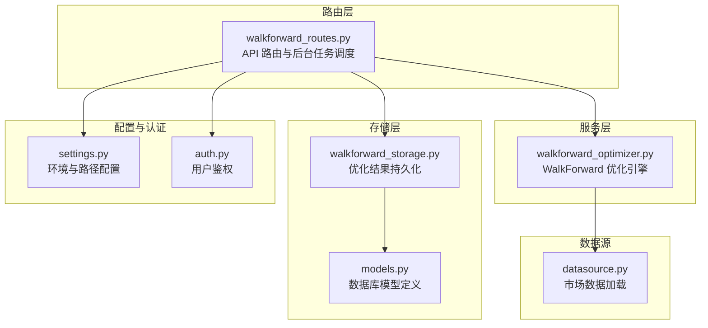
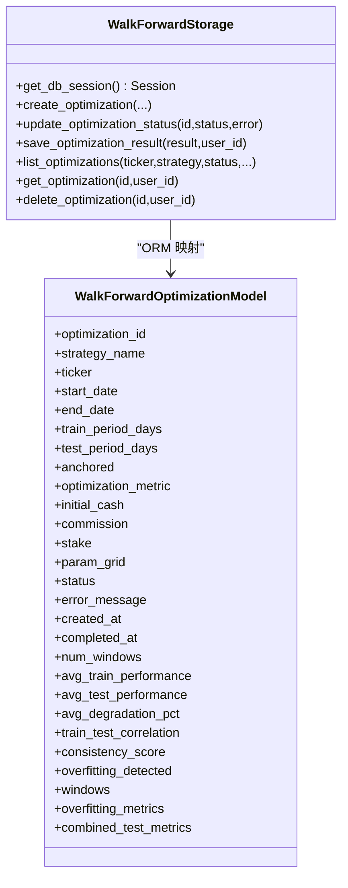
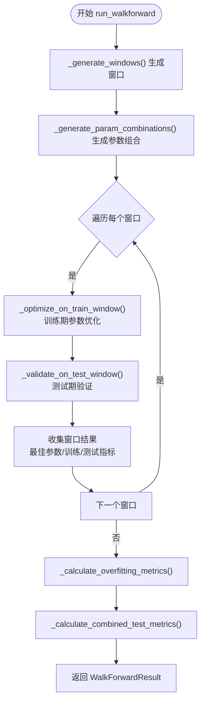
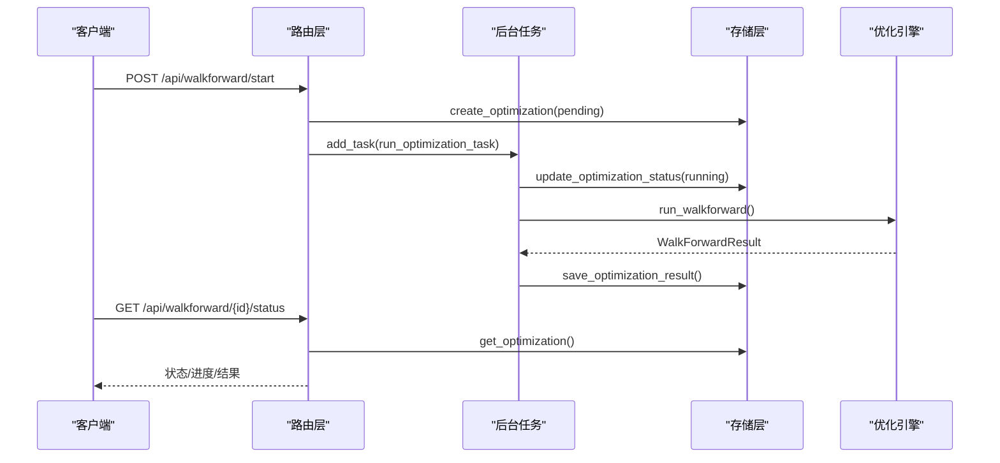
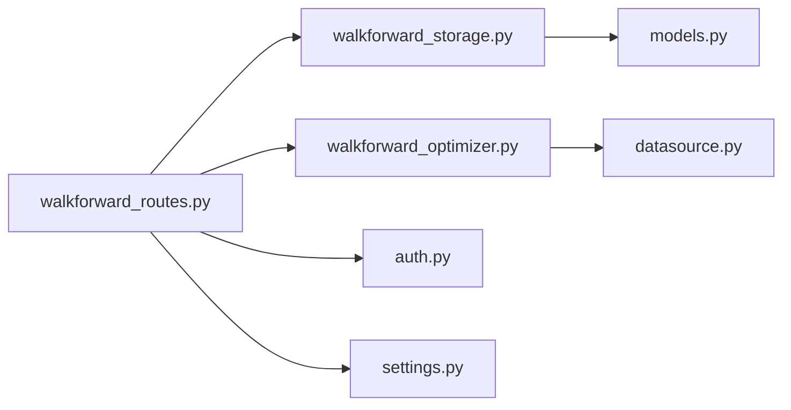

# 参数优化存储服务

<cite>
**本文引用的文件**
- [walkforward_storage.py](file://backend/src/db/walkforward_storage.py)
- [walkforward_optimizer.py](file://backend/src/service/walkforward_optimizer.py)
- [walkforward_routes.py](file://backend/src/routes/walkforward_routes.py)
- [models.py](file://backend/src/db/models.py)
- [datasource.py](file://backend/src/db/datasource.py)
- [settings.py](file://backend/src/config/settings.py)
- [auth.py](file://backend/src/utils/auth.py)
- [backtest_storage.py](file://backend/src/db/backtest_storage.py)
</cite>

## 目录
1. [简介](#简介)
2. [项目结构](#项目结构)
3. [核心组件](#核心组件)
4. [架构总览](#架构总览)
5. [详细组件分析](#详细组件分析)
6. [依赖关系分析](#依赖关系分析)
7. [性能考量](#性能考量)
8. [故障排查指南](#故障排查指南)
9. [结论](#结论)
10. [附录](#附录)

## 简介
本文件系统化解析 walkforward_storage.py 在参数优化流程中的角色，重点说明其如何支撑 WalkForward 优化过程的阶段性结果存储与读取；详细描述优化任务配置、子周期划分、参数组合评估结果以及最终优选参数集的存储结构设计；结合 walkforward_optimizer.py 的执行流程，分析该服务如何保证优化过程的可中断与可恢复性；最后给出存储层对大规模参数搜索空间的数据压缩策略与索引优化方法，并提供典型查询模式的性能调优建议。

## 项目结构
围绕“参数优化存储服务”的关键模块分布如下：
- 路由层：提供对外 API，负责接收请求、启动后台任务、返回状态与结果
- 服务层：实现 WalkForward 优化引擎，生成窗口、枚举参数组合、运行回测、计算过拟合指标
- 存储层：持久化优化任务与结果，提供创建、更新状态、保存完整结果、列表与详情查询、删除等能力
- 数据源：为回测提供数据馈源（优先数据库/本地缓存，其次 yfinance）
- 配置与认证：提供数据库连接、资源目录、登录开关、用户鉴权等基础能力



图表来源
- [walkforward_routes.py](file://backend/src/routes/walkforward_routes.py#L1-L120)
- [walkforward_optimizer.py](file://backend/src/service/walkforward_optimizer.py#L1-L120)
- [walkforward_storage.py](file://backend/src/db/walkforward_storage.py#L1-L120)
- [models.py](file://backend/src/db/models.py#L318-L391)
- [datasource.py](file://backend/src/db/datasource.py#L1-L120)
- [settings.py](file://backend/src/config/settings.py#L1-L81)
- [auth.py](file://backend/src/utils/auth.py#L1-L120)

章节来源
- [walkforward_routes.py](file://backend/src/routes/walkforward_routes.py#L1-L120)
- [walkforward_optimizer.py](file://backend/src/service/walkforward_optimizer.py#L1-L120)
- [walkforward_storage.py](file://backend/src/db/walkforward_storage.py#L1-L120)
- [models.py](file://backend/src/db/models.py#L318-L391)
- [datasource.py](file://backend/src/db/datasource.py#L1-L120)
- [settings.py](file://backend/src/config/settings.py#L1-L81)
- [auth.py](file://backend/src/utils/auth.py#L1-L120)

## 核心组件
- 存储层（WalkForwardStorage）：封装数据库操作，负责创建优化记录、更新状态、保存完整结果、分页列表、详情查询、删除等
- 优化引擎（WalkForwardOptimizer）：生成训练/测试窗口、枚举参数组合、运行单次回测、训练阶段最优参数选择、测试阶段验证、过拟合检测与汇总统计
- 路由层（walkforward_routes）：接收前端请求，生成优化 ID，写入待处理记录，启动后台任务，异步执行优化并在完成后落库
- 数据模型（models.py）：定义 walkforward_optimizations 表结构，含配置字段、结果摘要字段、完整 JSON 字段等
- 数据源（datasource.py）：为回测提供数据馈源，优先数据库/本地缓存，其次 yfinance，最后合成数据
- 配置与认证（settings.py、auth.py）：提供数据库 URL、资源目录、登录开关、用户鉴权等

章节来源
- [walkforward_storage.py](file://backend/src/db/walkforward_storage.py#L20-L120)
- [walkforward_optimizer.py](file://backend/src/service/walkforward_optimizer.py#L27-L120)
- [walkforward_routes.py](file://backend/src/routes/walkforward_routes.py#L120-L220)
- [models.py](file://backend/src/db/models.py#L318-L391)
- [datasource.py](file://backend/src/db/datasource.py#L1-L120)
- [settings.py](file://backend/src/config/settings.py#L1-L81)
- [auth.py](file://backend/src/utils/auth.py#L1-L120)

## 架构总览
下图展示从 API 到优化引擎再到存储层的端到端流程，以及状态流转与错误处理机制。

```mermaid
sequenceDiagram
participant FE as "前端"
participant API as "路由层<br/>walkforward_routes"
participant BG as "后台任务"
participant OPT as "优化引擎<br/>walkforward_optimizer"
participant STG as "存储层<br/>walkforward_storage"
participant DB as "数据库<br/>models"
FE->>API : POST /api/walkforward/start
API->>STG : create_optimization(初始化为 pending)
API->>BG : add_task(run_optimization_task)
BG->>STG : update_optimization_status(running)
BG->>OPT : run_walkforward(生成窗口/参数组合/回测)
OPT-->>BG : WalkForwardResult(包含所有窗口与指标)
BG->>STG : save_optimization_result(保存完整结果+摘要字段)
STG->>DB : 写入/更新记录
FE->>API : GET /api/walkforward/{id}/status
API->>STG : get_optimization(返回状态/进度/结果)
API-->>FE : 返回状态与结果
```

图表来源
- [walkforward_routes.py](file://backend/src/routes/walkforward_routes.py#L120-L220)
- [walkforward_routes.py](file://backend/src/routes/walkforward_routes.py#L66-L125)
- [walkforward_optimizer.py](file://backend/src/service/walkforward_optimizer.py#L341-L417)
- [walkforward_storage.py](file://backend/src/db/walkforward_storage.py#L33-L120)
- [walkforward_storage.py](file://backend/src/db/walkforward_storage.py#L164-L237)
- [models.py](file://backend/src/db/models.py#L318-L391)

## 详细组件分析

### 存储层 WalkForwardStorage：任务生命周期与结果持久化
- 初始化与会话管理
  - 使用 init_database 创建引擎与会话工厂，确保表存在
  - 提供 get_db_session 获取独立会话，避免跨线程共享
- 任务创建
  - create_optimization：写入优化配置、参数网格、窗口大小、锚定/滚动模式、优化指标、初始资金、手续费、头寸规模等；状态初始化为 pending
- 状态更新
  - update_optimization_status：支持 pending/running/completed/failed 四种状态；失败时记录错误信息；完成时写入 completed_at
- 结果保存
  - save_optimization_result：根据 WalkForwardResult 更新记录，包括：
    - 摘要字段：num_windows、avg_train_performance、avg_test_performance、avg_degradation_pct、train_test_correlation、consistency_score、overfitting_detected
    - 完整 JSON 字段：windows（每个窗口的训练/测试日期、最佳参数、训练/测试指标）、overfitting_metrics、combined_test_metrics
- 查询与分页
  - list_optimizations：支持按 ticker、strategy_name、status、user_id 过滤，按任意字段升/降序排序，分页返回 total 与列表
  - get_optimization：按 optimization_id 查询，支持 user_id 过滤；可选 include_full_results 返回完整 JSON
- 删除
  - delete_optimization：按 optimization_id 删除记录（无级联删除）



图表来源
- [walkforward_storage.py](file://backend/src/db/walkforward_storage.py#L20-L120)
- [walkforward_storage.py](file://backend/src/db/walkforward_storage.py#L164-L237)
- [models.py](file://backend/src/db/models.py#L318-L391)

章节来源
- [walkforward_storage.py](file://backend/src/db/walkforward_storage.py#L20-L120)
- [walkforward_storage.py](file://backend/src/db/walkforward_storage.py#L164-L237)
- [models.py](file://backend/src/db/models.py#L318-L391)

### 优化引擎 WalkForwardOptimizer：窗口生成、参数组合与评估
- 窗口生成
  - _generate_windows：基于 start_date/end_date 与 train_period_days/test_period_days 生成滚动或锚定窗口；滚动模式滑动测试窗口起点，锚定模式保持训练起点并延长训练期
- 参数组合
  - _generate_param_combinations：使用笛卡尔积生成所有参数组合；空网格返回单个空参数字典
- 单次回测
  - _run_single_backtest：构建 cerebro 实例，添加策略与数据馈源，设置资金、手续费、头寸规模，注册多个分析器（夏普比率、最大回撤、收益、交易、SQN），运行回测并提取指标
- 训练阶段优化
  - _optimize_on_train_window：遍历参数组合，运行回测，依据 optimization_metric 选择最佳参数与指标
- 测试阶段验证
  - _validate_on_test_window：使用训练阶段选出的最佳参数在测试窗口运行回测
- 结果汇总
  - run_walkforward：遍历所有窗口，收集每个窗口的最佳参数与训练/测试指标，计算 overfitting_metrics 与 combined_test_metrics，返回 WalkForwardResult
- 过拟合检测指标
  - _calculate_overfitting_metrics：计算训练/测试相关系数、平均表现、平均退化百分比、一致性得分、退化标准差，并判定是否过拟合
- 组合测试指标
  - _calculate_combined_test_metrics：汇总所有测试窗口的收益、夏普比率、最大回撤、交易数、胜率等



图表来源
- [walkforward_optimizer.py](file://backend/src/service/walkforward_optimizer.py#L116-L159)
- [walkforward_optimizer.py](file://backend/src/service/walkforward_optimizer.py#L161-L179)
- [walkforward_optimizer.py](file://backend/src/service/walkforward_optimizer.py#L274-L319)
- [walkforward_optimizer.py](file://backend/src/service/walkforward_optimizer.py#L321-L339)
- [walkforward_optimizer.py](file://backend/src/service/walkforward_optimizer.py#L341-L417)
- [walkforward_optimizer.py](file://backend/src/service/walkforward_optimizer.py#L419-L494)
- [walkforward_optimizer.py](file://backend/src/service/walkforward_optimizer.py#L495-L531)

章节来源
- [walkforward_optimizer.py](file://backend/src/service/walkforward_optimizer.py#L116-L159)
- [walkforward_optimizer.py](file://backend/src/service/walkforward_optimizer.py#L161-L179)
- [walkforward_optimizer.py](file://backend/src/service/walkforward_optimizer.py#L274-L319)
- [walkforward_optimizer.py](file://backend/src/service/walkforward_optimizer.py#L321-L339)
- [walkforward_optimizer.py](file://backend/src/service/walkforward_optimizer.py#L341-L417)
- [walkforward_optimizer.py](file://backend/src/service/walkforward_optimizer.py#L419-L494)
- [walkforward_optimizer.py](file://backend/src/service/walkforward_optimizer.py#L495-L531)

### 路由层：启动后台任务与状态查询
- 启动优化
  - start_walkforward_optimization：生成 optimization_id，写入数据库为 pending，通过 BackgroundTasks 异步执行 run_optimization_task
- 后台任务
  - run_optimization_task：更新状态为 running，实例化 WalkForwardOptimizer 并执行 run_walkforward，完成后保存结果；异常时更新状态为 failed 并记录错误
- 列表与详情
  - list_walkforward_optimizations：支持过滤、排序、分页
  - get_walkforward_optimization：返回优化详情（可包含完整 JSON）
- 删除
  - delete_walkforward_optimization：按 optimization_id 删除
- 状态查询
  - get_walkforward_status：返回状态、错误信息、进度信息（如 num_windows、时间戳）



图表来源
- [walkforward_routes.py](file://backend/src/routes/walkforward_routes.py#L129-L228)
- [walkforward_routes.py](file://backend/src/routes/walkforward_routes.py#L66-L125)
- [walkforward_routes.py](file://backend/src/routes/walkforward_routes.py#L282-L353)
- [walkforward_routes.py](file://backend/src/routes/walkforward_routes.py#L355-L399)

章节来源
- [walkforward_routes.py](file://backend/src/routes/walkforward_routes.py#L129-L228)
- [walkforward_routes.py](file://backend/src/routes/walkforward_routes.py#L66-L125)
- [walkforward_routes.py](file://backend/src/routes/walkforward_routes.py#L282-L353)
- [walkforward_routes.py](file://backend/src/routes/walkforward_routes.py#L355-L399)

### 数据模型与存储结构设计
- 表结构（walkforward_optimizations）
  - 基础配置：optimization_id、strategy_name、ticker、start_date、end_date、train_period_days、test_period_days、anchored、optimization_metric、initial_cash、commission、stake、param_grid
  - 时间戳：created_at、completed_at
  - 状态：status、error_message
  - 摘要字段（便于快速查询）：num_windows、avg_train_performance、avg_test_performance、avg_degradation_pct、train_test_correlation、consistency_score、overfitting_detected
  - 完整 JSON 字段：windows、overfitting_metrics、combined_test_metrics
- JSON 字段设计要点
  - windows：每个窗口包含 window_id、train_start/train_end/test_start/test_end、best_params、train_metrics、test_metrics、all_train_results
  - overfitting_metrics：包含 train_test_correlation、avg_train_performance、avg_test_performance、avg_degradation_pct、consistency_score、degradation_std、overfitting_detected
  - combined_test_metrics：汇总 across 所有测试窗口的指标
- 索引与查询优化
  - 主键与唯一索引：id、optimization_id
  - 多列过滤常用字段：strategy_name、ticker、status、user_id、created_at
  - 摘要字段用于排序与筛选：avg_test_performance、consistency_score 等

章节来源
- [models.py](file://backend/src/db/models.py#L318-L391)

### 可中断与可恢复性保障
- 后台任务与状态机
  - 路由层在创建记录后立即启动后台任务，任务中先将状态置为 running，再执行优化，完成后保存完整结果并置为 completed；若异常则置为 failed 并记录错误
  - 前端轮询 /api/walkforward/{id}/status 获取最新状态，支持断点续跑
- 数据一致性
  - 每个数据库操作均在独立会话内执行，异常时回滚并记录日志
  - 详情查询支持 user_id 过滤，保障多用户隔离
- 错误处理
  - 优化引擎在单次回测失败时返回兜底指标，避免整体失败
  - 路由层捕获异常并更新状态为 failed，便于前端提示

章节来源
- [walkforward_routes.py](file://backend/src/routes/walkforward_routes.py#L66-L125)
- [walkforward_routes.py](file://backend/src/routes/walkforward_routes.py#L355-L399)
- [walkforward_optimizer.py](file://backend/src/service/walkforward_optimizer.py#L257-L273)

### 数据压缩策略与索引优化
- 数据压缩策略
  - 使用 JSON 字段存储完整结果，避免冗余列；仅在必要处维护摘要字段以加速查询
  - 对于大规模参数搜索空间，建议：
    - 限制 param_grid 的维度与取值范围，减少笛卡尔积规模
    - 分批运行（例如按参数维度拆分），将多次运行结果合并为最终汇总
    - 仅保留关键窗口的 all_train_results，避免每窗口存储全部候选结果
- 索引优化
  - 已有索引：optimization_id、user_id、strategy_name、ticker、status、created_at
  - 建议新增索引（视业务需求）：avg_test_performance、consistency_score、overfitting_detected
  - 查询优化：利用 list_optimizations 的过滤与排序参数，尽量减少全表扫描
- 典型查询模式与调优建议
  - 列表查询（过滤+排序+分页）：优先使用已建立的索引字段；避免在 JSON 字段上做复杂查询
  - 详情查询：按 optimization_id 精确匹配；如需跨用户访问，确保 user_id 过滤
  - 状态轮询：前端定期轮询 /api/walkforward/{id}/status，避免频繁刷新导致数据库压力

章节来源
- [walkforward_storage.py](file://backend/src/db/walkforward_storage.py#L238-L308)
- [models.py](file://backend/src/db/models.py#L318-L391)

## 依赖关系分析
- 路由层依赖存储层与优化引擎
- 优化引擎依赖数据源与回测框架
- 存储层依赖数据库模型与初始化函数
- 配置与认证为路由层提供用户上下文与安全控制



图表来源
- [walkforward_routes.py](file://backend/src/routes/walkforward_routes.py#L1-L120)
- [walkforward_storage.py](file://backend/src/db/walkforward_storage.py#L1-L120)
- [walkforward_optimizer.py](file://backend/src/service/walkforward_optimizer.py#L1-L120)
- [datasource.py](file://backend/src/db/datasource.py#L1-L120)
- [models.py](file://backend/src/db/models.py#L318-L391)
- [auth.py](file://backend/src/utils/auth.py#L1-L120)
- [settings.py](file://backend/src/config/settings.py#L1-L81)

章节来源
- [walkforward_routes.py](file://backend/src/routes/walkforward_routes.py#L1-L120)
- [walkforward_storage.py](file://backend/src/db/walkforward_storage.py#L1-L120)
- [walkforward_optimizer.py](file://backend/src/service/walkforward_optimizer.py#L1-L120)
- [datasource.py](file://backend/src/db/datasource.py#L1-L120)
- [models.py](file://backend/src/db/models.py#L318-L391)
- [auth.py](file://backend/src/utils/auth.py#L1-L120)
- [settings.py](file://backend/src/config/settings.py#L1-L81)

## 性能考量
- 后台任务并发
  - 使用 BackgroundTasks 异步执行优化，避免阻塞主请求线程
- 数据库事务
  - 每个操作在独立会话内执行，异常回滚，减少锁竞争
- 查询优化
  - 利用现有索引字段进行过滤与排序；避免在 JSON 字段上做复杂条件
  - 列表接口支持 limit/offset 分页，控制单次返回量
- 数据源效率
  - 优先从数据库/本地缓存获取数据，减少外部依赖
- 指标计算
  - 过拟合指标与汇总指标在内存中计算，避免重复 IO

[本节为通用指导，不直接分析具体文件]

## 故障排查指南
- 优化任务未完成
  - 检查 /api/walkforward/{id}/status 是否为 failed，查看 error_message
  - 确认后台任务是否被正确加入队列
- 数据库异常
  - 查看存储层日志，确认 rollback 是否发生
  - 检查数据库连接字符串与表是否存在
- 数据源问题
  - 若回测失败，检查 datasource 加载顺序与异常分支（yfinance/fallback）
- 权限与用户隔离
  - 确认用户鉴权是否启用，查询时是否传入 user_id

章节来源
- [walkforward_routes.py](file://backend/src/routes/walkforward_routes.py#L355-L399)
- [walkforward_storage.py](file://backend/src/db/walkforward_storage.py#L114-L163)
- [datasource.py](file://backend/src/db/datasource.py#L70-L120)
- [auth.py](file://backend/src/utils/auth.py#L153-L191)

## 结论
walkforward_storage.py 作为参数优化流程的持久化核心，通过清晰的任务生命周期管理、合理的 JSON 结构设计与摘要字段索引，有效支撑了 WalkForward 优化过程的阶段性结果存储与读取。结合路由层的后台任务与状态机，系统实现了可中断与可恢复的优化执行；配合优化引擎的窗口生成与指标计算，形成了完整的参数优化闭环。针对大规模参数搜索空间，建议通过参数网格压缩、分批运行与索引优化来提升性能与稳定性。

[本节为总结性内容，不直接分析具体文件]

## 附录
- 相关文件与职责
  - 路由层：对外 API、后台任务调度、状态查询
  - 服务层：窗口生成、参数组合、回测运行、指标计算
  - 存储层：任务创建/更新/保存/查询/删除
  - 数据模型：表结构与字段设计
  - 数据源：市场数据加载
  - 配置与认证：数据库 URL、资源目录、登录开关、用户鉴权

章节来源
- [walkforward_routes.py](file://backend/src/routes/walkforward_routes.py#L1-L120)
- [walkforward_optimizer.py](file://backend/src/service/walkforward_optimizer.py#L1-L120)
- [walkforward_storage.py](file://backend/src/db/walkforward_storage.py#L1-L120)
- [models.py](file://backend/src/db/models.py#L318-L391)
- [datasource.py](file://backend/src/db/datasource.py#L1-L120)
- [settings.py](file://backend/src/config/settings.py#L1-L81)
- [auth.py](file://backend/src/utils/auth.py#L1-L120)