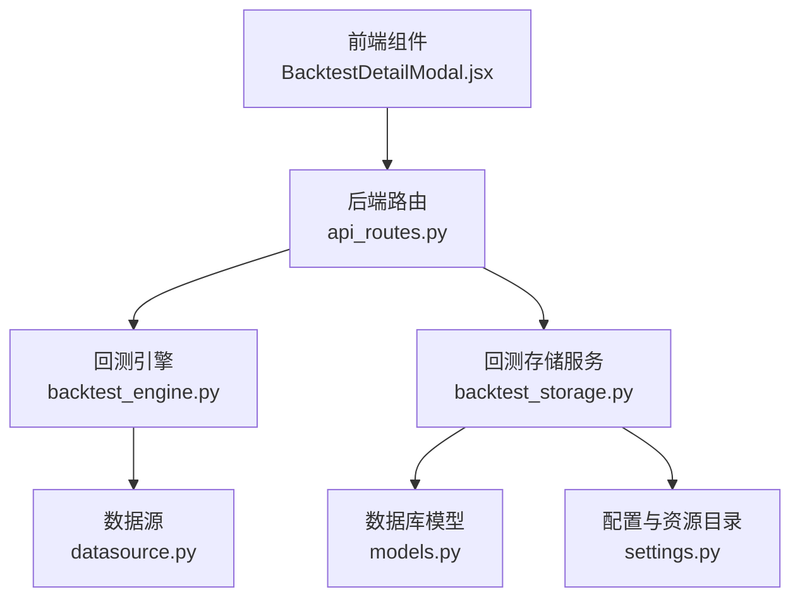
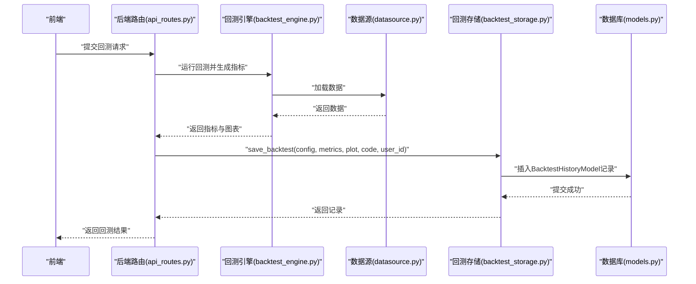
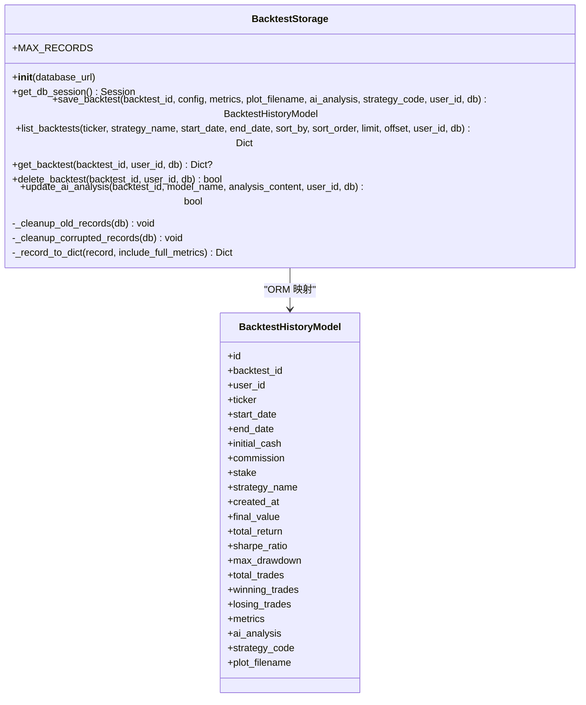
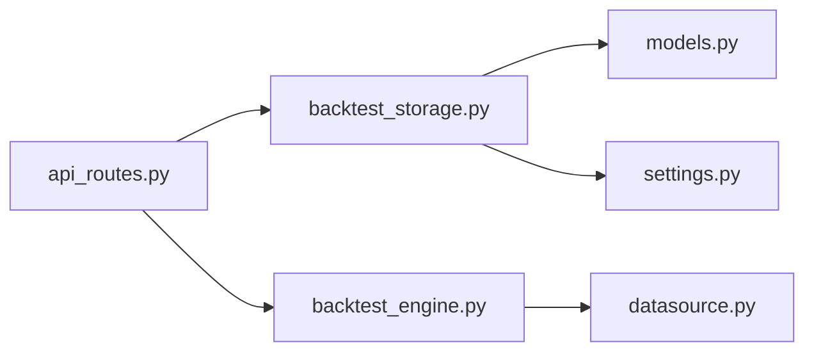

# 回测存储服务

<cite>
**本文引用的文件列表**
- [backtest_storage.py](file://backend/src/db/backtest_storage.py)
- [models.py](file://backend/src/db/models.py)
- [backtest_engine.py](file://backend/src/service/backtest_engine.py)
- [api_routes.py](file://backend/src/routes/api_routes.py)
- [settings.py](file://backend/src/config/settings.py)
- [datasource.py](file://backend/src/db/datasource.py)
- [BacktestDetailModal.jsx](file://frontend/src/components/BacktestHistory/BacktestDetailModal.jsx)
</cite>

## 目录
1. [简介](#简介)
2. [项目结构](#项目结构)
3. [核心组件](#核心组件)
4. [架构总览](#架构总览)
5. [组件详解](#组件详解)
6. [依赖关系分析](#依赖关系分析)
7. [性能与并发特性](#性能与并发特性)
8. [故障排查指南](#故障排查指南)
9. [结论](#结论)
10. [附录](#附录)

## 简介
本文件深入解析后端回测存储服务模块（backtest_storage.py），阐明其作为回测结果持久化层的核心职责与实现机制。重点包括：
- BacktestStorage 类如何通过 SQLAlchemy 与数据库交互，完成回测会话的创建、查询、更新与删除。
- 回测元数据（策略配置、时间范围、性能指标等）的存储结构设计，以及与 Backtrader 引擎的集成方式。
- 结合 models.py 中的数据模型，说明回测结果与交易记录的关联关系。
- 提供通过该服务保存与检索回测报告的实际调用路径与示例定位。
- 分析在高并发场景下的事务处理与锁机制优化策略建议。

## 项目结构
围绕回测存储服务的关键文件组织如下：
- 数据库模型与初始化：models.py 定义了 BacktestHistoryModel 及数据库初始化工具；settings.py 提供资源目录与环境变量。
- 回测引擎与交易记录：backtest_engine.py 使用 Backtrader 运行回测并生成完整指标，其中包含 TradeRecorder 自定义分析器用于收集交易明细。
- 存储服务：backtest_storage.py 实现回测历史的增删改查与自动清理。
- 接口路由：api_routes.py 将前端请求映射到存储服务方法。
- 前端集成：BacktestDetailModal.jsx 展示回测详情并触发 AI 分析与持久化。

图表来源
- [api_routes.py](file://backend/src/routes/api_routes.py#L228-L341)
- [backtest_engine.py](file://backend/src/service/backtest_engine.py#L180-L257)
- [backtest_storage.py](file://backend/src/db/backtest_storage.py#L1-L120)
- [models.py](file://backend/src/db/models.py#L257-L316)
- [settings.py](file://backend/src/config/settings.py#L1-L81)
- [datasource.py](file://backend/src/db/datasource.py#L70-L120)
- [BacktestDetailModal.jsx](file://frontend/src/components/BacktestHistory/BacktestDetailModal.jsx#L1-L82)

章节来源
- [backtest_storage.py](file://backend/src/db/backtest_storage.py#L1-L120)
- [models.py](file://backend/src/db/models.py#L257-L316)
- [backtest_engine.py](file://backend/src/service/backtest_engine.py#L180-L257)
- [api_routes.py](file://backend/src/routes/api_routes.py#L228-L341)
- [settings.py](file://backend/src/config/settings.py#L1-L81)
- [datasource.py](file://backend/src/db/datasource.py#L70-L120)
- [BacktestDetailModal.jsx](file://frontend/src/components/BacktestHistory/BacktestDetailModal.jsx#L1-L82)

## 核心组件
- BacktestStorage：回测历史持久化核心类，负责会话创建（保存）、查询（列表/单条）、更新（AI 分析）、删除（含图片清理）及自动清理旧记录。
- BacktestHistoryModel：ORM 模型，定义回测历史表结构，包含配置字段、关键指标字段（便于排序/筛选）、完整指标 JSON 字段、AI 分析 JSON 字段、策略代码快照与图片文件名。
- init_database：数据库引擎与会话工厂初始化，创建表并返回连接对象与会话构造器。
- TradeRecorder：Backtrader 自定义分析器，收集每笔交易的详细信息（开仓/平仓、盈亏、手续费、持仓时长等），并与回测引擎指标合并。

章节来源
- [backtest_storage.py](file://backend/src/db/backtest_storage.py#L22-L120)
- [models.py](file://backend/src/db/models.py#L257-L316)
- [backtest_engine.py](file://backend/src/service/backtest_engine.py#L99-L178)

## 架构总览
回测存储服务位于“服务层”与“数据访问层”之间，向上承接 API 路由与业务逻辑，向下对接 SQLAlchemy ORM 与数据库。其核心流程：
- 保存回测：API 路由接收请求，调用 BacktestStorage.save_backtest，将配置、指标、图片名、策略代码与用户标识写入数据库，并触发自动清理。
- 查询回测：API 路由调用 BacktestStorage.list_backtests 或 get_backtest，支持过滤、排序、分页与 JSON 损坏容错。
- 更新 AI 分析：API 路由调用 BacktestStorage.update_ai_analysis，以 JSON 字典形式追加多模型分析内容。
- 删除回测：API 路由调用 BacktestStorage.delete_backtest，删除记录并清理对应图片文件。

图表来源
- [api_routes.py](file://backend/src/routes/api_routes.py#L120-L146)
- [backtest_engine.py](file://backend/src/service/backtest_engine.py#L180-L257)
- [datasource.py](file://backend/src/db/datasource.py#L70-L120)
- [backtest_storage.py](file://backend/src/db/backtest_storage.py#L37-L107)
- [models.py](file://backend/src/db/models.py#L257-L316)

## 组件详解

### BacktestStorage 类
- 初始化与会话管理
  - 通过 init_database 创建数据库引擎与会话工厂，支持传入数据库 URL，默认使用本地 SQLite 文件。
  - 提供 get_db_session 获取独立会话，确保每个操作拥有独立事务上下文。
- 保存回测（save_backtest）
  - 将配置与指标提取为索引字段（如 total_return、sharpe_ratio）以便快速排序与筛选。
  - 将完整指标字典存入 metrics JSON 字段，策略代码快照存入 strategy_code，图片文件名存入 plot_filename。
  - 保存后立即触发 _cleanup_old_records，限制最大记录数（默认 100 条），并删除对应图片文件。
- 列表查询（list_backtests）
  - 支持按 ticker、strategy_name、日期范围、user_id 过滤。
  - 支持按 created_at、total_return、sharpe_ratio 排序，支持分页。
  - 若查询过程中因 JSON 解析异常导致失败，先尝试 _cleanup_corrupted_records 清理无效 JSON，再重试。
- 单条查询（get_backtest）
  - 支持 user_id 过滤，返回包含完整指标与 AI 分析的字典。
- 删除回测（delete_backtest）
  - 支持 user_id 过滤，删除记录并清理图片文件。
- 更新 AI 分析（update_ai_analysis）
  - 以 JSON 字典形式追加不同模型的分析内容，避免覆盖其他模型的分析。
- 辅助方法
  - _cleanup_old_records：按创建时间升序删除超出上限的历史记录。
  - _cleanup_corrupted_records：使用原生 SQL 删除 metrics 或 ai_analysis 为空或空字符串的记录。
  - _record_to_dict：将 ORM 记录转换为字典，必要时包含完整指标与 AI 分析。

图表来源
- [backtest_storage.py](file://backend/src/db/backtest_storage.py#L22-L444)
- [models.py](file://backend/src/db/models.py#L257-L316)

章节来源
- [backtest_storage.py](file://backend/src/db/backtest_storage.py#L22-L444)
- [models.py](file://backend/src/db/models.py#L257-L316)

### 数据模型与存储结构设计
- 表 backtest_history 的字段设计
  - 标识与用户：backtest_id（唯一索引）、user_id（索引）。
  - 配置参数：ticker、start_date、end_date、initial_cash、commission、stake、strategy_name。
  - 时间戳：created_at（索引）。
  - 关键指标（便于排序/筛选）：final_value、total_return（索引）、sharpe_ratio（索引）、max_drawdown、total_trades、winning_trades、losing_trades。
  - JSON 字段：metrics（完整指标）、ai_analysis（多模型分析字典）、strategy_code（策略代码快照）、plot_filename（图片文件名）。
- JSON 安全类型 SafeJSON
  - 处理 NULL 与空字符串，避免 ORM 层出现异常；在读取时尝试 JSON 解析，失败则返回 None，提升健壮性。
- 自动清理策略
  - 通过 MAX_RECORDS 限制历史数量，定期删除最旧记录并清理对应图片文件，防止磁盘膨胀。

章节来源
- [models.py](file://backend/src/db/models.py#L257-L316)
- [models.py](file://backend/src/db/models.py#L23-L41)

### 与 Backtrader 引擎的集成
- 指标生成
  - backtest_engine.py 使用 Backtrader 的内置分析器（如 SharpeRatio、DrawDown、Returns、AnnualReturn、SQN、TradeAnalyzer、TimeDrawDown）与自定义 TradeRecorder 收集交易明细，最终汇总为 metrics 字典。
- 图表输出
  - 在指定路径生成回测图表并保存为图片，文件名写入 backtest_storage.save_backtest 的 plot_filename 参数，同时在 models 中以字符串字段存储。
- 策略代码快照
  - 在保存时将策略源码快照写入 strategy_code 字段，便于后续审计与复现。

章节来源
- [backtest_engine.py](file://backend/src/service/backtest_engine.py#L180-L257)
- [backtest_storage.py](file://backend/src/db/backtest_storage.py#L37-L107)

### 回测结果与交易记录的关联关系
- 交易明细来源
  - TradeRecorder 在订单完成时记录每笔交易的开仓/平仓信息、盈亏、手续费、持仓时长等，并统计胜率、总盈亏等聚合指标。
- 指标合并
  - backtest_engine.py 将 TradeRecorder 的分析结果与 Backtrader 内置指标合并为 metrics 字典，随后由 backtest_storage 保存至数据库。
- 查询展示
  - 前端组件 BacktestDetailModal.jsx 从后端获取 metrics，展示交易明细与 AI 分析，并支持再次调用后端接口更新 AI 分析。

章节来源
- [backtest_engine.py](file://backend/src/service/backtest_engine.py#L99-L178)
- [BacktestDetailModal.jsx](file://frontend/src/components/BacktestHistory/BacktestDetailModal.jsx#L1-L82)

### API 调用示例定位
- 保存回测历史
  - 路由：POST /backtest/history
  - 调用链：api_routes.py -> backtest_storage.save_backtest
  - 示例路径：[保存回测历史调用](file://backend/src/routes/api_routes.py#L120-L146)
- 获取回测历史列表
  - 路由：POST /backtest/history
  - 调用链：api_routes.py -> backtest_storage.list_backtests
  - 示例路径：[列表查询调用](file://backend/src/routes/api_routes.py#L228-L258)
- 获取单条回测详情
  - 路由：GET /backtest/history/{backtest_id}
  - 调用链：api_routes.py -> backtest_storage.get_backtest
  - 示例路径：[单条查询调用](file://backend/src/routes/api_routes.py#L260-L283)
- 删除回测记录
  - 路由：DELETE /backtest/history/{backtest_id}
  - 调用链：api_routes.py -> backtest_storage.delete_backtest
  - 示例路径：[删除调用](file://backend/src/routes/api_routes.py#L285-L308)
- 更新 AI 分析
  - 路由：POST /backtest/history/{backtest_id}/ai-analysis
  - 调用链：api_routes.py -> backtest_storage.update_ai_analysis
  - 示例路径：[AI 分析更新调用](file://backend/src/routes/api_routes.py#L310-L341)

章节来源
- [api_routes.py](file://backend/src/routes/api_routes.py#L120-L146)
- [api_routes.py](file://backend/src/routes/api_routes.py#L228-L258)
- [api_routes.py](file://backend/src/routes/api_routes.py#L260-L283)
- [api_routes.py](file://backend/src/routes/api_routes.py#L285-L308)
- [api_routes.py](file://backend/src/routes/api_routes.py#L310-L341)

## 依赖关系分析
- 模块耦合
  - backtest_storage.py 依赖 models.py 的 BacktestHistoryModel 与 init_database，依赖 settings.py 的 IMAGES_DIR。
  - api_routes.py 依赖 backtest_storage.py 的持久化能力，依赖 backtest_engine.py 的指标生成。
  - backtest_engine.py 依赖 datasource.py 的数据加载。
- 外部依赖
  - SQLAlchemy：ORM 映射与事务控制。
  - Backtrader：回测引擎与分析器。
  - Matplotlib：图表渲染（保存为图片）。

图表来源
- [api_routes.py](file://backend/src/routes/api_routes.py#L228-L341)
- [backtest_storage.py](file://backend/src/db/backtest_storage.py#L1-L120)
- [models.py](file://backend/src/db/models.py#L257-L316)
- [settings.py](file://backend/src/config/settings.py#L1-L81)
- [backtest_engine.py](file://backend/src/service/backtest_engine.py#L180-L257)
- [datasource.py](file://backend/src/db/datasource.py#L70-L120)

章节来源
- [api_routes.py](file://backend/src/routes/api_routes.py#L228-L341)
- [backtest_storage.py](file://backend/src/db/backtest_storage.py#L1-L120)
- [models.py](file://backend/src/db/models.py#L257-L316)
- [settings.py](file://backend/src/config/settings.py#L1-L81)
- [backtest_engine.py](file://backend/src/service/backtest_engine.py#L180-L257)
- [datasource.py](file://backend/src/db/datasource.py#L70-L120)

## 性能与并发特性
- 事务与会话
  - 每个持久化操作均通过 get_db_session 创建独立会话，显式 commit/rollback，保证原子性与一致性。
- 索引与查询优化
  - 对 user_id、ticker、strategy_name、created_at、total_return、sharpe_ratio 等字段建立索引，提升过滤与排序效率。
- 自动清理
  - 通过 MAX_RECORDS 限制历史数量，减少查询扫描范围；删除记录时同步清理图片文件，降低 IO 压力。
- JSON 字段与容错
  - 使用 SafeJSON 类处理空值与异常 JSON，list_backtests 在 JSON 解析失败时自动清理并重试，提高鲁棒性。
- 高并发建议
  - 会话隔离：保持每个请求使用独立会话，避免跨请求共享状态。
  - 事务粒度：将批量写入拆分为小事务，减少锁持有时间。
  - 锁竞争缓解：对高频查询字段建立合适索引；对写入路径采用幂等更新（如 update_ai_analysis 已支持字典合并）。
  - 并发删除：删除图片文件前检查存在性，捕获异常并记录日志，避免阻塞主事务。
  - 缓存策略：对热点查询结果可考虑短期缓存（需注意数据一致性）。

章节来源
- [backtest_storage.py](file://backend/src/db/backtest_storage.py#L117-L182)
- [models.py](file://backend/src/db/models.py#L257-L316)
- [models.py](file://backend/src/db/models.py#L23-L41)

## 故障排查指南
- 保存失败
  - 现象：save_backtest 抛出异常并回滚。
  - 排查：检查数据库连接、表是否已创建、JSON 字段是否合法；查看日志中错误信息。
  - 参考路径：[保存回测异常处理](file://backend/src/db/backtest_storage.py#L109-L116)
- 查询失败（JSON 损坏）
  - 现象：list_backtests 查询抛出异常。
  - 排查：调用 _cleanup_corrupted_records 清理无效 JSON 后重试；确认 metrics/ai_analysis 字段完整性。
  - 参考路径：[查询异常与清理](file://backend/src/db/backtest_storage.py#L249-L258)
- 删除失败
  - 现象：delete_backtest 返回 False 或抛出异常。
  - 排查：确认 backtest_id 与 user_id 是否匹配；检查图片文件是否存在且可删除。
  - 参考路径：[删除回测异常处理](file://backend/src/db/backtest_storage.py#L345-L352)
- AI 分析更新失败
  - 现象：update_ai_analysis 返回 False。
  - 排查：确认 backtest_id 存在且 user_id 匹配；检查 ai_analysis JSON 字段是否被破坏。
  - 参考路径：[更新 AI 分析异常处理](file://backend/src/db/backtest_storage.py#L406-L413)

章节来源
- [backtest_storage.py](file://backend/src/db/backtest_storage.py#L109-L116)
- [backtest_storage.py](file://backend/src/db/backtest_storage.py#L249-L258)
- [backtest_storage.py](file://backend/src/db/backtest_storage.py#L345-L352)
- [backtest_storage.py](file://backend/src/db/backtest_storage.py#L406-L413)

## 结论
backtest_storage.py 通过清晰的类职责划分与完善的事务/索引/清理机制，构建了稳定可靠的回测历史持久化层。其与 Backtrader 引擎的深度集成使得回测结果、交易明细与可视化图表得以完整落库；配合 API 路由与前端组件，形成从运行到展示再到分析的闭环。在高并发场景下，建议进一步细化事务粒度、强化索引策略与缓存策略，以获得更优的吞吐与延迟表现。

## 附录
- 关键实现路径参考
  - 保存回测：[save_backtest](file://backend/src/db/backtest_storage.py#L37-L107)
  - 列表查询：[list_backtests](file://backend/src/db/backtest_storage.py#L183-L267)
  - 单条查询：[get_backtest](file://backend/src/db/backtest_storage.py#L268-L298)
  - 删除回测：[delete_backtest](file://backend/src/db/backtest_storage.py#L299-L352)
  - 更新 AI 分析：[update_ai_analysis](file://backend/src/db/backtest_storage.py#L353-L413)
  - 数据模型定义：[BacktestHistoryModel](file://backend/src/db/models.py#L257-L316)
  - JSON 安全类型：[SafeJSON](file://backend/src/db/models.py#L23-L41)
  - 回测引擎指标生成：[run_backtest](file://backend/src/service/backtest_engine.py#L180-L257)
  - 交易记录器：[TradeRecorder](file://backend/src/service/backtest_engine.py#L99-L178)
  - API 路由入口：[api_routes.py](file://backend/src/routes/api_routes.py#L228-L341)
  - 资源目录与图片路径：[settings.py](file://backend/src/config/settings.py#L1-L81)
  - 数据源加载：[datasource.py](file://backend/src/db/datasource.py#L70-L120)
  - 前端详情展示与 AI 分析：[BacktestDetailModal.jsx](file://frontend/src/components/BacktestHistory/BacktestDetailModal.jsx#L1-L82)