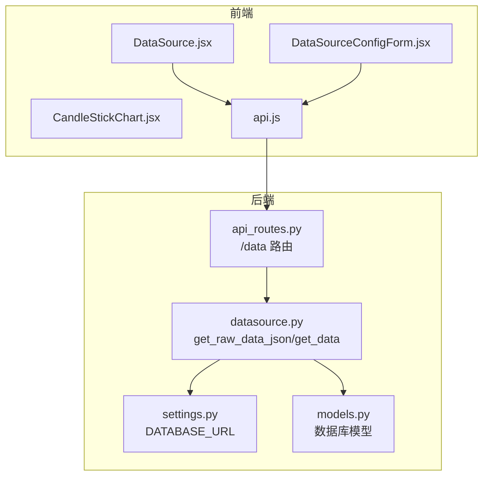
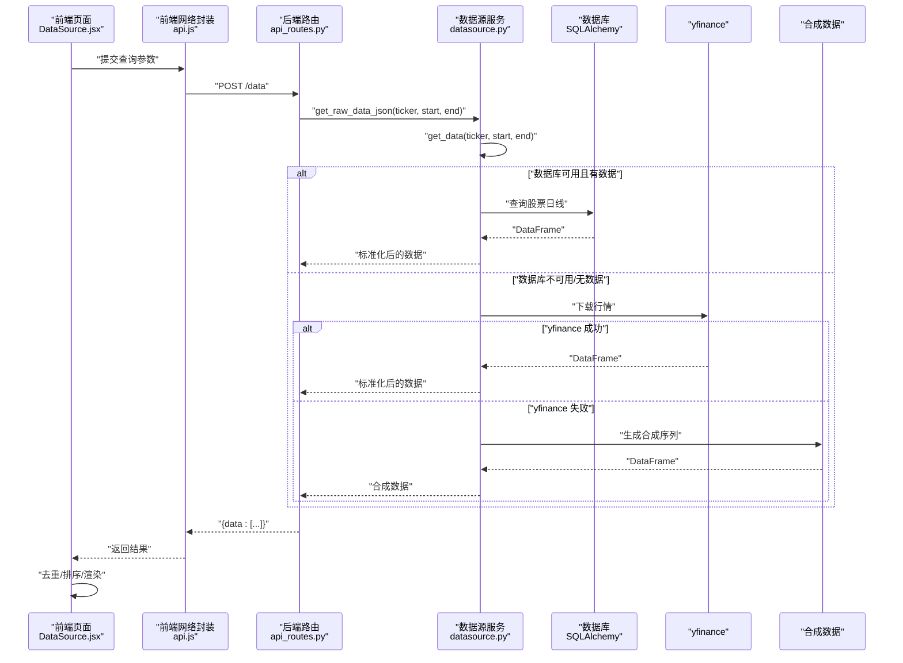
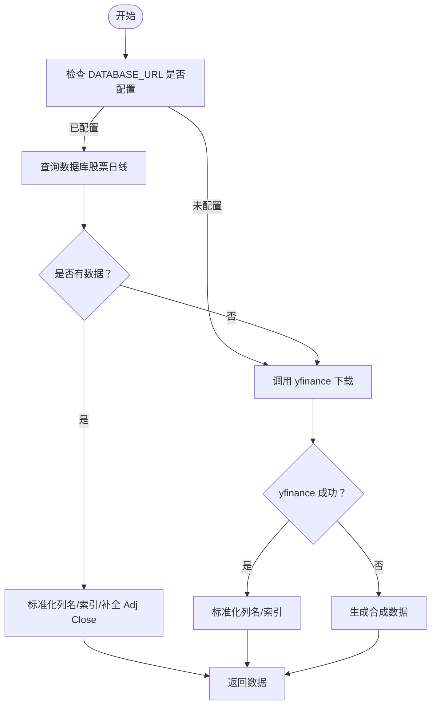
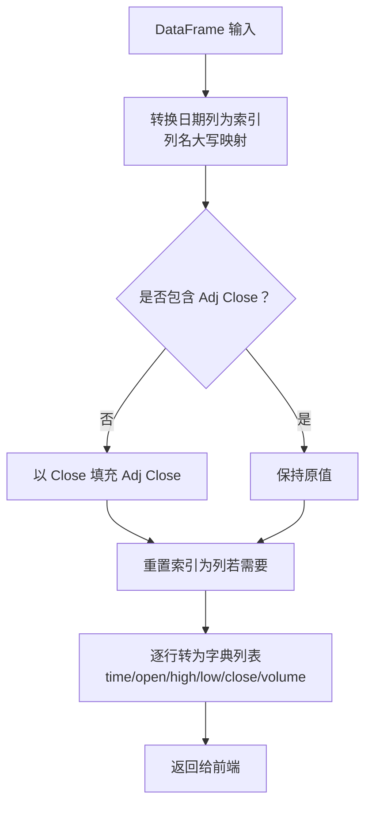
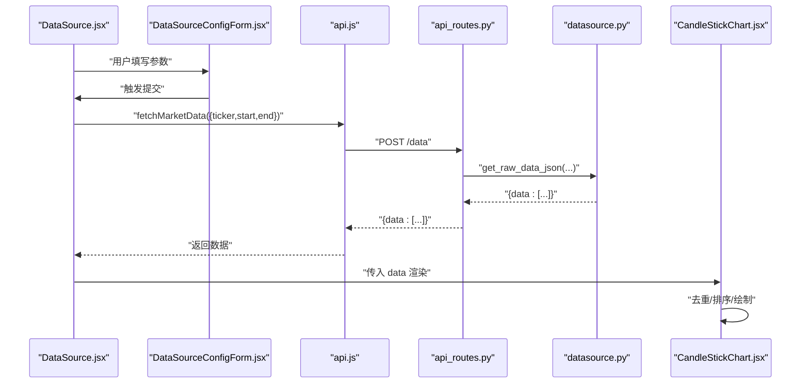
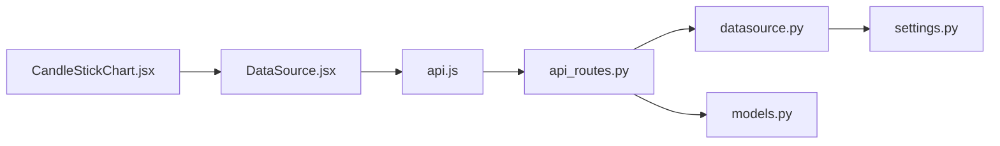

# 数据源服务

<cite>
**本文引用的文件列表**
- [datasource.py](file://backend/src/db/datasource.py)
- [api_routes.py](file://backend/src/routes/api_routes.py)
- [api.js](file://frontend/src/services/api.js)
- [DataSource.jsx](file://frontend/src/pages/DataSource.jsx)
- [DataSourceConfigForm.jsx](file://frontend/src/components/DataSource/DataSourceConfigForm.jsx)
- [CandleStickChart.jsx](file://frontend/src/components/DataSource/CandleStickChart.jsx)
- [settings.py](file://backend/src/config/settings.py)
- [models.py](file://backend/src/db/models.py)
</cite>

## 目录
1. [简介](#简介)
2. [项目结构](#项目结构)
3. [核心组件](#核心组件)
4. [架构总览](#架构总览)
5. [详细组件分析](#详细组件分析)
6. [依赖关系分析](#依赖关系分析)
7. [性能考量](#性能考量)
8. [故障排查指南](#故障排查指南)
9. [结论](#结论)
10. [附录](#附录)

## 简介
本文件深入剖析后端数据源服务在 datasource.py 中实现的“数据库→yfinance→合成数据”三级优先级机制，解释其数据请求路由、缓存策略、异常降级处理与数据格式标准化流程；并结合前端通过 api.js 调用后端接口的实际案例，分析高频请求下的性能瓶颈与应对措施（如数据预加载、批量获取与增量更新）。文档同时阐述该服务如何根据市场状态、时间周期与资产类型动态选择最优数据源，并保证数据连续性与一致性。

## 项目结构
围绕数据源服务的关键文件分布如下：
- 后端数据层：datasource.py 提供数据获取与格式化能力
- 后端路由层：api_routes.py 暴露 /data 接口，调用数据层
- 前端页面与组件：DataSource.jsx、DataSourceConfigForm.jsx、CandleStickChart.jsx
- 前端网络封装：api.js 封装请求构建、鉴权与响应解析
- 配置与模型：settings.py 提供 DATABASE_URL 等环境变量；models.py 定义数据库模型（用于历史回测等持久化）

图表来源
- [api_routes.py](file://backend/src/routes/api_routes.py#L68-L75)
- [datasource.py](file://backend/src/db/datasource.py#L114-L156)
- [settings.py](file://backend/src/config/settings.py#L31-L31)
- [models.py](file://backend/src/db/models.py#L257-L316)

章节来源
- [api_routes.py](file://backend/src/routes/api_routes.py#L68-L75)
- [datasource.py](file://backend/src/db/datasource.py#L114-L156)
- [settings.py](file://backend/src/config/settings.py#L31-L31)

## 核心组件
- 数据源优先级与路由
  - 优先级顺序：数据库（若配置可用）→ yfinance → 合成数据（降级）
  - 入口函数：get_data(ticker, start, end) 实现三段式获取与降级
- 数据格式标准化
  - 统一列名（Open/High/Low/Close/Volume/Adj Close）
  - 统一索引（日期），确保下游 Backtrader 与前端图表兼容
- 异常降级
  - 数据库失败或空数据时尝试 yfinance
  - yfinance 失败时生成单调递增的合成价格序列，保证流程不中断
- 前端对接
  - /data 接口返回前端所需的数组结构（含 time/open/high/low/close/volume）
  - 前端组件负责去重、排序与渲染

章节来源
- [datasource.py](file://backend/src/db/datasource.py#L16-L113)
- [datasource.py](file://backend/src/db/datasource.py#L114-L156)
- [api_routes.py](file://backend/src/routes/api_routes.py#L68-L75)

## 架构总览
下图展示从前端到后端再到数据源的完整调用链路与降级路径。

图表来源
- [api.js](file://frontend/src/services/api.js#L105-L111)
- [api_routes.py](file://backend/src/routes/api_routes.py#L68-L75)
- [datasource.py](file://backend/src/db/datasource.py#L70-L113)
- [datasource.py](file://backend/src/db/datasource.py#L114-L156)

## 详细组件分析

### 数据源优先级与降级机制
- 优先级策略
  - 若 DATABASE_URL 配置存在，则优先从数据库读取；否则跳过数据库阶段
  - 数据库为空或异常时，转而调用 yfinance 下载
  - yfinance 仍失败则生成合成数据作为最终兜底
- 关键点
  - 数据库查询按日期范围过滤并按日期升序返回
  - 标准化列名与索引，补齐 Adj Close 缺失字段
  - yfinance 返回可能为多级列索引，统一为单级列名
  - 合成数据使用工作日频率构造单调递增序列，避免空数据导致流程中断

图表来源
- [datasource.py](file://backend/src/db/datasource.py#L16-L113)

章节来源
- [datasource.py](file://backend/src/db/datasource.py#L16-L113)

### 数据格式标准化流程
- 列名规范化
  - 统一为 Open/High/Low/Close/Volume/Adj Close
  - 若缺失 Adj Close，以 Close 填充
- 索引与日期
  - 将 date 列转换为 datetime 并设置为索引，命名为 Date
- 前端 JSON 输出
  - 将 DataFrame 转换为包含 time/open/high/low/close/volume 的字典列表
  - 对日期列进行容错处理，确保输出格式一致

图表来源
- [datasource.py](file://backend/src/db/datasource.py#L46-L151)

章节来源
- [datasource.py](file://backend/src/db/datasource.py#L46-L151)

### 前端调用与渲染链路
- 页面交互
  - DataSource.jsx 提供表单输入（股票代码、起止日期）与提交按钮
  - 调用 api.fetchMarketData 发送 POST 请求至 /data
- 网络封装
  - api.js 统一封装鉴权头注入、错误码解析与 401 自动跳转登录
- 图表渲染
  - CandleStickChart.jsx 接收数据后进行去重、排序与渲染
  - 保证同一日期仅保留一条记录，按时间升序排列

图表来源
- [DataSource.jsx](file://frontend/src/pages/DataSource.jsx#L16-L39)
- [DataSourceConfigForm.jsx](file://frontend/src/components/DataSource/DataSourceConfigForm.jsx#L1-L99)
- [api.js](file://frontend/src/services/api.js#L105-L111)
- [api_routes.py](file://backend/src/routes/api_routes.py#L68-L75)
- [datasource.py](file://backend/src/db/datasource.py#L121-L156)
- [CandleStickChart.jsx](file://frontend/src/components/DataSource/CandleStickChart.jsx#L60-L73)

章节来源
- [DataSource.jsx](file://frontend/src/pages/DataSource.jsx#L16-L39)
- [DataSourceConfigForm.jsx](file://frontend/src/components/DataSource/DataSourceConfigForm.jsx#L1-L99)
- [api.js](file://frontend/src/services/api.js#L105-L111)
- [CandleStickChart.jsx](file://frontend/src/components/DataSource/CandleStickChart.jsx#L60-L73)

### 高频请求下的性能瓶颈与应对
- 瓶颈点
  - yfinance 远程下载：网络抖动、限流、超时
  - 合成数据生成：在极端失败场景下仍需构造大量数据
  - 前端渲染：大数据量时去重/排序/绘制成本上升
- 应对措施（建议）
  - 预加载策略：在用户切换时间段前，提前发起 /data 请求并缓存结果
  - 批量获取：合并多个时间段请求，减少往返次数
  - 增量更新：基于已有数据集，仅请求新增区间的增量数据
  - 前端优化：对大数据量采用虚拟滚动或分页渲染；在渲染前做本地去重与排序
  - 后端优化：在 get_data 内增加内存缓存（如 LRU）以复用近期相同参数的数据

[本节为通用性能建议，不直接分析具体文件，故不附加章节来源]

## 依赖关系分析
- 后端依赖
  - datasource.py 依赖 settings.DATABASE_URL 控制数据库可用性
  - api_routes.py 依赖 datasource.get_raw_data_json 提供 /data 接口
  - models.py 为历史回测等持久化提供模型，与当前数据源服务解耦
- 前端依赖
  - api.js 统一处理鉴权与错误码
  - DataSource.jsx 与组件负责参数收集与调用
  - CandleStickChart.jsx 负责数据清洗与可视化

图表来源
- [api_routes.py](file://backend/src/routes/api_routes.py#L68-L75)
- [datasource.py](file://backend/src/db/datasource.py#L114-L156)
- [settings.py](file://backend/src/config/settings.py#L31-L31)
- [models.py](file://backend/src/db/models.py#L257-L316)
- [api.js](file://frontend/src/services/api.js#L105-L111)
- [DataSource.jsx](file://frontend/src/pages/DataSource.jsx#L16-L39)
- [CandleStickChart.jsx](file://frontend/src/components/DataSource/CandleStickChart.jsx#L60-L73)

章节来源
- [api_routes.py](file://backend/src/routes/api_routes.py#L68-L75)
- [datasource.py](file://backend/src/db/datasource.py#L114-L156)
- [settings.py](file://backend/src/config/settings.py#L31-L31)
- [models.py](file://backend/src/db/models.py#L257-L316)
- [api.js](file://frontend/src/services/api.js#L105-L111)
- [DataSource.jsx](file://frontend/src/pages/DataSource.jsx#L16-L39)
- [CandleStickChart.jsx](file://frontend/src/components/DataSource/CandleStickChart.jsx#L60-L73)

## 性能考量
- 数据库访问
  - 使用连接池与参数化查询，避免重复创建引擎
  - 在高并发场景下，考虑对相同参数进行内存缓存（LRU）
- yfinance 下载
  - 设置合理的超时与重试策略
  - 对热点资产建立本地缓存，降低外部依赖
- 合成数据
  - 仅在极端失败时启用，避免频繁生成造成 CPU 占用
- 前端渲染
  - 对大数据量采用虚拟化或分页
  - 去重与排序在前端完成前先做本地预处理

[本节为通用性能建议，不直接分析具体文件，故不附加章节来源]

## 故障排查指南
- 数据库不可用
  - 现象：数据库查询返回空或异常
  - 处理：确认 DATABASE_URL 是否正确；检查数据库连通性与权限
- yfinance 下载失败
  - 现象：网络不稳定或接口限流
  - 处理：增加重试与退避；必要时启用合成数据兜底
- 合成数据启用
  - 现象：返回单调递增序列
  - 处理：检查上游数据源可用性；修复网络或配置问题
- 前端错误
  - 现象：401 未授权自动跳转登录
  - 处理：确认鉴权令牌有效；检查后端认证配置

章节来源
- [datasource.py](file://backend/src/db/datasource.py#L16-L113)
- [api.js](file://frontend/src/services/api.js#L55-L74)
- [api_routes.py](file://backend/src/routes/api_routes.py#L147-L151)

## 结论
该数据源服务通过“数据库→yfinance→合成数据”的三层优先级机制，在保证数据连续性与一致性的前提下，实现了对多种数据源的弹性适配。后端通过标准化的数据格式与清晰的降级路径，前端通过统一的请求封装与渲染优化，共同支撑了从历史回测到实时可视化的完整链路。针对高频请求，建议引入预加载、批量与增量更新策略，以进一步提升用户体验与系统吞吐。

## 附录
- 关键接口与职责
  - /data：接收 ticker/start_date/end_date，返回前端所需数组结构
  - get_data：实现三段式数据获取与降级
  - get_raw_data_json：将 DataFrame 转换为前端 JSON
- 前端调用示例路径
  - 页面提交：[DataSource.jsx](file://frontend/src/pages/DataSource.jsx#L16-L39)
  - 网络封装：[api.js](file://frontend/src/services/api.js#L105-L111)
  - 路由处理：[api_routes.py](file://backend/src/routes/api_routes.py#L68-L75)
  - 数据源实现：[datasource.py](file://backend/src/db/datasource.py#L70-L156)