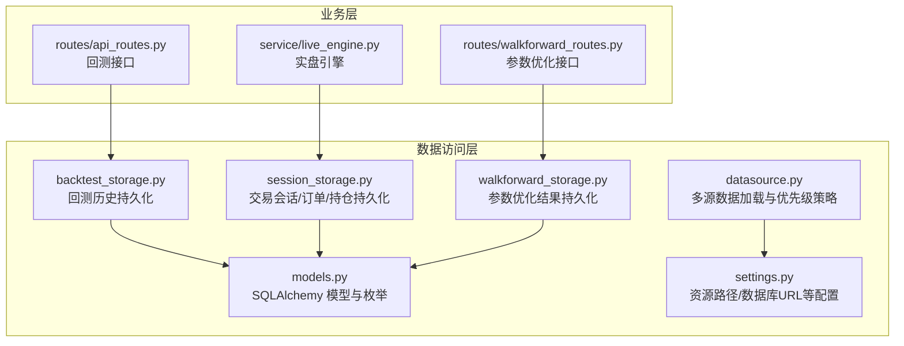
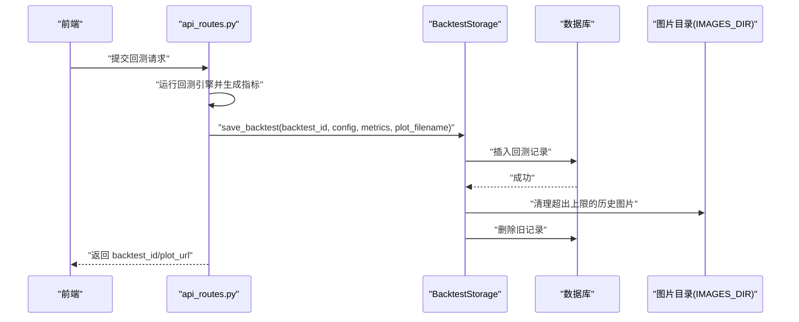
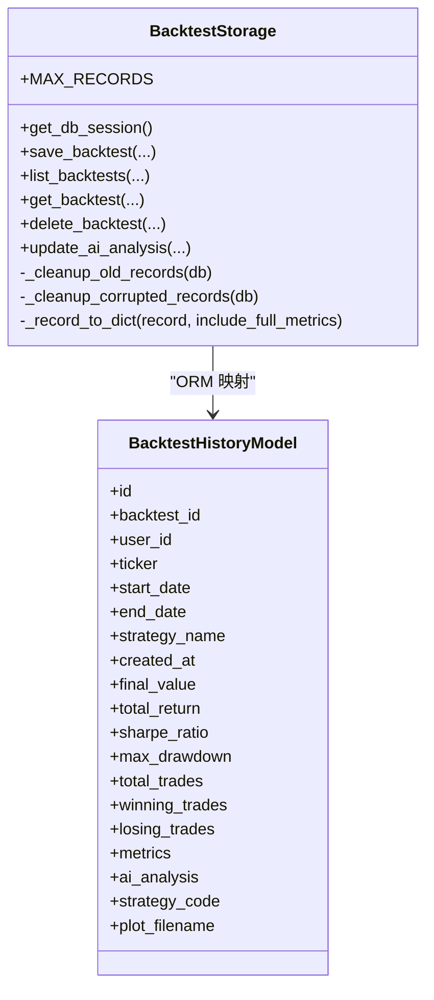
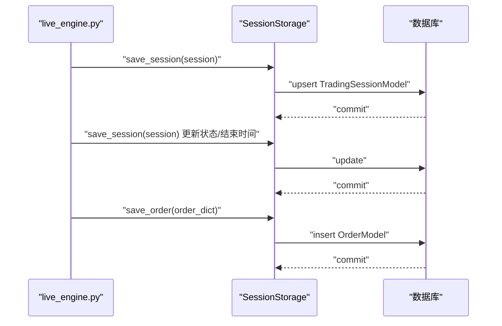
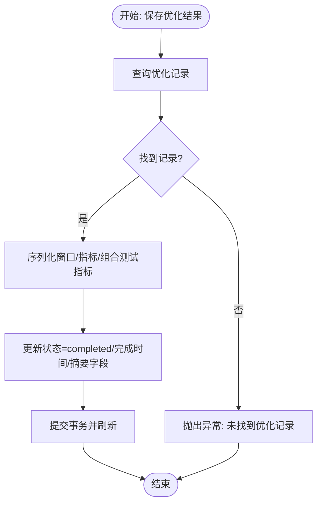
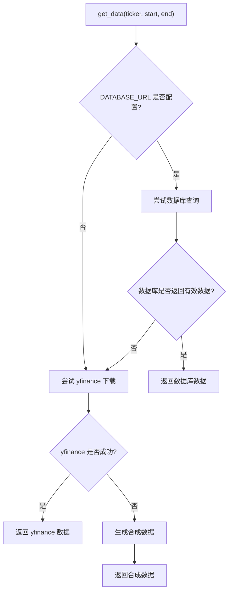
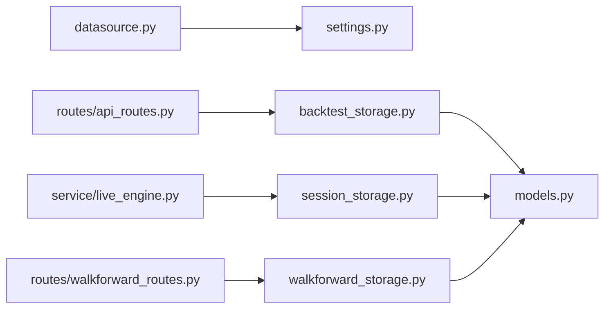

# 数据访问服务

<cite>
**本文引用的文件**
- [backtest_storage.py](file://backend/src/db/backtest_storage.py)
- [session_storage.py](file://backend/src/db/session_storage.py)
- [walkforward_storage.py](file://backend/src/db/walkforward_storage.py)
- [datasource.py](file://backend/src/db/datasource.py)
- [models.py](file://backend/src/db/models.py)
- [settings.py](file://backend/src/config/settings.py)
- [api_routes.py](file://backend/src/routes/api_routes.py)
- [live_engine.py](file://backend/src/service/live_engine.py)
- [walkforward_routes.py](file://backend/src/routes/walkforward_routes.py)
</cite>

## 目录
1. [引言](#引言)
2. [项目结构](#项目结构)
3. [核心组件](#核心组件)
4. [架构总览](#架构总览)
5. [详细组件分析](#详细组件分析)
6. [依赖分析](#依赖分析)
7. [性能考量](#性能考量)
8. [故障排查指南](#故障排查指南)
9. [结论](#结论)

## 引言
本文件系统性解析后端数据访问服务层的设计与实现，重点覆盖以下四个核心模块：
- backtest_storage.py：回测历史持久化与生命周期管理
- session_storage.py：交易会话（含订单、持仓）持久化与恢复
- walkforward_storage.py：参数优化（Walk-Forward）结果持久化
- datasource.py：多源数据加载与优先级策略（数据库→yfinance→合成数据）

文档将从职责划分、方法接口设计、异常处理机制、事务管理策略、协作关系与数据流等方面进行深入剖析，并提供可视化图示帮助理解。

## 项目结构
数据访问服务位于 backend/src/db 目录下，配合 models.py 定义数据库表结构，settings.py 提供资源路径与数据库连接信息，路由与服务层通过依赖注入或全局实例调用这些存储服务。

图表来源
- [backtest_storage.py](file://backend/src/db/backtest_storage.py#L1-L444)
- [session_storage.py](file://backend/src/db/session_storage.py#L1-L392)
- [walkforward_storage.py](file://backend/src/db/walkforward_storage.py#L1-L426)
- [datasource.py](file://backend/src/db/datasource.py#L1-L156)
- [models.py](file://backend/src/db/models.py#L1-L395)
- [settings.py](file://backend/src/config/settings.py#L1-L81)
- [api_routes.py](file://backend/src/routes/api_routes.py#L90-L123)
- [live_engine.py](file://backend/src/service/live_engine.py#L196-L230)
- [walkforward_routes.py](file://backend/src/routes/walkforward_routes.py#L22-L48)

章节来源
- [backtest_storage.py](file://backend/src/db/backtest_storage.py#L1-L444)
- [session_storage.py](file://backend/src/db/session_storage.py#L1-L392)
- [walkforward_storage.py](file://backend/src/db/walkforward_storage.py#L1-L426)
- [datasource.py](file://backend/src/db/datasource.py#L1-L156)
- [models.py](file://backend/src/db/models.py#L1-L395)
- [settings.py](file://backend/src/config/settings.py#L1-L81)

## 核心组件
- BacktestStorage：负责回测结果的保存、查询、删除、AI分析更新，以及自动清理旧记录与损坏数据的修复。
- SessionStorage：负责交易会话的创建/更新/查询/删除，订单与会话关联查询，会话计数统计。
- WalkForwardStorage：负责参数优化任务的创建、状态更新、完整结果保存、列表查询与删除。
- DataSource：提供多源数据加载，按“数据库→yfinance→合成数据”的优先级策略，确保在任何环境下都能返回可用数据。

章节来源
- [backtest_storage.py](file://backend/src/db/backtest_storage.py#L22-L444)
- [session_storage.py](file://backend/src/db/session_storage.py#L27-L392)
- [walkforward_storage.py](file://backend/src/db/walkforward_storage.py#L20-L426)
- [datasource.py](file://backend/src/db/datasource.py#L1-L156)

## 架构总览
数据访问层通过 SQLAlchemy 连接数据库，使用 models.py 中定义的模型映射到表结构。各存储服务均提供 get_db_session 获取会话，围绕单个操作封装 try/except/finally 的事务控制，确保失败时回滚并记录日志。

图表来源
- [api_routes.py](file://backend/src/routes/api_routes.py#L90-L123)
- [backtest_storage.py](file://backend/src/db/backtest_storage.py#L37-L116)
- [settings.py](file://backend/src/config/settings.py#L1-L81)

## 详细组件分析

### BacktestStorage 组件分析
- 职责划分
  - 回测结果持久化：保存配置、指标、AI分析、策略代码快照、绘图文件名。
  - 历史查询：按条件过滤、排序、分页；支持包含完整指标与AI分析的详情查询。
  - 生命周期管理：自动清理超过上限的历史记录，并删除对应图片文件；对损坏JSON的记录进行清理。
  - AI分析增量更新：为同一回测记录追加多模型的分析内容。
- 方法接口设计
  - save_backtest：保存回测记录并触发自动清理。
  - list_backtests：支持用户维度过滤、日期范围、排序字段与方向、分页。
  - get_backtest：按ID与可选用户ID查询详情。
  - delete_backtest：删除记录并清理图片。
  - update_ai_analysis：以键值对形式追加/更新AI分析。
  - 内部清理：_cleanup_old_records、_cleanup_corrupted_records。
- 异常处理机制
  - 每个公共方法内部捕获异常，记录错误日志，执行回滚，必要时抛出异常。
  - 查询阶段若因JSON损坏导致ORM读取失败，先尝试清理再重试。
- 事务管理策略
  - 手动开启/关闭数据库会话；每个操作在 try/finally 中确保关闭。
  - commit 成功后 refresh 记录，保证返回对象与数据库一致。
- 性能特性
  - 使用索引字段（如 created_at、strategy_name、ticker）加速查询。
  - denormalized 字段（如 total_return、sharpe_ratio）便于排序与筛选。
  - 自动清理上限避免历史数据膨胀。

图表来源
- [backtest_storage.py](file://backend/src/db/backtest_storage.py#L22-L444)
- [models.py](file://backend/src/db/models.py#L257-L316)

章节来源
- [backtest_storage.py](file://backend/src/db/backtest_storage.py#L22-L444)
- [models.py](file://backend/src/db/models.py#L257-L316)

### SessionStorage 组件分析
- 职责划分
  - 交易会话持久化：保存/更新会话状态、时间戳、资金与交易统计、位置信息与错误消息。
  - 会话查询：按状态、分页列出会话；按ID加载会话并转换为业务对象。
  - 会话删除：按ID删除会话。
  - 订单管理：保存订单；按会话ID查询所有订单。
  - 会话计数：按状态统计数量与总数。
- 方法接口设计
  - save_session：根据是否存在同ID记录决定新增或更新。
  - load_session：按ID查询并转换为业务对象。
  - list_sessions：支持状态过滤、分页。
  - delete_session：按ID删除。
  - save_order：保存订单。
  - get_session_orders：按会话ID返回订单字典列表。
  - get_session_count：统计各状态数量。
- 异常处理机制
  - 每个方法捕获异常、记录日志、回滚并抛出或返回False。
- 事务管理策略
  - 每次操作独立开启/关闭会话，确保幂等与一致性。
- 协作关系
  - 与 models.py 中的 TradingSessionModel、OrderModel、SessionStatusEnum、OrderStatusEnum 对应。
  - 在 live_engine.py 中由实盘引擎在启动/停止/异常时调用保存会话。

图表来源
- [live_engine.py](file://backend/src/service/live_engine.py#L196-L230)
- [session_storage.py](file://backend/src/db/session_storage.py#L59-L123)
- [session_storage.py](file://backend/src/db/session_storage.py#L269-L313)
- [models.py](file://backend/src/db/models.py#L63-L173)

章节来源
- [session_storage.py](file://backend/src/db/session_storage.py#L27-L392)
- [models.py](file://backend/src/db/models.py#L63-L173)
- [live_engine.py](file://backend/src/service/live_engine.py#L196-L230)

### WalkForwardStorage 组件分析
- 职责划分
  - 优化任务生命周期：创建（初始状态 pending）、状态更新（running/completed/failed）、删除。
  - 结果持久化：保存完整窗口结果、过拟合检测指标、组合测试指标等。
  - 列表查询：支持按资产、策略、状态过滤，排序与分页。
  - 详情查询：按ID查询并可选择包含完整结果。
- 方法接口设计
  - create_optimization：创建优化任务并设置初始状态。
  - update_optimization_status：更新状态与错误信息，完成时写入完成时间。
  - save_optimization_result：将 WalkForwardResult 转换为序列化格式并写入。
  - list_optimizations：过滤+排序+分页。
  - get_optimization：按ID查询详情。
  - delete_optimization：按ID删除。
- 异常处理机制
  - 捕获异常、记录日志、回滚并返回 False 或抛出异常。
- 事务管理策略
  - 每个操作独立事务，commit 后 refresh 确保返回最新记录。
- 数据模型
  - 与 models.py 中的 WalkForwardOptimizationModel 对应，包含 denormalized 摘要字段与 JSON 结果字段。

图表来源
- [walkforward_storage.py](file://backend/src/db/walkforward_storage.py#L164-L237)
- [models.py](file://backend/src/db/models.py#L318-L391)

章节来源
- [walkforward_storage.py](file://backend/src/db/walkforward_storage.py#L20-L426)
- [models.py](file://backend/src/db/models.py#L318-L391)

### DataSource 组件分析
- 职责划分
  - 多源数据加载：优先从数据库读取，其次从 yfinance 下载，最后生成合成数据作为兜底。
  - 数据标准化：统一列名、索引、缺失值处理，确保下游 Backtrader 可用。
  - 接口适配：提供 pandas DataFrame、Backtrader Feed、原始 JSON 列表三种输出形态。
- 优先级策略实现逻辑
  - get_data：按数据库→yfinance→合成数据顺序尝试，任一成功即返回。
  - get_data_from_db：基于 DATABASE_URL 读取 stock_prices 表，按日期范围排序并标准化。
  - yfinance 下载：自动调整多级列名，空数据抛出 DataLoadError。
  - 合成数据：在无有效数据时生成单调递增价格序列，保证流程不中断。
- 异常处理机制
  - 数据库/网络异常时记录警告并降级；DataLoadError 用于明确“无数据”场景。
- 应用场景
  - 在回测与实时交易中均可使用，确保在不同环境（离线/在线/开发）下稳定运行。

图表来源
- [datasource.py](file://backend/src/db/datasource.py#L1-L156)
- [settings.py](file://backend/src/config/settings.py#L1-L81)

章节来源
- [datasource.py](file://backend/src/db/datasource.py#L1-L156)
- [settings.py](file://backend/src/config/settings.py#L1-L81)

## 依赖分析
- 存储服务与模型
  - BacktestStorage ↔ BacktestHistoryModel
  - SessionStorage ↔ TradingSessionModel、OrderModel、SessionStatusEnum、OrderStatusEnum
  - WalkForwardStorage ↔ WalkForwardOptimizationModel
- 配置依赖
  - datasource.py 依赖 settings.DATABASE_URL 与 IMAGES_DIR（在回测存储中用于清理图片）
- 路由与服务层集成
  - api_routes.py 在回测完成后调用 BacktestStorage 保存结果
  - live_engine.py 在会话启动/运行/停止/异常时调用 SessionStorage 保存会话
  - walkforward_routes.py 初始化 WalkForwardStorage 并驱动参数优化流程

图表来源
- [datasource.py](file://backend/src/db/datasource.py#L1-L156)
- [settings.py](file://backend/src/config/settings.py#L1-L81)
- [backtest_storage.py](file://backend/src/db/backtest_storage.py#L1-L444)
- [session_storage.py](file://backend/src/db/session_storage.py#L1-L392)
- [walkforward_storage.py](file://backend/src/db/walkforward_storage.py#L1-L426)
- [models.py](file://backend/src/db/models.py#L1-L395)
- [api_routes.py](file://backend/src/routes/api_routes.py#L90-L123)
- [live_engine.py](file://backend/src/service/live_engine.py#L196-L230)
- [walkforward_routes.py](file://backend/src/routes/walkforward_routes.py#L22-L48)

章节来源
- [models.py](file://backend/src/db/models.py#L1-L395)
- [settings.py](file://backend/src/config/settings.py#L1-L81)
- [api_routes.py](file://backend/src/routes/api_routes.py#L90-L123)
- [live_engine.py](file://backend/src/service/live_engine.py#L196-L230)
- [walkforward_routes.py](file://backend/src/routes/walkforward_routes.py#L22-L48)

## 性能考量
- 索引与查询优化
  - 回测历史：按 created_at、strategy_name、ticker、total_return、sharpe_ratio 建立索引，提升排序与筛选效率。
  - 会话/订单：按 session_id、status、symbol、created_at 建立索引，支持高频查询。
  - 优化任务：按 created_at、status、strategy_name、ticker 建立索引，支持快速筛选。
- 数据冗余与 denormalization
  - 回测历史与优化任务中存储常用排序/筛选字段（如 total_return、sharpe_ratio、avg_*），减少复杂查询成本。
- 自动清理
  - 回测历史限制最大记录数并删除对应图片，避免磁盘与查询膨胀。
- JSON 字段处理
  - 使用 SafeJSON 类型装饰器，优雅处理 NULL/空字符串与反序列化异常，降低上层处理复杂度。
- 事务与并发
  - 每个操作独立事务，避免长事务锁竞争；在高并发场景建议结合连接池与重试策略。

[本节为通用性能讨论，无需具体文件引用]

## 故障排查指南
- 数据库连接问题
  - 检查 DATABASE_URL 是否正确配置；确认数据库可达且表已初始化。
  - 若出现 JSON 反序列化错误，回测/优化查询会自动清理损坏记录并重试。
- 图片清理失败
  - 当清理历史回测图片失败时，日志会记录警告；可手动检查 IMAGES_DIR 权限与磁盘空间。
- 会话保存失败
  - 若保存/更新会话失败，日志会记录错误并回滚；检查会话状态枚举与字段类型是否匹配。
- 参数优化状态异常
  - 若状态未更新或结果未保存，检查 update_optimization_status 与 save_optimization_result 的调用链路。
- 数据源加载失败
  - 若数据库与 yfinance 均不可用，将返回合成数据；可通过日志确认降级路径。

章节来源
- [backtest_storage.py](file://backend/src/db/backtest_storage.py#L117-L182)
- [session_storage.py](file://backend/src/db/session_storage.py#L115-L123)
- [walkforward_storage.py](file://backend/src/db/walkforward_storage.py#L114-L163)
- [datasource.py](file://backend/src/db/datasource.py#L70-L113)

## 结论
该数据访问服务层以清晰的职责划分与稳健的事务管理实现了回测、会话与参数优化的全生命周期数据持久化。通过多源数据加载与优先级策略，确保在不同环境下的可用性与稳定性。建议在生产环境中：
- 配置合适的数据库连接池与索引策略；
- 对高并发写入场景增加重试与幂等保护；
- 定期监控日志与磁盘使用，保障自动清理策略正常运行；
- 在扩展新功能时遵循现有事务与异常处理模式，保持一致性。