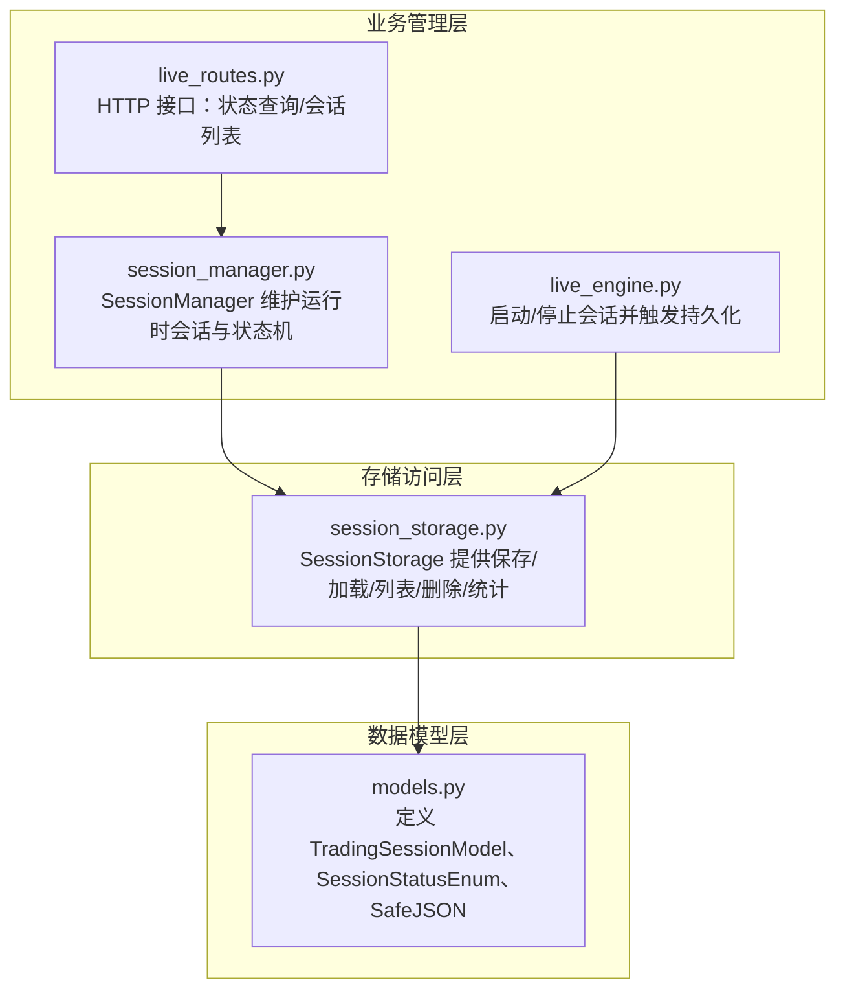
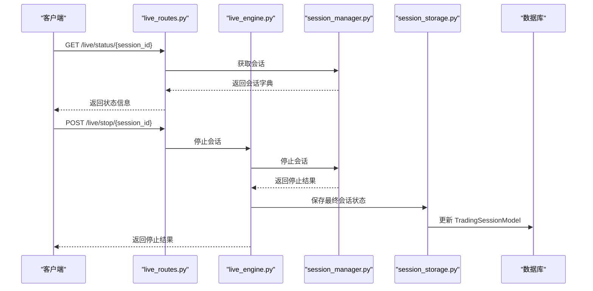
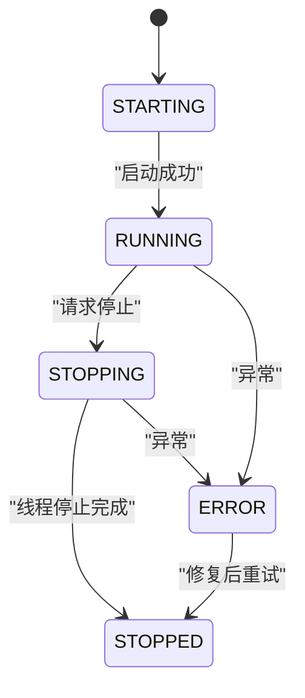
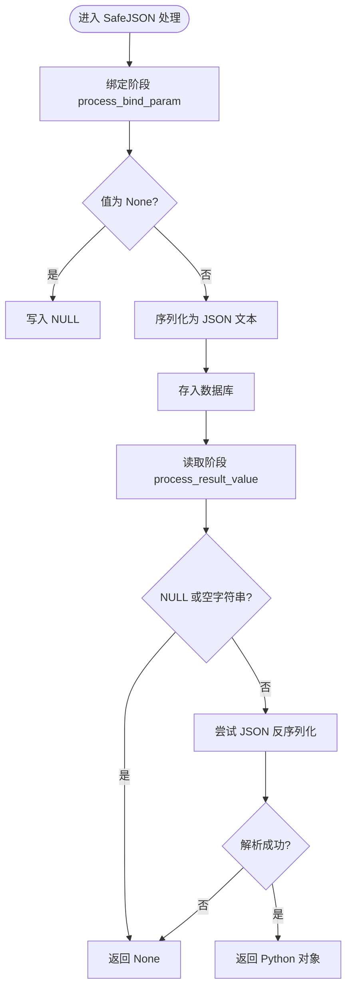
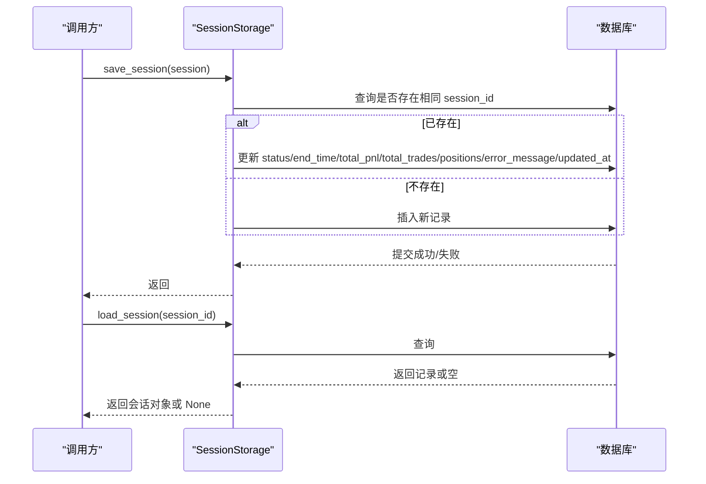
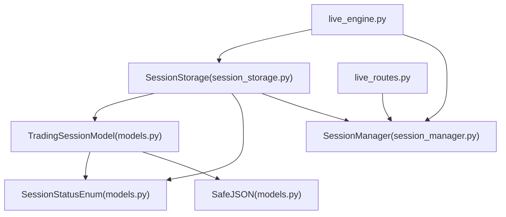

# 会话模型

<cite>
**本文引用的文件**
- [models.py](file://backend/src/db/models.py)
- [session_storage.py](file://backend/src/db/session_storage.py)
- [session_manager.py](file://backend/src/service/session_manager.py)
- [live_engine.py](file://backend/src/service/live_engine.py)
- [live_routes.py](file://backend/src/routes/live_routes.py)
- [migrate_cleanup_json.py](file://backend/src/db/migrate_cleanup_json.py)
</cite>

## 目录
1. [简介](#简介)
2. [项目结构](#项目结构)
3. [核心组件](#核心组件)
4. [架构总览](#架构总览)
5. [详细组件分析](#详细组件分析)
6. [依赖关系分析](#依赖关系分析)
7. [性能考量](#性能考量)
8. [故障排查指南](#故障排查指南)
9. [结论](#结论)
10. [附录：使用示例与最佳实践](#附录使用示例与最佳实践)

## 简介
本文件面向数据库与后端服务工程师，系统性梳理 TradingSessionModel 的数据模型设计与实现要点，包括字段定义、数据类型、约束与索引策略；重点解释 session_id、strategy_name、symbol、exchange 等核心字段的业务含义；阐明 SessionStatusEnum 状态机的流转逻辑；说明 positions、config、metrics 等 SafeJSON 字段的序列化机制与容错处理；结合 session_storage.py 的数据访问逻辑，给出会话创建、更新与持久化的完整流程；最后提供状态查询与异常恢复的实际使用示例，并讨论 updated_at 字段 onupdate 触发机制与分布式时间同步注意事项。

## 项目结构
围绕 TradingSessionModel 的相关模块分布如下：
- 数据模型层：定义表结构、枚举与自定义 JSON 类型
- 存储访问层：封装 CRUD 操作与统计查询
- 业务管理层：维护运行时会话对象与状态机
- 路由与引擎：对外暴露状态查询与停止接口，并驱动持久化

图表来源
- [models.py](file://backend/src/db/models.py#L43-L121)
- [session_storage.py](file://backend/src/db/session_storage.py#L27-L123)
- [session_manager.py](file://backend/src/service/session_manager.py#L20-L94)
- [live_engine.py](file://backend/src/service/live_engine.py#L266-L305)
- [live_routes.py](file://backend/src/routes/live_routes.py#L256-L305)

章节来源
- [models.py](file://backend/src/db/models.py#L43-L121)
- [session_storage.py](file://backend/src/db/session_storage.py#L27-L123)
- [session_manager.py](file://backend/src/service/session_manager.py#L20-L94)
- [live_engine.py](file://backend/src/service/live_engine.py#L266-L305)
- [live_routes.py](file://backend/src/routes/live_routes.py#L256-L305)

## 核心组件
- TradingSessionModel：交易会话的持久化实体，包含会话配置、状态、时间戳、财务指标、JSON 扩展字段与错误信息。
- SessionStatusEnum：数据库侧枚举，用于约束 status 字段取值。
- SafeJSON：自定义 JSON 类型装饰器，负责 NULL 与空字符串的容错处理。
- SessionStorage：数据库访问层，提供保存、加载、分页列表、删除与按状态计数等操作。
- SessionManager：运行时会话管理器，维护状态机与会话生命周期。

章节来源
- [models.py](file://backend/src/db/models.py#L43-L121)
- [session_storage.py](file://backend/src/db/session_storage.py#L27-L123)
- [session_manager.py](file://backend/src/service/session_manager.py#L20-L94)

## 架构总览
下图展示了从路由到引擎再到存储与模型的调用链路，以及状态机在运行时与持久化之间的协同。

图表来源
- [live_routes.py](file://backend/src/routes/live_routes.py#L256-L305)
- [live_engine.py](file://backend/src/service/live_engine.py#L266-L305)
- [session_manager.py](file://backend/src/service/session_manager.py#L238-L291)
- [session_storage.py](file://backend/src/db/session_storage.py#L59-L123)

## 详细组件分析

### TradingSessionModel 数据模型
- 表名：trading_sessions
- 主键：session_id（字符串，长度 36，带索引）
- 用户标识：user_id（可空，字符串，带索引）
- 会话配置：
  - strategy_name：字符串，非空
  - symbol：字符串，非空，带索引
  - exchange：字符串，非空，带索引
  - mode：字符串，非空（'paper' 或 'live'）
  - timeframe：字符串，非空
- 状态跟踪：status（枚举，非空，带索引）
- 时间戳：
  - start_time：非空，默认当前 UTC
  - end_time：可空
  - created_at：非空，默认当前 UTC
  - updated_at：非空，默认当前 UTC，onupdate 自动更新为当前 UTC
- 财务指标：
  - initial_cash：浮点，非空
  - current_cash：浮点，可空
  - final_balance：浮点，可空
  - total_pnl：浮点，默认 0
  - commission：浮点，默认 0.001
- 指标统计：
  - total_trades：整数，默认 0
  - winning_trades：整数，默认 0
  - losing_trades：整数，默认 0
- JSON 扩展字段：
  - positions：SafeJSON，默认空列表
  - config：SafeJSON，默认空字典
  - metrics：SafeJSON，默认空字典
- 错误追踪：error_message：文本，可空

字段与索引策略说明
- session_id 为主键且带索引，确保唯一性与高效查找。
- symbol、exchange、status 均带索引，便于按资产、交易所与状态过滤。
- created_at、updated_at 默认值与 onupdate 保证记录创建与更新时间的准确性。
- positions/config/metrics 使用 SafeJSON，支持复杂结构存储与容错解析。

章节来源
- [models.py](file://backend/src/db/models.py#L63-L121)

### SessionStatusEnum 状态机
- 数据库侧枚举值：starting、running、stopping、stopped、error
- 运行时状态机（SessionManager）：
  - 初始状态：STARTING
  - 运行中：RUNNING
  - 停止中：STOPPING
  - 结束：STOPPED
  - 异常：ERROR
- 状态流转规则：
  - STARTING → RUNNING：会话启动成功
  - RUNNING → STOPPING：收到停止请求
  - STOPPING → STOPPED：线程安全停止完成
  - 其他任何状态 → ERROR：捕获异常时设置
  - ERROR 可能被后续成功停止覆盖为 STOPPED

图表来源
- [models.py](file://backend/src/db/models.py#L43-L50)
- [session_manager.py](file://backend/src/service/session_manager.py#L20-L27)
- [session_manager.py](file://backend/src/service/session_manager.py#L238-L291)

章节来源
- [models.py](file://backend/src/db/models.py#L43-L50)
- [session_manager.py](file://backend/src/service/session_manager.py#L20-L27)
- [session_manager.py](file://backend/src/service/session_manager.py#L238-L291)

### SafeJSON 序列化与容错机制
- 定义位置：models.py 中的 SafeJSON TypeDecorator
- 绑定阶段（process_bind_param）：
  - None 值直接写入数据库 NULL
  - 非 None 值先序列化为 JSON 文本
- 结果读取阶段（process_result_value）：
  - 若数据库值为 NULL 或空字符串，返回 Python None
  - 否则尝试反序列化为 Python 对象，失败则返回 None
- 在 TradingSessionModel 中的应用：
  - positions、config、metrics 三字段均采用 SafeJSON，默认值分别为 list、dict、dict
- 迁移与清理：
  - 提供迁移脚本以清理历史记录中无效 JSON 的脏数据

图表来源
- [models.py](file://backend/src/db/models.py#L23-L41)
- [migrate_cleanup_json.py](file://backend/src/db/migrate_cleanup_json.py#L1-L47)

章节来源
- [models.py](file://backend/src/db/models.py#L23-L41)
- [migrate_cleanup_json.py](file://backend/src/db/migrate_cleanup_json.py#L1-L47)

### 会话创建、更新与持久化流程（基于 session_storage.py）
- 保存会话（save_session）：
  - 若存在相同 session_id，则更新状态、结束时间、累计收益、交易次数、positions、错误信息，并刷新 updated_at
  - 若不存在，则新建记录并填充基础字段
  - 使用数据库事务提交或回滚
- 加载会话（load_session）：
  - 按 session_id 查询，若存在则转换为运行时 TradingSession 对象
- 列出会话（list_sessions）：
  - 支持按状态过滤、分页排序（按 start_time 降序）
- 删除会话（delete_session）：
  - 按 session_id 删除并返回布尔结果
- 按状态计数（get_session_count）：
  - 遍历 SessionStatusEnum，统计各状态数量与总数

图表来源
- [session_storage.py](file://backend/src/db/session_storage.py#L59-L123)
- [session_storage.py](file://backend/src/db/session_storage.py#L124-L172)
- [session_storage.py](file://backend/src/db/session_storage.py#L173-L234)
- [session_storage.py](file://backend/src/db/session_storage.py#L235-L268)
- [session_storage.py](file://backend/src/db/session_storage.py#L361-L392)

章节来源
- [session_storage.py](file://backend/src/db/session_storage.py#L59-L123)
- [session_storage.py](file://backend/src/db/session_storage.py#L124-L172)
- [session_storage.py](file://backend/src/db/session_storage.py#L173-L234)
- [session_storage.py](file://backend/src/db/session_storage.py#L235-L268)
- [session_storage.py](file://backend/src/db/session_storage.py#L361-L392)

### 关键字段业务语义
- session_id：会话唯一标识符，主键，长度 36，带索引，用于快速定位与关联
- strategy_name：策略名称，非空，用于区分不同策略实例
- symbol：交易对/标的，非空，带索引，便于按资产维度检索
- exchange：交易所标识，非空，带索引，便于按交易所维度检索
- status：会话状态，枚举，带索引，支撑状态筛选与统计
- positions：当前持仓集合，JSON 数组，SafeJSON 容错
- config：会话配置快照，JSON 对象，SafeJSON 容错
- metrics：性能指标聚合，JSON 对象，SafeJSON 容错
- error_message：异常信息，文本，可空，便于问题诊断

章节来源
- [models.py](file://backend/src/db/models.py#L63-L121)

### updated_at 的 onupdate 触发机制与分布式时间同步
- onupdate：当记录被更新时，updated_at 自动设为当前 UTC 时间
- 分布式注意：
  - 建议数据库服务器与应用节点统一使用 UTC 时区，避免时差导致的时间错乱
  - 若使用多节点写入，建议在应用层统一时间源（如 NTP），并在高并发场景下考虑幂等更新策略
  - 对于跨时区部署，前端展示应做本地化转换，避免将数据库时间直接作为用户可见时间

章节来源
- [models.py](file://backend/src/db/models.py#L88-L92)

## 依赖关系分析
- 模型依赖：
  - TradingSessionModel 依赖 SessionStatusEnum（数据库枚举）
  - 使用 SafeJSON 作为 JSON 字段类型
- 存储依赖：
  - SessionStorage 依赖 TradingSessionModel、SessionStatusEnum、OrderModel、OrderStatusEnum
  - init_database 提供数据库初始化与表创建
- 业务依赖：
  - SessionManager 维护运行时 TradingSession 对象与状态机
  - live_engine 在停止会话后调用 SessionStorage 保存最终状态
  - live_routes 对外提供状态查询与会话列表接口

图表来源
- [models.py](file://backend/src/db/models.py#L43-L121)
- [session_storage.py](file://backend/src/db/session_storage.py#L14-L21)
- [session_manager.py](file://backend/src/service/session_manager.py#L20-L94)
- [live_engine.py](file://backend/src/service/live_engine.py#L266-L305)
- [live_routes.py](file://backend/src/routes/live_routes.py#L256-L305)

章节来源
- [models.py](file://backend/src/db/models.py#L43-L121)
- [session_storage.py](file://backend/src/db/session_storage.py#L14-L21)
- [session_manager.py](file://backend/src/service/session_manager.py#L20-L94)
- [live_engine.py](file://backend/src/service/live_engine.py#L266-L305)
- [live_routes.py](file://backend/src/routes/live_routes.py#L256-L305)

## 性能考量
- 索引优化：
  - session_id、symbol、exchange、status 带索引，有利于高频查询与过滤
  - created_at、updated_at 建议配合排序与范围查询使用
- JSON 字段：
  - SafeJSON 在读取时进行容错处理，避免因历史数据损坏导致解析失败
  - 对大体量 JSON 字段建议控制大小，必要时拆分为独立表或归档
- 并发与事务：
  - SessionStorage 的保存/删除操作使用显式事务，异常自动回滚，保障一致性
- 分页与统计：
  - list_sessions 支持 limit/offset，get_session_count 提供状态计数，适合仪表盘与报表场景

[本节为通用性能建议，不直接分析具体文件]

## 故障排查指南
- JSON 解析失败：
  - 现象：positions/config/metrics 读取为 None
  - 处理：检查历史数据是否为空字符串或损坏；使用迁移脚本清理无效 JSON 记录
- 状态异常：
  - 现象：会话卡在 STOPPING 或 ERROR
  - 处理：确认线程是否正常退出；查看 error_message；必要时强制停止并重新启动
- 并发冲突：
  - 现象：保存失败或数据不一致
  - 处理：检查事务提交/回滚路径；确保同一 session_id 的并发更新串行化
- 时间不一致：
  - 现象：updated_at 与预期不符
  - 处理：统一时区为 UTC；核对数据库与应用节点时间源

章节来源
- [migrate_cleanup_json.py](file://backend/src/db/migrate_cleanup_json.py#L1-L47)
- [session_storage.py](file://backend/src/db/session_storage.py#L59-L123)
- [session_manager.py](file://backend/src/service/session_manager.py#L238-L291)

## 结论
TradingSessionModel 通过严谨的字段设计、枚举约束与 SafeJSON 容错机制，实现了对交易会话全生命周期的可靠持久化。结合 SessionStorage 的标准 CRUD 与统计能力，以及 SessionManager 的状态机与 live_engine 的持久化触发，形成了从运行时到数据库的一体化闭环。updated_at 的 onupdate 与索引策略进一步提升了查询与审计效率。建议在生产环境中统一时区、定期清理历史 JSON 脏数据，并通过分页与状态计数接口支撑可观测性与运维自动化。

[本节为总结性内容，不直接分析具体文件]

## 附录：使用示例与最佳实践

### 通过 ORM 查询会话状态
- 示例路径：
  - 列出所有会话（按开始时间倒序，限制条数）
  - 按状态过滤列出
  - 获取会话计数（按状态分组）

章节来源
- [session_storage.py](file://backend/src/db/session_storage.py#L173-L234)
- [session_storage.py](file://backend/src/db/session_storage.py#L361-L392)

### 通过 HTTP 接口查询与停止会话
- 查询状态：
  - 路由：GET /live/status/{session_id}
  - 返回：会话配置、状态、收益、交易数、当前持仓等
- 停止会话：
  - 路由：POST /live/stop/{session_id}
  - 流程：调用引擎停止，随后保存最终状态

章节来源
- [live_routes.py](file://backend/src/routes/live_routes.py#L256-L305)
- [live_engine.py](file://backend/src/service/live_engine.py#L266-L305)

### 异常恢复与数据修复
- 清理无效 JSON：
  - 使用迁移脚本删除 metrics 等字段为空或空字符串的记录
- 重新加载会话：
  - 通过 load_session 读取数据库记录，重建运行时对象
- 重试停止：
  - 若会话处于 ERROR 或长时间未停止，可在修复后再次尝试停止并保存

章节来源
- [migrate_cleanup_json.py](file://backend/src/db/migrate_cleanup_json.py#L1-L47)
- [session_storage.py](file://backend/src/db/session_storage.py#L124-L172)
- [session_manager.py](file://backend/src/service/session_manager.py#L238-L291)