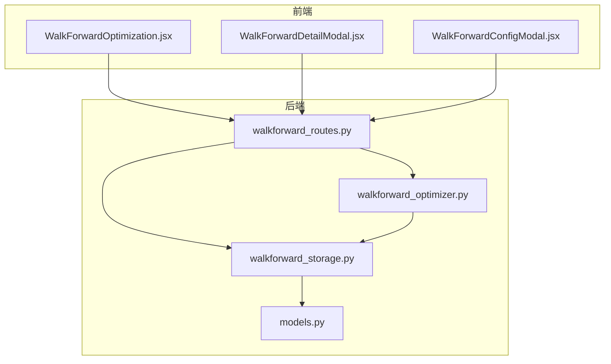
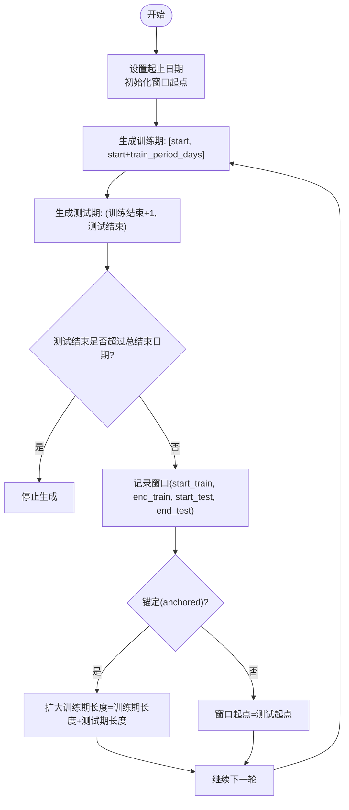
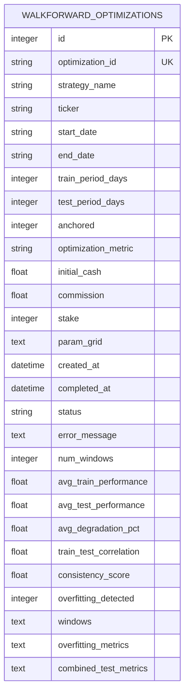
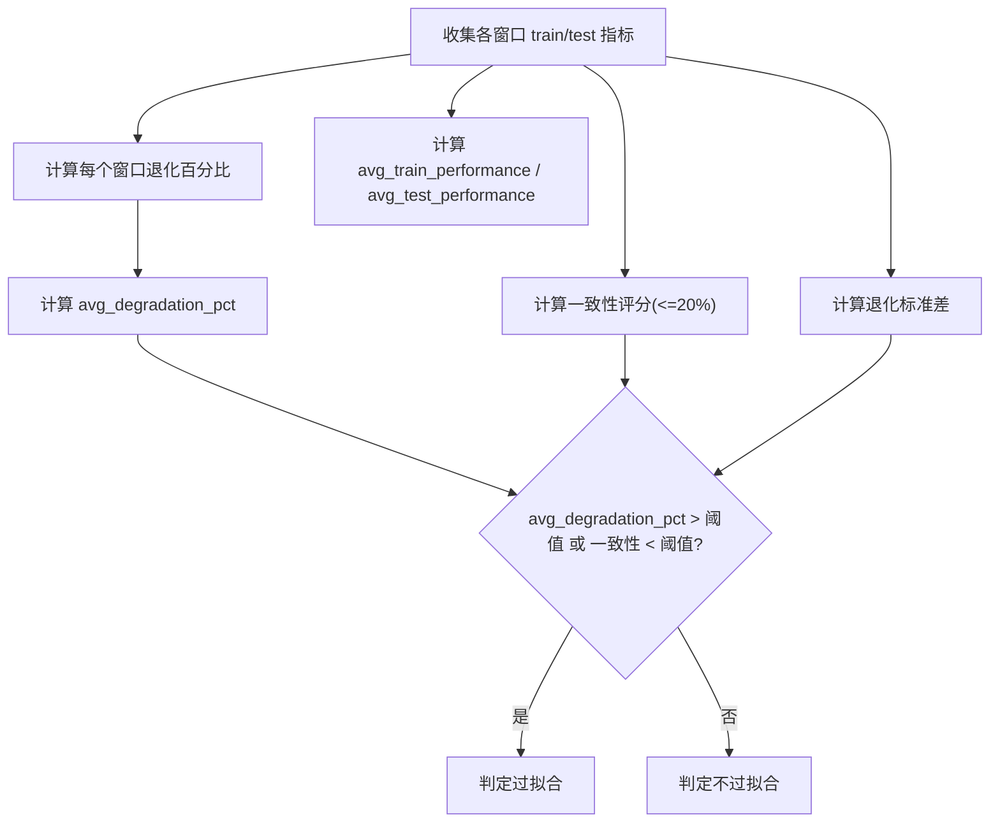
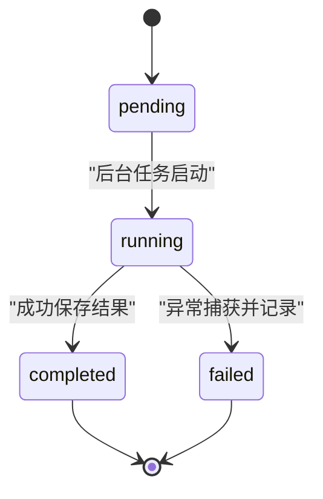
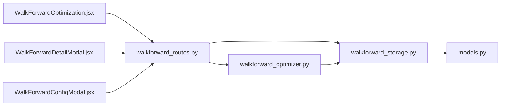

# 参数优化模型

<cite>
**本文引用的文件列表**
- [walkforward_storage.py](file://backend/src/db/walkforward_storage.py)
- [walkforward_optimizer.py](file://backend/src/service/walkforward_optimizer.py)
- [models.py](file://backend/src/db/models.py)
- [walkforward_routes.py](file://backend/src/routes/walkforward_routes.py)
- [WalkForwardOptimization.jsx](file://frontend/src/components/WalkForward/WalkForwardOptimization.jsx)
- [WalkForwardDetailModal.jsx](file://frontend/src/components/WalkForward/WalkForwardDetailModal.jsx)
- [WalkForwardConfigModal.jsx](file://frontend/src/components/WalkForward/WalkForwardConfigModal.jsx)
</cite>

## 目录
1. [引言](#引言)
2. [项目结构](#项目结构)
3. [核心组件](#核心组件)
4. [架构总览](#架构总览)
5. [详细组件分析](#详细组件分析)
6. [依赖关系分析](#依赖关系分析)
7. [性能与可扩展性](#性能与可扩展性)
8. [故障排查指南](#故障排查指南)
9. [结论](#结论)
10. [附录：字段与访问模式速查](#附录字段与访问模式速查)

## 引言
本文件面向“参数优化模型”的深入解析，围绕以下目标展开：
- 深入剖析滚动窗口配置体系：train_period_days、test_period_days 的含义、差异与组合策略（滚动 vs 固定锚定）。
- 解析 param_grid 参数网格的 JSON 存储格式及在多维参数搜索中的表达能力。
- 阐述 avg_train_performance、avg_test_performance、avg_degradation_pct 等指标在过拟合检测中的核心作用。
- 描述 windows、overfitting_metrics、combined_test_metrics 等复杂结果字段的嵌套结构与访问模式。
- 结合 walkforward_storage.py 的实现，说明优化任务状态机（pending、running、completed、failed）的持久化管理机制与错误恢复策略。

## 项目结构
后端采用分层架构：路由层负责 API 定义与后台任务调度；服务层负责 Walk-Forward 优化引擎；数据层负责数据库模型与持久化；前端提供可视化与交互。



图表来源
- [walkforward_routes.py](file://backend/src/routes/walkforward_routes.py#L1-L120)
- [walkforward_storage.py](file://backend/src/db/walkforward_storage.py#L1-L120)
- [walkforward_optimizer.py](file://backend/src/service/walkforward_optimizer.py#L1-L120)
- [models.py](file://backend/src/db/models.py#L318-L390)
- [WalkForwardOptimization.jsx](file://frontend/src/components/WalkForward/WalkForwardOptimization.jsx#L1-L120)
- [WalkForwardDetailModal.jsx](file://frontend/src/components/WalkForward/WalkForwardDetailModal.jsx#L1-L120)
- [WalkForwardConfigModal.jsx](file://frontend/src/components/WalkForward/WalkForwardConfigModal.jsx#L52-L76)

章节来源
- [walkforward_routes.py](file://backend/src/routes/walkforward_routes.py#L1-L120)
- [walkforward_storage.py](file://backend/src/db/walkforward_storage.py#L1-L120)
- [walkforward_optimizer.py](file://backend/src/service/walkforward_optimizer.py#L1-L120)
- [models.py](file://backend/src/db/models.py#L318-L390)
- [WalkForwardOptimization.jsx](file://frontend/src/components/WalkForward/WalkForwardOptimization.jsx#L1-L120)
- [WalkForwardDetailModal.jsx](file://frontend/src/components/WalkForward/WalkForwardDetailModal.jsx#L1-L120)
- [WalkForwardConfigModal.jsx](file://frontend/src/components/WalkForward/WalkForwardConfigModal.jsx#L52-L76)

## 核心组件
- 路由层（FastAPI）：定义创建、查询、删除、状态查询等接口，并通过后台任务启动优化流程。
- 优化引擎（WalkForwardOptimizer）：生成滚动/锚定窗口，遍历参数网格，在训练窗口上优化参数并在测试窗口验证，计算过拟合指标与合并测试指标。
- 存储层（WalkForwardStorage）：封装数据库操作，保存优化记录、更新状态、持久化完整结果。
- 数据模型（SQLAlchemy）：定义 WalkForwardOptimizationModel 表结构，含 JSON 字段用于存储复杂结果。
- 前端组件：列表页轮询状态、详情页展示 overfitting_metrics、combined_test_metrics、按窗口明细查看。

章节来源
- [walkforward_routes.py](file://backend/src/routes/walkforward_routes.py#L120-L220)
- [walkforward_optimizer.py](file://backend/src/service/walkforward_optimizer.py#L116-L210)
- [walkforward_storage.py](file://backend/src/db/walkforward_storage.py#L114-L220)
- [models.py](file://backend/src/db/models.py#L318-L390)
- [WalkForwardOptimization.jsx](file://frontend/src/components/WalkForward/WalkForwardOptimization.jsx#L31-L120)
- [WalkForwardDetailModal.jsx](file://frontend/src/components/WalkForward/WalkForwardDetailModal.jsx#L1-L120)

## 架构总览
从请求到结果的端到端流程如下：

```mermaid
sequenceDiagram
participant FE as "前端"
participant API as "路由层"
participant BG as "后台任务"
participant OPT as "优化引擎"
participant STO as "存储层"
participant DB as "数据库"
FE->>API : "POST /api/walkforward/start"
API->>STO : "create_optimization()"
API->>BG : "add_task(run_optimization_task)"
BG->>STO : "update_optimization_status('running')"
BG->>OPT : "run_walkforward()"
OPT-->>BG : "WalkForwardResult"
BG->>STO : "save_optimization_result()"
STO->>DB : "写入 windows / overfitting_metrics / combined_test_metrics"
API-->>FE : "返回 optimization_id"
FE->>API : "GET /api/walkforward/{id}"
API->>STO : "get_optimization()"
STO->>DB : "读取记录"
STO-->>API : "字典结果"
API-->>FE : "完整结果"
```

图表来源
- [walkforward_routes.py](file://backend/src/routes/walkforward_routes.py#L129-L220)
- [walkforward_routes.py](file://backend/src/routes/walkforward_routes.py#L66-L126)
- [walkforward_optimizer.py](file://backend/src/service/walkforward_optimizer.py#L341-L417)
- [walkforward_storage.py](file://backend/src/db/walkforward_storage.py#L164-L237)
- [models.py](file://backend/src/db/models.py#L318-L390)

## 详细组件分析

### 滚动窗口配置体系：train_period_days 与 test_period_days
- train_period_days：训练窗口天数，决定每次在训练期内进行参数搜索的样本范围。
- test_period_days：测试窗口天数，决定每次在独立时间段上验证最佳参数的表现。
- 窗口生成策略：
  - 滚动（rolling）：训练窗口结束后，测试窗口开始，然后将窗口起点移动到测试起点，形成连续滑动。
  - 锚定（anchored）：训练窗口从起始点固定，但每次将训练期长度增加一个测试期长度，从而扩大训练集，直到测试期超出结束日期为止。
- 影响：
  - 滚动更贴近真实“未来不可知”的验证场景，适合评估泛化能力。
  - 锚定更偏向“逐步扩大训练集”的稳健性评估，可能降低早期波动影响。



图表来源
- [walkforward_optimizer.py](file://backend/src/service/walkforward_optimizer.py#L116-L159)

章节来源
- [walkforward_optimizer.py](file://backend/src/service/walkforward_optimizer.py#L116-L159)

### 参数网格 param_grid 的 JSON 存储与表达能力
- 存储位置：数据库表中使用 SafeJSON 列存储 param_grid。
- 格式要求：字典映射，键为参数名，值为该参数可选值列表。例如：{"fast_period": [5, 10, 20], "slow_period": [20, 30, 50]}。
- 表达能力：
  - 多维参数搜索：通过笛卡尔积生成所有参数组合，覆盖参数空间。
  - 类型多样性：前端支持逗号分隔输入，自动尝试解析数字或字符串，最终统一存入 JSON。
  - 可视化与回放：前端详情页可直接展示参数网格，便于复核与对比。



图表来源
- [models.py](file://backend/src/db/models.py#L318-L390)

章节来源
- [models.py](file://backend/src/db/models.py#L353-L356)
- [WalkForwardConfigModal.jsx](file://frontend/src/components/WalkForward/WalkForwardConfigModal.jsx#L52-L76)
- [walkforward_storage.py](file://backend/src/db/walkforward_storage.py#L94-L94)

### 过拟合检测指标：avg_train_performance、avg_test_performance、avg_degradation_pct
- avg_train_performance：各训练窗口优化指标的平均值，反映“内样本”表现。
- avg_test_performance：各测试窗口验证指标的平均值，反映“外样本”表现。
- avg_degradation_pct：平均退化百分比，衡量训练与测试之间的相对差距。计算公式为对每个窗口的 (train - test)/|train| × 100 并求平均。
- 综合判断：
  - 若 avg_degradation_pct 显著偏高且一致性较低，则判定存在过拟合风险。
  - 计算还包含一致性评分（窗口间测试表现与训练表现偏差不超过阈值的比例）与退化标准差，作为辅助判据。



图表来源
- [walkforward_optimizer.py](file://backend/src/service/walkforward_optimizer.py#L442-L493)

章节来源
- [walkforward_optimizer.py](file://backend/src/service/walkforward_optimizer.py#L442-L493)

### 复杂结果字段：windows、overfitting_metrics、combined_test_metrics
- windows：数组，每项包含 window_id、train_start/train_end、test_start/test_end、best_params、train_metrics、test_metrics、all_train_results 等。
- overfitting_metrics：对象，包含 train_test_correlation、avg_train_performance、avg_test_performance、avg_degradation_pct、consistency_score、degradation_std、overfitting_detected 等。
- combined_test_metrics：对象，汇总所有测试窗口的总收益、平均夏普比率、最大回撤、交易次数、胜率等。

访问模式建议：
- 列表页：优先读取 denormalized 字段（如 avg_train_performance、avg_test_performance、avg_degradation_pct、overfitting_detected），避免加载完整 JSON。
- 详情页：按需读取 windows、overfitting_metrics、combined_test_metrics，前端组件按需渲染。

章节来源
- [walkforward_storage.py](file://backend/src/db/walkforward_storage.py#L194-L223)
- [walkforward_optimizer.py](file://backend/src/service/walkforward_optimizer.py#L495-L531)
- [WalkForwardDetailModal.jsx](file://frontend/src/components/WalkForward/WalkForwardDetailModal.jsx#L1-L120)

### 任务状态机与错误恢复：pending、running、completed、failed
- 状态流转：
  - 创建时：pending
  - 后台任务启动：running
  - 成功完成：completed（写入 windows、overfitting_metrics、combined_test_metrics）
  - 异常失败：failed（记录 error_message）
- 错误恢复：
  - 路由层捕获异常，调用 update_optimization_status 将状态置为 failed，并保留错误信息。
  - 前端轮询状态，用户可在失败时重新发起或删除。



图表来源
- [walkforward_routes.py](file://backend/src/routes/walkforward_routes.py#L66-L126)
- [walkforward_storage.py](file://backend/src/db/walkforward_storage.py#L114-L163)
- [WalkForwardOptimization.jsx](file://frontend/src/components/WalkForward/WalkForwardOptimization.jsx#L31-L120)

章节来源
- [walkforward_routes.py](file://backend/src/routes/walkforward_routes.py#L66-L126)
- [walkforward_storage.py](file://backend/src/db/walkforward_storage.py#L114-L163)
- [WalkForwardOptimization.jsx](file://frontend/src/components/WalkForward/WalkForwardOptimization.jsx#L31-L120)

## 依赖关系分析
- 路由层依赖存储层与优化引擎，存储层依赖数据库模型。
- 优化引擎依赖数据源加载器与回测引擎，输出结果写入存储层。
- 前端组件依赖 API 层，API 层依赖存储层。



图表来源
- [walkforward_routes.py](file://backend/src/routes/walkforward_routes.py#L1-L120)
- [walkforward_storage.py](file://backend/src/db/walkforward_storage.py#L1-L120)
- [walkforward_optimizer.py](file://backend/src/service/walkforward_optimizer.py#L1-L120)
- [models.py](file://backend/src/db/models.py#L318-L390)
- [WalkForwardOptimization.jsx](file://frontend/src/components/WalkForward/WalkForwardOptimization.jsx#L1-L120)
- [WalkForwardDetailModal.jsx](file://frontend/src/components/WalkForward/WalkForwardDetailModal.jsx#L1-L120)
- [WalkForwardConfigModal.jsx](file://frontend/src/components/WalkForward/WalkForwardConfigModal.jsx#L52-L76)

章节来源
- [walkforward_routes.py](file://backend/src/routes/walkforward_routes.py#L1-L120)
- [walkforward_storage.py](file://backend/src/db/walkforward_storage.py#L1-L120)
- [walkforward_optimizer.py](file://backend/src/service/walkforward_optimizer.py#L1-L120)
- [models.py](file://backend/src/db/models.py#L318-L390)
- [WalkForwardOptimization.jsx](file://frontend/src/components/WalkForward/WalkForwardOptimization.jsx#L1-L120)
- [WalkForwardDetailModal.jsx](file://frontend/src/components/WalkForward/WalkForwardDetailModal.jsx#L1-L120)
- [WalkForwardConfigModal.jsx](file://frontend/src/components/WalkForward/WalkForwardConfigModal.jsx#L52-L76)

## 性能与可扩展性
- 网格搜索复杂度：随参数维度与取值数量呈指数增长，建议控制参数数量与取值规模。
- I/O 优化：列表页优先使用 denormalized 字段减少 JSON 解析开销；详情页按需加载完整 JSON。
- 并发与批处理：后台任务串行执行，避免资源争用；可考虑引入队列与并发池以提升吞吐。
- 数据库索引：按 status、created_at、strategy_name、ticker 等常用过滤字段建立索引，提升查询效率。

[本节为通用建议，不直接分析具体文件]

## 故障排查指南
- 状态长期停留在 pending：检查后台任务是否被正确添加与执行。
- 状态变为 failed：查看 error_message 字段，定位异常原因（如参数非法、数据源缺失、回测异常）。
- 结果为空或字段缺失：确认存储层是否成功写入 windows、overfitting_metrics、combined_test_metrics。
- 前端无法刷新：确认轮询间隔与 API 调用是否正常，网络与权限是否允许。

章节来源
- [walkforward_routes.py](file://backend/src/routes/walkforward_routes.py#L66-L126)
- [walkforward_storage.py](file://backend/src/db/walkforward_storage.py#L114-L163)
- [WalkForwardOptimization.jsx](file://frontend/src/components/WalkForward/WalkForwardOptimization.jsx#L31-L120)

## 结论
本系统通过“滚动/锚定窗口 + 参数网格搜索 + 多指标过拟合检测”的组合，提供了稳健的参数优化与验证能力。train_period_days 与 test_period_days 构成灵活的时间窗口配置，param_grid 支持多维参数探索，而 overfitting_metrics 与 combined_test_metrics 则为结果解读与决策提供量化依据。配合状态机与错误恢复机制，系统具备良好的可靠性与可观测性。

[本节为总结，不直接分析具体文件]

## 附录：字段与访问模式速查
- 列表页常用字段（denormalized）：avg_train_performance、avg_test_performance、avg_degradation_pct、train_test_correlation、consistency_score、overfitting_detected、status、num_windows。
- 详情页常用字段：windows、overfitting_metrics、combined_test_metrics、param_grid。
- 访问建议：
  - 列表页优先使用 denormalized 字段，减少 JSON 解析与传输体积。
  - 详情页按需加载 windows、overfitting_metrics、combined_test_metrics，避免一次性传输大量数据。

章节来源
- [walkforward_storage.py](file://backend/src/db/walkforward_storage.py#L384-L423)
- [WalkForwardDetailModal.jsx](file://frontend/src/components/WalkForward/WalkForwardDetailModal.jsx#L1-L120)
- [WalkForwardOptimization.jsx](file://frontend/src/components/WalkForward/WalkForwardOptimization.jsx#L120-L210)