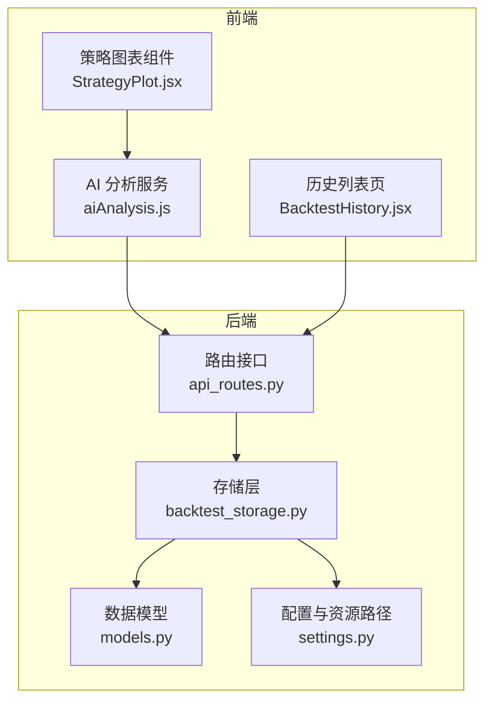
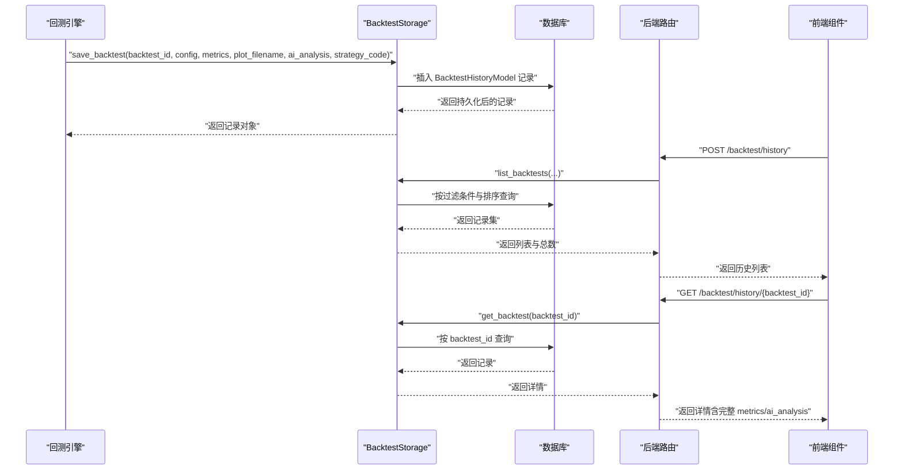
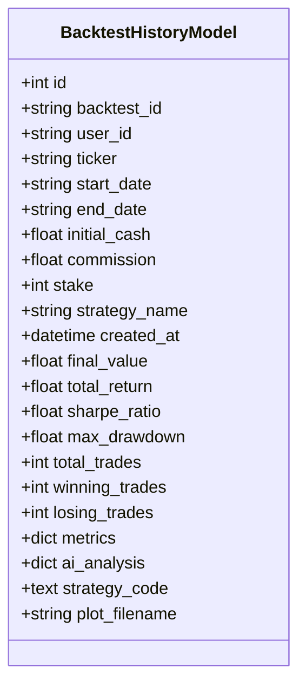
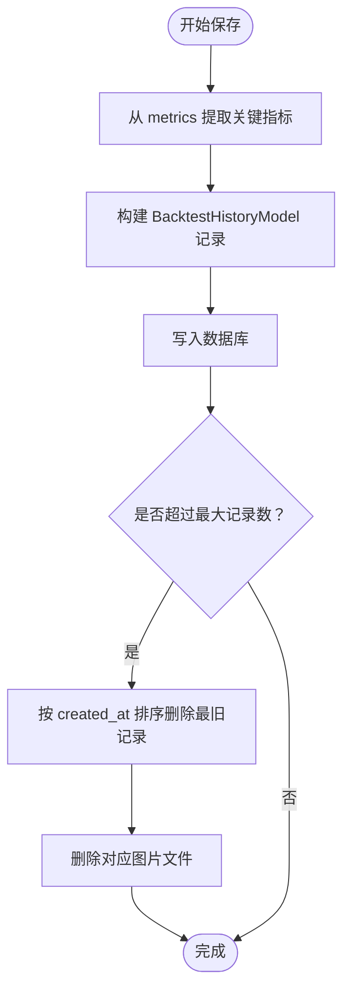
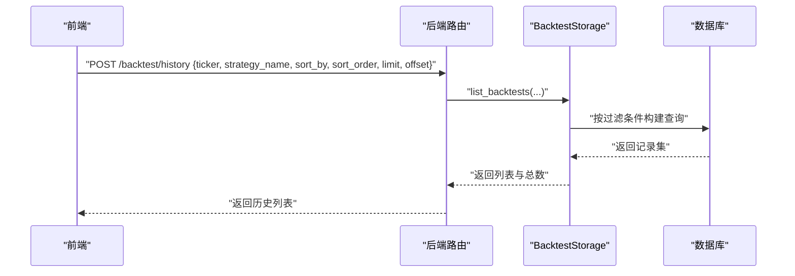
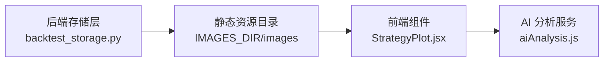
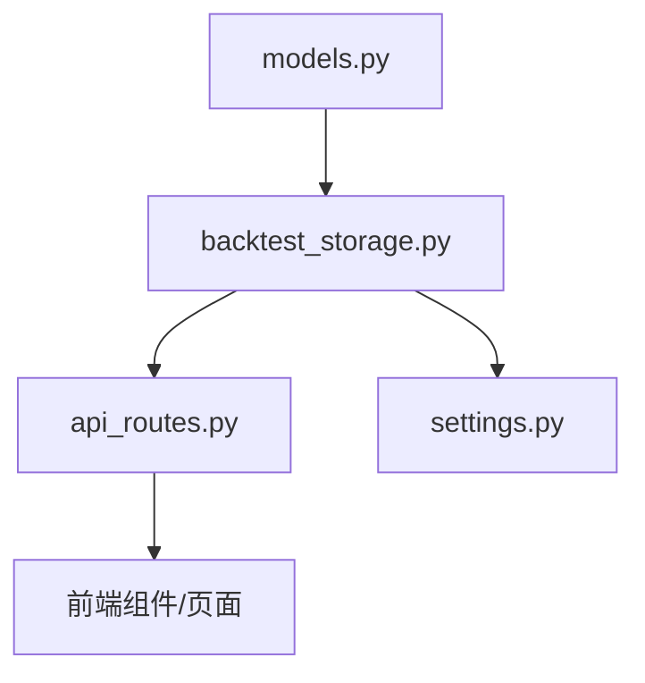

# 回测历史模型

<cite>
**本文引用的文件**
- [models.py](file://backend/src/db/models.py)
- [backtest_storage.py](file://backend/src/db/backtest_storage.py)
- [settings.py](file://backend/src/config/settings.py)
- [api_routes.py](file://backend/src/routes/api_routes.py)
- [StrategyPlot.jsx](file://frontend/src/components/RunStrategy/StrategyPlot.jsx)
- [aiAnalysis.js](file://frontend/src/services/aiAnalysis.js)
- [BacktestHistory.jsx](file://frontend/src/pages/BacktestHistory.jsx)
</cite>

## 目录
1. [简介](#简介)
2. [项目结构](#项目结构)
3. [核心组件](#核心组件)
4. [架构总览](#架构总览)
5. [详细组件分析](#详细组件分析)
6. [依赖关系分析](#依赖关系分析)
7. [性能考量](#性能考量)
8. [故障排查指南](#故障排查指南)
9. [结论](#结论)
10. [附录](#附录)

## 简介
本文件系统化阐述 BacktestHistoryModel 的架构设计，重点说明：
- backtest_id 唯一性约束与 created_at 索引在历史记录管理中的作用
- total_return、sharpe_ratio 等关键指标的去规范化设计如何支持高效的结果排序与筛选
- metrics、ai_analysis、strategy_code 等富文本字段在策略复现与结果分析中的价值
- 结合 backtest_storage.py 的存储逻辑，说明回测结果的持久化流程以及 plot_filename 与静态资源的关联机制
- 基于 strategy_name 和 ticker 的复合查询性能优化方案，并讨论大数据量下的分表策略

## 项目结构
围绕回测历史模型的关键文件分布如下：
- 数据模型定义：backend/src/db/models.py
- 存储层实现：backend/src/db/backtest_storage.py
- 配置与静态资源路径：backend/src/config/settings.py
- 后端路由与接口：backend/src/routes/api_routes.py
- 前端图表展示与 AI 分析：frontend/src/components/RunStrategy/StrategyPlot.jsx、frontend/src/services/aiAnalysis.js
- 历史列表页面与查询参数：frontend/src/pages/BacktestHistory.jsx

**图示来源**
- [models.py](file://backend/src/db/models.py#L257-L316)
- [backtest_storage.py](file://backend/src/db/backtest_storage.py#L22-L116)
- [settings.py](file://backend/src/config/settings.py#L1-L81)
- [api_routes.py](file://backend/src/routes/api_routes.py#L228-L341)
- [StrategyPlot.jsx](file://frontend/src/components/RunStrategy/StrategyPlot.jsx#L1-L110)
- [aiAnalysis.js](file://frontend/src/services/aiAnalysis.js#L52-L126)
- [BacktestHistory.jsx](file://frontend/src/pages/BacktestHistory.jsx#L37-L63)

**章节来源**
- [models.py](file://backend/src/db/models.py#L257-L316)
- [backtest_storage.py](file://backend/src/db/backtest_storage.py#L22-L116)
- [settings.py](file://backend/src/config/settings.py#L1-L81)
- [api_routes.py](file://backend/src/routes/api_routes.py#L228-L341)
- [StrategyPlot.jsx](file://frontend/src/components/RunStrategy/StrategyPlot.jsx#L1-L110)
- [aiAnalysis.js](file://frontend/src/services/aiAnalysis.js#L52-L126)
- [BacktestHistory.jsx](file://frontend/src/pages/BacktestHistory.jsx#L37-L63)

## 核心组件
- BacktestHistoryModel：定义回测历史记录的数据结构，包含唯一标识、时间序列、关键指标、富文本字段与图表文件名等。
- BacktestStorage：封装数据库操作，负责保存、查询、删除、更新 AI 分析与自动清理过期记录。
- 路由接口：提供历史列表、详情、删除、AI 分析更新等 API。
- 前端组件：负责展示图表、触发 AI 分析、发起历史查询。

关键点：
- backtest_id 唯一性约束确保每条回测记录可稳定定位与幂等处理
- created_at 索引用于按时间排序与范围过滤
- total_return、sharpe_ratio 去规范化字段便于直接排序筛选
- metrics、ai_analysis、strategy_code 提供完整上下文，支撑复盘与自动化分析

**章节来源**
- [models.py](file://backend/src/db/models.py#L257-L316)
- [backtest_storage.py](file://backend/src/db/backtest_storage.py#L22-L116)
- [api_routes.py](file://backend/src/routes/api_routes.py#L228-L341)

## 架构总览
回测历史模型的端到端流程如下：
- 引擎计算完成回测后，调用存储层写入数据库
- 存储层提取关键指标并写入去规范化字段，同时持久化完整 metrics、ai_analysis、strategy_code
- 前端通过路由接口拉取历史列表或详情，渲染图表并可触发 AI 分析
- 存储层根据配置删除过期记录，并清理对应的静态图片文件

**图示来源**
- [backtest_storage.py](file://backend/src/db/backtest_storage.py#L37-L116)
- [backtest_storage.py](file://backend/src/db/backtest_storage.py#L183-L267)
- [backtest_storage.py](file://backend/src/db/backtest_storage.py#L268-L310)
- [api_routes.py](file://backend/src/routes/api_routes.py#L228-L341)
- [StrategyPlot.jsx](file://frontend/src/components/RunStrategy/StrategyPlot.jsx#L1-L110)
- [aiAnalysis.js](file://frontend/src/services/aiAnalysis.js#L52-L126)

## 详细组件分析

### BacktestHistoryModel 数据模型
- 唯一标识与索引
  - backtest_id：字符串主键，唯一且带索引，保证全局唯一性与快速定位
  - created_at：带索引的时间戳，支持按时间排序与范围过滤
- 关键配置字段
  - ticker、strategy_name、start_date、end_date、initial_cash、commission、stake 等
- 性能指标（去规范化）
  - final_value、total_return、sharpe_ratio、max_drawdown、total_trades、winning_trades、losing_trades
  - 其中 total_return、sharpe_ratio 显式建立索引，便于直接排序与筛选
- 富文本字段
  - metrics：完整指标字典，包含引擎输出的所有统计信息
  - ai_analysis：AI 模型分析结果，支持多模型并存
  - strategy_code：策略源码快照，便于复现与审计
- 图表文件
  - plot_filename：存储图片文件名，配合静态资源目录提供访问

**图示来源**
- [models.py](file://backend/src/db/models.py#L257-L316)

**章节来源**
- [models.py](file://backend/src/db/models.py#L257-L316)

### 存储层持久化流程与清理机制
- 写入流程
  - 从 metrics 中提取 final_value、total_return、sharpe_ratio、max_drawdown、交易统计等，填充去规范化字段
  - 将完整 metrics、ai_analysis、strategy_code 写入对应列
  - 写入 plot_filename 并在后续与静态资源目录关联
- 自动清理
  - 当记录数超过阈值时，按 created_at 升序删除最旧记录
  - 删除记录的同时尝试删除对应的静态图片文件
- 错误处理
  - 对 JSON 字段异常进行捕获与清理，避免查询失败

**图示来源**
- [backtest_storage.py](file://backend/src/db/backtest_storage.py#L37-L116)
- [backtest_storage.py](file://backend/src/db/backtest_storage.py#L117-L153)

**章节来源**
- [backtest_storage.py](file://backend/src/db/backtest_storage.py#L37-L116)
- [backtest_storage.py](file://backend/src/db/backtest_storage.py#L117-L153)

### 历史查询与排序
- 支持的过滤条件：ticker、strategy_name、start_date、end_date、user_id
- 支持的排序字段：created_at、total_return、sharpe_ratio
- 分页与总数：先统计总数，再应用偏移与限制
- JSON 字段异常处理：若查询因 JSON 解析失败，先清理无效记录再重试

**图示来源**
- [api_routes.py](file://backend/src/routes/api_routes.py#L228-L258)
- [backtest_storage.py](file://backend/src/db/backtest_storage.py#L183-L267)

**章节来源**
- [api_routes.py](file://backend/src/routes/api_routes.py#L228-L258)
- [backtest_storage.py](file://backend/src/db/backtest_storage.py#L183-L267)

### 静态资源与图表展示
- 静态资源目录
  - IMAGES_DIR：后端资源目录下的 images 子目录，用于存放回测图表
- 前端展示
  - 前端组件直接使用 /images/{plot_filename} 作为图片地址
  - AI 分析服务会下载该图片并结合 metrics、strategy_code 进行分析

**图示来源**
- [settings.py](file://backend/src/config/settings.py#L1-L81)
- [backtest_storage.py](file://backend/src/db/backtest_storage.py#L414-L444)
- [StrategyPlot.jsx](file://frontend/src/components/RunStrategy/StrategyPlot.jsx#L72-L90)
- [aiAnalysis.js](file://frontend/src/services/aiAnalysis.js#L52-L99)

**章节来源**
- [settings.py](file://backend/src/config/settings.py#L1-L81)
- [backtest_storage.py](file://backend/src/db/backtest_storage.py#L414-L444)
- [StrategyPlot.jsx](file://frontend/src/components/RunStrategy/StrategyPlot.jsx#L72-L90)
- [aiAnalysis.js](file://frontend/src/services/aiAnalysis.js#L52-L99)

### 富文本字段的价值与使用
- metrics：完整指标字典，包含引擎输出的所有统计信息，便于前端展示与二次分析
- ai_analysis：以 JSON 形式存储不同模型的分析结果，支持多模型并存与覆盖更新
- strategy_code：策略源码快照，便于复现、对比与审计

这些字段共同构成“可复现”的回测结果，既满足人类可读的可视化，也满足机器可解析的分析需求。

**章节来源**
- [models.py](file://backend/src/db/models.py#L296-L305)
- [backtest_storage.py](file://backend/src/db/backtest_storage.py#L353-L413)

## 依赖关系分析
- 模型依赖
  - BacktestHistoryModel 依赖 SQLAlchemy 的 Column、DateTime、Float、String、Text、JSON 等类型
  - 使用 SafeJSON 类型装饰器处理 NULL 与空字符串，增强健壮性
- 存储层依赖
  - 依赖 models.py 中的 BacktestHistoryModel
  - 依赖 settings.py 中的 IMAGES_DIR 作为静态资源根目录
  - 依赖 SQLAlchemy ORM 与 Session 管理
- 路由依赖
  - 依赖 BacktestStorage 提供的 CRUD 能力
  - 依赖用户认证上下文 user_id 实现多用户隔离
- 前端依赖
  - 依赖后端提供的 /images/{plot_filename} 访问图表
  - 依赖 AI 分析服务进行策略解读

**图示来源**
- [models.py](file://backend/src/db/models.py#L257-L316)
- [backtest_storage.py](file://backend/src/db/backtest_storage.py#L22-L116)
- [settings.py](file://backend/src/config/settings.py#L1-L81)
- [api_routes.py](file://backend/src/routes/api_routes.py#L228-L341)

**章节来源**
- [models.py](file://backend/src/db/models.py#L257-L316)
- [backtest_storage.py](file://backend/src/db/backtest_storage.py#L22-L116)
- [settings.py](file://backend/src/config/settings.py#L1-L81)
- [api_routes.py](file://backend/src/routes/api_routes.py#L228-L341)

## 性能考量
- 索引与排序
  - created_at 建立索引，支持按时间排序与范围过滤
  - total_return、sharpe_ratio 建立索引，支持直接排序筛选
  - 建议在高频组合查询场景下考虑复合索引（见下一节）
- 查询路径优化
  - 列表接口先统计总数再分页，避免重复扫描
  - 对 JSON 字段异常进行清理与重试，提升稳定性
- 清理策略
  - 采用固定上限 MAX_RECORDS，按 created_at 升序删除，降低存储压力
  - 删除记录时同步清理静态图片文件，避免磁盘膨胀
- 大数据量下的分表策略
  - 建议按时间维度（如年/月）进行水平分表，减少单表扫描范围
  - 可结合 strategy_name 与 ticker 组合分区，提升热点查询效率
  - 对于高并发写入，建议引入分区键与一致性哈希，避免热点
  - 分表后需在路由层与存储层增加路由逻辑，将请求路由至正确分片

[本节为通用性能建议，不直接分析具体文件，故不附“章节来源”]

## 故障排查指南
- JSON 字段异常
  - 现象：查询时报错或无法反序列化
  - 处理：存储层提供清理方法，删除 metrics 或 ai_analysis 为空/无效的记录，再重试查询
- 图片文件缺失
  - 现象：前端无法加载图表
  - 处理：确认 IMAGES_DIR 下是否存在对应文件；若不存在，检查存储层清理逻辑是否提前删除
- 记录过多导致性能下降
  - 现象：列表查询变慢
  - 处理：调整 MAX_RECORDS；必要时启用分表与分区
- 多用户隔离问题
  - 现象：跨用户看到他人数据
  - 处理：确保路由层传入 user_id 并在查询中过滤

**章节来源**
- [backtest_storage.py](file://backend/src/db/backtest_storage.py#L154-L182)
- [backtest_storage.py](file://backend/src/db/backtest_storage.py#L249-L258)

## 结论
BacktestHistoryModel 通过 backtest_id 唯一性约束与 created_at 索引，确保了回测记录的稳定定位与高效检索；通过 total_return、sharpe_ratio 等关键指标的去规范化设计，实现了直接排序与筛选；metrics、ai_analysis、strategy_code 等富文本字段提供了完整的复盘与分析能力。结合 backtest_storage.py 的存储逻辑与静态资源关联机制，形成了从引擎到前端的闭环。针对大数据量，建议引入复合索引与分表策略，持续保障系统性能与可维护性。

## 附录
- 前端历史列表查询参数
  - 支持 ticker、strategy_name、start_date、end_date、sort_by、sort_order、limit、offset
- 前端图表展示要点
  - 直接使用 /images/{plot_filename} 作为图片地址
  - AI 分析服务会下载图片并结合 metrics、strategy_code 进行解读

**章节来源**
- [api_routes.py](file://backend/src/routes/api_routes.py#L212-L221)
- [StrategyPlot.jsx](file://frontend/src/components/RunStrategy/StrategyPlot.jsx#L72-L90)
- [aiAnalysis.js](file://frontend/src/services/aiAnalysis.js#L52-L99)
- [BacktestHistory.jsx](file://frontend/src/pages/BacktestHistory.jsx#L51-L63)