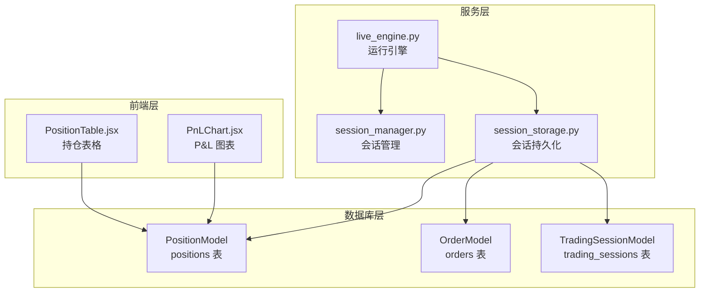
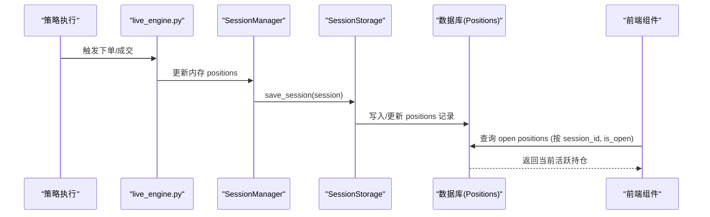
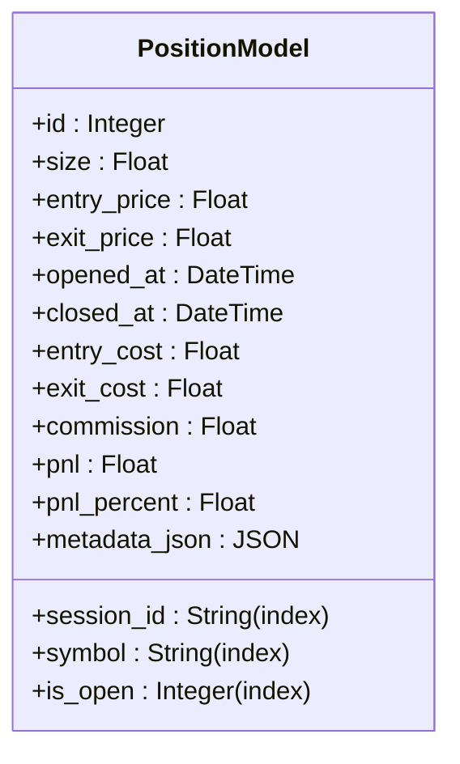
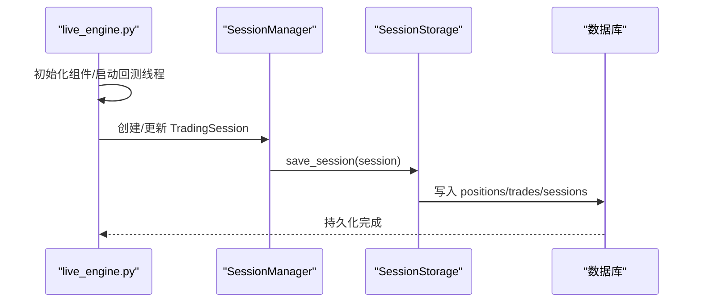
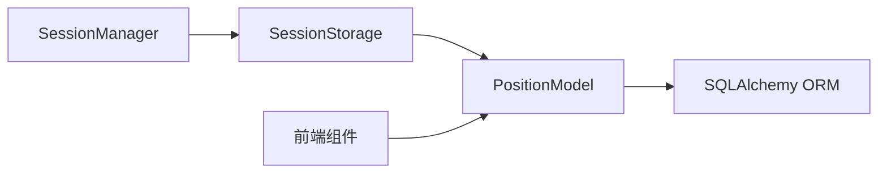

# 持仓模型

<cite>
**本文引用的文件**
- [models.py](file://backend/src/db/models.py)
- [live_engine.py](file://backend/src/service/live_engine.py)
- [session_manager.py](file://backend/src/service/session_manager.py)
- [session_storage.py](file://backend/src/db/session_storage.py)
- [PositionTable.jsx](file://frontend/src/components/LiveTrading/PositionTable.jsx)
- [PnLChart.jsx](file://frontend/src/components/LiveTrading/PnLChart.jsx)
- [backtest_engine.py](file://backend/src/service/backtest_engine.py)
</cite>

## 目录
1. [简介](#简介)
2. [项目结构](#项目结构)
3. [核心组件](#核心组件)
4. [架构总览](#架构总览)
5. [详细组件分析](#详细组件分析)
6. [依赖关系分析](#依赖关系分析)
7. [性能考量](#性能考量)
8. [故障排查指南](#故障排查指南)
9. [结论](#结论)
10. [附录](#附录)

## 简介
本文件系统性地文档化 PositionModel 的设计与实现，围绕以下目标展开：
- size 正负值表示多空头寸的业务语义与前端展示映射
- entry_price、exit_price 构成的盈亏计算基础
- is_open 索引字段在快速筛选活跃持仓中的性能优势
- entry_cost、exit_cost、pnl、pnl_percent 等衍生财务指标的计算方法与更新策略
- 结合 live_engine.py 中的持仓管理逻辑，阐述开仓、平仓操作与持仓记录的联动机制
- metadata 字段在存储策略特定持仓标签时的灵活应用
- 基于 symbol 和 session_id 的复合查询优化建议

## 项目结构
与 PositionModel 相关的核心模块分布如下：
- 数据库层：定义 PositionModel 及其字段、索引、序列化方式
- 服务层：运行引擎与会话管理，负责将策略执行产生的状态持久化
- 前端层：实时展示持仓、未实现盈亏与 P&L 百分比

图表来源
- [models.py](file://backend/src/db/models.py#L175-L221)
- [live_engine.py](file://backend/src/service/live_engine.py#L100-L200)
- [session_manager.py](file://backend/src/service/session_manager.py#L29-L112)
- [session_storage.py](file://backend/src/db/session_storage.py#L59-L123)
- [PositionTable.jsx](file://frontend/src/components/LiveTrading/PositionTable.jsx#L1-L98)
- [PnLChart.jsx](file://frontend/src/components/LiveTrading/PnLChart.jsx#L82-L112)

章节来源
- [models.py](file://backend/src/db/models.py#L175-L221)
- [live_engine.py](file://backend/src/service/live_engine.py#L100-L200)
- [session_manager.py](file://backend/src/service/session_manager.py#L29-L112)
- [session_storage.py](file://backend/src/db/session_storage.py#L59-L123)
- [PositionTable.jsx](file://frontend/src/components/LiveTrading/PositionTable.jsx#L1-L98)
- [PnLChart.jsx](file://frontend/src/components/LiveTrading/PnLChart.jsx#L82-L112)

## 核心组件
- PositionModel：定义持仓记录的数据结构、索引与序列化字段，承载多空头寸、成本、盈亏与状态等信息
- SessionManager：维护运行中会话的状态与内存数据（含 positions 列表），用于实时展示与持久化
- SessionStorage：提供保存/加载会话、订单、位置等数据库操作
- 前端组件：PositionTable.jsx 与 PnLChart.jsx 展示当前 open positions 与 P&L 走势

章节来源
- [models.py](file://backend/src/db/models.py#L175-L221)
- [session_manager.py](file://backend/src/service/session_manager.py#L29-L112)
- [session_storage.py](file://backend/src/db/session_storage.py#L59-L123)
- [PositionTable.jsx](file://frontend/src/components/LiveTrading/PositionTable.jsx#L1-L98)
- [PnLChart.jsx](file://frontend/src/components/LiveTrading/PnLChart.jsx#L82-L112)

## 架构总览
PositionModel 在系统中的职责与交互如下：
- 字段层面：size 正负表达方向；entry_price/exit_price 提供盈亏计算基础；entry_cost/exit_cost/pnl/pnl_percent 为衍生指标
- 索引层面：is_open 为活跃筛选提供高效过滤；session_id、symbol 建立复合查询能力
- 生命周期：策略执行产生开仓/平仓事件，SessionManager 维护内存 positions，SessionStorage 将其持久化至数据库
- 前端：PositionTable.jsx 依据 size 符号显示多空方向与数量绝对值；PnLChart.jsx 基于历史 P&L 数据绘制趋势

图表来源
- [live_engine.py](file://backend/src/service/live_engine.py#L100-L200)
- [session_manager.py](file://backend/src/service/session_manager.py#L29-L112)
- [session_storage.py](file://backend/src/db/session_storage.py#L59-L123)
- [models.py](file://backend/src/db/models.py#L175-L221)
- [PositionTable.jsx](file://frontend/src/components/LiveTrading/PositionTable.jsx#L1-L98)
- [PnLChart.jsx](file://frontend/src/components/LiveTrading/PnLChart.jsx#L82-L112)

## 详细组件分析

### PositionModel 设计要点
- 多空头寸语义：size 为正表示多头，size 为负表示空头；前端以符号与颜色直观呈现
- 成本与价格：entry_price/exit_price 作为盈亏计算基础；entry_cost/exit_cost 用于记录开平仓总成本
- 衍生指标：pnl 与 pnl_percent 由开平仓事件或实时行情驱动计算并落库
- 状态与索引：is_open 为 1 表示 open，0 表示 closed；is_open、session_id、symbol 建立高效查询路径
- 元数据：metadata_json 以 JSON 存储策略特定标签，便于扩展标注

图表来源
- [models.py](file://backend/src/db/models.py#L175-L221)

章节来源
- [models.py](file://backend/src/db/models.py#L175-L221)

### size 正负值与多空头寸业务逻辑
- 业务约定：size > 0 为多头，size < 0 为空头；前端根据符号渲染“LONG/SHORT”与颜色
- 数量展示：前端以绝对值显示 size，避免重复表达方向信息
- 与策略一致性：策略侧的下单/平仓方向应与 size 符号保持一致，确保数据库与前端展示一致

章节来源
- [PositionTable.jsx](file://frontend/src/components/LiveTrading/PositionTable.jsx#L22-L31)
- [PositionTable.jsx](file://frontend/src/components/LiveTrading/PositionTable.jsx#L33-L37)
- [models.py](file://backend/src/db/models.py#L190-L194)

### entry_price、exit_price 与盈亏计算基础
- 开仓：记录 entry_price 与 entry_cost（通常为 size × entry_price，考虑手续费）
- 平仓：记录 exit_price 与 exit_cost；pnl 通常为 (exit_price - entry_price) × |size|，扣除双边手续费
- 实盘场景：若存在滑点或部分成交，需在平仓时修正成本与手续费累计
- 前端百分比：当未直接落库 pnl_percent 时，前端可按 avg_price 与 abs(size) 计算 P&L 百分比

章节来源
- [models.py](file://backend/src/db/models.py#L190-L205)
- [PositionTable.jsx](file://frontend/src/components/LiveTrading/PositionTable.jsx#L64-L80)

### is_open 索引字段的性能优势
- 快速筛选：is_open 为 1 的记录即为活跃持仓，数据库可通过该索引快速定位
- 复合查询：结合 session_id、symbol 可形成高效复合过滤，减少全表扫描
- 前端查询：前端在获取“当前 open positions”时，可直接使用 session_id 与 is_open 过滤，降低后端压力

章节来源
- [models.py](file://backend/src/db/models.py#L206-L208)
- [PositionTable.jsx](file://frontend/src/components/LiveTrading/PositionTable.jsx#L1-L98)

### 衍生财务指标：entry_cost、exit_cost、pnl、pnl_percent 的计算与更新
- entry_cost：开仓时记录为 size × entry_price ± 手续费
- exit_cost：平仓时记录为平仓规模对应的成本（可能为部分平仓的成本摊销）
- pnl：平仓时计算，通常为 (exit_price - entry_price) × |size| - 手续费
- pnl_percent：可由后端落库，也可由前端按 avg_price 与 abs(size) 推导
- 更新策略：在策略成交回调中计算并写入数据库；或在前端按实时行情计算展示

章节来源
- [models.py](file://backend/src/db/models.py#L199-L205)
- [PositionTable.jsx](file://frontend/src/components/LiveTrading/PositionTable.jsx#L64-L80)

### 开仓、平仓与持仓记录的联动机制（结合 live_engine.py）
- 运行引擎：live_engine.py 启动策略执行，创建 Cerebro、注册分析器与 Broker
- 会话管理：SessionManager 维护 TradingSession，包含 positions 列表与状态
- 持久化：SessionStorage.save_session 将 positions 等内存数据写入数据库
- 联动流程：策略下单/成交触发 SessionManager 更新 positions，随后通过 SessionStorage 落库，前端据此刷新

图表来源
- [live_engine.py](file://backend/src/service/live_engine.py#L100-L200)
- [session_manager.py](file://backend/src/service/session_manager.py#L29-L112)
- [session_storage.py](file://backend/src/db/session_storage.py#L59-L123)

章节来源
- [live_engine.py](file://backend/src/service/live_engine.py#L100-L200)
- [session_manager.py](file://backend/src/service/session_manager.py#L29-L112)
- [session_storage.py](file://backend/src/db/session_storage.py#L59-L123)

### metadata 字段的灵活应用
- 存储策略特定标签：如策略名、参数快照、入场条件标签、风控标识等
- JSON 结构：通过 SafeJSON 类型安全地存取，避免空值与解析错误
- 查询建议：metadata 中的键值可用于前端筛选与报表聚合，但不建议建立索引，除非有明确的高选择性查询需求

章节来源
- [models.py](file://backend/src/db/models.py#L210-L211)
- [models.py](file://backend/src/db/models.py#L23-L41)

### 基于 symbol 与 session_id 的复合查询优化建议
- 常见查询模式：
  - 获取某会话的活跃持仓：按 session_id 与 is_open=1 过滤
  - 获取某交易对的活跃持仓：按 symbol 与 is_open=1 过滤
  - 获取某会话下某交易对的活跃持仓：复合 session_id+symbol+is_open
- 索引策略：
  - 已有 session_id、symbol、is_open 索引，满足上述常见查询
  - 若查询频繁且数据量大，可考虑为 session_id+is_open 建立联合索引以进一步提升过滤效率
- 前端优化：
  - 前端在拉取“当前 open positions”时，优先使用 session_id 与 is_open 过滤，减少网络传输与前端渲染负担

章节来源
- [models.py](file://backend/src/db/models.py#L186-L208)
- [PositionTable.jsx](file://frontend/src/components/LiveTrading/PositionTable.jsx#L1-L98)

## 依赖关系分析
- PositionModel 依赖 SQLAlchemy 定义字段与索引
- SessionManager 与 SessionStorage 协作，将内存 positions 持久化
- 前端组件依赖后端提供的数据结构与查询结果

图表来源
- [models.py](file://backend/src/db/models.py#L175-L221)
- [session_manager.py](file://backend/src/service/session_manager.py#L29-L112)
- [session_storage.py](file://backend/src/db/session_storage.py#L59-L123)
- [PositionTable.jsx](file://frontend/src/components/LiveTrading/PositionTable.jsx#L1-L98)

章节来源
- [models.py](file://backend/src/db/models.py#L175-L221)
- [session_manager.py](file://backend/src/service/session_manager.py#L29-L112)
- [session_storage.py](file://backend/src/db/session_storage.py#L59-L123)
- [PositionTable.jsx](file://frontend/src/components/LiveTrading/PositionTable.jsx#L1-L98)

## 性能考量
- 索引命中：is_open、session_id、symbol 已建立索引，可显著降低活跃持仓筛选的查询成本
- 联合索引：对于高频的 session_id+is_open 或 session_id+symbol+is_open 查询，可评估添加联合索引
- 前端缓存：前端可缓存最近一次查询结果，减少重复请求
- 数据量控制：定期清理历史数据或归档，避免 positions 表膨胀影响查询性能

## 故障排查指南
- 活跃持仓为空：检查 is_open 是否正确更新；确认 session_id 是否匹配当前会话
- 盈亏异常：核对 entry_price/exit_price 与 size 符号是否一致；检查手续费累计是否正确
- 元数据解析失败：确认 metadata_json 的 JSON 结构合法，必要时回退默认空对象
- 前端百分比显示：若后端未落库 pnl_percent，前端可按 avg_price 与 abs(size) 推导，注意除零与精度问题

章节来源
- [models.py](file://backend/src/db/models.py#L199-L205)
- [models.py](file://backend/src/db/models.py#L23-L41)
- [PositionTable.jsx](file://frontend/src/components/LiveTrading/PositionTable.jsx#L64-L80)

## 结论
PositionModel 通过 size 正负表达多空方向、entry_price/exit_price 构建盈亏基础、is_open 索引支撑活跃持仓快速筛选，并以 entry_cost/exit_cost/pnl/pnl_percent 等指标完整覆盖财务链路。结合 live_engine.py 的会话管理与持久化流程，实现了从策略执行到数据库落库再到前端展示的闭环。metadata 字段提供了策略特定标签的灵活扩展空间。通过合理的索引与查询优化，可在大规模数据场景下保持良好的性能表现。

## 附录
- 前端展示要点：多空方向与数量绝对值的统一展示，有助于避免歧义
- 实盘注意事项：滑点、手续费、部分成交等因素需在平仓时准确计入成本与手续费