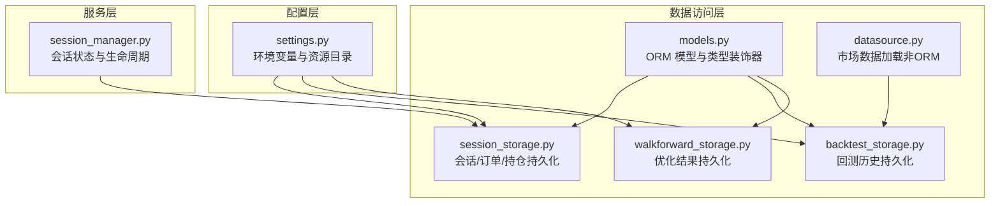
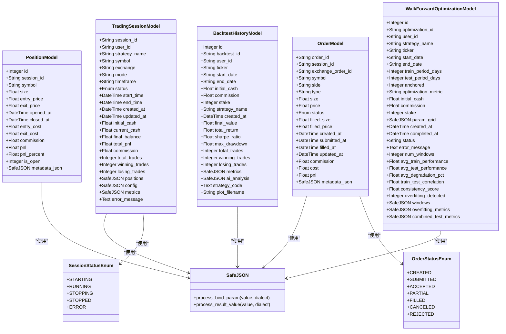
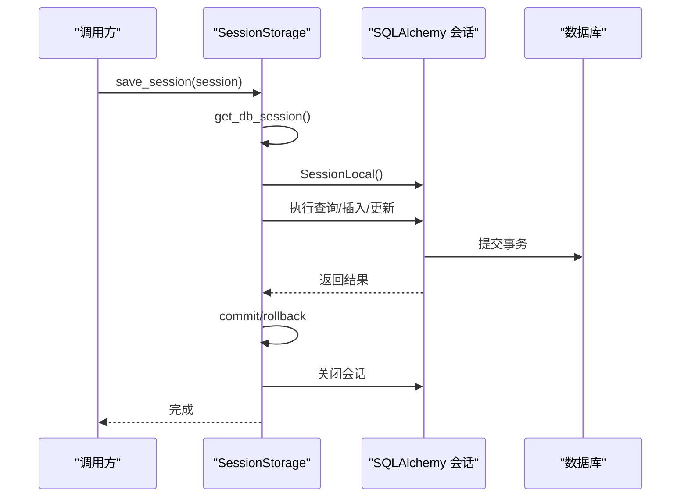
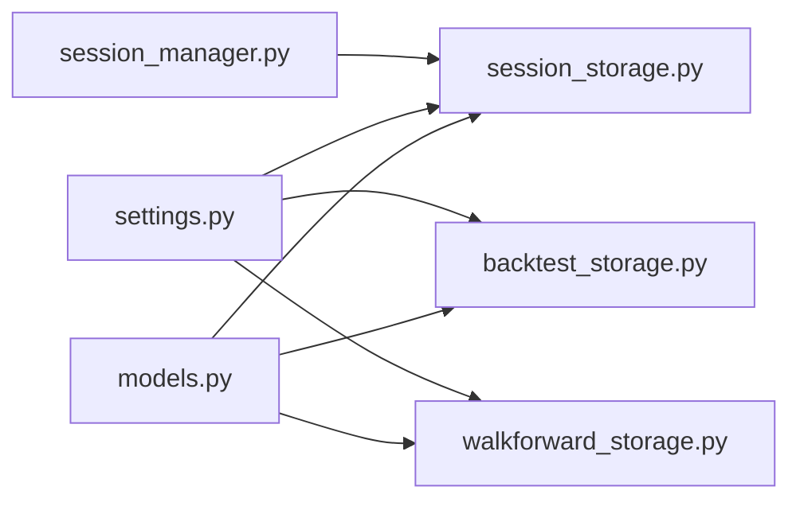

# 核心实体模型

<cite>
**本文引用的文件**
- [models.py](file://backend/src/db/models.py)
- [session_storage.py](file://backend/src/db/session_storage.py)
- [backtest_storage.py](file://backend/src/db/backtest_storage.py)
- [walkforward_storage.py](file://backend/src/db/walkforward_storage.py)
- [datasource.py](file://backend/src/db/datasource.py)
- [settings.py](file://backend/src/config/settings.py)
- [session_manager.py](file://backend/src/service/session_manager.py)
</cite>

## 目录
1. [简介](#简介)
2. [项目结构](#项目结构)
3. [核心组件](#核心组件)
4. [架构总览](#架构总览)
5. [详细组件分析](#详细组件分析)
6. [依赖分析](#依赖分析)
7. [性能考量](#性能考量)
8. [故障排查指南](#故障排查指南)
9. [结论](#结论)
10. [附录](#附录)

## 简介
本文件面向数据库与数据访问层，系统性梳理 SQLAlchemy 模型与存储服务，重点覆盖以下内容：
- 数据模型：SessionModel（交易会话）、OrderModel（订单）、PositionModel（持仓）与 TradeModel（交易历史）的字段、类型、约束与索引策略
- 类型装饰器 SafeJSON 的实现原理与异常容错机制
- 枚举类型 SessionStatusEnum、OrderStatusEnum 的业务语义
- 数据库连接管理、事务处理与 ORM 会话生命周期
- 存储服务 backtest_storage.py、session_storage.py、walkforward_storage.py 的设计模式与最佳实践（查询优化、批量操作、一致性保障）

## 项目结构
后端采用分层组织：配置层、服务层、数据访问层（ORM 模型与存储服务）、路由层。数据库模型集中于 backend/src/db/models.py，存储服务分别封装了会话、回测与优化结果的数据持久化逻辑。

图表来源
- [settings.py](file://backend/src/config/settings.py#L1-L81)
- [session_manager.py](file://backend/src/service/session_manager.py#L1-L200)
- [models.py](file://backend/src/db/models.py#L1-L395)
- [session_storage.py](file://backend/src/db/session_storage.py#L1-L392)
- [backtest_storage.py](file://backend/src/db/backtest_storage.py#L1-L444)
- [walkforward_storage.py](file://backend/src/db/walkforward_storage.py#L1-L426)
- [datasource.py](file://backend/src/db/datasource.py#L1-L156)

章节来源
- [models.py](file://backend/src/db/models.py#L1-L395)
- [session_storage.py](file://backend/src/db/session_storage.py#L1-L392)
- [backtest_storage.py](file://backend/src/db/backtest_storage.py#L1-L444)
- [walkforward_storage.py](file://backend/src/db/walkforward_storage.py#L1-L426)
- [datasource.py](file://backend/src/db/datasource.py#L1-L156)
- [settings.py](file://backend/src/config/settings.py#L1-L81)
- [session_manager.py](file://backend/src/service/session_manager.py#L1-L200)

## 核心组件
- 数据模型与类型装饰器
  - SafeJSON：自定义 JSON 类型装饰器，统一处理 NULL 与空字符串，并在反序列化失败时返回 None，避免异常传播
  - SessionStatusEnum、OrderStatusEnum：枚举类型，用于约束状态字段取值范围
  - TradingSessionModel、OrderModel、PositionModel、BacktestHistoryModel、WalkForwardOptimizationModel：核心实体模型
- 存储服务
  - SessionStorage：会话、订单、持仓的增删改查与统计
  - BacktestStorage：回测历史的保存、列表、删除、AI 分析更新与自动清理
  - WalkForwardStorage：优化任务的创建、状态更新、结果落库与列表查询
- 配置与数据源
  - settings.py：数据库 URL、资源目录等配置
  - datasource.py：从数据库或外部源加载市场数据（非 ORM）

章节来源
- [models.py](file://backend/src/db/models.py#L1-L395)
- [session_storage.py](file://backend/src/db/session_storage.py#L1-L392)
- [backtest_storage.py](file://backend/src/db/backtest_storage.py#L1-L444)
- [walkforward_storage.py](file://backend/src/db/walkforward_storage.py#L1-L426)
- [settings.py](file://backend/src/config/settings.py#L1-L81)
- [datasource.py](file://backend/src/db/datasource.py#L1-L156)

## 架构总览
下图展示 ORM 模型、存储服务与配置之间的交互关系，以及会话状态机与持久化流程。

图表来源
- [models.py](file://backend/src/db/models.py#L1-L395)

## 详细组件分析

### 数据模型与字段定义

- TradingSessionModel（交易会话）
  - 主键：session_id（字符串，长度 36，建立索引）
  - 用户标识：user_id（可空，字符串，建立索引）
  - 配置信息：strategy_name、symbol、exchange、mode、timeframe（字符串，部分字段建立索引）
  - 状态：status（枚举 SessionStatusEnum，建立索引）
  - 时间戳：start_time、end_time、created_at、updated_at（默认值与更新行为）
  - 资金与指标：initial_cash、current_cash、final_balance、total_pnl、commission、total_trades、winning_trades、losing_trades
  - JSON 字段：positions（当前持仓列表）、config（会话配置）、metrics（性能指标）
  - 错误追踪：error_message（文本）
  - 索引策略：多处字段建立索引以支持过滤与排序；updated_at 使用 onupdate 自动更新
  - 复杂度与约束：主键唯一；部分字段非空；JSON 字段默认值为安全容器类型

- OrderModel（订单）
  - 主键：order_id（字符串，建立索引）
  - 关联：session_id（字符串，建立索引）
  - 交易所订单号：exchange_order_id（字符串，建立索引）
  - 订单详情：symbol、side（买卖）、type（市价/限价等）、size、price（限价）
  - 状态：status（枚举 OrderStatusEnum，建立索引）
  - 成交细节：filled_size、filled_price、filled_at
  - 时间戳：created_at、submitted_at、updated_at
  - 财务：commission、cost、pnl
  - 元数据：metadata_json（JSON）
  - 索引策略：session_id、exchange_order_id、status 建立索引；updated_at onupdate

- PositionModel（持仓）
  - 主键：id（自增整数）
  - 关联：session_id（字符串，建立索引）
  - 持仓详情：symbol、size（正多负空）、entry_price、exit_price
  - 时间戳：opened_at、closed_at
  - 财务：entry_cost、exit_cost、commission、pnl、pnl_percent
  - 状态：is_open（整数 1/0，建立索引）
  - 元数据：metadata_json（JSON）
  - 索引策略：session_id、symbol、is_open 建立索引

- BacktestHistoryModel（回测历史）
  - 主键：id（自增整数）
  - 唯一标识：backtest_id（字符串，唯一且建立索引）
  - 用户标识：user_id（可空，建立索引）
  - 配置参数：ticker、start_date、end_date、initial_cash、commission、stake、strategy_name
  - 时间戳：created_at（建立索引）
  - 绩效指标：final_value、total_return（建立索引）、sharpe_ratio（建立索引）、max_drawdown、total_trades、winning_trades、losing_trades
  - JSON 字段：metrics（完整指标）、ai_analysis（可空）、strategy_code（可空）
  - 图表文件名：plot_filename（可空）
  - 索引策略：多字段建立索引以支持快速筛选与排序

- WalkForwardOptimizationModel（滚动优化）
  - 主键：id（自增整数）
  - 唯一标识：optimization_id（字符串，唯一且建立索引）
  - 用户标识：user_id（可空，建立索引）
  - 配置参数：strategy_name、ticker、start_date、end_date、train_period_days、test_period_days、anchored、optimization_metric、initial_cash、commission、stake
  - 参数网格：param_grid（JSON）
  - 时间戳：created_at（建立索引）、completed_at（可空）
  - 状态：status（字符串，默认 pending，建立索引）
  - 结果摘要：num_windows、avg_train_performance、avg_test_performance、avg_degradation_pct、train_test_correlation、consistency_score、overfitting_detected
  - JSON 字段：windows、overfitting_metrics、combined_test_metrics
  - 索引策略：多字段建立索引以支持查询与排序

章节来源
- [models.py](file://backend/src/db/models.py#L1-L395)

### SafeJSON 类型装饰器实现与容错机制
- 实现要点
  - 绑定阶段：process_bind_param 将 None 映射为 SQL NULL，其他值通过 json.dumps 序列化
  - 取回阶段：process_result_value 对 NULL 或空字符串返回 None；尝试 json.loads 解码，失败则返回 None，避免异常传播
- 容错策略
  - 避免因 JSON 异常导致 ORM 查询中断
  - 在存储服务中提供“损坏记录清理”能力，进一步保证数据一致性
- 使用场景
  - 所有 JSON 字段（如 positions、metrics、param_grid、windows 等）均采用 SafeJSON，确保读写稳定

章节来源
- [models.py](file://backend/src/db/models.py#L23-L41)

### 枚举类型与业务语义
- SessionStatusEnum
  - STARTING：会话启动中
  - RUNNING：会话运行中
  - STOPPING：会话停止中
  - STOPPED：已停止
  - ERROR：发生错误
- OrderStatusEnum
  - CREATED：已创建
  - SUBMITTED：已提交
  - ACCEPTED：已受理
  - PARTIAL：部分成交
  - FILLED：全部成交
  - CANCELED：已撤销
  - REJECTED：被拒绝
- 业务意义
  - 通过枚举限定状态取值，便于前端与服务层进行状态机控制与一致性校验
  - 存储服务在保存/更新时将运行时状态映射到枚举值，确保数据库状态合法

章节来源
- [models.py](file://backend/src/db/models.py#L43-L61)
- [session_storage.py](file://backend/src/db/session_storage.py#L1-L392)

### 数据库连接管理、事务处理与 ORM 会话生命周期
- 连接与工厂
  - init_database 创建引擎并创建所有表，返回 engine 与 SessionLocal 工厂
  - 各存储服务在构造函数中调用 init_database 获取 engine 与 SessionLocal
- 事务与会话
  - 存储服务方法内部显式创建 ORM 会话（SessionLocal()），在 try/except/finally 中完成 commit/rollback/close
  - 列表查询与统计方法均遵循“获取会话 -> 执行 -> 提交/回滚 -> 关闭”的模式
- 生命周期
  - 会话作用域最小化：每个操作独立获取/关闭会话，避免长事务与锁竞争
  - 异常处理：捕获异常后执行 rollback 并重新抛出，确保状态一致

图表来源
- [session_storage.py](file://backend/src/db/session_storage.py#L1-L392)
- [models.py](file://backend/src/db/models.py#L225-L254)

章节来源
- [models.py](file://backend/src/db/models.py#L225-L254)
- [session_storage.py](file://backend/src/db/session_storage.py#L1-L392)

### 数据访问层设计模式与最佳实践

#### SessionStorage（会话/订单/持仓）
- 设计模式
  - 存储服务封装：将 CRUD 与统计聚合逻辑集中在类内，屏蔽 ORM 细节
  - 会话注入：支持传入外部会话，便于上层事务合并
- 最佳实践
  - 查询优化：按需过滤（status、session_id、symbol 等）并使用索引字段排序
  - 批量操作：批量保存订单时建议使用批量插入（当前实现逐条 add，可扩展）
  - 一致性保障：每个操作在 try/finally 中确保会话关闭；异常时回滚
- 关键流程
  - 保存会话：存在则更新，不存在则新增
  - 加载会话：从数据库模型转换为运行时对象
  - 订单查询：按时间顺序返回订单字典
  - 统计：按状态计数

章节来源
- [session_storage.py](file://backend/src/db/session_storage.py#L1-L392)

#### BacktestStorage（回测历史）
- 设计模式
  - 自动清理：超过阈值上限时删除最旧记录，并清理对应图片文件
  - 容错清理：检测 metrics/ai_analysis 等字段为空或无效时，通过原生 SQL 删除
- 最佳实践
  - 查询优化：对 ticker、strategy_name、created_at 等字段建立索引，支持分页与排序
  - JSON 安全：使用 SafeJSON 存储复杂指标与分析，避免解析异常
  - 事务边界：保存/删除/更新均在独立会话中执行，异常回滚
- 关键流程
  - 保存：提取关键指标写入 denormalized 字段，便于排序与筛选
  - 列表：支持多维过滤、排序与分页
  - 更新 AI 分析：以 JSON 字典形式追加不同模型的分析结果

章节来源
- [backtest_storage.py](file://backend/src/db/backtest_storage.py#L1-L444)
- [models.py](file://backend/src/db/models.py#L257-L316)

#### WalkForwardStorage（滚动优化）
- 设计模式
  - 状态机：pending/running/completed/failed，支持错误信息记录
  - 结果落库：将窗口级结果与汇总指标写入 JSON 字段与 denormalized 字段
- 最佳实践
  - 查询优化：按 ticker、strategy_name、status、created_at 排序与分页
  - 性能指标：将 avg_train_performance、avg_test_performance 等 denormalized 字段，便于快速排序
- 关键流程
  - 创建：初始化为 pending
  - 更新状态：支持设置 error_message 与 completed_at
  - 保存结果：序列化窗口与过拟合指标，更新 denormalized 字段

章节来源
- [walkforward_storage.py](file://backend/src/db/walkforward_storage.py#L1-L426)
- [models.py](file://backend/src/db/models.py#L318-L391)

#### 数据源加载（非 ORM）
- datasource.py
  - 优先从数据库读取历史行情，其次使用 yfinance 下载，最后生成合成数据
  - 适配 Backtrader Feed 输入格式，保证前端图表数据可用
- 与 ORM 的关系
  - 该模块不直接使用 models.py 中的 ORM 模型，而是通过 SQL 查询 stock_prices 表

章节来源
- [datasource.py](file://backend/src/db/datasource.py#L1-L156)

## 依赖分析
- 模型依赖
  - 所有 JSON 字段依赖 SafeJSON 类型装饰器
  - 会话与订单状态依赖枚举类型
- 存储服务依赖
  - SessionStorage 依赖 models 中的 TradingSessionModel、OrderModel、PositionModel、SessionStatusEnum、OrderStatusEnum
  - BacktestStorage 依赖 BacktestHistoryModel 与 SafeJSON
  - WalkForwardStorage 依赖 WalkForwardOptimizationModel 与 SafeJSON
- 配置依赖
  - settings.py 提供 DATABASE_URL 与 IMAGES_DIR，BacktestStorage 依赖 IMAGES_DIR 进行图片清理

图表来源
- [models.py](file://backend/src/db/models.py#L1-L395)
- [session_storage.py](file://backend/src/db/session_storage.py#L1-L392)
- [backtest_storage.py](file://backend/src/db/backtest_storage.py#L1-L444)
- [walkforward_storage.py](file://backend/src/db/walkforward_storage.py#L1-L426)
- [settings.py](file://backend/src/config/settings.py#L1-L81)
- [session_manager.py](file://backend/src/service/session_manager.py#L1-L200)

章节来源
- [models.py](file://backend/src/db/models.py#L1-L395)
- [session_storage.py](file://backend/src/db/session_storage.py#L1-L392)
- [backtest_storage.py](file://backend/src/db/backtest_storage.py#L1-L444)
- [walkforward_storage.py](file://backend/src/db/walkforward_storage.py#L1-L426)
- [settings.py](file://backend/src/config/settings.py#L1-L81)
- [session_manager.py](file://backend/src/service/session_manager.py#L1-L200)

## 性能考量
- 索引策略
  - 高频过滤字段（session_id、symbol、status、created_at 等）建立索引，提升查询效率
  - denormalized 字段（total_return、sharpe_ratio、avg_* 等）便于排序与筛选
- 查询优化
  - 列表接口支持分页与排序，避免一次性加载大量数据
  - 统计接口使用 count() 获取总数，再执行分页查询
- 事务与并发
  - 每个操作独立会话，减少锁竞争；异常回滚确保一致性
- JSON 处理
  - SafeJSON 统一序列化/反序列化，避免解析异常导致的查询失败
- 清理策略
  - 回测历史自动清理旧记录，限制存储空间占用

[本节为通用性能建议，无需特定文件来源]

## 故障排查指南
- JSON 解析异常
  - 现象：查询时出现 JSON 解析错误
  - 处理：使用存储服务提供的“损坏记录清理”功能，删除 metrics/ai_analysis 为空或无效的记录
  - 参考：BacktestStorage 的 _cleanup_corrupted_records 与 migrate_cleanup_json 脚本
- 会话未正确关闭
  - 现象：连接池耗尽或超时
  - 处理：确认每个存储方法均在 finally 中关闭会话；必要时传入外部会话以合并事务
- 状态不一致
  - 现象：状态枚举值非法
  - 处理：确保运行时状态映射到枚举值；检查 SessionStorage 与 WalkForwardStorage 的状态更新逻辑
- 数据库 URL 未配置
  - 现象：无法连接数据库
  - 处理：检查 .env 文件中的 DATABASE_URL；确保 settings.py 正确加载

章节来源
- [backtest_storage.py](file://backend/src/db/backtest_storage.py#L117-L182)
- [session_storage.py](file://backend/src/db/session_storage.py#L1-L392)
- [walkforward_storage.py](file://backend/src/db/walkforward_storage.py#L1-L426)
- [settings.py](file://backend/src/config/settings.py#L1-L81)

## 结论
本数据模型与存储层通过 SafeJSON 统一 JSON 处理、枚举约束状态取值、合理索引与 denormalized 字段提升查询性能，并以“独立会话 + 显式事务 + 异常回滚 + 自动清理”的模式保障一致性与稳定性。SessionStorage、BacktestStorage、WalkForwardStorage 形成了清晰的数据访问层，既满足业务需求又具备良好的扩展性与可维护性。

[本节为总结，无需特定文件来源]

## 附录

### 字段与索引策略速览
- TradingSessionModel
  - session_id（主键，索引）、user_id（索引）、symbol/exchange/status（索引）、created_at/updated_at（默认值与更新）
- OrderModel
  - order_id（主键，索引）、session_id/exchange_order_id/status（索引）、updated_at（onupdate）
- PositionModel
  - id（主键）、session_id/symbol/is_open（索引）
- BacktestHistoryModel
  - backtest_id（唯一，索引）、user_id/ticker/strategy_name/created_at（索引）、total_return/sharpe_ratio（索引）
- WalkForwardOptimizationModel
  - optimization_id（唯一，索引）、user_id/ticker/strategy_name/status/created_at（索引）

章节来源
- [models.py](file://backend/src/db/models.py#L63-L391)