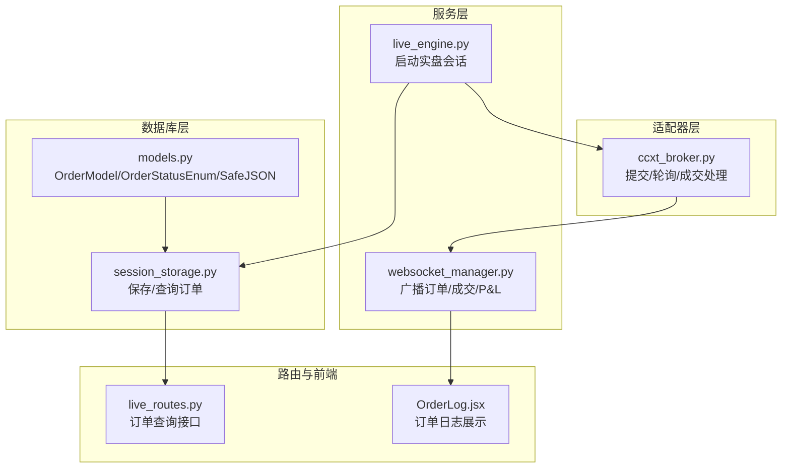
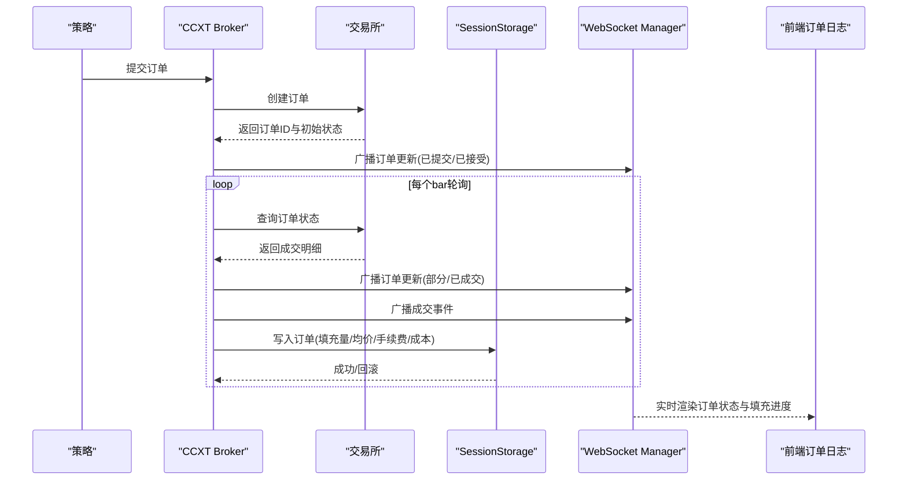
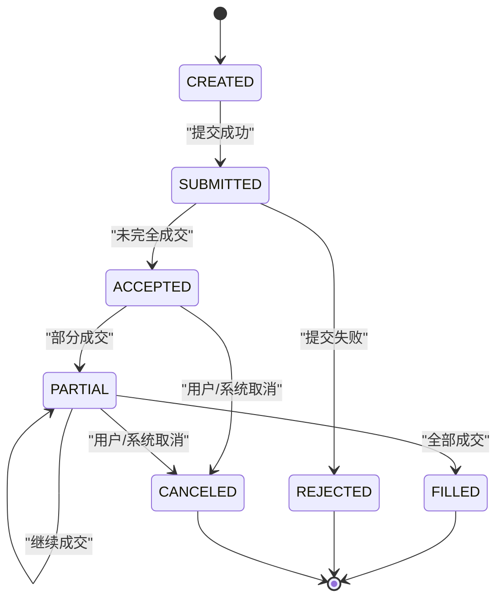
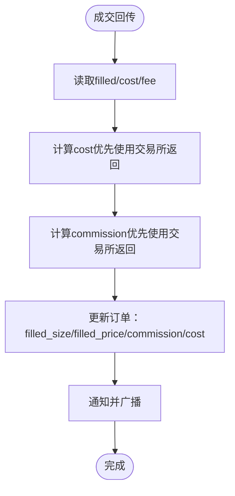
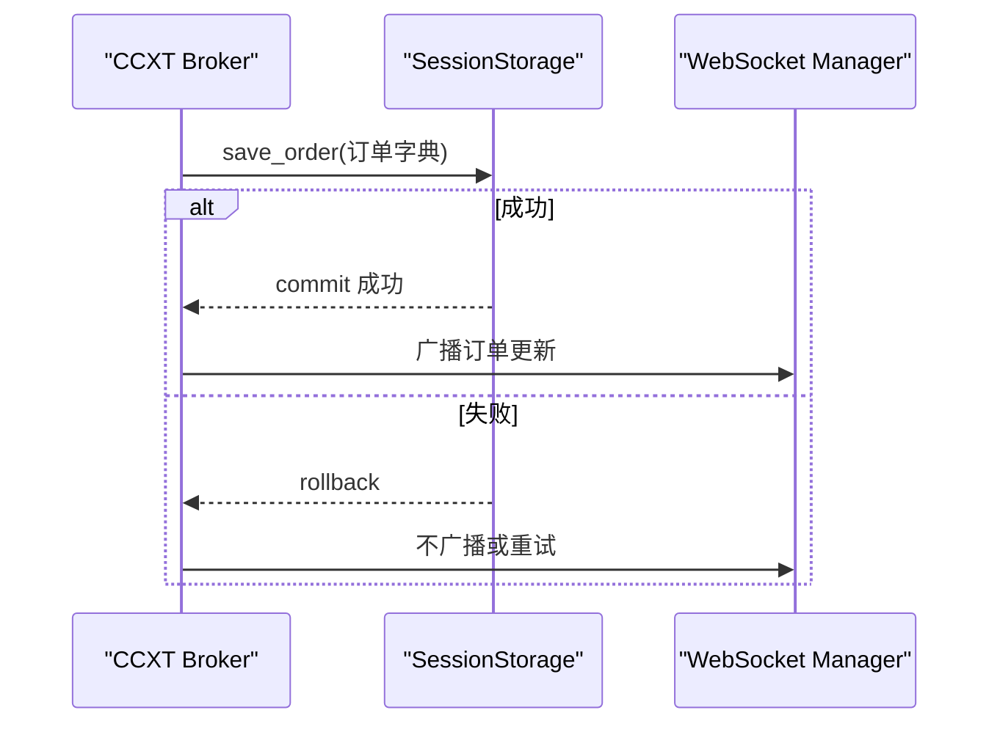
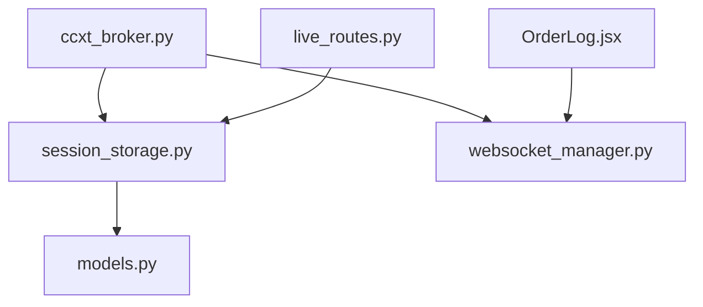

# 订单模型

<cite>
**本文引用的文件列表**
- [models.py](file://backend/src/db/models.py)
- [session_storage.py](file://backend/src/db/session_storage.py)
- [live_engine.py](file://backend/src/service/live_engine.py)
- [ccxt_broker.py](file://backend/src/brokers/ccxt_adapter/ccxt_broker.py)
- [websocket_manager.py](file://backend/src/service/websocket_manager.py)
- [live_routes.py](file://backend/src/routes/live_routes.py)
- [OrderLog.jsx](file://frontend/src/components/LiveTrading/OrderLog.jsx)
</cite>

## 目录
1. [引言](#引言)
2. [项目结构](#项目结构)
3. [核心组件](#核心组件)
4. [架构总览](#架构总览)
5. [详细组件分析](#详细组件分析)
6. [依赖关系分析](#依赖关系分析)
7. [性能考虑](#性能考虑)
8. [故障排查指南](#故障排查指南)
9. [结论](#结论)
10. [附录：典型查询与SQL示例](#附录典型查询与sql示例)

## 引言
本文件围绕订单模型（OrderModel）展开，系统性解析其数据结构设计、关键字段定义与取值范围、状态机全生命周期、执行相关字段的计算逻辑、metadata_json的扩展性设计，以及在 live_engine.py 中的订单写入时机与一致性保障。同时给出典型查询场景与SQL优化建议，帮助读者快速理解并高效使用该模型。

## 项目结构
与订单模型直接相关的后端模块包括：
- 数据库模型层：定义 OrderModel 及枚举类型
- 会话存储层：负责订单持久化与查询
- 实盘引擎：启动实盘会话，驱动策略与订单生命周期
- 适配器层：CCXT 适配器负责订单提交、状态轮询与成交回传
- WebSocket 管理：实时广播订单更新
- 路由层：对外暴露订单查询接口
- 前端展示：订单日志组件消费实时数据

图表来源
- [models.py](file://backend/src/db/models.py#L123-L173)
- [session_storage.py](file://backend/src/db/session_storage.py#L269-L313)
- [live_engine.py](file://backend/src/service/live_engine.py#L100-L260)
- [ccxt_broker.py](file://backend/src/brokers/ccxt_adapter/ccxt_broker.py#L350-L466)
- [websocket_manager.py](file://backend/src/service/websocket_manager.py#L200-L249)
- [live_routes.py](file://backend/src/routes/live_routes.py#L359-L392)
- [OrderLog.jsx](file://frontend/src/components/LiveTrading/OrderLog.jsx#L1-L138)

章节来源
- [models.py](file://backend/src/db/models.py#L123-L173)
- [session_storage.py](file://backend/src/db/session_storage.py#L269-L313)
- [live_engine.py](file://backend/src/service/live_engine.py#L100-L260)
- [ccxt_broker.py](file://backend/src/brokers/ccxt_adapter/ccxt_broker.py#L350-L466)
- [websocket_manager.py](file://backend/src/service/websocket_manager.py#L200-L249)
- [live_routes.py](file://backend/src/routes/live_routes.py#L359-L392)
- [OrderLog.jsx](file://frontend/src/components/LiveTrading/OrderLog.jsx#L1-L138)

## 核心组件
- 订单模型（OrderModel）：持久化所有交易会话中的订单，包含订单标识、会话关联、交易所订单号、方向与类型、数量与价格、状态与填充细节、时间戳、手续费与成本、P&L、以及扩展字段 metadata_json。
- 订单状态枚举（OrderStatusEnum）：定义从创建到完成的完整状态序列，便于统一管理与查询。
- 会话存储（SessionStorage）：提供 save_order/get_session_orders 等方法，封装数据库事务与异常回滚。
- 实盘引擎（LiveEngine）：启动会话、加载策略与适配器、运行 Cerebro，并通过会话存储持久化状态。
- CCXT 适配器（CCXT Broker）：负责订单提交、状态轮询、成交处理与 WebSocket 广播。
- WebSocket 管理（WebSocket Manager）：向客户端推送订单更新、成交、P&L 等事件。
- 路由（Live Routes）：提供按会话查询订单的 API。
- 前端组件（OrderLog.jsx）：展示订单状态、填充进度、均价、手续费等。

章节来源
- [models.py](file://backend/src/db/models.py#L52-L61)
- [models.py](file://backend/src/db/models.py#L123-L173)
- [session_storage.py](file://backend/src/db/session_storage.py#L269-L313)
- [live_engine.py](file://backend/src/service/live_engine.py#L100-L260)
- [ccxt_broker.py](file://backend/src/brokers/ccxt_adapter/ccxt_broker.py#L350-L466)
- [websocket_manager.py](file://backend/src/service/websocket_manager.py#L200-L249)
- [live_routes.py](file://backend/src/routes/live_routes.py#L359-L392)
- [OrderLog.jsx](file://frontend/src/components/LiveTrading/OrderLog.jsx#L1-L138)

## 架构总览
订单从策略生成到数据库落盘与实时推送的关键路径如下：

图表来源
- [ccxt_broker.py](file://backend/src/brokers/ccxt_adapter/ccxt_broker.py#L350-L466)
- [websocket_manager.py](file://backend/src/service/websocket_manager.py#L200-L249)
- [session_storage.py](file://backend/src/db/session_storage.py#L269-L313)
- [OrderLog.jsx](file://frontend/src/components/LiveTrading/OrderLog.jsx#L1-L138)

## 详细组件分析

### 订单模型数据结构设计
- 关键字段与约束
  - order_id：主键，唯一标识单笔订单；用于前端展示与索引。
  - session_id：外键关联交易会话；支持按会话查询与聚合。
  - exchange_order_id：交易所返回的订单ID，便于外部追踪与对账。
  - symbol、side、type、size、price：订单标的、方向（买/卖）、类型（市价/限价等）、委托数量与限价（可空）。
  - status：订单状态（枚举），支持按状态过滤与统计。
  - filled_size、filled_price：累计填充数量与加权平均成交价；用于前端填充进度与收益计算。
  - created_at、submitted_at、filled_at、updated_at：时间戳，便于审计与排序。
  - commission、cost、pnl：手续费、总成本、平仓时的盈亏；成本与手续费来源于适配器成交回传。
  - metadata_json：扩展字段，以 JSON 存储交易所特定属性或策略自定义元数据。

- 字段取值范围与约束
  - side：'buy' 或 'sell'，与 size 符号一致（正数为多头，负数为空头）。
  - type：'market'、'limit' 等，适配器根据策略执行类型映射。
  - size：浮点数，必须非空；与 side 共同决定方向。
  - price：限价单有效，可空表示市价单。
  - filled_size：默认 0，随成交递增，最大不超过 size 的绝对值。
  - filled_price：首次成交均价，后续成交可能更新为加权均价。
  - cost：总成本，通常等于 filled_size × filled_price（含手续费时由适配器计算）。
  - commission：累计手续费，由适配器基于成交明细计算。
  - metadata_json：任意 JSON 结构，用于承载交易所特性（如 IOC/FOK、手续费率、最小下单量等）。

章节来源
- [models.py](file://backend/src/db/models.py#L123-L173)

### 订单状态机与生命周期
- 状态枚举（OrderStatusEnum）
  - CREATED、SUBMITTED、ACCEPTED、PARTIAL、FILLED、CANCELED、REJECTED
- 状态流转
  - 创建：策略生成订单后进入 CREATED。
  - 提交：适配器成功提交至交易所后进入 SUBMITTED；若提交失败则 REJECTED。
  - 接受：交易所返回非关闭状态（如 accepted）时进入 ACCEPTED。
  - 部分成交：部分填充时进入 PARTIAL，随后持续更新 filled_size/filled_price。
  - 完成：全部成交进入 FILLED；取消则进入 CANCELED。
- 适配器侧状态映射
  - 提交后若交易所返回 closed，则直接进入 FILLED；否则进入 ACCEPTED，等待 next() 轮询。
  - 若 fetch_order 返回 canceled，则进入 CANCELED。

图表来源
- [models.py](file://backend/src/db/models.py#L52-L61)
- [ccxt_broker.py](file://backend/src/brokers/ccxt_adapter/ccxt_broker.py#L350-L466)

章节来源
- [models.py](file://backend/src/db/models.py#L52-L61)
- [ccxt_broker.py](file://backend/src/brokers/ccxt_adapter/ccxt_broker.py#L350-L466)

### 执行相关字段的计算逻辑
- filled_size
  - 初始为 0；每次成交累加，最终等于 size 的绝对值（对于限价单）。
- filled_price
  - 首次成交即记录均价；后续成交可能按加权均价更新（取决于适配器实现）。
- cost
  - 适配器从交易所返回的成交明细中提取 cost 字段；若无则按 filled_size × filled_price 估算，并叠加手续费。
- commission
  - 适配器从成交明细 fee 字段读取；若无则按 cost × commission_rate 计算。
- pnl
  - 平仓时计算，依据平仓价格与开仓均价差额乘以数量；仅在卖出平仓时产生。

图表来源
- [ccxt_broker.py](file://backend/src/brokers/ccxt_adapter/ccxt_broker.py#L362-L405)
- [session_storage.py](file://backend/src/db/session_storage.py#L269-L313)

章节来源
- [ccxt_broker.py](file://backend/src/brokers/ccxt_adapter/ccxt_broker.py#L362-L405)
- [session_storage.py](file://backend/src/db/session_storage.py#L269-L313)

### metadata_json 的扩展性设计
- 设计目的
  - 为不同交易所的订单特性提供灵活扩展，避免频繁修改表结构。
- 典型用途
  - 存放交易所特定字段：如最小下单量、是否 IOC/FOK、手续费率、滑点容忍度等。
  - 支持策略自定义元数据：如止盈止损参数、网格档位等。
- 使用建议
  - 前端与后端约定字段命名规范，确保兼容性。
  - 对于高频查询字段，可在数据库层增加派生列或索引以提升查询效率。

章节来源
- [models.py](file://backend/src/db/models.py#L163-L165)

### 订单写入时机与一致性保障
- 写入时机
  - 订单创建：策略生成订单后，适配器提交至交易所前，可先入库（可选）。
  - 订单更新：每次成交回传时，适配器调用 SessionStorage.save_order 更新 filled_size/filled_price/commission/cost 等字段。
  - 订单完成：当状态变为 FILLED/CANCELED/REJECTED 时，可再次入库以固化最终状态。
- 一致性保障
  - 事务边界：SessionStorage.save_order 在独立数据库会话内执行，失败时回滚，避免脏数据。
  - 幂等性：前端与适配器需避免重复写入相同状态；可通过 order_id 唯一性约束与状态比较来规避。
  - 广播与持久化解耦：WebSocket 广播不依赖数据库写入结果，但数据库写入成功后再进行广播，确保前端看到最新状态。

图表来源
- [session_storage.py](file://backend/src/db/session_storage.py#L269-L313)
- [ccxt_broker.py](file://backend/src/brokers/ccxt_adapter/ccxt_broker.py#L407-L459)
- [websocket_manager.py](file://backend/src/service/websocket_manager.py#L200-L249)

章节来源
- [session_storage.py](file://backend/src/db/session_storage.py#L269-L313)
- [ccxt_broker.py](file://backend/src/brokers/ccxt_adapter/ccxt_broker.py#L407-L459)
- [websocket_manager.py](file://backend/src/service/websocket_manager.py#L200-L249)

### 典型查询场景与前端展示
- 按会话查询订单
  - 后端接口：GET /live/orders/{session_id}
  - 前端组件：OrderLog.jsx 展示订单列表，包含时间、标的、方向、类型、数量、价格、填充进度、均价、状态、手续费等。
- 按状态统计订单
  - 可通过数据库聚合统计各状态的数量分布，用于监控与报表。
- 性能优化建议
  - 为 session_id、status、created_at 添加复合索引，加速按会话与状态过滤。
  - 将高频字段（如 filled_size/filled_price/status）作为派生列或物化视图，减少复杂查询。
  - 分页查询与游标分页，避免一次性拉取大量历史订单。

章节来源
- [live_routes.py](file://backend/src/routes/live_routes.py#L359-L392)
- [OrderLog.jsx](file://frontend/src/components/LiveTrading/OrderLog.jsx#L1-L138)

## 依赖关系分析
- 组件耦合
  - CCXT Broker 与 SessionStorage 强耦合：成交回传时直接写库并广播。
  - WebSocket Manager 与 Broker 解耦：通过广播消息传递，降低耦合度。
  - 前端组件仅依赖 WebSocket 事件，不直接访问数据库。
- 外部依赖
  - 交易所 API：获取订单状态与成交明细。
  - 数据库：持久化订单与会话状态。
- 循环依赖
  - 未发现循环依赖；模块职责清晰。

图表来源
- [ccxt_broker.py](file://backend/src/brokers/ccxt_adapter/ccxt_broker.py#L350-L466)
- [session_storage.py](file://backend/src/db/session_storage.py#L269-L313)
- [models.py](file://backend/src/db/models.py#L123-L173)
- [live_routes.py](file://backend/src/routes/live_routes.py#L359-L392)
- [OrderLog.jsx](file://frontend/src/components/LiveTrading/OrderLog.jsx#L1-L138)

章节来源
- [ccxt_broker.py](file://backend/src/brokers/ccxt_adapter/ccxt_broker.py#L350-L466)
- [session_storage.py](file://backend/src/db/session_storage.py#L269-L313)
- [models.py](file://backend/src/db/models.py#L123-L173)
- [live_routes.py](file://backend/src/routes/live_routes.py#L359-L392)
- [OrderLog.jsx](file://frontend/src/components/LiveTrading/OrderLog.jsx#L1-L138)

## 性能考虑
- 数据库层面
  - 为 orders 表添加索引：session_id、status、created_at，提升查询效率。
  - 对高频字段（filled_size、filled_price、status）建立派生列或物化视图，减少复杂计算。
- 适配器层面
  - next() 轮询频率应合理设置，避免过度请求交易所 API 导致限流。
  - 批量处理成交回传，减少数据库写入次数。
- 前端层面
  - 使用虚拟滚动与分页，避免一次性渲染过多订单。
  - 缓存最近状态，减少重复渲染。

## 故障排查指南
- 订单未入库
  - 检查 SessionStorage.save_order 是否抛出异常并被回滚。
  - 确认 order_id 唯一性约束是否冲突。
- 订单状态不一致
  - 检查 CCXT Broker 的轮询逻辑是否正确处理 canceled/closed 状态。
  - 确认 WebSocket 广播顺序与数据库写入顺序。
- 成交明细缺失
  - 检查交易所返回字段是否包含 filled/cost/fee；若缺失，适配器需提供降级计算。
- 前端不显示更新
  - 检查 WebSocket 连接状态与广播通道是否正确绑定 session_id。

章节来源
- [session_storage.py](file://backend/src/db/session_storage.py#L269-L313)
- [ccxt_broker.py](file://backend/src/brokers/ccxt_adapter/ccxt_broker.py#L467-L496)
- [websocket_manager.py](file://backend/src/service/websocket_manager.py#L200-L249)

## 结论
订单模型通过明确的字段定义、严谨的状态机与完善的扩展字段，实现了跨交易所的一致化建模。配合适配器的成交回传与 WebSocket 的实时广播，以及会话存储的事务保障，形成了从策略到数据库再到前端的完整闭环。遵循本文的查询优化与一致性建议，可进一步提升系统的稳定性与性能。

## 附录：典型查询与SQL示例
以下为按会话查询订单与按状态统计订单的典型 SQL 示例（以 SQLite 语法为例，其他数据库请按方言调整）：

- 按会话查询订单（升序）
  - SELECT order_id, symbol, side, type, size, price, status, filled_size, filled_price, commission, created_at FROM orders WHERE session_id = ? ORDER BY created_at ASC;

- 按状态统计订单数量
  - SELECT status, COUNT(*) AS count FROM orders WHERE session_id = ? GROUP BY status;

- 按会话与状态联合过滤
  - SELECT order_id, status, filled_size, filled_price FROM orders WHERE session_id = ? AND status IN ('submitted','accepted','partial','filled') ORDER BY created_at DESC;

- 计算会话总手续费与总成本（示例）
  - SELECT SUM(commission) AS total_commission, SUM(cost) AS total_cost FROM orders WHERE session_id = ?;

- 按时间窗口统计订单（示例）
  - SELECT DATE(created_at) AS trade_date, COUNT(*) AS order_count, SUM(size) AS total_size FROM orders WHERE session_id = ? AND created_at BETWEEN ? AND ? GROUP BY trade_date ORDER BY trade_date;

- 前端常用字段投影（示例）
  - SELECT order_id, symbol, side, type, size, price, status, filled_size, filled_price, commission, created_at FROM orders WHERE session_id = ? ORDER BY created_at DESC LIMIT 100;