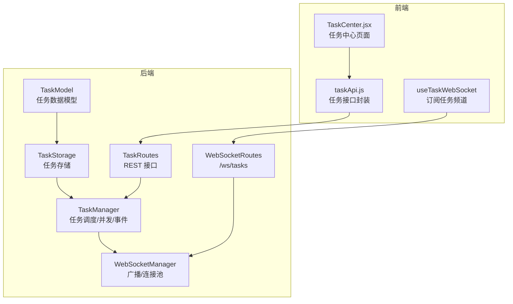
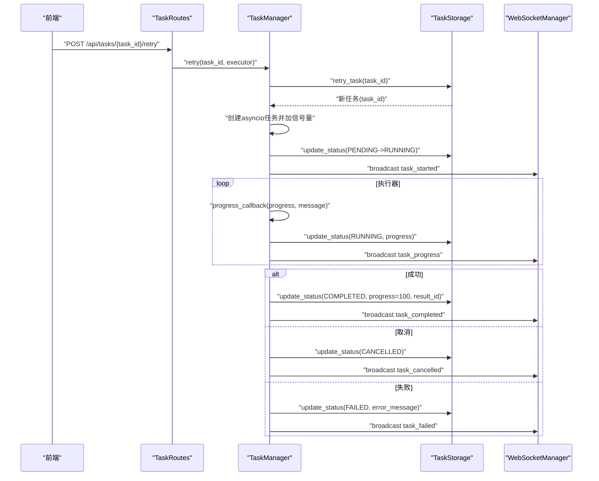
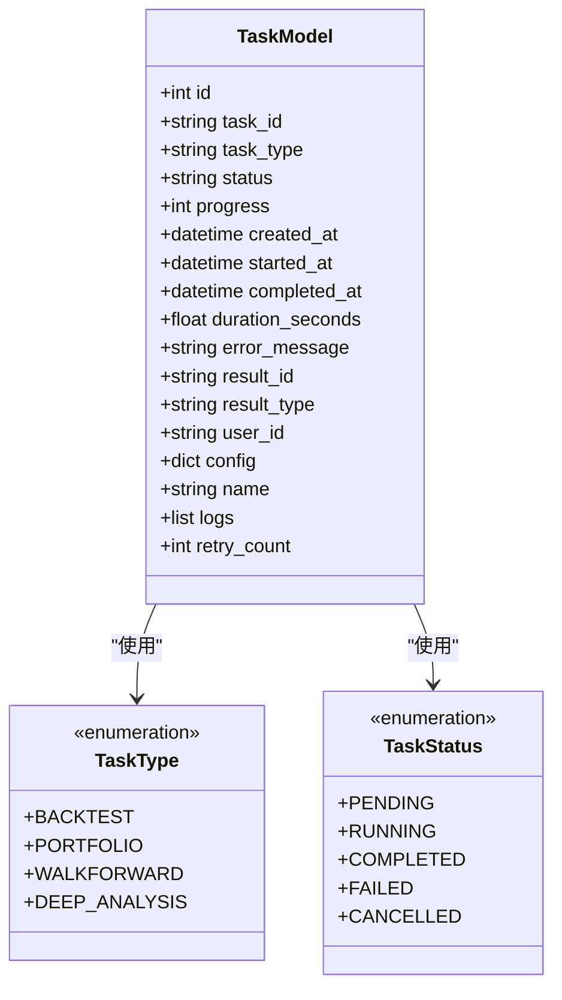
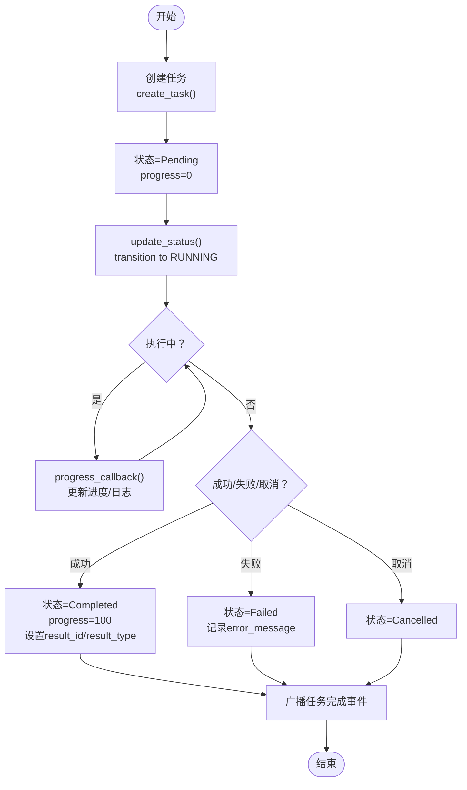
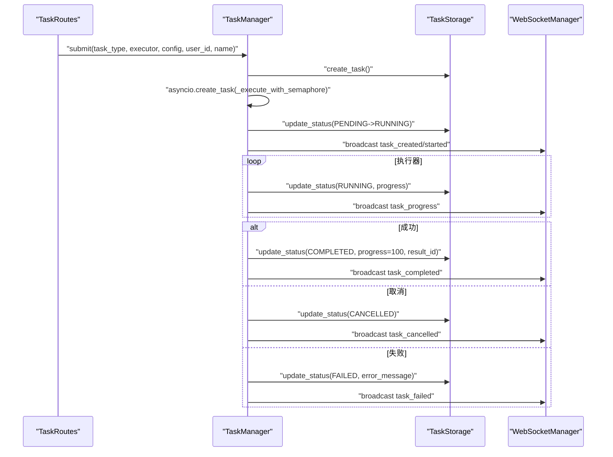
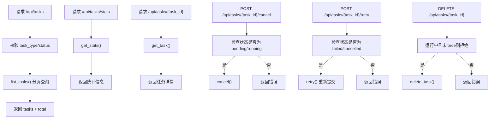
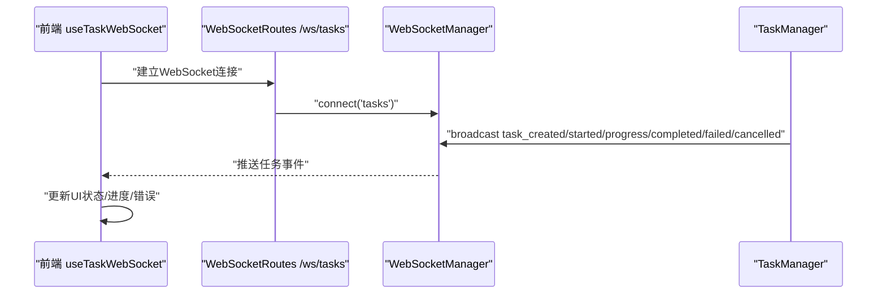
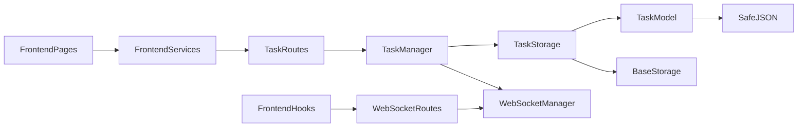

# 任务模型

<cite>
**本文引用的文件**
- [backend/src/db/models/task.py](file://backend/src/db/models/task.py)
- [backend/src/db/storage/task.py](file://backend/src/db/storage/task.py)
- [backend/src/service/task_manager.py](file://backend/src/service/task_manager.py)
- [backend/src/routes/task_routes.py](file://backend/src/routes/task_routes.py)
- [backend/src/db/models/base.py](file://backend/src/db/models/base.py)
- [backend/src/db/storage/base.py](file://backend/src/db/storage/base.py)
- [backend/src/service/websocket_manager.py](file://backend/src/service/websocket_manager.py)
- [backend/src/routes/websocket_routes.py](file://backend/src/routes/websocket_routes.py)
- [frontend/src/hooks/useTaskWebSocket.js](file://frontend/src/hooks/useTaskWebSocket.js)
- [frontend/src/services/taskApi.js](file://frontend/src/services/taskApi.js)
- [frontend/src/pages/TaskCenter.jsx](file://frontend/src/pages/TaskCenter.jsx)
</cite>

## 目录
1. [简介](#简介)
2. [项目结构](#项目结构)
3. [核心组件](#核心组件)
4. [架构总览](#架构总览)
5. [详细组件分析](#详细组件分析)
6. [依赖关系分析](#依赖关系分析)
7. [性能与并发特性](#性能与并发特性)
8. [故障排查指南](#故障排查指南)
9. [结论](#结论)
10. [附录](#附录)

## 简介
本文件系统性阐述“任务模型”的设计与实现，覆盖数据模型、存储层、任务执行与生命周期管理、REST API、实时事件广播以及前端集成。任务模型统一管理后台异步任务（回测、组合回测、滚动优化、深度分析等），提供状态流转、进度上报、日志记录、重试与取消能力，并通过 WebSocket 实时推送任务事件到前端。

## 项目结构
围绕任务模型的关键模块分布如下：
- 数据模型层：定义任务表结构与枚举类型
- 存储层：封装数据库操作（创建、查询、更新、删除、统计）
- 服务层：任务调度、并发控制、生命周期事件、重试与取消
- 路由层：对外暴露 REST 接口，支持列表、详情、取消、重试、删除
- WebSocket 层：集中管理连接与广播，向“tasks”频道推送任务事件
- 前端层：订阅任务频道，展示任务状态、进度与错误信息

图表来源
- [backend/src/db/models/task.py](file://backend/src/db/models/task.py#L1-L107)
- [backend/src/db/storage/task.py](file://backend/src/db/storage/task.py#L1-L408)
- [backend/src/service/task_manager.py](file://backend/src/service/task_manager.py#L1-L380)
- [backend/src/routes/task_routes.py](file://backend/src/routes/task_routes.py#L1-L433)
- [backend/src/service/websocket_manager.py](file://backend/src/service/websocket_manager.py#L1-L453)
- [backend/src/routes/websocket_routes.py](file://backend/src/routes/websocket_routes.py#L1-L361)
- [frontend/src/hooks/useTaskWebSocket.js](file://frontend/src/hooks/useTaskWebSocket.js#L1-L200)
- [frontend/src/services/taskApi.js](file://frontend/src/services/taskApi.js#L118-L166)
- [frontend/src/pages/TaskCenter.jsx](file://frontend/src/pages/TaskCenter.jsx#L124-L358)

章节来源
- [backend/src/db/models/task.py](file://backend/src/db/models/task.py#L1-L107)
- [backend/src/db/storage/task.py](file://backend/src/db/storage/task.py#L1-L408)
- [backend/src/service/task_manager.py](file://backend/src/service/task_manager.py#L1-L380)
- [backend/src/routes/task_routes.py](file://backend/src/routes/task_routes.py#L1-L433)
- [backend/src/service/websocket_manager.py](file://backend/src/service/websocket_manager.py#L1-L453)
- [backend/src/routes/websocket_routes.py](file://backend/src/routes/websocket_routes.py#L1-L361)
- [frontend/src/hooks/useTaskWebSocket.js](file://frontend/src/hooks/useTaskWebSocket.js#L1-L200)
- [frontend/src/services/taskApi.js](file://frontend/src/services/taskApi.js#L118-L166)
- [frontend/src/pages/TaskCenter.jsx](file://frontend/src/pages/TaskCenter.jsx#L124-L358)

## 核心组件
- 任务数据模型：定义任务表字段、状态与类型枚举
- 任务存储：提供创建、查询、更新、计数、取消、重试、删除等操作
- 任务管理器：提交任务、并发控制、状态更新、日志记录、事件广播、取消与重试
- 任务路由：REST API 提供列表、详情、统计、取消、重试、删除
- WebSocket 管理：连接池、广播、心跳、任务事件推送
- 前端集成：订阅任务频道、展示任务状态与进度、调用取消/重试/删除

章节来源
- [backend/src/db/models/task.py](file://backend/src/db/models/task.py#L1-L107)
- [backend/src/db/storage/task.py](file://backend/src/db/storage/task.py#L1-L408)
- [backend/src/service/task_manager.py](file://backend/src/service/task_manager.py#L1-L380)
- [backend/src/routes/task_routes.py](file://backend/src/routes/task_routes.py#L1-L433)
- [backend/src/service/websocket_manager.py](file://backend/src/service/websocket_manager.py#L1-L453)
- [frontend/src/hooks/useTaskWebSocket.js](file://frontend/src/hooks/useTaskWebSocket.js#L1-L200)
- [frontend/src/services/taskApi.js](file://frontend/src/services/taskApi.js#L118-L166)
- [frontend/src/pages/TaskCenter.jsx](file://frontend/src/pages/TaskCenter.jsx#L124-L358)

## 架构总览
任务从提交到完成的全链路流程如下：
- 前端通过 REST 接口提交任务，后端写入任务记录并入队
- 任务管理器按最大并发限制调度执行，支持同步/异步执行器
- 执行过程中定期回调进度，更新状态与日志
- 任务完成后更新结果链接、计算耗时；失败或取消时记录错误并广播
- WebSocket 将任务生命周期事件推送到“tasks”频道，前端实时刷新

图表来源
- [backend/src/routes/task_routes.py](file://backend/src/routes/task_routes.py#L237-L292)
- [backend/src/service/task_manager.py](file://backend/src/service/task_manager.py#L252-L334)
- [backend/src/db/storage/task.py](file://backend/src/db/storage/task.py#L287-L359)
- [backend/src/service/websocket_manager.py](file://backend/src/service/websocket_manager.py#L351-L402)

章节来源
- [backend/src/routes/task_routes.py](file://backend/src/routes/task_routes.py#L237-L292)
- [backend/src/service/task_manager.py](file://backend/src/service/task_manager.py#L252-L334)
- [backend/src/db/storage/task.py](file://backend/src/db/storage/task.py#L287-L359)
- [backend/src/service/websocket_manager.py](file://backend/src/service/websocket_manager.py#L351-L402)

## 详细组件分析

### 数据模型：TaskModel 与枚举
- 字段设计
  - 标识与类型：task_id、task_type
  - 状态与进度：status、progress
  - 时间戳：created_at、started_at、completed_at、duration_seconds
  - 结果链接：result_id、result_type
  - 用户标识：user_id
  - 配置快照与名称：config、name
  - 日志与重试次数：logs、retry_count
- 枚举
  - 任务类型：backtest、portfolio、walkforward、deep_analysis
  - 任务状态：pending、running、completed、failed、cancelled
- JSON 安全类型：SafeJSON 统一处理空值与序列化

图表来源
- [backend/src/db/models/task.py](file://backend/src/db/models/task.py#L1-L107)
- [backend/src/db/models/base.py](file://backend/src/db/models/base.py#L44-L62)

章节来源
- [backend/src/db/models/task.py](file://backend/src/db/models/task.py#L1-L107)
- [backend/src/db/models/base.py](file://backend/src/db/models/base.py#L44-L62)

### 存储层：TaskStorage
- 能力
  - 创建任务：生成唯一 task_id，初始状态为 pending
  - 查询与过滤：按用户、类型、状态分页查询与计数
  - 更新状态：自动设置 started_at/completed_at/duration_seconds
  - 进度与日志：支持进度百分比与日志数组追加
  - 取消与重试：仅对 pending 或 running 的任务可取消；失败/取消的任务可重试
  - 删除：运行中的任务默认不可删，强制模式可清理卡死任务
  - 统计：运行中数量、待执行任务列表
- 设计要点
  - 使用 SafeJSON 字段存储 config 与 logs
  - 通过 session_scope 自动提交/回滚，避免会话泄漏
  - 时间字段统一使用 UTC 并处理时区

图表来源
- [backend/src/db/storage/task.py](file://backend/src/db/storage/task.py#L33-L121)
- [backend/src/db/storage/task.py](file://backend/src/db/storage/task.py#L163-L222)
- [backend/src/db/storage/task.py](file://backend/src/db/storage/task.py#L231-L271)
- [backend/src/db/storage/task.py](file://backend/src/db/storage/task.py#L287-L359)

章节来源
- [backend/src/db/storage/task.py](file://backend/src/db/storage/task.py#L1-L408)

### 服务层：TaskManager
- 职责
  - 提交任务：创建任务记录并调度执行
  - 并发控制：基于 asyncio.Semaphore 控制最大并发
  - 生命周期管理：创建、启动、进度、完成/失败/取消
  - 事件广播：通过 WebSocketManager 向“tasks”频道广播
  - 取消与重试：支持运行中任务取消与失败/取消任务重试
  - 统计信息：最大并发、运行中数量、可用槽位、待执行数量
- 关键行为
  - 进度回调：将进度与消息写入存储并广播
  - 错误处理：捕获异常，标记失败并记录错误
  - 取消传播：CancelledError 会被上抛，确保优雅退出

图表来源
- [backend/src/service/task_manager.py](file://backend/src/service/task_manager.py#L66-L183)
- [backend/src/service/task_manager.py](file://backend/src/service/task_manager.py#L184-L214)
- [backend/src/service/task_manager.py](file://backend/src/service/task_manager.py#L225-L294)
- [backend/src/service/task_manager.py](file://backend/src/service/task_manager.py#L335-L344)
- [backend/src/service/websocket_manager.py](file://backend/src/service/websocket_manager.py#L351-L402)

章节来源
- [backend/src/service/task_manager.py](file://backend/src/service/task_manager.py#L1-L380)

### 路由层：TaskRoutes
- 接口清单
  - GET /api/tasks：分页列出任务，支持按类型与状态过滤
  - GET /api/tasks/stats：获取任务管理器统计
  - GET /api/tasks/{task_id}：获取任务详情
  - POST /api/tasks/{task_id}/cancel：取消任务（仅 pending/running）
  - POST /api/tasks/{task_id}/retry：重试失败/取消任务（构造相同配置的新任务）
  - DELETE /api/tasks/{task_id}?force=false：删除任务记录（运行中默认不可删）
- 参数校验与鉴权
  - 对 task_type 与 status 进行枚举校验
  - 取消/重试/删除均进行状态与权限检查

图表来源
- [backend/src/routes/task_routes.py](file://backend/src/routes/task_routes.py#L78-L136)
- [backend/src/routes/task_routes.py](file://backend/src/routes/task_routes.py#L138-L156)
- [backend/src/routes/task_routes.py](file://backend/src/routes/task_routes.py#L158-L187)
- [backend/src/routes/task_routes.py](file://backend/src/routes/task_routes.py#L189-L235)
- [backend/src/routes/task_routes.py](file://backend/src/routes/task_routes.py#L237-L292)
- [backend/src/routes/task_routes.py](file://backend/src/routes/task_routes.py#L294-L346)

章节来源
- [backend/src/routes/task_routes.py](file://backend/src/routes/task_routes.py#L1-L433)

### WebSocket 与前端集成
- WebSocket 管理
  - 连接池：按 session_id 维护连接集合
  - 广播：支持向指定 session 或“tasks”频道广播
  - 心跳：ping/pong 保持长连接
  - 任务事件：提供 broadcast_task_event 与 broadcast_task_update
- WebSocket 路由
  - /ws/tasks：订阅任务事件，接收 task_created/task_started/task_progress/task_completed/task_failed/task_cancelled
- 前端钩子
  - useTaskWebSocket：自动连接 /ws/tasks，发送 ping，解析任务事件，暴露连接状态与重连策略
- 前端页面
  - TaskCenter.jsx：展示任务列表、状态、进度、耗时、错误信息；支持取消、重试、删除

图表来源
- [backend/src/routes/websocket_routes.py](file://backend/src/routes/websocket_routes.py#L220-L332)
- [backend/src/service/websocket_manager.py](file://backend/src/service/websocket_manager.py#L351-L402)
- [frontend/src/hooks/useTaskWebSocket.js](file://frontend/src/hooks/useTaskWebSocket.js#L1-L200)
- [frontend/src/pages/TaskCenter.jsx](file://frontend/src/pages/TaskCenter.jsx#L124-L358)

章节来源
- [backend/src/routes/websocket_routes.py](file://backend/src/routes/websocket_routes.py#L1-L361)
- [backend/src/service/websocket_manager.py](file://backend/src/service/websocket_manager.py#L1-L453)
- [frontend/src/hooks/useTaskWebSocket.js](file://frontend/src/hooks/useTaskWebSocket.js#L1-L200)
- [frontend/src/pages/TaskCenter.jsx](file://frontend/src/pages/TaskCenter.jsx#L124-L358)

## 依赖关系分析
- 模块耦合
  - TaskManager 依赖 TaskStorage 与 WebSocketManager
  - TaskRoutes 依赖 TaskManager
  - TaskStorage 依赖 TaskModel 与 BaseStorage/SafeJSON
  - WebSocketRoutes 依赖 WebSocketManager
  - 前端通过 taskApi.js 调用 TaskRoutes，通过 useTaskWebSocket 订阅 /ws/tasks
- 外部依赖
  - SQLAlchemy（ORM）、FastAPI（路由）、asyncio（并发）、前端 React Hooks

图表来源
- [backend/src/routes/task_routes.py](file://backend/src/routes/task_routes.py#L1-L433)
- [backend/src/service/task_manager.py](file://backend/src/service/task_manager.py#L1-L380)
- [backend/src/db/storage/task.py](file://backend/src/db/storage/task.py#L1-L408)
- [backend/src/db/models/task.py](file://backend/src/db/models/task.py#L1-L107)
- [backend/src/db/models/base.py](file://backend/src/db/models/base.py#L44-L62)
- [backend/src/db/storage/base.py](file://backend/src/db/storage/base.py#L1-L89)
- [backend/src/routes/websocket_routes.py](file://backend/src/routes/websocket_routes.py#L1-L361)
- [frontend/src/hooks/useTaskWebSocket.js](file://frontend/src/hooks/useTaskWebSocket.js#L1-L200)
- [frontend/src/services/taskApi.js](file://frontend/src/services/taskApi.js#L118-L166)

章节来源
- [backend/src/db/storage/base.py](file://backend/src/db/storage/base.py#L1-L89)
- [backend/src/db/models/base.py](file://backend/src/db/models/base.py#L1-L129)

## 性能与并发特性
- 并发控制
  - 通过 asyncio.Semaphore 限制最大并发任务数，默认从环境变量读取
  - 运行中任务集合用于快速取消
- 数据访问
  - 使用 session_scope 自动提交/回滚，减少异常导致的资源泄漏
  - 时间字段统一使用 UTC，避免跨时区差异
- WebSocket
  - 广播前复制连接集合，避免迭代期间集合变化
  - 清理断开连接，降低无效广播
- 前端体验
  - 心跳保活，自动重连，避免长时间无响应
  - 仅在 pending/running 状态显示取消按钮，防止误操作

章节来源
- [backend/src/service/task_manager.py](file://backend/src/service/task_manager.py#L22-L55)
- [backend/src/db/storage/task.py](file://backend/src/db/storage/task.py#L163-L222)
- [backend/src/service/websocket_manager.py](file://backend/src/service/websocket_manager.py#L91-L148)
- [frontend/src/hooks/useTaskWebSocket.js](file://frontend/src/hooks/useTaskWebSocket.js#L1-L200)

## 故障排查指南
- 无法取消任务
  - 仅 pending/running 可取消；若状态为 completed/failed/cancelled，需先重试或删除
  - 检查后端日志与 TaskStorage.update_status 是否正确设置
- 重试失败
  - 仅 failed/cancelled 可重试；确认原始任务存在且 executor 可用
  - 查看 TaskRoutes._get_executor_for_task_type 的导入与参数映射
- 删除失败
  - 运行中任务默认不可删；如需清理卡死任务，使用 force=true
- WebSocket 不接收任务事件
  - 确认已连接 /ws/tasks，前端 useTaskWebSocket 已启用心跳
  - 检查 WebSocketManager.broadcast 是否向“tasks”频道广播
- 前端 UI 不更新
  - 确认订阅了正确的频道与事件类型
  - 检查 TaskCenter.jsx 的状态渲染逻辑与错误提示

章节来源
- [backend/src/routes/task_routes.py](file://backend/src/routes/task_routes.py#L189-L235)
- [backend/src/routes/task_routes.py](file://backend/src/routes/task_routes.py#L237-L292)
- [backend/src/db/storage/task.py](file://backend/src/db/storage/task.py#L330-L359)
- [backend/src/service/websocket_manager.py](file://backend/src/service/websocket_manager.py#L351-L402)
- [frontend/src/hooks/useTaskWebSocket.js](file://frontend/src/hooks/useTaskWebSocket.js#L1-L200)
- [frontend/src/pages/TaskCenter.jsx](file://frontend/src/pages/TaskCenter.jsx#L124-L358)

## 结论
任务模型以清晰的数据模型、稳健的存储层、灵活的服务层与完善的前端集成，实现了对多类型后台任务的统一管理。通过并发控制、状态机与实时事件广播，系统在复杂交易场景下仍能保持稳定与可观测性。建议在生产环境中合理配置最大并发数，并持续监控任务统计与错误日志，以便及时发现与处理异常。

## 附录
- 任务类型与结果映射
  - backtest → backtest_history
  - portfolio → portfolio_results
  - walkforward → walkforward_optimizations
  - deep_analysis → backtest_history（更新回测结果）
- 关键路径参考
  - 任务提交与执行：[backend/src/service/task_manager.py](file://backend/src/service/task_manager.py#L66-L183)
  - 任务状态更新与日志：[backend/src/db/storage/task.py](file://backend/src/db/storage/task.py#L163-L222)
  - 重试与取消：[backend/src/db/storage/task.py](file://backend/src/db/storage/task.py#L250-L359)
  - REST 接口：[backend/src/routes/task_routes.py](file://backend/src/routes/task_routes.py#L78-L136)
  - WebSocket 事件：[backend/src/service/websocket_manager.py](file://backend/src/service/websocket_manager.py#L351-L402)
  - 前端订阅与交互：[frontend/src/hooks/useTaskWebSocket.js](file://frontend/src/hooks/useTaskWebSocket.js#L1-L200)、[frontend/src/pages/TaskCenter.jsx](file://frontend/src/pages/TaskCenter.jsx#L124-L358)