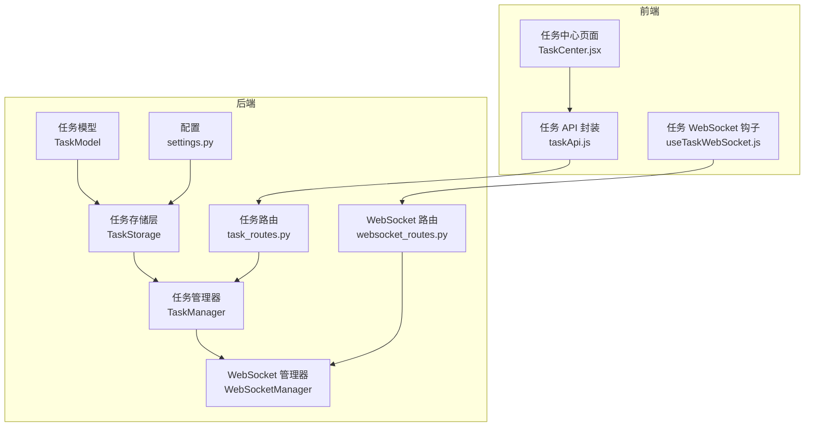
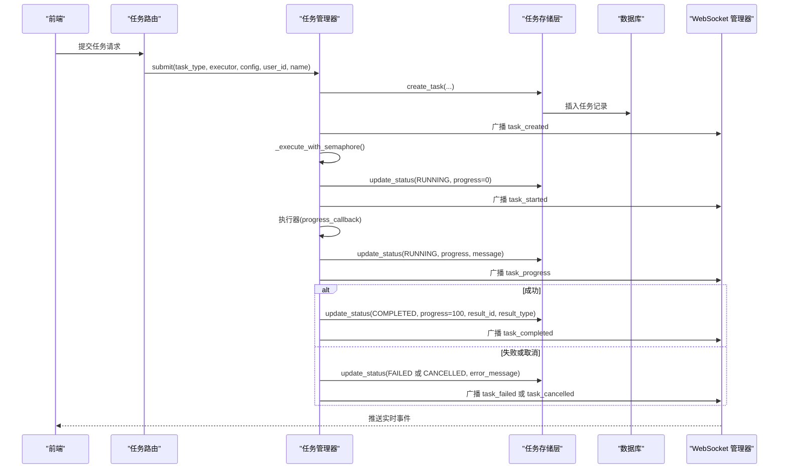
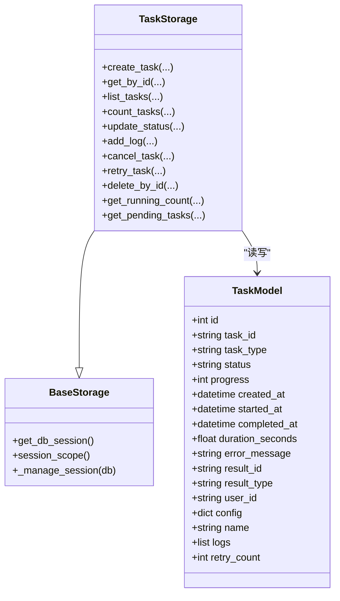
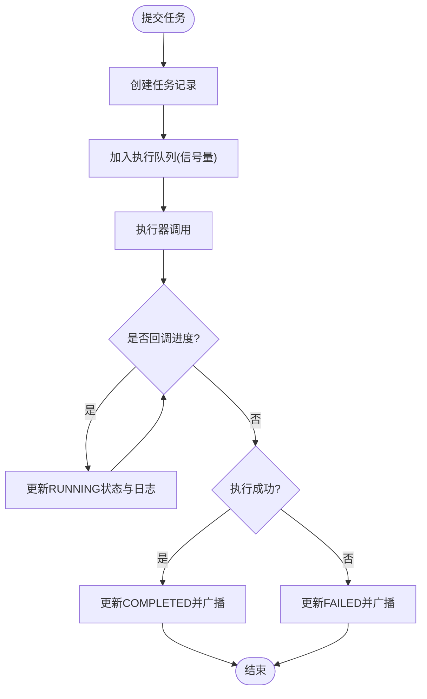
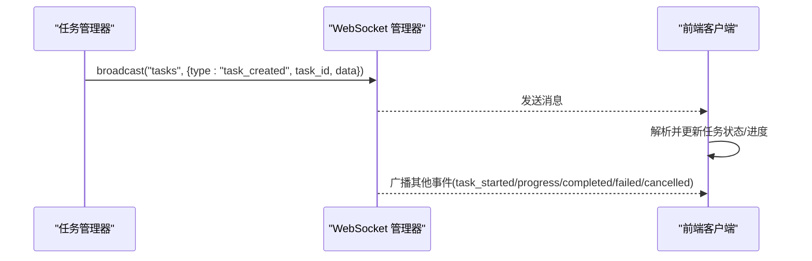
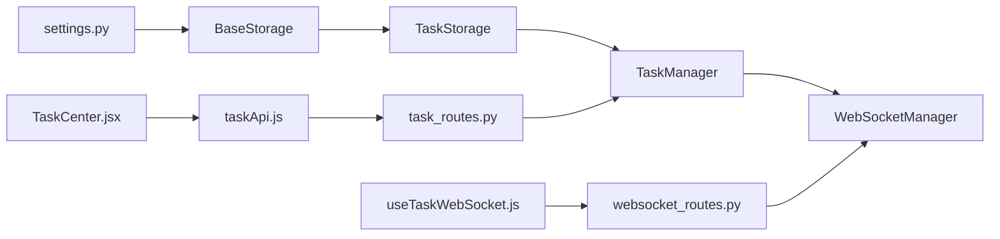

# 任务存储服务

<cite>
**本文引用的文件**
- [backend/src/db/storage/task.py](file://backend/src/db/storage/task.py)
- [backend/src/db/models/task.py](file://backend/src/db/models/task.py)
- [backend/src/db/storage/base.py](file://backend/src/db/storage/base.py)
- [backend/src/service/task_manager.py](file://backend/src/service/task_manager.py)
- [backend/src/routes/task_routes.py](file://backend/src/routes/task_routes.py)
- [backend/src/service/websocket_manager.py](file://backend/src/service/websocket_manager.py)
- [backend/src/routers/websocket_routes.py](file://backend/src/routers/websocket_routes.py)
- [backend/src/config/settings.py](file://backend/src/config/settings.py)
- [frontend/src/services/taskApi.js](file://frontend/src/services/taskApi.js)
- [frontend/src/hooks/useTaskWebSocket.js](file://frontend/src/hooks/useTaskWebSocket.js)
- [frontend/src/pages/TaskCenter.jsx](file://frontend/src/pages/TaskCenter.jsx)
</cite>

## 目录
1. [简介](#简介)
2. [项目结构](#项目结构)
3. [核心组件](#核心组件)
4. [架构总览](#架构总览)
5. [详细组件分析](#详细组件分析)
6. [依赖关系分析](#依赖关系分析)
7. [性能与并发特性](#性能与并发特性)
8. [故障排查指南](#故障排查指南)
9. [结论](#结论)
10. [附录：API 定义](#附录api-定义)

## 简介
本文件系统性梳理“任务存储服务”的设计与实现，覆盖从数据库模型、存储层、任务管理器、REST 路由到实时 WebSocket 广播的全链路。该服务统一管理后台任务（回测、组合回测、滚动优化、深度分析等），提供创建、查询、取消、重试、删除等能力，并通过 WebSocket 实时推送任务生命周期事件，便于前端任务中心进行可视化展示与交互。

## 项目结构
围绕“任务存储服务”，后端主要涉及以下模块：
- 数据库模型与存储层：定义任务表结构与 CRUD 操作
- 任务管理器：统一调度、并发控制、状态流转与事件广播
- REST 路由：对外暴露任务列表、详情、统计、取消、重试、删除等接口
- WebSocket 管理：集中式连接池与广播通道，支持任务事件推送
- 前端集成：API 封装与 WebSocket 订阅，任务中心页面展示

图表来源
- [backend/src/db/models/task.py](file://backend/src/db/models/task.py#L1-L107)
- [backend/src/db/storage/task.py](file://backend/src/db/storage/task.py#L1-L408)
- [backend/src/service/task_manager.py](file://backend/src/service/task_manager.py#L1-L380)
- [backend/src/routes/task_routes.py](file://backend/src/routes/task_routes.py#L1-L433)
- [backend/src/service/websocket_manager.py](file://backend/src/service/websocket_manager.py#L1-L453)
- [backend/src/routers/websocket_routes.py](file://backend/src/routers/websocket_routes.py#L167-L348)
- [backend/src/config/settings.py](file://backend/src/config/settings.py#L1-L117)
- [frontend/src/services/taskApi.js](file://frontend/src/services/taskApi.js#L82-L166)
- [frontend/src/hooks/useTaskWebSocket.js](file://frontend/src/hooks/useTaskWebSocket.js#L71-L200)
- [frontend/src/pages/TaskCenter.jsx](file://frontend/src/pages/TaskCenter.jsx#L203-L229)

章节来源
- [backend/src/db/models/task.py](file://backend/src/db/models/task.py#L1-L107)
- [backend/src/db/storage/task.py](file://backend/src/db/storage/task.py#L1-L408)
- [backend/src/service/task_manager.py](file://backend/src/service/task_manager.py#L1-L380)
- [backend/src/routes/task_routes.py](file://backend/src/routes/task_routes.py#L1-L433)
- [backend/src/service/websocket_manager.py](file://backend/src/service/websocket_manager.py#L1-L453)
- [backend/src/routers/websocket_routes.py](file://backend/src/routers/websocket_routes.py#L167-L348)
- [backend/src/config/settings.py](file://backend/src/config/settings.py#L1-L117)
- [frontend/src/services/taskApi.js](file://frontend/src/services/taskApi.js#L82-L166)
- [frontend/src/hooks/useTaskWebSocket.js](file://frontend/src/hooks/useTaskWebSocket.js#L71-L200)
- [frontend/src/pages/TaskCenter.jsx](file://frontend/src/pages/TaskCenter.jsx#L203-L229)

## 核心组件
- 任务模型与表结构：定义任务类型、状态、进度、时间戳、结果链接、用户标识、配置快照、日志数组、重试次数等字段。
- 存储层：提供任务创建、按 ID 查询、分页与过滤查询、计数、状态更新（含进度、错误、结果链接）、追加日志、取消、重试、删除等操作。
- 任务管理器：负责提交任务、并发控制（信号量）、执行器回调（进度/消息）、异常处理与状态更新、WebSocket 事件广播、统计信息。
- REST 路由：提供任务列表、详情、统计、取消、重试、删除等接口；对任务类型与状态进行校验。
- WebSocket 管理：维护会话级连接池，向指定会话广播消息；任务管理器可触发“task_*”事件广播。
- 前端集成：封装任务 API、订阅任务 WebSocket 事件并在任务中心展示统计与列表。

章节来源
- [backend/src/db/models/task.py](file://backend/src/db/models/task.py#L1-L107)
- [backend/src/db/storage/task.py](file://backend/src/db/storage/task.py#L1-L408)
- [backend/src/service/task_manager.py](file://backend/src/service/task_manager.py#L1-L380)
- [backend/src/routes/task_routes.py](file://backend/src/routes/task_routes.py#L1-L433)
- [backend/src/service/websocket_manager.py](file://backend/src/service/websocket_manager.py#L1-L453)
- [frontend/src/services/taskApi.js](file://frontend/src/services/taskApi.js#L82-L166)
- [frontend/src/hooks/useTaskWebSocket.js](file://frontend/src/hooks/useTaskWebSocket.js#L71-L200)
- [frontend/src/pages/TaskCenter.jsx](file://frontend/src/pages/TaskCenter.jsx#L203-L229)

## 架构总览
任务存储服务采用“模型-存储-管理-路由-广播-前端”的分层架构，数据持久化基于 SQLite，默认路径在根目录下，可通过环境变量覆盖。任务生命周期通过状态机推进，管理器在执行前后自动更新时间戳与耗时，并通过 WebSocket 向所有订阅者广播事件。

图表来源
- [backend/src/routes/task_routes.py](file://backend/src/routes/task_routes.py#L78-L110)
- [backend/src/service/task_manager.py](file://backend/src/service/task_manager.py#L66-L214)
- [backend/src/db/storage/task.py](file://backend/src/db/storage/task.py#L33-L221)
- [backend/src/service/websocket_manager.py](file://backend/src/service/websocket_manager.py#L351-L402)

## 详细组件分析

### 数据模型与存储层
- 任务模型包含主键自增、唯一任务 ID、任务类型枚举、状态枚举、进度百分比、创建/开始/完成时间、耗时秒数、错误信息、结果链接、用户 ID、配置快照、名称、日志数组、重试次数等字段。
- 存储层提供：
  - 创建任务：生成 UUID，初始状态为待定，进度 0，写入配置与用户信息。
  - 查询与分页：支持按用户、类型、状态过滤，排序与分页。
  - 统计计数：按状态计数。
  - 更新状态：自动设置运行开始/结束时间与耗时；支持进度、错误、结果链接更新。
  - 追加日志：以 UTC 时间戳记录级别与消息。
  - 取消任务：仅允许待定或运行中任务取消。
  - 重试任务：复制原任务配置与元数据，生成新任务并递增重试次数。
  - 删除任务：默认禁止删除运行中的任务，除非强制。
  - 辅助方法：获取运行中数量、获取待定任务列表。

图表来源
- [backend/src/db/models/task.py](file://backend/src/db/models/task.py#L1-L107)
- [backend/src/db/storage/task.py](file://backend/src/db/storage/task.py#L1-L408)
- [backend/src/db/storage/base.py](file://backend/src/db/storage/base.py#L1-L89)

章节来源
- [backend/src/db/models/task.py](file://backend/src/db/models/task.py#L1-L107)
- [backend/src/db/storage/task.py](file://backend/src/db/storage/task.py#L1-L408)
- [backend/src/db/storage/base.py](file://backend/src/db/storage/base.py#L1-L89)

### 任务管理器与并发控制
- 初始化：从环境变量读取最大并发数，默认值为 3；使用信号量限制同时执行的任务数量。
- 提交流程：创建任务记录，异步调度执行；执行前更新状态为运行中并广播事件。
- 执行流程：支持同步/异步执行器；通过回调函数上报进度与消息；根据返回结果设置最终状态与结果链接。
- 异常处理：捕获取消与异常，分别更新状态为取消或失败，并广播相应事件。
- 重试流程：仅允许失败或取消的任务重试，复制原任务配置与元数据，生成新任务并调度执行。
- 统计信息：返回最大并发、当前运行数、可用槽位、待定任务数等。

图表来源
- [backend/src/service/task_manager.py](file://backend/src/service/task_manager.py#L66-L214)
- [backend/src/db/storage/task.py](file://backend/src/db/storage/task.py#L163-L221)

章节来源
- [backend/src/service/task_manager.py](file://backend/src/service/task_manager.py#L1-L380)

### REST 路由与权限控制
- 列表与统计：支持按任务类型、状态过滤，分页与排序；返回总数；统计接口返回并发与运行/待定数量。
- 获取详情：按任务 ID 查询，支持用户鉴权过滤。
- 取消任务：仅允许待定或运行中任务取消，否则返回错误。
- 重试任务：仅允许失败或取消的任务重试，内部动态导入对应执行器并包装同步执行。
- 删除任务：默认禁止删除运行中任务，除非强制参数为真。

章节来源
- [backend/src/routes/task_routes.py](file://backend/src/routes/task_routes.py#L78-L433)

### WebSocket 广播与前端订阅
- WebSocket 管理器：维护会话级连接池，支持广播消息、清理断连、统计连接数。
- 任务事件广播：任务管理器在生命周期关键节点广播“task_created/started/progress/completed/failed/cancelled”事件。
- 前端订阅：前端通过 WebSocket 订阅“tasks”频道，解析“task_*”类型消息并更新 UI；任务中心展示统计与列表。

图表来源
- [backend/src/service/task_manager.py](file://backend/src/service/task_manager.py#L345-L366)
- [backend/src/service/websocket_manager.py](file://backend/src/service/websocket_manager.py#L383-L402)
- [frontend/src/hooks/useTaskWebSocket.js](file://frontend/src/hooks/useTaskWebSocket.js#L71-L200)

章节来源
- [backend/src/service/websocket_manager.py](file://backend/src/service/websocket_manager.py#L1-L453)
- [frontend/src/hooks/useTaskWebSocket.js](file://frontend/src/hooks/useTaskWebSocket.js#L71-L200)
- [frontend/src/pages/TaskCenter.jsx](file://frontend/src/pages/TaskCenter.jsx#L203-L229)

## 依赖关系分析
- 存储层依赖数据库初始化与会话管理，统一通过基类提供的上下文管理器确保事务安全。
- 任务管理器依赖存储层与 WebSocket 管理器，延迟加载避免循环导入。
- REST 路由依赖任务管理器与认证工具，对输入参数进行合法性校验。
- 前端通过 API 封装与 WebSocket 钩子与后端交互。

图表来源
- [backend/src/config/settings.py](file://backend/src/config/settings.py#L1-L117)
- [backend/src/db/storage/base.py](file://backend/src/db/storage/base.py#L1-L89)
- [backend/src/db/storage/task.py](file://backend/src/db/storage/task.py#L1-L408)
- [backend/src/service/task_manager.py](file://backend/src/service/task_manager.py#L1-L380)
- [backend/src/service/websocket_manager.py](file://backend/src/service/websocket_manager.py#L1-L453)
- [backend/src/routes/task_routes.py](file://backend/src/routes/task_routes.py#L1-L433)
- [backend/src/routers/websocket_routes.py](file://backend/src/routers/websocket_routes.py#L167-L348)
- [frontend/src/services/taskApi.js](file://frontend/src/services/taskApi.js#L82-L166)
- [frontend/src/hooks/useTaskWebSocket.js](file://frontend/src/hooks/useTaskWebSocket.js#L71-L200)
- [frontend/src/pages/TaskCenter.jsx](file://frontend/src/pages/TaskCenter.jsx#L203-L229)

## 性能与并发特性
- 并发控制：通过信号量限制最大并发任务数，默认从环境变量读取，避免资源争用导致系统过载。
- 数据库事务：存储层使用上下文管理器自动提交/回滚，保证一致性与原子性。
- WebSocket 广播：连接池与锁保护，自动清理断连，减少无效发送。
- 任务耗时计算：在状态切换时计算耗时，便于统计与监控。
- 建议：根据硬件与业务负载调整最大并发数；对长耗时任务提供更细粒度的进度回调以提升用户体验。

章节来源
- [backend/src/service/task_manager.py](file://backend/src/service/task_manager.py#L22-L41)
- [backend/src/db/storage/base.py](file://backend/src/db/storage/base.py#L50-L72)
- [backend/src/service/websocket_manager.py](file://backend/src/service/websocket_manager.py#L91-L149)

## 故障排查指南
- 无法取消任务：检查任务当前状态是否为待定或运行中；非此状态将被拒绝。
- 无法重试任务：仅失败或取消的任务可重试；确认原始任务存在且状态满足条件。
- 删除运行中任务失败：默认不允许删除运行中任务；如需强制删除，请使用强制参数。
- WebSocket 不接收事件：确认已连接到“tasks”频道；检查前端钩子是否正确解析“task_*”类型消息。
- 数据库连接问题：检查数据库 URL 是否正确；确认 SQLite 文件可写。
- 任务未完成但无进度：确认执行器是否正确调用进度回调；查看日志数组定位问题。

章节来源
- [backend/src/db/storage/task.py](file://backend/src/db/storage/task.py#L250-L359)
- [backend/src/routes/task_routes.py](file://backend/src/routes/task_routes.py#L189-L346)
- [frontend/src/hooks/useTaskWebSocket.js](file://frontend/src/hooks/useTaskWebSocket.js#L71-L200)

## 结论
任务存储服务通过清晰的分层设计与严格的生命周期管理，实现了对多种后台任务的统一调度与可观测性。结合 REST 与 WebSocket，既满足了后端业务编排需求，也提供了良好的前端交互体验。建议在生产环境中合理配置并发上限、完善日志与告警，并持续优化执行器的进度回调粒度以提升用户体验。

## 附录：API 定义
- 列表任务
  - 方法与路径：GET /api/tasks
  - 查询参数：task_type、status、limit、offset、sort_by、sort_order
  - 返回：tasks（任务数组）、total（总数）
- 获取任务详情
  - 方法与路径：GET /api/tasks/{task_id}
  - 返回：任务对象（包含配置、日志、结果链接等）
- 获取任务统计
  - 方法与路径：GET /api/tasks/stats
  - 返回：max_concurrent、running_count、semaphore_available、pending_count、completed_today
- 取消任务
  - 方法与路径：POST /api/tasks/{task_id}/cancel
  - 返回：message、task_id
- 重试任务
  - 方法与路径：POST /api/tasks/{task_id}/retry
  - 返回：新任务对象（pending）
- 删除任务
  - 方法与路径：DELETE /api/tasks/{task_id}?force=false
  - 查询参数：force（布尔）
  - 返回：message、task_id

章节来源
- [backend/src/routes/task_routes.py](file://backend/src/routes/task_routes.py#L78-L433)
- [frontend/src/services/taskApi.js](file://frontend/src/services/taskApi.js#L82-L166)