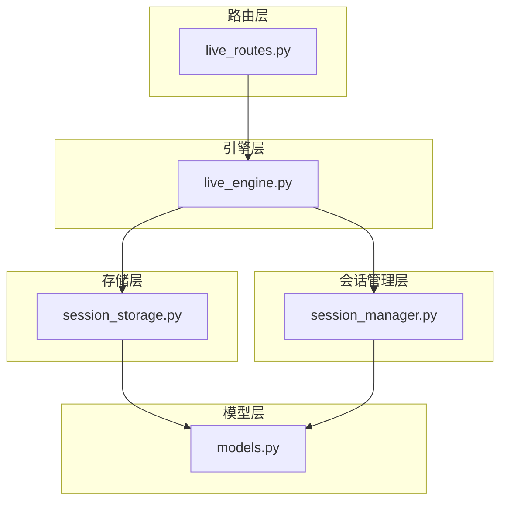
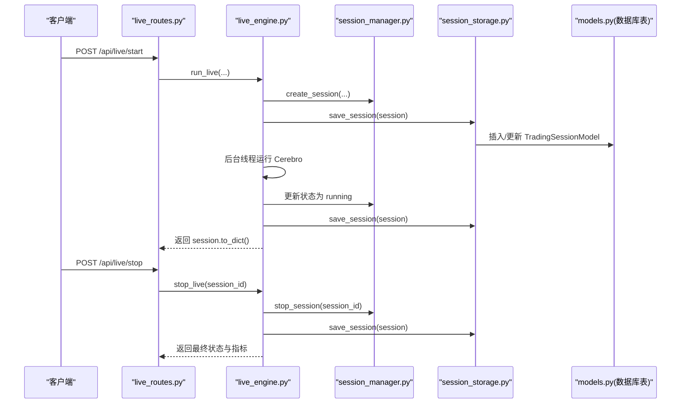
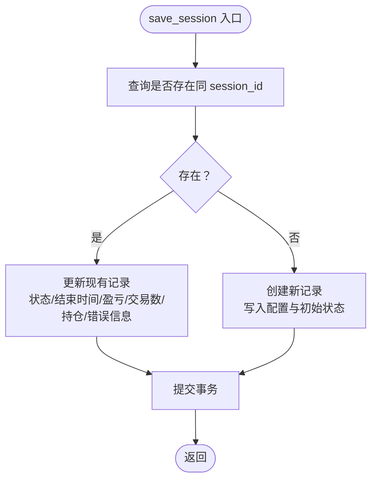
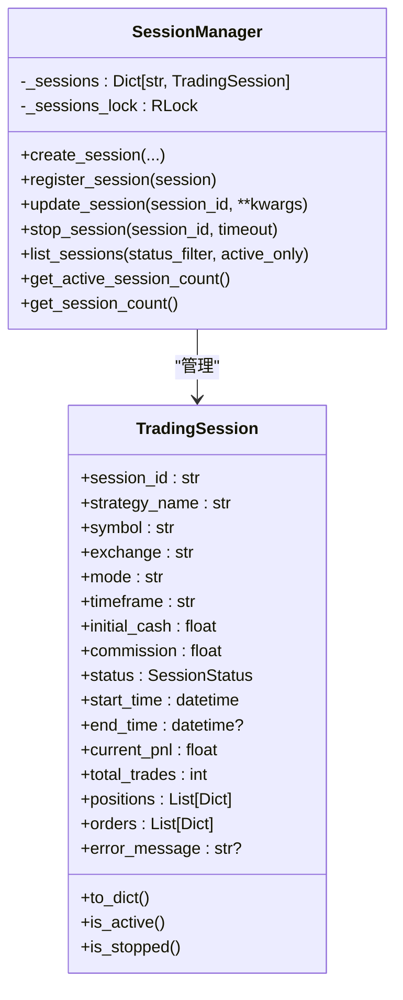
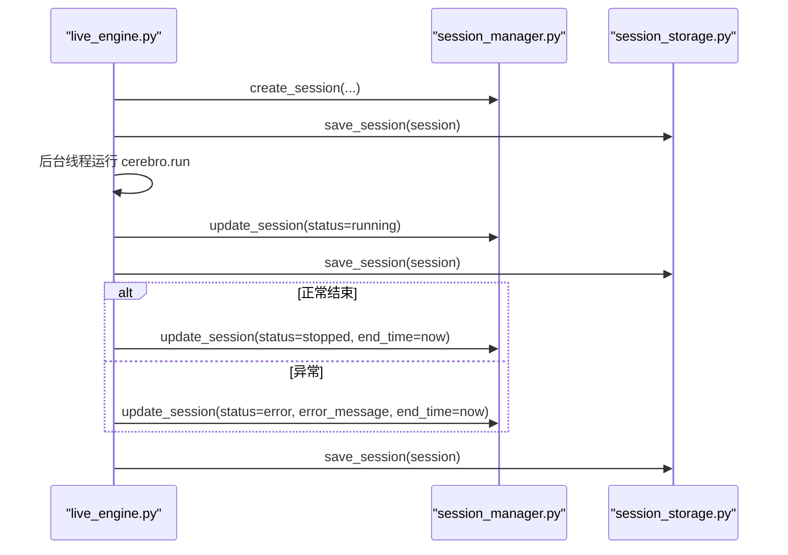
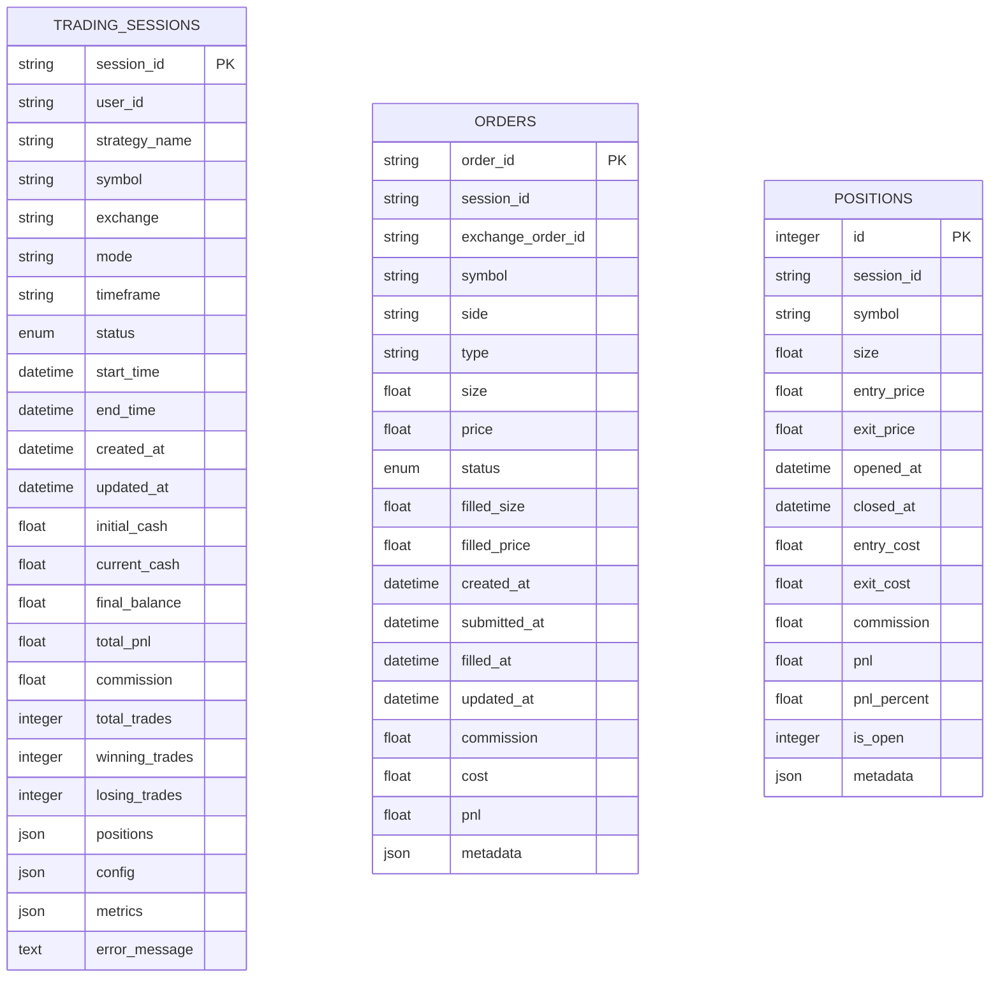
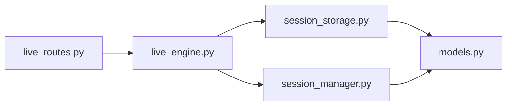

# 会话存储服务

<cite>
**本文引用的文件**
- [session_storage.py](file://backend/src/db/session_storage.py)
- [session_manager.py](file://backend/src/service/session_manager.py)
- [models.py](file://backend/src/db/models.py)
- [live_engine.py](file://backend/src/service/live_engine.py)
- [live_routes.py](file://backend/src/routes/live_routes.py)
- [test_session_storage.py](file://backend/tests/db/test_session_storage.py)
</cite>

## 目录
1. [简介](#简介)
2. [项目结构](#项目结构)
3. [核心组件](#核心组件)
4. [架构总览](#架构总览)
5. [详细组件分析](#详细组件分析)
6. [依赖关系分析](#依赖关系分析)
7. [性能考量](#性能考量)
8. [故障排查指南](#故障排查指南)
9. [结论](#结论)
10. [附录](#附录)

## 简介
本文件深入解析后端模块中“会话存储服务”如何管理实盘交易会话的状态持久化，重点覆盖以下方面：
- 会话创建时的初始化存储与运行时状态更新（如'running'、'stopped'）
- 异常终止后的恢复加载
- 方法实现要点：create_session、update_session_status、get_active_sessions
- 状态一致性保障与并发访问控制
- 结合 TradingSession 模型解释会话配置参数（如交易所、策略路径、风险限额）的序列化存储方式
- 实际场景示例：系统重启后通过存储数据重建会话上下文

## 项目结构
围绕会话存储与管理的关键文件分布如下：
- 数据库层：session_storage.py 提供会话与订单的数据库读写接口
- 业务层：session_manager.py 定义会话对象与生命周期管理
- 模型层：models.py 定义 TradingSessionModel 及枚举类型
- 引擎层：live_engine.py 在启动/停止会话时协调 SessionManager 与 SessionStorage
- 路由层：live_routes.py 对外暴露 REST 接口，内部调用引擎与管理器

图表来源
- [live_routes.py](file://backend/src/routes/live_routes.py#L1-L430)
- [live_engine.py](file://backend/src/service/live_engine.py#L1-L338)
- [session_manager.py](file://backend/src/service/session_manager.py#L1-L419)
- [session_storage.py](file://backend/src/db/session_storage.py#L1-L393)
- [models.py](file://backend/src/db/models.py#L1-L683)

章节来源
- [live_routes.py](file://backend/src/routes/live_routes.py#L1-L430)
- [live_engine.py](file://backend/src/service/live_engine.py#L1-L338)
- [session_manager.py](file://backend/src/service/session_manager.py#L1-L419)
- [session_storage.py](file://backend/src/db/session_storage.py#L1-L393)
- [models.py](file://backend/src/db/models.py#L1-L683)

## 核心组件
- SessionStorage：封装数据库操作，负责 TradingSession 的保存、加载、列表查询、删除，以及订单的保存与查询
- SessionManager：集中管理多个并发会话，提供创建、注册、更新、停止、列出、计数等能力，并内置线程安全锁
- TradingSessionModel：SQLAlchemy 模型，承载会话配置、状态、时间戳、财务指标、JSON 字段等
- LiveEngine：在启动/停止会话时，协调 SessionManager 与 SessionStorage，确保状态持久化与一致性

章节来源
- [session_storage.py](file://backend/src/db/session_storage.py#L28-L393)
- [session_manager.py](file://backend/src/service/session_manager.py#L1-L419)
- [models.py](file://backend/src/db/models.py#L62-L139)
- [live_engine.py](file://backend/src/service/live_engine.py#L1-L338)

## 架构总览
会话从创建到运行再到停止的完整流程如下：

图表来源
- [live_routes.py](file://backend/src/routes/live_routes.py#L102-L176)
- [live_engine.py](file://backend/src/service/live_engine.py#L105-L275)
- [session_manager.py](file://backend/src/service/session_manager.py#L139-L301)
- [session_storage.py](file://backend/src/db/session_storage.py#L60-L124)
- [models.py](file://backend/src/db/models.py#L82-L139)

## 详细组件分析

### SessionStorage：会话持久化与订单管理
- 初始化与数据库连接
  - 使用 init_database 创建引擎与会话工厂，支持 SQLite/WAL 模式优化
  - 提供 get_db_session 获取独立的数据库会话，确保每个操作的事务边界
- 会话保存与更新
  - save_session：根据 session_id 判断新增或更新；更新字段包括状态、结束时间、累计盈亏、交易次数、持仓列表、错误信息等
  - 支持传入外部 db 会话，避免重复创建；异常时回滚并抛出
- 会话加载与列表
  - load_session：按 session_id 查询并转换为 TradingSession 对象
  - list_sessions：支持按状态过滤、分页排序（按开始时间倒序），返回 TradingSession 列表
- 会话删除与统计
  - delete_session：按 session_id 删除记录
  - get_session_count：统计各状态数量与总数
- 订单持久化
  - save_order：将订单字典映射为 OrderModel 并入库
  - get_session_orders：按 session_id 查询所有订单，返回标准化字典列表

图表来源
- [session_storage.py](file://backend/src/db/session_storage.py#L60-L124)

章节来源
- [session_storage.py](file://backend/src/db/session_storage.py#L28-L393)
- [models.py](file://backend/src/db/models.py#L142-L191)

### SessionManager：会话生命周期与并发控制
- 会话对象与状态
  - TradingSession：包含会话标识、策略名、交易对、交易所、模式、时间框架、初始资金、手续费、状态、起止时间、运行期指标（当前盈亏、总交易数、持仓列表、订单列表）、错误信息、WebSocket 认证令牌、用户标识等
  - SessionStatus：枚举值包括 starting、running、stopping、stopped、error
- 创建与注册
  - create_session：校验 session_id 唯一性，构造 TradingSession 并登记到内存字典
  - register_session：直接登记已存在的会话对象
- 更新与停止
  - update_session：线程安全地批量更新属性
  - stop_session：设置状态为 stopping，尝试停止 CCXT store、等待线程退出、更新状态为 stopped 或 error，并记录结束时间
- 列表与计数
  - list_sessions：支持按状态或仅活跃会话过滤
  - get_active_session_count：统计活跃会话数量
  - get_session_count：统计各状态数量、总数与活跃数
- 单例与锁
  - 使用双重检查锁保证单例
  - 使用可重入锁保护会话字典的并发访问

图表来源
- [session_manager.py](file://backend/src/service/session_manager.py#L20-L118)
- [session_manager.py](file://backend/src/service/session_manager.py#L139-L418)

章节来源
- [session_manager.py](file://backend/src/service/session_manager.py#L1-L419)

### LiveEngine：启动/停止会话与状态持久化
- 启动流程
  - 生成 session_id（若未提供）
  - 调用 SessionManager.create_session 创建会话并登记
  - 初始化 CCXT 组件与 Cerebro，添加分析器
  - 将运行时对象（cerebro/store/thread）写入会话
  - 调用 SessionStorage.save_session 持久化初始状态
  - 后台线程执行 cerebro.run，期间将状态置为 running 并再次持久化
- 停止流程
  - 调用 SessionManager.stop_session 执行优雅停止
  - 最终将状态置为 stopped 或 error，并持久化
- 错误处理
  - 异常时将状态置为 error，记录错误消息与结束时间，并持久化

图表来源
- [live_engine.py](file://backend/src/service/live_engine.py#L141-L275)
- [session_manager.py](file://backend/src/service/session_manager.py#L247-L301)
- [session_storage.py](file://backend/src/db/session_storage.py#L60-L124)

章节来源
- [live_engine.py](file://backend/src/service/live_engine.py#L1-L338)

### 数据模型与序列化存储
- TradingSessionModel 字段
  - 配置类字段：strategy_name、symbol、exchange、mode、timeframe
  - 状态类字段：status、start_time、end_time、created_at、updated_at
  - 财务类字段：initial_cash、current_cash、final_balance、total_pnl、commission、total_trades、winning_trades、losing_trades
  - JSON 类字段：positions（当前持仓列表）、config（会话配置）、metrics（性能指标）
  - 错误类字段：error_message
- 序列化方式
  - positions、config、metrics 使用 SafeJSON 类型，自动处理 None 与空字符串，支持 JSON 编解码
  - 状态字段使用 SessionStatusEnum，确保状态值合法
- 订单与位置模型
  - OrderModel：记录订单详情、状态、填充信息、费用与损益
  - PositionModel：记录开仓/平仓、成本、佣金、收益与状态

图表来源
- [models.py](file://backend/src/db/models.py#L62-L139)
- [models.py](file://backend/src/db/models.py#L142-L191)
- [models.py](file://backend/src/db/models.py#L194-L239)

章节来源
- [models.py](file://backend/src/db/models.py#L1-L683)

### 方法实现要点与协同机制

- create_session
  - 在 SessionManager 中创建并登记 TradingSession
  - 在 LiveEngine 中完成组件初始化后，立即调用 SessionStorage.save_session 进行持久化
  - 该流程确保会话在数据库中可见，便于后续恢复与监控
- update_session_status
  - LiveEngine 在后台线程中将 session.status 设为 running，并通过 SessionManager.update_session 与 SessionStorage.save_session 同步持久化
  - 停止时同样通过 SessionManager.update_session 与 SessionStorage.save_session 更新状态与结束时间
- get_active_sessions
  - 通过 SessionManager.list_sessions(active_only=True) 获取活跃会话列表
  - 路由层 /api/live/sessions 支持 active_only 参数，返回前端展示

章节来源
- [session_manager.py](file://backend/src/service/session_manager.py#L139-L301)
- [live_engine.py](file://backend/src/service/live_engine.py#L203-L235)
- [live_routes.py](file://backend/src/routes/live_routes.py#L295-L339)

### 状态一致性保障与并发访问控制
- 并发控制
  - SessionManager 使用可重入锁保护会话字典的增删改查，避免多线程竞争
  - LiveEngine 在后台线程中更新状态，随后统一通过 SessionManager 与 SessionStorage 持久化，减少中间态不一致
- 事务与回滚
  - SessionStorage 的每个数据库操作均在独立会话中执行，异常时回滚并抛出，避免部分写入导致的数据不一致
- 状态枚举约束
  - 使用 SessionStatusEnum 限制状态值，防止非法状态写入数据库
- 顺序一致性
  - 启动阶段先保存初始状态，再进入运行态；停止阶段先更新状态，再保存最终状态，确保数据库中始终反映最新状态

章节来源
- [session_manager.py](file://backend/src/service/session_manager.py#L120-L138)
- [session_storage.py](file://backend/src/db/session_storage.py#L60-L124)
- [models.py](file://backend/src/db/models.py#L62-L80)
- [live_engine.py](file://backend/src/service/live_engine.py#L203-L249)

### 实际场景示例：系统重启后恢复会话上下文
- 场景目标
  - 系统重启后，能够从数据库加载历史会话，重建会话上下文（状态、配置、指标），并继续运行或手动停止
- 关键步骤
  - 启动时加载数据库中的 TradingSessionModel，转换为 TradingSession 对象
  - 对于处于 running 状态的会话，可选择重新启动后台线程并继续运行，或标记为 error 并提示人工干预
  - 对于处于 stopped/error 状态的会话，可直接用于历史回放或归档
- 注意事项
  - positions、config、metrics 等 JSON 字段需正确解析，避免因格式问题导致加载失败
  - 若会话关联的订单/仓位缺失，应以最小侵入方式处理（例如忽略或标记为不完整）

章节来源
- [session_storage.py](file://backend/src/db/session_storage.py#L125-L173)
- [models.py](file://backend/src/db/models.py#L126-L132)

## 依赖关系分析
- 外部依赖
  - SQLAlchemy：ORM 映射与数据库连接池
  - Backtrader：Cerebro 实例与策略执行
  - FastAPI：REST 路由与认证
- 内部耦合
  - LiveEngine 依赖 SessionManager 与 SessionStorage，形成“业务编排-状态管理-持久化”的清晰分层
  - SessionStorage 依赖 models.py 的枚举与模型定义
  - 路由层依赖引擎与管理器，提供对外接口

图表来源
- [live_routes.py](file://backend/src/routes/live_routes.py#L1-L430)
- [live_engine.py](file://backend/src/service/live_engine.py#L1-L338)
- [session_manager.py](file://backend/src/service/session_manager.py#L1-L419)
- [session_storage.py](file://backend/src/db/session_storage.py#L1-L393)
- [models.py](file://backend/src/db/models.py#L1-L683)

章节来源
- [live_routes.py](file://backend/src/routes/live_routes.py#L1-L430)
- [live_engine.py](file://backend/src/service/live_engine.py#L1-L338)
- [session_manager.py](file://backend/src/service/session_manager.py#L1-L419)
- [session_storage.py](file://backend/src/db/session_storage.py#L1-L393)
- [models.py](file://backend/src/db/models.py#L1-L683)

## 性能考量
- 数据库优化
  - SQLite 使用 WAL 模式与 PRAGMA 设置提升并发与可靠性
  - 为常用查询字段建立索引（如 session_id、status、symbol、exchange、user_id 等）
- 事务粒度
  - 每个数据库操作使用独立会话，避免长事务占用资源
- JSON 字段处理
  - 使用 SafeJSON 类型，减少无效字符串带来的解析开销
- 并发控制
  - SessionManager 的可重入锁降低锁竞争，提高高并发下的吞吐

[本节为通用建议，无需特定文件引用]

## 故障排查指南
- 启动失败
  - 检查 LiveEngine 是否成功创建会话并调用 SessionStorage.save_session
  - 查看 SessionManager 是否正确登记会话，确认 session_id 唯一性
- 运行中异常
  - LiveEngine 捕获异常后将状态置为 error，并持久化错误消息与结束时间
  - 通过 /api/live/status/{session_id} 获取最新状态与错误信息
- 停止异常
  - 若线程未在超时内退出，stop_session 返回 False，需检查 CCXT store 停止逻辑与外部网络状况
- 数据库异常
  - SessionStorage 在异常时会回滚并抛出，检查日志定位具体失败点
- 测试验证
  - 单元测试覆盖了保存、加载、列表与删除的基本流程，可作为回归测试参考

章节来源
- [live_engine.py](file://backend/src/service/live_engine.py#L236-L275)
- [session_manager.py](file://backend/src/service/session_manager.py#L247-L301)
- [session_storage.py](file://backend/src/db/session_storage.py#L116-L124)
- [test_session_storage.py](file://backend/tests/db/test_session_storage.py#L1-L36)

## 结论
会话存储服务通过“会话管理器 + 存储层 + 引擎层”的协作，实现了实盘交易会话的可靠持久化与一致状态维护：
- 在创建与运行阶段及时持久化，确保异常中断后可恢复
- 通过线程安全与事务控制保障状态一致性
- 通过 JSON 字段与枚举类型实现灵活且受控的配置与状态存储
- 提供 REST 接口与前端联动，满足实时监控与运维需求

[本节为总结性内容，无需特定文件引用]

## 附录

### API 与方法对照
- 启动会话
  - 路由：POST /api/live/start
  - 引擎：run_live(...)
  - 管理：create_session(...) + update_session(status=running)
  - 存储：save_session(session)
- 停止会话
  - 路由：POST /api/live/stop
  - 管理：stop_session(session_id)
  - 存储：save_session(session)
- 查询状态
  - 路由：GET /api/live/status/{session_id}
  - 管理：get_session(session_id)
- 列出会话
  - 路由：GET /api/live/sessions
  - 管理：list_sessions(active_only/status_filter)

章节来源
- [live_routes.py](file://backend/src/routes/live_routes.py#L102-L176)
- [live_routes.py](file://backend/src/routes/live_routes.py#L191-L254)
- [live_routes.py](file://backend/src/routes/live_routes.py#L263-L289)
- [live_routes.py](file://backend/src/routes/live_routes.py#L295-L339)
- [live_engine.py](file://backend/src/service/live_engine.py#L141-L275)
- [session_manager.py](file://backend/src/service/session_manager.py#L139-L301)
- [session_storage.py](file://backend/src/db/session_storage.py#L60-L124)