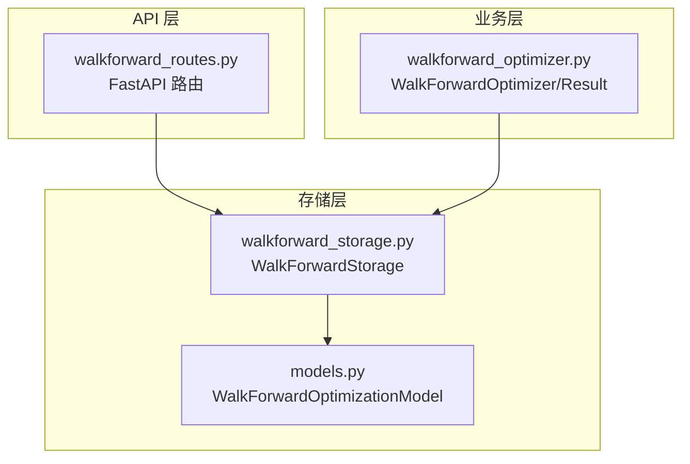
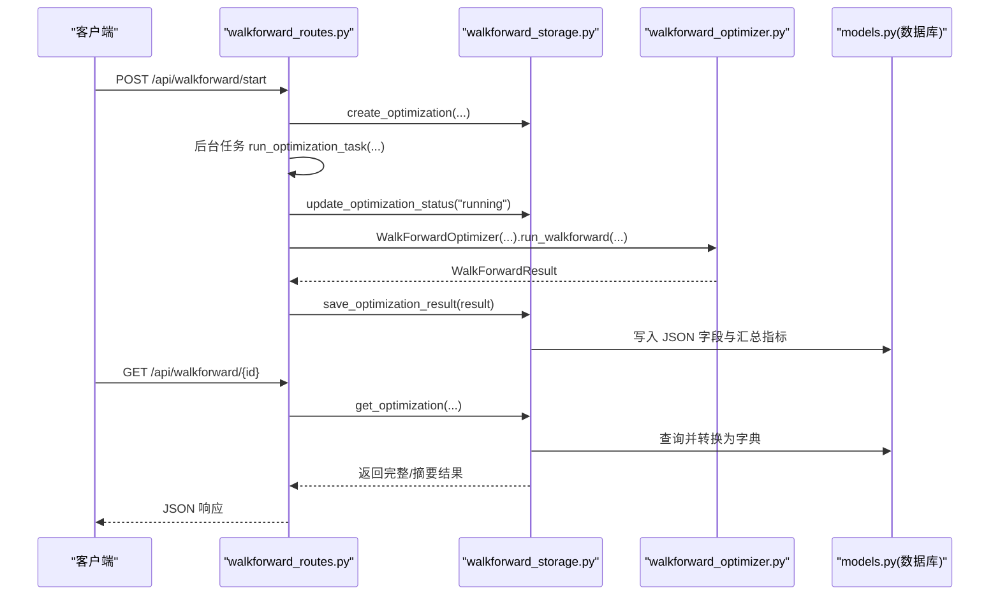
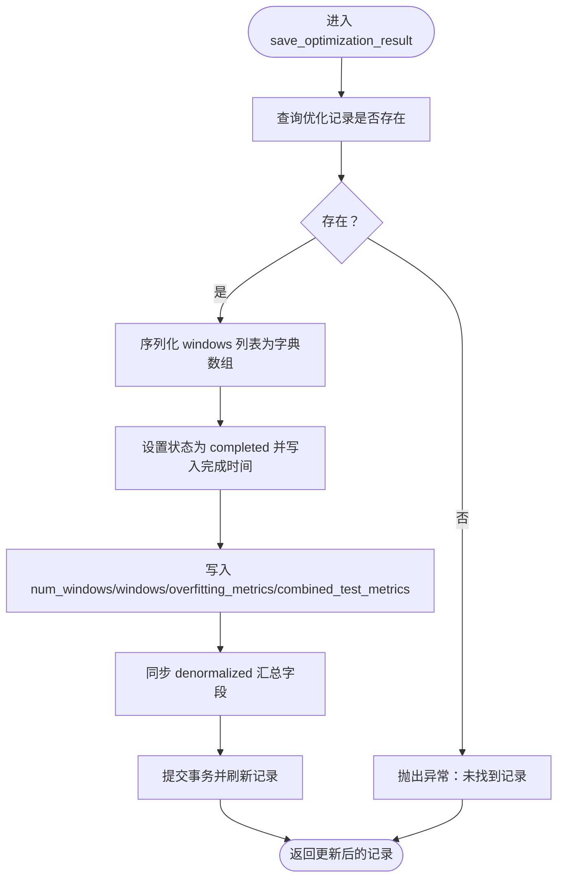
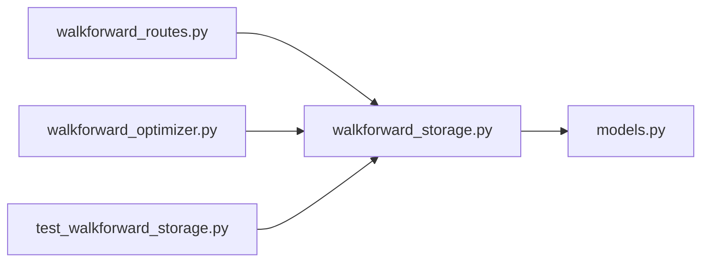

# 参数优化存储服务

<cite>
**本文引用的文件**
- [backend/src/db/walkforward_storage.py](file://backend/src/db/walkforward_storage.py)
- [backend/src/service/walkforward_optimizer.py](file://backend/src/service/walkforward_optimizer.py)
- [backend/src/db/models.py](file://backend/src/db/models.py)
- [backend/src/routes/walkforward_routes.py](file://backend/src/routes/walkforward_routes.py)
- [backend/tests/db/test_walkforward_storage.py](file://backend/tests/db/test_walkforward_storage.py)
</cite>

## 目录
1. [简介](#简介)
2. [项目结构](#项目结构)
3. [核心组件](#核心组件)
4. [架构总览](#架构总览)
5. [详细组件分析](#详细组件分析)
6. [依赖关系分析](#依赖关系分析)
7. [性能考量](#性能考量)
8. [故障排查指南](#故障排查指南)
9. [结论](#结论)
10. [附录](#附录)

## 简介
本文件系统性阐述参数优化存储服务如何组织与持久化“滚动/锚定”的参数优化任务数据，覆盖以下关键点：
- 如何记录优化任务的元数据（时间范围、参数网格、窗口配置）
- 每轮训练/验证的参数组合及其对应性能指标的序列化与落库
- 方法 save_optimization_result、get_optimization 报告查询、以及基于 overfitting 指标的最佳参数选择策略
- 结合 WalkforwardResult 模型，解释 JSON 序列化格式与性能对比指标的存储设计
- 示例：从 walkforward_optimizer.py 持久化优化结果的完整流程
- 大数据量下的索引优化与结果压缩策略建议

## 项目结构
围绕参数优化存储与检索的关键文件如下：
- 存储层：backend/src/db/walkforward_storage.py
- 数据模型：backend/src/db/models.py（定义数据库表结构与 JSON 字段类型）
- 业务引擎：backend/src/service/walkforward_optimizer.py（生成窗口、回测、过拟合检测）
- API 路由：backend/src/routes/walkforward_routes.py（对外暴露启动、列表、详情、删除、状态接口）
- 单元测试：backend/tests/db/test_walkforward_storage.py（验证创建、更新、保存流程）

图表来源
- [backend/src/routes/walkforward_routes.py](file://backend/src/routes/walkforward_routes.py#L1-L400)
- [backend/src/db/walkforward_storage.py](file://backend/src/db/walkforward_storage.py#L1-L426)
- [backend/src/db/models.py](file://backend/src/db/models.py#L409-L481)
- [backend/src/service/walkforward_optimizer.py](file://backend/src/service/walkforward_optimizer.py#L1-L538)

章节来源
- [backend/src/routes/walkforward_routes.py](file://backend/src/routes/walkforward_routes.py#L1-L400)
- [backend/src/db/walkforward_storage.py](file://backend/src/db/walkforward_storage.py#L1-L426)
- [backend/src/db/models.py](file://backend/src/db/models.py#L409-L481)
- [backend/src/service/walkforward_optimizer.py](file://backend/src/service/walkforward_optimizer.py#L1-L538)

## 核心组件
- WalkForwardStorage：封装数据库操作，负责创建优化记录、更新状态、保存完整结果、分页列表、按 ID 获取、删除等。
- WalkForwardOptimizationModel：SQLAlchemy 模型，字段包含元数据、窗口汇总指标、完整 JSON 结果（windows、overfitting_metrics、combined_test_metrics）。
- WalkForwardOptimizer/Result：生成训练/测试窗口、执行回测、计算过拟合指标与综合测试指标，输出标准化的 WalkForwardResult。
- FastAPI 路由：对外提供启动、列表、详情、删除、状态查询接口；后台任务驱动优化执行与持久化。

章节来源
- [backend/src/db/walkforward_storage.py](file://backend/src/db/walkforward_storage.py#L20-L426)
- [backend/src/db/models.py](file://backend/src/db/models.py#L409-L481)
- [backend/src/service/walkforward_optimizer.py](file://backend/src/service/walkforward_optimizer.py#L27-L538)
- [backend/src/routes/walkforward_routes.py](file://backend/src/routes/walkforward_routes.py#L129-L399)

## 架构总览
整体流程：API 接收请求后创建优化记录并启动后台任务；后台任务调用优化器生成结果，再通过存储层写入数据库。查询时可返回摘要或完整 JSON 结果。

图表来源
- [backend/src/routes/walkforward_routes.py](file://backend/src/routes/walkforward_routes.py#L129-L228)
- [backend/src/routes/walkforward_routes.py](file://backend/src/routes/walkforward_routes.py#L66-L126)
- [backend/src/db/walkforward_storage.py](file://backend/src/db/walkforward_storage.py#L164-L237)
- [backend/src/db/models.py](file://backend/src/db/models.py#L409-L481)
- [backend/src/service/walkforward_optimizer.py](file://backend/src/service/walkforward_optimizer.py#L341-L418)

## 详细组件分析

### 存储层 WalkForwardStorage
- 初始化与会话管理：构造函数接收数据库 URL，初始化引擎与会话工厂；提供 get_db_session 获取会话。
- 创建优化记录 create_optimization：写入元数据（策略名、标的、时间窗、参数网格、窗口大小、锚定模式、优化指标、资金、手续费、头寸等），初始状态为 pending。
- 更新状态 update_optimization_status：支持 pending/running/completed/failed，失败时可附带错误信息，完成时记录完成时间。
- 保存结果 save_optimization_result：将 WalkForwardResult 的 windows 列表转为字典数组，写入 windows JSON 字段；同时写入 overfitting_metrics 与 combined_test_metrics；并同步更新 denormalized 汇总字段（平均训练/测试表现、退化百分比、训练-测试相关系数、一致性评分、是否过拟合）。
- 列表查询 list_optimizations：支持按用户、标的、策略名、状态过滤，按任意字段升/降排序，分页返回总数与记录列表。
- 单条查询 get_optimization：按 ID 查询，可选按 user_id 过滤；支持 include_full_results 控制是否返回完整 JSON。
- 删除 delete_optimization：按 ID 删除，支持 user_id 过滤。
- 内部辅助 _record_to_dict：将模型实例转换为字典，必要时包含完整 JSON 结果。

章节来源
- [backend/src/db/walkforward_storage.py](file://backend/src/db/walkforward_storage.py#L20-L426)

### 数据模型 WalkForwardOptimizationModel
- 主键与唯一标识 optimization_id，支持按 user_id、ticker、strategy_name、status 建立索引以提升查询效率。
- 元数据字段：strategy_name、ticker、start_date、end_date、train_period_days、test_period_days、anchored、optimization_metric、initial_cash、commission、stake。
- 时间戳：created_at、completed_at。
- 状态与错误：status、error_message。
- 汇总指标（denormalized）：num_windows、avg_train_performance、avg_test_performance、avg_degradation_pct、train_test_correlation、consistency_score、overfitting_detected。
- JSON 字段：param_grid（参数网格）、windows（每轮窗口的训练/测试指标与最佳参数）、overfitting_metrics（过拟合检测指标）、combined_test_metrics（测试阶段综合指标）。
- 使用 SafeJSON 类型装饰器，统一处理 JSON 的序列化/反序列化与空值。

章节来源
- [backend/src/db/models.py](file://backend/src/db/models.py#L409-L481)
- [backend/src/db/models.py](file://backend/src/db/models.py#L42-L61)

### 业务引擎 WalkForwardOptimizer 与结果模型
- 数据类 OptimizationWindow：记录单个窗口的训练/测试时间边界、最佳参数、训练指标、测试指标、训练集所有结果。
- 数据类 WalkForwardResult：包含 optimization_id、strategy_name、ticker、总起止日期、窗口列表、参数网格、过拟合指标、测试综合指标、创建时间。
- 窗口生成 _generate_windows：支持 anchored（锚定）与 rolling（滚动）两种模式，按天数推进，直到测试窗口超出总结束日期。
- 参数组合 _generate_param_combinations：使用笛卡尔积生成全部参数组合。
- 回测 _run_single_backtest：构建 cerebro 实例，添加策略、数据、分析器，运行并提取指标（净值、总收益、夏普比率、最大回撤、SQN、交易次数、胜率、盈亏比等）。
- 训练优化 _optimize_on_train_window：在训练窗口内遍历参数组合，依据 optimization_metric 选择最佳参数与指标。
- 测试验证 _validate_on_test_window：使用训练选出的最佳参数在测试窗口回测。
- 完整流程 run_walkforward：生成窗口与参数组合，逐窗口执行优化与验证，汇总 overfitting_metrics 与 combined_test_metrics。
- 过拟合指标 _calculate_overfitting_metrics：计算训练/测试相关性、平均退化百分比、一致性评分、退化标准差，并给出是否过拟合的判定。
- 综合测试指标 _calculate_combined_test_metrics：统计跨窗口测试阶段的总收益、平均夏普、平均最大回撤、总交易数、胜率等。

章节来源
- [backend/src/service/walkforward_optimizer.py](file://backend/src/service/walkforward_optimizer.py#L27-L538)

### API 路由与后台任务
- 启动优化 start_walkforward_optimization：生成 optimization_id，写入数据库 pending 状态，异步启动 run_optimization_task。
- 后台任务 run_optimization_task：更新状态为 running，构造 WalkForwardOptimizer 并执行 run_walkforward，随后调用 storage.save_optimization_result 持久化；异常时更新状态为 failed 并记录错误。
- 列表查询 list_walkforward_optimizations：支持过滤、排序、分页。
- 详情查询 get_walkforward_optimization：返回完整 JSON 或摘要。
- 删除 delete_walkforward_optimization：按 ID 删除。
- 状态查询 get_walkforward_status：返回状态、错误信息、进度信息。

章节来源
- [backend/src/routes/walkforward_routes.py](file://backend/src/routes/walkforward_routes.py#L129-L399)

### 方法实现要点与数据流

#### save_optimization_result
- 输入：WalkForwardResult 实例
- 步骤：
  - 查询记录是否存在
  - 将 result.windows 转换为字典数组，包含 window_id、train_start/end、test_start/end、best_params、train_metrics、test_metrics
  - 设置 status=completed、completed_at=当前时间
  - 写入 num_windows、windows、overfitting_metrics、combined_test_metrics
  - 同步 denormalized 汇总字段（平均训练/测试表现、退化百分比、相关系数、一致性评分、是否过拟合）
  - 提交事务并刷新记录
- 输出：更新后的模型实例

图表来源
- [backend/src/db/walkforward_storage.py](file://backend/src/db/walkforward_storage.py#L164-L237)

章节来源
- [backend/src/db/walkforward_storage.py](file://backend/src/db/walkforward_storage.py#L164-L237)

#### get_optimization 报告查询
- 支持按 optimization_id 查询，可选 user_id 过滤
- 可选择 include_full_results=true 返回完整 JSON（windows、overfitting_metrics、combined_test_metrics）
- 内部通过 _record_to_dict 将模型实例转换为字典，必要时包含完整 JSON

章节来源
- [backend/src/db/walkforward_storage.py](file://backend/src/db/walkforward_storage.py#L309-L383)
- [backend/src/db/walkforward_storage.py](file://backend/src/db/walkforward_storage.py#L384-L423)

#### query_best_parameters（基于 overfitting 指标）
- 设计思路：根据 overfitting_metrics 中的 avg_degradation_pct、consistency_score、train_test_correlation 等指标，评估各窗口最佳参数的稳定性与泛化能力。
- 实现建议（概念性说明）：
  - 优先选择 avg_degradation_pct 较低、consistency_score 较高、train_test_correlation 较高的窗口
  - 若多个窗口表现相近，可取窗口内 test_metrics 的平均值作为最终推荐
  - 对于 anchor 模式，可考虑窗口跨度与样本量的影响，避免早期窗口样本量过小导致的偏差
- 注意：该方法在现有代码中未直接实现，但数据已具备支持该分析所需的字段（best_params、train/test_metrics、overfitting_metrics）

章节来源
- [backend/src/service/walkforward_optimizer.py](file://backend/src/service/walkforward_optimizer.py#L395-L418)
- [backend/src/service/walkforward_optimizer.py](file://backend/src/service/walkforward_optimizer.py#L419-L531)

### 参数序列化格式与存储设计
- JSON 字段类型：使用 SafeJSON 类型装饰器，统一处理 None/空字符串与 JSON 编解码，保证字段可为空且兼容不同前端/客户端解析。
- 字段设计：
  - param_grid：参数网格（字典）
  - windows：每轮窗口的完整信息（字典数组）
  - overfitting_metrics：过拟合检测指标（字典）
  - combined_test_metrics：测试阶段综合指标（字典）
- 汇总字段（denormalized）：avg_train_performance、avg_test_performance、avg_degradation_pct、train_test_correlation、consistency_score、overfitting_detected，便于快速筛选与排序。

章节来源
- [backend/src/db/models.py](file://backend/src/db/models.py#L42-L61)
- [backend/src/db/models.py](file://backend/src/db/models.py#L409-L481)

### 示例：从 walkforward_optimizer.py 持久化优化结果的流程
- API 接口启动优化后，后台任务 run_optimization_task 调用 WalkForwardOptimizer.run_walkforward 生成 WalkForwardResult
- 随后调用 storage.save_optimization_result(result) 将结果写入数据库
- 客户端可通过 get_optimization 获取完整 JSON 或通过 list_optimizations 获取摘要列表

章节来源
- [backend/src/routes/walkforward_routes.py](file://backend/src/routes/walkforward_routes.py#L66-L126)
- [backend/src/service/walkforward_optimizer.py](file://backend/src/service/walkforward_optimizer.py#L341-L418)
- [backend/src/db/walkforward_storage.py](file://backend/src/db/walkforward_storage.py#L164-L237)

## 依赖关系分析
- 路由层依赖存储层：API 调用 WalkForwardStorage 执行 CRUD 与查询。
- 存储层依赖模型层：ORM 模型定义字段与 JSON 类型。
- 业务层依赖存储层：优化完成后将结果写入数据库。
- 测试层验证存储层关键流程：创建、更新状态、保存结果。

图表来源
- [backend/src/routes/walkforward_routes.py](file://backend/src/routes/walkforward_routes.py#L1-L400)
- [backend/src/db/walkforward_storage.py](file://backend/src/db/walkforward_storage.py#L1-L426)
- [backend/src/db/models.py](file://backend/src/db/models.py#L409-L481)
- [backend/src/service/walkforward_optimizer.py](file://backend/src/service/walkforward_optimizer.py#L1-L538)
- [backend/tests/db/test_walkforward_storage.py](file://backend/tests/db/test_walkforward_storage.py#L1-L55)

章节来源
- [backend/src/routes/walkforward_routes.py](file://backend/src/routes/walkforward_routes.py#L1-L400)
- [backend/src/db/walkforward_storage.py](file://backend/src/db/walkforward_storage.py#L1-L426)
- [backend/src/db/models.py](file://backend/src/db/models.py#L409-L481)
- [backend/src/service/walkforward_optimizer.py](file://backend/src/service/walkforward_optimizer.py#L1-L538)
- [backend/tests/db/test_walkforward_storage.py](file://backend/tests/db/test_walkforward_storage.py#L1-L55)

## 性能考量
- 索引优化
  - 在 WalkForwardOptimizationModel 上为 user_id、ticker、strategy_name、status、created_at 建立索引，以支持高频过滤与排序。
  - JSON 字段不建索引，避免写放大；读取时按需展开。
- 写入路径
  - save_optimization_result 一次性写入 JSON 字段与 denormalized 汇总字段，减少多次往返。
  - 使用批量提交与事务控制，异常时回滚。
- 读取路径
  - 列表查询先 count 再分页，避免全表扫描。
  - 详情查询可选择 include_full_results=false 仅返回摘要，降低网络与解析开销。
- 大数据量建议
  - 分页 limit 默认 100，可根据前端分页策略调整。
  - 对 overfitting 指标建立数值索引（如 avg_test_performance、consistency_score）以加速筛选。
  - 对 windows 字段采用压缩存储（如 gzip）可能进一步节省空间，但需权衡 CPU 开销与查询复杂度。
  - 对 param_grid 与 metrics 字段进行字段裁剪，仅保留必要指标，减少 JSON 体积。

[本节为通用性能建议，不直接分析具体文件]

## 故障排查指南
- 常见问题
  - 优化记录不存在：save_optimization_result 会检查记录存在性，不存在则抛错；确认 optimization_id 是否正确。
  - 数据库连接异常：init_database 支持连接池预热与 SQLite 特殊配置；检查数据库 URL 与权限。
  - JSON 解析失败：SafeJSON 已处理空值与异常，若仍报错，检查 JSON 字段是否被意外修改。
- 日志定位
  - 路由层与存储层均记录关键事件（开始/完成/失败），可通过日志定位问题发生阶段。
- 单元测试参考
  - test_walkforward_storage.py 验证了 create_optimization、update_optimization_status、save_optimization_result 的基本流程。

章节来源
- [backend/src/db/walkforward_storage.py](file://backend/src/db/walkforward_storage.py#L114-L163)
- [backend/src/db/walkforward_storage.py](file://backend/src/db/walkforward_storage.py#L164-L237)
- [backend/tests/db/test_walkforward_storage.py](file://backend/tests/db/test_walkforward_storage.py#L1-L55)

## 结论
本存储服务通过 WalkForwardStorage 将参数优化的元数据、每轮窗口的训练/测试指标、过拟合检测与综合测试指标以 JSON 形式持久化，配合 denormalized 汇总字段实现高效查询与分析。结合 FastAPI 路由与后台任务，实现了从启动到结果落库的完整闭环。针对大数据量场景，建议强化索引、合理分页与字段裁剪，以平衡查询性能与存储成本。

[本节为总结性内容，不直接分析具体文件]

## 附录

### API 定义概览
- POST /api/walkforward/start：启动优化，返回 optimization_id
- GET /api/walkforward/list：分页列出优化记录（支持过滤/排序）
- GET /api/walkforward/{optimization_id}：获取详情（可选完整 JSON）
- DELETE /api/walkforward/{optimization_id}：删除优化记录
- GET /api/walkforward/{optimization_id}/status：获取状态与进度

章节来源
- [backend/src/routes/walkforward_routes.py](file://backend/src/routes/walkforward_routes.py#L129-L399)