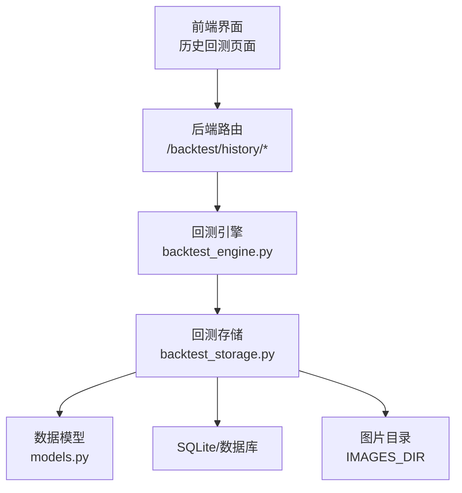
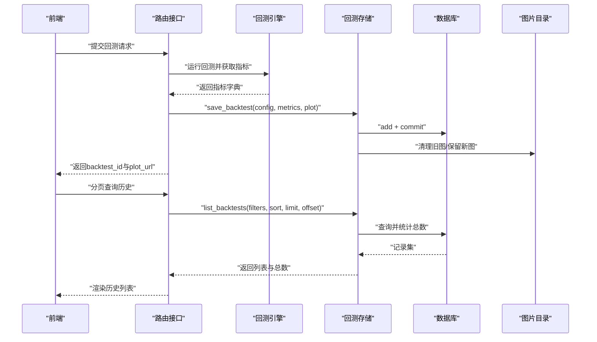
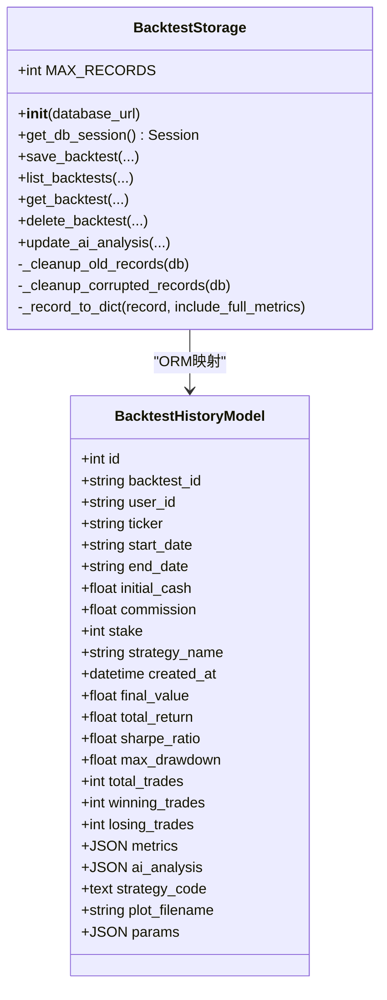
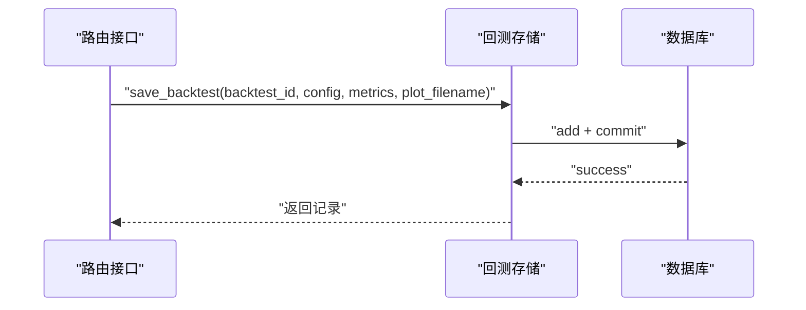
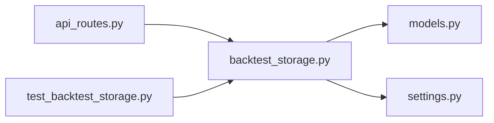

# 回测存储服务

<cite>
**本文引用的文件**
- [backend/src/db/backtest_storage.py](file://backend/src/db/backtest_storage.py)
- [backend/src/db/models.py](file://backend/src/db/models.py)
- [backend/src/service/backtest_engine.py](file://backend/src/service/backtest_engine.py)
- [backend/src/routes/api_routes.py](file://backend/src/routes/api_routes.py)
- [backend/src/config/settings.py](file://backend/src/config/settings.py)
- [backend/tests/db/test_backtest_storage.py](file://backend/tests/db/test_backtest_storage.py)
</cite>

## 目录
1. [简介](#简介)
2. [项目结构](#项目结构)
3. [核心组件](#核心组件)
4. [架构总览](#架构总览)
5. [详细组件分析](#详细组件分析)
6. [依赖关系分析](#依赖关系分析)
7. [性能考量](#性能考量)
8. [故障排查指南](#故障排查指南)
9. [结论](#结论)
10. [附录](#附录)

## 简介
本文件系统性阐述后端回测存储服务（backtest_storage.py）如何通过SQLAlchemy ORM实现回测结果的持久化与查询。重点覆盖：
- 通过BacktestHistoryModel模型存储回测配置、关键指标与完整指标JSON
- 支持按策略名称、时间范围、排序字段（如总收益、夏普比率）等多维条件检索
- 核心方法实现逻辑：保存、列表查询、单条查询、删除、更新AI分析
- 事务管理、异常回滚与日志记录机制
- 结合models.py字段定义，说明性能指标（最大回撤、年化收益等）的存储结构
- 展示从backtest_engine.py调用存储服务保存结果的完整流程
- 讨论批量插入优化与查询缓存策略以提升大数据量下的响应性能

## 项目结构
回测存储服务位于后端数据库层，与业务路由、服务引擎、配置设置协同工作：
- 存储层：backtest_storage.py 提供ORM封装与数据清理
- 数据模型：models.py 定义BacktestHistoryModel及JSON类型SafeJSON
- 业务引擎：backtest_engine.py 运行回测并产出指标
- 路由接口：api_routes.py 将前端请求转发至存储层
- 配置设置：settings.py 提供DATABASE_URL、IMAGES_DIR等路径

图表来源
- [backend/src/routes/api_routes.py](file://backend/src/routes/api_routes.py#L238-L506)
- [backend/src/service/backtest_engine.py](file://backend/src/service/backtest_engine.py#L302-L384)
- [backend/src/db/backtest_storage.py](file://backend/src/db/backtest_storage.py#L1-L120)
- [backend/src/db/models.py](file://backend/src/db/models.py#L282-L344)
- [backend/src/config/settings.py](file://backend/src/config/settings.py#L1-L113)

章节来源
- [backend/src/db/backtest_storage.py](file://backend/src/db/backtest_storage.py#L1-L120)
- [backend/src/db/models.py](file://backend/src/db/models.py#L282-L344)
- [backend/src/service/backtest_engine.py](file://backend/src/service/backtest_engine.py#L302-L384)
- [backend/src/routes/api_routes.py](file://backend/src/routes/api_routes.py#L238-L506)
- [backend/src/config/settings.py](file://backend/src/config/settings.py#L1-L113)

## 核心组件
- BacktestStorage类：封装数据库会话、保存、查询、删除、清理等操作；内置MAX_RECORDS上限与自动清理
- BacktestHistoryModel：定义回测历史表结构，包含索引字段（策略名、创建时间、总收益、夏普比率）以支持高效检索
- SafeJSON类型：统一处理JSON字段的序列化/反序列化，避免空字符串与NULL导致的异常
- 配置常量：DATABASE_URL、IMAGES_DIR用于连接数据库与图片存储

章节来源
- [backend/src/db/backtest_storage.py](file://backend/src/db/backtest_storage.py#L22-L121)
- [backend/src/db/models.py](file://backend/src/db/models.py#L282-L344)
- [backend/src/db/models.py](file://backend/src/db/models.py#L42-L60)
- [backend/src/config/settings.py](file://backend/src/config/settings.py#L1-L113)

## 架构总览
回测结果从引擎产生，经路由接口写入数据库，再由存储层提供查询能力。查询时对JSON字段进行容错处理，必要时清理损坏记录后重试。

图表来源
- [backend/src/routes/api_routes.py](file://backend/src/routes/api_routes.py#L238-L506)
- [backend/src/service/backtest_engine.py](file://backend/src/service/backtest_engine.py#L302-L384)
- [backend/src/db/backtest_storage.py](file://backend/src/db/backtest_storage.py#L41-L121)
- [backend/src/db/backtest_storage.py](file://backend/src/db/backtest_storage.py#L188-L272)

## 详细组件分析

### BacktestStorage类与ORM模型
- 类职责
  - 初始化数据库连接与会话工厂
  - 提供保存、列表查询、单条查询、删除、更新AI分析等方法
  - 内置记录上限与自动清理逻辑，同时清理关联图片文件
- 关键字段与索引（来自BacktestHistoryModel）
  - 基本配置：ticker、start_date、end_date、initial_cash、commission、stake、strategy_name
  - 时间戳：created_at（带索引）
  - 性能指标（便于快速排序/过滤）：final_value、total_return（索引）、sharpe_ratio（索引）、max_drawdown、total_trades、winning_trades、losing_trades
  - JSON字段：metrics（完整指标）、ai_analysis（可多模型）、strategy_code、params
  - 图片引用：plot_filename
- JSON类型SafeJSON
  - 统一处理None与空字符串，避免ORM读取异常
  - 在查询时若发生JSON解析错误，存储层会尝试清理损坏记录并重试

图表来源
- [backend/src/db/backtest_storage.py](file://backend/src/db/backtest_storage.py#L22-L121)
- [backend/src/db/models.py](file://backend/src/db/models.py#L282-L344)

章节来源
- [backend/src/db/backtest_storage.py](file://backend/src/db/backtest_storage.py#L22-L121)
- [backend/src/db/models.py](file://backend/src/db/models.py#L282-L344)

### 方法实现逻辑

#### 保存回测结果：save_backtest
- 输入参数：backtest_id、config（含策略名、时间范围、资金、手续费、仓位等）、metrics（含最终价值、总收益、夏普比率、最大回撤、交易明细等）、plot_filename、ai_analysis、strategy_code、user_id
- 处理流程
  - 获取或创建数据库会话
  - 构造BacktestHistoryModel实例，提取关键指标字段用于索引与排序
  - 添加记录并提交，刷新对象
  - 记录成功日志
  - 触发自动清理：超过MAX_RECORDS上限则删除最旧记录，并删除对应图片文件
- 异常处理：捕获异常、记录错误日志、回滚事务、抛出异常
- 会话管理：若外部未传入db，则在finally中关闭会话

章节来源
- [backend/src/db/backtest_storage.py](file://backend/src/db/backtest_storage.py#L41-L121)

#### 列表查询：list_backtests
- 查询条件
  - 可选过滤：ticker、strategy_name、start_date（>=）、end_date（<=）
  - 排序字段：created_at、total_return、sharpe_ratio，默认按created_at降序
  - 分页：limit、offset
  - 用户隔离：user_id
- 容错机制
  - 先统计总数，再分页查询
  - 若查询过程中因JSON解析失败，先清理ai_analysis为空或metrics为空的记录，再重试
- 输出格式：返回列表与总数，内部使用_record_to_dict转换为字典

章节来源
- [backend/src/db/backtest_storage.py](file://backend/src/db/backtest_storage.py#L188-L272)

#### 单条查询：get_backtest
- 功能：按backtest_id查询，可选user_id过滤
- 返回：包含完整metrics、ai_analysis、strategy_code、params等（当include_full_metrics=True）

章节来源
- [backend/src/db/backtest_storage.py](file://backend/src/db/backtest_storage.py#L273-L303)

#### 删除记录：delete_backtest
- 功能：按backtest_id删除记录，并删除关联图片文件
- 返回：删除成功与否

章节来源
- [backend/src/db/backtest_storage.py](file://backend/src/db/backtest_storage.py#L304-L357)

#### 更新AI分析：update_ai_analysis
- 功能：为指定回测追加AI分析（支持多模型），以JSON字典形式保存
- 返回：更新成功与否

章节来源
- [backend/src/db/backtest_storage.py](file://backend/src/db/backtest_storage.py#L358-L418)

#### 自动清理：_cleanup_old_records 与 _cleanup_corrupted_records
- _cleanup_old_records：基于created_at升序删除超出MAX_RECORDS上限的历史记录，并删除对应图片文件
- _cleanup_corrupted_records：通过原生SQL删除metrics为空或ai_analysis为空字符串的记录，避免后续查询JSON解析异常

章节来源
- [backend/src/db/backtest_storage.py](file://backend/src/db/backtest_storage.py#L122-L187)
- [backend/src/db/backtest_storage.py](file://backend/src/db/backtest_storage.py#L159-L187)

### 字段定义与性能指标存储结构
- BacktestHistoryModel字段要点
  - 索引字段：strategy_name、created_at、total_return、sharpe_ratio，用于快速过滤与排序
  - JSON字段：metrics（完整指标字典）、ai_analysis（多模型分析字典）、params（策略参数）
  - 图片引用：plot_filename
- 指标来源（来自backtest_engine.py）
  - final_value：账户净值
  - returns：总回报率（归一化）
  - annual_returns：年化收益
  - sharpe：夏普比率
  - drawdown：最大回撤
  - trade_details：交易统计（总交易数、胜/负交易数等）
  - SQN、TimeDrawDown等其他指标

章节来源
- [backend/src/db/models.py](file://backend/src/db/models.py#L282-L344)
- [backend/src/service/backtest_engine.py](file://backend/src/service/backtest_engine.py#L302-L384)

### 从backtest_engine.py调用存储服务的完整流程
- 后端路由在回测完成后，构造config与metrics，调用BacktestStorage.save_backtest保存
- 该流程非阻塞：即使保存失败，也不会影响回测主流程
- 前端通过分页接口查询历史，支持按策略名、时间范围、排序字段筛选

图表来源
- [backend/src/routes/api_routes.py](file://backend/src/routes/api_routes.py#L238-L273)
- [backend/src/db/backtest_storage.py](file://backend/src/db/backtest_storage.py#L41-L121)

章节来源
- [backend/src/routes/api_routes.py](file://backend/src/routes/api_routes.py#L238-L273)
- [backend/src/service/backtest_engine.py](file://backend/src/service/backtest_engine.py#L302-L384)

## 依赖关系分析
- 存储层依赖
  - SQLAlchemy ORM与Session管理
  - models.py中的BacktestHistoryModel与SafeJSON
  - settings.py中的DATABASE_URL与IMAGES_DIR
- 路由层依赖
  - 从api_routes.py调用get_backtest_storage获取存储实例
  - 对外暴露列表、详情、删除、AI分析更新接口
- 测试依赖
  - test_backtest_storage.py验证保存、清理与图片删除行为

图表来源
- [backend/src/routes/api_routes.py](file://backend/src/routes/api_routes.py#L238-L506)
- [backend/src/db/backtest_storage.py](file://backend/src/db/backtest_storage.py#L1-L120)
- [backend/src/db/models.py](file://backend/src/db/models.py#L282-L344)
- [backend/src/config/settings.py](file://backend/src/config/settings.py#L1-L113)
- [backend/tests/db/test_backtest_storage.py](file://backend/tests/db/test_backtest_storage.py#L1-L51)

章节来源
- [backend/src/routes/api_routes.py](file://backend/src/routes/api_routes.py#L238-L506)
- [backend/src/db/backtest_storage.py](file://backend/src/db/backtest_storage.py#L1-L120)
- [backend/tests/db/test_backtest_storage.py](file://backend/tests/db/test_backtest_storage.py#L1-L51)

## 性能考量
- 查询性能
  - 索引字段：strategy_name、created_at、total_return、sharpe_ratio，显著降低过滤与排序成本
  - JSON字段采用SafeJSON，避免ORM层异常；查询时若出现JSON解析失败，先清理损坏记录再重试
- 存储清理
  - MAX_RECORDS限制与自动清理，防止历史记录无限增长
  - 清理时同步删除图片文件，减少磁盘占用
- 批量插入优化
  - 当前save_backtest为逐条插入；对于大量回测结果，建议在上层批量组装records后使用批量插入（例如使用bulk_insert_mappings或原生SQL的INSERT ... VALUES），以减少事务次数与网络往返
  - SQLite可使用ON CONFLICT DO NOTHING策略去重，避免重复写入
- 查询缓存策略
  - 对高频查询（如最近N条、按策略名分组统计）可在应用层增加内存缓存（如LRU缓存），并设置TTL
  - 对于列表查询，可缓存“热门策略名+时间范围”的组合结果，结合ETag或Last-Modified做缓存失效控制
- 日志与监控
  - 使用结构化日志记录慢查询、JSON解析失败、清理操作等事件，便于定位性能瓶颈

[本节为通用性能建议，不直接分析具体文件]

## 故障排查指南
- 保存失败
  - 现象：save_backtest抛出异常并回滚
  - 排查：检查数据库连接、字段类型、JSON字段是否合法
  - 参考：异常捕获与回滚逻辑
- 查询失败（JSON解析异常）
  - 现象：list_backtests在查询时抛出异常
  - 处理：自动清理ai_analysis为空或metrics为空的记录，然后重试
  - 参考：容错与重试逻辑
- 图片清理失败
  - 现象：清理旧记录时删除图片失败
  - 处理：记录警告日志，不影响整体清理流程
- 删除失败
  - 现象：delete_backtest返回False或抛出异常
  - 处理：确认backtest_id与user_id匹配，检查图片文件是否存在

章节来源
- [backend/src/db/backtest_storage.py](file://backend/src/db/backtest_storage.py#L114-L187)
- [backend/src/db/backtest_storage.py](file://backend/src/db/backtest_storage.py#L188-L272)
- [backend/src/db/backtest_storage.py](file://backend/src/db/backtest_storage.py#L304-L357)

## 结论
backtest_storage.py通过SQLAlchemy ORM与BacktestHistoryModel实现了回测结果的可靠持久化，配合索引字段与JSON类型SafeJSON，满足多维条件检索与高效排序需求。其自动清理与容错机制提升了稳定性。建议在高并发与大批量场景下引入批量插入与查询缓存策略，进一步优化性能与用户体验。

[本节为总结性内容，不直接分析具体文件]

## 附录

### API与调用路径参考
- 保存回测：路由接口在回测完成后调用存储层保存
- 列表查询：支持按策略名、时间范围、排序字段与分页
- 单条查询：按backtest_id与user_id获取详情
- 删除回测：删除记录并清理图片
- 更新AI分析：多模型分析合并保存

章节来源
- [backend/src/routes/api_routes.py](file://backend/src/routes/api_routes.py#L238-L506)
- [backend/src/db/backtest_storage.py](file://backend/src/db/backtest_storage.py#L188-L418)