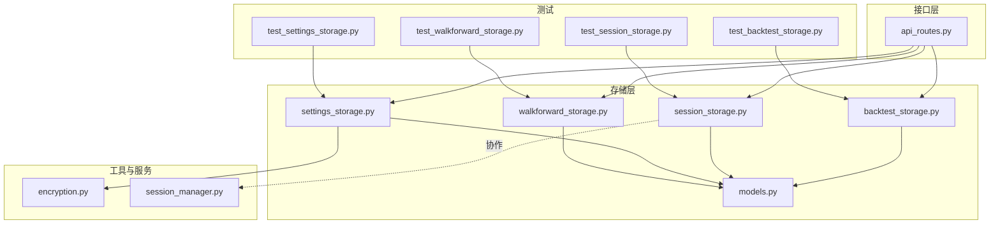
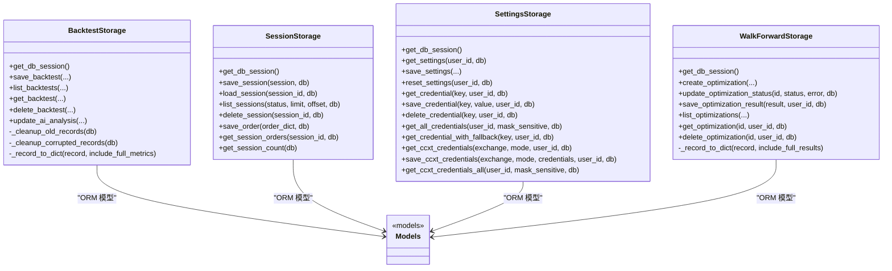
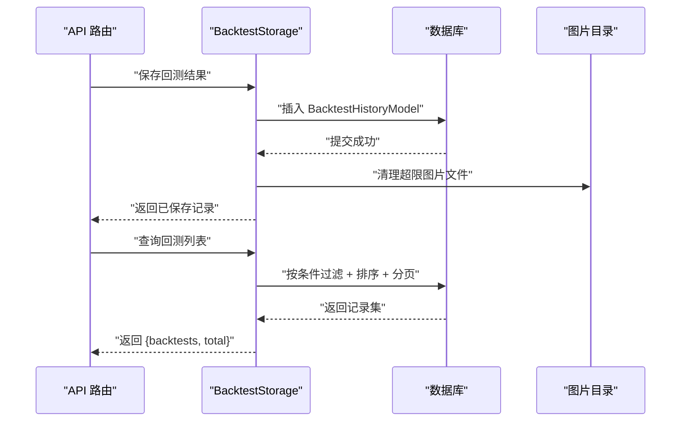
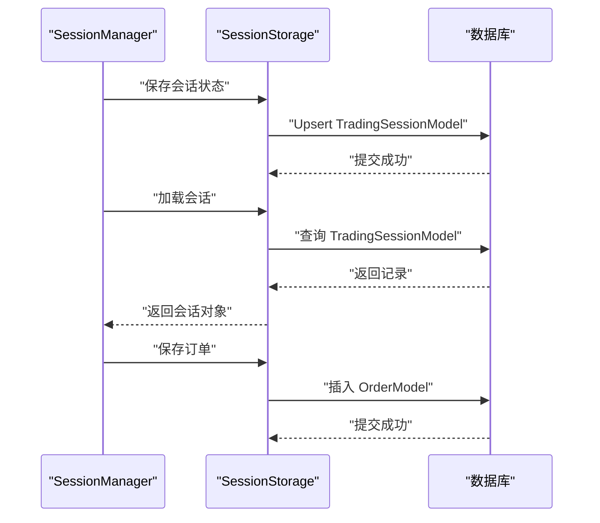
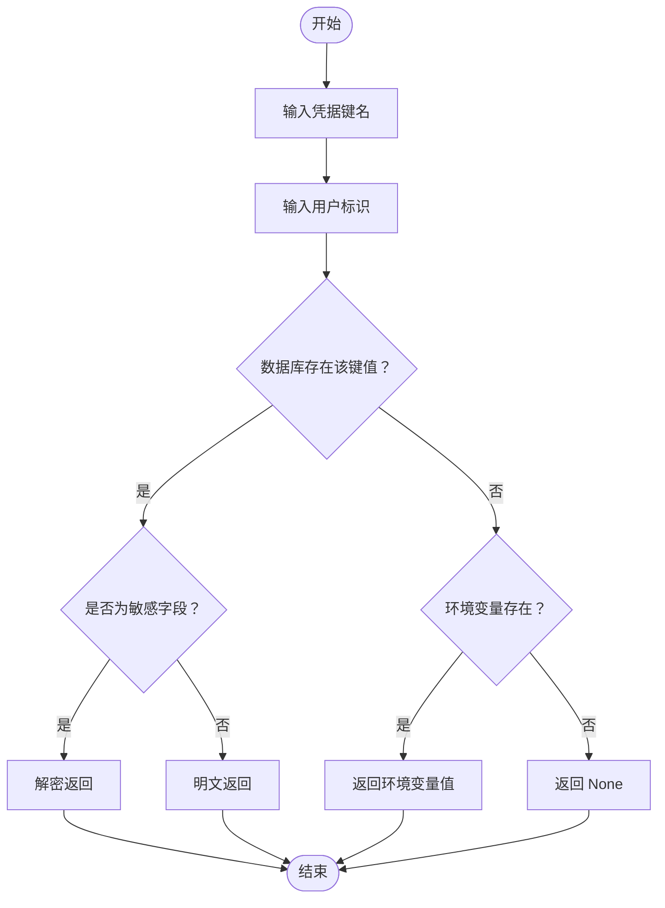
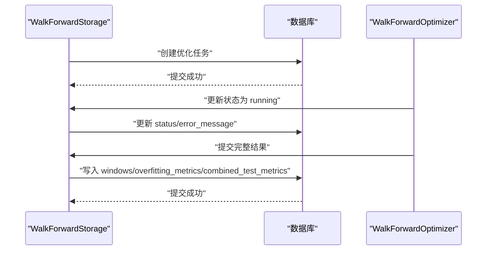
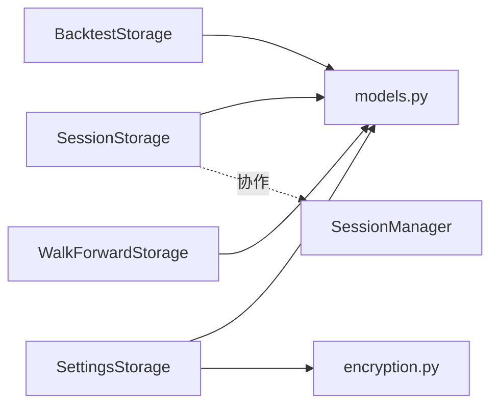

# 存储服务与数据访问

<cite>
**本文引用的文件**
- [backend/src/db/backtest_storage.py](file://backend/src/db/backtest_storage.py)
- [backend/src/db/session_storage.py](file://backend/src/db/session_storage.py)
- [backend/src/db/settings_storage.py](file://backend/src/db/settings_storage.py)
- [backend/src/db/walkforward_storage.py](file://backend/src/db/walkforward_storage.py)
- [backend/src/db/models.py](file://backend/src/db/models.py)
- [backend/src/db/db.md](file://backend/src/db/db.md)
- [backend/src/utils/encryption.py](file://backend/src/utils/encryption.py)
- [backend/src/service/session_manager.py](file://backend/src/service/session_manager.py)
- [backend/src/routers/api_routes.py](file://backend/src/routers/api_routes.py)
- [backend/tests/db/test_backtest_storage.py](file://backend/tests/db/test_backtest_storage.py)
- [backend/tests/db/test_session_storage.py](file://backend/tests/db/test_session_storage.py)
- [backend/tests/db/test_settings_storage.py](file://backend/tests/db/test_settings_storage.py)
- [backend/tests/db/test_walkforward_storage.py](file://backend/tests/db/test_walkforward_storage.py)
</cite>

## 目录
1. [简介](#简介)
2. [项目结构](#项目结构)
3. [核心组件](#核心组件)
4. [架构总览](#架构总览)
5. [详细组件分析](#详细组件分析)
6. [依赖关系分析](#依赖关系分析)
7. [性能考量](#性能考量)
8. [故障排查指南](#故障排查指南)
9. [结论](#结论)
10. [附录](#附录)

## 简介
本文件聚焦于后端“存储服务与数据访问”模块，系统性解析以下四个核心存储模块的实现机制与职责分工：
- 回测历史存储（BacktestStorage）：封装回测结果的持久化与查询，支持按策略名称、时间范围、性能指标等多维检索。
- 实盘/模拟盘会话存储（SessionStorage）：管理交易会话生命周期状态，与 SessionManager 协同工作，支撑崩溃恢复与会话历史。
- 用户设置与凭证存储（SettingsStorage）：安全地存储用户凭证（调用 encryption.py 进行加密）与系统偏好。
- Walk-Forward 优化存储（WalkForwardStorage）：组织优化任务的参数组合与验证结果，提供创建、状态更新、结果落库与查询能力。

同时，文档说明这些模块如何遵循 db.md 中定义的统一接口规范，提供 create、get、update、delete 等标准化方法，并实现异常处理、日志记录与性能监控；并通过路由层展示跨模块数据联动场景（如回测完成后自动保存至数据库），并讨论连接池配置、批量写入优化与查询缓存策略。

## 项目结构
存储服务位于 backend/src/db 目录，配合 models 定义数据模型，utils 提供加密工具，service 提供会话管理，routers 提供 API 路由入口。

图表来源
- [backend/src/db/backtest_storage.py](file://backend/src/db/backtest_storage.py#L1-L120)
- [backend/src/db/session_storage.py](file://backend/src/db/session_storage.py#L1-L120)
- [backend/src/db/settings_storage.py](file://backend/src/db/settings_storage.py#L1-L120)
- [backend/src/db/walkforward_storage.py](file://backend/src/db/walkforward_storage.py#L1-L120)
- [backend/src/db/models.py](file://backend/src/db/models.py#L240-L345)
- [backend/src/utils/encryption.py](file://backend/src/utils/encryption.py#L1-L120)
- [backend/src/service/session_manager.py](file://backend/src/service/session_manager.py#L1-L120)
- [backend/src/routers/api_routes.py](file://backend/src/routers/api_routes.py#L1-L120)

章节来源
- [backend/src/db/db.md](file://backend/src/db/db.md#L1-L23)

## 核心组件
- BacktestStorage：提供回测结果的保存、列表查询、详情获取、删除、AI 分析更新与自动清理旧记录的能力；支持按用户、标的、策略名、时间范围、排序与分页查询；内置 JSON 损坏检测与清理。
- SessionStorage：提供会话的保存/加载/列表/删除、订单保存与查询、按状态计数等能力；与 SessionManager 的运行时状态协同，支持崩溃恢复与历史追踪。
- SettingsStorage：提供用户设置的读取/保存/重置、凭据的加密存储与解密读取、CCXT 凭证的结构化存储与读取、凭据获取的数据库优先与环境变量回退策略。
- WalkForwardStorage：提供优化任务的创建、状态更新、完整结果落库、列表查询、详情获取与删除；将窗口级训练/测试指标、过拟合度量与汇总指标持久化。

章节来源
- [backend/src/db/backtest_storage.py](file://backend/src/db/backtest_storage.py#L22-L120)
- [backend/src/db/session_storage.py](file://backend/src/db/session_storage.py#L27-L120)
- [backend/src/db/settings_storage.py](file://backend/src/db/settings_storage.py#L51-L120)
- [backend/src/db/walkforward_storage.py](file://backend/src/db/walkforward_storage.py#L20-L120)

## 架构总览
存储层以 SQLAlchemy ORM 为核心，通过 models.py 定义的数据模型承载业务实体；每个存储类均持有数据库引擎与会话工厂，提供统一的 get_db_session 方法；所有 CRUD 操作均在本地事务内执行，失败时回滚并记录错误日志；部分模块还包含数据一致性保障（如 JSON 类型 SafeJSON、索引字段 denormalized 性能字段）。

图表来源
- [backend/src/db/backtest_storage.py](file://backend/src/db/backtest_storage.py#L22-L446)
- [backend/src/db/session_storage.py](file://backend/src/db/session_storage.py#L27-L392)
- [backend/src/db/settings_storage.py](file://backend/src/db/settings_storage.py#L51-L759)
- [backend/src/db/walkforward_storage.py](file://backend/src/db/walkforward_storage.py#L20-L426)
- [backend/src/db/models.py](file://backend/src/db/models.py#L240-L482)

## 详细组件分析

### 回测历史存储（BacktestStorage）
- 职责与能力
  - 保存回测结果：将回测配置、指标、策略代码快照、AI 分析与绘图文件名持久化；自动清理超过上限的历史记录并删除对应图片文件；对损坏的 JSON 记录进行识别与清理。
  - 查询与检索：支持按用户、标的、策略名、起止日期过滤；支持按创建时间、总收益、夏普比率等排序；支持分页；提供单条详情查询。
  - 维护与扩展：支持为同一回测追加多模型的 AI 分析文本；内部转换模型为字典格式返回。
- 关键设计点
  - MAX_RECORDS 常量控制保留数量，采用“最旧优先”的清理策略，减少磁盘占用。
  - 使用 SafeJSON 字段类型保证 JSON 列的健壮性，避免空字符串与 None 的边界问题。
  - 对列表查询增加 JSON 解析失败的兜底清理与重试，提升鲁棒性。
- 异常处理与日志
  - 所有数据库操作均在 try-except 内执行，失败时 rollback 并记录错误日志；finally 中确保关闭会话。
- 多维检索
  - 支持 ticker、strategy_name、start_date、end_date、sort_by、sort_order、limit、offset、user_id 等参数组合查询。

图表来源
- [backend/src/routers/api_routes.py](file://backend/src/routers/api_routes.py#L33-L120)
- [backend/src/db/backtest_storage.py](file://backend/src/db/backtest_storage.py#L37-L120)
- [backend/src/db/backtest_storage.py](file://backend/src/db/backtest_storage.py#L184-L268)

章节来源
- [backend/src/db/backtest_storage.py](file://backend/src/db/backtest_storage.py#L22-L446)
- [backend/tests/db/test_backtest_storage.py](file://backend/tests/db/test_backtest_storage.py#L1-L50)

### 实盘/模拟盘会话存储（SessionStorage）
- 职责与能力
  - 会话 CRUD：保存/加载/列出/删除交易会话；会话状态与统计信息持久化，支持崩溃恢复与历史查询。
  - 订单管理：保存订单、查询某会话的所有订单；订单状态枚举与字段完备。
  - 统计查询：按状态统计会话数量，支持总数统计。
- 与 SessionManager 的协作
  - SessionManager 管理运行时状态与线程，SessionStorage 负责持久化；两者通过 session_id 关联，实现运行时与持久化的双向映射。
- 异常处理与日志
  - 同样采用统一的 try-except + rollback + finally 关闭会话模式，确保事务一致性。

图表来源
- [backend/src/db/session_storage.py](file://backend/src/db/session_storage.py#L59-L172)
- [backend/src/db/session_storage.py](file://backend/src/db/session_storage.py#L269-L360)
- [backend/src/service/session_manager.py](file://backend/src/service/session_manager.py#L1-L120)

章节来源
- [backend/src/db/session_storage.py](file://backend/src/db/session_storage.py#L27-L392)
- [backend/tests/db/test_session_storage.py](file://backend/tests/db/test_session_storage.py#L1-L35)
- [backend/src/service/session_manager.py](file://backend/src/service/session_manager.py#L1-L200)

### 用户设置与凭证存储（SettingsStorage）
- 职责与能力
  - 用户设置：读取/保存/重置用户偏好（模型选择、提示模板等），默认值与匿名用户处理。
  - 凭证管理：支持敏感字段（如 OpenAI API Key）的加密存储与解密读取；支持 CCXT 凭证的结构化存储与读取；提供凭据获取的数据库优先、环境变量回退策略。
  - 统一访问：提供 get_all_credentials 汇总返回各类凭据及其来源标记。
- 安全与合规
  - 严格遵循 db.md 规范，敏感数据必须使用 encryption.py 加密后存储；提供 mask_credential 用于前端显示脱敏。
- 异常处理与日志
  - 对数据库完整性约束异常、解密失败等情况进行捕获与日志记录，保证可诊断性。

图表来源
- [backend/src/db/settings_storage.py](file://backend/src/db/settings_storage.py#L266-L316)
- [backend/src/db/settings_storage.py](file://backend/src/db/settings_storage.py#L508-L541)
- [backend/src/utils/encryption.py](file://backend/src/utils/encryption.py#L79-L137)

章节来源
- [backend/src/db/settings_storage.py](file://backend/src/db/settings_storage.py#L51-L759)
- [backend/src/utils/encryption.py](file://backend/src/utils/encryption.py#L1-L218)
- [backend/tests/db/test_settings_storage.py](file://backend/tests/db/test_settings_storage.py#L1-L40)

### Walk-Forward 优化存储（WalkForwardStorage）
- 职责与能力
  - 创建优化任务：记录参数网格、训练/测试周期、锚定/滚动窗口、优化指标等基础配置。
  - 状态管理：支持 pending/running/completed/failed 状态更新，失败时记录错误信息。
  - 结果落库：将窗口级训练/测试指标、最佳参数、过拟合度量与汇总指标持久化；提供完整结果查询。
  - 查询与检索：支持按用户、标的、策略名、状态过滤；支持排序与分页。
- 设计要点
  - 将 overfitting_metrics、combined_test_metrics、windows 等复杂 JSON 字段持久化，便于前端可视化与分析。
  - denormalized 字段（如 avg_train_performance、avg_test_performance 等）用于快速排序与筛选。

图表来源
- [backend/src/db/walkforward_storage.py](file://backend/src/db/walkforward_storage.py#L33-L120)
- [backend/src/db/walkforward_storage.py](file://backend/src/db/walkforward_storage.py#L164-L237)
- [backend/tests/db/test_walkforward_storage.py](file://backend/tests/db/test_walkforward_storage.py#L1-L42)

章节来源
- [backend/src/db/walkforward_storage.py](file://backend/src/db/walkforward_storage.py#L20-L426)
- [backend/tests/db/test_walkforward_storage.py](file://backend/tests/db/test_walkforward_storage.py#L1-L42)

## 依赖关系分析
- 模块耦合
  - 存储层仅依赖 models.py 的 ORM 模型与 init_database 工具，避免循环依赖；通过明确接口跨模块引用模型。
  - SettingsStorage 依赖 encryption.py 进行敏感字段加密；SessionStorage 依赖 SessionManager 的运行时状态。
- 外部依赖
  - SQLAlchemy（ORM/Session）、SQLite（默认本地数据库）、Fernet（对称加密）。
- 接口契约
  - 统一的 create/get/update/delete 标准化方法命名；所有方法均支持可选 db 参数复用外部会话；异常统一处理与日志记录。

图表来源
- [backend/src/db/models.py](file://backend/src/db/models.py#L240-L482)
- [backend/src/db/backtest_storage.py](file://backend/src/db/backtest_storage.py#L1-L120)
- [backend/src/db/session_storage.py](file://backend/src/db/session_storage.py#L1-L120)
- [backend/src/db/settings_storage.py](file://backend/src/db/settings_storage.py#L1-L120)
- [backend/src/db/walkforward_storage.py](file://backend/src/db/walkforward_storage.py#L1-L120)
- [backend/src/utils/encryption.py](file://backend/src/utils/encryption.py#L1-L120)
- [backend/src/service/session_manager.py](file://backend/src/service/session_manager.py#L1-L120)

章节来源
- [backend/src/db/db.md](file://backend/src/db/db.md#L1-L23)

## 性能考量
- 连接池与引擎配置
  - init_database 在 SQLite 场景下启用 WAL 模式、NORMAL 同步级别、内存临时存储与 foreign_keys 开启，有助于提升并发与可靠性；同时使用 pool_pre_ping 保证连接有效性。
  - 引擎与 SessionLocal 采用进程内缓存，避免重复创建开销。
- 查询性能
  - BacktestHistoryModel/WalkForwardOptimizationModel 等关键表对常用过滤字段（如 user_id、ticker、strategy_name、created_at、status 等）建立索引，加速过滤与排序。
  - denormalized 字段（如 total_return、sharpe_ratio、avg_train_performance 等）用于避免复杂聚合查询，提高列表页与排序性能。
- 写入优化
  - 批量写入建议：当前模块未直接提供批量写入接口；如需大批量导入，可在上层路由或服务层使用 SQLAlchemy 的 bulk_insert_mappings 或原生 SQL 批量插入，注意控制事务大小与内存占用。
- 缓存策略
  - 当前未实现应用层缓存；对于高频读取的用户设置与回测列表，可在路由层引入 Redis/LRU 缓存（如按 user_id/ticker/strategy_name 维度缓存），并结合 ETag/Last-Modified 实现失效策略。
- IO 优化
  - 回测图片清理与 JSON 损坏记录清理属于后台维护任务，建议在定时任务中执行，避免阻塞请求路径。

章节来源
- [backend/src/db/models.py](file://backend/src/db/models.py#L244-L280)
- [backend/src/db/backtest_storage.py](file://backend/src/db/backtest_storage.py#L118-L154)
- [backend/src/db/walkforward_storage.py](file://backend/src/db/walkforward_storage.py#L384-L423)

## 故障排查指南
- 常见问题与定位
  - 数据库连接失败：检查 DATABASE_URL 与 ENCRYPTION_KEY 是否正确配置；确认 init_database 返回的引擎可用。
  - JSON 解析异常：BacktestStorage 在列表查询时若遇到损坏 JSON，会尝试清理并重试；若仍失败，检查 metrics/ai_analysis 字段是否为空或格式异常。
  - 凭证无法解密：确认 ENCRYPTION_KEY 设置正确且格式有效；检查是否存在 InvalidToken 错误。
  - 会话状态不一致：核对 SessionManager 运行时状态与 SessionStorage 持久化状态是否同步；必要时触发一次 save_session 更新。
- 日志与审计
  - 所有存储操作均记录 INFO/WARNING/ERROR 级别日志，便于定位问题；建议在生产环境开启更详细的 SQL 日志（开发阶段可使用 echo）。
- 测试参考
  - 使用测试用例验证各模块行为：回测历史的清理与查询、会话的增删改查、设置的加密读写、优化结果的创建与状态更新。

章节来源
- [backend/src/db/backtest_storage.py](file://backend/src/db/backtest_storage.py#L155-L183)
- [backend/src/db/settings_storage.py](file://backend/src/db/settings_storage.py#L277-L316)
- [backend/tests/db/test_backtest_storage.py](file://backend/tests/db/test_backtest_storage.py#L1-L50)
- [backend/tests/db/test_session_storage.py](file://backend/tests/db/test_session_storage.py#L1-L35)
- [backend/tests/db/test_settings_storage.py](file://backend/tests/db/test_settings_storage.py#L1-L40)
- [backend/tests/db/test_walkforward_storage.py](file://backend/tests/db/test_walkforward_storage.py#L1-L42)

## 结论
四个存储模块严格遵循 db.md 的统一接口规范与数据安全要求，围绕 ORM 模型构建了高内聚、低耦合的数据访问层。BacktestStorage 提供强大的回测检索能力与自动清理；SessionStorage 与 SessionManager 协作实现会话生命周期的持久化；SettingsStorage 以加密与回退策略保障凭证安全；WalkForwardStorage 则完整记录优化过程与结果。通过 denormalized 字段与索引优化，兼顾查询性能与可维护性；异常处理与日志记录确保系统可观测性。建议在上层路由与服务层进一步引入批量写入与应用层缓存策略，以满足更高吞吐与响应需求。

## 附录
- 跨模块数据联动示例（代码片段路径）
  - 回测完成后自动保存至数据库：参见路由层对 BacktestStorage 的调用与回测引擎集成。
    - [backend/src/routers/api_routes.py](file://backend/src/routers/api_routes.py#L33-L120)
    - [backend/src/routers/api_routes.py](file://backend/src/routers/api_routes.py#L408-L474)
  - 会话状态持久化与崩溃恢复：参见 SessionStorage 与 SessionManager 的协作。
    - [backend/src/db/session_storage.py](file://backend/src/db/session_storage.py#L59-L172)
    - [backend/src/service/session_manager.py](file://backend/src/service/session_manager.py#L1-L120)
  - 凭证安全存储与回退策略：参见 SettingsStorage 的凭据读取与回退逻辑。
    - [backend/src/db/settings_storage.py](file://backend/src/db/settings_storage.py#L508-L541)
    - [backend/src/utils/encryption.py](file://backend/src/utils/encryption.py#L79-L137)
  - Walk-Forward 优化结果落库：参见 WalkForwardStorage 的结果写入与状态更新。
    - [backend/src/db/walkforward_storage.py](file://backend/src/db/walkforward_storage.py#L164-L237)
    - [backend/tests/db/test_walkforward_storage.py](file://backend/tests/db/test_walkforward_storage.py#L1-L42)