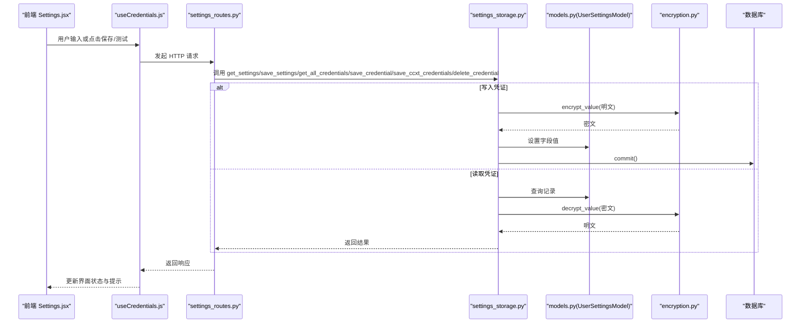
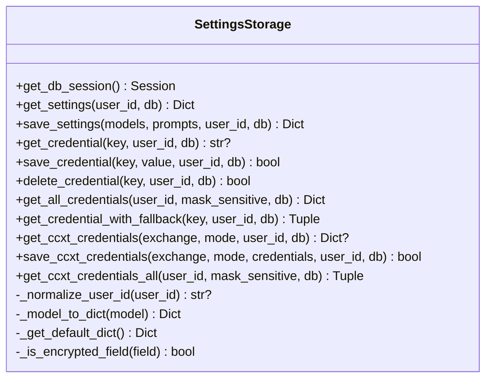
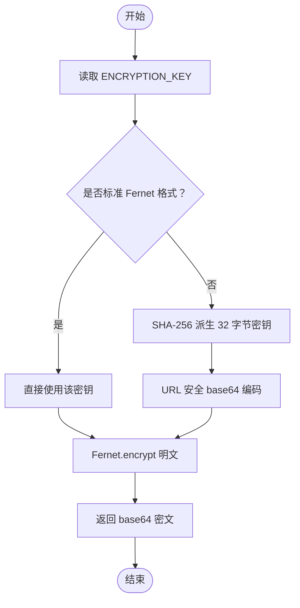
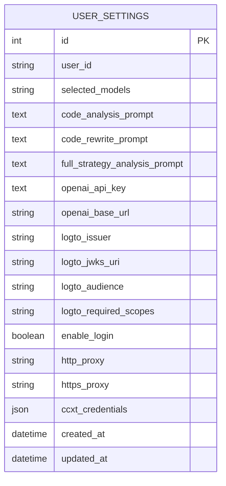
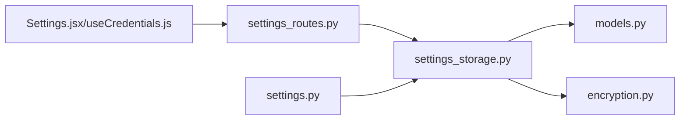

# 用户设置与凭证存储

<cite>
**本文引用的文件**
- [settings_storage.py](file://backend/src/db/settings_storage.py)
- [encryption.py](file://backend/src/utils/encryption.py)
- [models.py](file://backend/src/db/models.py)
- [settings_routes.py](file://backend/src/routes/settings_routes.py)
- [settings.py](file://backend/src/config/settings.py)
- [test_settings_storage.py](file://backend/tests/db/test_settings_storage.py)
- [test_encryption.py](file://backend/tests/utils/test_encryption.py)
- [Settings.jsx](file://frontend/src/pages/Settings.jsx)
- [useCredentials.js](file://frontend/src/hooks/useCredentials.js)
</cite>

## 目录
1. [简介](#简介)
2. [项目结构](#项目结构)
3. [核心组件](#核心组件)
4. [架构总览](#架构总览)
5. [详细组件分析](#详细组件分析)
6. [依赖关系分析](#依赖关系分析)
7. [性能考量](#性能考量)
8. [故障排查指南](#故障排查指南)
9. [结论](#结论)
10. [附录：配置示例与最佳实践](#附录配置示例与最佳实践)

## 简介
本文件系统性文档化后端用户设置与凭证存储模块的安全机制，重点说明 settings_storage.py 如何通过 encryption.py 对敏感信息（如 API 密钥、交易密码等）进行对称加密后再写入数据库，确保静态数据安全。文档覆盖以下关键点：
- get_user_settings、save_credentials、mask_sensitive_data 等核心方法的工作流程
- 密钥管理、加密模式（Fernet/AES-128-CBC/HMAC）、初始化向量处理
- 结合 UserSetting 模型，解释非敏感偏好（如界面主题、默认交易所）与加密凭证的混合存储结构
- 配置示例展示凭证加密解密全过程
- 密钥轮换策略与安全审计日志的最佳实践

## 项目结构
后端采用分层设计：
- 路由层：FastAPI 路由定义用户设置与凭证的读取、更新、测试与重置
- 存储层：SettingsStorage 提供数据库访问与凭证加解密
- 工具层：encryption 提供对称加密、解密与遮罩显示
- 数据模型层：SQLAlchemy UserSettingsModel 定义表结构与字段类型
- 配置层：settings.py 加载环境变量，提供默认数据库路径与服务参数

```mermaid
graph TB
subgraph "路由层"
R["settings_routes.py<br/>FastAPI 路由"]
end
subgraph "存储层"
S["settings_storage.py<br/>SettingsStorage"]
end
subgraph "工具层"
E["encryption.py<br/>Fernet 加密/解密/遮罩"]
end
subgraph "数据模型层"
M["models.py<br/>UserSettingsModel"]
end
subgraph "配置层"
C["settings.py<br/>环境变量加载"]
end
subgraph "前端"
FE["Settings.jsx<br/>设置页面"]
HC["useCredentials.js<br/>凭证钩子"]
end
FE --> HC
HC --> R
R --> S
S --> M
S --> E
C --> S
```

图表来源
- [settings_routes.py](file://backend/src/routes/settings_routes.py#L1-L120)
- [settings_storage.py](file://backend/src/db/settings_storage.py#L1-L120)
- [encryption.py](file://backend/src/utils/encryption.py#L1-L60)
- [models.py](file://backend/src/db/models.py#L611-L683)
- [settings.py](file://backend/src/config/settings.py#L1-L60)
- [Settings.jsx](file://frontend/src/pages/Settings.jsx#L1-L60)
- [useCredentials.js](file://frontend/src/hooks/useCredentials.js#L1-L40)

章节来源
- [settings_routes.py](file://backend/src/routes/settings_routes.py#L1-L120)
- [settings_storage.py](file://backend/src/db/settings_storage.py#L1-L120)
- [encryption.py](file://backend/src/utils/encryption.py#L1-L60)
- [models.py](file://backend/src/db/models.py#L611-L683)
- [settings.py](file://backend/src/config/settings.py#L1-L60)
- [Settings.jsx](file://frontend/src/pages/Settings.jsx#L1-L60)
- [useCredentials.js](file://frontend/src/hooks/useCredentials.js#L1-L40)

## 核心组件
- SettingsStorage：封装用户设置与凭证的持久化操作，负责数据库会话管理、字段映射、凭证加解密与回退策略
- Encryption 工具：提供对称加密/解密与遮罩显示，支持从环境变量读取密钥并自动派生兼容格式
- UserSettingsModel：定义用户设置与凭证的数据库表结构，区分敏感字段与非敏感字段
- FastAPI 路由：对外暴露设置与凭证的 API 接口，统一错误处理与返回格式

章节来源
- [settings_storage.py](file://backend/src/db/settings_storage.py#L52-L120)
- [encryption.py](file://backend/src/utils/encryption.py#L27-L120)
- [models.py](file://backend/src/db/models.py#L611-L683)
- [settings_routes.py](file://backend/src/routes/settings_routes.py#L1-L120)

## 架构总览
下图展示从前端到后端再到数据库与加密工具的整体流程，以及凭证在不同来源之间的优先级与回退策略。

图表来源
- [settings_routes.py](file://backend/src/routes/settings_routes.py#L170-L340)
- [settings_storage.py](file://backend/src/db/settings_storage.py#L270-L764)
- [models.py](file://backend/src/db/models.py#L611-L683)
- [encryption.py](file://backend/src/utils/encryption.py#L79-L137)

## 详细组件分析

### SettingsStorage 类与核心方法
- 初始化与会话管理
  - 通过 init_database 获取引擎与会话工厂，支持 SQLite/WAL 等优化
  - 提供 get_db_session 以确保每个操作独立会话
- 用户设置读取与保存
  - get_settings：按用户 ID 查询记录，不存在则返回默认模板
  - save_settings：创建或更新用户设置记录，字段包含模型列表与提示模板
- 凭证管理
  - get_credential：按键名读取单个凭证，若为敏感字段则解密
  - save_credential：按键名保存凭证，敏感字段先加密再存储
  - delete_credential：删除指定凭证键（设为 NULL）
  - get_all_credentials：聚合 OpenAI、Logto、代理与交易所凭证，支持遮罩与来源标注
  - get_credential_with_fallback：优先数据库，其次 .env，最后 none
  - get_ccxt_credentials / save_ccxt_credentials：针对 CCXT 的 JSON 结构化凭证，按交易所与实盘/模拟模式组织
  - get_ccxt_credentials_all：汇总所有交易所/模式的凭证，支持 env 回退与混合来源标记
- 字段判断与转换
  - _normalize_user_id：匿名用户归一化为 NULL
  - _model_to_dict/_get_default_dict：模型与字典互转
  - _is_encrypted_field：敏感字段白名单（当前仅 openai_api_key）

图表来源
- [settings_storage.py](file://backend/src/db/settings_storage.py#L52-L764)

章节来源
- [settings_storage.py](file://backend/src/db/settings_storage.py#L52-L764)

### Encryption 工具与密钥管理
- 加密模式与实现
  - 使用 Fernet 对称加密（基于 AES-128-CBC，带 HMAC 认证），密文为 base64 编码字符串
  - 初始化向量由库内部管理，无需显式处理
- 密钥来源与派生
  - 从环境变量 ENCRYPTION_KEY 读取密钥
  - 若为标准 Fernet 32 字节 base64 URL 安全格式则直接使用
  - 否则使用 SHA-256 对任意字符串进行派生，再转换为 URL 安全 base64
- 核心函数
  - encrypt_value：加密明文，空值返回 None
  - decrypt_value：解密密文，异常时抛出错误
  - mask_credential：遮罩显示，保留前缀与末尾字符
  - is_encryption_enabled：检查密钥有效性
  - generate_encryption_key：生成新密钥（用于初始化）

图表来源
- [encryption.py](file://backend/src/utils/encryption.py#L27-L120)

章节来源
- [encryption.py](file://backend/src/utils/encryption.py#L27-L120)

### UserSettingsModel 模型与混合存储
- 字段分类
  - 非敏感偏好：selected_models、多条提示模板、代理 URL、启用登录开关等
  - 敏感凭证：openai_api_key（加密）、ccxt_credentials（JSON 内部各字段加密）
- 存储结构
  - 单表存储：同一行同时包含非敏感偏好与敏感凭证
  - JSON 字段：ccxt_credentials 以嵌套字典形式存储，便于扩展不同交易所与模式
- 时间戳审计：created_at/updated_at 支持审计追踪

图表来源
- [models.py](file://backend/src/db/models.py#L611-L683)

章节来源
- [models.py](file://backend/src/db/models.py#L611-L683)

### API 路由与前端交互
- 路由职责
  - GET /settings：读取用户设置
  - PUT /settings：更新用户设置
  - POST /settings/reset：重置为默认
  - GET /settings/credentials：读取所有凭证（含来源与遮罩）
  - PUT /settings/credentials：更新通用凭证（OpenAI、Logto、代理）
  - PUT /settings/credentials/ccxt：更新 CCXT 凭证
  - DELETE /settings/credentials/{key}：删除凭证（回退到 .env）
  - POST /settings/credentials/test：测试凭证有效性
- 前端协作
  - Settings.jsx 展示多个设置区（AI、OpenAI、认证、代理、交易所）
  - useCredentials.js 统一管理凭证状态、保存、测试与重置

章节来源
- [settings_routes.py](file://backend/src/routes/settings_routes.py#L1-L403)
- [Settings.jsx](file://frontend/src/pages/Settings.jsx#L1-L186)
- [useCredentials.js](file://frontend/src/hooks/useCredentials.js#L1-L165)

## 依赖关系分析
- 组件耦合
  - SettingsStorage 依赖 models.py 的 UserSettingsModel 与 init_database
  - SettingsStorage 依赖 encryption.py 的加密/解密/遮罩工具
  - 路由层依赖 SettingsStorage 进行业务编排
- 外部依赖
  - cryptography.Fernet：对称加密与令牌校验
  - SQLAlchemy：ORM 与 JSON 字段处理
  - FastAPI：接口定义与依赖注入

图表来源
- [settings_routes.py](file://backend/src/routes/settings_routes.py#L1-L120)
- [settings_storage.py](file://backend/src/db/settings_storage.py#L1-L120)
- [models.py](file://backend/src/db/models.py#L611-L683)
- [encryption.py](file://backend/src/utils/encryption.py#L1-L60)
- [settings.py](file://backend/src/config/settings.py#L1-L60)

章节来源
- [settings_routes.py](file://backend/src/routes/settings_routes.py#L1-L120)
- [settings_storage.py](file://backend/src/db/settings_storage.py#L1-L120)
- [models.py](file://backend/src/db/models.py#L611-L683)
- [encryption.py](file://backend/src/utils/encryption.py#L1-L60)
- [settings.py](file://backend/src/config/settings.py#L1-L60)

## 性能考量
- 数据库连接池与线程安全
  - init_database 使用缓存避免重复创建引擎与会话工厂
  - SQLite 引擎启用 WAL、PRAGMA 调优以提升并发与可靠性
- JSON 字段变更跟踪
  - 对 ccxt_credentials 使用 flag_modified 显式标记修改，确保嵌套结构持久化正确
- 加密开销
  - Fernet 加密/解密为轻量对称算法，对高频读写影响可忽略
- 前端遮罩与回退
  - 遮罩减少敏感信息泄露风险；回退至 .env 可降低数据库压力

章节来源
- [models.py](file://backend/src/db/models.py#L244-L279)
- [settings_storage.py](file://backend/src/db/settings_storage.py#L670-L680)

## 故障排查指南
- 加密密钥问题
  - 症状：加密/解密失败或 is_encryption_enabled 为 False
  - 排查：确认 ENCRYPTION_KEY 是否设置且格式有效；必要时重新生成密钥
- 凭证读取为空
  - 症状：get_credential 返回 None 或 get_all_credentials 中某字段为 None
  - 排查：检查数据库中对应字段是否已设置；若未设置，确认 .env 是否存在回退值
- CCXT 凭证结构不匹配
  - 症状：读取 CCXT 凭证时报错或返回空
  - 排查：确认 ccxt_credentials 的嵌套结构是否包含目标 exchange/mode；检查字段是否加密
- 权限与来源
  - 症状：前端显示来源为 env 或 mixed
  - 排查：确认 .env 中相关变量是否正确命名与赋值；数据库中对应字段是否为空

章节来源
- [test_encryption.py](file://backend/tests/utils/test_encryption.py#L1-L66)
- [test_settings_storage.py](file://backend/tests/db/test_settings_storage.py#L1-L110)
- [settings_storage.py](file://backend/src/db/settings_storage.py#L442-L512)

## 结论
本模块通过“同一表混合存储 + 对称加密”的方式，在保证非敏感偏好与敏感凭证共存的同时，实现了静态数据的安全保护。SettingsStorage 将业务逻辑与数据访问解耦，encryption 提供强健的密钥管理与遮罩能力，配合路由层与前端交互，形成完整的凭据生命周期管理闭环。建议在生产环境中严格管理 ENCRYPTION_KEY 并建立密钥轮换与审计日志策略，持续提升安全性与可维护性。

## 附录：配置示例与最佳实践

### 凭证加密解密全流程（示例步骤）
- 初始化密钥
  - 在 .env 中设置 ENCRYPTION_KEY（推荐使用 generate_encryption_key 生成）
- 保存凭证
  - 前端调用 PUT /settings/credentials，携带 openai_api_key 等字段
  - 后端 SettingsStorage.save_credential 将敏感字段加密后写入数据库
- 读取凭证
  - 前端调用 GET /settings/credentials
  - 后端 SettingsStorage.get_all_credentials 优先从数据库读取，若无则回退 .env
  - 对敏感字段执行遮罩显示，返回来源标识
- 测试凭证
  - 前端调用 POST /settings/credentials/test，后端使用 credential_validator 校验

章节来源
- [settings_routes.py](file://backend/src/routes/settings_routes.py#L170-L340)
- [settings_storage.py](file://backend/src/db/settings_storage.py#L270-L512)
- [encryption.py](file://backend/src/utils/encryption.py#L79-L137)
- [settings.py](file://backend/src/config/settings.py#L1-L60)

### 密钥轮换策略
- 生成新密钥并部署
  - 使用 generate_encryption_key 生成新密钥，替换 .env 中 ENCRYPTION_KEY
- 渐进迁移
  - 新旧密钥并行期：读取时尝试两种密钥解密，写入统一使用新密钥
  - 迁移完成后清理旧密钥
- 安全加固
  - 限制 ENCRYPTION_KEY 的访问权限（仅部署账户）
  - 使用密钥管理服务（如 KMS）存储与轮换

章节来源
- [encryption.py](file://backend/src/utils/encryption.py#L198-L210)

### 安全审计日志最佳实践
- 记录关键事件
  - 凭证写入/删除、密钥变更、解密失败
- 日志字段建议
  - 时间戳、用户 ID、操作类型、字段名、来源（database/env）、结果状态
- 隐私保护
  - 日志中避免记录完整密文与明文；可用哈希或遮罩替代

章节来源
- [settings_storage.py](file://backend/src/db/settings_storage.py#L88-L112)
- [settings_storage.py](file://backend/src/db/settings_storage.py#L322-L386)
- [settings_storage.py](file://backend/src/db/settings_storage.py#L590-L605)