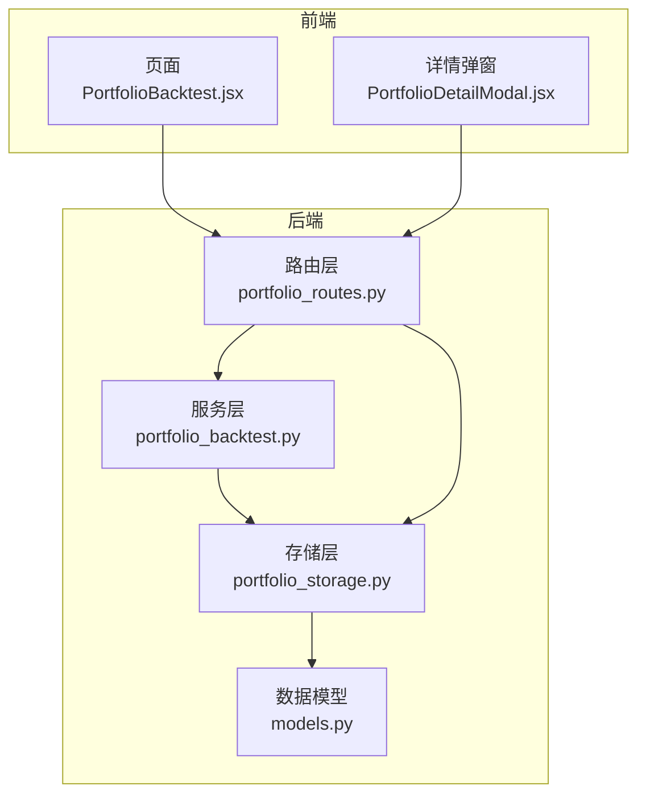
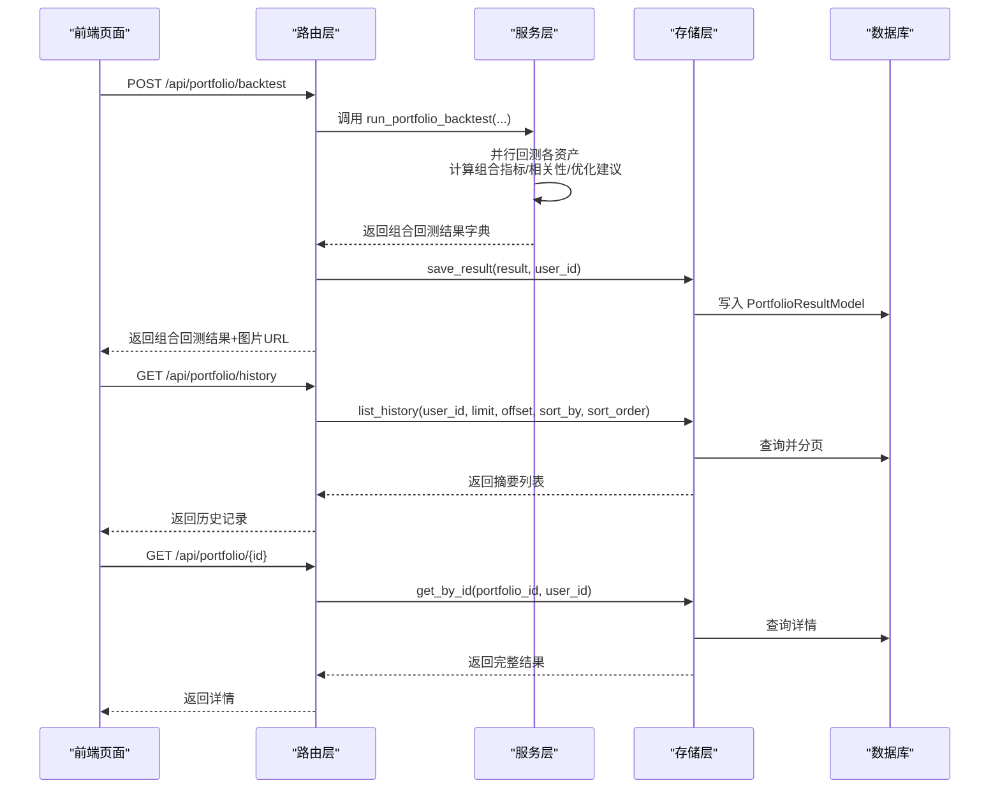
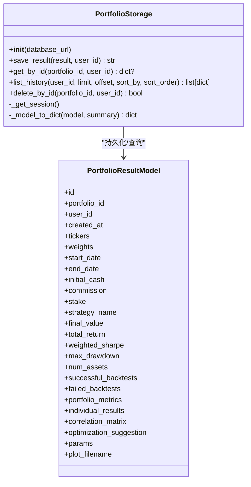
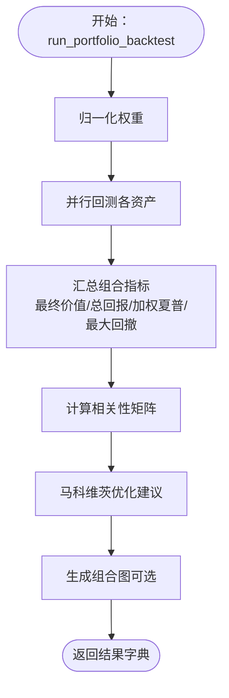
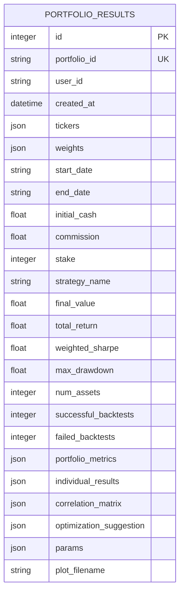
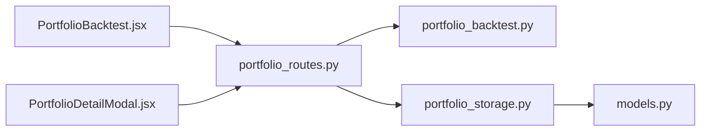

# 组合回测存储服务

<cite>
**本文引用的文件**
- [backend/src/db/portfolio_storage.py](file://backend/src/db/portfolio_storage.py)
- [backend/src/service/portfolio_backtest.py](file://backend/src/service/portfolio_backtest.py)
- [backend/src/db/models.py](file://backend/src/db/models.py)
- [backend/src/routes/portfolio_routes.py](file://backend/src/routes/portfolio_routes.py)
- [backend/tests/service/test_portfolio_backtest.py](file://backend/tests/service/test_portfolio_backtest.py)
- [frontend/src/pages/PortfolioBacktest.jsx](file://frontend/src/pages/PortfolioBacktest.jsx)
- [frontend/src/components/BacktestHistory/PortfolioDetailModal.jsx](file://frontend/src/components/BacktestHistory/PortfolioDetailModal.jsx)
</cite>

## 目录
1. [简介](#简介)
2. [项目结构](#项目结构)
3. [核心组件](#核心组件)
4. [架构总览](#架构总览)
5. [详细组件分析](#详细组件分析)
6. [依赖关系分析](#依赖关系分析)
7. [性能考量](#性能考量)
8. [故障排查指南](#故障排查指南)
9. [结论](#结论)
10. [附录](#附录)

## 简介
本文件围绕组合回测存储服务，系统阐述 portfolio_storage.py 如何支撑多策略组合回测的结果管理，包括组合配置（策略权重、相关性矩阵）、整体绩效指标与各子策略贡献度分析的持久化与查询。重点解释以下方法的实现逻辑与数据落库方式：
- create_portfolio_result：在组合回测完成后将结果写入数据库
- get_composite_performance：从数据库读取组合层面的聚合指标
- calculate_risk_metrics：在组合层面计算风险指标（如最大回撤、加权夏普比率），并确保结果被准确存储

同时，结合 PortfolioResult 模型，阐明时间序列数据与聚合指标的分层存储结构；给出使用案例，展示 portfolio_backtest.py 如何调用该服务保存跨策略分析报告，并讨论高效查询组合历史表现的技术方案。

## 项目结构
组合回测相关的关键文件分布如下：
- 路由层：/backend/src/routes/portfolio_routes.py 提供对外 API，负责请求校验、调用服务层并持久化结果
- 服务层：/backend/src/service/portfolio_backtest.py 实现多资产并行回测、组合指标计算、相关性与优化建议
- 存储层：/backend/src/db/portfolio_storage.py 封装数据库操作，提供保存、查询、删除与分页列表
- 数据模型：/backend/src/db/models.py 定义 PortfolioResultModel 及 JSON 字段类型 SafeJSON
- 前端页面：/frontend/src/pages/PortfolioBacktest.jsx 展示组合回测结果
- 前端详情：/frontend/src/components/BacktestHistory/PortfolioDetailModal.jsx 渲染组合详情与相关性矩阵

图表来源
- [backend/src/routes/portfolio_routes.py](file://backend/src/routes/portfolio_routes.py#L1-L189)
- [backend/src/service/portfolio_backtest.py](file://backend/src/service/portfolio_backtest.py#L1-L499)
- [backend/src/db/portfolio_storage.py](file://backend/src/db/portfolio_storage.py#L1-L239)
- [backend/src/db/models.py](file://backend/src/db/models.py#L347-L408)
- [frontend/src/pages/PortfolioBacktest.jsx](file://frontend/src/pages/PortfolioBacktest.jsx#L359-L506)
- [frontend/src/components/BacktestHistory/PortfolioDetailModal.jsx](file://frontend/src/components/BacktestHistory/PortfolioDetailModal.jsx#L34-L166)

章节来源
- [backend/src/routes/portfolio_routes.py](file://backend/src/routes/portfolio_routes.py#L1-L189)
- [backend/src/service/portfolio_backtest.py](file://backend/src/service/portfolio_backtest.py#L1-L499)
- [backend/src/db/portfolio_storage.py](file://backend/src/db/portfolio_storage.py#L1-L239)
- [backend/src/db/models.py](file://backend/src/db/models.py#L347-L408)
- [frontend/src/pages/PortfolioBacktest.jsx](file://frontend/src/pages/PortfolioBacktest.jsx#L359-L506)
- [frontend/src/components/BacktestHistory/PortfolioDetailModal.jsx](file://frontend/src/components/BacktestHistory/PortfolioDetailModal.jsx#L34-L166)

## 核心组件
- PortfolioStorage：封装数据库连接、保存、查询、分页与删除操作，负责将组合回测结果持久化到 PortfolioResultModel
- PortfolioResultModel：定义组合回测结果的数据库表结构，包含组合配置、聚合指标、完整结果 JSON、相关性矩阵、优化建议等字段
- PortfolioBacktestService：并行执行多资产回测，汇总组合指标，计算相关性矩阵与马科维茨优化建议，并生成组合图
- 路由接口：提供 /api/portfolio/backtest、/api/portfolio/history、/api/portfolio/{id} 等端点，完成用户鉴权、输入校验、调用服务与持久化

章节来源
- [backend/src/db/portfolio_storage.py](file://backend/src/db/portfolio_storage.py#L21-L239)
- [backend/src/db/models.py](file://backend/src/db/models.py#L347-L408)
- [backend/src/service/portfolio_backtest.py](file://backend/src/service/portfolio_backtest.py#L1-L499)
- [backend/src/routes/portfolio_routes.py](file://backend/src/routes/portfolio_routes.py#L1-L189)

## 架构总览
组合回测流程从路由层开始，经服务层并行回测与指标计算，再由存储层持久化到数据库，最后通过路由层返回给前端页面与详情弹窗渲染。

图表来源
- [backend/src/routes/portfolio_routes.py](file://backend/src/routes/portfolio_routes.py#L50-L189)
- [backend/src/service/portfolio_backtest.py](file://backend/src/service/portfolio_backtest.py#L249-L416)
- [backend/src/db/portfolio_storage.py](file://backend/src/db/portfolio_storage.py#L36-L113)

## 详细组件分析

### 组件A：PortfolioStorage（组合回测存储）
- 初始化与会话管理：延迟初始化数据库引擎与会话，支持多线程安全
- 保存结果 save_result：将组合回测结果字典映射到 PortfolioResultModel 的字段，包含组合配置、聚合指标、完整结果 JSON、相关性矩阵、优化建议、参数与图片文件名
- 查询详情 get_by_id：按 portfolio_id 查询，支持 user_id 过滤，返回完整或摘要字典
- 列表查询 list_history：支持 user_id 过滤、排序（默认按创建时间）、分页（limit/offset）
- 删除记录 delete_by_id：按 portfolio_id 删除，支持 user_id 过滤
- 辅助转换 _model_to_dict：将模型实例转为字典，摘要模式不包含完整 JSON 字段

图表来源
- [backend/src/db/portfolio_storage.py](file://backend/src/db/portfolio_storage.py#L21-L239)
- [backend/src/db/models.py](file://backend/src/db/models.py#L347-L408)

章节来源
- [backend/src/db/portfolio_storage.py](file://backend/src/db/portfolio_storage.py#L21-L239)
- [backend/src/db/models.py](file://backend/src/db/models.py#L347-L408)

### 组件B：PortfolioBacktestService（组合回测服务）
- normalize_weights：将输入权重归一化为和为 1 的权重向量
- calculate_correlation_matrix：基于日度收益计算相关性矩阵，缺失数据时返回占位矩阵与错误提示
- calculate_optimal_weights：基于均值-方差优化（最大夏普比率）计算最优权重，失败时回退为等权
- run_portfolio_backtest：并行回测每个资产，汇总组合指标（最终价值、总回报、加权夏普、最大回撤、资产数量、成功/失败次数），生成组合图并返回完整结果字典

图表来源
- [backend/src/service/portfolio_backtest.py](file://backend/src/service/portfolio_backtest.py#L249-L416)

章节来源
- [backend/src/service/portfolio_backtest.py](file://backend/src/service/portfolio_backtest.py#L1-L499)

### 组件C：PortfolioResultModel（数据模型）
- 组合配置字段：tickers、weights、start_date、end_date、initial_cash、commission、stake、strategy_name
- 聚合指标字段：final_value、total_return、weighted_sharpe、max_drawdown、num_assets、successful_backtests、failed_backtests
- 完整结果 JSON 字段：portfolio_metrics、individual_results、correlation_matrix、optimization_suggestion、params
- 图片文件名：plot_filename
- 索引字段：portfolio_id、user_id、created_at、strategy_name、total_return、weighted_sharpe、max_drawdown

图表来源
- [backend/src/db/models.py](file://backend/src/db/models.py#L347-L408)

章节来源
- [backend/src/db/models.py](file://backend/src/db/models.py#L347-L408)

### 组件D：路由层（API 接口）
- POST /api/portfolio/backtest：接收请求体，校验 tickers 与 weights 数量一致，生成图片文件名，调用服务层执行组合回测，保存至数据库并返回结果与图片 URL
- GET /api/portfolio/history：按用户过滤、排序与分页列出组合回测历史摘要
- GET /api/portfolio/{id}：按用户过滤查询组合回测详情
- DELETE /api/portfolio/{id}：按用户过滤删除组合回测记录

章节来源
- [backend/src/routes/portfolio_routes.py](file://backend/src/routes/portfolio_routes.py#L1-L189)

### 方法实现逻辑详解

#### 1) create_portfolio_result（保存组合回测结果）
- 输入：组合回测结果字典（包含 id、tickers、weights、start_date、end_date、strategy_name、portfolio_metrics、individual_results、correlation、optimization、params 等）
- 处理：将字典映射到 PortfolioResultModel 的字段，其中聚合指标字段直接落库以支持快速查询；完整结果以 JSON 字段存储以便后续扩展
- 输出：返回保存后的 portfolio_id

章节来源
- [backend/src/db/portfolio_storage.py](file://backend/src/db/portfolio_storage.py#L36-L86)
- [backend/src/service/portfolio_backtest.py](file://backend/src/service/portfolio_backtest.py#L249-L416)

#### 2) get_composite_performance（获取组合聚合指标）
- 查询：按 portfolio_id 查询 PortfolioResultModel，支持 user_id 过滤
- 返回：摘要模式下返回聚合指标字段；非摘要模式返回完整 JSON 字段（portfolio_metrics、individual_results、correlation、optimization）

章节来源
- [backend/src/db/portfolio_storage.py](file://backend/src/db/portfolio_storage.py#L87-L113)
- [backend/src/db/portfolio_storage.py](file://backend/src/db/portfolio_storage.py#L194-L226)

#### 3) calculate_risk_metrics（组合风险指标计算与存储）
- 计算依据：组合层面的最大回撤（max_drawdown）与加权夏普比率（weighted_sharpe）在服务层已汇总并写入聚合指标字段
- 存储：PortfolioResultModel 中的 max_drawdown、weighted_sharpe 字段用于快速检索与排序
- 注意：当前实现未提供 VaR 计算，若需新增，可在服务层增加计算步骤并将结果写入对应 JSON 字段或新增数据库列

章节来源
- [backend/src/service/portfolio_backtest.py](file://backend/src/service/portfolio_backtest.py#L335-L370)
- [backend/src/db/models.py](file://backend/src/db/models.py#L378-L391)
- [backend/src/db/portfolio_storage.py](file://backend/src/db/portfolio_storage.py#L36-L86)

## 依赖关系分析
- 路由层依赖服务层与存储层：负责鉴权、参数校验、调用服务与持久化
- 服务层依赖数据源与回测引擎：并行回测、相关性与优化计算
- 存储层依赖数据模型：ORM 映射与 JSON 字段处理
- 前端依赖路由层：页面与详情弹窗渲染组合回测结果

图表来源
- [backend/src/routes/portfolio_routes.py](file://backend/src/routes/portfolio_routes.py#L1-L189)
- [backend/src/service/portfolio_backtest.py](file://backend/src/service/portfolio_backtest.py#L1-L499)
- [backend/src/db/portfolio_storage.py](file://backend/src/db/portfolio_storage.py#L1-L239)
- [backend/src/db/models.py](file://backend/src/db/models.py#L347-L408)
- [frontend/src/pages/PortfolioBacktest.jsx](file://frontend/src/pages/PortfolioBacktest.jsx#L359-L506)
- [frontend/src/components/BacktestHistory/PortfolioDetailModal.jsx](file://frontend/src/components/BacktestHistory/PortfolioDetailModal.jsx#L34-L166)

章节来源
- [backend/src/routes/portfolio_routes.py](file://backend/src/routes/portfolio_routes.py#L1-L189)
- [backend/src/service/portfolio_backtest.py](file://backend/src/service/portfolio_backtest.py#L1-L499)
- [backend/src/db/portfolio_storage.py](file://backend/src/db/portfolio_storage.py#L1-L239)
- [backend/src/db/models.py](file://backend/src/db/models.py#L347-L408)
- [frontend/src/pages/PortfolioBacktest.jsx](file://frontend/src/pages/PortfolioBacktest.jsx#L359-L506)
- [frontend/src/components/BacktestHistory/PortfolioDetailModal.jsx](file://frontend/src/components/BacktestHistory/PortfolioDetailModal.jsx#L34-L166)

## 性能考量
- 并行回测：服务层使用线程池并行执行各资产回测，减少总耗时
- 数据库索引：PortfolioResultModel 对 portfolio_id、user_id、created_at、strategy_name、total_return、weighted_sharpe、max_drawdown 建立索引，提升查询与排序效率
- JSON 字段：使用 SafeJSON 类型，避免空值与异常解析问题，同时支持灵活扩展
- 分页与排序：路由层支持 limit/offset 与排序字段选择，避免一次性加载大量历史记录
- 缓存与连接：数据库连接池与连接预检查，减少连接开销

章节来源
- [backend/src/service/portfolio_backtest.py](file://backend/src/service/portfolio_backtest.py#L299-L324)
- [backend/src/db/models.py](file://backend/src/db/models.py#L347-L408)
- [backend/src/db/portfolio_storage.py](file://backend/src/db/portfolio_storage.py#L1-L239)

## 故障排查指南
- 权重归一化错误：当权重之和小于等于 0 时抛出异常，检查输入权重是否合法
- 数据不足导致相关性/优化失败：当某资产数据缺失或样本过少时，返回占位矩阵或等权建议，检查数据源与时间范围
- 数据库写入失败：捕获异常并回滚事务，查看日志定位具体原因
- 前端字段差异：前端兼容后端返回的字段命名（如 return/sharpe/drawdown），避免因字段不一致导致渲染异常

章节来源
- [backend/src/service/portfolio_backtest.py](file://backend/src/service/portfolio_backtest.py#L38-L51)
- [backend/src/service/portfolio_backtest.py](file://backend/src/service/portfolio_backtest.py#L70-L101)
- [backend/src/service/portfolio_backtest.py](file://backend/src/service/portfolio_backtest.py#L103-L206)
- [backend/src/db/portfolio_storage.py](file://backend/src/db/portfolio_storage.py#L36-L86)
- [frontend/src/components/BacktestHistory/PortfolioDetailModal.jsx](file://frontend/src/components/BacktestHistory/PortfolioDetailModal.jsx#L68-L98)

## 结论
PortfolioStorage 通过 PortfolioResultModel 将组合回测的配置、聚合指标与完整结果以分层结构持久化，既满足快速查询（聚合指标字段）又保留扩展空间（JSON 字段）。PortfolioBacktestService 在服务层完成并行回测、相关性与优化计算，并将结果交由路由层保存与返回。前端页面与详情弹窗基于统一的数据结构进行渲染，形成闭环的组合回测体验。当前实现已覆盖最大回撤与加权夏普等关键风险指标，若需进一步引入 VaR 等指标，可在服务层扩展并在存储层补充相应字段或 JSON 字段。

## 附录

### 使用案例：portfolio_backtest.py 如何调用存储服务
- 步骤：
  1) 路由层接收请求，校验参数并生成图片文件名
  2) 调用服务层 run_portfolio_backtest，得到组合回测结果字典
  3) 路由层将结果字典与图片文件名传入存储层 save_result
  4) 存储层写入数据库并返回 portfolio_id
  5) 路由层返回包含图片 URL 的结果给前端

章节来源
- [backend/src/routes/portfolio_routes.py](file://backend/src/routes/portfolio_routes.py#L50-L109)
- [backend/src/service/portfolio_backtest.py](file://backend/src/service/portfolio_backtest.py#L249-L416)
- [backend/src/db/portfolio_storage.py](file://backend/src/db/portfolio_storage.py#L36-L86)

### 高效查询组合历史的技术方案
- 索引策略：对 user_id、created_at、strategy_name、total_return、weighted_sharpe、max_drawdown 建立索引，加速分页与排序
- 分页与排序：路由层支持 limit/offset 与排序字段，避免全量扫描
- 摘要与详情分离：list_history 返回摘要字段，get_by_id 返回完整 JSON，降低网络传输与解析成本
- 前端缓存：页面与详情弹窗可缓存最近查询结果，减少重复请求

章节来源
- [backend/src/db/models.py](file://backend/src/db/models.py#L347-L408)
- [backend/src/db/portfolio_storage.py](file://backend/src/db/portfolio_storage.py#L114-L159)
- [backend/src/routes/portfolio_routes.py](file://backend/src/routes/portfolio_routes.py#L111-L141)