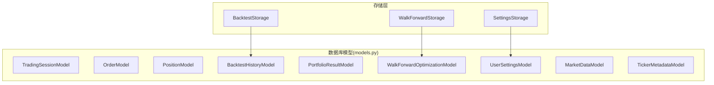
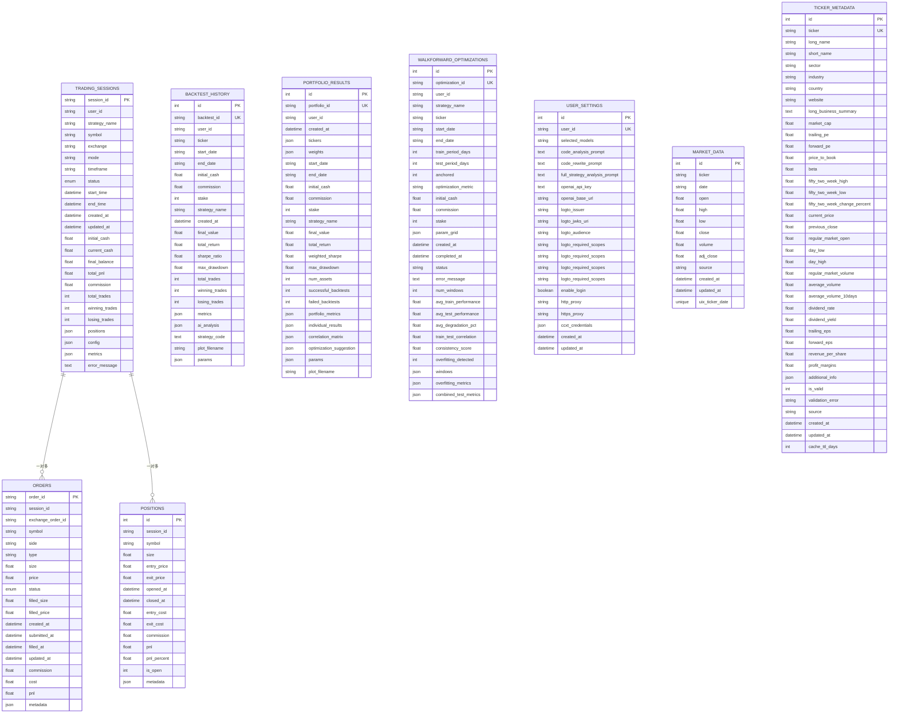
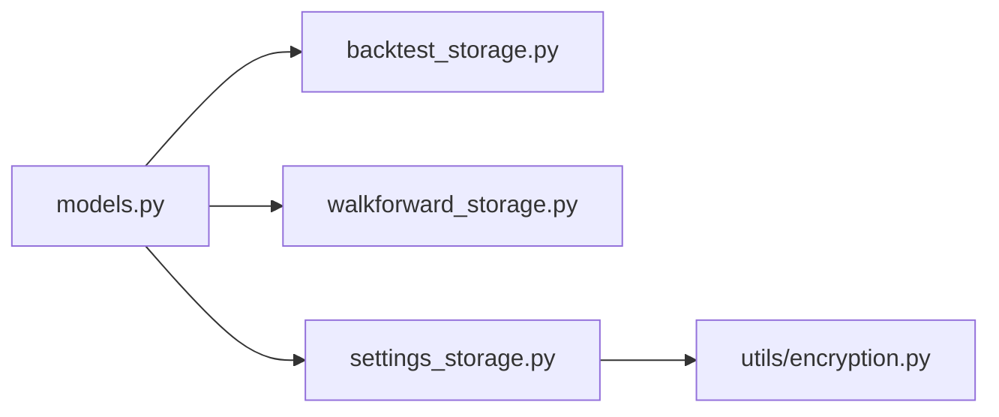

# 数据库模型

<cite>
**本文引用的文件**
- [models.py](file://backend/src/db/models.py)
- [db.md](file://backend/src/db/db.md)
- [backtest_storage.py](file://backend/src/db/backtest_storage.py)
- [walkforward_storage.py](file://backend/src/db/walkforward_storage.py)
- [settings_storage.py](file://backend/src/db/settings_storage.py)
- [test_models.py](file://backend/tests/db/test_models.py)
</cite>

## 目录
1. [简介](#简介)
2. [项目结构](#项目结构)
3. [核心组件](#核心组件)
4. [架构总览](#架构总览)
5. [详细组件分析](#详细组件分析)
6. [依赖关系分析](#依赖关系分析)
7. [性能考量](#性能考量)
8. [故障排查指南](#故障排查指南)
9. [结论](#结论)
10. [附录](#附录)

## 简介
本文件聚焦于 backend/src/db/models.py 中定义的 SQLAlchemy ORM 实体，系统梳理 BacktestResult、TradingSession、UserSetting、WalkforwardResult、PortfolioResult 等核心模型的字段类型、主外键关系、索引配置与约束条件，并解释模型设计背后的业务逻辑（如会话状态机、回测结果的版本化思路、用户设置的加密字段处理）。结合 db.md 的设计原则，说明如何通过继承 Base 类实现声明式建模，以及使用 JSON 类型字段存储策略参数与回测指标的灵活性。文末提供 ER 图、创建新模型的规范流程、典型查询与事务示例路径，以及常见陷阱与规避建议。

## 项目结构
- 模型层位于 backend/src/db/models.py，统一定义所有 ORM 实体与基础工具（Base、SafeJSON、枚举、初始化函数）。
- 存储层位于 backend/src/db 下的各模块（如 backtest_storage.py、walkforward_storage.py、settings_storage.py），封装对模型的增删改查与业务流程。
- 设计原则与约定见 backend/src/db/db.md，强调“DB 层不写业务流程”“敏感数据加密存储”“向后兼容/迁移”等。

图表来源
- [models.py](file://backend/src/db/models.py#L82-L683)
- [backtest_storage.py](file://backend/src/db/backtest_storage.py#L1-L120)
- [walkforward_storage.py](file://backend/src/db/walkforward_storage.py#L1-L120)
- [settings_storage.py](file://backend/src/db/settings_storage.py#L1-L120)

章节来源
- [models.py](file://backend/src/db/models.py#L1-L120)
- [db.md](file://backend/src/db/db.md#L1-L23)

## 核心组件
本节从字段类型、主外键、索引与约束、默认值与触发器等方面，逐项解析关键模型。

- TradingSessionModel（交易会话）
  - 主键：session_id（字符串，长度 36，索引）
  - 用户标识：user_id（可空，索引）
  - 配置字段：strategy_name、symbol、exchange、mode、timeframe（索引）
  - 状态：status（枚举，索引）
  - 时间戳：start_time、end_time、created_at、updated_at（默认值与 onupdate）
  - 财务指标：initial_cash、current_cash、final_balance、total_pnl、commission
  - 统计指标：total_trades、winning_trades、losing_trades
  - JSON 字段：positions、config、metrics
  - 错误信息：error_message（文本）

- OrderModel（订单）
  - 主键：order_id（字符串，索引）
  - 外键：session_id（字符串，索引）
  - 交易所订单号：exchange_order_id（可空，索引）
  - 订单详情：symbol、side、type、size、price（可空）
  - 状态：status（枚举，索引）
  - 成交细节：filled_size、filled_price（可空）
  - 时间戳：created_at、submitted_at、filled_at、updated_at（默认值与 onupdate）
  - 财务：commission、cost（可空）、pnl（可空）
  - 扩展：metadata_json（JSON）

- PositionModel（持仓）
  - 主键：id（自增整数）
  - 外键：session_id（字符串，索引）
  - 持仓详情：symbol（索引）、size（正多负空）、entry_price、exit_price（可空）
  - 时间戳：opened_at、closed_at（可空）
  - 财务：entry_cost、exit_cost（可空）、commission、pnl、pnl_percent（可空）
  - 状态：is_open（整数，1/0，索引）
  - 扩展：metadata_json（JSON）

- BacktestHistoryModel（回测历史）
  - 主键：id（自增整数）
  - 唯一标识：backtest_id（唯一，索引）
  - 用户标识：user_id（可空，索引）
  - 配置：ticker、start_date、end_date、initial_cash、commission、stake、strategy_name（索引）
  - 时间戳：created_at（索引）
  - 指标：final_value、total_return（索引）、sharpe_ratio（索引）、max_drawdown、total_trades、winning_trades、losing_trades
  - JSON：metrics（完整指标）、ai_analysis（可空）、strategy_code（可空）、params（可空）
  - 图表：plot_filename（可空）

- PortfolioResultModel（组合回测结果）
  - 主键：id（自增整数）
  - 唯一标识：portfolio_id（唯一，索引）
  - 用户标识：user_id（可空，索引）
  - 时间戳：created_at（索引）
  - 组合配置：tickers、weights（JSON）、start_date、end_date、initial_cash、commission、stake、strategy_name（索引）
  - 汇总指标：final_value、total_return（索引）、weighted_sharpe（索引）、max_drawdown、num_assets、successful_backtests、failed_backtests
  - 结果：portfolio_metrics、individual_results、correlation_matrix、optimization_suggestion（JSON）
  - 参数：params（JSON）
  - 图表：plot_filename（可空）

- WalkForwardOptimizationModel（Walk-Forward 优化）
  - 主键：id（自增整数）
  - 唯一标识：optimization_id（唯一，索引）
  - 用户标识：user_id（可空，索引）
  - 配置：strategy_name（索引）、ticker（索引）、start_date、end_date
  - 窗口配置：train_period_days、test_period_days、anchored、optimization_metric
  - 回测配置：initial_cash、commission、stake
  - 参数网格：param_grid（JSON）
  - 时间戳：created_at（索引）、completed_at（可空）
  - 状态：status（字符串，索引）、error_message（可空）
  - 摘要指标：num_windows、avg_train_performance、avg_test_performance、avg_degradation_pct、train_test_correlation、consistency_score、overfitting_detected
  - 结果：windows（JSON）、overfitting_metrics（JSON）、combined_test_metrics（JSON）

- UserSettingsModel（用户设置）
  - 主键：id（自增整数）
  - 用户标识：user_id（可空，唯一，索引）
  - AI 模型：selected_models（字符串，逗号分隔）
  - 提示模板：code_analysis_prompt、code_rewrite_prompt、full_strategy_analysis_prompt（文本）
  - 凭证（加密存储）：openai_api_key（加密，文本）、openai_base_url（明文，字符串）
  - 登录配置：logto_issuer、logto_jwks_uri、logto_audience、logto_required_scopes（明文，字符串）、enable_login（布尔）
  - 代理：http_proxy、https_proxy（字符串）
  - 交易所凭据：ccxt_credentials（JSON，嵌套结构，按 exchange/mode 存放）
  - 时间戳：created_at、updated_at（索引）

- MarketDataModel（行情缓存）
  - 主键：id（自增整数）
  - 标识：ticker（索引）、date（YYYY-MM-DD，索引）
  - K 线：open、high、low、close、volume、adj_close（可空）
  - 元数据：source（默认 yfinance）、created_at、updated_at
  - 约束：UniqueConstraint(ticker, date)

- TickerMetadataModel（股票元数据缓存）
  - 主键：id（自增整数）
  - 标识：ticker（唯一，索引）
  - 基本信息：long_name、short_name、sector、industry、country、website、long_business_summary（文本）
  - 市场指标：market_cap、trailing_pe、forward_pe、price_to_book、beta、52 周高/低/涨跌幅
  - 交易统计：current_price、previous_close、open、day_low/high、volume、平均成交量
  - 财务指标：dividend_rate、dividend_yield、trailing_eps、forward_eps、revenue_per_share、profit_margins
  - 扩展：additional_info（JSON）
  - 校验：is_valid（1/0）、validation_error（字符串）
  - 缓存：source（默认 yfinance）、created_at、updated_at、cache_ttl_days（默认 7）

章节来源
- [models.py](file://backend/src/db/models.py#L82-L683)

## 架构总览
下图展示核心模型之间的关系与业务含义。TradingSessionModel 与 OrderModel/PositionModel 为一对多关系；BacktestHistoryModel、PortfolioResultModel、WalkForwardOptimizationModel 分别承载不同类型的回测/优化结果；UserSettingsModel 与凭证加密机制配合；MarketDataModel/TickerMetadataModel 提供数据缓存能力。

图表来源
- [models.py](file://backend/src/db/models.py#L82-L683)

## 详细组件分析

### 会话状态机（TradingSessionModel）
- 状态枚举：STARTING、RUNNING、STOPPING、STOPPED、ERROR
- 业务逻辑要点：
  - 会话开始时设置 start_time，结束时设置 end_time
  - 运行中持续更新 updated_at，便于监控
  - positions/config/metrics 使用 JSON 字段保存动态结构，便于扩展
- 查询与事务建议：
  - 按 status、symbol、exchange、user_id 等维度过滤
  - 使用事务包裹状态切换与指标更新，确保一致性

章节来源
- [models.py](file://backend/src/db/models.py#L82-L140)

### 订单与持仓（OrderModel/PositionModel）
- 关系：一个会话可包含多个订单与多个持仓
- 订单状态：CREATED、SUBMITTED、ACCEPTED、PARTIAL、FILLED、CANCELED、REJECTED
- 持仓状态：is_open 以 1/0 表示开仓/平仓
- 性能建议：
  - 对 session_id、symbol、status 建立索引
  - 使用批量插入/更新减少往返

章节来源
- [models.py](file://backend/src/db/models.py#L142-L239)

### 回测历史（BacktestHistoryModel）
- 版本化思路：
  - backtest_id 唯一标识一次运行，metrics/ai_analysis/strategy_code/params 作为“快照”
  - created_at 用于排序与清理
- 清理策略：
  - BacktestStorage 内置最大记录数限制与自动清理逻辑
- 查询建议：
  - 按 ticker、strategy_name、时间范围过滤
  - 对 total_return、sharpe_ratio 建立索引以加速排序

章节来源
- [models.py](file://backend/src/db/models.py#L282-L345)
- [backtest_storage.py](file://backend/src/db/backtest_storage.py#L1-L120)

### 组合回测（PortfolioResultModel）
- 字段设计：
  - tickers/weights 以 JSON 存储，便于灵活表达权重分配
  - 汇总指标（total_return、weighted_sharpe、max_drawdown 等）便于快速筛选
- 使用建议：
  - 读取时注意 JSON 解析失败的兜底处理
  - 更新时尽量使用 denormalized 字段提升查询效率

章节来源
- [models.py](file://backend/src/db/models.py#L347-L408)

### Walk-Forward 优化（WalkForwardOptimizationModel）
- 状态机：pending/running/completed/failed
- overfitting 检测：
  - avg_degradation_pct、train_test_correlation、consistency_score、overfitting_detected
- 结果存储：
  - windows、overfitting_metrics、combined_test_metrics 采用 JSON 存储复杂结构
- 查询建议：
  - 按 status、strategy_name、ticker、created_at 排序
  - 对 anchored、optimization_metric 建立索引

章节来源
- [models.py](file://backend/src/db/models.py#L409-L482)
- [walkforward_storage.py](file://backend/src/db/walkforward_storage.py#L1-L120)

### 用户设置与凭证（UserSettingsModel）
- 加密策略：
  - openai_api_key 使用加密存储，其他字段明文
  - ccxt_credentials 以 JSON 结构存放，按 exchange/mode 存放加密凭据
- 访问流程：
  - SettingsStorage 提供 get/save/reset/credential 管理方法
  - 支持从环境变量回退，增强部署灵活性
- 安全建议：
  - 仅对敏感字段执行加密/解密
  - JSON 字段变更后显式标记修改，避免 ORM 无法感知

章节来源
- [models.py](file://backend/src/db/models.py#L611-L683)
- [settings_storage.py](file://backend/src/db/settings_storage.py#L1-L200)

### JSON 类型与 SafeJSON（通用）
- SafeJSON：
  - 统一处理 None/空字符串/非法 JSON 的边界情况
  - 在绑定与结果转换时保证类型一致性
- 使用建议：
  - 对所有 JSON 字段统一使用 SafeJSON 或 JSON（视是否需要严格空值处理）
  - 避免在 ORM 层直接拼接 JSON 字符串，优先使用字典/列表

章节来源
- [models.py](file://backend/src/db/models.py#L42-L61)
- [test_models.py](file://backend/tests/db/test_models.py#L1-L28)

### 初始化与连接（init_database）
- 功能：
  - 创建引擎、启用 WAL、foreign_keys、pool_pre_ping
  - 缓存引擎与 SessionLocal，避免重复初始化
- SQLite 特性：
  - 设置 check_same_thread=False 以便多线程使用
- 使用建议：
  - 在应用启动时调用一次，后续复用返回的 SessionLocal
  - 通过 echo 参数调试 SQL

章节来源
- [models.py](file://backend/src/db/models.py#L244-L280)

## 依赖关系分析
- 模型依赖：
  - BacktestStorage 依赖 BacktestHistoryModel
  - WalkForwardStorage 依赖 WalkForwardOptimizationModel
  - SettingsStorage 依赖 UserSettingsModel
- 外部依赖：
  - SQLAlchemy（Base、Column、Enum、JSON、TypeDecorator、UniqueConstraint、event）
  - utils/encryption（加密/解密工具）
- 循环依赖规避：
  - 存储层通过字符串导入模型，避免直接循环引用

图表来源
- [models.py](file://backend/src/db/models.py#L1-L120)
- [backtest_storage.py](file://backend/src/db/backtest_storage.py#L1-L60)
- [walkforward_storage.py](file://backend/src/db/walkforward_storage.py#L1-L60)
- [settings_storage.py](file://backend/src/db/settings_storage.py#L1-L60)

章节来源
- [models.py](file://backend/src/db/models.py#L1-L120)
- [backtest_storage.py](file://backend/src/db/backtest_storage.py#L1-L60)
- [walkforward_storage.py](file://backend/src/db/walkforward_storage.py#L1-L60)
- [settings_storage.py](file://backend/src/db/settings_storage.py#L1-L60)

## 性能考量
- 索引策略：
  - 高频过滤字段建立索引：status、symbol、exchange、ticker、date、user_id、strategy_name、created_at
  - 对排序字段（total_return、sharpe_ratio、weighted_sharpe）建立索引
- JSON 字段：
  - 仅在必要时使用 JSON；对常用字段建立 denormalized 字段以提升查询性能
- 连接与缓存：
  - init_database 缓存引擎与 SessionLocal，减少重复创建
  - SQLite 启用 WAL、foreign_keys、synchronous/NORMAL、temp_store=MEMORY
- 批量操作：
  - 使用批量插入/更新减少往返次数

[本节为通用指导，无需列出具体文件来源]

## 故障排查指南
- JSON 解析异常：
  - SafeJSON 已处理 None/空字符串/非法 JSON，若仍报错，检查存储层是否正确序列化/反序列化
  - 参考测试用例验证行为
- 会话状态不一致：
  - 确保状态切换在单事务内完成，避免并发写入导致状态错乱
- 凭证读取为空：
  - 检查 SettingsStorage 是否回退到环境变量
  - 确认加密字段已正确加密/解密
- SQLite 线程问题：
  - 使用 init_database 返回的 SessionLocal，避免跨线程共享同一 Session
- 数据清理失败：
  - BacktestStorage 的自动清理会删除过期记录与图片文件，若失败需检查权限与路径

章节来源
- [test_models.py](file://backend/tests/db/test_models.py#L1-L28)
- [settings_storage.py](file://backend/src/db/settings_storage.py#L437-L759)
- [backtest_storage.py](file://backend/src/db/backtest_storage.py#L118-L183)

## 结论
该模型体系以声明式建模为核心，围绕“会话-订单-持仓”与“回测/优化/用户设置”两条主线展开，辅以 JSON 字段与 denormalized 指标提升灵活性与查询效率。遵循 db.md 的设计原则，DB 层专注数据定义与访问，业务逻辑由上层服务层承接。通过 SafeJSON、枚举、索引与事务管理，系统在易用性与性能之间取得平衡。

[本节为总结，无需列出具体文件来源]

## 附录

### 创建新模型的规范流程
- 选择命名与职责：
  - 以名词短语命名（如 BacktestHistoryModel），明确领域职责
- 继承 Base 并定义字段：
  - 明确主键、外键、索引、默认值、约束
  - 对复杂结构使用 JSON 字段，必要时提供 denormalized 字段
- 枚举与常量：
  - 将状态/类型定义为枚举，集中管理
- 初始化与连接：
  - 在 models.py 中定义 Base，提供 init_database 工具函数
- 存储层对接：
  - 在 backend/src/db 下新增 storage 模块，封装 CRUD 与业务流程
  - 在路由层调用 storage，避免直接操作 ORM
- 测试与验证：
  - 编写单元测试覆盖字段序列化/反序列化、索引命中、事务一致性

章节来源
- [models.py](file://backend/src/db/models.py#L1-L120)
- [db.md](file://backend/src/db/db.md#L1-L23)

### 示例：模型查询、关联加载与事务操作（路径指引）
- 会话状态查询与更新（路径）
  - 查询：按 status/symbol/user_id 过滤
  - 更新：在单事务内更新 status、updated_at、财务指标
  - 参考路径：[models.py](file://backend/src/db/models.py#L82-L140)
- 回测结果查询与清理（路径）
  - 列表：按 ticker、strategy_name、created_at 排序
  - 清理：超过阈值的历史记录与图片文件
  - 参考路径：[backtest_storage.py](file://backend/src/db/backtest_storage.py#L184-L268)
- Walk-Forward 状态与结果更新（路径）
  - 状态：pending/running/completed/failed
  - 结果：windows、overfitting_metrics、combined_test_metrics
  - 参考路径：[walkforward_storage.py](file://backend/src/db/walkforward_storage.py#L114-L237)
- 用户设置与凭证管理（路径）
  - 读取/保存/重置/删除
  - 凭证加密/解密与环境变量回退
  - 参考路径：[settings_storage.py](file://backend/src/db/settings_storage.py#L68-L232)

### 常见陷阱与规避
- ORM 对象生命周期：
  - 避免跨线程共享 Session；每个线程/协程使用独立 Session
  - 长事务可能导致锁竞争，尽量缩短事务范围
- 会话边界问题：
  - 会话状态切换必须在事务内完成，防止中间态
- JSON 字段变更：
  - 对 JSON 字段做嵌套修改后，显式标记修改（如使用 flag_modified），否则 ORM 可能无法检测变更
- 索引缺失：
  - 高频过滤/排序字段未建索引会导致查询缓慢

章节来源
- [models.py](file://backend/src/db/models.py#L244-L280)
- [settings_storage.py](file://backend/src/db/settings_storage.py#L601-L700)