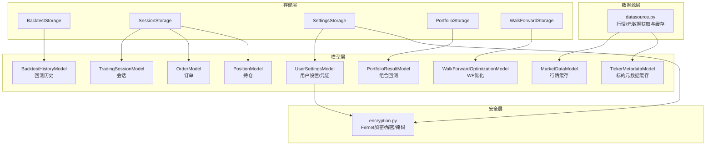
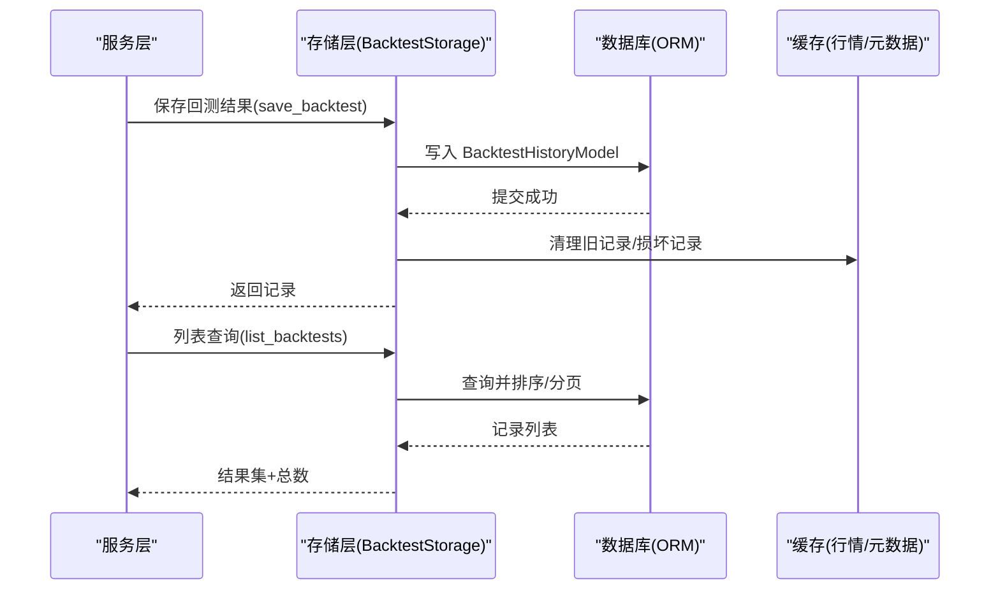
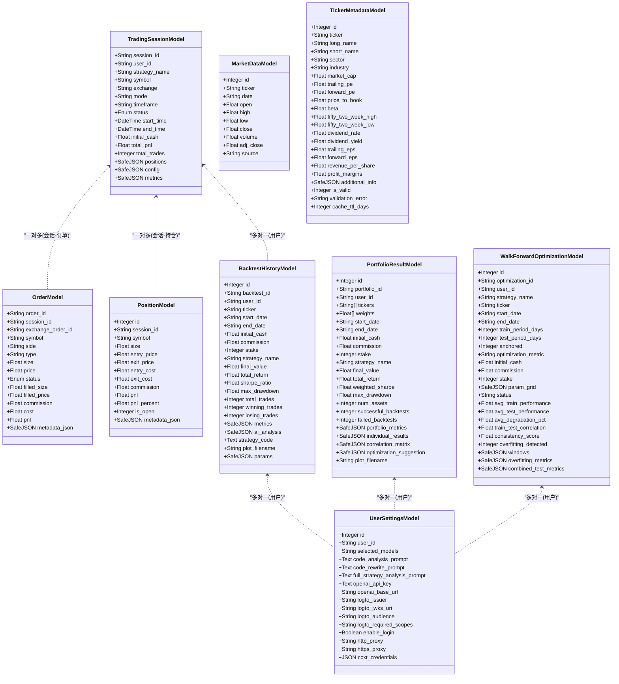
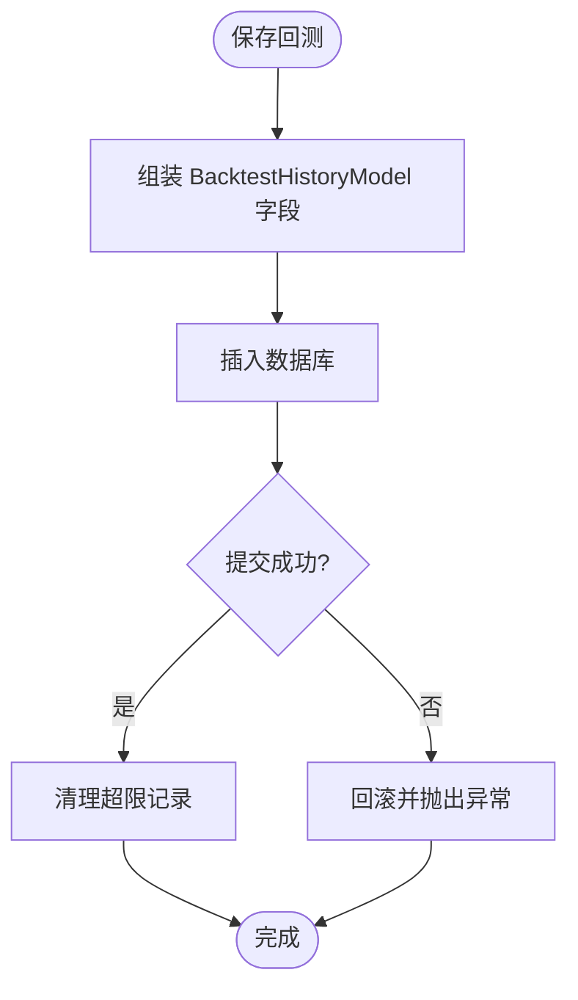
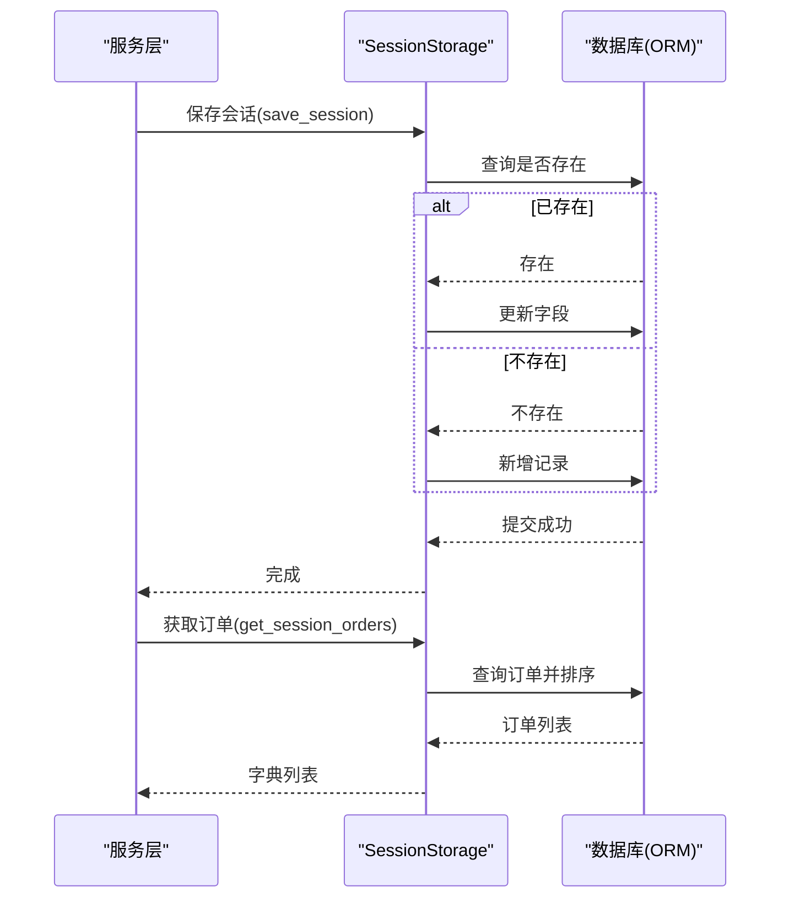
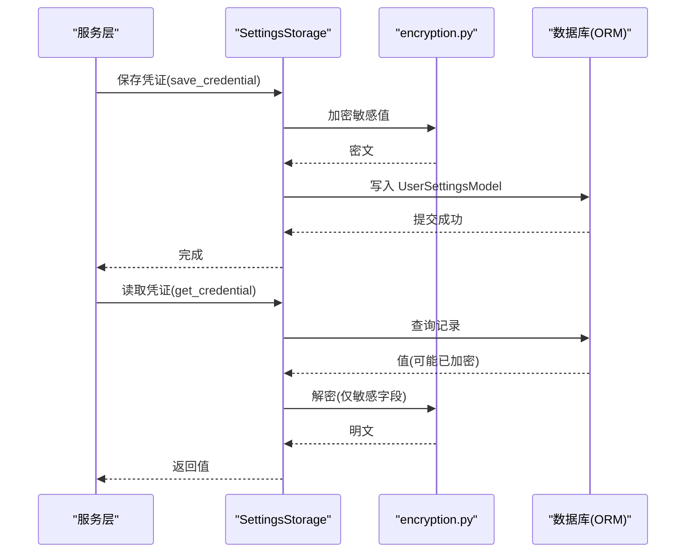
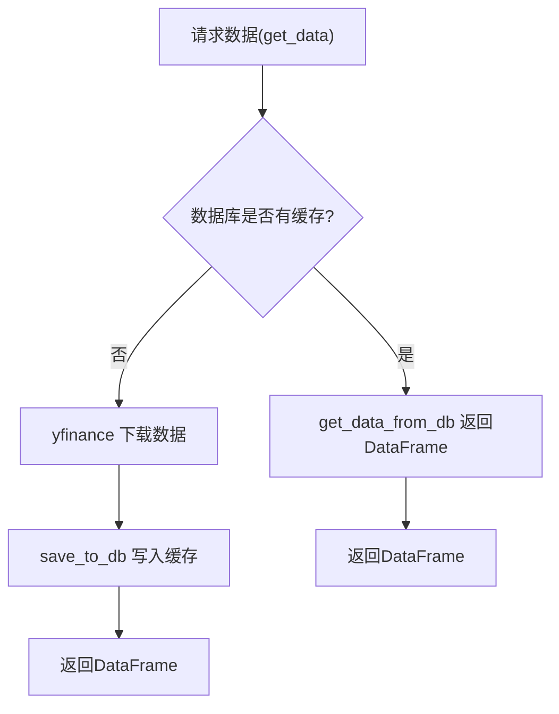
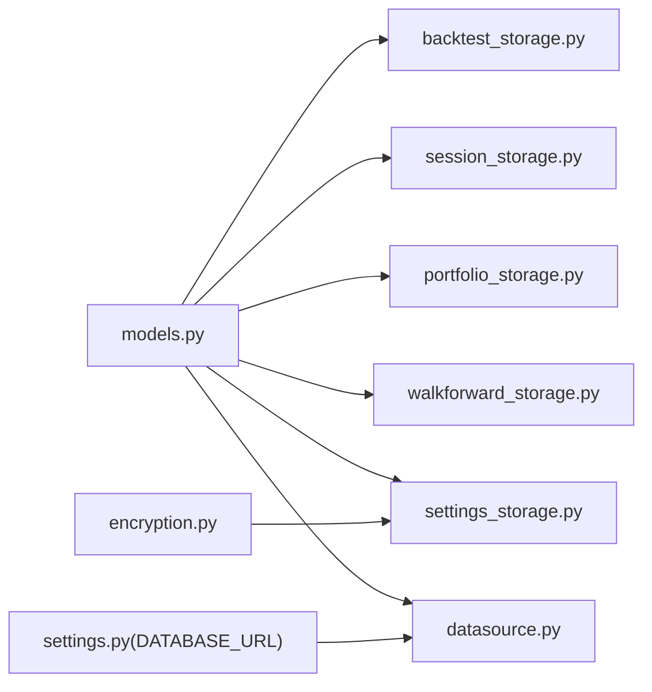

# 数据模型与持久化

<cite>
**本文引用的文件**
- [models.py](file://backend/src/db/models.py)
- [db.md](file://backend/src/db/db.md)
- [backtest_storage.py](file://backend/src/db/backtest_storage.py)
- [session_storage.py](file://backend/src/db/session_storage.py)
- [datasource.py](file://backend/src/db/datasource.py)
- [settings_storage.py](file://backend/src/db/settings_storage.py)
- [encryption.py](file://backend/src/utils/encryption.py)
- [portfolio_storage.py](file://backend/src/db/portfolio_storage.py)
- [walkforward_storage.py](file://backend/src/db/walkforward_storage.py)
- [test_models.py](file://backend/tests/db/test_models.py)
- [test_backtest_storage.py](file://backend/tests/db/test_backtest_storage.py)
</cite>

## 目录
1. [简介](#简介)
2. [项目结构](#项目结构)
3. [核心组件](#核心组件)
4. [架构总览](#架构总览)
5. [详细组件分析](#详细组件分析)
6. [依赖分析](#依赖分析)
7. [性能考量](#性能考量)
8. [故障排查指南](#故障排查指南)
9. [结论](#结论)
10. [附录](#附录)

## 简介
本文件围绕后端数据库与持久化层，系统性梳理数据模型、存储模块、数据源抽象、加密集成与事务管理策略。重点覆盖以下内容：
- 基于 SQLAlchemy 的 ORM 实体设计与索引策略
- 各存储模块（回测、会话、设置、组合、WF 优化）的职责与接口
- 历史数据访问抽象（datasource）与缓存策略
- 安全存储与敏感数据处理（加密模块集成）
- 关键查询性能分析、事务管理与常见问题排查

## 项目结构
db 目录承担数据模型与持久化职责，采用“模型定义 + 存储封装 + 数据源抽象”的分层设计：
- 模型层：models.py 定义所有 ORM 实体及初始化工具
- 存储层：backtest_storage、session_storage、settings_storage、portfolio_storage、walkforward_storage 提供领域特定的 CRUD 与查询
- 数据源层：datasource.py 抽象历史数据获取与缓存
- 安全层：encryption.py 提供对称加密与掩码工具，settings_storage 集成敏感字段加密

图表来源
- [models.py](file://backend/src/db/models.py#L82-L683)
- [backtest_storage.py](file://backend/src/db/backtest_storage.py#L22-L446)
- [session_storage.py](file://backend/src/db/session_storage.py#L27-L392)
- [datasource.py](file://backend/src/db/datasource.py#L1-L551)
- [settings_storage.py](file://backend/src/db/settings_storage.py#L1-L759)
- [encryption.py](file://backend/src/utils/encryption.py#L1-L218)
- [portfolio_storage.py](file://backend/src/db/portfolio_storage.py#L1-L239)
- [walkforward_storage.py](file://backend/src/db/walkforward_storage.py#L1-L426)

章节来源
- [db.md](file://backend/src/db/db.md#L1-L23)

## 核心组件
- 数据模型与初始化
  - 声明式基类与类型装饰器：使用 declarative_base 构建模型；自定义 SafeJSON 处理 JSON 字段空值与异常
  - 初始化函数 init_database：连接池预检、SQLite 特定 PRAGMA 设置、表创建、线程安全缓存
- 会话与交易数据
  - TradingSessionModel、OrderModel、PositionModel 支持实盘/模拟盘会话、订单与持仓的持久化
- 回测与组合/优化
  - BacktestHistoryModel、PortfolioResultModel、WalkForwardOptimizationModel 分别承载回测、组合回测与 WF 优化结果
- 历史数据与元数据
  - MarketDataModel、TickerMetadataModel 缓存 yfinance 数据与元信息，减少外部 API 调用
- 用户设置与凭证
  - UserSettingsModel 存储用户偏好与敏感配置；settings_storage 集成加密与环境变量回退

章节来源
- [models.py](file://backend/src/db/models.py#L244-L279)
- [models.py](file://backend/src/db/models.py#L42-L60)
- [models.py](file://backend/src/db/models.py#L82-L239)
- [models.py](file://backend/src/db/models.py#L282-L482)
- [models.py](file://backend/src/db/models.py#L484-L609)
- [models.py](file://backend/src/db/models.py#L611-L683)

## 架构总览
下图展示从服务层到存储层的典型调用路径与数据流。

图表来源
- [backtest_storage.py](file://backend/src/db/backtest_storage.py#L37-L117)
- [backtest_storage.py](file://backend/src/db/backtest_storage.py#L184-L268)
- [models.py](file://backend/src/db/models.py#L282-L345)

## 详细组件分析

### 数据模型与索引策略
- 声明式基类与枚举
  - 使用 Base 声明模型；SessionStatusEnum、OrderStatusEnum 统一枚举值，保证状态一致性
- 类型装饰器 SafeJSON
  - 统一处理 JSON 字段的序列化/反序列化，空值与异常安全
- 表级约束与索引
  - MarketDataModel 使用唯一约束 ticker+date 避免重复
  - 多列建立索引以支持高频过滤与排序（如 user_id、symbol、status、created_at 等）
- 初始化与 SQLite 优化
  - init_database 对 SQLite 设置 foreign_keys、journal_mode、synchronous、temp_store
  - 连接池预检 pool_pre_ping，线程安全缓存引擎与会话工厂

图表来源
- [models.py](file://backend/src/db/models.py#L82-L683)

章节来源
- [models.py](file://backend/src/db/models.py#L244-L279)
- [models.py](file://backend/src/db/models.py#L42-L60)
- [models.py](file://backend/src/db/models.py#L82-L239)
- [models.py](file://backend/src/db/models.py#L282-L482)
- [models.py](file://backend/src/db/models.py#L484-L609)
- [models.py](file://backend/src/db/models.py#L611-L683)

### 回测历史存储（BacktestStorage）
- 职责
  - 保存回测结果、列表查询、按条件过滤与排序、删除、更新 AI 分析、自动清理旧记录与损坏 JSON
- 关键接口
  - save_backtest：写入 BacktestHistoryModel 并触发清理
  - list_backtests：支持 user_id、ticker、strategy_name、日期范围、排序与分页
  - get_backtest/delete_backtest/update_ai_analysis：单条读取、删除与增量更新
- 性能与健壮性
  - 通过索引字段加速过滤与排序
  - 发生 JSON 解析异常时自动清理损坏记录并重试
  - 限制最大记录数，定期删除最旧记录并清理对应图片文件

图表来源
- [backtest_storage.py](file://backend/src/db/backtest_storage.py#L37-L117)
- [backtest_storage.py](file://backend/src/db/backtest_storage.py#L118-L154)

章节来源
- [backtest_storage.py](file://backend/src/db/backtest_storage.py#L22-L446)
- [test_backtest_storage.py](file://backend/tests/db/test_backtest_storage.py#L1-L51)

### 会话与交易存储（SessionStorage）
- 职责
  - 会话的保存/加载/列表/删除
  - 订单的保存与按会话查询
  - 按状态统计会话数量
- 接口要点
  - save_session：存在则更新，不存在则新增
  - load_session：从数据库模型映射为业务对象
  - get_session_orders：按时间顺序返回订单字典列表
  - get_session_count：按枚举状态计数

图表来源
- [session_storage.py](file://backend/src/db/session_storage.py#L59-L123)
- [session_storage.py](file://backend/src/db/session_storage.py#L314-L360)

章节来源
- [session_storage.py](file://backend/src/db/session_storage.py#L1-L392)

### 用户设置与凭证存储（SettingsStorage + encryption）
- 职责
  - 用户偏好与提示模板的 CRUD
  - 凭证的加密存储与解密读取
  - CCXT 凭证的结构化存储与批量管理
  - 与环境变量的回退机制
- 加密集成
  - settings_storage 依赖 encryption.py 的 encrypt_value/decrypt_value/mask_credential/is_encryption_enabled
  - 对敏感字段（如 OpenAI API Key）进行加密存储；非敏感字段直接存储
- 接口要点
  - get_credential/save_credential/delete_credential
  - get_ccxt_credentials/save_ccxt_credentials/get_ccxt_credentials_all
  - get_credential_with_fallback：优先数据库，其次环境变量

图表来源
- [settings_storage.py](file://backend/src/db/settings_storage.py#L266-L436)
- [encryption.py](file://backend/src/utils/encryption.py#L79-L137)
- [models.py](file://backend/src/db/models.py#L611-L683)

章节来源
- [settings_storage.py](file://backend/src/db/settings_storage.py#L1-L759)
- [encryption.py](file://backend/src/utils/encryption.py#L1-L218)
- [models.py](file://backend/src/db/models.py#L611-L683)

### 组合回测存储（PortfolioStorage）
- 职责
  - 保存组合回测结果、按 ID 查询、列表查询（支持排序与分页）、删除
- 设计特点
  - 单例存储实例，延迟初始化数据库连接
  - 将复杂 JSON 字段（如指标、相关矩阵、优化建议）直接持久化

章节来源
- [portfolio_storage.py](file://backend/src/db/portfolio_storage.py#L1-L239)

### WF 优化存储（WalkForwardStorage）
- 职责
  - 创建优化任务、更新状态、保存完整结果（含窗口明细、过拟合指标、合并测试指标）、列表与详情查询、删除
- 设计特点
  - denormalized 字段用于快速排序与筛选（如 avg_train_performance、avg_test_performance、overfitting_detected）

章节来源
- [walkforward_storage.py](file://backend/src/db/walkforward_storage.py#L1-L426)

### 历史数据访问抽象（datasource）
- 职责
  - 从 yfinance 下载数据，保存至 MarketDataModel 缓存；若缓存命中则优先返回
  - 提供 Backtrader Feed、原始 JSON 列表等多形态输出
  - 提供 TickerMetadataModel 的缓存与校验
- 性能与健壮性
  - save_to_db：根据方言选择 upsert 或去重插入，避免重复写入
  - get_data_from_db：按日期范围查询并标准化列名
  - get_ticker_metadata：缓存 TTL 控制与验证逻辑

图表来源
- [datasource.py](file://backend/src/db/datasource.py#L202-L231)
- [datasource.py](file://backend/src/db/datasource.py#L149-L201)
- [models.py](file://backend/src/db/models.py#L484-L526)

章节来源
- [datasource.py](file://backend/src/db/datasource.py#L1-L551)
- [models.py](file://backend/src/db/models.py#L484-L526)

## 依赖分析
- 模块耦合
  - 所有存储模块依赖 models.py 中的实体与 init_database
  - datasource 依赖 models 中的 MarketDataModel/TickerMetadataModel 与 settings 中的 DATABASE_URL
  - settings_storage 依赖 encryption.py
- 外部依赖
  - SQLAlchemy（ORM/引擎/会话）
  - yfinance（外部数据源）
  - cryptography.Fernet（对称加密）

图表来源
- [models.py](file://backend/src/db/models.py#L244-L279)
- [backtest_storage.py](file://backend/src/db/backtest_storage.py#L16-L21)
- [session_storage.py](file://backend/src/db/session_storage.py#L14-L21)
- [portfolio_storage.py](file://backend/src/db/portfolio_storage.py#L12-L19)
- [walkforward_storage.py](file://backend/src/db/walkforward_storage.py#L14-L16)
- [settings_storage.py](file://backend/src/db/settings_storage.py#L18-L20)
- [datasource.py](file://backend/src/db/datasource.py#L10-L12)
- [encryption.py](file://backend/src/utils/encryption.py#L1-L21)

章节来源
- [models.py](file://backend/src/db/models.py#L244-L279)
- [backtest_storage.py](file://backend/src/db/backtest_storage.py#L16-L21)
- [session_storage.py](file://backend/src/db/session_storage.py#L14-L21)
- [datasource.py](file://backend/src/db/datasource.py#L10-L12)
- [settings_storage.py](file://backend/src/db/settings_storage.py#L18-L20)
- [encryption.py](file://backend/src/utils/encryption.py#L1-L21)

## 性能考量
- 索引与查询优化
  - 在高频过滤字段（user_id、symbol、status、created_at、backtest_id 等）建立索引，提升过滤与排序效率
  - 对 JSON 字段使用 SafeJSON，避免重复解析开销
- SQLite 专用优化
  - WAL 日志模式、NORMAL 同步级别、内存临时存储、外键开启，提升并发与可靠性
- 批量写入与去重
  - datasource.save_to_db 根据方言选择 upsert 或去重插入，减少重复写入
- 事务与连接
  - 使用 with 语句或显式 begin/commit 控制事务边界，避免长事务占用连接
  - 通过 pool_pre_ping 与连接池复用降低连接创建成本

[本节为通用指导，无需具体文件引用]

## 故障排查指南
- 数据库连接池耗尽
  - 现象：并发高时出现连接等待或超时
  - 排查：检查连接池大小与使用模式；确保每个 db 会话在 finally 中关闭
  - 参考：init_database 使用 pool_pre_ping；各存储模块均在 finally 中关闭会话
- ORM 懒加载陷阱
  - 现象：在会话关闭后访问关联属性导致异常
  - 排查：在查询阶段提前加载所需数据，或在事务内使用 session
  - 参考：SessionStorage.get_session_orders 已一次性加载并转换为字典
- JSON 字段损坏
  - 现象：查询时报 JSON 解析错误
  - 处理：BacktestStorage 自动清理空/空字符串/无效 JSON 记录并重试
- 加密密钥问题
  - 现象：无法解密或生成密钥失败
  - 排查：确认 ENCRYPTION_KEY 环境变量有效；使用 generate_encryption_key 生成新密钥并妥善保管
- SQLite 线程安全
  - 现象：多线程写入冲突
  - 处理：init_database 对 SQLite 设置 check_same_thread=False；避免跨线程共享同一连接

章节来源
- [backtest_storage.py](file://backend/src/db/backtest_storage.py#L155-L183)
- [session_storage.py](file://backend/src/db/session_storage.py#L314-L360)
- [models.py](file://backend/src/db/models.py#L244-L279)
- [encryption.py](file://backend/src/utils/encryption.py#L27-L77)

## 结论
该持久化层以 SQLAlchemy 为核心，结合自定义类型装饰器、索引与 SQLite 优化，提供了稳定高效的回测、会话、组合回测、WF 优化与历史数据缓存能力。通过 settings_storage 与 encryption 的集成，实现了对敏感数据的安全存储。整体设计遵循“模型定义与访问分离”的原则，便于扩展与维护。

[本节为总结，无需具体文件引用]

## 附录
- 实际代码示例（以路径代替代码片段）
  - 保存回测结果：[save_backtest](file://backend/src/db/backtest_storage.py#L37-L117)
  - 列表查询回测：[list_backtests](file://backend/src/db/backtest_storage.py#L184-L268)
  - 保存会话：[save_session](file://backend/src/db/session_storage.py#L59-L123)
  - 获取订单列表：[get_session_orders](file://backend/src/db/session_storage.py#L314-L360)
  - 保存用户设置：[save_settings](file://backend/src/db/settings_storage.py#L108-L191)
  - 保存 CCXT 凭证：[save_ccxt_credentials](file://backend/src/db/settings_storage.py#L601-L684)
  - 保存行情缓存：[save_to_db](file://backend/src/db/datasource.py#L33-L147)
  - 读取行情缓存：[get_data_from_db](file://backend/src/db/datasource.py#L149-L201)
  - 读取元数据缓存：[get_ticker_metadata](file://backend/src/db/datasource.py#L488-L551)
  - 加密/解密工具：[encrypt_value/decrypt_value](file://backend/src/utils/encryption.py#L79-L137)
  - JSON 类型测试：[test_safejson](file://backend/tests/db/test_models.py#L1-L28)
  - 回测清理测试：[test_cleanup](file://backend/tests/db/test_backtest_storage.py#L1-L51)