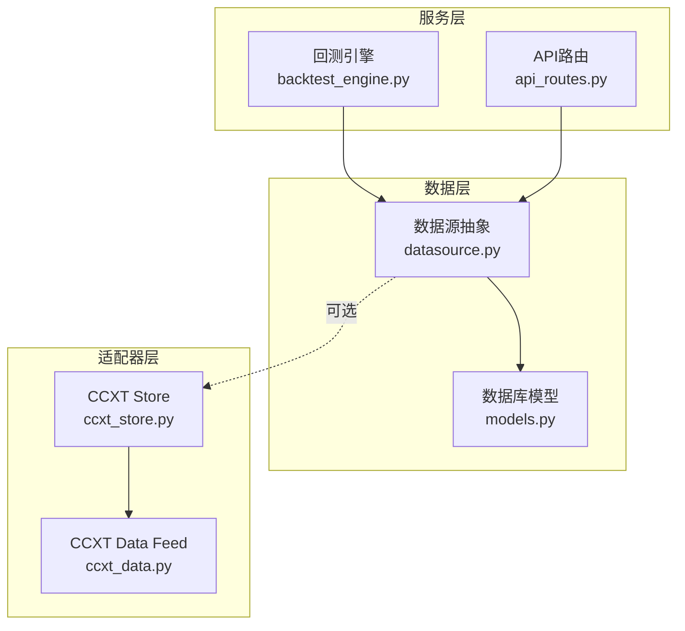
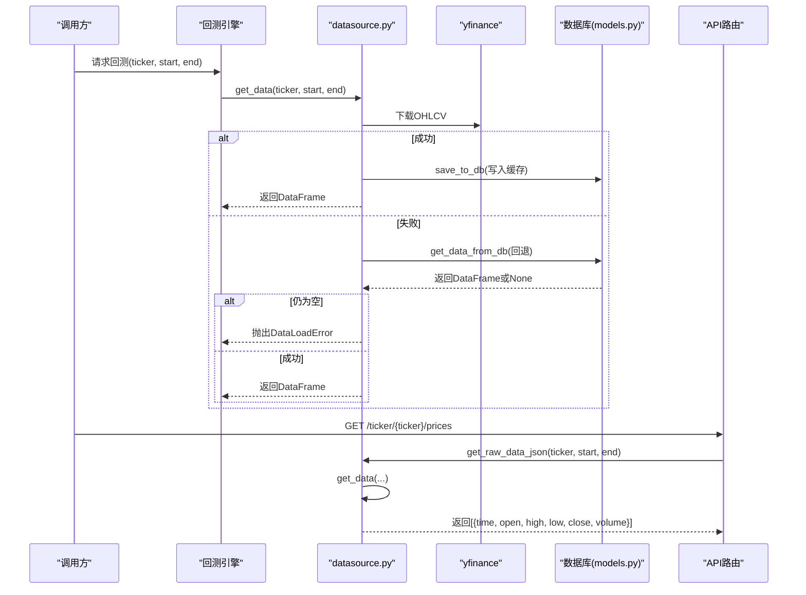
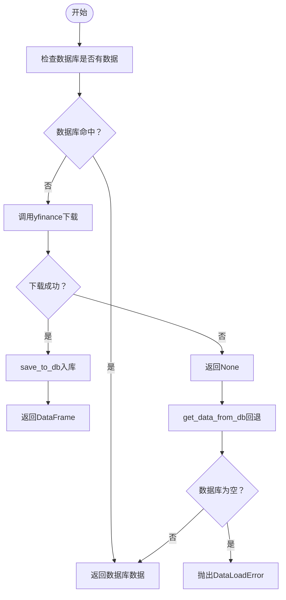
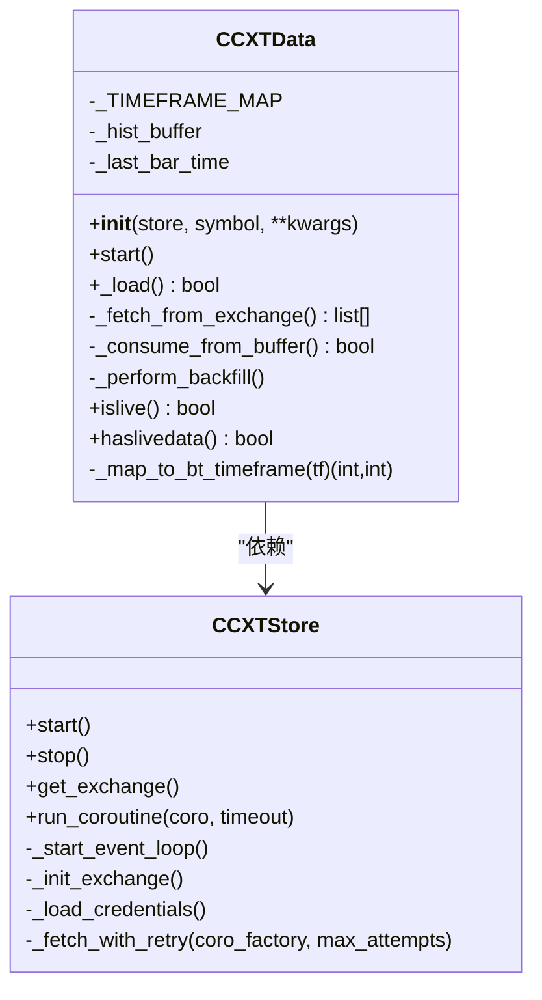
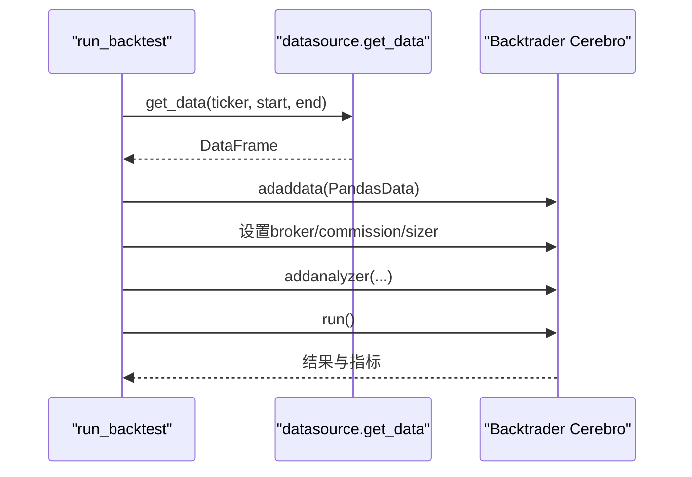
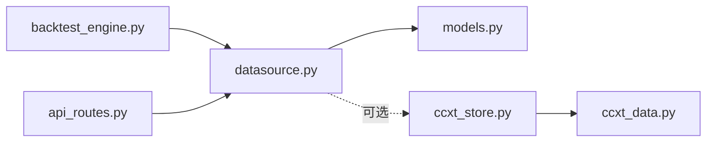

# 数据源管理

<cite>
**本文引用的文件**
- [datasource.py](file://backend/src/db/datasource.py)
- [ccxt_data.py](file://backend/src/brokers/ccxt_adapter/ccxt_data.py)
- [ccxt_store.py](file://backend/src/brokers/ccxt_adapter/ccxt_store.py)
- [models.py](file://backend/src/db/models.py)
- [backtest_engine.py](file://backend/src/service/backtest_engine.py)
- [api_routes.py](file://backend/src/routes/api_routes.py)
- [test_datasource.py](file://backend/tests/db/test_datasource.py)
- [test_ccxt_data.py](file://backend/tests/brokers/ccxt_adapter/test_ccxt_data.py)
</cite>

## 目录
1. [简介](#简介)
2. [项目结构](#项目结构)
3. [核心组件](#核心组件)
4. [架构总览](#架构总览)
5. [详细组件分析](#详细组件分析)
6. [依赖关系分析](#依赖关系分析)
7. [性能考量](#性能考量)
8. [故障排查指南](#故障排查指南)
9. [结论](#结论)
10. [附录](#附录)

## 简介
本文件系统性阐述后端如何通过 datasource.py 抽象与统一管理历史市场数据访问接口，覆盖以下关键点：
- 如何封装不同数据源（yfinance、数据库、CCXT）的获取逻辑，提供标准化的OHLCV读取方法；
- 与 ccxt_data.py 的集成方式，通过适配器模式获取加密货币市场的K线数据，并处理分页、速率限制与数据清洗；
- 数据缓存策略、时间序列对齐机制、支持的时间框架（timeframe）以及缺失数据的处理方案；
- 在回测引擎中的使用示例，展示如何加载指定资产、时间范围与分辨率的数据；
- 性能优化措施（预加载、异步读取、内存映射）与高并发场景下的潜在瓶颈与应对策略。

## 项目结构
后端采用“服务层-数据层-适配器层”的分层组织：
- 服务层：回测引擎调用数据源接口，统一获取OHLCV；
- 数据层：数据库模型与持久化逻辑，负责历史数据缓存与查询；
- 适配器层：CCXT Store/Data 提供实时/历史K线接入，兼容Backtrader框架。

图表来源
- [backtest_engine.py](file://backend/src/service/backtest_engine.py#L302-L330)
- [api_routes.py](file://backend/src/routes/api_routes.py#L171-L206)
- [datasource.py](file://backend/src/db/datasource.py#L149-L231)
- [models.py](file://backend/src/db/models.py#L484-L526)
- [ccxt_store.py](file://backend/src/brokers/ccxt_adapter/ccxt_store.py#L1-L120)
- [ccxt_data.py](file://backend/src/brokers/ccxt_adapter/ccxt_data.py#L1-L120)

章节来源
- [backtest_engine.py](file://backend/src/service/backtest_engine.py#L302-L330)
- [datasource.py](file://backend/src/db/datasource.py#L149-L231)
- [models.py](file://backend/src/db/models.py#L484-L526)

## 核心组件
- 历史数据抽象与缓存
  - datasource.get_data/ticker_metadata：统一从yfinance下载并入库，或从数据库回退读取；提供Backtrader适配feed与前端JSON格式输出。
  - 数据库模型 MarketDataModel/TickerMetadataModel：统一存储OHLCV与股票元数据，带唯一索引与TTL控制。
- 实时/历史K线适配器
  - ccxt_store：管理CCXT交易所连接、事件循环桥接、凭证加载与重试。
  - ccxt_data：实现Backtrader的DataBase，支持历史回填、实时抓取、缓冲区catch-up、过滤未收盘K线、速率限制尊重与错误重试。

章节来源
- [datasource.py](file://backend/src/db/datasource.py#L149-L231)
- [models.py](file://backend/src/db/models.py#L484-L526)
- [ccxt_store.py](file://backend/src/brokers/ccxt_adapter/ccxt_store.py#L1-L120)
- [ccxt_data.py](file://backend/src/brokers/ccxt_adapter/ccxt_data.py#L1-L120)

## 架构总览
datasource.py 作为统一入口，优先从yfinance拉取并写入数据库，若失败则回退到数据库；同时提供Backtrader feed与前端JSON输出。对于加密货币数据，ccxt_data 以适配器形式接入，通过 ccxt_store 统一管理异步事件循环与交易所实例，实现历史回填与实时抓取。

图表来源
- [backtest_engine.py](file://backend/src/service/backtest_engine.py#L302-L330)
- [datasource.py](file://backend/src/db/datasource.py#L149-L231)
- [models.py](file://backend/src/db/models.py#L484-L526)
- [api_routes.py](file://backend/src/routes/api_routes.py#L171-L206)

## 详细组件分析

### 历史数据抽象与缓存（datasource.py）
- 统一入口
  - get_data：优先yfinance下载，成功后入库；失败则回退数据库；异常抛出DataLoadError。
  - get_bt_feed：包装为Backtrader PandasData。
  - get_raw_data_json：面向前端的列表化OHLCV。
- 数据入库与去重
  - save_to_db：自动识别日期列、OHLCV列，数值清洗与填充，按ticker+date去重（SQLite使用on_conflict，其他方言按日期范围查询已存在记录）。
- 数据库回退与标准化
  - get_data_from_db：按日期范围查询，设置标准列名与索引，补齐缺失的Adj Close。
- 元数据缓存
  - get_ticker_metadata：基于yfinance.info校验与解析，入库缓存，支持TTL判断与强制刷新。

图表来源
- [datasource.py](file://backend/src/db/datasource.py#L149-L231)

章节来源
- [datasource.py](file://backend/src/db/datasource.py#L33-L147)
- [datasource.py](file://backend/src/db/datasource.py#L149-L231)
- [datasource.py](file://backend/src/db/datasource.py#L232-L267)
- [datasource.py](file://backend/src/db/datasource.py#L269-L551)
- [models.py](file://backend/src/db/models.py#L484-L526)

### CCXT适配器（ccxt_store.py + ccxt_data.py）
- 连接与事件循环
  - CCXTStore：后台线程启动asyncio事件循环，初始化交易所实例，加载市场与凭证，提供run_coroutine桥接同步Backtrader与异步CCXT。
- 实时/历史K线
  - CCXTData：实现Backtrader的DataBase，支持：
    - 时间框架映射：将CCXT字符串（如1m/5m/1h等）映射为Backtrader的TimeFrame与Compression；
    - 历史回填：按起始时间批量抓取并过滤未收盘K线；
    - 缓冲区catch-up：先消费历史缓冲，再抓取新K线；
    - 速率限制：尊重exchange.rateLimit；
    - 错误处理：指数退避重试与暂停等待，避免频繁错误循环。

图表来源
- [ccxt_store.py](file://backend/src/brokers/ccxt_adapter/ccxt_store.py#L1-L120)
- [ccxt_store.py](file://backend/src/brokers/ccxt_adapter/ccxt_store.py#L120-L220)
- [ccxt_data.py](file://backend/src/brokers/ccxt_adapter/ccxt_data.py#L1-L120)
- [ccxt_data.py](file://backend/src/brokers/ccxt_adapter/ccxt_data.py#L120-L214)
- [ccxt_data.py](file://backend/src/brokers/ccxt_adapter/ccxt_data.py#L214-L288)

章节来源
- [ccxt_store.py](file://backend/src/brokers/ccxt_adapter/ccxt_store.py#L1-L120)
- [ccxt_store.py](file://backend/src/brokers/ccxt_adapter/ccxt_store.py#L120-L220)
- [ccxt_data.py](file://backend/src/brokers/ccxt_adapter/ccxt_data.py#L1-L120)
- [ccxt_data.py](file://backend/src/brokers/ccxt_adapter/ccxt_data.py#L120-L214)
- [ccxt_data.py](file://backend/src/brokers/ccxt_adapter/ccxt_data.py#L214-L288)

### 回测引擎中的使用
- 回测入口：run_backtest 中通过 get_data(ticker, start, end) 获取Backtrader feed，并添加到 cerebro。
- 参数与流程：设置初始资金、手续费、仓位大小、分析器，运行回测并导出指标与图表。

图表来源
- [backtest_engine.py](file://backend/src/service/backtest_engine.py#L302-L330)

章节来源
- [backtest_engine.py](file://backend/src/service/backtest_engine.py#L302-L330)

### API与前端对接
- API路由：/ticker/{ticker}/prices 返回前端可用的OHLCV列表。
- 测试用例：验证元数据校验、解析与JSON格式化输出。

章节来源
- [api_routes.py](file://backend/src/routes/api_routes.py#L171-L206)
- [test_datasource.py](file://backend/tests/db/test_datasource.py#L1-L57)

## 依赖关系分析
- datasource.py 依赖数据库模型（MarketDataModel/TickerMetadataModel），用于缓存与查询；
- ccxt_data 依赖 ccxt_store 提供的交易所实例与事件循环桥接；
- 回测引擎与API路由均依赖 datasource 的统一接口。

图表来源
- [datasource.py](file://backend/src/db/datasource.py#L149-L231)
- [models.py](file://backend/src/db/models.py#L484-L526)
- [ccxt_store.py](file://backend/src/brokers/ccxt_adapter/ccxt_store.py#L1-L120)
- [ccxt_data.py](file://backend/src/brokers/ccxt_adapter/ccxt_data.py#L1-L120)
- [backtest_engine.py](file://backend/src/service/backtest_engine.py#L302-L330)
- [api_routes.py](file://backend/src/routes/api_routes.py#L171-L206)

章节来源
- [datasource.py](file://backend/src/db/datasource.py#L149-L231)
- [models.py](file://backend/src/db/models.py#L484-L526)
- [ccxt_store.py](file://backend/src/brokers/ccxt_adapter/ccxt_store.py#L1-L120)
- [ccxt_data.py](file://backend/src/brokers/ccxt_adapter/ccxt_data.py#L1-L120)
- [backtest_engine.py](file://backend/src/service/backtest_engine.py#L302-L330)
- [api_routes.py](file://backend/src/routes/api_routes.py#L171-L206)

## 性能考量
- 预加载与缓存
  - 历史数据优先从yfinance下载并入库，后续直接从数据库读取，减少外部API调用与网络延迟。
  - 元数据缓存带TTL（默认7天），降低重复请求。
- 异步读取
  - CCXTStore 使用后台线程+asyncio事件循环，run_coroutine桥接Backtrader同步框架与CCXT异步调用，避免阻塞主线程。
- 内存映射与批处理
  - CCXTData 使用历史缓冲区（_hist_buffer）进行catch-up，减少频繁网络请求；回填时按批次（limit/batch_size）抓取并尊重rateLimit。
- 时间序列对齐
  - datasource.get_data_from_db 将结果按日期排序并设置索引，确保Backtrader时间序列连续性；CCXTData过滤未收盘K线，避免未来数据泄漏。
- 支持的时间框架
  - CCXTData 支持分钟/小时/日/周/月等常见时间粒度，内部映射为Backtrader的TimeFrame与Compression。
- 缺失数据处理
  - 若yfinance下载失败且数据库无数据，则抛出DataLoadError；若仅部分缺失，建议在上游策略中使用前向/后向填充策略（由策略侧实现）。

章节来源
- [datasource.py](file://backend/src/db/datasource.py#L149-L231)
- [ccxt_store.py](file://backend/src/brokers/ccxt_adapter/ccxt_store.py#L120-L220)
- [ccxt_data.py](file://backend/src/brokers/ccxt_adapter/ccxt_data.py#L1-L120)
- [ccxt_data.py](file://backend/src/brokers/ccxt_adapter/ccxt_data.py#L120-L214)

## 故障排查指南
- 数据加载失败
  - 现象：get_data 抛出DataLoadError。
  - 排查：确认yfinance是否可用；检查数据库连接与表是否存在；查看save_to_db入库是否成功。
- 元数据校验失败
  - 现象：get_ticker_metadata 返回无效状态。
  - 排查：检查yfinance.info字段完整性；确认缓存是否过期（TTL）。
- CCXT连接问题
  - 现象：CCXTStore无法启动或超时。
  - 排查：检查凭证配置、网络连通性、交易所沙盒模式设置；查看_run_coroutine超时与重试日志。
- K线缺失或重复
  - 现象：回测时间序列不连续或出现重复K线。
  - 排查：确认CCXTData的过滤逻辑（未收盘K线跳过、严格时间戳排序）；检查回填批次与rateLimit设置。

章节来源
- [datasource.py](file://backend/src/db/datasource.py#L149-L231)
- [datasource.py](file://backend/src/db/datasource.py#L269-L551)
- [ccxt_store.py](file://backend/src/brokers/ccxt_adapter/ccxt_store.py#L120-L220)
- [ccxt_data.py](file://backend/src/brokers/ccxt_adapter/ccxt_data.py#L120-L214)
- [test_datasource.py](file://backend/tests/db/test_datasource.py#L1-L57)
- [test_ccxt_data.py](file://backend/tests/brokers/ccxt_adapter/test_ccxt_data.py#L1-L28)

## 结论
datasource.py 通过统一接口屏蔽多数据源差异，结合数据库缓存与标准化输出，显著提升了历史数据的可用性与一致性。配合CCXT适配器，系统实现了从yfinance到加密货币交易所的全链路OHLCV接入，具备良好的扩展性与鲁棒性。在高并发与大规模回测场景下，建议进一步引入连接池、批量入库与更细粒度的缓存策略，以降低数据库压力与提升吞吐量。

## 附录
- API使用示例（回测引擎）
  - 调用路径：backend/src/service/backtest_engine.py#L302-L330
  - 关键步骤：加载策略、调用 get_data(ticker, start, end)、adddata、run、收集指标。
- API使用示例（前端）
  - 路由：backend/src/routes/api_routes.py#L171-L206
  - 输出：[{time, open, high, low, close, volume}]，供前端图表渲染。
- 单元测试参考
  - datasource：backend/tests/db/test_datasource.py#L1-L57
  - ccxt_data：backend/tests/brokers/ccxt_adapter/test_ccxt_data.py#L1-L28