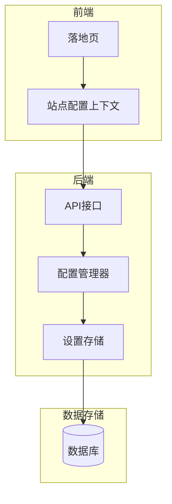
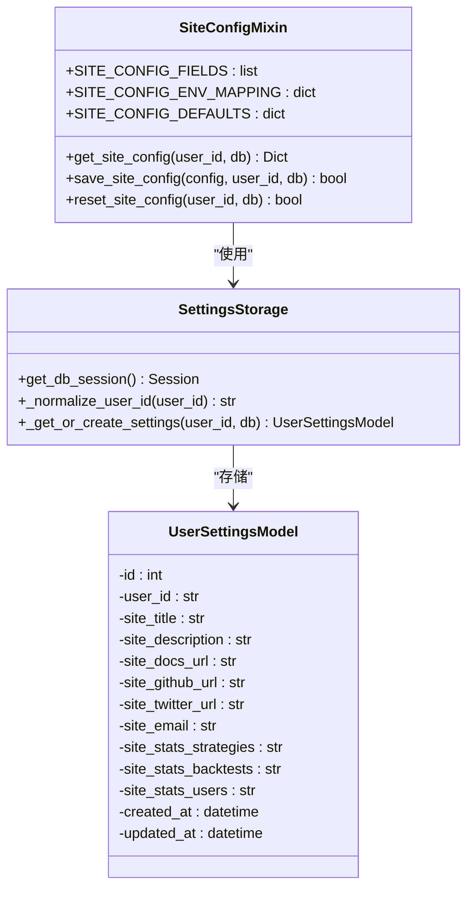
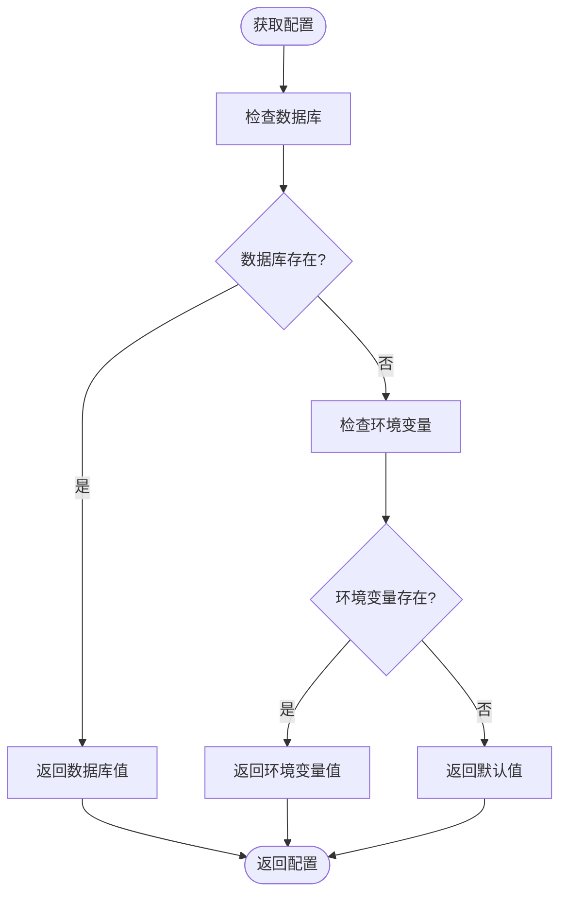
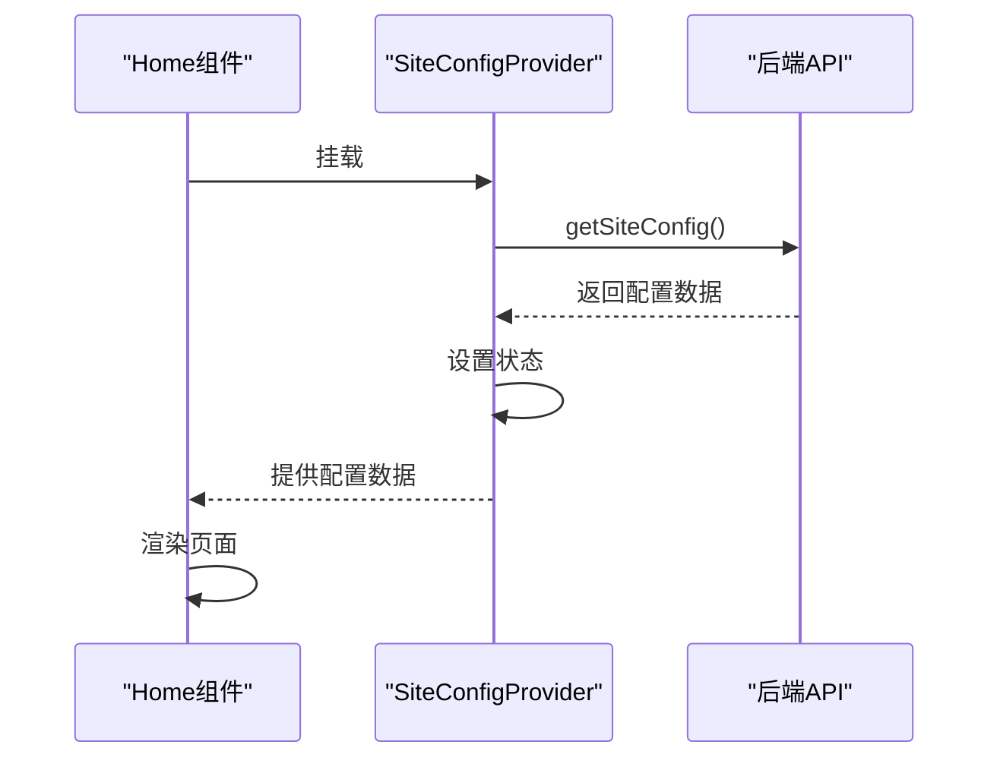

# 站点配置

<cite>
**本文档引用的文件**
- [config_manager.py](file://backend/src/config/config_manager.py)
- [site_config_routes.py](file://backend/src/routes/site_config_routes.py)
- [broker_config.json](file://backend/resources/config/broker_config.json)
- [broker_config.template.json](file://backend/resources/config/broker_config.template.json)
- [logger_config.template.json](file://backend/resources/config/logger_config.template.json)
- [site_config.py](file://backend/src/db/storage/settings/site_config.py)
- [user.py](file://backend/src/db/models/user.py)
- [config_loader.py](file://backend/src/utils/config_loader.py)
- [SiteConfigContext.jsx](file://frontend/src/contexts/SiteConfigContext.jsx)
- [siteApi.js](file://frontend/src/services/siteApi.js)
- [settings.py](file://backend/src/config/settings.py)
- [Home.jsx](file://frontend/src/pages/Home.jsx)
</cite>

## 目录
1. [简介](#简介)
2. [配置架构](#配置架构)
3. [站点配置管理](#站点配置管理)
4. [配置优先级与回退机制](#配置优先级与回退机制)
5. [前端配置集成](#前端配置集成)
6. [配置文件详解](#配置文件详解)
7. [API接口](#api接口)
8. [最佳实践](#最佳实践)

## 简介
站点配置系统是Backtrader Pro平台的核心配置管理组件，负责管理平台的全局设置、品牌信息、功能开关和外部链接。该系统采用数据库优先的配置策略，允许通过用户界面动态更新配置，同时保持与环境变量的向后兼容性。配置系统支持多层级的配置源，包括数据库、环境变量和默认值，确保了系统的灵活性和可靠性。

## 配置架构
站点配置系统采用分层架构设计，由前端、后端API和数据存储三部分组成。前端通过React Context提供配置数据，后端通过FastAPI提供RESTful接口，数据存储使用SQLite数据库。这种架构实现了配置数据的集中管理和动态更新，同时保证了系统的可扩展性和维护性。



**图示来源**
- [SiteConfigContext.jsx](file://frontend/src/contexts/SiteConfigContext.jsx)
- [site_config_routes.py](file://backend/src/routes/site_config_routes.py)
- [config_manager.py](file://backend/src/config/config_manager.py)
- [site_config.py](file://backend/src/db/storage/settings/site_config.py)
- [user.py](file://backend/src/db/models/user.py)

## 站点配置管理
站点配置管理功能允许管理员通过用户界面更新平台的品牌信息、外部链接和统计数据显示。配置数据存储在`user_settings`数据库表中，以`user_id`为`NULL`的特殊记录存储站点级别的配置。这种设计使得配置数据可以与用户特定的设置共享同一数据模型，简化了数据管理。



**图示来源**
- [site_config.py](file://backend/src/db/storage/settings/site_config.py)
- [base.py](file://backend/src/db/storage/settings/base.py)
- [user.py](file://backend/src/db/models/user.py)

## 配置优先级与回退机制
配置系统采用三级优先级机制，确保配置的灵活性和可靠性。优先级顺序为：数据库 > 环境变量 > 默认值。当在数据库中找不到配置时，系统会尝试从环境变量中获取，如果环境变量也不存在，则使用硬编码的默认值。这种机制允许用户通过UI界面覆盖配置，同时保持与传统环境变量配置的兼容性。



**图示来源**
- [config_manager.py](file://backend/src/config/config_manager.py)
- [site_config.py](file://backend/src/db/storage/settings/site_config.py)
- [settings.py](file://backend/src/config/settings.py)

## 前端配置集成
前端通过`SiteConfigContext`提供配置数据，该上下文在组件挂载时从后端API获取配置。如果API调用失败，系统会使用内置的默认配置，确保应用的可用性。`SiteConfigProvider`组件包装了整个落地页，使得所有子组件都可以通过`useSiteConfig`钩子访问配置数据。



**图示来源**
- [Home.jsx](file://frontend/src/pages/Home.jsx)
- [SiteConfigContext.jsx](file://frontend/src/contexts/SiteConfigContext.jsx)
- [siteApi.js](file://frontend/src/services/siteApi.js)

## 配置文件详解
系统包含多个配置文件，每个文件负责不同的配置方面。`broker_config.json`定义了交易经纪商的配置，`logger_config.template.json`提供了日志配置模板，而站点配置则主要通过数据库和环境变量管理。

### 经纪商配置文件
`broker_config.json`文件定义了支持的交易所及其配置，包括启用状态、适配器类型、市场类型和纸面交易设置。该文件使用JSON格式，便于阅读和编辑。

```json
{
  "version": "1.0",
  "exchanges": {
    "binance": {
      "enabled": true,
      "name": "Binance",
      "adapter": "ccxt",
      "ccxt_id": "binance",
      "markets": ["spot", "futures"],
      "default_market": "spot",
      "paper_mode": {
        "enabled": true,
        "sandbox_url": "https://testnet.binance.vision",
        "initial_balance_usdt": 10000
      }
    }
  }
}
```

**文件来源**
- [broker_config.json](file://backend/resources/config/broker_config.json)
- [broker_config.template.json](file://backend/resources/config/broker_config.template.json)

### 日志配置模板
`logger_config.template.json`文件提供了日志配置的模板，包括日志级别、格式、处理器和特定模块的日志设置。该文件还包含敏感字段的掩码配置，防止在日志中泄露凭证信息。

```json
{
    "version": "1.0",
    "logging": {
        "level": "INFO",
        "format": "%(asctime)s - %(name)s - %(levelname)s - %(message)s",
        "date_format": "%Y-%m-%d %H:%M:%S",
        "handlers": {
            "console": {
                "enabled": true,
                "level": "INFO"
            },
            "file": {
                "enabled": false,
                "level": "DEBUG",
                "filename": "logs/app.log"
            }
        }
    },
    "sensitive_fields": {
        "mask_patterns": ["password", "api_key", "secret", "token"]
    }
}
```

**文件来源**
- [logger_config.template.json](file://backend/resources/config/logger_config.template.json)

## API接口
站点配置系统提供了一组RESTful API接口，用于获取和更新配置。这些接口遵循标准的HTTP方法约定，GET用于获取配置，PUT用于更新配置，POST用于重置配置。

### 获取站点配置
`GET /site/config`接口返回公共站点配置，无需身份验证。该接口返回品牌信息、外部链接、统计数据和功能开关。

```json
{
    "site": {
        "title": "Backtrader Pro",
        "description": "Professional quantitative trading platform"
    },
    "links": {
        "docs": "",
        "github": "",
        "twitter": "",
        "email": ""
    },
    "stats": {
        "strategies": "50+",
        "backtests": "10K+",
        "users": "1K+"
    },
    "features": {
        "loginEnabled": false,
        "liveTrading": false
    }
}
```

### 更新站点配置
`PUT /site/config`接口用于更新站点配置，需要身份验证。该接口接受部分更新，只更新提供的字段，其他字段保持不变。

```json
{
    "site_title": "My Trading Platform",
    "site_docs_url": "https://docs.myplatform.com"
}
```

### 重置站点配置
`POST /site/config/reset`接口用于将站点配置重置为默认值，需要身份验证。该接口删除数据库中的配置值，使系统回退到环境变量或默认值。

**接口来源**
- [site_config_routes.py](file://backend/src/routes/site_config_routes.py)
- [siteApi.js](file://frontend/src/services/siteApi.js)

## 最佳实践
在使用站点配置系统时，应遵循以下最佳实践：

1. **配置优先级**：始终优先使用数据库配置，环境变量作为后备，确保配置的灵活性和可靠性。
2. **安全考虑**：敏感信息如API密钥应加密存储，并在日志中进行掩码处理。
3. **缓存策略**：对于频繁访问的配置，应实现适当的缓存策略，减少数据库查询。
4. **错误处理**：前端应优雅地处理配置获取失败的情况，使用默认配置确保应用可用性。
5. **版本控制**：重要的配置更改应记录版本信息，便于追踪和回滚。

**本节来源**
- [config_manager.py](file://backend/src/config/config_manager.py)
- [site_config.py](file://backend/src/db/storage/settings/site_config.py)
- [SiteConfigContext.jsx](file://frontend/src/contexts/SiteConfigContext.jsx)