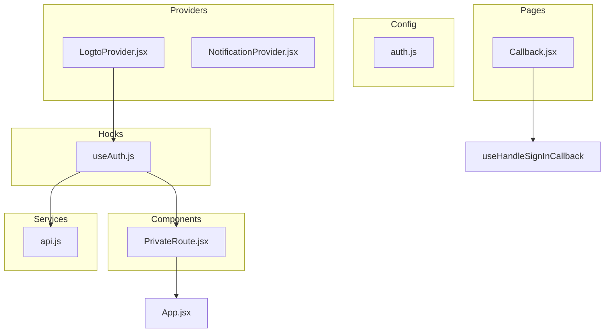
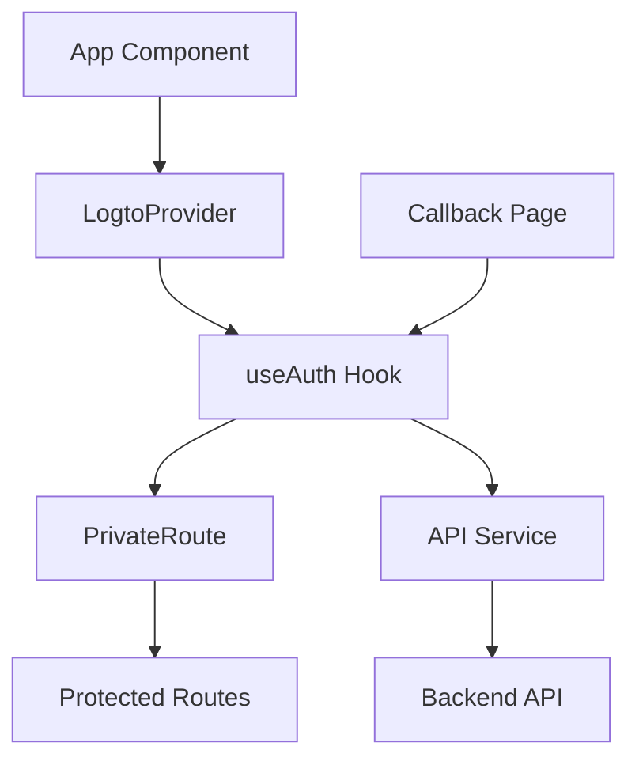
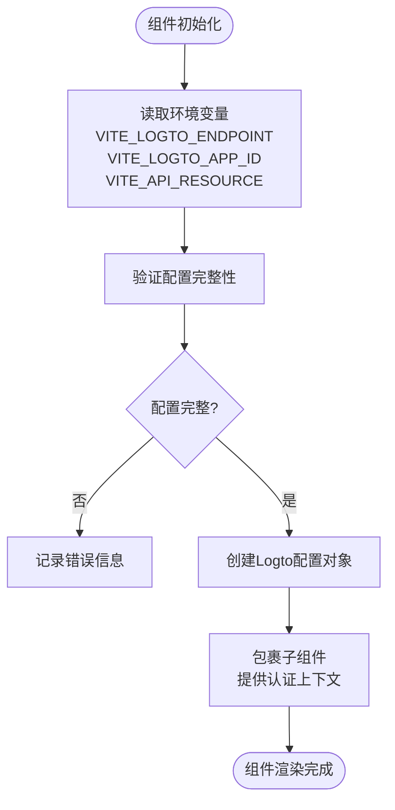
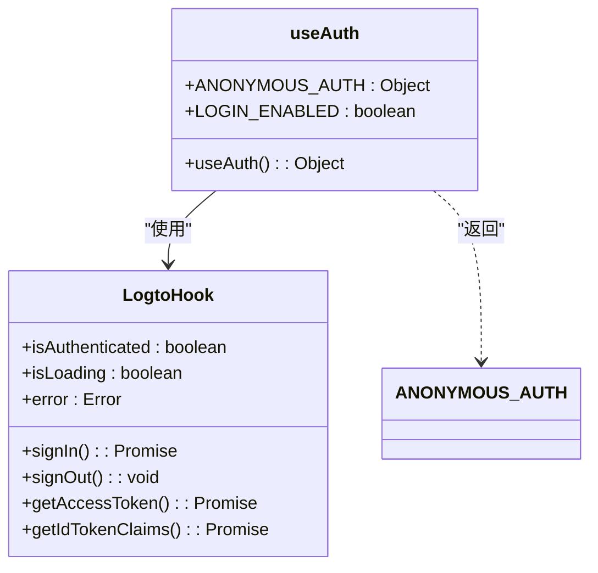
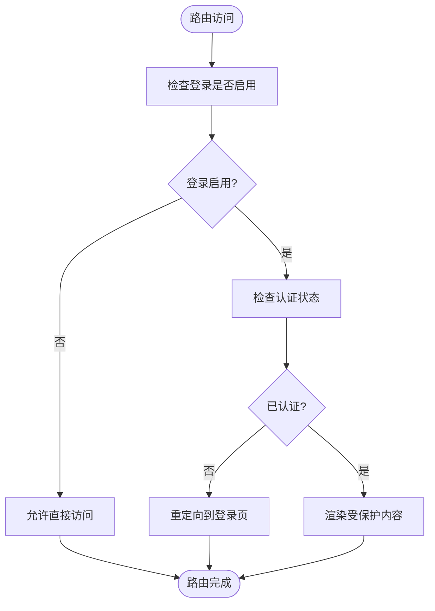
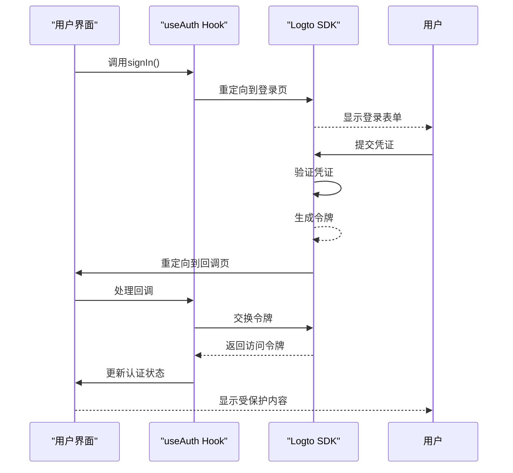
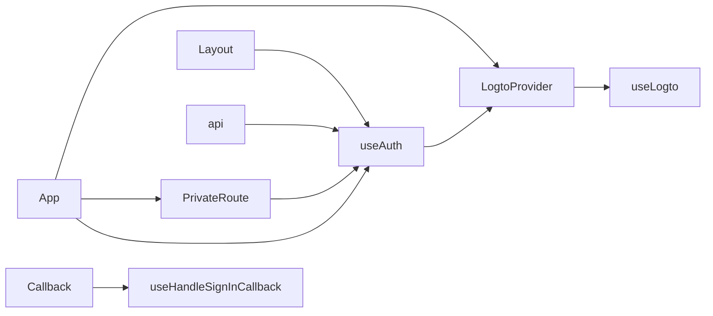

# 前端集成实践

<cite>
**本文档引用的文件**  
- [LogtoProvider.jsx](file://frontend/src/providers/LogtoProvider.jsx)
- [useAuth.js](file://frontend/src/hooks/useAuth.js)
- [auth.js](file://frontend/src/config/auth.js)
- [PrivateRoute.jsx](file://frontend/src/components/Auth/PrivateRoute.jsx)
- [App.jsx](file://frontend/src/App.jsx)
- [Callback.jsx](file://frontend/src/pages/Callback.jsx)
- [api.js](file://frontend/src/services/api.js)
</cite>

## 目录
1. [简介](#简介)
2. [项目结构](#项目结构)
3. [核心组件](#核心组件)
4. [架构概览](#架构概览)
5. [详细组件分析](#详细组件分析)
6. [依赖分析](#依赖分析)
7. [性能考虑](#性能考虑)
8. [故障排除指南](#故障排除指南)
9. [结论](#结论)

## 简介
本文档全面记录了前端认证授权体系的集成方案，重点说明基于Logto的OAuth 2.0认证流程实现。文档涵盖LogtoProvider初始化、useAuth自定义Hook状态管理、PrivateRoute路由守卫机制、令牌管理策略及安全最佳实践，为系统集成和维护提供完整参考。

## 项目结构
前端认证体系采用模块化设计，核心组件分布在特定目录中。认证提供者位于`providers`目录，自定义Hook存于`hooks`目录，路由守卫组件在`components/Auth`目录，配置集中于`config`目录。这种组织方式确保了关注点分离和代码可维护性。



**Diagram sources**  
- [LogtoProvider.jsx](file://frontend/src/providers/LogtoProvider.jsx)
- [useAuth.js](file://frontend/src/hooks/useAuth.js)
- [PrivateRoute.jsx](file://frontend/src/components/Auth/PrivateRoute.jsx)

**Section sources**  
- [frontend/src](file://frontend/src#L1-L10)

## 核心组件
本系统的核心认证组件包括LogtoProvider、useAuth Hook、PrivateRoute组件和令牌管理机制。这些组件协同工作，实现了完整的认证授权流程，从初始化到状态管理再到路由保护。

**Section sources**  
- [LogtoProvider.jsx](file://frontend/src/providers/LogtoProvider.jsx#L1-L34)
- [useAuth.js](file://frontend/src/hooks/useAuth.js#L1-L30)
- [PrivateRoute.jsx](file://frontend/src/components/Auth/PrivateRoute.jsx#L1-L32)

## 架构概览
系统采用分层架构，最外层是LogtoProvider提供全局认证上下文，中间层是useAuth Hook统一管理认证状态，内层是PrivateRoute组件实现路由保护。API服务通过令牌注入机制与认证系统集成，形成完整的安全闭环。



**Diagram sources**  
- [App.jsx](file://frontend/src/App.jsx#L1-L119)
- [useAuth.js](file://frontend/src/hooks/useAuth.js#L1-L30)

## 详细组件分析

### LogtoProvider 初始化分析
LogtoProvider组件负责初始化OAuth 2.0认证流程，通过读取环境变量配置Logto服务端点、应用ID和资源标识符。组件包含配置验证逻辑，确保必要参数存在，为整个应用提供认证上下文。



**Diagram sources**  
- [LogtoProvider.jsx](file://frontend/src/providers/LogtoProvider.jsx#L1-L34)

**Section sources**  
- [LogtoProvider.jsx](file://frontend/src/providers/LogtoProvider.jsx#L1-L34)

### useAuth Hook 设计模式分析
useAuth自定义Hook封装了认证状态管理逻辑，支持受保护模式和匿名模式。在登录禁用时返回空操作处理器，同时报告已认证状态，确保应用在开发和测试环境中正常运行。



**Diagram sources**  
- [useAuth.js](file://frontend/src/hooks/useAuth.js#L1-L30)
- [auth.js](file://frontend/src/config/auth.js#L1-L4)

**Section sources**  
- [useAuth.js](file://frontend/src/hooks/useAuth.js#L1-L30)

### PrivateRoute 路由守卫机制分析
PrivateRoute组件实现路由守卫功能，检查用户认证状态并处理未认证重定向。组件支持登录启用配置，允许在开发环境中绕过认证，同时保持生产环境的安全性。



**Diagram sources**  
- [PrivateRoute.jsx](file://frontend/src/components/Auth/PrivateRoute.jsx#L1-L32)

**Section sources**  
- [PrivateRoute.jsx](file://frontend/src/components/Auth/PrivateRoute.jsx#L1-L32)

### 认证状态管理流程
系统通过useAuth Hook统一管理认证状态，包括登录、登出、加载中和错误状态。状态变化通过React上下文机制传播到全应用，确保UI一致性。



**Diagram sources**  
- [useAuth.js](file://frontend/src/hooks/useAuth.js#L1-L30)
- [Callback.jsx](file://frontend/src/pages/Callback.jsx#L1-L44)

## 依赖分析
认证系统依赖于多个外部库和内部模块。主要外部依赖包括@logto/react SDK、react-router-dom和antd。内部依赖关系清晰，遵循单向数据流原则，避免循环依赖。



**Diagram sources**  
- [App.jsx](file://frontend/src/App.jsx#L1-L119)
- [package.json](file://frontend/package.json#L1-L20)

**Section sources**  
- [App.jsx](file://frontend/src/App.jsx#L1-L119)

## 性能考虑
认证系统在性能方面进行了优化，包括令牌缓存、懒加载和错误处理。useAuth Hook的匿名模式避免了不必要的网络请求，提升开发体验。API服务的令牌注入机制确保每次请求都能获取最新令牌，同时最小化性能开销。

## 故障排除指南
本节列举常见集成问题及其排查步骤，帮助开发者快速定位和解决问题。

### 令牌失效问题
当出现令牌失效时，按以下步骤排查：
1. 检查Logto服务端点配置是否正确
2. 验证应用ID和密钥是否匹配
3. 确认资源标识符配置正确
4. 检查浏览器存储是否被清除
5. 查看控制台错误日志获取详细信息

**Section sources**  
- [LogtoProvider.jsx](file://frontend/src/providers/LogtoProvider.jsx#L1-L34)
- [api.js](file://frontend/src/services/api.js#L1-L255)

### 重定向循环问题
当出现重定向循环时，按以下步骤排查：
1. 检查回调URL是否正确配置在Logto控制台
2. 验证路由配置是否正确
3. 确认环境变量VITE_ENABLE_LOGIN设置正确
4. 检查浏览器Cookie和LocalStorage是否被阻止
5. 查看网络请求日志分析重定向链

**Section sources**  
- [App.jsx](file://frontend/src/App.jsx#L1-L119)
- [Callback.jsx](file://frontend/src/pages/Callback.jsx#L1-L44)

### 环境变量配置示例
```env
# Logto 配置
VITE_LOGTO_ENDPOINT=https://your-logto-domain.com
VITE_LOGTO_APP_ID=your-app-id
VITE_API_RESOURCE=your-api-resource

# 认证开关
VITE_ENABLE_LOGIN=true
```

**Section sources**  
- [auth.js](file://frontend/src/config/auth.js#L1-L4)

## 结论
本文档详细记录了前端认证授权体系的集成方案。系统采用模块化设计，通过LogtoProvider、useAuth Hook和PrivateRoute组件实现了完整的认证流程。方案支持灵活的配置选项，兼顾安全性和开发便利性，为交易系统的安全访问提供了可靠保障。