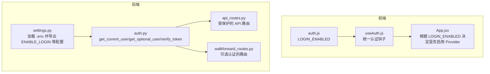
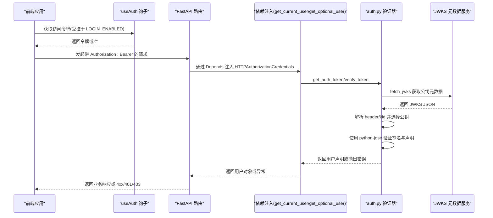
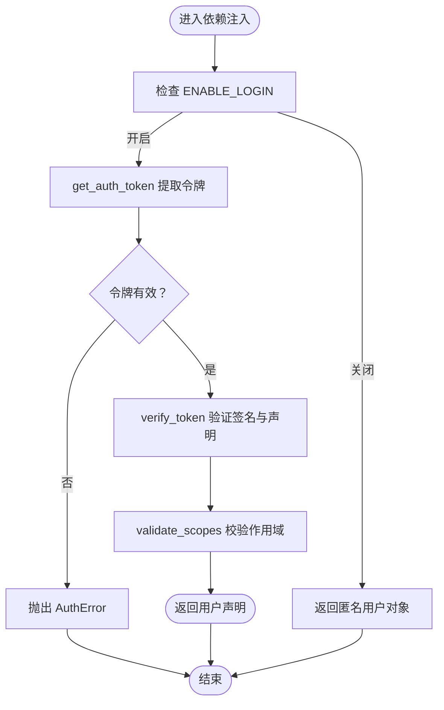
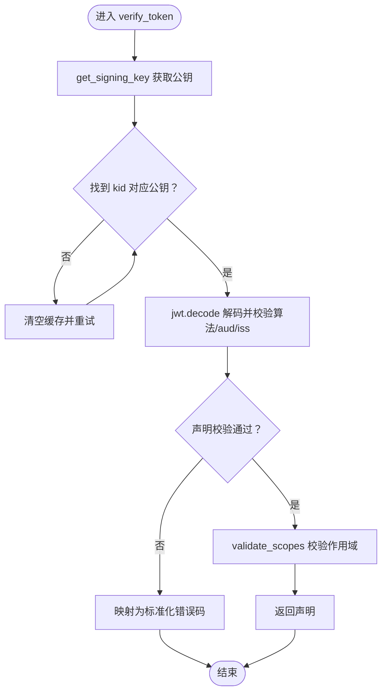
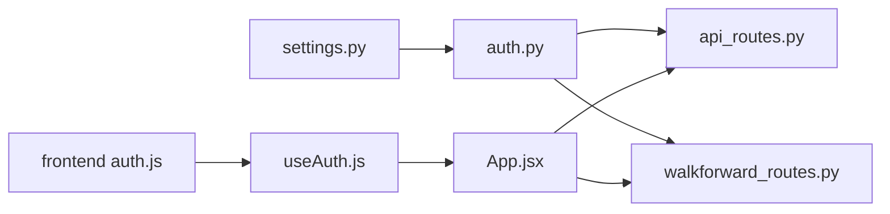

# 后端认证机制

<cite>
**本文引用的文件**
- [backend/src/utils/auth.py](file://backend/src/utils/auth.py)
- [backend/src/config/settings.py](file://backend/src/config/settings.py)
- [backend/src/routes/api_routes.py](file://backend/src/routes/api_routes.py)
- [backend/src/routes/walkforward_routes.py](file://backend/src/routes/walkforward_routes.py)
- [frontend/src/config/auth.js](file://frontend/src/config/auth.js)
- [frontend/src/hooks/useAuth.js](file://frontend/src/hooks/useAuth.js)
- [frontend/src/App.jsx](file://frontend/src/App.jsx)
- [backend/.env.template](file://backend/.env.template)
</cite>

## 目录
1. [简介](#简介)
2. [项目结构与认证相关模块](#项目结构与认证相关模块)
3. [核心组件](#核心组件)
4. [架构总览](#架构总览)
5. [关键组件深度解析](#关键组件深度解析)
6. [依赖关系分析](#依赖关系分析)
7. [性能与安全考量](#性能与安全考量)
8. [故障排查指南](#故障排查指南)
9. [结论](#结论)
10. [附录：常见错误码与含义](#附录常见错误码与含义)

## 简介
本文件系统性解析后端基于 JWT 的认证机制实现，重点围绕以下目标：
- 深入说明 auth.py 中 get_current_user 与 get_optional_user 两个核心依赖注入函数的工作流程，包括 HTTPAuthorizationCredentials 的依赖注入、令牌提取、JWKS 公钥获取、签名验证及声明解析全过程。
- 解释 ENABLE_LOGIN 配置项如何控制认证开关并实现匿名模式切换。
- 阐述 verify_token 函数的安全校验逻辑，涵盖过期时间、签发者、受众等声明验证。
- 提供自定义作用域（scope）校验的扩展方法。
- 结合 FastAPI 的 Depends 机制，说明如何在 API 路由中集成认证保护。
- 列举令牌验证失败的常见错误码及其含义，并提供调试建议。

## 项目结构与认证相关模块
后端认证相关的关键文件与职责如下：
- 认证工具与依赖注入：backend/src/utils/auth.py
- 配置加载与开关控制：backend/src/config/settings.py
- 前端登录开关配置：frontend/src/config/auth.js
- 前端认证钩子与路由包装：frontend/src/hooks/useAuth.js、frontend/src/App.jsx
- API 路由中的认证集成：backend/src/routes/api_routes.py、backend/src/routes/walkforward_routes.py
- 环境变量模板：backend/.env.template

图表来源
- [backend/src/utils/auth.py](file://backend/src/utils/auth.py#L1-L191)
- [backend/src/config/settings.py](file://backend/src/config/settings.py#L1-L81)
- [backend/src/routes/api_routes.py](file://backend/src/routes/api_routes.py#L1-L341)
- [backend/src/routes/walkforward_routes.py](file://backend/src/routes/walkforward_routes.py#L1-L400)
- [frontend/src/config/auth.js](file://frontend/src/config/auth.js#L1-L4)
- [frontend/src/hooks/useAuth.js](file://frontend/src/hooks/useAuth.js#L1-L29)
- [frontend/src/App.jsx](file://frontend/src/App.jsx#L33-L118)

章节来源
- [backend/src/utils/auth.py](file://backend/src/utils/auth.py#L1-L191)
- [backend/src/config/settings.py](file://backend/src/config/settings.py#L1-L81)
- [backend/src/routes/api_routes.py](file://backend/src/routes/api_routes.py#L1-L341)
- [backend/src/routes/walkforward_routes.py](file://backend/src/routes/walkforward_routes.py#L1-L400)
- [frontend/src/config/auth.js](file://frontend/src/config/auth.js#L1-L4)
- [frontend/src/hooks/useAuth.js](file://frontend/src/hooks/useAuth.js#L1-L29)
- [frontend/src/App.jsx](file://frontend/src/App.jsx#L33-L118)

## 核心组件
- HTTP 授权头依赖注入：通过 FastAPI 的 HTTPBearer 自动注入 HTTPAuthorizationCredentials 对象，支持 auto_error=False 实现可选认证。
- 令牌提取与校验：get_auth_token 负责从 Authorization 头中提取 Bearer 令牌并进行格式校验。
- JWKS 公钥获取与缓存：fetch_jwks 从 Logto 的 JWKS 地址拉取公钥元数据，默认缓存以提升性能；当未找到匹配 kid 时会清空缓存并重试一次。
- 签名验证与声明解析：verify_token 使用 python-jose 对令牌进行解码与验证，校验签发者、受众、过期时间等关键声明，并调用 validate_scopes 进行作用域校验。
- 依赖注入函数：
  - get_current_user：强制要求认证，ENABLE_LOGIN 关闭时返回匿名用户对象。
  - get_optional_user：可选认证，ENABLE_LOGIN 关闭时返回匿名用户对象；无令牌或验证失败时返回 None。
- 配置开关 ENABLE_LOGIN：来自 settings.py，决定是否启用认证保护与匿名模式。

章节来源
- [backend/src/utils/auth.py](file://backend/src/utils/auth.py#L1-L191)
- [backend/src/config/settings.py](file://backend/src/config/settings.py#L1-L81)

## 架构总览
下图展示了从前端到后端的认证请求流，以及依赖注入与验证的关键步骤。

图表来源
- [backend/src/utils/auth.py](file://backend/src/utils/auth.py#L1-L191)
- [backend/src/routes/api_routes.py](file://backend/src/routes/api_routes.py#L1-L341)
- [backend/src/routes/walkforward_routes.py](file://backend/src/routes/walkforward_routes.py#L1-L400)
- [frontend/src/hooks/useAuth.js](file://frontend/src/hooks/useAuth.js#L1-L29)

## 关键组件深度解析

### 依赖注入与令牌提取流程
- HTTPAuthorizationCredentials 依赖注入：HTTPBearer(auto_error=False) 使依赖注入不会直接抛出 401，而是将凭证作为可选参数传入。
- get_auth_token：校验 Authorization 头是否存在、scheme 是否为 Bearer、令牌是否非空，否则抛出自定义 AuthError。
- get_current_user：若 ENABLE_LOGIN 为假，直接返回匿名用户对象；否则走令牌提取与验证流程。
- get_optional_user：若 ENABLE_LOGIN 为假，返回匿名用户对象；否则尝试提取并验证令牌，失败则返回 None。

图表来源
- [backend/src/utils/auth.py](file://backend/src/utils/auth.py#L1-L191)
- [backend/src/config/settings.py](file://backend/src/config/settings.py#L1-L81)

章节来源
- [backend/src/utils/auth.py](file://backend/src/utils/auth.py#L1-L191)
- [backend/src/config/settings.py](file://backend/src/config/settings.py#L1-L81)

### JWKS 公钥获取与签名验证
- fetch_jwks：从 LOGTO_JWKS_URI 拉取 JWKS JSON，支持 HTTP/HTTPS 代理；失败时抛出 500 异常。
- get_signing_key：解析 JWT 头获取 kid，遍历 JWKS keys 匹配 kid；未命中则清空缓存并重试一次。
- verify_token：使用 python-jose 解码 JWT，指定算法、audience、issuer，并禁用 at_hash 校验；捕获过期、声明错误、通用 JWT 错误并映射为标准化错误码。

图表来源
- [backend/src/utils/auth.py](file://backend/src/utils/auth.py#L1-L191)

章节来源
- [backend/src/utils/auth.py](file://backend/src/utils/auth.py#L1-L191)

### 作用域（scope）校验扩展
- 当 LOGTO_REQUIRED_SCOPES 非空时，validate_scopes 将对令牌中的 scope 字段进行白名单校验；缺失任一必需 scope 即返回 403。
- 扩展建议：
  - 在 settings.py 中按空格分隔配置多个必需 scope。
  - 若需更细粒度的权限模型，可在 verify_token 或 validate_scopes 中增加自定义字段校验（如资源标识符、角色等），并在前端生成对应 scope 的令牌。

章节来源
- [backend/src/utils/auth.py](file://backend/src/utils/auth.py#L1-L191)
- [backend/src/config/settings.py](file://backend/src/config/settings.py#L1-L81)

### FastAPI 路由中的认证集成
- 受保护路由：在路由函数参数中使用 user: dict = Depends(get_current_user)，即可强制要求认证；未提供令牌或验证失败将返回 401/403。
- 可选认证路由：使用 user: dict = Depends(get_optional_user)，允许匿名访问；内部可根据 user 是否存在决定业务行为。
- 示例：
  - api_routes.py 中多处接口使用 get_current_user 保护策略管理、回测执行等敏感操作。
  - walkforward_routes.py 中多处接口使用 get_optional_user 支持匿名查看优化历史，但保存/删除等操作仍可依赖可选用户信息。

章节来源
- [backend/src/routes/api_routes.py](file://backend/src/routes/api_routes.py#L1-L341)
- [backend/src/routes/walkforward_routes.py](file://backend/src/routes/walkforward_routes.py#L1-L400)

### ENABLE_LOGIN 开关与匿名模式
- 后端开关：settings.py 从环境变量加载 ENABLE_LOGIN，关闭时 get_current_user/get_optional_user 均返回匿名用户对象，实现“匿名模式”。
- 前端开关：frontend/src/config/auth.js 读取 VITE_ENABLE_LOGIN 控制前端是否启用认证 Provider 与令牌注入。
- 两者联动：前端根据 LOGIN_ENABLED 决定是否向后端注入 Authorization 头；后端根据 ENABLE_LOGIN 决定是否强制认证。

章节来源
- [backend/src/config/settings.py](file://backend/src/config/settings.py#L1-L81)
- [frontend/src/config/auth.js](file://frontend/src/config/auth.js#L1-L4)
- [frontend/src/hooks/useAuth.js](file://frontend/src/hooks/useAuth.js#L1-L29)
- [frontend/src/App.jsx](file://frontend/src/App.jsx#L33-L118)

## 依赖关系分析
- 组件耦合：
  - auth.py 依赖 settings.py 导出的配置（LOGTO_ISSUER、LOGTO_AUDIENCE、LOGTO_JWKS_URI、LOGTO_REQUIRED_SCOPES、ENABLE_LOGIN、HTTP_PROXY、HTTPS_PROXY）。
  - 路由层通过 Depends(get_current_user/get_optional_user) 间接依赖 auth.py。
  - 前端通过 useAuth.js 与 App.jsx 间接影响后端认证行为。
- 外部依赖：
  - python-jose 用于 JWT 解码与验证。
  - requests 用于拉取 JWKS 元数据。
- 潜在循环依赖：当前结构清晰，未发现循环导入。

图表来源
- [backend/src/config/settings.py](file://backend/src/config/settings.py#L1-L81)
- [backend/src/utils/auth.py](file://backend/src/utils/auth.py#L1-L191)
- [backend/src/routes/api_routes.py](file://backend/src/routes/api_routes.py#L1-L341)
- [backend/src/routes/walkforward_routes.py](file://backend/src/routes/walkforward_routes.py#L1-L400)
- [frontend/src/config/auth.js](file://frontend/src/config/auth.js#L1-L4)
- [frontend/src/hooks/useAuth.js](file://frontend/src/hooks/useAuth.js#L1-L29)
- [frontend/src/App.jsx](file://frontend/src/App.jsx#L33-L118)

章节来源
- [backend/src/config/settings.py](file://backend/src/config/settings.py#L1-L81)
- [backend/src/utils/auth.py](file://backend/src/utils/auth.py#L1-L191)
- [backend/src/routes/api_routes.py](file://backend/src/routes/api_routes.py#L1-L341)
- [backend/src/routes/walkforward_routes.py](file://backend/src/routes/walkforward_routes.py#L1-L400)
- [frontend/src/config/auth.js](file://frontend/src/config/auth.js#L1-L4)
- [frontend/src/hooks/useAuth.js](file://frontend/src/hooks/useAuth.js#L1-L29)
- [frontend/src/App.jsx](file://frontend/src/App.jsx#L33-L118)

## 性能与安全考量
- 性能：
  - fetch_jwks 使用 LRU 缓存，减少频繁网络请求；当未找到 kid 时主动清空缓存并重试一次，兼顾正确性与性能。
  - 代理配置支持 HTTP/HTTPS，便于内网部署。
- 安全：
  - 严格校验签发者（issuer）、受众（audience）与过期时间（exp），避免伪造令牌。
  - 默认禁用 at_hash 校验，避免与 OIDC 交互式授权场景冲突。
  - 作用域校验可按需启用，确保最小权限原则。
- 建议：
  - 在生产环境固定 LOGTO_JWKS_URI、LOGTO_ISSUER、LOGTO_AUDIENCE，避免运行时被篡改。
  - 为 JWKS 请求设置合理的超时与重试策略，必要时引入本地缓存策略。

[本节为通用指导，不直接分析具体文件]

## 故障排查指南
- 常见错误码与含义（标准化错误码，由 AuthError 抛出）：
  - auth.authorization_header_missing：缺少 Authorization 头
  - auth.authorization_token_type_not_supported：Authorization scheme 非 Bearer
  - auth.authorization_token_invalid_format：令牌为空或格式无效
  - auth.invalid_token_header：JWT 头解析失败
  - auth.invalid_token：令牌无效（例如缺少 kid、算法缺失、签名失败）
  - auth.token_expired：令牌过期
  - auth.invalid_claims：声明校验失败（如 aud/iss 不匹配）
  - auth.insufficient_scope：缺少必需的作用域
- 前端问题：
  - 若 LOGIN_ENABLED 为假，前端不会注入 Authorization 头，后端将视为匿名访问。
  - 若 LOGIN_ENABLED 为真，前端需正确获取令牌并设置到 Authorization 头。
- 后端问题：
  - JWKS 拉取失败：检查 LOGTO_JWKS_URI、网络连通性、代理配置。
  - 令牌过期：刷新令牌或延长有效期。
  - 声明不匹配：核对 LOGTO_ISSUER、LOGTO_AUDIENCE 与令牌发行方一致。
  - 作用域不足：在 settings.py 中补充 LOGTO_REQUIRED_SCOPES。
- 调试建议：
  - 在 get_current_user/get_optional_user 中打印关键信息（令牌摘要、kid、aud/iss 校验结果）。
  - 使用 curl 直接测试路由，观察返回的标准化错误码与 message。
  - 在 settings.py 中临时开启日志输出，定位 JWKS 与验证阶段的问题。

章节来源
- [backend/src/utils/auth.py](file://backend/src/utils/auth.py#L1-L191)
- [backend/src/config/settings.py](file://backend/src/config/settings.py#L1-L81)
- [frontend/src/config/auth.js](file://frontend/src/config/auth.js#L1-L4)
- [frontend/src/hooks/useAuth.js](file://frontend/src/hooks/useAuth.js#L1-L29)
- [frontend/src/App.jsx](file://frontend/src/App.jsx#L33-L118)

## 结论
该认证体系通过 FastAPI 的 Depends 机制与自定义依赖注入函数，实现了灵活且安全的 JWT 校验流程。ENABLE_LOGIN 开关使得系统可在“强制认证”与“匿名模式”之间无缝切换，满足不同部署场景的需求。verify_token 对签发者、受众、过期时间等关键声明进行严格校验，并通过 validate_scopes 支持细粒度权限控制。结合前端 LOGIN_ENABLED 与后端配置，整体形成前后端协同的一致认证体验。

[本节为总结性内容，不直接分析具体文件]

## 附录：常见错误码与含义
- auth.authorization_header_missing：缺少 Authorization 头
- auth.authorization_token_type_not_supported：Authorization scheme 非 Bearer
- auth.authorization_token_invalid_format：令牌为空或格式无效
- auth.invalid_token_header：JWT 头解析失败
- auth.invalid_token：令牌无效（例如缺少 kid、算法缺失、签名失败）
- auth.token_expired：令牌过期
- auth.invalid_claims：声明校验失败（如 aud/iss 不匹配）
- auth.insufficient_scope：缺少必需的作用域

章节来源
- [backend/src/utils/auth.py](file://backend/src/utils/auth.py#L1-L191)