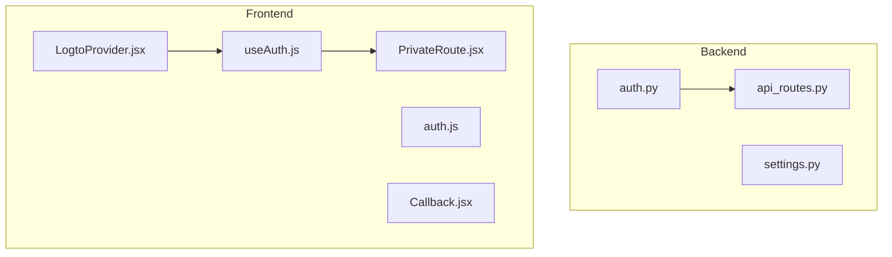
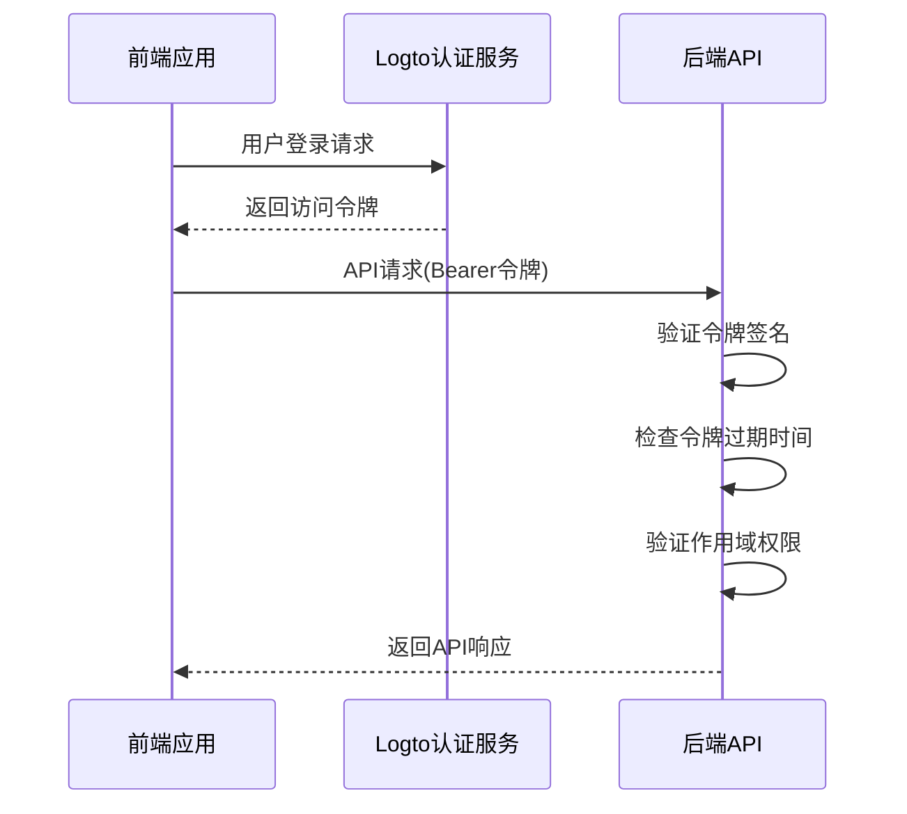
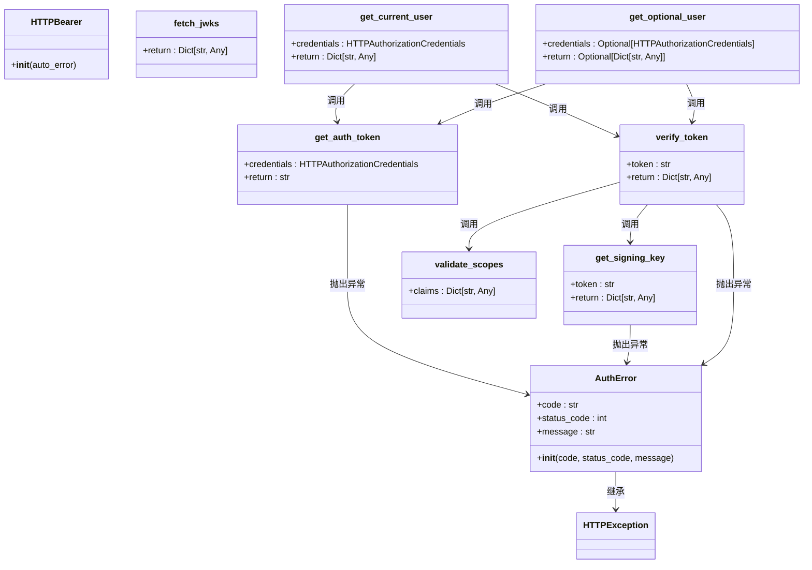
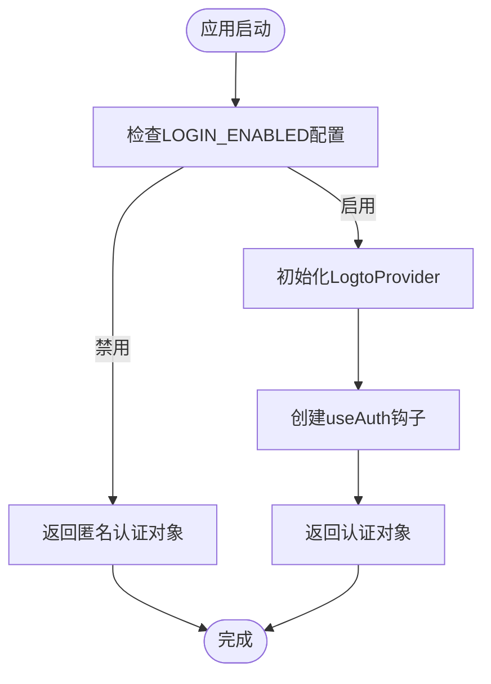
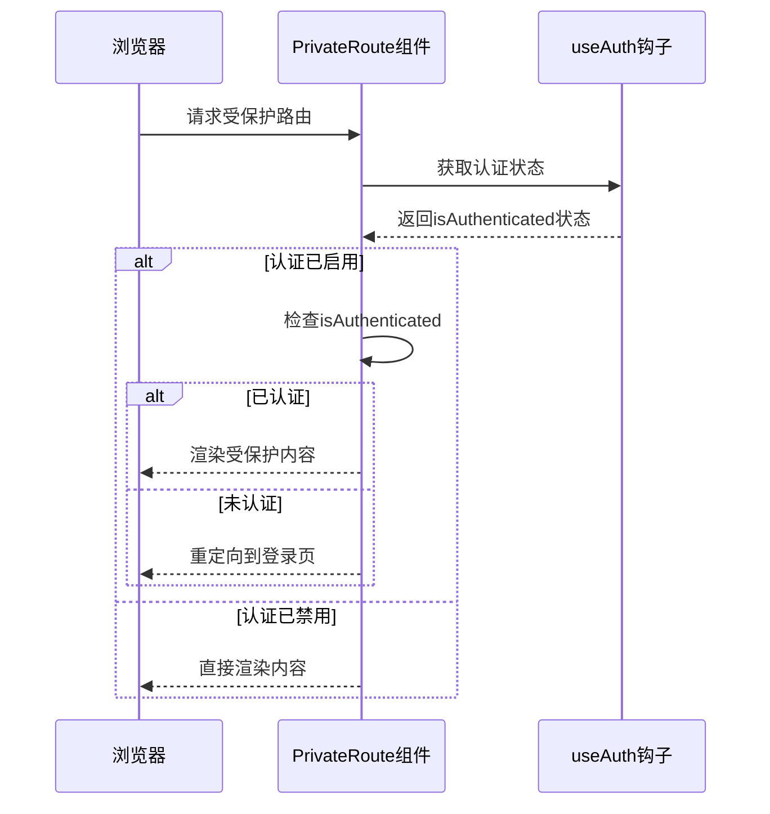
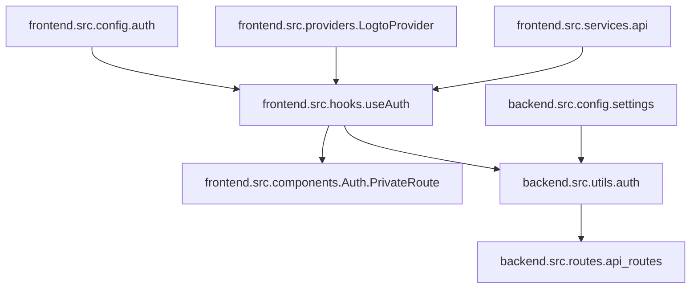

# 认证与授权

<cite>
**本文档引用的文件**
- [auth.py](file://backend/src/utils/auth.py)
- [useAuth.js](file://frontend/src/hooks/useAuth.js)
- [PrivateRoute.jsx](file://frontend/src/components/Auth/PrivateRoute.jsx)
- [auth.js](file://frontend/src/config/auth.js)
- [settings.py](file://backend/src/config/settings.py)
- [LogtoProvider.jsx](file://frontend/src/providers/LogtoProvider.jsx)
- [Callback.jsx](file://frontend/src/pages/Callback.jsx)
- [api.js](file://frontend/src/services/api.js)
- [.env.template](file://backend/.env.template)
</cite>

## 目录
1. [简介](#简介)
2. [项目结构](#项目结构)
3. [核心组件](#核心组件)
4. [架构概述](#架构概述)
5. [详细组件分析](#详细组件分析)
6. [依赖分析](#依赖分析)
7. [性能考虑](#性能考虑)
8. [故障排除指南](#故障排除指南)
9. [结论](#结论)

## 简介
本文档全面记录了基于JWT的认证授权体系，详细说明了系统中认证与授权的实现机制。该系统采用Logto OAuth 2.0集成方案，实现了前后端分离的认证架构。后端通过验证JWT令牌进行身份认证，前端通过useAuth.js钩子统一管理认证状态，并支持匿名模式切换。系统提供了完整的路由守卫机制和权限控制策略，确保了应用的安全性。文档还包含了环境变量配置指南、安全最佳实践以及常见认证失败场景的排查方法。

## 项目结构
本项目采用前后端分离的架构，后端基于FastAPI框架，前端基于React框架。认证相关代码分布在前后端的不同目录中。

**图示来源**
- [auth.py](file://backend/src/utils/auth.py#L1-L191)
- [useAuth.js](file://frontend/src/hooks/useAuth.js#L1-L30)
- [PrivateRoute.jsx](file://frontend/src/components/Auth/PrivateRoute.jsx#L1-L32)
- [LogtoProvider.jsx](file://frontend/src/providers/LogtoProvider.jsx#L1-L34)
- [Callback.jsx](file://frontend/src/pages/Callback.jsx#L1-L44)

**本节来源**
- [auth.py](file://backend/src/utils/auth.py#L1-L191)
- [useAuth.js](file://frontend/src/hooks/useAuth.js#L1-L30)
- [PrivateRoute.jsx](file://frontend/src/components/Auth/PrivateRoute.jsx#L1-L32)

## 核心组件
系统的核心认证组件包括后端的JWT验证机制和前端的认证状态管理。后端通过auth.py文件中的get_current_user和get_optional_user函数实现依赖注入，这些函数负责令牌提取、JWKS密钥获取、签名验证和声明校验。前端通过useAuth.js钩子统一处理认证状态，并支持匿名模式切换。PrivateRoute组件实现了路由守卫逻辑，确保只有经过认证的用户才能访问受保护的路由。

**本节来源**
- [auth.py](file://backend/src/utils/auth.py#L1-L191)
- [useAuth.js](file://frontend/src/hooks/useAuth.js#L1-L30)
- [PrivateRoute.jsx](file://frontend/src/components/Auth/PrivateRoute.jsx#L1-L32)

## 架构概述
系统采用基于JWT的无状态认证架构，前后端通过OAuth 2.0协议进行安全通信。前端通过LogtoProvider初始化认证配置，用户登录后获取访问令牌，该令牌通过HTTP Authorization头发送到后端。后端验证令牌的有效性，包括签名验证、过期检查和作用域验证。

**图示来源**
- [auth.py](file://backend/src/utils/auth.py#L1-L191)
- [useAuth.js](file://frontend/src/hooks/useAuth.js#L1-L30)
- [LogtoProvider.jsx](file://frontend/src/providers/LogtoProvider.jsx#L1-L34)

## 详细组件分析

### 后端认证组件分析
后端认证组件实现了完整的JWT验证流程，包括令牌提取、JWKS密钥获取、签名验证和声明校验。

#### 认证类图

**图示来源**
- [auth.py](file://backend/src/utils/auth.py#L1-L191)

**本节来源**
- [auth.py](file://backend/src/utils/auth.py#L1-L191)
- [settings.py](file://backend/src/config/settings.py#L1-L81)

### 前端认证组件分析
前端认证组件通过React Hooks和高阶组件实现认证状态的统一管理。

#### 前端认证流程图

**图示来源**
- [useAuth.js](file://frontend/src/hooks/useAuth.js#L1-L30)
- [auth.js](file://frontend/src/config/auth.js#L1-L4)
- [LogtoProvider.jsx](file://frontend/src/providers/LogtoProvider.jsx#L1-L34)

**本节来源**
- [useAuth.js](file://frontend/src/hooks/useAuth.js#L1-L30)
- [auth.js](file://frontend/src/config/auth.js#L1-L4)
- [LogtoProvider.jsx](file://frontend/src/providers/LogtoProvider.jsx#L1-L34)

### 路由守卫组件分析
PrivateRoute组件实现了路由级别的访问控制，确保只有经过认证的用户才能访问受保护的页面。

#### 路由守卫序列图

**图示来源**
- [PrivateRoute.jsx](file://frontend/src/components/Auth/PrivateRoute.jsx#L1-L32)
- [useAuth.js](file://frontend/src/hooks/useAuth.js#L1-L30)

**本节来源**
- [PrivateRoute.jsx](file://frontend/src/components/Auth/PrivateRoute.jsx#L1-L32)
- [useAuth.js](file://frontend/src/hooks/useAuth.js#L1-L30)

## 依赖分析
系统中的认证组件具有清晰的依赖关系，前后端通过标准的HTTP协议进行通信，降低了耦合度。

**图示来源**
- [auth.py](file://backend/src/utils/auth.py#L1-L191)
- [useAuth.js](file://frontend/src/hooks/useAuth.js#L1-L30)
- [settings.py](file://backend/src/config/settings.py#L1-L81)
- [api_routes.py](file://backend/src/routes/api_routes.py#L1-L200)

**本节来源**
- [auth.py](file://backend/src/utils/auth.py#L1-L191)
- [useAuth.js](file://frontend/src/hooks/useAuth.js#L1-L30)
- [settings.py](file://backend/src/config/settings.py#L1-L81)

## 性能考虑
系统的认证机制在设计时考虑了性能优化，主要体现在以下几个方面：

1. **JWKS缓存机制**：后端使用@lru_cache装饰器缓存JWKS密钥，避免了频繁的网络请求，提高了令牌验证的效率。
2. **异步处理**：前端的认证操作采用异步方式，避免了阻塞主线程，提升了用户体验。
3. **条件加载**：当认证功能禁用时，系统会返回轻量级的匿名认证对象，减少了不必要的计算开销。
4. **错误重试机制**：当JWKS密钥轮换时，系统会自动清除缓存并重新获取，确保了认证的可靠性。

这些优化措施确保了认证系统在高并发场景下的稳定性和响应速度。

## 故障排除指南
以下是常见认证失败场景及其排查方法：

**本节来源**
- [auth.py](file://backend/src/utils/auth.py#L1-L191)
- [useAuth.js](file://frontend/src/hooks/useAuth.js#L1-L30)
- [Callback.jsx](file://frontend/src/pages/Callback.jsx#L1-L44)
- [.env.template](file://backend/.env.template#L1-L86)

### 认证失败场景及解决方案

| 错误代码 | 错误描述 | 可能原因 | 解决方案 |
|---------|---------|---------|---------|
| auth.authorization_header_missing | 缺少授权头 | 请求未包含Authorization头 | 确保前端在请求中正确添加Bearer令牌 |
| auth.authorization_token_type_not_supported | 不支持的令牌类型 | 授权头scheme不是Bearer | 检查前端代码，确保使用Bearer方案 |
| auth.token_expired | 令牌已过期 | JWT令牌的exp声明已过期 | 用户重新登录获取新令牌 |
| auth.invalid_token | 无效令牌 | 令牌签名验证失败或格式错误 | 检查Logto配置和JWKS端点 |
| auth.insufficient_scope | 作用域不足 | 令牌缺少必要的作用域 | 检查LOGTO_REQUIRED_SCOPES配置 |
| auth.invalid_claims | 声明无效 | 令牌的aud或iss声明不匹配 | 验证LOGTO_AUDIENCE和LOGTO_ISSUER配置 |

### 环境变量配置指南
系统通过环境变量进行认证相关的配置，主要配置项包括：

- **LOGTO_ISSUER**: Logto服务的发行者标识符
- **LOGTO_JWKS_URI**: Logto JWKS密钥端点URL
- **LOGTO_AUDIENCE**: 令牌的受众标识符
- **ENABLE_LOGIN**: 是否启用登录功能
- **LOGTO_REQUIRED_SCOPES**: 要求的作用域列表
- **VITE_LOGTO_ENDPOINT**: 前端Logto端点
- **VITE_LOGTO_APP_ID**: 前端应用ID
- **VITE_API_RESOURCE**: API资源标识符

这些配置需要在后端的.env文件和前端的.env文件中正确设置。

### 安全最佳实践
为确保系统的安全性，建议遵循以下最佳实践：

1. **令牌存储**：前端应将访问令牌存储在内存中，避免使用localStorage，防止XSS攻击。
2. **CSRF防护**：使用SameSite Cookie策略和CSRF令牌来防止跨站请求伪造攻击。
3. **会话管理**：实现合理的会话超时机制，定期刷新令牌。
4. **HTTPS**：始终使用HTTPS协议传输认证信息。
5. **最小权限原则**：为令牌分配最小必要的作用域权限。
6. **监控和日志**：记录认证相关的安全事件，便于审计和故障排查。

## 结论
本文档全面记录了基于JWT的认证授权体系，详细说明了系统中各个认证组件的实现机制和相互关系。系统采用现代化的无状态认证架构，通过前后端的紧密配合，实现了安全、高效的身份验证和权限控制。通过合理的配置和最佳实践，可以确保系统的安全性和可靠性。建议在生产环境中严格遵循安全最佳实践，并定期审查和更新认证配置。