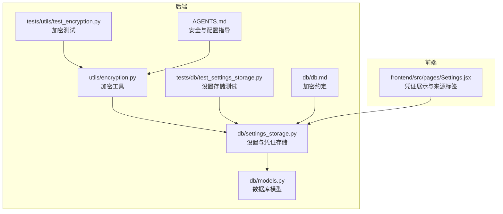
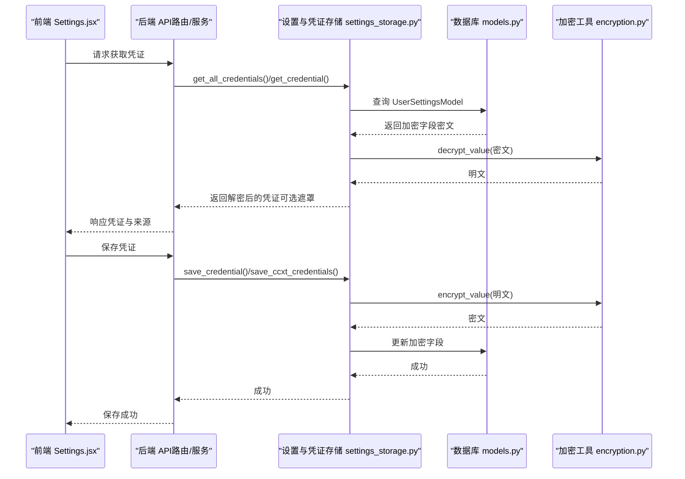
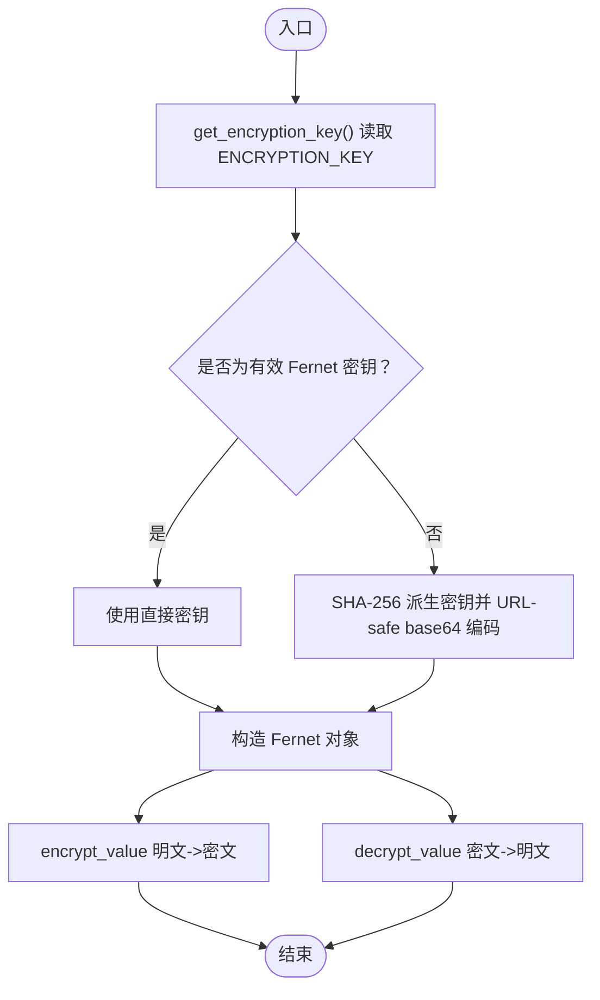
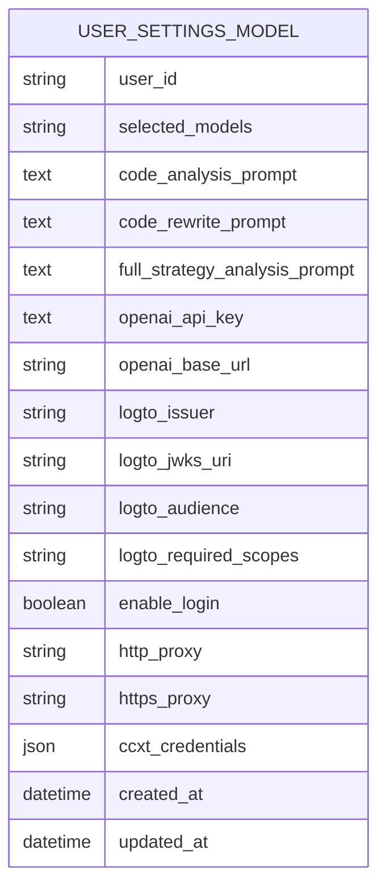
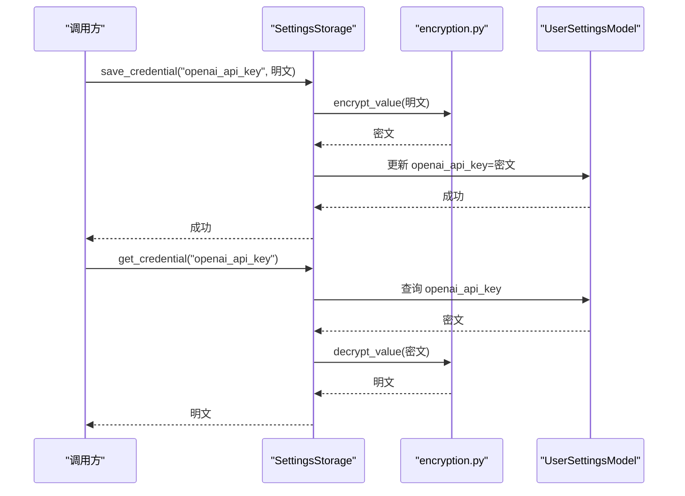
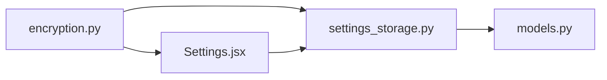

# 凭证与数据加密

<cite>
**本文引用的文件**
- [encryption.py](file://backend/src/utils/encryption.py)
- [models.py](file://backend/src/db/models.py)
- [settings_storage.py](file://backend/src/db/settings_storage.py)
- [test_encryption.py](file://backend/tests/utils/test_encryption.py)
- [test_settings_storage.py](file://backend/tests/db/test_settings_storage.py)
- [db.md](file://backend/src/db/db.md)
- [AGENTS.md](file://AGENTS.md)
- [Settings.jsx](file://frontend/src/pages/Settings.jsx)
</cite>

## 目录
1. [简介](#简介)
2. [项目结构](#项目结构)
3. [核心组件](#核心组件)
4. [架构总览](#架构总览)
5. [详细组件分析](#详细组件分析)
6. [依赖关系分析](#依赖关系分析)
7. [性能考量](#性能考量)
8. [故障排查指南](#故障排查指南)
9. [结论](#结论)
10. [附录](#附录)

## 简介
本文件系统性阐述系统的敏感数据加密机制，重点围绕基于 cryptography.fernet 的 Fernet 对称加密实现，覆盖以下方面：
- 基于 ENCRYPTION_KEY 环境变量的密钥管理与两种密钥模式（直接 Fernet 密钥与 SHA-256 派生密钥）
- encrypt_value 与 decrypt_value 的加解密流程
- mask_credential 在 UI 层面的凭证遮罩显示
- 数据库层使用 encrypted_column 字段的持久化前后加密流程
- 从 AGENTS.md 中关于 secrets 必须置于环境变量的指导
- 加密功能启用状态检测 is_encryption_enabled 与密钥生成工具 generate_encryption_key 的使用方法
- 密钥泄露风险警示：一旦泄露，所有加密数据将被暴露

## 项目结构
与加密相关的核心位置如下：
- 后端工具层：backend/src/utils/encryption.py 提供加密、解密、密钥派生、遮罩与状态检测
- 数据库模型层：backend/src/db/models.py 定义 UserSettingsModel 的加密字段
- 数据库访问层：backend/src/db/settings_storage.py 实现设置与凭证的保存、读取、遮罩与来源回退
- 测试用例：backend/tests/utils/test_encryption.py 与 backend/tests/db/test_settings_storage.py 验证加解密与持久化行为
- 文档约定：backend/src/db/db.md 明确敏感数据必须加密存储
- 安全指导：AGENTS.md 强调 secrets 必须放在环境变量中
- 前端展示：frontend/src/pages/Settings.jsx 使用遮罩显示与来源标签

图表来源
- [encryption.py](file://backend/src/utils/encryption.py#L1-L218)
- [models.py](file://backend/src/db/models.py#L637-L669)
- [settings_storage.py](file://backend/src/db/settings_storage.py#L1-L759)
- [test_encryption.py](file://backend/tests/utils/test_encryption.py#L1-L66)
- [test_settings_storage.py](file://backend/tests/db/test_settings_storage.py#L1-L40)
- [db.md](file://backend/src/db/db.md#L18-L23)
- [AGENTS.md](file://AGENTS.md#L41-L45)
- [Settings.jsx](file://frontend/src/pages/Settings.jsx#L193-L204)

章节来源
- [encryption.py](file://backend/src/utils/encryption.py#L1-L218)
- [models.py](file://backend/src/db/models.py#L637-L669)
- [settings_storage.py](file://backend/src/db/settings_storage.py#L1-L759)
- [test_encryption.py](file://backend/tests/utils/test_encryption.py#L1-L66)
- [test_settings_storage.py](file://backend/tests/db/test_settings_storage.py#L1-L40)
- [db.md](file://backend/src/db/db.md#L18-L23)
- [AGENTS.md](file://AGENTS.md#L41-L45)
- [Settings.jsx](file://frontend/src/pages/Settings.jsx#L193-L204)

## 核心组件
- 加密工具模块（encryption.py）
  - get_encryption_key：从 ENCRYPTION_KEY 获取密钥，支持直接 Fernet 密钥与 SHA-256 派生密钥两种模式
  - encrypt_value / decrypt_value：对敏感值进行加解密
  - mask_credential：UI 层遮罩显示，避免明文泄露
  - is_encryption_enabled：检查加密是否可用
  - generate_encryption_key：生成新的 Fernet 密钥
- 数据库模型（models.py）
  - UserSettingsModel 中定义了加密字段（如 openai_api_key），注释明确“所有凭证字段使用 Fernet 加密”
- 设置与凭证存储（settings_storage.py）
  - 保存时对敏感字段进行加密；读取时自动解密
  - 支持从数据库或 .env 回退读取
  - 提供遮罩显示与来源标记
- 前端展示（Settings.jsx）
  - 加载凭证时对敏感值进行遮罩显示
  - 展示来源标签（Database 或 .env）

章节来源
- [encryption.py](file://backend/src/utils/encryption.py#L27-L218)
- [models.py](file://backend/src/db/models.py#L637-L669)
- [settings_storage.py](file://backend/src/db/settings_storage.py#L264-L759)
- [Settings.jsx](file://frontend/src/pages/Settings.jsx#L193-L204)

## 架构总览
下图展示了从 UI 到数据库的凭证加密与显示流程，以及密钥来源与错误处理路径：

图表来源
- [settings_storage.py](file://backend/src/db/settings_storage.py#L264-L759)
- [models.py](file://backend/src/db/models.py#L637-L669)
- [encryption.py](file://backend/src/utils/encryption.py#L79-L137)
- [Settings.jsx](file://frontend/src/pages/Settings.jsx#L193-L204)

## 详细组件分析

### 组件A：加密工具（encryption.py）
- get_encryption_key
  - 优先尝试将 ENCRYPTION_KEY 视为 Fernet 密钥（URL-safe base64，必要时自动补位），长度为 32 字节
  - 若不是有效 Fernet 密钥格式，则使用 SHA-256 对原始字符串进行派生，再转换为 URL-safe base64 作为 Fernet 密钥
  - 未设置或格式无效时抛出异常
- encrypt_value / decrypt_value
  - encrypt_value：对明文进行 UTF-8 编码后加密，返回 base64 字符串；空输入返回 None
  - decrypt_value：对密文进行解密，返回 UTF-8 解码后的明文；空输入返回 None；InvalidToken 抛出特定错误
- mask_credential
  - 对敏感值进行 UI 层遮罩：保留前缀与末尾字符，中间以 x 替代；短文本则全部遮罩
- is_encryption_enabled
  - 尝试解析密钥，成功返回 True，否则 False
- generate_encryption_key
  - 生成新的 Fernet 密钥（base64 字符串），用于初始化部署

图表来源
- [encryption.py](file://backend/src/utils/encryption.py#L27-L137)

章节来源
- [encryption.py](file://backend/src/utils/encryption.py#L27-L218)
- [test_encryption.py](file://backend/tests/utils/test_encryption.py#L1-L66)

### 组件B：数据库模型（models.py）
- UserSettingsModel 中的加密字段
  - openai_api_key：注释明确为“加密 API Key”，存储为 Text 类型（base64 密文）
  - ccxt_credentials：JSON 结构，内部包含各交易所 paper/live 模式的 api_key/secret/passphrase，均以密文形式存储
- 其他字段（如 base_url、issuer、jwks_uri、audience、scopes、enable_login、proxy 等）未标注加密，按明文存储

图表来源
- [models.py](file://backend/src/db/models.py#L637-L669)

章节来源
- [models.py](file://backend/src/db/models.py#L637-L669)
- [db.md](file://backend/src/db/db.md#L18-L23)

### 组件C：设置与凭证存储（settings_storage.py）
- 保存凭证
  - save_credential：若字段属于敏感字段（如 openai_api_key），先 encrypt_value 再入库
  - save_ccxt_credentials：对 ccxt_credentials 内部的 api_key/secret/passphrase 分别加密后入库
- 读取凭证
  - get_credential：若字段敏感，先从数据库读取密文，再 decrypt_value 解密
  - get_all_credentials：聚合 openai/logto/proxies/exchanges 的凭证，支持遮罩与来源标记
- 来源回退
  - get_credential_with_fallback：优先数据库，其次 .env，最后 none
  - get_ccxt_credentials_all：优先数据库，其次 .env（CCXT_*_API_KEY/SECRET/PASSPHRASE），最后 none
- 敏感字段判定
  - _is_encrypted_field：仅 openai_api_key 明确为敏感字段；ccxt_credentials 内部字段由上层单独加密

图表来源
- [settings_storage.py](file://backend/src/db/settings_storage.py#L264-L759)
- [encryption.py](file://backend/src/utils/encryption.py#L79-L137)
- [models.py](file://backend/src/db/models.py#L637-L669)

章节来源
- [settings_storage.py](file://backend/src/db/settings_storage.py#L264-L759)
- [test_settings_storage.py](file://backend/tests/db/test_settings_storage.py#L1-L40)

### 组件D：UI 层遮罩与来源（Settings.jsx）
- 加载凭证时，前端会接收后端返回的 credentials 与 sources
- 对敏感字段（如 openai_api_key）进行遮罩显示，来源以标签展示（Database 或 .env）
- 支持“重置到 .env”操作，将字段回退至 .env 值

章节来源
- [Settings.jsx](file://frontend/src/pages/Settings.jsx#L193-L204)
- [Settings.jsx](file://frontend/src/pages/Settings.jsx#L258-L578)

## 依赖关系分析
- 模块耦合
  - settings_storage.py 依赖 encryption.py 进行加解密与遮罩
  - models.py 定义加密字段，settings_storage.py 通过 ORM 访问
  - 前端 Settings.jsx 依赖后端 API 提供的凭证与来源信息
- 外部依赖
  - cryptography.fernet：Fernet 对称加密
  - SQLAlchemy：ORM 与 JSON 字段
  - dotenv：加载 .env 文件（在 encryption.py 中显式调用）

图表来源
- [encryption.py](file://backend/src/utils/encryption.py#L1-L218)
- [settings_storage.py](file://backend/src/db/settings_storage.py#L1-L759)
- [models.py](file://backend/src/db/models.py#L1-L200)
- [Settings.jsx](file://frontend/src/pages/Settings.jsx#L1-L200)

章节来源
- [encryption.py](file://backend/src/utils/encryption.py#L1-L218)
- [settings_storage.py](file://backend/src/db/settings_storage.py#L1-L759)
- [models.py](file://backend/src/db/models.py#L1-L200)
- [Settings.jsx](file://frontend/src/pages/Settings.jsx#L1-L200)

## 性能考量
- 加密开销
  - Fernet 加解密为对称加密，CPU 开销与明文长度线性相关；对少量敏感字段影响有限
  - 建议仅对真正敏感字段（如 API Key/Secret）进行加密，避免对非敏感字段重复加解密
- 存储与索引
  - 加密字段为 Text/JSON 类型，注意查询与排序时不要对加密字段建立索引
- 并发与会话
  - settings_storage.py 使用 SQLAlchemy 会话管理，确保在多请求场景下正确关闭会话，避免连接泄漏

## 故障排查指南
- ENCRYPTION_KEY 未设置或格式无效
  - 现象：encrypt_value/decrypt_value 抛出异常；is_encryption_enabled 返回 False
  - 排查：确认 .env 中 ENCRYPTION_KEY 已设置；若使用字符串密钥，系统会自动派生为 Fernet 密钥
- 解密失败（InvalidToken）
  - 现象：decrypt_value 抛出“无效密钥或数据损坏”的错误
  - 排查：确认使用的密钥与加密时一致；检查密文是否被篡改或截断
- 密文未加密入库
  - 现象：数据库中 openai_api_key 仍为明文
  - 排查：确认 save_credential 调用路径；检查 _is_encrypted_field 判定逻辑
- UI 显示异常
  - 现象：遮罩未生效或来源标签不正确
  - 排查：确认后端返回 credentials 与 sources；前端渲染逻辑是否正确

章节来源
- [encryption.py](file://backend/src/utils/encryption.py#L27-L137)
- [test_encryption.py](file://backend/tests/utils/test_encryption.py#L1-L66)
- [settings_storage.py](file://backend/src/db/settings_storage.py#L264-L759)
- [test_settings_storage.py](file://backend/tests/db/test_settings_storage.py#L1-L40)

## 结论
本系统采用 Fernet 对称加密保障敏感凭证在存储与传输过程中的机密性。通过 ENCRYPTION_KEY 环境变量统一密钥来源，支持直接密钥与派生密钥两种模式，兼顾易用性与安全性。数据库层以 encrypted_column 字段承载密文，业务层在保存时加密、读取时解密，并在 UI 层以遮罩与来源标签增强可见性与可追溯性。遵循 AGENTS.md 的安全指导，将 secrets 严格置于环境变量中，是防止密钥泄露的关键防线。

## 附录

### 密钥生成与启用检测
- 生成新密钥
  - 使用 generate_encryption_key 输出新的 Fernet 密钥，将其写入 ENCRYPTION_KEY 环境变量
- 启用状态检测
  - is_encryption_enabled 可用于启动阶段快速判断密钥是否可用

章节来源
- [encryption.py](file://backend/src/utils/encryption.py#L184-L218)

### 最佳实践与风险警示
- 密钥管理
  - 仅将 ENCRYPTION_KEY 放置在受控的环境变量中，避免硬编码或提交到版本库
  - 更换密钥时，需重新加密数据库中所有敏感字段
- 安全建议
  - 限制密钥访问权限；定期轮换密钥
  - 对 .env 文件进行严格的文件系统权限控制
- 风险警示
  - 若 ENCRYPTION_KEY 泄露，攻击者可解密数据库中所有敏感字段，造成严重后果

章节来源
- [AGENTS.md](file://AGENTS.md#L41-L45)
- [encryption.py](file://backend/src/utils/encryption.py#L27-L77)