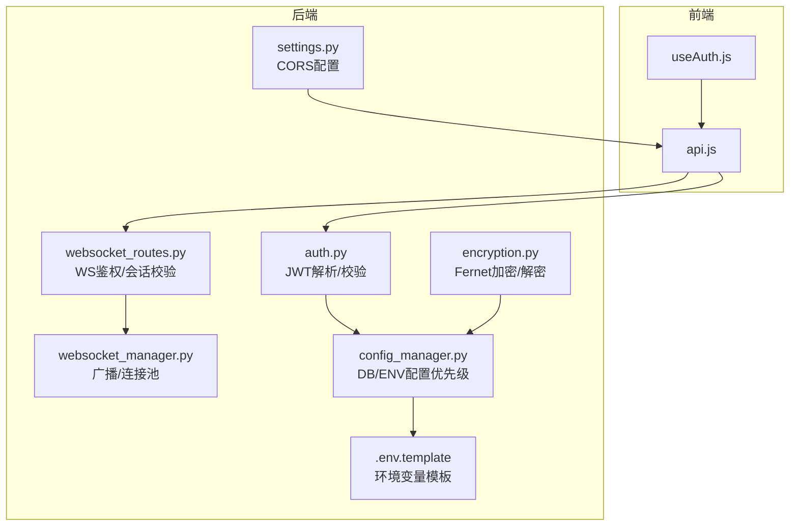
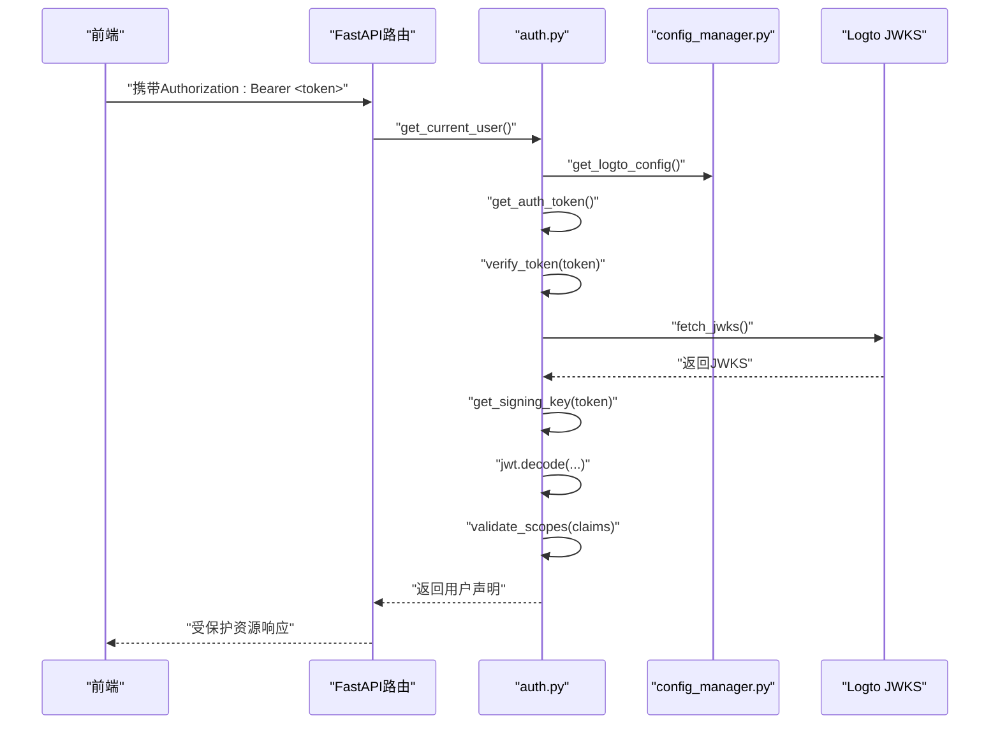
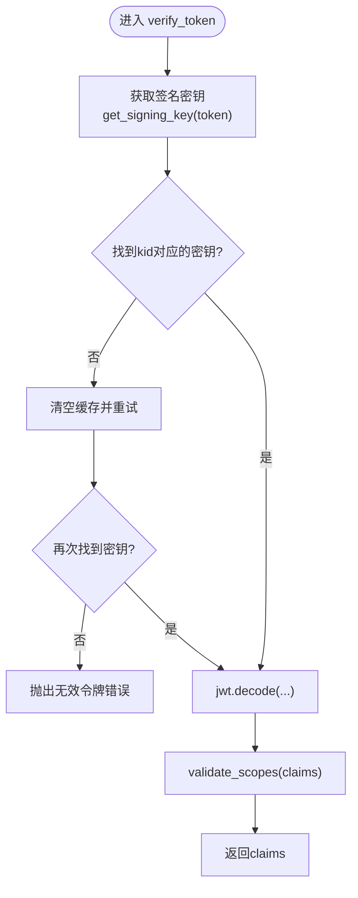
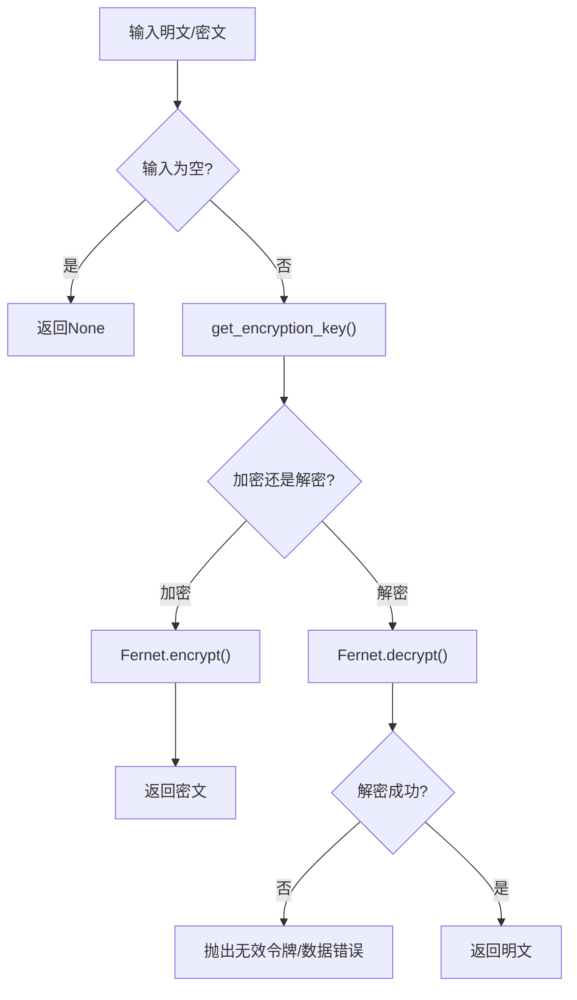
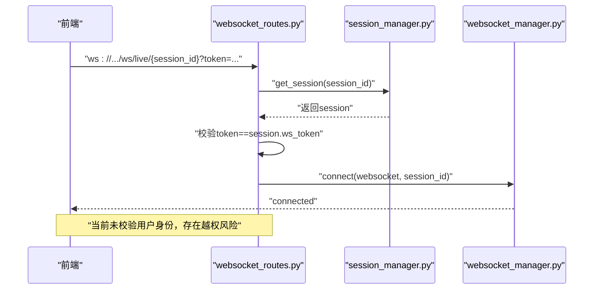
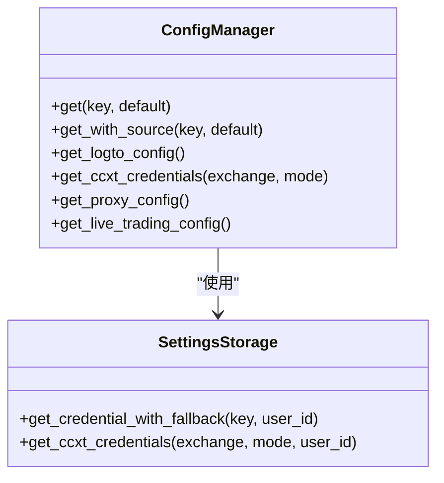
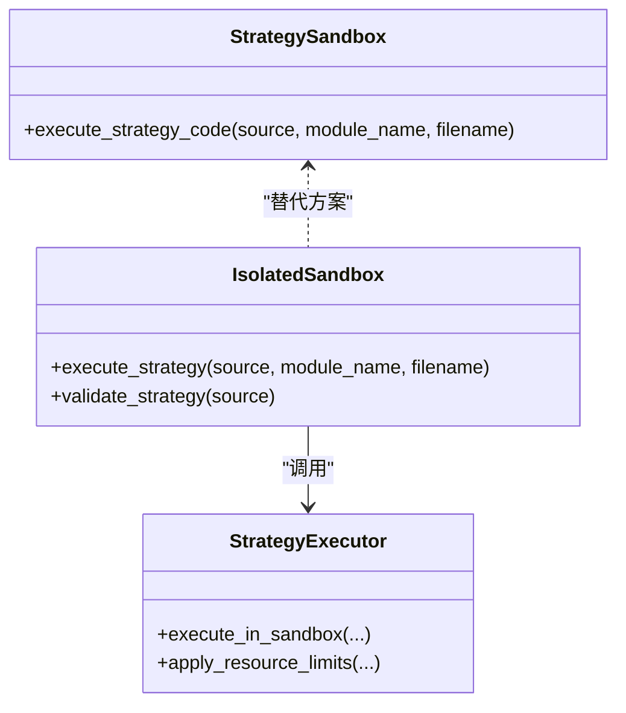
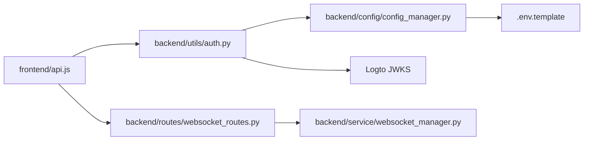

# 安全与认证

<cite>
**本文引用的文件**
- [auth.py](file://backend/src/utils/auth.py)
- [encryption.py](file://backend/src/utils/encryption.py)
- [websocket_routes.py](file://backend/src/routes/websocket_routes.py)
- [websocket_manager.py](file://backend/src/service/websocket_manager.py)
- [config_manager.py](file://backend/src/config/config_manager.py)
- [.env.template](file://backend/.env.template)
- [settings.py](file://backend/src/config/settings.py)
- [useAuth.js](file://frontend/src/hooks/useAuth.js)
- [api.js](file://frontend/src/services/api.js)
- [strategy_sandbox.py](file://backend/src/service/strategy_sandbox.py)
- [isolated_sandbox.py](file://backend/src/service/isolated_sandbox.py)
- [strategy_executor.py](file://backend/src/service/strategy_executor.py)
- [CodeReview_2025-12-19 .md](file://CodeReview_2025-12-19 .md)
</cite>

## 目录
1. [引言](#引言)
2. [项目结构](#项目结构)
3. [核心组件](#核心组件)
4. [架构总览](#架构总览)
5. [详细组件分析](#详细组件分析)
6. [依赖关系分析](#依赖关系分析)
7. [性能与安全特性](#性能与安全特性)
8. [故障排查指南](#故障排查指南)
9. [结论](#结论)
10. [附录](#附录)

## 引言
本文件系统性梳理后端的安全机制与认证方案，重点覆盖：
- JWT 认证与令牌验证流程（auth.py）
- 凭证加密与密钥管理（encryption.py）
- API 端点保护与依赖注入
- WebSocket 鉴权现状与风险
- 策略执行隔离与安全姿态
- 结合代码评审报告的安全短板与改进建议

目标读者包括开发者、运维与安全负责人，帮助在公网或多用户环境下部署时制定明确的安全加固步骤与风险提示。

## 项目结构
后端安全相关的关键位置：
- 认证与令牌验证：backend/src/utils/auth.py
- 凭证加密与遮罩：backend/src/utils/encryption.py
- WebSocket 路由与连接管理：backend/src/routes/websocket_routes.py、backend/src/service/websocket_manager.py
- 配置与凭据来源：backend/src/config/config_manager.py、backend/.env.template、backend/src/config/settings.py
- 前端鉴权集成：frontend/src/hooks/useAuth.js、frontend/src/services/api.js
- 策略执行隔离：backend/src/service/strategy_sandbox.py、backend/src/service/isolated_sandbox.py、backend/src/service/strategy_executor.py

图表来源
- [auth.py](file://backend/src/utils/auth.py#L1-L211)
- [encryption.py](file://backend/src/utils/encryption.py#L1-L218)
- [websocket_routes.py](file://backend/src/routes/websocket_routes.py#L1-L243)
- [websocket_manager.py](file://backend/src/service/websocket_manager.py#L1-L401)
- [config_manager.py](file://backend/src/config/config_manager.py#L1-L352)
- [.env.template](file://backend/.env.template#L1-L134)
- [settings.py](file://backend/src/config/settings.py#L43-L68)
- [useAuth.js](file://frontend/src/hooks/useAuth.js#L1-L30)
- [api.js](file://frontend/src/services/api.js#L1-L403)

章节来源
- [auth.py](file://backend/src/utils/auth.py#L1-L211)
- [encryption.py](file://backend/src/utils/encryption.py#L1-L218)
- [websocket_routes.py](file://backend/src/routes/websocket_routes.py#L1-L243)
- [websocket_manager.py](file://backend/src/service/websocket_manager.py#L1-L401)
- [config_manager.py](file://backend/src/config/config_manager.py#L1-L352)
- [.env.template](file://backend/.env.template#L1-L134)
- [settings.py](file://backend/src/config/settings.py#L43-L68)
- [useAuth.js](file://frontend/src/hooks/useAuth.js#L1-L30)
- [api.js](file://frontend/src/services/api.js#L1-L403)

## 核心组件
- JWT 认证与令牌验证：通过 Logto JWKS 动态拉取公钥，使用 python-jose 解码并校验签发者、受众、算法与作用域。
- 凭证加密：Fernet 对称加密，支持直接密钥或从任意字符串派生密钥，提供遮罩显示与密钥有效性检测。
- WebSocket 鉴权：基于会话令牌的简单校验，尚未实现用户级鉴权与授权。
- 配置与凭据来源：数据库优先，环境变量兜底，支持 Logto/JWKS/代理等配置项。
- 前端集成：根据登录开关动态启用/禁用登录流程，并自动在请求头注入 Bearer 令牌。

章节来源
- [auth.py](file://backend/src/utils/auth.py#L1-L211)
- [encryption.py](file://backend/src/utils/encryption.py#L1-L218)
- [websocket_routes.py](file://backend/src/routes/websocket_routes.py#L1-L243)
- [config_manager.py](file://backend/src/config/config_manager.py#L1-L352)
- [useAuth.js](file://frontend/src/hooks/useAuth.js#L1-L30)
- [api.js](file://frontend/src/services/api.js#L1-L403)

## 架构总览
后端采用 FastAPI 依赖注入实现端点保护，前端通过 Logto 获取访问令牌并自动附加到请求头。JWT 验证链路从 HTTP 头部提取 Bearer 令牌，解析头部 kid，从 JWKS 获取匹配密钥，再进行签名验证与作用域校验。凭证存储采用数据库加密，前端提供遮罩显示以降低泄露风险。

图表来源
- [auth.py](file://backend/src/utils/auth.py#L1-L211)
- [config_manager.py](file://backend/src/config/config_manager.py#L133-L166)
- [useAuth.js](file://frontend/src/hooks/useAuth.js#L1-L30)
- [api.js](file://frontend/src/services/api.js#L1-L403)

## 详细组件分析

### JWT 认证与令牌验证（auth.py）
- 令牌提取与校验：从 Authorization 头部提取 Bearer 令牌，校验 scheme 与非空。
- JWKS 拉取与缓存：从 Logto 配置中读取 JWKS 地址，带超时与代理支持，使用 LRU 缓存减少重复请求。
- 签名密钥匹配：从 JWT 头部获取 kid，在 JWKS 中查找匹配密钥；若未找到则清缓存重试一次。
- 令牌解码与校验：使用 python-jose 解码，校验算法、audience、issuer；支持可选的作用域校验。
- 用户依赖注入：提供 get_current_user/get_optional_user，支持登录开关与匿名模式。
- 异常映射：将底层异常映射为标准化错误码与消息，便于前端处理。

图表来源
- [auth.py](file://backend/src/utils/auth.py#L93-L169)

章节来源
- [auth.py](file://backend/src/utils/auth.py#L1-L211)

### 凭证加密与密钥管理（encryption.py）
- 密钥来源：从环境变量 ENCRYPTION_KEY 读取，支持直接 Fernet 密钥或从任意字符串派生（SHA-256 后 URL 安全 Base64 编码）。
- 加密/解密：使用 Fernet 对称加密，输入为空时返回 None；解密失败抛出标准化错误。
- 遮罩显示：mask_credential 提供安全的显示策略，避免泄露敏感信息。
- 密钥有效性检测：is_encryption_enabled 用于快速判断配置是否就绪。
- 生成新密钥：提供一键生成新密钥的工具函数，便于初始化。

图表来源
- [encryption.py](file://backend/src/utils/encryption.py#L27-L137)

章节来源
- [encryption.py](file://backend/src/utils/encryption.py#L1-L218)

### WebSocket 鉴权现状与风险
- 当前实现：WebSocket 路由仅校验会话是否存在与 ws_token 是否匹配，未进行用户级鉴权与授权。
- 风险：任意人可连接并订阅某 session 的实时仓位/订单/日志，存在信息泄露与越权风险。
- 建议：增加用户身份绑定（基于用户 ID 或会话属主），在连接建立时校验用户与会话归属关系。

图表来源
- [websocket_routes.py](file://backend/src/routes/websocket_routes.py#L152-L173)
- [websocket_manager.py](file://backend/src/service/websocket_manager.py#L45-L72)

章节来源
- [websocket_routes.py](file://backend/src/routes/websocket_routes.py#L1-L243)
- [websocket_manager.py](file://backend/src/service/websocket_manager.py#L1-L401)

### 配置与凭据来源（config_manager.py）
- DB 优先：优先从数据库表读取用户设置，支持 per-user 加密存储。
- 环境变量兜底：当数据库未配置时，回退到 .env 环境变量。
- Logto/JWKS/代理：集中读取 issuer、jwks_uri、audience、required_scopes、enable_login、HTTP/HTTPS 代理等。
- CCXT 凭证：支持从数据库 JSON 或环境变量读取，Paper/Live 模式分离。

图表来源
- [config_manager.py](file://backend/src/config/config_manager.py#L1-L352)

章节来源
- [config_manager.py](file://backend/src/config/config_manager.py#L1-L352)

### 前端认证集成（useAuth.js、api.js）
- useAuth：根据 LOGIN_ENABLED 返回匿名或 Logto 登录态；当关闭登录时返回占位对象。
- api.js：自动注入 Authorization: Bearer 头，401 时跳转至登录页；统一封装响应解析与错误处理。

章节来源
- [useAuth.js](file://frontend/src/hooks/useAuth.js#L1-L30)
- [api.js](file://frontend/src/services/api.js#L1-L403)

### CORS 配置与安全
- settings.py 从环境变量解析 CORS_ALLOW_ORIGINS、CORS_ALLOW_ORIGIN_REGEX、CORS_ALLOW_CREDENTIALS。
- .env.template 默认允许所有来源，生产环境应收紧为具体域名并谨慎使用 credentials。

章节来源
- [settings.py](file://backend/src/config/settings.py#L43-L68)
- [.env.template](file://backend/.env.template#L44-L54)

### 策略执行隔离与安全姿态
- 软沙箱（strategy_sandbox.py）：限制导入与内置，但允许 pandas/numpy 等库进行文件/资源访问，无法对抗恶意代码。
- 子进程沙箱（isolated_sandbox.py + strategy_executor.py）：通过受限导入、阻断危险属性访问、资源限制（内存/CPU/网络/文件写入）实现强隔离。
- 建议：在多用户在线编辑与执行策略场景，务必使用 subprocess/docker 模式并收紧网络与文件写入权限。

图表来源
- [strategy_sandbox.py](file://backend/src/service/strategy_sandbox.py#L1-L213)
- [isolated_sandbox.py](file://backend/src/service/isolated_sandbox.py#L1-L392)
- [strategy_executor.py](file://backend/src/service/strategy_executor.py#L1-L448)

章节来源
- [strategy_sandbox.py](file://backend/src/service/strategy_sandbox.py#L1-L213)
- [isolated_sandbox.py](file://backend/src/service/isolated_sandbox.py#L1-L392)
- [strategy_executor.py](file://backend/src/service/strategy_executor.py#L1-L448)

## 依赖关系分析
- 认证链路依赖配置管理器获取 Logto/JWKS/代理配置，JWKS 通过 requests 拉取，依赖网络与代理设置。
- WebSocket 路由依赖会话管理器与 WebSocket 管理器，当前仅基于会话令牌进行连接校验。
- 前端依赖登录开关与 Logto SDK 注入 token，api.js 统一处理 401 重定向。

图表来源
- [auth.py](file://backend/src/utils/auth.py#L1-L211)
- [config_manager.py](file://backend/src/config/config_manager.py#L133-L166)
- [websocket_routes.py](file://backend/src/routes/websocket_routes.py#L152-L173)
- [websocket_manager.py](file://backend/src/service/websocket_manager.py#L45-L72)
- [.env.template](file://backend/.env.template#L1-L134)
- [api.js](file://frontend/src/services/api.js#L1-L403)

章节来源
- [auth.py](file://backend/src/utils/auth.py#L1-L211)
- [config_manager.py](file://backend/src/config/config_manager.py#L1-L352)
- [websocket_routes.py](file://backend/src/routes/websocket_routes.py#L1-L243)
- [websocket_manager.py](file://backend/src/service/websocket_manager.py#L1-L401)
- [.env.template](file://backend/.env.template#L1-L134)
- [api.js](file://frontend/src/services/api.js#L1-L403)

## 性能与安全特性
- JWT 验证：fetch_jwks 使用 LRU 缓存，减少 JWKS 拉取开销；算法与 aud/iss 校验确保令牌可信。
- 凭证加密：Fernet 适合小规模敏感数据存储，配合遮罩显示降低泄露风险。
- WebSocket：连接池与广播逻辑支持多会话并行，但当前鉴权不足。
- CORS：生产环境应收紧来源列表，避免与 credentials 组合导致浏览器拒绝。

[本节为通用指导，无需特定文件来源]

## 故障排查指南
- JWT 401/403
  - 检查 Authorization 头是否为 Bearer 令牌，scheme 与 token 是否非空。
  - 确认 LOGTO_JWKS_URI 配置正确，网络可达，代理设置有效。
  - 校验 required_scopes 是否满足，audience/issuer 是否匹配。
  - 参考：[auth.py](file://backend/src/utils/auth.py#L38-L204)
- JWKS 拉取失败
  - 检查网络连通性与代理配置；查看 500 错误详情。
  - 参考：[auth.py](file://backend/src/utils/auth.py#L63-L91)
- 令牌过期或 Claims 校验失败
  - ExpiredSignatureError/InvalidClaimsError 映射为标准化错误码。
  - 参考：[auth.py](file://backend/src/utils/auth.py#L141-L169)
- 凭证解密失败
  - 检查 ENCRYPTION_KEY 是否设置且格式正确；确认密文未被篡改。
  - 参考：[encryption.py](file://backend/src/utils/encryption.py#L106-L137)
- WebSocket 连接被拒绝
  - 确认 ws_token 与 session.ws_token 匹配；检查 session 是否存在。
  - 参考：[websocket_routes.py](file://backend/src/routes/websocket_routes.py#L155-L169)
- CORS 跨域失败
  - 生产环境不要使用 "*" 与 credentials 同时开启；请设置具体来源。
  - 参考：[settings.py](file://backend/src/config/settings.py#L43-L68)，[CodeReview_2025-12-19 .md](file://CodeReview_2025-12-19 .md#L64-L69)

章节来源
- [auth.py](file://backend/src/utils/auth.py#L38-L204)
- [encryption.py](file://backend/src/utils/encryption.py#L106-L137)
- [websocket_routes.py](file://backend/src/routes/websocket_routes.py#L155-L169)
- [settings.py](file://backend/src/config/settings.py#L43-L68)
- [CodeReview_2025-12-19 .md](file://CodeReview_2025-12-19 .md#L64-L69)

## 结论
- 当前系统在认证方面采用标准 JWT 流程，具备良好的可扩展性与安全性基线。
- 凭证加密与遮罩显示形成闭环，配合 DB 优先的配置管理，降低了泄露与误配置风险。
- WebSocket 鉴权存在明显短板，需尽快引入用户级鉴权与授权校验。
- 策略执行隔离在多用户场景下至关重要，建议强制使用子进程/容器模式并收紧权限。
- CORS 配置需在生产环境收紧，避免浏览器拒绝与跨站风险。

[本节为总结，无需特定文件来源]

## 附录

### 安全最佳实践清单
- 环境变量保护
  - 不提交 .env 至版本库；使用 CI/CD 注入；定期轮换密钥。
  - 参考：[CodeReview_2025-12-19 .md](file://CodeReview_2025-12-19 .md#L48-L53)
- 最小权限原则
  - 交易所 API Key 仅授予必要权限；启用 IP 白名单与二次验证。
  - 参考：[CodeReview_2025-12-19 .md](file://CodeReview_2025-12-19 .md#L100-L110)
- 定期审计与安全更新
  - 定期扫描依赖漏洞；更新 python-jose、cryptography 等关键库。
  - 参考：[CodeReview_2025-12-19 .md](file://CodeReview_2025-12-19 .md#L108-L122)
- WebSocket 鉴权加固
  - 引入用户身份绑定与会话属主校验；限制订阅事件类型与频率。
  - 参考：[websocket_routes.py](file://backend/src/routes/websocket_routes.py#L152-L173)
- 策略执行隔离
  - 强制 SANDBOX_MODE=subprocess 或 docker；关闭网络与文件写入；设置超时与内存上限。
  - 参考：[strategy_sandbox.py](file://backend/src/service/strategy_sandbox.py#L1-L213)，[isolated_sandbox.py](file://backend/src/service/isolated_sandbox.py#L1-L392)
- CORS 安全
  - 生产环境仅允许指定域名；避免 "*" 与 credentials 同时使用。
  - 参考：[settings.py](file://backend/src/config/settings.py#L43-L68)，[CodeReview_2025-12-19 .md](file://CodeReview_2025-12-19 .md#L64-L69)

### 部署风险提示（公网/多用户）
- 若启用登录，请确保：
  - Logto JWKS 可达且代理配置正确
  - required_scopes 与 audience/issuer 配置一致
  - ENCRYPTION_KEY 安全存储与轮换
- WebSocket 未实现用户级鉴权，存在越权订阅风险，建议立即修复
- 策略沙箱为“软隔离”，不适用于不可信代码；建议强制使用子进程/容器模式

章节来源
- [CodeReview_2025-12-19 .md](file://CodeReview_2025-12-19 .md#L44-L69)
- [auth.py](file://backend/src/utils/auth.py#L63-L169)
- [encryption.py](file://backend/src/utils/encryption.py#L27-L137)
- [websocket_routes.py](file://backend/src/routes/websocket_routes.py#L152-L173)
- [strategy_sandbox.py](file://backend/src/service/strategy_sandbox.py#L1-L213)
- [isolated_sandbox.py](file://backend/src/service/isolated_sandbox.py#L1-L392)
- [settings.py](file://backend/src/config/settings.py#L43-L68)