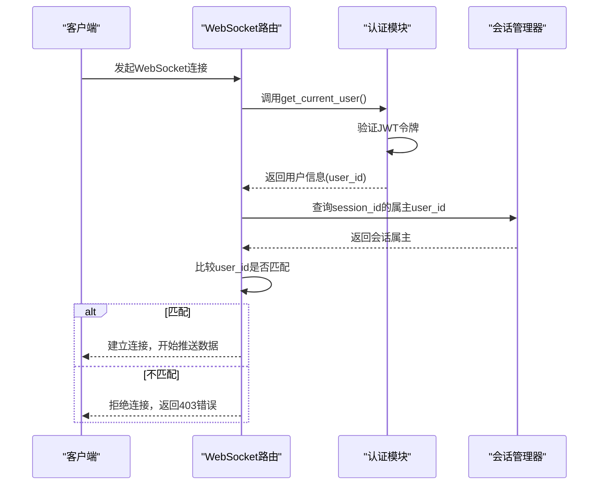
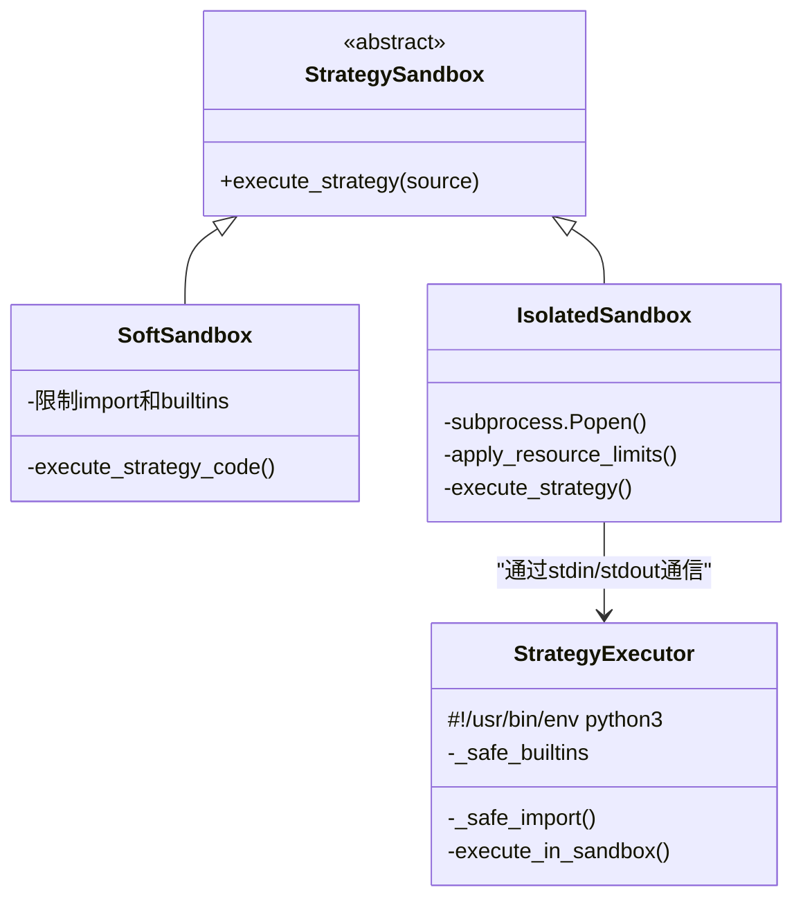

# 安全最佳实践与风险评估

<cite>
**本文档引用文件**  
- [CodeReview_2025-12-19 .md](file://CodeReview_2025-12-19 .md)
- [backend/.env.template](file://backend/.env.template)
- [backend/src/service/app.py](file://backend/src/service/app.py)
- [backend/src/routes/websocket_routes.py](file://backend/src/routes/websocket_routes.py)
- [backend/src/service/strategy_sandbox.py](file://backend/src/service/strategy_sandbox.py)
- [backend/src/utils/auth.py](file://backend/src/utils/auth.py)
- [backend/src/service/session_manager.py](file://backend/src/service/session_manager.py)
- [backend/src/service/isolated_sandbox.py](file://backend/src/service/isolated_sandbox.py)
- [backend/src/service/strategy_executor.py](file://backend/src/service/strategy_executor.py)
- [backend/src/config/settings.py](file://backend/src/config/settings.py)
</cite>

## 目录
1. [引言](#引言)
2. [主要安全风险分析](#主要安全风险分析)
3. [安全加固措施](#安全加固措施)
4. [安全审计清单](#安全审计清单)
5. [Docker安全配置建议](#docker安全配置建议)
6. [安全事件响应流程](#安全事件响应流程)

## 引言

本指南基于《项目代码评审报告（中文）》中的安全审查结果，旨在为backtrader量化交易平台提供全面的安全加固方案。当前系统在架构和功能上表现良好，但在安全防护方面存在明显短板，特别是在WebSocket实时接口认证、用户策略代码执行隔离以及敏感配置管理等方面。本指南将系统性地识别主要风险，并提供具体的缓解措施、审计清单和应急响应流程，以确保系统在公网部署时具备足够的安全防护能力。

## 主要安全风险分析

根据代码审查报告，系统存在以下三个主要安全风险：

### WebSocket实时接口缺乏认证授权

当前WebSocket接口存在严重的安全漏洞。`backend/src/routes/websocket_routes.py`文件中的路由仅检查会话是否存在，而未对连接请求进行身份验证和授权。这意味着任何用户都可以连接到WebSocket服务，并订阅任意会话的实时数据流，包括仓位、订单和日志等敏感信息，导致严重的越权访问和信息泄露风险。

### 用户策略代码执行未完全隔离（沙箱逃逸风险）

系统通过`backend/src/service/strategy_sandbox.py`实现策略代码的沙箱执行，但当前的“软隔离”机制存在沙箱逃逸风险。该机制通过限制`import`和内置函数来约束代码执行，但允许使用`pandas`、`numpy`等可进行文件系统和资源访问的库。此外，Python的反射和对象图特性可能被恶意代码利用来绕过限制。一旦用户上传包含恶意代码的策略，攻击者可能读写服务器文件、消耗系统资源，甚至进一步进行权限提升。

### 敏感配置暴露的可能性

项目存在敏感配置泄露的风险。审查发现，`backend/.env`文件被错误地提交到了版本库中，其中包含用于加密数据库凭证的`ENCRYPTION_KEY`。一旦该密钥泄露，攻击者即可解密数据库中存储的所有加密凭证（如交易所API密钥），造成“全盘失守”的严重后果。此外，`backend/trading_sessions.db`等运行时数据也被提交，进一步增加了数据泄露和合规风险。

**Section sources**
- [CodeReview_2025-12-19 .md](file://CodeReview_2025-12-19 .md#L48-L67)
- [backend/src/routes/websocket_routes.py](file://backend/src/routes/websocket_routes.py)
- [backend/src/service/strategy_sandbox.py](file://backend/src/service/strategy_sandbox.py)
- [backend/.env.template](file://backend/.env.template)

## 安全加固措施

针对上述风险，提出以下具体的缓解措施。

### 为WebSocket连接添加JWT令牌验证中间件

必须为WebSocket连接强制实施JWT令牌验证。系统已通过`backend/src/utils/auth.py`实现了基于`python-jose`库的JWT验证逻辑，该逻辑从数据库或环境变量中加载Logto配置，并通过JWKS端点验证令牌。

加固措施如下：
1.  **修改WebSocket路由**：在`websocket_routes.py`中，为WebSocket连接端点添加一个依赖项，强制要求有效的JWT令牌。
2.  **会话授权检查**：在建立WebSocket连接后，验证客户端提供的JWT令牌中的`user_id`是否与请求订阅的`session_id`的属主`user_id`匹配。此信息可在`backend/src/service/session_manager.py`的`TradingSession`类中找到。
3.  **使用现有认证模块**：直接复用`auth.py`中定义的`get_current_user`或`get_optional_user`依赖项，确保认证逻辑的一致性和可靠性。

**Diagram sources**
- [backend/src/routes/websocket_routes.py](file://backend/src/routes/websocket_routes.py)
- [backend/src/utils/auth.py](file://backend/src/utils/auth.py)
- [backend/src/service/session_manager.py](file://backend/src/service/session_manager.py)

### 强化strategy_sandbox.py以限制导入和系统调用

必须将策略执行的隔离级别从“软隔离”升级为“强隔离”。系统已提供`backend/src/service/isolated_sandbox.py`作为更安全的替代方案，它通过在独立的子进程中执行代码来实现物理隔离。

加固措施如下：
1.  **启用子进程沙箱**：在`.env.template`文件中，将`SANDBOX_MODE`的默认值从`soft`修改为`subprocess`。
2.  **配置资源限制**：利用`.env.template`中提供的`SANDBOX_MAX_MEMORY_MB`、`SANDBOX_TIMEOUT_SECONDS`等环境变量，严格限制沙箱进程的内存、CPU和执行时间。
3.  **禁用网络和文件写入**：将`SANDBOX_ALLOW_NETWORK`和`SANDBOX_ALLOW_FILE_WRITE`设置为`false`，以防止恶意代码进行网络通信或写入文件系统。
4.  **更新执行引擎**：修改`backend/src/service/backtest_engine.py`和`live_engine.py`，使其优先使用`IsolatedSandbox`而非`execute_strategy_code`。

**Diagram sources**
- [backend/src/service/strategy_sandbox.py](file://backend/src/service/strategy_sandbox.py)
- [backend/src/service/isolated_sandbox.py](file://backend/src/service/isolated_sandbox.py)
- [backend/src/service/strategy_executor.py](file://backend/src/service/strategy_executor.py)
- [backend/.env.template](file://backend/.env.template)

### 确保所有密钥通过.env.template定义并通过环境变量注入

必须建立安全的密钥管理流程，杜绝敏感信息硬编码或提交到代码库。

加固措施如下：
1.  **使用模板文件**：所有敏感配置（如API密钥、数据库URL、加密密钥）必须在`backend/.env.template`中定义，但不提供实际值。
2.  **环境变量注入**：在部署时，创建`.env`文件并填入实际值，然后通过环境变量注入到应用中。`backend/src/config/settings.py`负责从环境变量中读取这些值。
3.  **配置优先级**：遵循“数据库优先，环境变量兜底”的原则。`backend/src/config/config_manager.py`实现了此逻辑，允许用户通过UI配置凭证，同时兼容`.env`文件。
4.  **最小权限原则**：为交易所API密钥配置只读或限定交易权限。在`.env.template`的注释中明确建议：“For live trading, create API keys with: - Trading permissions ONLY (no withdrawal permissions) - IP whitelist restrictions if possible”。

**Section sources**
- [backend/.env.template](file://backend/.env.template)
- [backend/src/config/settings.py](file://backend/src/config/settings.py)
- [backend/src/config/config_manager.py](file://backend/src/config/config_manager.py)

## 安全审计清单

为确保系统长期安全，建议定期执行以下审计任务：

| 审计项目 | 频率 | 负责人 | 说明 |
| :--- | :--- | :--- | :--- |
| 轮换加密密钥 | 每季度 | 系统管理员 | 轮换`ENCRYPTION_KEY`，并重新加密数据库中的所有凭证。 |
| 检查版本库 | 每日 | 开发团队 | 确保`.env`、`.db`、`__pycache__`等文件未被提交。 |
| 监控异常登录 | 实时 | 安全团队 | 监控`auth.py`中的认证失败日志，检测暴力破解或异常IP登录。 |
| 更新依赖库 | 每月 | 开发团队 | 使用`pip`检查`requirements.txt`中的库是否有安全更新。 |
| 审查API密钥 | 每季度 | 运维团队 | 检查所有交易所API密钥的权限和IP白名单设置。 |

## Docker安全配置建议

对于公网部署的Docker环境，建议采用以下安全配置：

1.  **非root用户运行**：在`Dockerfile`中创建一个非特权用户，并使用`USER`指令切换到该用户运行应用，避免容器以root权限运行。
2.  **限制网络访问**：使用Docker网络策略或`docker-compose.yml`中的`networks`配置，仅允许必要的端口（如HTTP/HTTPS）对外暴露，限制容器间的网络通信。
3.  **只读文件系统**：将应用代码目录挂载为只读，防止运行时被篡改。
4.  **资源限制**：在`docker-compose.yml`中为容器设置`mem_limit`和`cpus`，防止资源耗尽攻击。
5.  **使用最小化基础镜像**：选择`python:3.11-slim`等轻量级镜像，减少攻击面。

## 安全事件响应流程

当怀疑凭证泄露时，应立即执行以下应急操作：

1.  **立即轮换密钥**：第一时间轮换`ENCRYPTION_KEY`以及所有相关的API密钥（如OpenAI、交易所密钥）。
2.  **停止所有会话**：调用`session_manager.py`中的`stop_all_sessions()`方法，终止所有正在运行的交易会话，防止损失扩大。
3.  **审查日志**：检查`websocket_routes.py`和`auth.py`的日志，追踪泄露期间的异常连接和登录行为。
4.  **通知用户**：如果涉及用户数据，应按照合规要求及时通知受影响的用户。
5.  **根因分析**：调查泄露原因（如是否因`.env`文件泄露），并修复根本问题。
6.  **恢复服务**：在确认安全后，使用新的密钥重新启动服务。