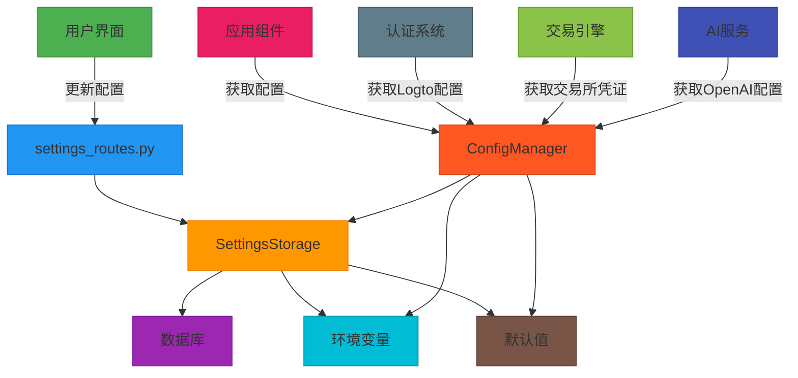
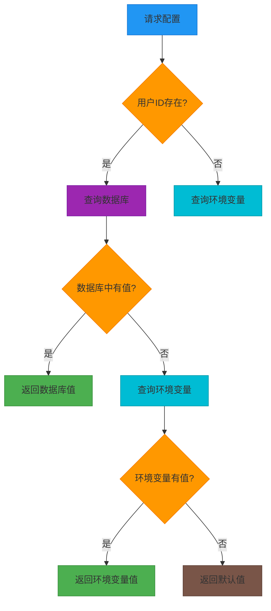
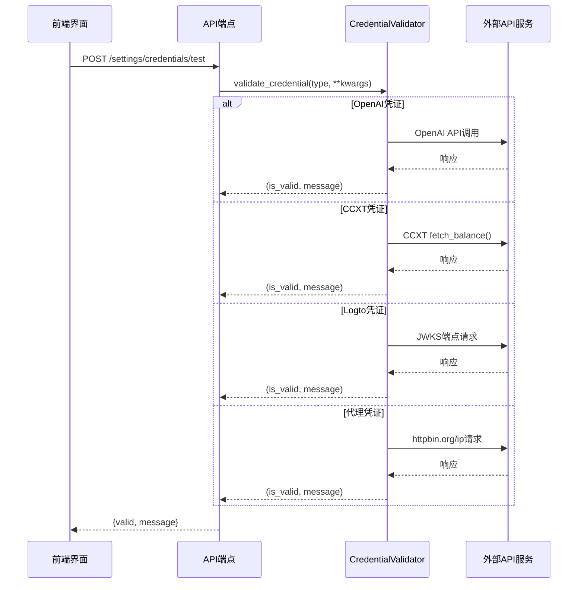
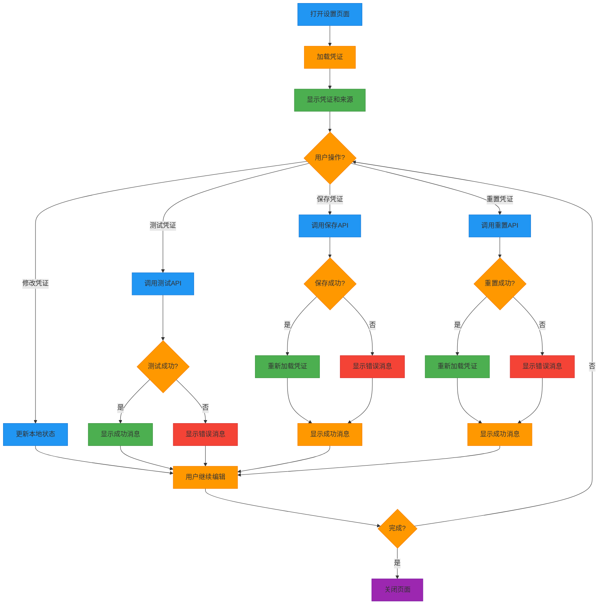
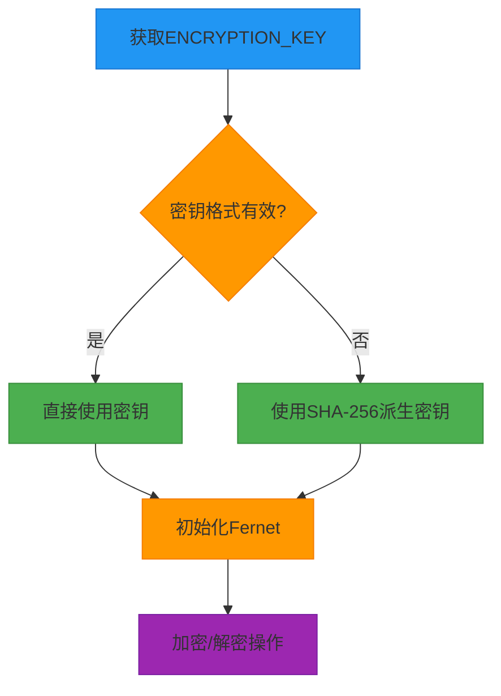

# 安全配置与动态凭证管理

<cite>
**本文档引用的文件**   
- [auth.py](file://backend/src/utils/auth.py)
- [credential_validator.py](file://backend/src/utils/credential_validator.py)
- [encryption.py](file://backend/src/utils/encryption.py)
- [config_manager.py](file://backend/src/config/config_manager.py)
- [settings_storage.py](file://backend/src/db/settings_storage.py)
- [settings_routes.py](file://backend/src/routes/settings_routes.py)
- [.env.template](file://backend/.env.template)
- [CredentialActions.jsx](file://frontend/src/components/Settings/CredentialActions.jsx)
- [ExchangeCredentialForm.jsx](file://frontend/src/components/Settings/ExchangeCredentialForm.jsx)
- [AuthSettingsSection.jsx](file://frontend/src/components/Settings/AuthSettingsSection.jsx)
- [ExchangeSettingsSection.jsx](file://frontend/src/components/Settings/ExchangeSettingsSection.jsx)
- [useCredentials.js](file://frontend/src/hooks/useCredentials.js)
- [config_loader.py](file://backend/src/utils/config_loader.py)
- [sandbox_config.py](file://backend/src/config/sandbox_config.py)
</cite>

## 目录
1. [简介](#简介)
2. [安全配置架构](#安全配置架构)
3. [动态凭证管理](#动态凭证管理)
4. [凭证验证与测试](#凭证验证与测试)
5. [前端用户界面](#前端用户界面)
6. [加密与安全存储](#加密与安全存储)
7. [认证与授权](#认证与授权)
8. [沙箱安全配置](#沙箱安全配置)
9. [最佳实践与安全建议](#最佳实践与安全建议)

## 简介

本项目实现了一套完整的安全配置与动态凭证管理系统，为量化交易平台提供多层次的安全保障。系统采用数据库优先的配置管理策略，允许用户通过Web界面动态配置和管理各种敏感凭证，同时保持与环境变量配置的向后兼容性。

核心安全特性包括：
- **分层凭证管理**：支持数据库存储、环境变量和默认值的多级配置优先级
- **动态凭证加密**：使用Fernet对敏感凭证进行加密存储
- **实时凭证验证**：提供API端点测试凭证有效性
- **安全的认证机制**：基于JWT的Token认证，通过Logto进行身份验证
- **沙箱执行环境**：隔离策略代码执行，防止恶意代码注入

系统设计遵循最小权限原则，所有敏感操作都需要经过身份验证，并提供详细的凭证来源追踪，确保配置的透明性和可审计性。

**Section sources**
- [auth.py](file://backend/src/utils/auth.py#L1-L211)
- [config_manager.py](file://backend/src/config/config_manager.py#L1-L351)
- [.env.template](file://backend/.env.template#L1-L157)

## 安全配置架构

系统采用中心化的配置管理架构，通过`ConfigManager`类统一管理所有配置项。配置优先级遵循"数据库 > 环境变量 > 默认值"的原则，确保用户可以通过UI界面覆盖默认配置，同时保持系统的灵活性。



**Diagram sources**
- [config_manager.py](file://backend/src/config/config_manager.py#L33-L351)
- [settings_storage.py](file://backend/src/db/settings_storage.py#L52-L764)
- [settings_routes.py](file://backend/src/routes/settings_routes.py#L18-L401)

**Section sources**
- [config_manager.py](file://backend/src/config/config_manager.py#L33-L351)
- [settings_storage.py](file://backend/src/db/settings_storage.py#L52-L764)

## 动态凭证管理

系统提供了一套完整的动态凭证管理解决方案，允许用户在运行时配置和管理各种API凭证，而无需重启服务。

### 凭证存储与检索

凭证存储通过`SettingsStorage`类实现，该类负责与数据库交互，提供CRUD操作。所有敏感凭证在存储前都会被加密，确保数据安全。

```mermaid
classDiagram
class SettingsStorage {
+database_url : str
+get_settings(user_id) : Dict
+save_settings(settings, user_id) : Dict
+get_credential(key, user_id) : str
+save_credential(key, value, user_id) : bool
+get_ccxt_credentials(exchange, mode, user_id) : Dict
+save_ccxt_credentials(exchange, mode, creds, user_id) : bool
+get_all_credentials(user_id) : Dict
}
class ConfigManager {
+user_id : str
+get(key, default) : Any
+get_openai_config() : Dict
+get_logto_config() : Dict
+get_proxy_config() : Dict
+get_ccxt_credentials(exchange, mode) : Dict
}
class UserSettingsModel {
-user_id : str
-selected_models : str
-code_analysis_prompt : str
-openai_api_key : str
-logto_issuer : str
-ccxt_credentials : JSON
-created_at : datetime
-updated_at : datetime
}
SettingsStorage --> UserSettingsModel : "持久化"
ConfigManager --> SettingsStorage : "依赖"
SettingsStorage ..> encryption : "使用"
ConfigManager ..> SettingsStorage : "使用"
note right of SettingsStorage
负责数据库操作，提供凭证的
加密存储和检索功能
end note
note left of ConfigManager
提供统一的配置访问接口，
实现数据库 > 环境变量 > 默认值
的优先级逻辑
end note
```

**Diagram sources**
- [settings_storage.py](file://backend/src/db/settings_storage.py#L52-L764)
- [config_manager.py](file://backend/src/config/config_manager.py#L33-L351)

### 配置优先级机制

系统实现了灵活的配置优先级机制，确保配置的灵活性和安全性：

1. **数据库优先**：用户特定的配置存储在数据库中，具有最高优先级
2. **环境变量次之**：全局配置通过环境变量提供，作为数据库配置的后备
3. **默认值最后**：硬编码的默认值作为最后的后备选项

这种设计允许用户通过UI界面覆盖默认配置，同时保持与现有环境变量配置的兼容性。



**Diagram sources**
- [config_manager.py](file://backend/src/config/config_manager.py#L65-L107)
- [settings_storage.py](file://backend/src/db/settings_storage.py#L513-L546)

**Section sources**
- [settings_storage.py](file://backend/src/db/settings_storage.py#L271-L764)
- [config_manager.py](file://backend/src/config/config_manager.py#L65-L280)

## 凭证验证与测试

系统提供了一套完整的凭证验证机制，允许用户在保存前测试凭证的有效性，确保配置的正确性。

### 凭证验证API

后端通过`settings_routes.py`提供凭证测试API端点，支持多种凭证类型的验证：



**Diagram sources**
- [settings_routes.py](file://backend/src/routes/settings_routes.py#L341-L401)
- [credential_validator.py](file://backend/src/utils/credential_validator.py#L26-L360)

### 支持的验证类型

系统支持以下类型的凭证验证：

| 凭证类型 | 验证方法 | 成功条件 |
|---------|--------|--------|
| **OpenAI** | 调用`models.list()` API | 返回200状态码且模型列表非空 |
| **CCXT交易所** | 调用`fetch_balance()` API | 成功获取账户余额信息 |
| **Logto** | 请求JWKS端点 | 返回200状态码且包含密钥信息 |
| **代理** | 请求`httpbin.org/ip` | 成功获取IP地址信息 |

**Section sources**
- [credential_validator.py](file://backend/src/utils/credential_validator.py#L26-L360)
- [settings_routes.py](file://backend/src/routes/settings_routes.py#L153-L169)

## 前端用户界面

前端提供了直观的用户界面，使用户能够轻松管理和测试各种凭证。

### 凭证操作组件

前端通过`CredentialActions`组件提供统一的操作按钮，包括保存、测试和重置功能：

```mermaid
classDiagram
class CredentialActions {
+onSave()
+onTest()
+onReset()
+loading : bool
+testing : bool
}
class ExchangeCredentialForm {
+exchange : string
+mode : string
+values : object
+onChange()
+onSave()
+onTest()
}
class AuthSettingsSection {
+credentials : object
+sources : object
+onCredentialChange()
+onSave()
+onTest()
+onReset()
}
class ExchangeSettingsSection {
+credentials : object
+onCCXTCredentialChange()
+onSave()
+onTest()
}
class useCredentials {
+loadCredentials()
+handleCredentialChange()
+handleCCXTCredentialChange()
+handleSaveCredentials()
+handleTestCredential()
+handleResetCredential()
}
ExchangeCredentialForm --> CredentialActions : "使用"
AuthSettingsSection --> CredentialActions : "使用"
ExchangeSettingsSection --> ExchangeCredentialForm : "使用"
AuthSettingsSection ..> useCredentials : "依赖"
ExchangeSettingsSection ..> useCredentials : "依赖"
useCredentials ..> api : "调用"
note right of CredentialActions
通用的凭证操作按钮组件，
包含保存、测试和重置功能
end note
note left of useCredentials
自定义Hook，管理凭证状态
和所有凭证操作逻辑
end note
```

**Diagram sources**
- [CredentialActions.jsx](file://frontend/src/components/Settings/CredentialActions.jsx#L8-L52)
- [ExchangeCredentialForm.jsx](file://frontend/src/components/Settings/ExchangeCredentialForm.jsx#L8-L65)
- [useCredentials.js](file://frontend/src/hooks/useCredentials.js#L9-L166)

### 用户凭证管理流程

用户管理凭证的完整流程如下：



**Diagram sources**
- [useCredentials.js](file://frontend/src/hooks/useCredentials.js#L15-L149)
- [settings_routes.py](file://backend/src/routes/settings_routes.py#L171-L339)

**Section sources**
- [useCredentials.js](file://frontend/src/hooks/useCredentials.js#L9-L166)
- [CredentialActions.jsx](file://frontend/src/components/Settings/CredentialActions.jsx#L8-L52)

## 加密与安全存储

系统采用Fernet对称加密算法（基于AES-128 CBC模式和HMAC认证）来保护存储在数据库中的敏感凭证。

### 加密机制

```mermaid
classDiagram
class Encryption {
+get_encryption_key() : bytes
+encrypt_value(plaintext) : str
+decrypt_value(ciphertext) : str
+mask_credential(value) : str
+is_encryption_enabled() : bool
+generate_encryption_key() : str
}
class SettingsStorage {
+save_credential(key, value, user_id) : bool
+get_credential(key, user_id) : str
}
class ConfigManager {
+get_openai_config() : Dict
+get_ccxt_credentials(exchange, mode) : Dict
}
Encryption --> SettingsStorage : "用于加密/解密"
SettingsStorage --> Encryption : "调用"
ConfigManager --> SettingsStorage : "获取凭证"
SettingsStorage --> ConfigManager : "返回解密后的凭证"
note right of Encryption
使用cryptography库的Fernet实现
对称加密，密钥通过ENCRYPTION_KEY
环境变量配置
end note
note left of SettingsStorage
在存储前自动加密敏感字段
在检索时自动解密
end note
```

**Diagram sources**
- [encryption.py](file://backend/src/utils/encryption.py#L17-L218)
- [settings_storage.py](file://backend/src/db/settings_storage.py#L20-L21)

### 加密密钥管理

加密密钥通过环境变量`ENCRYPTION_KEY`配置，系统提供灵活的密钥处理机制：

1. **直接使用Fernet密钥**：如果环境变量中的密钥是有效的32字节base64编码，直接使用
2. **SHA-256派生密钥**：如果密钥格式无效，使用SHA-256哈希算法从任意字符串派生32字节密钥



**Diagram sources**
- [encryption.py](file://backend/src/utils/encryption.py#L27-L77)
- [.env.template](file://backend/.env.template#L8-L11)

**Section sources**
- [encryption.py](file://backend/src/utils/encryption.py#L17-L218)
- [settings_storage.py](file://backend/src/db/settings_storage.py#L20-L21)

## 认证与授权

系统采用基于JWT的Token认证机制，通过Logto进行身份验证，确保API端点的安全访问。

### 认证流程

```mermaid
sequenceDiagram
participant 客户端 as 客户端
participant API as API端点
participant Auth as 认证模块
participant Logto as Logto服务
客户端->>API : 请求(含Bearer Token)
API->>Auth : get_current_user(credentials)
Auth->>Auth : get_auth_token(credentials)
Auth->>Auth : get_logto_config()
Auth->>Auth : fetch_jwks()
Auth->>Logto : GET JWKS端点
Logto-->>Auth : JWKS响应
Auth->>Auth : get_signing_key(token)
Auth->>Auth : verify_token(token)
Auth-->>API : 用户声明
API-->>客户端 : 响应
alt 认证失败
Auth-->>API : AuthError
API-->>客户端 : 401错误
end
note right of Auth
使用python-jose库验证JWT，
通过JWKS端点获取公钥
end note
```

**Diagram sources**
- [auth.py](file://backend/src/utils/auth.py#L11-L211)
- [settings_routes.py](file://backend/src/routes/settings_routes.py#L8-L16)

### 认证组件

```mermaid
classDiagram
class AuthError {
+__init__(code, status_code, message)
}
class HTTPBearer {
+__init__(auto_error)
}
class get_current_user {
+Depends(security)
+返回用户声明
}
class get_optional_user {
+Depends(optional_security)
+返回可选用户声明
}
class verify_token {
+验证JWT签名和声明
+验证作用域
}
class fetch_jwks {
+从Logto获取JWKS
+缓存结果
}
AuthError <|-- HTTPException
get_current_user --> HTTPBearer : "依赖"
get_optional_user --> HTTPBearer : "依赖"
verify_token --> fetch_jwks : "使用"
verify_token --> get_signing_key : "使用"
get_current_user --> verify_token : "调用"
get_optional_user --> verify_token : "调用"
note right of verify_token
验证JWT的签名、过期时间、
受众和签发者，以及作用域
end note
note left of fetch_jwks
使用lru_cache缓存JWKS响应，
提高性能并减少外部请求
end note
```

**Diagram sources**
- [auth.py](file://backend/src/utils/auth.py#L28-L211)

**Section sources**
- [auth.py](file://backend/src/utils/auth.py#L11-L211)

## 沙箱安全配置

系统提供多层沙箱安全配置，用于隔离用户策略代码的执行，防止恶意代码对系统造成损害。

### 沙箱配置

```mermaid
classDiagram
class SandboxConfig {
+mode : SandboxMode
+timeout_seconds : float
+max_memory_mb : int
+max_cpu_percent : int
+allow_network : bool
+allow_file_write : bool
+docker_image : str
+docker_network : str
+process_pool_size : int
+enable_caching : bool
}
class get_sandbox_config {
+从环境变量加载配置
+返回SandboxConfig实例
}
class get_config {
+单例模式获取配置
+懒加载
}
get_config --> get_sandbox_config : "创建"
get_sandbox_config --> SandboxConfig : "实例化"
note right of SandboxConfig
定义沙箱执行环境的配置参数，
包括隔离模式、资源限制等
end note
note left of get_config
单例模式，确保全局只有一个
配置实例，提高性能
end note
```

**Diagram sources**
- [sandbox_config.py](file://backend/src/config/sandbox_config.py#L16-L115)

### 沙箱模式

系统支持三种沙箱模式，提供不同级别的安全隔离：

| 模式 | 安全级别 | 适用场景 | 配置参数 |
|------|--------|--------|--------|
| **soft** | 低 | 开发环境 | `SANDBOX_MODE=soft` |
| **subprocess** | 中 | 推荐生产环境 | `SANDBOX_MODE=subprocess` |
| **docker** | 高 | 多租户生产环境 | `SANDBOX_MODE=docker` |

**Section sources**
- [sandbox_config.py](file://backend/src/config/sandbox_config.py#L1-L115)
- [.env.template](file://backend/.env.template#L130-L157)

## 最佳实践与安全建议

### 安全配置最佳实践

1. **加密密钥管理**
   - 必须设置`ENCRYPTION_KEY`环境变量
   - 使用`python -c "from cryptography.fernet import Fernet; print(Fernet.generate_key().decode())"`生成安全密钥
   - 永远不要将`.env`文件提交到版本控制系统

2. **API密钥安全**
   - 为纸面交易和实盘交易使用不同的API密钥
   - 为实盘交易的API密钥禁用提现权限
   - 如果可能，为API密钥设置IP白名单限制
   - 启用交易所账户的双因素认证

3. **环境变量安全**
   ```bash
   # .env文件示例
   ENCRYPTION_KEY=your-generated-encryption-key
   LOGTO_ISSUER=https://your-logto-instance.com
   LOGTO_JWKS_URI=https://your-logto-instance.com/oidc/jwks
   OPENAI_API_KEY=your-openai-api-key
   CCXT_BINANCE_PAPER_API_KEY=your-binance-testnet-key
   ```

### 凭证管理最佳实践

1. **凭证测试**
   - 在保存凭证前使用测试功能验证其有效性
   - 定期重新测试凭证以确保其仍然有效
   - 监控测试失败的凭证并及时更新

2. **凭证来源追踪**
   - 系统显示每个凭证的来源（数据库、环境变量或默认值）
   - 用户可以重置凭证以恢复到环境变量值
   - 优先使用数据库存储的凭证以提高安全性

3. **风险控制**
   - 在`broker_config.json`中设置适当的风险限制
   - 从较小的头寸规模开始实盘交易
   - 密切监控首次实盘交易

### 多租户部署安全建议

对于多租户或公共SaaS部署，建议：

1. **使用Docker沙箱模式**
   - 设置`SANDBOX_MODE=docker`
   - 使用`--network=none`禁用网络访问
   - 实现策略审查工作流程

2. **网络隔离**
   - 在隔离的容器中运行回测
   - 实施严格的网络策略
   - 监控异常的网络活动

3. **权限控制**
   - 实现基于角色的访问控制
   - 限制用户对敏感操作的访问
   - 记录所有敏感操作日志

**Section sources**
- [.env.template](file://backend/.env.template#L100-L110)
- [sandbox_config.py](file://backend/src/config/sandbox_config.py#L114-L128)
- [config_loader.py](file://backend/src/utils/config_loader.py#L97-L106)