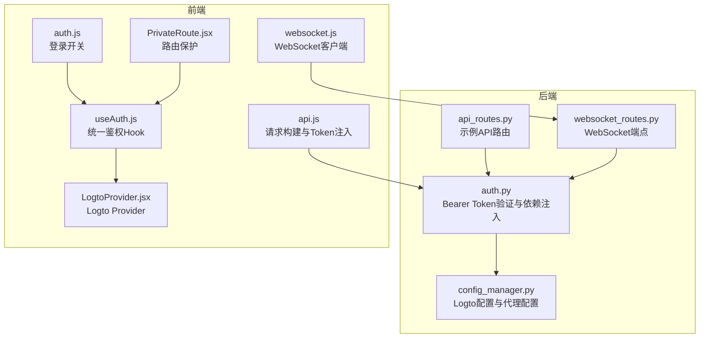
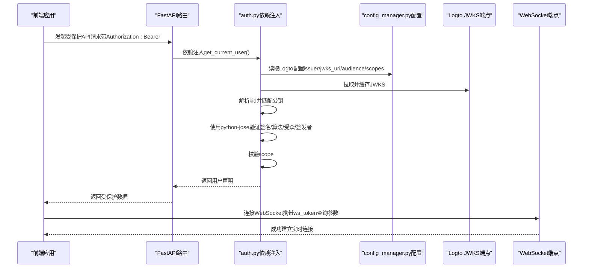
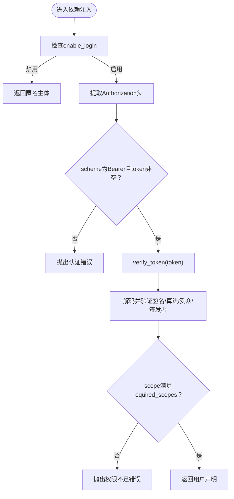
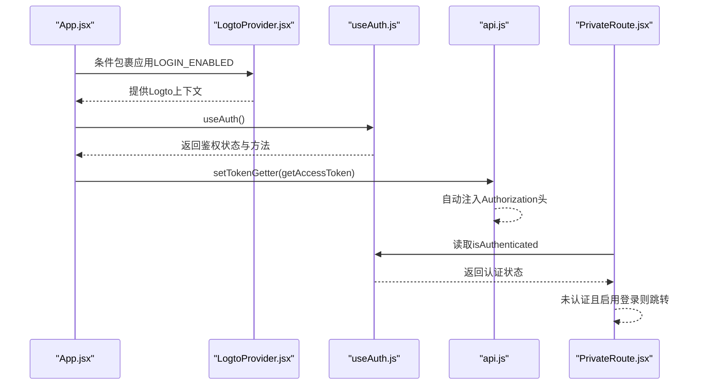
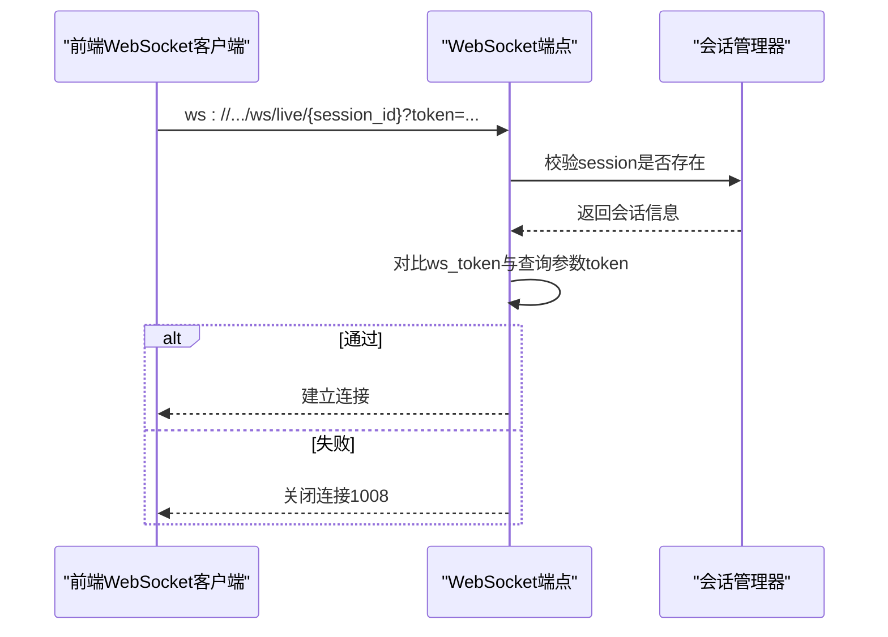
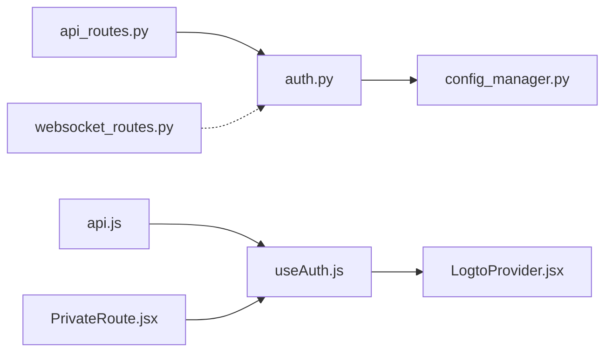

# 认证与授权

<cite>
**本文引用的文件列表**
- [backend/src/utils/auth.py](file://backend/src/utils/auth.py)
- [backend/src/config/config_manager.py](file://backend/src/config/config_manager.py)
- [backend/src/routers/websocket_routes.py](file://backend/src/routes/websocket_routes.py)
- [backend/src/routers/api_routes.py](file://backend/src/routes/api_routes.py)
- [backend/tests/utils/test_auth.py](file://backend/tests/utils/test_auth.py)
- [frontend/src/config/auth.js](file://frontend/src/config/auth.js)
- [frontend/src/hooks/useAuth.js](file://frontend/src/hooks/useAuth.js)
- [frontend/src/providers/LogtoProvider.jsx](file://frontend/src/providers/LogtoProvider.jsx)
- [frontend/src/services/api.js](file://frontend/src/services/api.js)
- [frontend/src/services/websocket.js](file://frontend/src/services/websocket.js)
- [frontend/src/components/Auth/PrivateRoute.jsx](file://frontend/src/components/Auth/PrivateRoute.jsx)
</cite>

## 目录
1. [简介](#简介)
2. [项目结构](#项目结构)
3. [核心组件](#核心组件)
4. [架构总览](#架构总览)
5. [详细组件分析](#详细组件分析)
6. [依赖关系分析](#依赖关系分析)
7. [性能考量](#性能考量)
8. [故障排查指南](#故障排查指南)
9. [结论](#结论)
10. [附录](#附录)

## 简介
本文件系统性记录系统的JWT认证与授权机制，重点覆盖：
- 后端基于FastAPI Security与python-jose的Bearer Token验证流程，包括依赖注入函数get_current_user、get_optional_user的工作原理；
- 系统如何通过Logto的JWKS端点动态获取公钥进行令牌验证，并支持从数据库或环境变量加载认证配置；
- optional_security与security两种安全方案的应用场景（强制认证 vs 可选认证）；
- 前端如何与后端认证流程集成，包括登录状态管理与路由保护；
- 在API端点上使用Depends(get_current_user)进行权限控制的示例路径；
- 当前WebSocket连接缺乏认证校验的安全隐患及建议。

## 项目结构
围绕认证与授权的关键文件分布如下：
- 后端认证与配置
  - 认证工具：backend/src/utils/auth.py
  - 配置管理：backend/src/config/config_manager.py
  - WebSocket路由：backend/src/routes/websocket_routes.py
  - 示例API路由：backend/src/routers/api_routes.py
  - 认证测试：backend/tests/utils/test_auth.py
- 前端集成
  - 登录开关配置：frontend/src/config/auth.js
  - 统一鉴权Hook：frontend/src/hooks/useAuth.js
  - Logto Provider封装：frontend/src/providers/LogtoProvider.jsx
  - API请求与Token注入：frontend/src/services/api.js
  - WebSocket客户端：frontend/src/services/websocket.js
  - 路由保护组件：frontend/src/components/Auth/PrivateRoute.jsx

图表来源
- [backend/src/utils/auth.py](file://backend/src/utils/auth.py#L1-L210)
- [backend/src/config/config_manager.py](file://backend/src/config/config_manager.py#L133-L166)
- [backend/src/routes/websocket_routes.py](file://backend/src/routes/websocket_routes.py#L21-L218)
- [backend/src/routes/api_routes.py](file://backend/src/routes/api_routes.py#L63-L106)
- [frontend/src/config/auth.js](file://frontend/src/config/auth.js#L1-L4)
- [frontend/src/hooks/useAuth.js](file://frontend/src/hooks/useAuth.js#L1-L30)
- [frontend/src/providers/LogtoProvider.jsx](file://frontend/src/providers/LogtoProvider.jsx#L1-L34)
- [frontend/src/services/api.js](file://frontend/src/services/api.js#L1-L46)
- [frontend/src/services/websocket.js](file://frontend/src/services/websocket.js#L1-L287)
- [frontend/src/components/Auth/PrivateRoute.jsx](file://frontend/src/components/Auth/PrivateRoute.jsx#L1-L32)

章节来源
- [backend/src/utils/auth.py](file://backend/src/utils/auth.py#L1-L210)
- [backend/src/config/config_manager.py](file://backend/src/config/config_manager.py#L133-L166)
- [frontend/src/config/auth.js](file://frontend/src/config/auth.js#L1-L4)

## 核心组件
- 认证依赖注入
  - security与optional_security：基于FastAPI HTTPBearer，auto_error=False，允许可选认证。
  - get_current_user：强制认证依赖，返回用户声明；当禁用登录时返回匿名主体。
  - get_optional_user：可选认证依赖，无凭据或验证失败时返回None。
  - require_user：依赖注入辅助器，保持接口一致性。
- JWKS与令牌验证
  - get_logto_config：从全局配置管理器读取Logto配置（issuer、jwks_uri、audience、required_scopes、enable_login）。
  - fetch_jwks：缓存JWKS元数据，支持HTTP/HTTPS代理。
  - get_signing_key：根据JWT头部kid匹配对应公钥；若首次未找到则清缓存重试一次。
  - verify_token：使用python-jose解码并验证签名、算法、受众与签发者；随后校验scope。
  - validate_scopes：按配置检查所需scope是否满足。
- 配置加载
  - ConfigManager.get_logto_config：优先从数据库读取，回退到环境变量；包含enable_login布尔转换逻辑。
  - ConfigManager.get_proxy_config：代理配置读取。
- 前端集成
  - LOGIN_ENABLED：根据VITE_ENABLE_LOGIN判断是否启用登录。
  - useAuth：统一鉴权Hook，登录关闭时返回匿名模式。
  - LogtoProvider：提供Logto配置与资源范围。
  - api.js：在请求头注入Authorization: Bearer Token。
  - websocket.js：以查询参数ws_token进行WebSocket连接认证。
  - PrivateRoute：受保护路由组件，未登录且启用登录时跳转至登录页。

章节来源
- [backend/src/utils/auth.py](file://backend/src/utils/auth.py#L1-L210)
- [backend/src/config/config_manager.py](file://backend/src/config/config_manager.py#L133-L166)
- [frontend/src/config/auth.js](file://frontend/src/config/auth.js#L1-L4)
- [frontend/src/hooks/useAuth.js](file://frontend/src/hooks/useAuth.js#L1-L30)
- [frontend/src/providers/LogtoProvider.jsx](file://frontend/src/providers/LogtoProvider.jsx#L1-L34)
- [frontend/src/services/api.js](file://frontend/src/services/api.js#L1-L46)
- [frontend/src/services/websocket.js](file://frontend/src/services/websocket.js#L1-L287)
- [frontend/src/components/Auth/PrivateRoute.jsx](file://frontend/src/components/Auth/PrivateRoute.jsx#L1-L32)

## 架构总览
下图展示后端JWT验证与前端集成的整体流程，以及WebSocket连接的认证方式。

图表来源
- [backend/src/utils/auth.py](file://backend/src/utils/auth.py#L141-L204)
- [backend/src/config/config_manager.py](file://backend/src/config/config_manager.py#L133-L166)
- [backend/src/routes/websocket_routes.py](file://backend/src/routes/websocket_routes.py#L21-L170)
- [frontend/src/services/api.js](file://frontend/src/services/api.js#L1-L46)
- [frontend/src/services/websocket.js](file://frontend/src/services/websocket.js#L1-L120)

## 详细组件分析

### 后端JWT认证与依赖注入（auth.py）
- 安全方案
  - security：强制认证，auto_error=False，用于需要严格鉴权的端点。
  - optional_security：可选认证，用于允许匿名访问但可选解析令牌的端点。
- 依赖注入函数
  - get_current_user：当enable_login为真时，提取并校验Authorization头，随后调用verify_token；否则返回匿名主体。
  - get_optional_user：当存在凭据时尝试校验，失败则返回None；当禁用登录时返回匿名主体。
  - require_user：依赖注入辅助器，便于复用。
- 令牌验证流程
  - get_auth_token：校验scheme为Bearer且token非空。
  - verify_token：获取签名算法与公钥，使用jose解码并验证audience/issuer；随后validate_scopes。
  - validate_scopes：按required_scopes逐项比对token中的scope集合。
  - get_signing_key：从JWKS匹配kid；若未命中，清缓存后重试一次。
  - fetch_jwks：从jwks_uri拉取并缓存；支持HTTP/HTTPS代理。
- 错误处理
  - 统一抛出AuthError，包含标准化错误码与消息，便于前端识别。

图表来源
- [backend/src/utils/auth.py](file://backend/src/utils/auth.py#L38-L204)

章节来源
- [backend/src/utils/auth.py](file://backend/src/utils/auth.py#L1-L210)
- [backend/tests/utils/test_auth.py](file://backend/tests/utils/test_auth.py#L1-L77)

### 配置加载（config_manager.py）
- Logto配置优先级
  - 数据库优先：ConfigManager.get_logto_config从数据库读取issuer、jwks_uri、audience、required_scopes、enable_login。
  - 环境变量回退：若数据库未配置，则从环境变量读取。
  - enable_login布尔转换：字符串"true"/"1"/"yes"/"on"视为开启，否则默认开启。
- 代理配置
  - get_proxy_config返回HTTP/HTTPS代理设置，fetch_jwks会使用该配置访问JWKS端点。

章节来源
- [backend/src/config/config_manager.py](file://backend/src/config/config_manager.py#L133-L166)
- [backend/src/config/config_manager.py](file://backend/src/config/config_manager.py#L168-L179)

### 前端登录与路由保护（frontend）
- 登录开关
  - VITE_ENABLE_LOGIN控制是否启用登录；LOGIN_ENABLED为true时启用Logto Provider与鉴权Hook。
- 统一鉴权Hook
  - useAuth：登录关闭时返回匿名模式对象；登录开启时透传Logto能力。
- Provider与Token注入
  - LogtoProvider：配置endpoint、appId、resources。
  - api.js：通过setTokenGetter注入Logto的getAccessToken，自动在请求头添加Authorization: Bearer。
- 路由保护
  - PrivateRoute：当启用登录且未认证时重定向至登录页；否则渲染子组件。

图表来源
- [frontend/src/App.jsx](file://frontend/src/App.jsx#L102-L118)
- [frontend/src/providers/LogtoProvider.jsx](file://frontend/src/providers/LogtoProvider.jsx#L1-L34)
- [frontend/src/hooks/useAuth.js](file://frontend/src/hooks/useAuth.js#L1-L30)
- [frontend/src/services/api.js](file://frontend/src/services/api.js#L1-L46)
- [frontend/src/components/Auth/PrivateRoute.jsx](file://frontend/src/components/Auth/PrivateRoute.jsx#L1-L32)

章节来源
- [frontend/src/config/auth.js](file://frontend/src/config/auth.js#L1-L4)
- [frontend/src/hooks/useAuth.js](file://frontend/src/hooks/useAuth.js#L1-L30)
- [frontend/src/providers/LogtoProvider.jsx](file://frontend/src/providers/LogtoProvider.jsx#L1-L34)
- [frontend/src/services/api.js](file://frontend/src/services/api.js#L1-L46)
- [frontend/src/components/Auth/PrivateRoute.jsx](file://frontend/src/components/Auth/PrivateRoute.jsx#L1-L32)

### WebSocket连接认证
- 连接认证方式
  - WebSocket端点通过查询参数ws_token进行会话级认证；服务端校验session.ws_token与传入token一致后才建立连接。
- 安全隐患
  - 当前WebSocket连接未进行JWT身份验证，仅依赖ws_token会话令牌，存在被泄露或滥用的风险。
- 建议
  - 在生产环境引入连接级别的JWT验证：在握手阶段要求客户端提供Authorization: Bearer，服务端使用auth.py的验证流程完成签名校验与scope校验，再建立连接。

图表来源
- [backend/src/routes/websocket_routes.py](file://backend/src/routes/websocket_routes.py#L21-L170)
- [frontend/src/services/websocket.js](file://frontend/src/services/websocket.js#L1-L120)

章节来源
- [backend/src/routes/websocket_routes.py](file://backend/src/routes/websocket_routes.py#L21-L170)
- [frontend/src/services/websocket.js](file://frontend/src/services/websocket.js#L1-L120)

### 在API端点上使用Depends(get_current_user)进行权限控制
- 示例路径
  - 获取策略模板列表：/templates
  - 获取模板详情：/templates/{template_id}
  - 获取Ticker信息：/ticker/{ticker}/info
  - 获取Ticker价格：/ticker/{ticker}/prices
  - 获取凭证（受保护）：/settings/credentials
- 使用方式
  - 在路由定义中通过Depends(get_current_user)注入用户声明，后续可基于用户身份执行业务逻辑或返回受保护数据。

章节来源
- [backend/src/routes/api_routes.py](file://backend/src/routes/api_routes.py#L63-L106)
- [backend/src/routes/api_routes.py](file://backend/src/routes/api_routes.py#L149-L184)
- [backend/src/routes/settings_routes.py](file://backend/src/routes/settings_routes.py#L173-L192)

## 依赖关系分析
- 后端模块耦合
  - auth.py依赖config_manager.py读取Logto配置与代理设置。
  - API路由依赖auth.py的依赖注入函数实现权限控制。
  - WebSocket路由不依赖JWT验证，仅依赖会话级ws_token。
- 前端模块耦合
  - useAuth.js依赖LOGIN_ENABLED与Logto Provider。
  - api.js依赖useAuth.js提供的token获取器。
  - PrivateRoute.jsx依赖useAuth.js的状态进行路由保护。

图表来源
- [backend/src/utils/auth.py](file://backend/src/utils/auth.py#L1-L210)
- [backend/src/config/config_manager.py](file://backend/src/config/config_manager.py#L133-L166)
- [backend/src/routes/api_routes.py](file://backend/src/routes/api_routes.py#L63-L106)
- [backend/src/routes/websocket_routes.py](file://backend/src/routes/websocket_routes.py#L21-L170)
- [frontend/src/hooks/useAuth.js](file://frontend/src/hooks/useAuth.js#L1-L30)
- [frontend/src/providers/LogtoProvider.jsx](file://frontend/src/providers/LogtoProvider.jsx#L1-L34)
- [frontend/src/services/api.js](file://frontend/src/services/api.js#L1-L46)
- [frontend/src/components/Auth/PrivateRoute.jsx](file://frontend/src/components/Auth/PrivateRoute.jsx#L1-L32)

章节来源
- [backend/src/utils/auth.py](file://backend/src/utils/auth.py#L1-L210)
- [backend/src/config/config_manager.py](file://backend/src/config/config_manager.py#L133-L166)
- [frontend/src/hooks/useAuth.js](file://frontend/src/hooks/useAuth.js#L1-L30)

## 性能考量
- JWKS缓存
  - fetch_jwks使用LRU缓存，减少频繁拉取JWKS带来的网络开销；当kid未匹配时主动清缓存并重试一次，确保密钥轮换场景下的可用性。
- 代理支持
  - 支持HTTP/HTTPS代理配置，便于在受限网络环境下拉取JWKS。
- 依赖注入开销
  - get_current_user与get_optional_user均为轻量依赖注入，主要开销在于网络请求（JWKS）与JWT解码，通常可忽略。

[本节为通用指导，无需列出具体文件来源]

## 故障排查指南
- 常见错误与定位
  - 缺少Authorization头或scheme非Bearer：检查前端是否正确注入Token或是否使用Bearer。
  - JWKS URI未配置：确认数据库或环境变量中已设置LOGTO_JWKS_URI。
  - Token过期或声明无效：检查令牌有效期与签发者/受众配置。
  - 缺少所需scope：核对required_scopes配置与令牌scope。
- 测试参考
  - 单元测试覆盖了Authorization头校验、scope校验、kid缺失、JWKS拉取异常等场景，可作为问题排查的对照。

章节来源
- [backend/tests/utils/test_auth.py](file://backend/tests/utils/test_auth.py#L1-L77)
- [backend/src/utils/auth.py](file://backend/src/utils/auth.py#L38-L204)

## 结论
- 本系统采用“数据库优先”的Logto配置加载策略，结合python-jose与JWKS动态公钥验证，实现了灵活且安全的JWT认证。
- 通过security与optional_security两种依赖注入方案，既能满足强制认证需求，也能支持可选认证场景。
- 前端通过Logto Provider与统一Hook实现登录状态管理与路由保护，API请求自动注入Bearer Token。
- WebSocket当前仅依赖会话级ws_token，建议在生产环境引入JWT连接级身份验证，以提升安全性。

[本节为总结，无需列出具体文件来源]

## 附录
- 关键实现路径
  - get_current_user依赖注入：[backend/src/utils/auth.py](file://backend/src/utils/auth.py#L171-L184)
  - get_optional_user依赖注入：[backend/src/utils/auth.py](file://backend/src/utils/auth.py#L186-L204)
  - verify_token与validate_scopes：[backend/src/utils/auth.py](file://backend/src/utils/auth.py#L141-L169)
  - fetch_jwks与get_signing_key：[backend/src/utils/auth.py](file://backend/src/utils/auth.py#L63-L119)
  - Logto配置加载（数据库优先）：[backend/src/config/config_manager.py](file://backend/src/config/config_manager.py#L133-L166)
  - 登录开关与useAuth：[frontend/src/config/auth.js](file://frontend/src/config/auth.js#L1-L4)、[frontend/src/hooks/useAuth.js](file://frontend/src/hooks/useAuth.js#L1-L30)
  - API请求Token注入：[frontend/src/services/api.js](file://frontend/src/services/api.js#L1-L46)
  - WebSocket连接认证：[frontend/src/services/websocket.js](file://frontend/src/services/websocket.js#L1-L120)、[backend/src/routes/websocket_routes.py](file://backend/src/routes/websocket_routes.py#L21-L170)