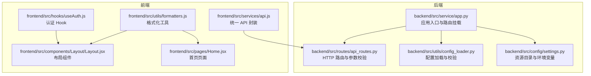
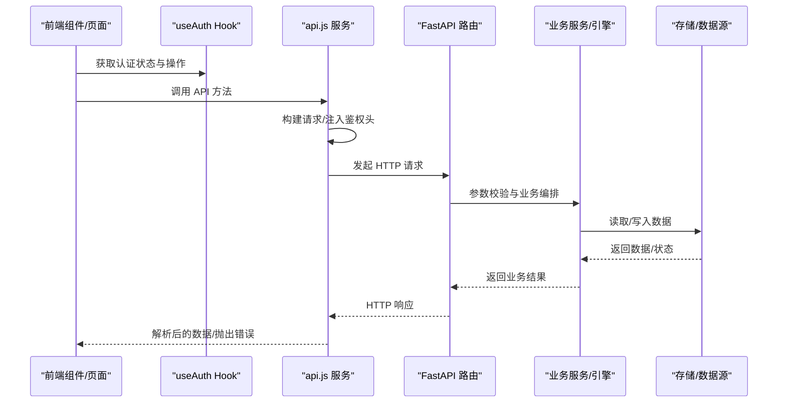
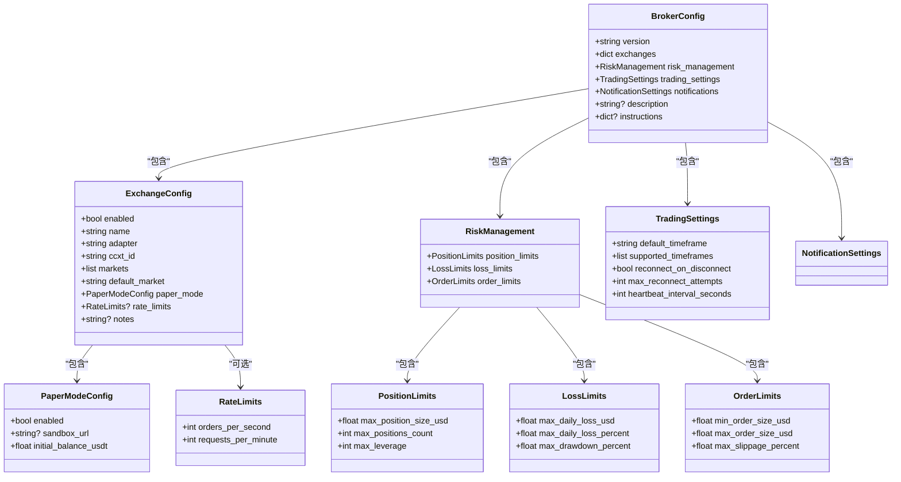
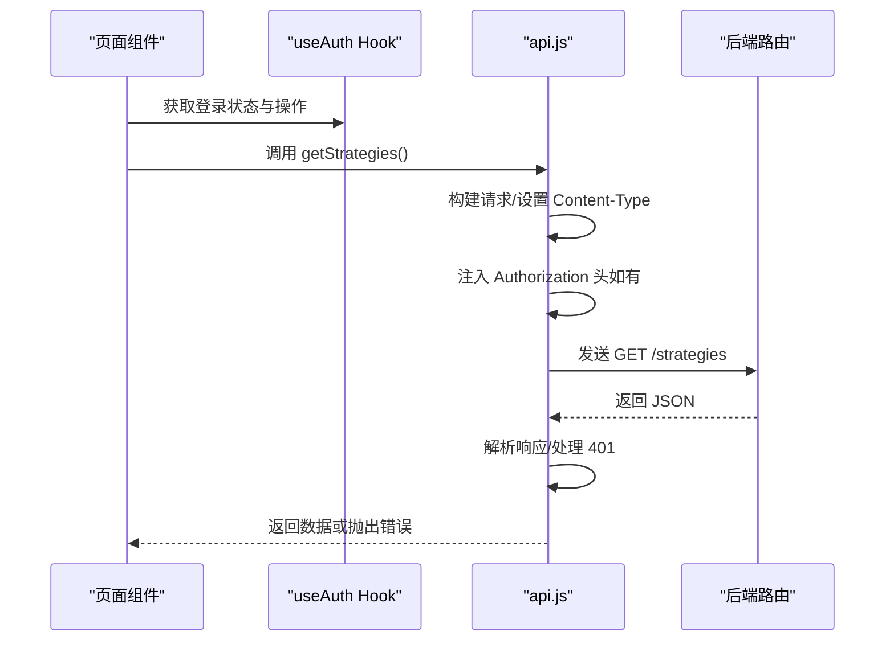
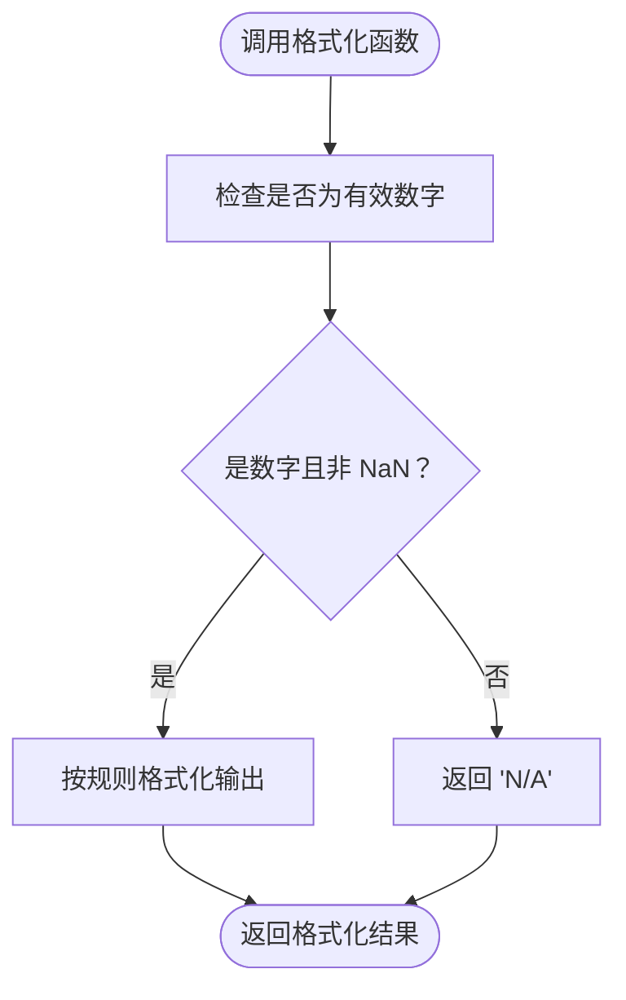
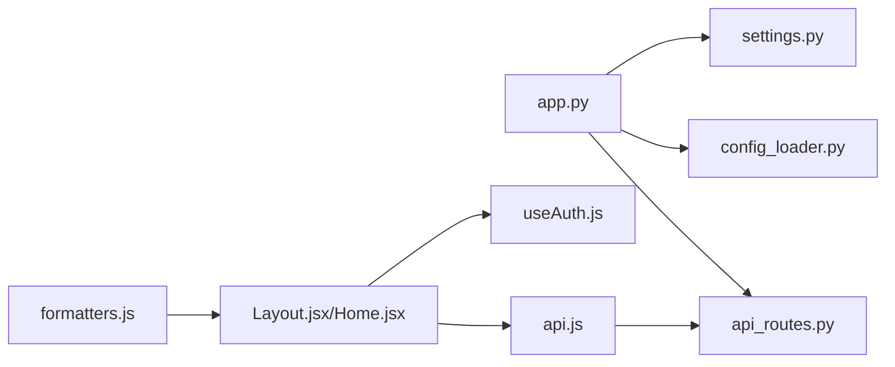

# 代码规范

<cite>
**本文引用的文件**
- [backend/src/service/app.py](file://backend/src/service/app.py)
- [backend/src/utils/config_loader.py](file://backend/src/utils/config_loader.py)
- [backend/src/config/settings.py](file://backend/src/config/settings.py)
- [backend/src/routes/api_routes.py](file://backend/src/routes/api_routes.py)
- [frontend/src/utils/formatters.js](file://frontend/src/utils/formatters.js)
- [frontend/src/hooks/useAuth.js](file://frontend/src/hooks/useAuth.js)
- [frontend/src/services/api.js](file://frontend/src/services/api.js)
- [frontend/src/components/Layout/Layout.jsx](file://frontend/src/components/Layout/Layout.jsx)
- [frontend/src/pages/Home.jsx](file://frontend/src/pages/Home.jsx)
- [backend/src/src.md](file://backend/src/src.md)
- [frontend/src/src.md](file://frontend/src/src.md)
- [backend/resources/strategy/strategy.md](file://backend/resources/strategy/strategy.md)
- [auto_test/auto_test.md](file://auto_test/auto_test.md)
</cite>

## 目录
1. [引言](#引言)
2. [项目结构](#项目结构)
3. [核心组件](#核心组件)
4. [架构总览](#架构总览)
5. [详细组件分析](#详细组件分析)
6. [依赖关系分析](#依赖关系分析)
7. [性能考量](#性能考量)
8. [故障排查指南](#故障排查指南)
9. [结论](#结论)
10. [附录](#附录)

## 引言
本规范旨在统一后端 Python 与前端 JavaScript 的开发风格，确保代码一致性、可维护性与可测试性。针对 Python，重点参考后端服务入口与配置加载模块，明确类命名、函数注释、异常处理与与 Backtrader 框架的兼容性要求；针对 JavaScript，参考前端工具函数与服务封装模式，定义 React 组件、Hook 与工具函数的编码标准。同时，给出前后端目录组织原则、文件命名约定与模块化设计规范，并结合现有模块文档说明文档注释的编写要求。

## 项目结构
后端采用 FastAPI 架构，按“路由层-服务层-持久层-适配层-配置与工具”的分层组织；前端采用 React + Vite，按“页面/组件/服务/工具/国际化/资产”分层。两者均强调可维护性、可测试性与非功能性约束（安全、可靠性、性能、可用性）。

**图表来源**
- [backend/src/service/app.py](file://backend/src/service/app.py#L1-L31)
- [backend/src/routes/api_routes.py](file://backend/src/routes/api_routes.py#L1-L200)
- [backend/src/utils/config_loader.py](file://backend/src/utils/config_loader.py#L1-L343)
- [backend/src/config/settings.py](file://backend/src/config/settings.py#L1-L81)
- [frontend/src/services/api.js](file://frontend/src/services/api.js#L1-L255)
- [frontend/src/hooks/useAuth.js](file://frontend/src/hooks/useAuth.js#L1-L30)
- [frontend/src/utils/formatters.js](file://frontend/src/utils/formatters.js#L1-L13)
- [frontend/src/components/Layout/Layout.jsx](file://frontend/src/components/Layout/Layout.jsx#L1-L133)
- [frontend/src/pages/Home.jsx](file://frontend/src/pages/Home.jsx#L1-L216)

**章节来源**
- [backend/src/src.md](file://backend/src/src.md#L1-L24)
- [frontend/src/src.md](file://frontend/src/src.md#L1-L28)

## 核心组件
- 后端应用入口与路由挂载：应用初始化、CORS 配置、路由注册与静态资源挂载。
- 配置加载与校验：基于 Pydantic 的配置模型与缓存机制，提供类型化访问与错误处理。
- 路由层：以 FastAPI 路由器组织接口，参数使用 Pydantic 校验，异常转换为 HTTP 错误。
- 前端服务封装：统一请求构建、鉴权头注入、响应解析与错误处理。
- 前端 Hook 与工具：认证抽象与数值格式化工具，体现可测试性与可复用性。

**章节来源**
- [backend/src/service/app.py](file://backend/src/service/app.py#L1-L31)
- [backend/src/utils/config_loader.py](file://backend/src/utils/config_loader.py#L1-L343)
- [backend/src/routes/api_routes.py](file://backend/src/routes/api_routes.py#L1-L200)
- [frontend/src/services/api.js](file://frontend/src/services/api.js#L1-L255)
- [frontend/src/hooks/useAuth.js](file://frontend/src/hooks/useAuth.js#L1-L30)
- [frontend/src/utils/formatters.js](file://frontend/src/utils/formatters.js#L1-L13)

## 架构总览
后端通过 FastAPI 提供 HTTP/WebSocket 接口，路由层负责参数校验与编排，服务层完成业务逻辑，配置与工具模块提供资源目录与配置加载能力。前端通过统一服务层对接后端 API，组件与 Hook 负责 UI 与状态逻辑，工具函数提供通用格式化能力。

**图表来源**
- [frontend/src/services/api.js](file://frontend/src/services/api.js#L1-L255)
- [backend/src/routes/api_routes.py](file://backend/src/routes/api_routes.py#L1-L200)

## 详细组件分析

### Python 规范（基于 backend/src/service/app.py 与 backend/src/utils/config_loader.py）

- 类命名与结构
  - 使用驼峰命名（PascalCase）定义 Pydantic 模型类，如 PaperModeConfig、ExchangeConfig 等，体现强类型与可读性。
  - 建议：新增配置模型遵循现有命名风格，字段使用小驼峰命名，必要时提供默认值与显式类型标注。

- 函数注释与文档字符串
  - 使用三段式文档字符串描述用途、参数、返回值与异常，便于 IDE 与自动化文档生成。
  - 建议：对公共函数补充参数与返回值类型说明，异常场景在文档字符串中明确列出。

- 异常处理
  - 在配置加载中区分 FileNotFoundError、JSON 解析错误与 Pydantic 校验错误，分别记录日志并向上抛出。
  - 建议：在业务路由中将特定异常映射为 HTTP 状态码，保持对外一致的错误结构。

- 与 Backtrader 框架的兼容性
  - 配置加载模块提供时间框架、滑点、手续费等参数的类型化访问，便于与 Backtrader 引擎参数对齐。
  - 建议：在策略参数与引擎参数之间建立清晰映射关系，避免隐式转换导致的不一致。

- 资源目录与环境变量
  - 通过 settings 模块集中管理资源目录与环境变量，确保路径与密钥不硬编码于代码库。
  - 建议：新增资源目录或环境变量时同步更新模板与文档。

- 正反例参考路径
  - 正例：配置加载函数与模型定义，展示类型化与错误处理。
  - 反例：避免在路由层直接进行复杂业务逻辑，应通过服务层编排。

**章节来源**
- [backend/src/service/app.py](file://backend/src/service/app.py#L1-L31)
- [backend/src/utils/config_loader.py](file://backend/src/utils/config_loader.py#L1-L343)
- [backend/src/config/settings.py](file://backend/src/config/settings.py#L1-L81)

#### 类关系图（Python 配置模型）

**图表来源**
- [backend/src/utils/config_loader.py](file://backend/src/utils/config_loader.py#L1-L343)

### JavaScript 规范（基于 frontend/src/utils/formatters.js 与 frontend/src/services/api.js）

- React 组件
  - 使用函数式组件与 Hooks，避免不必要的类组件。
  - 建议：组件导出默认值，内部逻辑清晰分层；样式与组件分离，避免在组件内硬编码样式。

- 自定义 Hook
  - useAuth 抽象登录状态与操作，支持匿名模式与受保护模式切换，体现可测试性与可复用性。
  - 建议：Hook 内部逻辑尽量纯函数化，依赖通过参数传入，便于单元测试。

- 工具函数
  - 数值格式化工具提供统一的数字、百分比与货币格式化能力，减少重复逻辑。
  - 建议：工具函数保持纯函数特性，输入输出类型明确，必要时提供默认参数。

- 服务封装
  - api.js 统一封装请求构建、鉴权头注入、响应解析与错误处理，避免在组件内分散处理。
  - 建议：对外暴露方法语义清晰，错误抛出与状态码映射一致，便于上层组件统一处理。

- 正反例参考路径
  - 正例：formatNumber/formatPercent/formatCurrency、api 封装与 useAuth Hook。
  - 反例：避免在组件内直接发起网络请求或处理鉴权细节。

**章节来源**
- [frontend/src/utils/formatters.js](file://frontend/src/utils/formatters.js#L1-L13)
- [frontend/src/hooks/useAuth.js](file://frontend/src/hooks/useAuth.js#L1-L30)
- [frontend/src/services/api.js](file://frontend/src/services/api.js#L1-L255)
- [frontend/src/components/Layout/Layout.jsx](file://frontend/src/components/Layout/Layout.jsx#L1-L133)
- [frontend/src/pages/Home.jsx](file://frontend/src/pages/Home.jsx#L1-L216)

#### 前端服务调用序列图

**图表来源**
- [frontend/src/services/api.js](file://frontend/src/services/api.js#L1-L255)
- [backend/src/routes/api_routes.py](file://backend/src/routes/api_routes.py#L1-L200)

#### 格式化工具流程图

**图表来源**
- [frontend/src/utils/formatters.js](file://frontend/src/utils/formatters.js#L1-L13)

### 目录组织与命名约定

- 后端（backend/src）
  - 按层划分：routes/、service/、db/、brokers/、config/、utils/。
  - 命名约定：模块文件使用小写加下划线；服务层与路由层文件名与职责匹配。
  - 非功能性约束：安全（密钥/账户来自环境变量）、可靠性（错误结构一致）、性能（避免阻塞事件循环）、可维护性（按层划分，避免跨层耦合）、可测试性（核心业务与适配器可 mock 测试）。

- 前端（frontend/src）
  - 按功能域划分：pages/、components/、services/、providers/、hooks/、utils/、assets/、locales/。
  - 命名约定：目录与组件文件使用 PascalCase，工具/服务使用 camelCase；页面与组件尽量就近放置在对应 feature 子目录下。
  - 非功能性约束：可维护性（避免 components/ 成为“杂物间”）、可测试性（纯工具函数与 Hook 可单测）、性能（避免不必要的全局重渲染）、可用性（多语言与无障碍）、安全（不在前端硬编码密钥）。

- 策略目录（backend/resources/strategy）
  - 用户维护的策略脚本建议使用小写加下划线；临时实验文件放入 sandbox 或单独分支；变更流程需人工编写/审阅并本地验证。

- 自动化测试（auto_test）
  - 集成/冒烟测试在此目录，单元测试应与被测代码同级；避免网络调用，使用桩或模拟外部服务；保持环境自包含。

**章节来源**
- [backend/src/src.md](file://backend/src/src.md#L1-L24)
- [frontend/src/src.md](file://frontend/src/src.md#L1-L28)
- [backend/resources/strategy/strategy.md](file://backend/resources/strategy/strategy.md#L1-L28)
- [auto_test/auto_test.md](file://auto_test/auto_test.md#L1-L26)

## 依赖关系分析
- 后端
  - 应用入口依赖路由模块与静态资源挂载；路由层依赖服务层与数据源；配置加载模块依赖 Pydantic 与日志。
- 前端
  - 页面与组件依赖 Hook 与服务；服务依赖统一的请求构建与错误处理；工具函数独立于 UI 层。

**图表来源**
- [backend/src/service/app.py](file://backend/src/service/app.py#L1-L31)
- [backend/src/routes/api_routes.py](file://backend/src/routes/api_routes.py#L1-L200)
- [backend/src/utils/config_loader.py](file://backend/src/utils/config_loader.py#L1-L343)
- [backend/src/config/settings.py](file://backend/src/config/settings.py#L1-L81)
- [frontend/src/services/api.js](file://frontend/src/services/api.js#L1-L255)
- [frontend/src/hooks/useAuth.js](file://frontend/src/hooks/useAuth.js#L1-L30)
- [frontend/src/components/Layout/Layout.jsx](file://frontend/src/components/Layout/Layout.jsx#L1-L133)
- [frontend/src/pages/Home.jsx](file://frontend/src/pages/Home.jsx#L1-L216)
- [frontend/src/utils/formatters.js](file://frontend/src/utils/formatters.js#L1-L13)

**章节来源**
- [backend/src/service/app.py](file://backend/src/service/app.py#L1-L31)
- [frontend/src/services/api.js](file://frontend/src/services/api.js#L1-L255)

## 性能考量
- 后端
  - 路由层仅做参数校验与编排，避免阻塞事件循环；CPU 密集任务考虑后台执行；回测/行情处理避免阻塞事件循环。
- 前端
  - 避免不必要的全局重渲染；大列表/图表优先做虚拟化与 memo 化；统一服务封装减少重复请求与错误处理开销。

**章节来源**
- [backend/src/src.md](file://backend/src/src.md#L13-L18)
- [frontend/src/src.md](file://frontend/src/src.md#L15-L21)

## 故障排查指南
- 后端
  - 配置加载失败：检查 broker_config.json 是否存在、JSON 结构是否合法、Pydantic 校验是否通过；查看日志输出定位具体错误。
  - 路由异常：根据异常类型映射为 HTTP 状态码，统一返回错误结构；关注 400/401/500 场景。
- 前端
  - 401 未授权：服务封装会自动处理并跳转至登录页；检查鉴权钩子与令牌获取函数是否正确设置。
  - 网络错误：确认 API_URL 与代理配置；检查服务封装中的错误抛出与日志输出。

**章节来源**
- [backend/src/utils/config_loader.py](file://backend/src/utils/config_loader.py#L140-L177)
- [backend/src/routes/api_routes.py](file://backend/src/routes/api_routes.py#L147-L156)
- [frontend/src/services/api.js](file://frontend/src/services/api.js#L55-L74)

## 结论
本规范总结了后端 Python 与前端 JavaScript 的编码风格与最佳实践，明确了类命名、函数注释、异常处理与模块化设计原则，并给出了与 Backtrader 框架兼容性的要点。建议在团队内推广统一的目录组织与命名约定，持续完善文档注释与测试覆盖，以提升整体可维护性与可扩展性。

## 附录
- 文档注释编写要求
  - 后端模块文档：说明功能职责、非功能性要求与约定规范，如 backend/src/src.md 所示。
  - 前端模块文档：说明功能职责、非功能性要求与约定规范，如 frontend/src/src.md 所示。
  - 策略目录文档：说明权限与责任、文件与命名、变更流程与安全合规提示，如 backend/resources/strategy/strategy.md 所示。
  - 自动化测试文档：说明目的、归属内容、约定与运行方式，如 auto_test/auto_test.md 所示。

**章节来源**
- [backend/src/src.md](file://backend/src/src.md#L1-L24)
- [frontend/src/src.md](file://frontend/src/src.md#L1-L28)
- [backend/resources/strategy/strategy.md](file://backend/resources/strategy/strategy.md#L1-L28)
- [auto_test/auto_test.md](file://auto_test/auto_test.md#L1-L26)