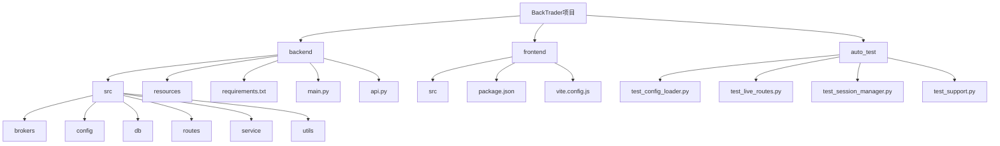

# 开发者指南

<cite>
**本文档中引用的文件**  
- [main.py](file://backend/main.py)
- [api.py](file://backend/api.py)
- [app.py](file://backend/src/service/app.py)
- [requirements.txt](file://backend/requirements.txt)
- [package.json](file://frontend/package.json)
- [.env.template](file://backend/.env.template)
- [.env.prod](file://backend/.env.prod)
- [start_dev.bat](file://start_dev.bat)
- [start_server.bat](file://start_server.bat)
- [Dockerfile](file://Dockerfile)
- [auto_test.md](file://auto_test/auto_test.md)
- [test_support.py](file://auto_test/test_support.py)
- [config_loader.py](file://backend/src/utils/config_loader.py)
- [ccxt_broker.py](file://backend/src/brokers/ccxt_adapter/ccxt_broker.py)
- [ibkr_store.py](file://backend/src/brokers/ibkr_adapter/ibkr_store.py)
- [operations-log.md](file://operations-log.md)
</cite>

## 目录
1. [简介](#简介)
2. [项目结构](#项目结构)
3. [开发环境搭建](#开发环境搭建)
4. [代码规范与测试策略](#代码规范与测试策略)
5. [功能模块开发](#功能模块开发)
6. [调试技巧](#调试技巧)
7. [常见问题解决方案](#常见问题解决方案)
8. [最佳实践](#最佳实践)

## 简介

本指南为新加入的开发者提供全面的入门和开发指导。文档详细说明了开发环境的搭建步骤，包括Python和Node.js的安装、依赖包的配置。提供了代码规范、测试策略（基于auto_test目录）和调试技巧。解释了如何添加新的功能模块、编写单元测试和进行代码调试。结合operations-log.md中的操作记录，提供了常见开发问题的解决方案。为新加入的开发者提供快速上手的路径和最佳实践。

## 项目结构

BackTrader项目是一个前后端分离的量化交易系统，包含后端API服务、前端用户界面和自动化测试套件。项目采用模块化设计，主要分为三个部分：backend（后端）、frontend（前端）和auto_test（自动化测试）。



**Diagram sources**
- [backend](file://backend)
- [frontend](file://frontend)
- [auto_test](file://auto_test)

**Section sources**
- [backend](file://backend)
- [frontend](file://frontend)
- [auto_test](file://auto_test)

## 开发环境搭建

### Python环境配置

项目后端基于Python 3.12构建，使用FastAPI框架。开发者需要安装Python 3.12或更高版本，并使用pip安装依赖包。

1. 安装Python 3.12（推荐使用官方安装包或pyenv）
2. 创建虚拟环境：
```bash
python -m venv venv
source venv/bin/activate  # Linux/Mac
venv\Scripts\activate     # Windows
```
3. 安装依赖：
```bash
pip install -r backend/requirements.txt
```

从requirements.txt文件可以看出，项目依赖包括：
- FastAPI>=0.103.2
- backtrader>=1.9.78.123
- pandas>=2.2.2
- ccxt（用于加密货币交易所集成）
- ibapi>=9.81.1（用于IBKR集成）

**Section sources**
- [requirements.txt](file://backend/requirements.txt)

### Node.js环境配置

前端基于React框架构建，使用Vite作为构建工具。

1. 安装Node.js 18或更高版本
2. 安装依赖：
```bash
cd frontend
npm install
```

从package.json文件可以看出，前端依赖包括：
- React 18.3.1
- Ant Design 6.1.0
- lightweight-charts（用于K线图展示）
- @logto/react（用于身份验证）

**Section sources**
- [package.json](file://frontend/package.json)

### 环境变量配置

项目使用环境变量进行配置管理。开发者需要创建.env文件或使用提供的模板。

1. 复制模板文件：
```bash
cp backend/.env.template backend/.env
```
2. 根据需要修改环境变量

.env.template文件定义了以下关键配置：
- 认证配置（LOGTO_ISSUER, LOGTO_JWKS_URI等）
- 外部服务（DATABASE_URL, OPENAI_API_KEY等）
- 实盘交易配置（LIVE_TRADING_ENABLED, DEFAULT_EXCHANGE等）
- 各交易所API密钥（CCXT_{EXCHANGE}_{MODE}_API_KEY等）

**Section sources**
- [.env.template](file://backend/.env.template)
- [.env.prod](file://backend/.env.prod)

### 启动开发环境

项目提供了批处理脚本简化开发环境的启动。

1. 使用start_dev.bat启动开发环境（Windows）：
```bash
start_dev.bat
```
该脚本会同时启动后端和前端开发服务器。

2. 或者分别启动：
```bash
# 启动后端
python backend/main.py

# 启动前端
cd frontend
npm run dev
```

从start_dev.bat脚本可以看出，它会：
- 检查backend和frontend目录是否存在
- 分别启动后端（端口8000）和前端（默认Vite端口5173）
- 在两个独立的终端窗口中运行

**Section sources**
- [start_dev.bat](file://start_dev.bat)
- [start_server.bat](file://start_server.bat)
- [main.py](file://backend/main.py)

## 代码规范与测试策略

### 代码规范

项目遵循Python和JavaScript的标准代码规范：

1. Python代码遵循PEP 8规范
2. 使用pydantic进行数据验证和配置管理
3. 前端使用React函数组件和Hooks
4. 组件化设计，高内聚低耦合

### 测试策略

项目采用分层测试策略，包括单元测试、集成测试和端到端测试。

#### 自动化测试框架

auto_test目录包含自动化集成/冒烟/系统测试用例，用于端到端或通过公共API测试应用程序。

关键特点：
- 测试文件以test_*.py命名
- 使用pytest框架
- 避免网络调用，使用桩或模拟外部服务
- 保持环境自包含：不写入仓库外，不需要真实密钥

运行测试：
```bash
# 运行所有测试
python -m pytest auto_test -q

# 运行单个测试
python -m pytest auto_test/test_live_routes.py -q
```

从auto_test.md文件可以看出，测试用例包括：
- FastAPI/API合同测试
- Live/CCXT适配器桩和高级工作流检查
- 可在CI中运行的回归套件（无需真实交易所凭据）

**Section sources**
- [auto_test.md](file://auto_test/auto_test.md)
- [test_support.py](file://auto_test/test_support.py)

#### 测试支持工具

test_support.py文件提供了自动化测试的共享帮助程序：

1. 确保后端模块可以从仓库根目录导入
2. 为本地测试运行禁用身份验证
3. 重置SessionManager状态以保持测试隔离

这些工具确保测试环境的一致性和可重复性。

**Section sources**
- [test_support.py](file://auto_test/test_support.py)

## 功能模块开发

### 配置管理模块

config_loader.py实现了配置加载和验证功能，是系统的核心组件之一。

主要功能：
- 加载和验证broker_config.json
- 提供类型化访问交易所设置、风险限制和交易参数
- 使用pydantic模型进行配置验证
- 支持缓存以提高性能

关键类和方法：
- BrokerConfig：完整的经纪商配置模型
- ExchangeConfig：交易所特定配置
- RiskManagement：风险管理配置
- load_broker_config()：加载和验证配置
- get_exchange_config()：获取特定交易所配置
- validate_symbol()：验证交易对格式
- validate_timeframe()：验证时间框架支持

从operations-log.md可以看出，该模块经过了多次迭代优化，包括：
- 2025-12-11：路由目录迁移，补充各目录协作说明
- 2025-12-12：新增IBKR适配器，支持IBKR环境变量

**Section sources**
- [config_loader.py](file://backend/src/utils/config_loader.py)
- [operations-log.md](file://operations-log.md)

### 交易所适配器

项目支持多种交易所适配器，目前包括CCXT和IBKR。

#### CCXT适配器

ccxt_broker.py实现了基于CCXT的经纪商，用于加密货币交易所订单执行。

核心功能：
- 提交订单到交易所通过CCXT
- 跟踪仓位和现金余额
- 处理订单生命周期（提交→填充→关闭）
- 提供投资组合估值

关键特性：
- 支持纸面交易和实盘交易模式
- 兼容Backtrader的getcash()和getvalue()方法
- 通过WebSocket广播订单和交易更新
- 支持市场订单和限价订单

**Section sources**
- [ccxt_broker.py](file://backend/src/brokers/ccxt_adapter/ccxt_broker.py)

#### IBKR适配器

ibkr_store.py实现了Interactive Brokers的适配器。

主要特点：
- 包装Backtrader的IBStore
- 支持通过环境变量配置连接参数
- 支持纸面交易和实盘模式
- 提供与CCXT适配器一致的API，便于策略代码无感知切换

从operations-log.md可以看出，IBKR适配器是2025-12-12新增的功能，支持通过环境变量配置：
- IBKR_{MODE}_HOST/PORT/CLIENT_ID/ACCOUNT

**Section sources**
- [ibkr_store.py](file://backend/src/brokers/ibkr_adapter/ibkr_store.py)
- [operations-log.md](file://operations-log.md)

## 调试技巧

### 日志调试

项目使用标准的Python logging模块进行日志记录。开发者可以通过以下方式增强调试能力：

1. 在代码中添加详细的日志语句
2. 调整日志级别以获取更多信息
3. 使用结构化日志记录关键操作

例如，在CCXTBroker中，关键操作都有日志记录：
- 订单提交和填充
- 余额同步
- 错误处理

### 环境隔离

使用不同的环境变量文件进行调试：

1. 开发环境：使用.backend/.env
2. 生产环境：使用.backend/.env.prod
3. 测试环境：通过test_support.py自动配置

### Docker调试

项目提供了Dockerfile用于容器化部署，也可用于调试。

Docker构建分为两个阶段：
1. 构建阶段：安装构建依赖，预编译wheel包
2. 运行阶段：使用预编译的wheel包，减少安装时间和依赖冲突

这种设计特别适合在中国大陆等网络环境复杂的地区，使用阿里云镜像加速依赖下载。

**Section sources**
- [Dockerfile](file://Dockerfile)
- [.env.template](file://backend/.env.template)
- [.env.prod](file://backend/.env.prod)

## 常见问题解决方案

### 依赖兼容性问题

根据operations-log.md记录，曾出现pycares 5.0.0与aiodns 3.6.0的兼容性问题。

解决方案：
- 在requirements.txt中固定aiodns和pycares的低版本
- 在README中补充故障排查指南

### 配置文件问题

常见问题包括：
- broker_config.json不存在
- 交易所配置格式错误
- 环境变量未正确设置

解决方案：
1. 确保复制broker_config.template.json到broker_config.json
2. 使用config_loader.py中的验证功能检查配置
3. 检查环境变量是否正确设置

### 交易所连接问题

对于CCXT连接：
- 确保API密钥正确
- 检查网络连接和代理设置
- 验证交易所是否在配置中启用

对于IBKR连接：
- 确保TWS或Gateway正在运行
- 检查防火墙设置
- 验证端口和客户端ID配置

**Section sources**
- [operations-log.md](file://operations-log.md)
- [config_loader.py](file://backend/src/utils/config_loader.py)

## 最佳实践

### 开发流程

1. **环境准备**：使用虚拟环境隔离依赖
2. **配置管理**：使用环境变量和配置文件分离敏感信息
3. **代码质量**：遵循代码规范，使用类型提示
4. **测试驱动**：先写测试，再实现功能
5. **持续集成**：确保自动化测试通过

### 安全实践

1. **密钥管理**：绝不提交.env文件到版本控制
2. **权限控制**：为API密钥设置交易权限（无提现权限）
3. **IP白名单**：尽可能为API密钥设置IP白名单
4. **2FA**：在交易所账户上启用双因素认证

### 性能优化

1. **配置缓存**：使用config_loader.py的缓存功能
2. **批量操作**：减少API调用次数
3. **异步处理**：使用async/await处理I/O密集型操作
4. **资源管理**：及时释放连接和资源

### 扩展开发

添加新功能模块的步骤：
1. 确定模块职责和接口
2. 创建相应的目录和文件
3. 实现核心功能
4. 添加单元测试
5. 更新文档

例如，添加新的交易所适配器：
1. 在src/brokers下创建新适配器目录
2. 实现与CCXT/IBKR适配器类似的API
3. 在config_loader.py中添加适配器验证
4. 更新broker_config.template.json
5. 添加相应的测试用例