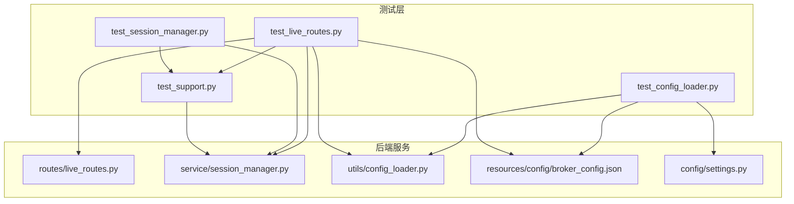
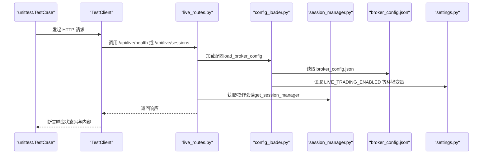
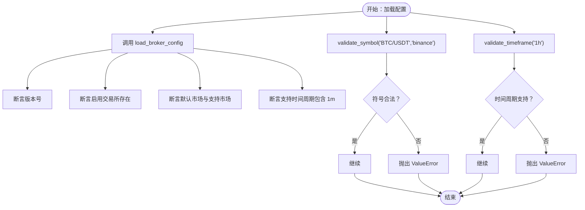
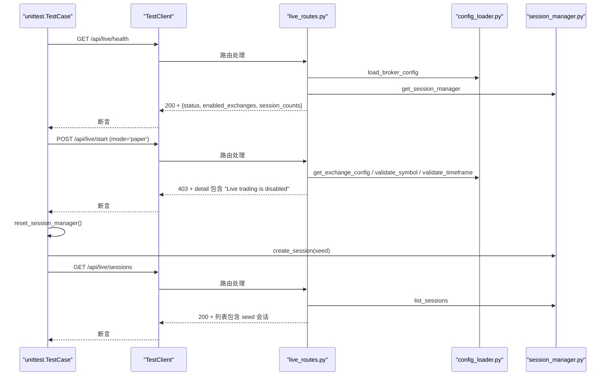
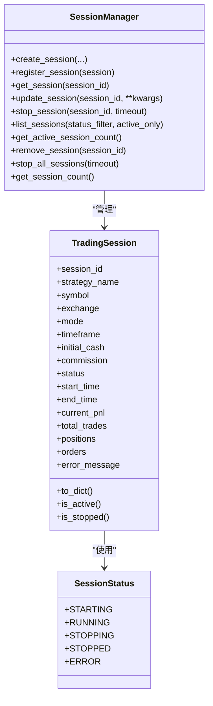
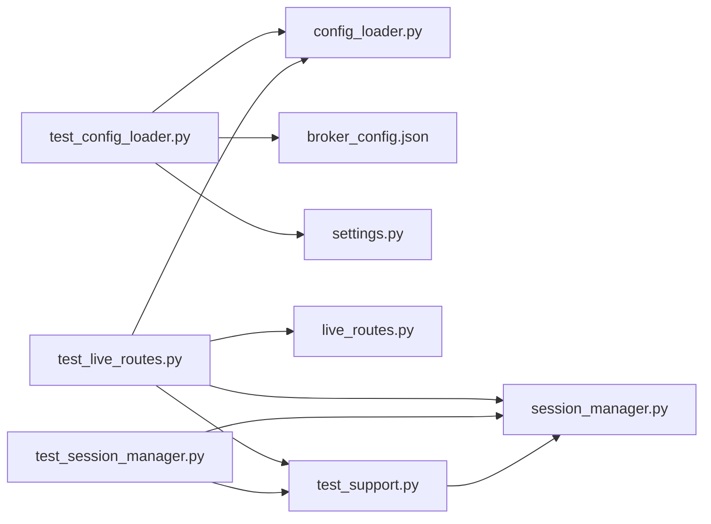

# 测试策略

<cite>
**本文引用的文件列表**
- [operations-log.md](file://operations-log.md)
- [test_config_loader.py](file://auto_test/test_config_loader.py)
- [test_live_routes.py](file://auto_test/test_live_routes.py)
- [test_session_manager.py](file://auto_test/test_session_manager.py)
- [test_support.py](file://auto_test/test_support.py)
- [config_loader.py](file://backend/src/utils/config_loader.py)
- [live_routes.py](file://backend/src/routes/live_routes.py)
- [session_manager.py](file://backend/src/service/session_manager.py)
- [settings.py](file://backend/src/config/settings.py)
- [broker_config.json](file://backend/resources/config/broker_config.json)
</cite>

## 目录
1. [引言](#引言)
2. [项目结构](#项目结构)
3. [核心组件](#核心组件)
4. [架构总览](#架构总览)
5. [详细组件分析](#详细组件分析)
6. [依赖关系分析](#依赖关系分析)
7. [性能考量](#性能考量)
8. [故障排查指南](#故障排查指南)
9. [结论](#结论)
10. [附录](#附录)

## 引言
本测试策略文档面向 auto_test 目录下的单元与集成测试用例，系统化梳理如何使用 pytest 框架进行自动化测试，覆盖 test_config_loader.py、test_live_routes.py、test_session_manager.py 的测试设计、断言验证与 mock 技术应用，并结合 operations-log.md 中的执行记录说明测试运行命令与预期输出。同时，给出测试覆盖率目标、测试数据准备方法及持续集成的可落地路径，针对 config_loader、live_routes、session_manager 等核心模块提供具体测试场景与边界条件建议。

## 项目结构
auto_test 目录包含三个核心测试文件与一个共享支持模块：
- test_config_loader.py：验证配置加载、校验工具与可用交易所列表。
- test_live_routes.py：集成测试，验证 FastAPI 路由在禁用实盘模式下的行为、会话管理与健康检查。
- test_session_manager.py：单元测试，验证会话创建、停止与批量停止。
- test_support.py：测试辅助工具，确保后端模块可导入、禁用认证与重置会话管理器全局状态。

图表来源
- [test_config_loader.py](file://auto_test/test_config_loader.py#L1-L57)
- [test_live_routes.py](file://auto_test/test_live_routes.py#L1-L125)
- [test_session_manager.py](file://auto_test/test_session_manager.py#L1-L71)
- [test_support.py](file://auto_test/test_support.py#L1-L47)
- [live_routes.py](file://backend/src/routes/live_routes.py#L1-L423)
- [session_manager.py](file://backend/src/service/session_manager.py#L1-L410)
- [config_loader.py](file://backend/src/utils/config_loader.py#L1-L343)
- [broker_config.json](file://backend/resources/config/broker_config.json#L1-L131)
- [settings.py](file://backend/src/config/settings.py#L1-L81)

章节来源
- [test_config_loader.py](file://auto_test/test_config_loader.py#L1-L57)
- [test_live_routes.py](file://auto_test/test_live_routes.py#L1-L125)
- [test_session_manager.py](file://auto_test/test_session_manager.py#L1-L71)
- [test_support.py](file://auto_test/test_support.py#L1-L47)

## 核心组件
- 配置加载器（config_loader）：负责加载 broker_config.json 并提供类型化访问、校验工具与可用交易所列表。
- 实盘路由（live_routes）：提供 /api/live/* 接口，受 LIVE_TRADING_ENABLED 控制，依赖配置加载与会话管理。
- 会话管理器（session_manager）：单例管理多个交易会话生命周期，提供创建、查询、停止、批量停止等能力。
- 测试支持（test_support）：统一导入路径、禁用登录与实盘开关、重置会话管理器全局状态，保证测试隔离。

章节来源
- [config_loader.py](file://backend/src/utils/config_loader.py#L1-L343)
- [live_routes.py](file://backend/src/routes/live_routes.py#L1-L423)
- [session_manager.py](file://backend/src/service/session_manager.py#L1-L410)
- [test_support.py](file://auto_test/test_support.py#L1-L47)

## 架构总览
下图展示测试运行时的关键交互：测试用例通过 FastAPI TestClient 调用 live_routes，后者依赖 config_loader 与 session_manager；config_loader 读取 broker_config.json 并受 settings.py 中环境变量影响；test_support 在测试前注入后端路径、禁用认证与实盘开关，并清理会话缓存。

图表来源
- [test_live_routes.py](file://auto_test/test_live_routes.py#L1-L125)
- [live_routes.py](file://backend/src/routes/live_routes.py#L1-L423)
- [config_loader.py](file://backend/src/utils/config_loader.py#L1-L343)
- [session_manager.py](file://backend/src/service/session_manager.py#L1-L410)
- [broker_config.json](file://backend/resources/config/broker_config.json#L1-L131)
- [settings.py](file://backend/src/config/settings.py#L1-L81)

## 详细组件分析

### 配置加载器测试（test_config_loader.py）
- 测试要点
  - 加载 broker_config.json 并断言版本号、启用交易所、默认市场与时间周期支持。
  - 使用 validate_symbol 与 validate_timeframe 验证符号格式与时区是否合法，非法输入触发 ValueError。
  - list_enabled_exchanges 返回包含 paper_mode_available 与 markets 的结构，用于前端或路由展示。
- 断言与异常
  - 使用 assertEqual、assertIn、assertTrue 验证配置字段。
  - 使用 assertRaises 验证错误输入抛出异常。
- 边界条件
  - 未启用交易所不应出现在可用列表中。
  - 不支持的时间周期应触发校验失败。
  - 符号格式错误（如缺少分隔符、多余斜杠）应触发校验失败。

图表来源
- [test_config_loader.py](file://auto_test/test_config_loader.py#L1-L57)
- [config_loader.py](file://backend/src/utils/config_loader.py#L1-L343)
- [broker_config.json](file://backend/resources/config/broker_config.json#L1-L131)

章节来源
- [test_config_loader.py](file://auto_test/test_config_loader.py#L1-L57)
- [config_loader.py](file://backend/src/utils/config_loader.py#L1-L343)
- [broker_config.json](file://backend/resources/config/broker_config.json#L1-L131)

### 实盘路由测试（test_live_routes.py）
- 测试要点
  - 使用 FastAPI TestClient 调用 /api/live/health 与 /api/live/sessions。
  - 在禁用实盘模式（LIVE_TRADING_ENABLED=false）下，/api/live/start 应返回 403。
  - 通过重置会话管理器，手动创建会话并断言 /api/live/sessions 返回值包含种子会话。
- Mock 技术
  - 通过 sys.modules 注入轻量 stub（ccxt.async_support 与 ccxt 根模块），避免真实网络请求与第三方库初始化开销。
- 断言与异常
  - 响应状态码断言（200/403）。
  - JSON 负载断言（status、enabled_exchanges、session_counts 等）。
  - 错误详情包含预期关键字。

图表来源
- [test_live_routes.py](file://auto_test/test_live_routes.py#L1-L125)
- [live_routes.py](file://backend/src/routes/live_routes.py#L1-L423)
- [config_loader.py](file://backend/src/utils/config_loader.py#L1-L343)
- [session_manager.py](file://backend/src/service/session_manager.py#L1-L410)

章节来源
- [test_live_routes.py](file://auto_test/test_live_routes.py#L1-L125)
- [live_routes.py](file://backend/src/routes/live_routes.py#L1-L423)
- [settings.py](file://backend/src/config/settings.py#L1-L81)

### 会话管理器测试（test_session_manager.py）
- 测试要点
  - 创建会话并断言初始状态为 STARTING，且 is_active() 为真。
  - 停止会话断言状态变为 STOPPED，结束时间非空，is_stopped() 为真。
  - 批量停止多个会话，断言返回成功字典与最终状态一致。
- 断言与异常
  - 使用 assertEqual、assertIsTrue、assertIsNotNone 验证状态与时间戳。
  - 断言 stop_all_sessions 返回集合与输入集合一致。

图表来源
- [session_manager.py](file://backend/src/service/session_manager.py#L1-L410)

章节来源
- [test_session_manager.py](file://auto_test/test_session_manager.py#L1-L71)
- [session_manager.py](file://backend/src/service/session_manager.py#L1-L410)

## 依赖关系分析
- 测试对被测模块的耦合
  - test_config_loader.py 依赖 config_loader 与 broker_config.json。
  - test_live_routes.py 依赖 live_routes、config_loader、session_manager，并通过 sys.modules 注入 ccxt stub。
  - test_session_manager.py 依赖 session_manager。
- 环境与配置
  - settings.py 提供 LIVE_TRADING_ENABLED、ENABLE_LOGIN 等开关，test_support 默认将其设为关闭以避免外部依赖。
- 可能的循环依赖
  - 当前测试文件与被测模块之间为单向依赖，无循环导入迹象。

图表来源
- [test_config_loader.py](file://auto_test/test_config_loader.py#L1-L57)
- [test_live_routes.py](file://auto_test/test_live_routes.py#L1-L125)
- [test_session_manager.py](file://auto_test/test_session_manager.py#L1-L71)
- [test_support.py](file://auto_test/test_support.py#L1-L47)
- [live_routes.py](file://backend/src/routes/live_routes.py#L1-L423)
- [session_manager.py](file://backend/src/service/session_manager.py#L1-L410)
- [config_loader.py](file://backend/src/utils/config_loader.py#L1-L343)
- [broker_config.json](file://backend/resources/config/broker_config.json#L1-L131)
- [settings.py](file://backend/src/config/settings.py#L1-L81)

章节来源
- [test_config_loader.py](file://auto_test/test_config_loader.py#L1-L57)
- [test_live_routes.py](file://auto_test/test_live_routes.py#L1-L125)
- [test_session_manager.py](file://auto_test/test_session_manager.py#L1-L71)
- [test_support.py](file://auto_test/test_support.py#L1-L47)

## 性能考量
- 测试运行效率
  - 通过 sys.modules 注入 ccxt stub，避免真实网络请求与第三方库初始化，显著降低集成测试耗时。
  - 使用 reload=True 或重新加载配置可减少磁盘 IO 对测试的影响。
- 并发与隔离
  - 使用 reset_session_manager 清理全局会话缓存，避免跨用例污染。
  - SessionManager 内部使用锁保护并发安全，测试中应关注超时与线程退出。
- 日志与可观测性
  - 路由与配置加载均记录日志，便于定位测试失败原因。

## 故障排查指南
- 常见问题
  - 实盘启动返回 403：确认 LIVE_TRADING_ENABLED=false 已生效（test_support 已默认设置）。
  - 配置加载失败：检查 broker_config.json 是否存在、JSON 是否有效、字段是否符合 Pydantic 模型定义。
  - 会话停止失败：检查 stop_session 超时设置与线程是否存活。
- 定位手段
  - 查看 operations-log.md 中的 pytest 执行记录，确认测试通过数量与第三方警告。
  - 在本地运行 pytest 时增加 -v 与 -s 参数查看详细输出与日志。

章节来源
- [operations-log.md](file://operations-log.md#L1-L19)
- [test_support.py](file://auto_test/test_support.py#L1-L47)
- [live_routes.py](file://backend/src/routes/live_routes.py#L1-L423)
- [config_loader.py](file://backend/src/utils/config_loader.py#L1-L343)

## 结论
本测试策略围绕 auto_test 下的三个核心测试文件展开，采用单元与集成相结合的方式，通过断言验证配置加载、路由行为与会话生命周期。借助 test_support 的环境与全局状态管理，配合 sys.modules 注入的 ccxt stub，既保证了测试稳定性，又提升了执行效率。建议在 CI 中固定运行 pytest 并保留第三方警告提示，逐步消除警告以提升长期可维护性。

## 附录

### 测试运行命令与预期输出
- 运行命令
  - 在仓库根目录执行：python -m pytest auto_test -q
- 预期输出
  - operations-log.md 记录显示：在某次执行中，9/9 通过，仅剩第三方弃用警告。
  - 建议在 CI 中保持相同命令，确保每次提交均跑通全部用例。

章节来源
- [operations-log.md](file://operations-log.md#L1-L19)

### 测试覆盖率与数据准备
- 覆盖率建议
  - 目标：核心模块（config_loader、live_routes、session_manager）达到中高覆盖率，重点覆盖分支与异常路径。
- 数据准备
  - broker_config.json：包含至少一个启用交易所与一个禁用交易所，确保 list_enabled_exchanges 与 get_exchange_config 的分支覆盖。
  - 环境变量：通过 test_support 设置 ENABLE_LOGIN=false、LIVE_TRADING_ENABLED=false，避免外部依赖。
  - 会话数据：在会话管理器测试中使用 UUID 生成唯一 session_id，确保幂等性与可重复性。

章节来源
- [test_support.py](file://auto_test/test_support.py#L1-L47)
- [broker_config.json](file://backend/resources/config/broker_config.json#L1-L131)

### 持续集成（CI）实现路径
- 触发条件
  - push 到主分支或 PR 合并请求。
- 步骤建议
  - 安装依赖（requirements.txt）。
  - 运行 pytest auto_test -q 并记录结果。
  - 将第三方弃用警告作为“警告”而非失败项，逐步清理。
- 可视化
  - 在 CI 报告中标注通过用例数与失败用例摘要，便于快速定位问题。

[本节为通用实践建议，无需特定文件来源]