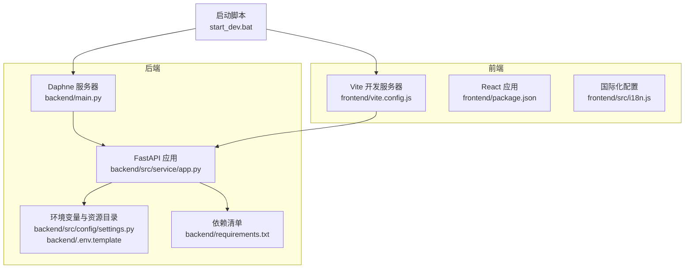
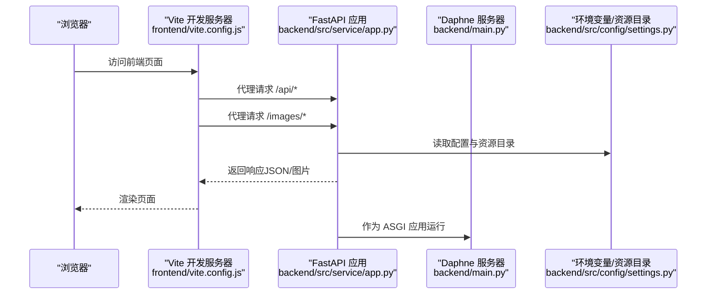
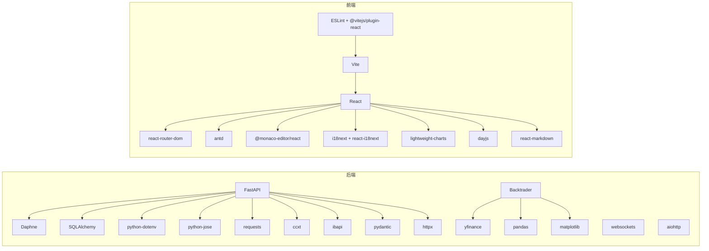

# 环境搭建

<cite>
**本文引用的文件**
- [start_dev.bat](file://start_dev.bat)
- [backend/main.py](file://backend/main.py)
- [backend/src/service/app.py](file://backend/src/service/app.py)
- [backend/src/config/settings.py](file://backend/src/config/settings.py)
- [backend/requirements.txt](file://backend/requirements.txt)
- [backend/.env.template](file://backend/.env.template)
- [frontend/package.json](file://frontend/package.json)
- [frontend/vite.config.js](file://frontend/vite.config.js)
- [frontend/src/i18n.js](file://frontend/src/i18n.js)
- [operations-log.md](file://operations-log.md)
- [backend/src/brokers/ccxt_adapter/ccxt_adapter.md](file://backend/src/brokers/ccxt_adapter/ccxt_adapter.md)
- [backend/src/brokers/ibkr_adapter/ibkr_adapter.md](file://backend/src/brokers/ibkr_adapter/ibkr_adapter.md)
- [feature.md](file://feature.md)
</cite>

## 目录
1. [简介](#简介)
2. [项目结构](#项目结构)
3. [核心组件](#核心组件)
4. [架构总览](#架构总览)
5. [详细组件分析](#详细组件分析)
6. [依赖关系分析](#依赖关系分析)
7. [性能考虑](#性能考虑)
8. [故障排查指南](#故障排查指南)
9. [结论](#结论)
10. [附录](#附录)

## 简介
本指南面向首次参与开发的工程师，围绕 Python 与 Node.js 开发环境的搭建，系统讲解后端（FastAPI + Daphne，端口 8000）与前端（Vite，端口 5173）的启动流程、双终端窗口运行机制、依赖安装与版本约束、以及常见问题的排查方法。同时结合后端 requirements.txt 中的关键依赖（如 backtrader、fastapi、ccxt、ibapi 等）与前端 package.json 的技术栈（React、Vite、Ant Design、i18next），提供可操作的安装命令与配置要点，并基于 operations-log.md 中记录的 pycares 与 aiodns 兼容性问题，给出针对性的解决方案。

## 项目结构
该项目采用前后端分离架构：
- 后端使用 FastAPI + Daphne 提供 HTTP/WebSocket 服务，默认监听 0.0.0.0:8000。
- 前端使用 Vite + React，开发服务器默认端口 5173，通过代理将 /api 与 /images 请求转发到后端。
- 启动脚本 start_dev.bat 会在两个独立终端窗口分别启动后端与前端，便于观察日志与错误。

图表来源
- [start_dev.bat](file://start_dev.bat#L1-L24)
- [backend/main.py](file://backend/main.py#L1-L21)
- [backend/src/service/app.py](file://backend/src/service/app.py#L1-L31)
- [backend/src/config/settings.py](file://backend/src/config/settings.py#L1-L81)
- [backend/requirements.txt](file://backend/requirements.txt#L1-L24)
- [frontend/vite.config.js](file://frontend/vite.config.js#L1-L24)
- [frontend/package.json](file://frontend/package.json#L1-L40)
- [frontend/src/i18n.js](file://frontend/src/i18n.js#L1-L111)

章节来源
- [start_dev.bat](file://start_dev.bat#L1-L24)
- [backend/main.py](file://backend/main.py#L1-L21)
- [backend/src/service/app.py](file://backend/src/service/app.py#L1-L31)
- [backend/src/config/settings.py](file://backend/src/config/settings.py#L1-L81)
- [backend/requirements.txt](file://backend/requirements.txt#L1-L24)
- [frontend/vite.config.js](file://frontend/vite.config.js#L1-L24)
- [frontend/package.json](file://frontend/package.json#L1-L40)
- [frontend/src/i18n.js](file://frontend/src/i18n.js#L1-L111)

## 核心组件
- 后端应用与服务器
  - FastAPI 应用在 backend/src/service/app.py 中创建，并挂载多个路由前缀（/api），同时挂载静态资源与前端构建产物。
  - Daphne 服务器在 backend/main.py 中以 TCP 端点方式启动，监听 HOST/PORT 环境变量，默认 0.0.0.0:8000。
  - 环境变量与资源目录在 backend/src/config/settings.py 中集中管理，包含 IMAGES_DIR、STRATEGY_DIR、FRONTEND_DIR 等路径及登录开关、代理、外部服务等配置项。
- 前端应用
  - Vite 配置在 frontend/vite.config.js 中，设置代理将 /api 与 /images 转发到后端 127.0.0.1:8000。
  - package.json 定义了 React、Ant Design、i18next、轻量图表等依赖与开发工具链。
  - 国际化在 frontend/src/i18n.js 中初始化，支持中英文资源映射与语言探测。
- 启动脚本
  - start_dev.bat 使用 Windows start 打开两个终端窗口，分别进入 backend 与 frontend 目录执行后端与前端的开发命令，便于同时观察日志与错误。

章节来源
- [backend/src/service/app.py](file://backend/src/service/app.py#L1-L31)
- [backend/main.py](file://backend/main.py#L1-L21)
- [backend/src/config/settings.py](file://backend/src/config/settings.py#L1-L81)
- [frontend/vite.config.js](file://frontend/vite.config.js#L1-L24)
- [frontend/package.json](file://frontend/package.json#L1-L40)
- [frontend/src/i18n.js](file://frontend/src/i18n.js#L1-L111)
- [start_dev.bat](file://start_dev.bat#L1-L24)

## 架构总览
下图展示了开发模式下的请求流：浏览器访问前端页面，前端通过 Vite 代理将 /api 与 /images 请求转发到后端；后端 FastAPI 路由处理业务逻辑，必要时生成图片并返回；WebSocket 路由用于实时通信。

图表来源
- [frontend/vite.config.js](file://frontend/vite.config.js#L1-L24)
- [backend/src/service/app.py](file://backend/src/service/app.py#L1-L31)
- [backend/main.py](file://backend/main.py#L1-L21)
- [backend/src/config/settings.py](file://backend/src/config/settings.py#L1-L81)

## 详细组件分析

### 后端：FastAPI + Daphne（端口 8000）
- 应用创建与路由挂载
  - 在 backend/src/service/app.py 中创建 FastAPI 实例，启用 CORS 并挂载多组路由（/api 前缀），同时挂载前端静态资源。
- 服务器启动
  - 在 backend/main.py 中，通过 Daphne Server 以 TCP 端点方式启动，监听 HOST/PORT 环境变量，默认 0.0.0.0:8000。
- 环境变量与资源目录
  - backend/src/config/settings.py 统一读取 .env 文件，设置 IMAGES_DIR、STRATEGY_DIR、FRONTEND_DIR 等路径，并提供登录开关、代理、外部服务等配置。
- 关键依赖与版本要求
  - 后端依赖在 backend/requirements.txt 中声明，包含 fastapi、daphne、backtrader、yfinance、pandas、matplotlib、SQLAlchemy、openai、ccxt、ibapi、websockets、aiohttp、pydantic、httpx 等，部分版本存在冲突约束。

章节来源
- [backend/src/service/app.py](file://backend/src/service/app.py#L1-L31)
- [backend/main.py](file://backend/main.py#L1-L21)
- [backend/src/config/settings.py](file://backend/src/config/settings.py#L1-L81)
- [backend/requirements.txt](file://backend/requirements.txt#L1-L24)

### 前端：Vite + React（端口 5173）
- 技术栈与依赖
  - 前端 package.json 包含 React、React DOM、Ant Design、i18next、react-router-dom、轻量图表、Monaco 编辑器、Logto React Provider 等依赖，以及 Vite、ESLint、React 插件等开发工具。
- 开发服务器与代理
  - Vite 配置 frontend/vite.config.js 将 /api 与 /images 请求代理到后端 127.0.0.1:8000，便于前后端联调。
- 国际化
  - frontend/src/i18n.js 初始化 i18next，加载中英文资源，支持 zh-CN、zh-TW 等映射，调试模式开启。

章节来源
- [frontend/package.json](file://frontend/package.json#L1-L40)
- [frontend/vite.config.js](file://frontend/vite.config.js#L1-L24)
- [frontend/src/i18n.js](file://frontend/src/i18n.js#L1-L111)

### 启动流程与双终端窗口机制
- start_dev.bat
  - 校验 backend 与 frontend 目录是否存在，若不存在则退出。
  - 使用 start 命令打开两个新终端窗口，分别进入 backend 与 frontend 目录，执行后端与前端的开发命令。
  - 两个窗口分别显示后端与前端的日志，便于快速定位问题。
- 后端端口与前端端口
  - 后端默认端口 8000（可通过 HOST/PORT 环境变量调整）。
  - 前端默认端口 5173（Vite 默认端口），代理将 /api 与 /images 转发到后端 8000。

章节来源
- [start_dev.bat](file://start_dev.bat#L1-L24)
- [backend/main.py](file://backend/main.py#L1-L21)
- [frontend/vite.config.js](file://frontend/vite.config.js#L1-L24)

### 依赖安装与版本约束
- Python 后端依赖
  - 必要依赖：fastapi、daphne、backtrader、yfinance、pandas、matplotlib、python-dotenv、openai、python-multipart、python-jose、requests、SQLAlchemy、pydantic、ccxt、websockets、aiohttp、ibapi、httpx。
  - 版本约束：requirements.txt 明确 httpx 的最低版本，以避免与其他包的冲突。
- Node.js 前端依赖
  - 生产依赖：react、react-dom、antd、i18next、react-i18next、react-router-dom、lightweight-charts、monaco-editor、@monaco-editor/react、@logto/react、dayjs、react-markdown。
  - 开发依赖：vite、@vitejs/plugin-react、eslint、@types/react、@types/react-dom、eslint-plugin-react、eslint-plugin-react-hooks、eslint-plugin-react-refresh、globals。
- 安装命令示例（请在各自目录执行）
  - 后端：pip install -r backend/requirements.txt
  - 前端：npm install
  - 若遇到 DNS/异步解析兼容性问题，参考“故障排查指南”的解决方案后再安装。

章节来源
- [backend/requirements.txt](file://backend/requirements.txt#L1-L24)
- [frontend/package.json](file://frontend/package.json#L1-L40)

### 实盘适配器与环境变量
- CCXT 适配器
  - 后端通过 CCXT 连接交易所，支持纸盘/实盘模式，API Key/Secret 通过环境变量注入，格式为 CCXT_{EXCHANGE}_{MODE}_API_KEY/SECRET。
- IBKR 适配器
  - 通过 ibapi 提供 IBKR 连接，支持 IBKR_HOST/PORT/CLIENT_ID/ACCOUNT 等环境变量，适配器在 live_engine 中按配置自动选择 CCXT/IBKR。
- 环境变量模板
  - backend/.env.template 提供了登录、数据库、OpenAI、代理、实盘配置等模板字段，需复制为 .env 并填写相应值。

章节来源
- [backend/src/brokers/ccxt_adapter/ccxt_adapter.md](file://backend/src/brokers/ccxt_adapter/ccxt_adapter.md#L1-L19)
- [backend/src/brokers/ibkr_adapter/ibkr_adapter.md](file://backend/src/brokers/ibkr_adapter/ibkr_adapter.md#L1-L19)
- [backend/.env.template](file://backend/.env.template#L1-L86)

## 依赖关系分析
- 后端依赖关系
  - FastAPI 作为 Web 框架，依赖 Daphne 作为 ASGI 服务器。
  - 数据与可视化：backtrader、yfinance、pandas、matplotlib。
  - 数据库与认证：SQLAlchemy、python-dotenv、python-jose、requests。
  - 实盘集成：ccxt、ibapi、websockets、aiohttp、pydantic。
  - 版本约束：httpx 的最低版本以避免与 investiny 冲突。
- 前端依赖关系
  - React 生态：react、react-dom、react-router-dom。
  - UI 与编辑器：antd、@monaco-editor/react、monaco-editor。
  - 国际化：i18next、react-i18next、i18next-browser-languagedetector。
  - 图表与工具：lightweight-charts、dayjs、react-markdown。
  - 开发工具：vite、@vitejs/plugin-react、eslint、@types/*。

图表来源
- [backend/requirements.txt](file://backend/requirements.txt#L1-L24)
- [frontend/package.json](file://frontend/package.json#L1-L40)

章节来源
- [backend/requirements.txt](file://backend/requirements.txt#L1-L24)
- [frontend/package.json](file://frontend/package.json#L1-L40)

## 性能考虑
- 后端
  - 懒加载与连接复用：适配器层避免在 import 阶段发起网络请求，降低启动开销。
  - 异步与并发：使用 websockets/aiohttp 提升实时数据与订单处理能力。
  - 图片生成与存储：回测结果图片保存在 IMAGES_DIR，注意磁盘 IO 与缓存策略。
- 前端
  - Vite 开发模式默认关闭压缩与 SourceMap，便于调试；生产构建可开启压缩与 SourceMap。
  - 国际化资源按需加载，减少首屏体积。

章节来源
- [backend/src/brokers/ccxt_adapter/ccxt_adapter.md](file://backend/src/brokers/ccxt_adapter/ccxt_adapter.md#L1-L19)
- [backend/src/brokers/ibkr_adapter/ibkr_adapter.md](file://backend/src/brokers/ibkr_adapter/ibkr_adapter.md#L1-L19)
- [frontend/vite.config.js](file://frontend/vite.config.js#L1-L24)

## 故障排查指南
- pycares 与 aiodns 兼容性问题
  - 现象：导入 ccxt 时报错，定位为 pycares 5.0.0 与 aiodns 3.6.0 兼容性问题。
  - 解决方案：在 requirements.txt 中固定 aiodns 与 pycares 的较低版本，避免冲突。
  - 参考记录：operations-log.md 中明确记录了该问题的复现、定位与修复过程。
- 端口占用
  - 后端默认 8000，前端默认 5173。若端口被占用，请修改 HOST/PORT 环境变量或释放端口。
- CORS 与代理
  - 前端代理已配置 /api 与 /images 到 127.0.0.1:8000；若跨域或代理无效，请检查 vite.config.js 的 proxy 配置与后端 CORS 设置。
- 实盘配置
  - 确保 .env 中的 CCXT_{EXCHANGE}_{MODE}_API_KEY/SECRET 或 IBKR_* 环境变量正确填写；纸盘优先，实盘务必谨慎。
- 依赖安装失败
  - 若 DNS/异步解析相关报错，先按“pycares 与 aiodns 兼容性问题”的解决思路固定版本，再执行 pip/npm 安装。
- 双终端窗口无日志
  - start_dev.bat 已在两个窗口中启动后端与前端；若窗口立即关闭，检查脚本中的错误提示与依赖安装是否成功。

章节来源
- [operations-log.md](file://operations-log.md#L1-L19)
- [frontend/vite.config.js](file://frontend/vite.config.js#L1-L24)
- [backend/src/service/app.py](file://backend/src/service/app.py#L1-L31)
- [backend/src/config/settings.py](file://backend/src/config/settings.py#L1-L81)
- [backend/requirements.txt](file://backend/requirements.txt#L1-L24)
- [start_dev.bat](file://start_dev.bat#L1-L24)

## 结论
通过本指南，您可以完成 Python 与 Node.js 开发环境的搭建，理解后端 FastAPI + Daphne 与前端 Vite 的启动流程与端口约定，掌握关键依赖的安装与版本约束，并针对 pycares 与 aiodns 的兼容性问题采取有效措施。双终端窗口的运行机制有助于并行观察后端与前端日志，提升开发效率与问题定位速度。

## 附录
- 建议功能扩展方向（基于 feature.md）
  - 数据层强化、参数优化/网格搜索、多标的/组合回测、风控与持仓管理、实盘/纸盘桥接、Walk-forward 与回测集/验证集、事件通知与任务调度、监控与审计、用户与团队协作。

章节来源
- [feature.md](file://feature.md#L1-L12)