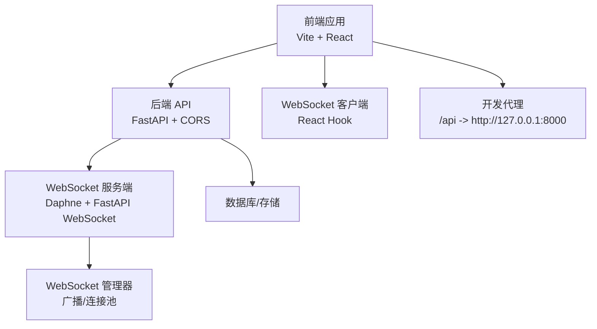
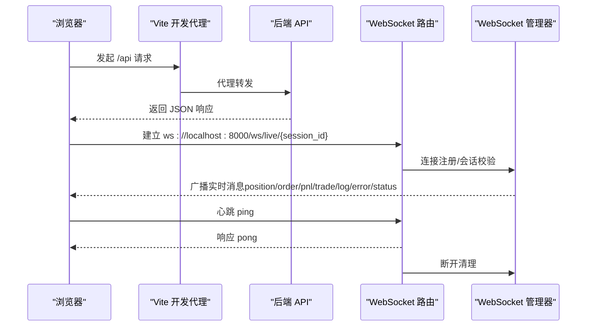
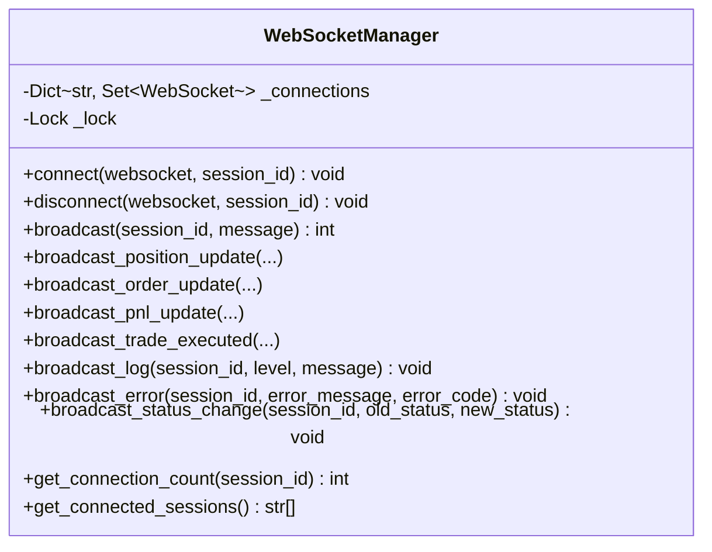
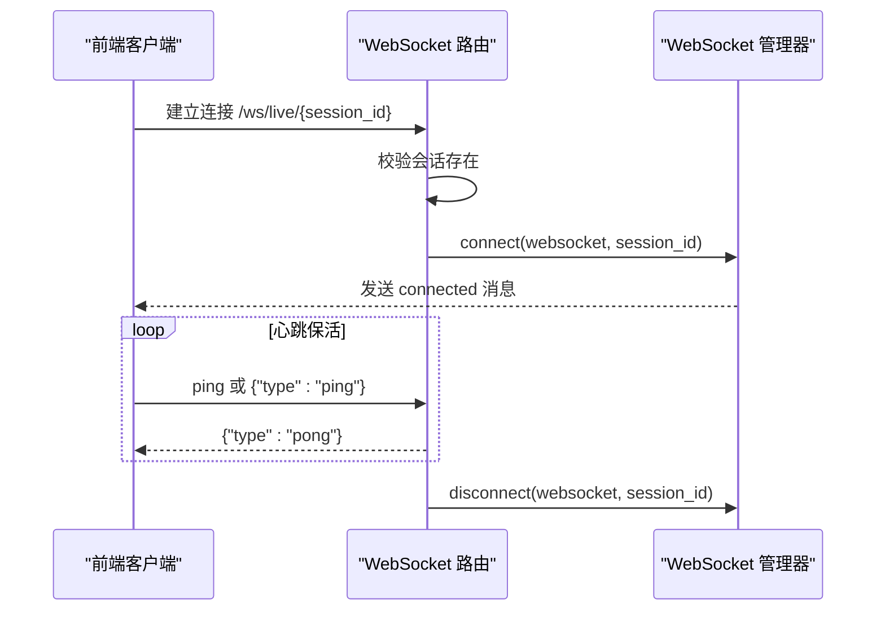
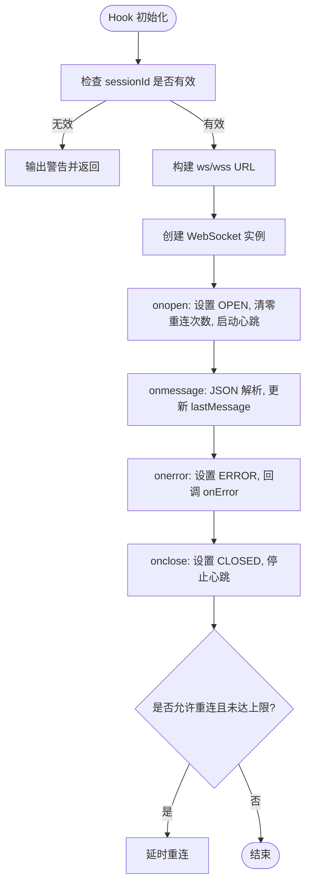
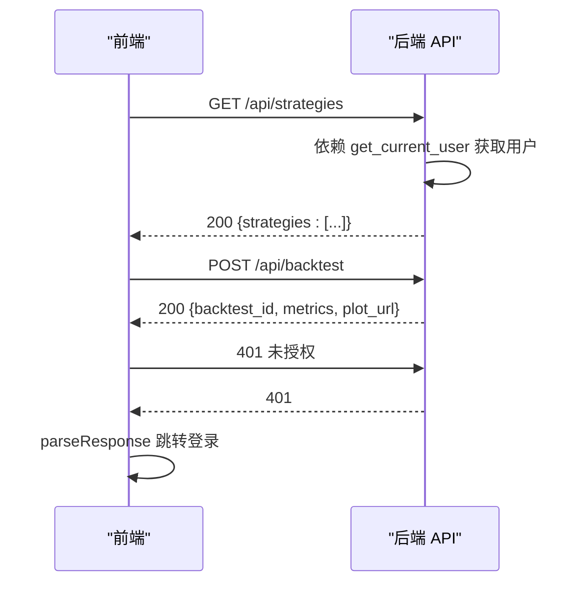
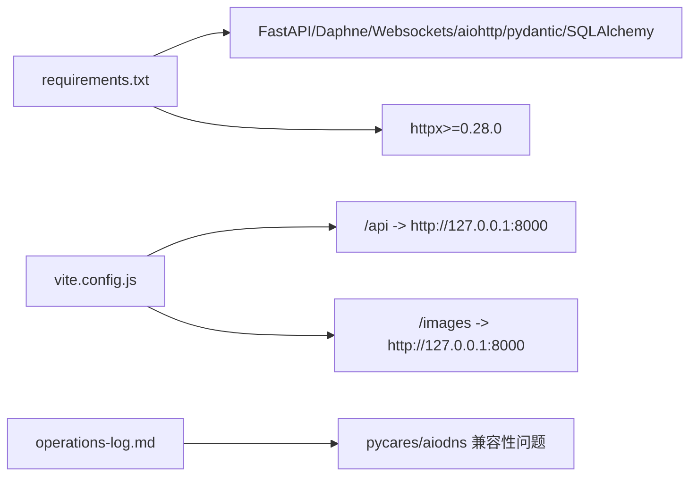

# 调试技巧

<cite>
**本文引用的文件**
- [operations-log.md](file://operations-log.md)
- [backend/main.py](file://backend/main.py)
- [frontend/src/main.jsx](file://frontend/src/main.jsx)
- [backend/src/service/websocket_manager.py](file://backend/src/service/websocket_manager.py)
- [backend/src/routes/websocket_routes.py](file://backend/src/routes/websocket_routes.py)
- [frontend/src/services/websocket.js](file://frontend/src/services/websocket.js)
- [backend/src/service/app.py](file://backend/src/service/app.py)
- [backend/src/routes/api_routes.py](file://backend/src/routes/api_routes.py)
- [frontend/src/services/api.js](file://frontend/src/services/api.js)
- [frontend/vite.config.js](file://frontend/vite.config.js)
- [backend/requirements.txt](file://backend/requirements.txt)
- [backend/src/config/settings.py](file://backend/src/config/settings.py)
- [backend/.env.template](file://backend/.env.template)
- [auto_test/test_config_loader.py](file://auto_test/test_config_loader.py)
- [CLAUDE.md](file://CLAUDE.md)
</cite>

## 目录
1. [简介](#简介)
2. [项目结构](#项目结构)
3. [核心组件](#核心组件)
4. [架构总览](#架构总览)
5. [详细组件分析](#详细组件分析)
6. [依赖关系分析](#依赖关系分析)
7. [性能考量](#性能考量)
8. [故障排查指南](#故障排查指南)
9. [结论](#结论)
10. [附录](#附录)

## 简介
本指南聚焦于本项目的调试实践，结合运维日志中记录的实际问题，总结常见错误的诊断与修复路径。内容覆盖：
- 环境兼容性问题（如 pycares 与 aiodns 冲突）的依赖版本锁定与虚拟环境管理最佳实践
- 前后端通信调试（API 请求追踪、WebSocket 消息监控、跨域错误处理）
- 使用日志分析（参考后端启动日志与前端入口日志）定位系统异常
- 实时数据流（WebSocket 管理器）的消息序列跟踪与状态同步调试
- 性能瓶颈识别、内存泄漏排查与异步任务调试的高级技巧，并以运维日志中的具体案例为实践参考

## 项目结构
项目采用前后端分离架构：后端基于 FastAPI + Daphne 提供 API 与 WebSocket 服务，前端基于 Vite + React 提供交互界面。关键调试点包括：
- 后端启动入口与中间件配置
- WebSocket 路由与消息广播
- 前端代理与认证流程
- 配置加载与环境变量注入
- 运维日志中的已知问题与修复方案

图表来源
- [backend/src/service/app.py](file://backend/src/service/app.py#L1-L31)
- [frontend/vite.config.js](file://frontend/vite.config.js#L1-L23)
- [backend/src/routes/websocket_routes.py](file://backend/src/routes/websocket_routes.py#L1-L239)
- [backend/src/service/websocket_manager.py](file://backend/src/service/websocket_manager.py#L1-L401)

章节来源
- [backend/src/service/app.py](file://backend/src/service/app.py#L1-L31)
- [frontend/vite.config.js](file://frontend/vite.config.js#L1-L23)

## 核心组件
- 后端启动与服务入口：负责监听主机与端口，启动 Daphne 服务器，承载 FastAPI 应用。
- WebSocket 管理器：集中维护会话级连接池，广播消息类型（位置、订单、盈亏、成交、日志、错误、状态变更），并清理失效连接。
- WebSocket 路由：提供 /ws/live/{session_id} 端点，处理连接、心跳、会话校验与断开清理。
- 前端 WebSocket 客户端 Hook：封装连接、重连、心跳、消息解析与生命周期管理。
- API 路由与认证：统一前缀 /api 的 REST 接口，集成认证令牌注入与错误处理。
- 开发代理：Vite 将 /api 与 /images 代理到后端，便于本地联调。
- 配置与环境：dotenv 注入环境变量，模板化敏感配置，避免硬编码。

章节来源
- [backend/main.py](file://backend/main.py#L1-L21)
- [backend/src/service/websocket_manager.py](file://backend/src/service/websocket_manager.py#L1-L401)
- [backend/src/routes/websocket_routes.py](file://backend/src/routes/websocket_routes.py#L1-L239)
- [frontend/src/services/websocket.js](file://frontend/src/services/websocket.js#L1-L282)
- [backend/src/routes/api_routes.py](file://backend/src/routes/api_routes.py#L1-L341)
- [frontend/src/services/api.js](file://frontend/src/services/api.js#L1-L89)
- [frontend/vite.config.js](file://frontend/vite.config.js#L1-L23)
- [backend/src/config/settings.py](file://backend/src/config/settings.py#L1-L81)
- [backend/.env.template](file://backend/.env.template#L1-L39)

## 架构总览
下图展示从前端到后端的关键交互路径与调试关注点。

图表来源
- [frontend/vite.config.js](file://frontend/vite.config.js#L1-L23)
- [backend/src/service/app.py](file://backend/src/service/app.py#L1-L31)
- [backend/src/routes/websocket_routes.py](file://backend/src/routes/websocket_routes.py#L1-L239)
- [backend/src/service/websocket_manager.py](file://backend/src/service/websocket_manager.py#L1-L401)

## 详细组件分析

### WebSocket 管理器与消息广播
- 连接管理：按会话维护连接集合，支持并发多会话；连接建立时发送欢迎消息，断开时清理并移除空会话。
- 广播机制：复制连接集合以避免迭代期间修改；对发送失败的连接进行收集并在锁内清理；记录调试日志与发送计数。
- 消息类型：position、order、pnl、trade、log、error、status；log 包含时间戳，error 支持可选错误码。
- 状态同步：通过 status 类型广播会话状态变更，前端据此更新 UI。

图表来源
- [backend/src/service/websocket_manager.py](file://backend/src/service/websocket_manager.py#L1-L401)

章节来源
- [backend/src/service/websocket_manager.py](file://backend/src/service/websocket_manager.py#L1-L401)

### WebSocket 路由与心跳保活
- 路由定义：/ws/live/{session_id}，接收文本消息；支持字符串 "ping" 与 JSON {"type":"ping"} 两种心跳格式；未知消息记录告警。
- 会话校验：连接前检查会话是否存在，不存在则关闭连接并返回 1008。
- 异常处理：捕获断开与异常，最终清理连接；记录调试与异常日志。

图表来源
- [backend/src/routes/websocket_routes.py](file://backend/src/routes/websocket_routes.py#L1-L239)
- [backend/src/service/websocket_manager.py](file://backend/src/service/websocket_manager.py#L1-L401)

章节来源
- [backend/src/routes/websocket_routes.py](file://backend/src/routes/websocket_routes.py#L1-L239)

### 前端 WebSocket Hook 与心跳
- 连接与自动重连：根据 sessionId 动态构建 ws/wss 地址；支持最大重连次数与间隔；断线后清理定时器与状态。
- 心跳保活：周期性发送 {type:"ping"}，收到 {"type":"pong"} 视为心跳正常。
- 消息解析：统一 JSON 解析与错误处理；暴露 lastMessage、readyState、connect/disconnect 方法。

图表来源
- [frontend/src/services/websocket.js](file://frontend/src/services/websocket.js#L1-L282)

章节来源
- [frontend/src/services/websocket.js](file://frontend/src/services/websocket.js#L1-L282)

### API 路由与认证
- 中间件：启用 CORS，允许任意来源（生产建议限定前端地址）。
- 认证：通过 setTokenGetter 注入访问令牌，自动附加 Authorization: Bearer；parseResponse 对 401 统一处理并跳转登录。
- 错误处理：统一捕获异常并抛出 HTTPException，便于前端统一处理。

图表来源
- [backend/src/service/app.py](file://backend/src/service/app.py#L1-L31)
- [frontend/src/services/api.js](file://frontend/src/services/api.js#L1-L89)
- [backend/src/routes/api_routes.py](file://backend/src/routes/api_routes.py#L1-L341)

章节来源
- [backend/src/service/app.py](file://backend/src/service/app.py#L1-L31)
- [frontend/src/services/api.js](file://frontend/src/services/api.js#L1-L89)
- [backend/src/routes/api_routes.py](file://backend/src/routes/api_routes.py#L1-L341)

### 配置与环境变量
- 环境变量：通过 dotenv 加载 .env，注入认证、代理、交易开关等配置；模板文件提供字段清单与示例。
- 资源目录：确保 images、strategy、frontend、config 等资源目录存在。
- 验证：broker 配置加载使用 Pydantic 校验，失败时记录错误并抛出异常。

章节来源
- [backend/src/config/settings.py](file://backend/src/config/settings.py#L1-L81)
- [backend/.env.template](file://backend/.env.template#L1-L39)
- [backend/src/utils/config_loader.py](file://backend/src/utils/config_loader.py#L1-L178)
- [auto_test/test_config_loader.py](file://auto_test/test_config_loader.py#L1-L37)

## 依赖关系分析
- 后端依赖：FastAPI、Daphne、Websockets、aiohttp、pydantic、SQLAlchemy 等；要求 httpx 版本以避免与 investiny 冲突。
- 前端依赖：React、Ant Design、轻量图表、Monaco 编辑器等；开发代理将 /api 与 /images 代理到后端。
- 运维日志：记录了 pycares 与 aiodns 兼容性问题及修复方案，强调版本锁定与 README 故障排查。

图表来源
- [backend/requirements.txt](file://backend/requirements.txt#L1-L23)
- [frontend/vite.config.js](file://frontend/vite.config.js#L1-L23)
- [operations-log.md](file://operations-log.md#L1-L19)

章节来源
- [backend/requirements.txt](file://backend/requirements.txt#L1-L23)
- [frontend/vite.config.js](file://frontend/vite.config.js#L1-L23)
- [operations-log.md](file://operations-log.md#L1-L19)

## 性能考量
- WebSocket 广播：复制连接集合避免迭代期间修改，减少锁竞争；对发送失败的连接进行批量清理，降低无效 IO。
- 心跳保活：前端固定周期发送 ping，后端直接回 pong，避免复杂协议开销。
- API 响应：非阻塞保存历史记录（错误仅记录不中断响应），提升吞吐。
- 异步任务：注意事件循环唯一性，避免重复创建事件循环导致“Failed to start event loop”类问题。

[本节为通用性能建议，无需特定文件引用]

## 故障排查指南

### 环境兼容性问题：pycares 与 aiodns 冲突
- 症状：导入 ccxt 时报 pycares 无 ares_query_a_result，定位为 pycares 5.0.0 与 aiodns 3.6.0 兼容性问题。
- 修复：在依赖约束中锁定 aiodns/pycares 版本；补充 README 故障排查。
- 最佳实践：
  - 使用独立虚拟环境隔离依赖，避免全局污染
  - 在 requirements 中显式 pin 版本，防止升级引入冲突
  - CI 中加入依赖一致性检查，确保版本锁定生效

章节来源
- [operations-log.md](file://operations-log.md#L1-L19)
- [backend/requirements.txt](file://backend/requirements.txt#L1-L23)

### WebSocket 连接与消息监控
- 前端调试：
  - 打开浏览器开发者工具 Network 面板，观察 ws 连接与帧收发
  - 在 Console 查看 useWebSocket 的日志输出（连接、心跳、重连、错误）
  - 使用 parseWebSocketMessage 统一解析消息类型，便于断点定位
- 后端调试：
  - 关注 WebSocketManager 的连接/断开日志与广播调试日志
  - 检查会话存在性校验与异常捕获，确认断开清理是否执行
  - 如出现大量失败发送，优先排查客户端网络与心跳是否正常

章节来源
- [frontend/src/services/websocket.js](file://frontend/src/services/websocket.js#L1-L282)
- [backend/src/service/websocket_manager.py](file://backend/src/service/websocket_manager.py#L1-L401)
- [backend/src/routes/websocket_routes.py](file://backend/src/routes/websocket_routes.py#L1-L239)

### API 请求跟踪与跨域错误处理
- 开发代理：确认 vite.config.js 的 /api 与 /images 代理配置正确，避免 404 或跨域问题
- 跨域：生产环境建议将 allow_origins 限定为前端域名，避免通配符带来的安全风险
- 认证：前端通过 setTokenGetter 注入 Bearer 令牌；parseResponse 对 401 统一跳转登录
- 错误码：后端对不同异常映射到明确的 HTTP 状态码（如 400/404/500/502），便于前端分类处理

章节来源
- [frontend/vite.config.js](file://frontend/vite.config.js#L1-L23)
- [backend/src/service/app.py](file://backend/src/service/app.py#L1-L31)
- [frontend/src/services/api.js](file://frontend/src/services/api.js#L1-L89)
- [backend/src/routes/api_routes.py](file://backend/src/routes/api_routes.py#L1-L341)

### 日志分析定位系统异常
- 后端启动日志：backend/main.py 启动 Daphne 服务器，监听 HOST/PORT 环境变量；若端口被占用或权限不足，将无法启动
- 前端入口日志：frontend/src/main.jsx 创建根节点并渲染 App；如页面空白，优先检查控制台错误与资源加载
- WebSocket 管理器日志：连接/断开/广播/清理均有日志输出，便于串联消息流
- 配置加载日志：broker 配置加载成功后会打印启用交易所列表；配置错误会抛出异常并记录错误

章节来源
- [backend/main.py](file://backend/main.py#L1-L21)
- [frontend/src/main.jsx](file://frontend/src/main.jsx#L1-L12)
- [backend/src/service/websocket_manager.py](file://backend/src/service/websocket_manager.py#L1-L401)
- [backend/src/utils/config_loader.py](file://backend/src/utils/config_loader.py#L1-L178)

### 实时数据流调试：消息序列与状态同步
- 消息序列：前端 useWebSocket 仅在收到 pong 时视为心跳正常；若长时间无消息，检查后端广播是否触发
- 状态同步：通过 status 类型广播会话状态变更，前端据此更新 UI；若状态不同步，检查后端状态变更触发点与前端订阅逻辑
- 连接池：WebSocketManager 维护 per-session 连接集合；若连接数异常增长，检查前端重连策略与断线清理是否生效

章节来源
- [backend/src/service/websocket_manager.py](file://backend/src/service/websocket_manager.py#L1-L401)
- [frontend/src/services/websocket.js](file://frontend/src/services/websocket.js#L1-L282)

### 性能瓶颈识别、内存泄漏排查与异步任务调试
- 性能瓶颈：
  - WebSocket 广播：关注发送失败连接数量与清理频率；必要时分片广播或限速
  - API：非阻塞写入历史记录，避免阻塞主响应链路
- 内存泄漏排查：
  - 前端：确认重连定时器与心跳定时器在 disconnect 时清理；避免闭包持有旧引用
  - 后端：检查连接集合是否及时清理，避免会话残留
- 异步任务调试：
  - 避免重复创建事件循环；如遇“Failed to start event loop”，检查是否有其他地方已运行事件循环
  - 使用日志标记关键异步点，配合超时与重试策略

章节来源
- [CLAUDE.md](file://CLAUDE.md#L329-L339)
- [operations-log.md](file://operations-log.md#L1-L19)

## 结论
本指南提供了从环境兼容性、前后端通信、日志分析到实时数据流与异步调试的系统化方法。结合运维日志中的实际案例，建议在开发与生产环境中：
- 明确依赖版本约束，使用虚拟环境隔离
- 严格区分开发与生产 CORS 策略
- 以日志为线索串联前后端行为
- 通过心跳与广播日志快速定位实时流异常
- 在异步场景中避免事件循环冲突，做好资源清理与超时控制

[本节为总结性内容，无需特定文件引用]

## 附录
- 常用调试命令与入口
  - 后端启动：backend/main.py
  - 前端开发：Vite 开发服务器（vite.config.js 已配置代理）
  - 自动化测试：pytest auto_test（requirements 中包含测试依赖）

章节来源
- [backend/main.py](file://backend/main.py#L1-L21)
- [frontend/vite.config.js](file://frontend/vite.config.js#L1-L23)
- [auto_test/test_config_loader.py](file://auto_test/test_config_loader.py#L1-L37)