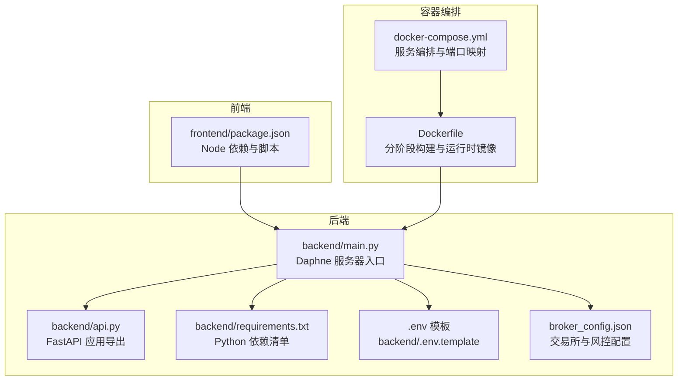
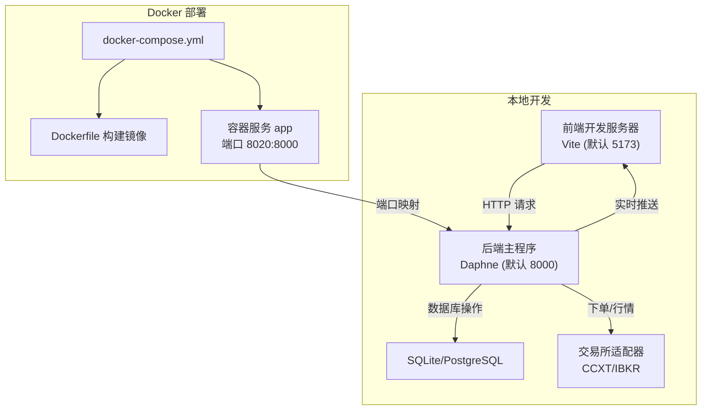
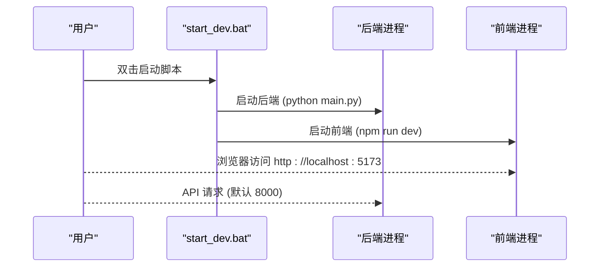
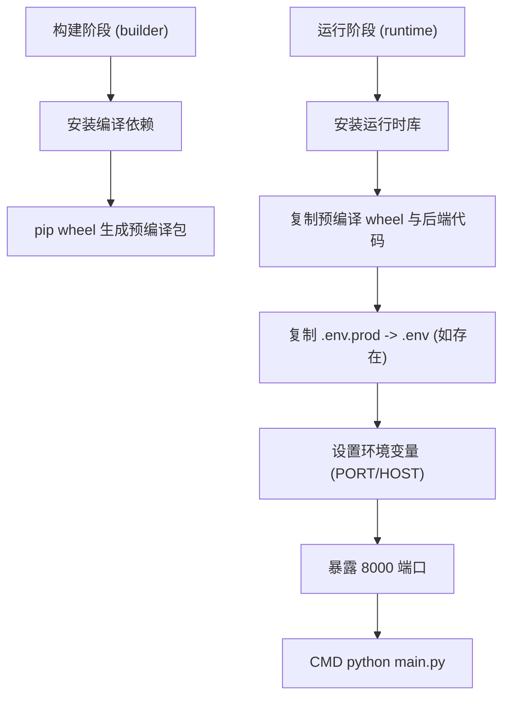
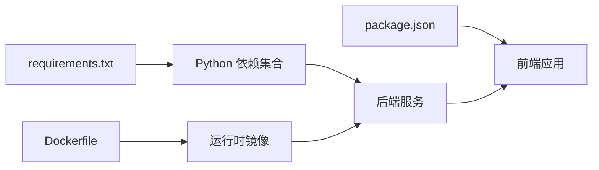

# 快速开始与部署

<cite>
**本文引用的文件**
- [README.md](file://README.md)
- [start_dev.bat](file://start_dev.bat)
- [build.bat](file://build.bat)
- [docker-compose.yml](file://docker-compose.yml)
- [Dockerfile](file://Dockerfile)
- [backend/main.py](file://backend/main.py)
- [backend/api.py](file://backend/api.py)
- [backend/requirements.txt](file://backend/requirements.txt)
- [backend/.env.template](file://backend/.env.template)
- [backend/resources/config/broker_config.json](file://backend/resources/config/broker_config.json)
- [backend/resources/config/broker_config.template.json](file://backend/resources/config/broker_config.template.json)
- [frontend/package.json](file://frontend/package.json)
</cite>

## 目录
1. [简介](#简介)
2. [项目结构](#项目结构)
3. [核心组件](#核心组件)
4. [架构总览](#架构总览)
5. [详细组件分析](#详细组件分析)
6. [依赖关系分析](#依赖关系分析)
7. [性能考虑](#性能考虑)
8. [故障排查指南](#故障排查指南)
9. [结论](#结论)
10. [附录](#附录)

## 简介
本指南面向首次部署与运行 backtrader 系统的用户，覆盖本地开发环境、Docker 部署以及生产环境配置要点。内容基于仓库中的 README、脚本与配置文件，确保从零开始也能顺利启动后端与前端，并在容器中稳定运行。

## 项目结构
backtrader 采用前后端分离架构：
- 后端（Python + FastAPI + Daphne）：提供 API、回测引擎、实盘引擎、WebSocket、数据库与配置管理。
- 前端（React + Vite）：提供可视化界面、策略编辑器、图表展示与交互。
- Docker 化：通过 Dockerfile 与 docker-compose.yml 将后端打包为镜像并对外暴露端口。

图示来源
- [backend/main.py](file://backend/main.py#L1-L32)
- [backend/api.py](file://backend/api.py#L1-L4)
- [backend/requirements.txt](file://backend/requirements.txt#L1-L25)
- [backend/.env.template](file://backend/.env.template#L1-L110)
- [backend/resources/config/broker_config.json](file://backend/resources/config/broker_config.json#L1-L131)
- [frontend/package.json](file://frontend/package.json#L1-L42)
- [Dockerfile](file://Dockerfile#L1-L78)
- [docker-compose.yml](file://docker-compose.yml#L1-L12)

章节来源
- [README.md](file://README.md#L88-L163)

## 核心组件
- 后端服务入口：Daphne 服务器承载 FastAPI 应用，监听 HOST/PORT 环境变量，默认 0.0.0.0:8000。
- FastAPI 应用导出：集中导出 app，供 Daphne 启动。
- Python 依赖：包含 FastAPI、Daphne、Backtrader、SQLAlchemy、CCXT、IBKR、OpenAI 等。
- 前端依赖：React、Vite、Monaco Editor、Lightweight Charts、Ant Design、i18n 等。
- 环境变量：.env.template 提供认证、数据库、CORS、交易所凭证、安全等配置项。
- 交易所配置：broker_config.json 定义交易所启用状态、市场类型、纸盘/实盘参数、风控与通知等。

章节来源
- [backend/main.py](file://backend/main.py#L1-L32)
- [backend/api.py](file://backend/api.py#L1-L4)
- [backend/requirements.txt](file://backend/requirements.txt#L1-L25)
- [frontend/package.json](file://frontend/package.json#L1-L42)
- [backend/.env.template](file://backend/.env.template#L1-L110)
- [backend/resources/config/broker_config.json](file://backend/resources/config/broker_config.json#L1-L131)

## 架构总览
下图展示了本地开发与 Docker 部署两种路径下的请求流转与组件交互。

图示来源
- [README.md](file://README.md#L372-L396)
- [docker-compose.yml](file://docker-compose.yml#L1-L12)
- [Dockerfile](file://Dockerfile#L1-L78)
- [backend/main.py](file://backend/main.py#L1-L32)

## 详细组件分析

### 本地开发环境（Windows）
- 克隆仓库与进入目录
- 后端设置
  - 进入 backend 目录，安装依赖 requirements.txt。
  - 复制 .env.template 为 .env 并按需填写数据库、认证、CORS、交易所凭证等。
  - 启动后端服务（默认端口 8000）。
- 前端设置
  - 进入 frontend 目录，安装依赖 package.json。
  - 启动开发服务器（默认端口 5173）。
- 访问应用
  - 浏览器访问前端地址 http://localhost:5173。

章节来源
- [README.md](file://README.md#L105-L139)
- [backend/requirements.txt](file://backend/requirements.txt#L1-L25)
- [backend/.env.template](file://backend/.env.template#L1-L110)
- [frontend/package.json](file://frontend/package.json#L1-L42)

### 一键启动（开发模式）
- Windows 用户可使用 start_dev.bat 同时启动后端与前端开发服务器，自动打开两个终端窗口并显示日志。
- 行为说明
  - 后端：在 backend 目录启动 python main.py。
  - 前端：在 frontend 目录执行 npm run dev。
  - 端口：后端默认 8000，前端默认 5173。

图示来源
- [start_dev.bat](file://start_dev.bat#L1-L24)
- [backend/main.py](file://backend/main.py#L1-L32)
- [frontend/package.json](file://frontend/package.json#L1-L42)

章节来源
- [README.md](file://README.md#L139-L151)
- [start_dev.bat](file://start_dev.bat#L1-L24)

### 完整构建（Windows）
- build.bat 负责：
  - 安装后端依赖 requirements.txt。
  - 安装前端依赖并执行构建。
  - 将前端构建产物复制到 backend/resources/frontend，供后端静态资源使用。
- 适用场景：生产环境或容器内无需二次构建。

章节来源
- [README.md](file://README.md#L169-L179)
- [build.bat](file://build.bat#L1-L52)

### Docker 部署
- docker-compose.yml
  - 服务名称 app，基于当前目录构建镜像。
  - 端口映射：宿主机 8020 映射容器内 8000。
  - 环境变量：PORT=8000、HOST=0.0.0.0。
  - 重启策略：unless-stopped。
- Dockerfile
  - 分阶段构建：
    - 构建阶段：安装编译依赖，使用 requirements.txt 生成预编译 wheel，加速后续安装。
    - 运行阶段：仅安装运行时库，拷贝预编译 wheel 与后端代码，复制 .env.prod 到 .env（若存在），设置默认环境变量并暴露 8000。
  - CMD：python main.py 启动后端服务。

图示来源
- [Dockerfile](file://Dockerfile#L1-L78)
- [docker-compose.yml](file://docker-compose.yml#L1-L12)

章节来源
- [docker-compose.yml](file://docker-compose.yml#L1-L12)
- [Dockerfile](file://Dockerfile#L1-L78)

### 生产环境配置要点
- 环境变量
  - 数据库：DATABASE_URL（SQLite/PostgreSQL）。
  - 认证：ENABLE_LOGIN、LOGTO_ISSUER、LOGTO_JWKS_URI、LOGTO_AUDIENCE 等。
  - 外部服务：OPENAI_API_KEY、OPENAI_BASE_URL。
  - CORS：CORS_ALLOW_ORIGINS、CORS_ALLOW_ORIGIN_REGEX、CORS_ALLOW_CREDENTIALS。
  - 实盘开关：LIVE_TRADING_ENABLED、DEFAULT_EXCHANGE、DEFAULT_TRADE_MODE。
  - 交易所凭证：CCXT_{EXCHANGE}_{MODE}_API_KEY/SECRET/PASSPHRASE。
- 交易所配置
  - broker_config.json：启用交易所、市场类型、纸盘/实盘参数、风控限额、通知通道等。
  - broker_config.template.json：模板与使用说明，建议先复制为 broker_config.json 再定制。
- 反向代理与安全
  - 反向代理：将外部流量转发至容器 8020 端口；建议开启 HTTPS 并配置证书。
  - 安全加固：限制 CORS 来源、启用登录、最小权限 API Key、IP 白名单、2FA、小规模实盘起步。
- 性能与稳定性
  - 使用 build.bat 生成静态资源，减少容器内构建时间。
  - Dockerfile 已内置镜像源与并行编译限制，避免低内存机器 OOM。

章节来源
- [README.md](file://README.md#L180-L235)
- [backend/.env.template](file://backend/.env.template#L1-L110)
- [backend/resources/config/broker_config.json](file://backend/resources/config/broker_config.json#L1-L131)
- [backend/resources/config/broker_config.template.json](file://backend/resources/config/broker_config.template.json#L1-L114)

## 依赖关系分析
- 后端依赖
  - FastAPI、Daphne、Backtrader、SQLAlchemy、yfinance、matplotlib、openai、ccxt、ibapi、websockets、aiohttp、pydantic、pycares、aiodns 等。
  - 特别注意：pycares 与 aiodns 的版本约束以避免兼容性问题。
- 前端依赖
  - React、Vite、Monaco Editor、Lightweight Charts、Ant Design、i18n、react-router、@logto/react 等。
- 容器镜像
  - 基于 Python 3.12 slim-bookworm，分阶段构建，运行时仅保留必要库，体积更小、启动更快。

图示来源
- [backend/requirements.txt](file://backend/requirements.txt#L1-L25)
- [frontend/package.json](file://frontend/package.json#L1-L42)
- [Dockerfile](file://Dockerfile#L1-L78)

章节来源
- [backend/requirements.txt](file://backend/requirements.txt#L1-L25)
- [frontend/package.json](file://frontend/package.json#L1-L42)
- [Dockerfile](file://Dockerfile#L1-L78)

## 性能考虑
- 依赖安装
  - Dockerfile 使用 pip wheel 预编译包，显著降低安装耗时与内存占用。
  - 通过 MAX_JOBS=1 限制并行编译，避免低内存机器 OOM。
- 镜像源
  - 默认使用阿里云镜像源，提升下载速度（中国大陆可用）。
- 构建产物
  - build.bat 将前端构建产物复制到 backend/resources/frontend，减少容器内重复构建。

章节来源
- [Dockerfile](file://Dockerfile#L1-L78)
- [build.bat](file://build.bat#L1-L52)

## 故障排查指南
- 端口冲突
  - 本地：后端默认 8000，前端默认 5173；Docker 默认 8020:8000。请确认端口未被占用。
- 依赖安装失败
  - pycares 与 aiodns 版本不兼容：按 README 的提示调整版本。
  - Docker 构建失败：检查网络与镜像源；必要时切换为默认源。
- 凭证配置错误
  - .env 中的交易所凭证格式与名称需与模板一致；broker_config.json 对应交易所必须启用且参数合理。
  - 实盘前务必先进行纸盘测试，逐步放大量。
- WebSocket 连接断开
  - 检查后端日志与浏览器控制台；确认 Daphne 服务器正常运行。
- IBKR 连接失败
  - 确认 IB Gateway/TWS 已运行、端口与 HOST 配置正确、防火墙放行、Client ID 唯一。

章节来源
- [README.md](file://README.md#L500-L558)
- [backend/.env.template](file://backend/.env.template#L1-L110)
- [backend/resources/config/broker_config.json](file://backend/resources/config/broker_config.json#L1-L131)

## 结论
通过本指南，您可以在本地快速启动 backtrader 的后端与前端，或使用 Docker 一键部署。生产环境建议结合 .env 与 broker_config.json 进行精细化配置，并配合反向代理与安全加固措施，确保系统稳定、安全地运行。

## 附录
- 快速开始参考
  - 本地开发与一键启动：参见 README 的“快速开始”与“一键启动（开发模式）”章节。
  - Docker 部署：参见 README 的“Docker 部署”章节。
- 环境变量与交易所配置
  - .env 模板字段与用途：参见 backend/.env.template。
  - 交易所配置模板与说明：参见 backend/resources/config/broker_config.template.json。
  - 交易所配置实际值：参见 backend/resources/config/broker_config.json。

章节来源
- [README.md](file://README.md#L88-L163)
- [backend/.env.template](file://backend/.env.template#L1-L110)
- [backend/resources/config/broker_config.template.json](file://backend/resources/config/broker_config.template.json#L1-L114)
- [backend/resources/config/broker_config.json](file://backend/resources/config/broker_config.json#L1-L131)