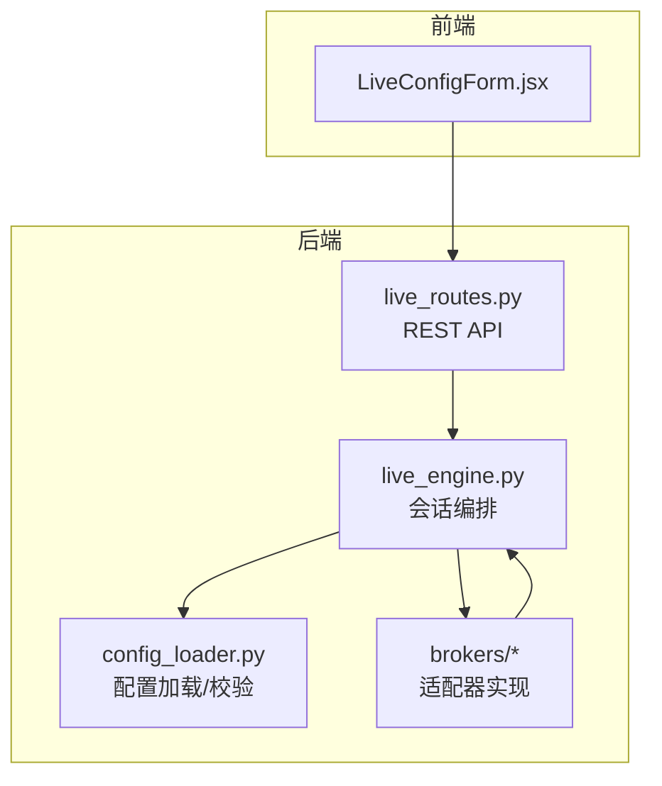
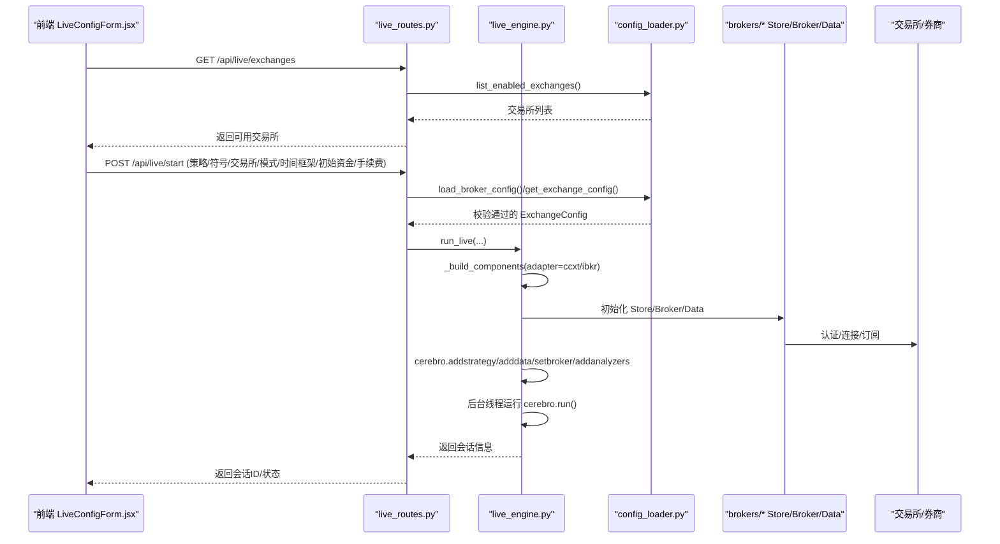
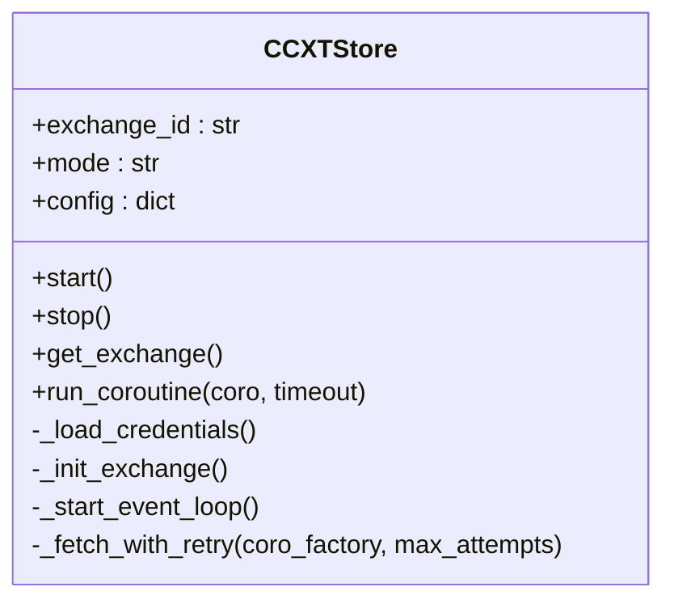
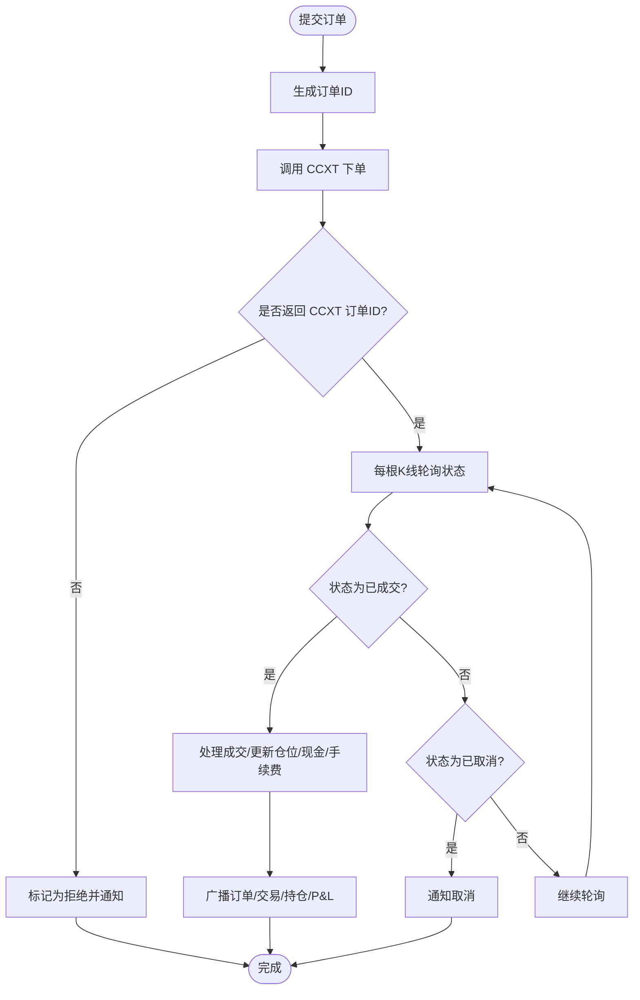
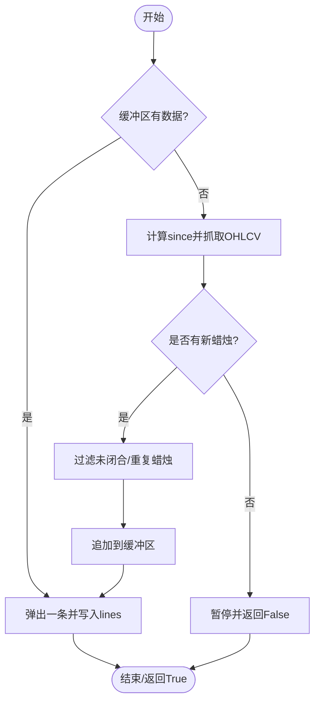
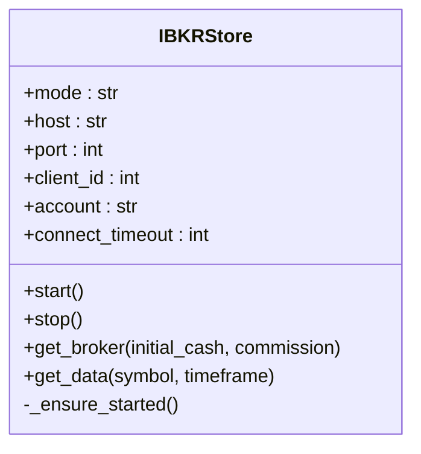
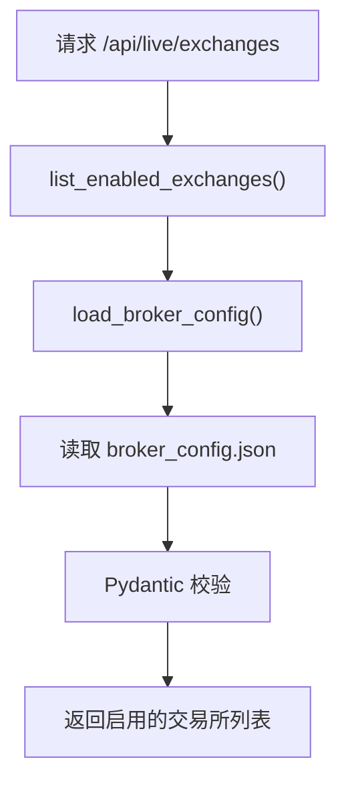
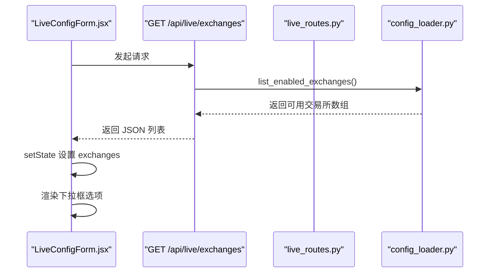
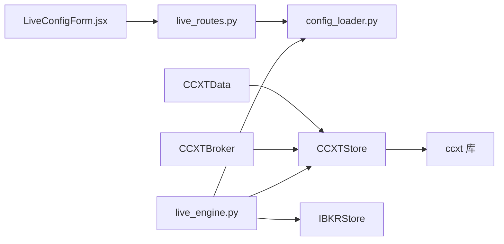

# 交易所适配器扩展

<cite>
**本文引用的文件**
- [ccxt_store.py](file://backend/src/brokers/ccxt_adapter/ccxt_store.py)
- [ccxt_broker.py](file://backend/src/brokers/ccxt_adapter/ccxt_broker.py)
- [ccxt_data.py](file://backend/src/brokers/ccxt_adapter/ccxt_data.py)
- [ibkr_store.py](file://backend/src/brokers/ibkr_adapter/ibkr_store.py)
- [config_loader.py](file://backend/src/utils/config_loader.py)
- [live_routes.py](file://backend/src/routes/live_routes.py)
- [live_engine.py](file://backend/src/service/live_engine.py)
- [LiveConfigForm.jsx](file://frontend/src/components/LiveTrading/LiveConfigForm.jsx)
- [broker_config.json](file://backend/resources/config/broker_config.json)
- [brokers.md](file://backend/src/brokers/brokers.md)
</cite>

## 目录
1. [简介](#简介)
2. [项目结构](#项目结构)
3. [核心组件](#核心组件)
4. [架构总览](#架构总览)
5. [详细组件分析](#详细组件分析)
6. [依赖关系分析](#依赖关系分析)
7. [性能考量](#性能考量)
8. [故障排查指南](#故障排查指南)
9. [结论](#结论)
10. [附录](#附录)

## 简介
本文件面向希望基于适配器模式扩展新交易所接入的开发者，系统性说明：
- 如何在 brokers 目录下新增适配器：创建子目录、实现标准化接口、注册到配置系统
- CCXTStore 和 IBKRStore 的实现机制：统一接口设计、认证流程、行情获取与交易指令转发
- 基于 config_loader.py 的 get_exchange_config 方法，系统如何动态加载与校验交易所配置
- 前端 LiveConfigForm.jsx 中交易所列表渲染逻辑的集成方式
- 错误处理、日志记录与安全认证的最佳实践
- 新增适配器时必须遵循的接口一致性规范

## 项目结构
后端采用“适配器层 + 引擎层 + 路由层 + 配置层 + 前端”的分层组织：
- brokers 层：按交易所划分适配器子目录，每个适配器提供统一的 Store/Broker/Data 接口
- service 层：live_engine 根据配置选择适配器，构建 Cerebro 执行环境
- routes 层：REST API 暴露会话管理与交易所列表查询
- utils 层：config_loader 提供配置加载与校验
- frontend：LiveConfigForm.jsx 渲染交易所列表并提交会话参数

图表来源
- [live_routes.py](file://backend/src/routes/live_routes.py#L1-L120)
- [live_engine.py](file://backend/src/service/live_engine.py#L1-L120)
- [config_loader.py](file://backend/src/utils/config_loader.py#L1-L120)
- [ccxt_store.py](file://backend/src/brokers/ccxt_adapter/ccxt_store.py#L1-L120)
- [ibkr_store.py](file://backend/src/brokers/ibkr_adapter/ibkr_store.py#L1-L80)

章节来源
- [brokers.md](file://backend/src/brokers/brokers.md#L1-L19)
- [live_routes.py](file://backend/src/routes/live_routes.py#L1-L120)
- [live_engine.py](file://backend/src/service/live_engine.py#L1-L120)
- [config_loader.py](file://backend/src/utils/config_loader.py#L1-L120)

## 核心组件
- CCXTStore：统一 CCXT 交易所连接管理，负责事件循环、凭据加载、市场加载、重试与关闭
- CCXTBroker：Backtrader 兼容的下单执行器，桥接 CCXT 订单生命周期与引擎通知
- CCXTData：实时 OHLCV 数据源，支持回填、抓取补漏与过滤未闭合蜡烛
- IBKRStore：IBKR 连接包装器，负责 Gateway/TWS 连接、账户与数据订阅
- config_loader：JSON 配置加载与 Pydantic 校验，提供 get_exchange_config/list_enabled_exchanges 等工具
- live_engine：根据配置选择适配器，构建 Cerebro 并运行会话
- live_routes：REST API，提供启动/停止/状态/会话列表/交易所列表等接口
- LiveConfigForm.jsx：前端表单，拉取交易所列表并提交会话参数

章节来源
- [ccxt_store.py](file://backend/src/brokers/ccxt_adapter/ccxt_store.py#L1-L120)
- [ccxt_broker.py](file://backend/src/brokers/ccxt_adapter/ccxt_broker.py#L1-L120)
- [ccxt_data.py](file://backend/src/brokers/ccxt_adapter/ccxt_data.py#L1-L120)
- [ibkr_store.py](file://backend/src/brokers/ibkr_adapter/ibkr_store.py#L1-L120)
- [config_loader.py](file://backend/src/utils/config_loader.py#L1-L120)
- [live_engine.py](file://backend/src/service/live_engine.py#L1-L120)
- [live_routes.py](file://backend/src/routes/live_routes.py#L1-L120)
- [LiveConfigForm.jsx](file://frontend/src/components/LiveTrading/LiveConfigForm.jsx#L1-L120)

## 架构总览
统一接口设计与适配器选择流程如下：

图表来源
- [live_routes.py](file://backend/src/routes/live_routes.py#L100-L180)
- [live_engine.py](file://backend/src/service/live_engine.py#L50-L120)
- [config_loader.py](file://backend/src/utils/config_loader.py#L179-L246)
- [ccxt_store.py](file://backend/src/brokers/ccxt_adapter/ccxt_store.py#L58-L120)
- [ibkr_store.py](file://backend/src/brokers/ibkr_adapter/ibkr_store.py#L82-L120)

## 详细组件分析

### CCXTStore：统一连接管理与认证
- 事件循环与线程：后台线程启动 asyncio 事件循环，提供 run_coroutine 将异步 CCXT 操作桥接到同步 Backtrader
- 凭据加载：从环境变量按 CCXT_{EXCHANGE}_{MODE}_API_KEY/SECRET/PASSPHRASE 规则读取
- 交易所初始化：根据 exchange_id 获取 CCXT 类，设置 enableRateLimit、timeout、默认市场类型等
- 沙盒模式：当 mode 为 paper 时启用沙盒/测试网，针对 Binance Spot Testnet 做 URL 覆盖
- 市场加载与重试：启动时加载 markets，网络错误自动指数退避重试
- 关闭流程：在事件循环内安全关闭 exchange，停止事件循环并等待线程结束

图表来源
- [ccxt_store.py](file://backend/src/brokers/ccxt_adapter/ccxt_store.py#L21-L120)

章节来源
- [ccxt_store.py](file://backend/src/brokers/ccxt_adapter/ccxt_store.py#L1-L324)

### CCXTBroker：订单生命周期与通知
- 订单提交：生成唯一订单号，复制 Backtrader 订单字段，调用 CCXT 下单，记录 CCXT 订单ID
- 订单状态轮询：每根K线检查已提交订单状态，处理成交/取消
- 成交处理：更新仓位、现金、手续费与通知队列；必要时广播 WebSocket 更新
- 现金与价值：支持纸面与实盘两种模式，实盘从交易所同步余额
- 参数覆盖：支持 commission、leverage、session_id 等参数注入

图表来源
- [ccxt_broker.py](file://backend/src/brokers/ccxt_adapter/ccxt_broker.py#L170-L260)
- [ccxt_broker.py](file://backend/src/brokers/ccxt_adapter/ccxt_broker.py#L318-L466)

章节来源
- [ccxt_broker.py](file://backend/src/brokers/ccxt_adapter/ccxt_broker.py#L1-L545)

### CCXTData：实时 OHLCV 数据流
- 实时抓取：基于上次已闭合蜡烛时间戳计算 since，批量抓取 OHLCV
- 形成过滤：跳过尚未闭合的“正在形成”蜡烛，防止未来数据泄漏
- 回填支持：可选的历史回填，按批次抓取并过滤闭合蜡烛
- 缓冲与暂停：空闲时暂停并降低错误频率，避免频繁重试

图表来源
- [ccxt_data.py](file://backend/src/brokers/ccxt_adapter/ccxt_data.py#L94-L172)
- [ccxt_data.py](file://backend/src/brokers/ccxt_adapter/ccxt_data.py#L194-L258)

章节来源
- [ccxt_data.py](file://backend/src/brokers/ccxt_adapter/ccxt_data.py#L1-L288)

### IBKRStore：IBKR 连接包装
- 环境变量优先：支持 IBKR_{MODE}_HOST/PORT/CLIENT_ID/ACCOUNT，若未提供则使用默认值
- 连接建立：通过 backtrader.stores.ibstore 获取 IBStore 并建立连接
- 资金与手续费：纸面模式允许设置初始资金，统一手续费参数
- 数据订阅：按 Backtrader 时间框架映射 IBKR 支持的时间粒度

图表来源
- [ibkr_store.py](file://backend/src/brokers/ibkr_adapter/ibkr_store.py#L45-L157)

章节来源
- [ibkr_store.py](file://backend/src/brokers/ibkr_adapter/ibkr_store.py#L1-L157)

### 配置系统与动态加载
- BrokerConfig：Pydantic 模型定义配置结构，含 exchanges、risk_management、trading_settings、notifications
- 加载与缓存：load_broker_config 从 broker_config.json 加载并缓存，支持 reload
- get_exchange_config：按 exchange_id 获取配置并校验 enabled 与 adapter 是否受支持
- list_enabled_exchanges：返回前端可用的交易所列表（含 id/name/adapter/markets/default_market/paper_mode_available）

图表来源
- [config_loader.py](file://backend/src/utils/config_loader.py#L113-L177)
- [config_loader.py](file://backend/src/utils/config_loader.py#L179-L246)
- [broker_config.json](file://backend/resources/config/broker_config.json#L1-L131)

章节来源
- [config_loader.py](file://backend/src/utils/config_loader.py#L1-L343)
- [broker_config.json](file://backend/resources/config/broker_config.json#L1-L131)

### 前端集成：交易所列表渲染
- LiveConfigForm.jsx 在挂载时调用 api.getExchanges() 获取交易所列表
- 当资产类别切换时重新加载对应交易所集合
- 通过 Ant Design Select 组件渲染选项，支持搜索与提示

图表来源
- [LiveConfigForm.jsx](file://frontend/src/components/LiveTrading/LiveConfigForm.jsx#L39-L52)
- [live_routes.py](file://backend/src/routes/live_routes.py#L340-L357)
- [config_loader.py](file://backend/src/utils/config_loader.py#L219-L246)

章节来源
- [LiveConfigForm.jsx](file://frontend/src/components/LiveTrading/LiveConfigForm.jsx#L1-L241)
- [live_routes.py](file://backend/src/routes/live_routes.py#L340-L357)

### 适配器扩展步骤（新增交易所接入）
- 创建子目录：在 brokers 目录下新建适配器子目录，例如 brokers/new_exchange_adapter/
- 实现标准化接口：
  - Store：提供 start/stop/get_* 等统一方法，负责连接管理与资源清理
  - Broker：实现下单、撤单、成交处理、通知队列与价值/现金计算
  - Data：实现实时 OHLCV 抓取、形成过滤、回填与缓冲
- 注册到配置系统：
  - 在 broker_config.json 中添加新交易所条目，设置 enabled/name/adapter/ccxt_id/markets/default_market/paper_mode/rate_limits 等
  - 若 adapter 为 ccxt，确保 ccxt_id 对应 CCXT 支持的交易所ID
  - 若 adapter 为 ibkr，确保 IB Gateway/TWS 已正确配置并可连通
- 集成到 live_engine：
  - 在 _build_components 中识别新 adapter 并实例化对应 Store/Broker/Data
  - 确保 get_exchange_config 校验通过（adapter 必须为 ccxt 或 ibkr）
- 前端集成：
  - 若前端需要展示该交易所，可在 LiveConfigForm.jsx 中按资产类别补充默认列表或通过后端 /api/live/exchanges 自动发现
- 最佳实践：
  - 严格遵循接口一致性，避免破坏性扩展
  - 使用环境变量管理敏感凭证，不硬编码
  - 做好错误分类与日志记录，支持重试与降级
  - 避免在 import 阶段发起网络连接，采用懒加载与复用

章节来源
- [brokers.md](file://backend/src/brokers/brokers.md#L1-L19)
- [live_engine.py](file://backend/src/service/live_engine.py#L50-L98)
- [config_loader.py](file://backend/src/utils/config_loader.py#L179-L218)
- [broker_config.json](file://backend/resources/config/broker_config.json#L1-L131)

## 依赖关系分析
- live_engine 依赖 config_loader 获取 ExchangeConfig，并依据 adapter 选择 CCXTStore/IBKRStore
- CCXTStore 依赖 CCXT 库，负责事件循环与交易所连接
- CCXTBroker/CCXTData 依赖 CCXTStore 提供的 exchange 实例
- live_routes 依赖 config_loader 进行配置校验与交易所列表返回
- 前端 LiveConfigForm.jsx 依赖后端 /api/live/exchanges 获取可用交易所

图表来源
- [live_engine.py](file://backend/src/service/live_engine.py#L1-L120)
- [config_loader.py](file://backend/src/utils/config_loader.py#L1-L120)
- [ccxt_store.py](file://backend/src/brokers/ccxt_adapter/ccxt_store.py#L1-L120)
- [ibkr_store.py](file://backend/src/brokers/ibkr_adapter/ibkr_store.py#L1-L120)
- [live_routes.py](file://backend/src/routes/live_routes.py#L1-L120)
- [LiveConfigForm.jsx](file://frontend/src/components/LiveTrading/LiveConfigForm.jsx#L1-L120)

章节来源
- [live_engine.py](file://backend/src/service/live_engine.py#L1-L120)
- [live_routes.py](file://backend/src/routes/live_routes.py#L1-L120)

## 性能考量
- 事件循环与线程：CCXTStore 在后台线程运行事件循环，避免阻塞主线程
- 批量抓取与缓冲：CCXTData 使用批量 limit 与历史缓冲减少往返次数
- 形成过滤：跳过未闭合蜡烛，避免未来数据泄漏与重复处理
- 速率限制：CCXTData 在回填时尊重 exchange.rateLimit，避免触发限流
- 日志与告警：适度的日志级别与周期性错误计数，避免高频错误导致 CPU 占用

章节来源
- [ccxt_store.py](file://backend/src/brokers/ccxt_adapter/ccxt_store.py#L252-L324)
- [ccxt_data.py](file://backend/src/brokers/ccxt_adapter/ccxt_data.py#L124-L200)
- [ccxt_data.py](file://backend/src/brokers/ccxt_adapter/ccxt_data.py#L200-L258)

## 故障排查指南
- 配置问题
  - 无法找到交易所或未启用：检查 broker_config.json 中 enabled 与 adapter 字段
  - 时间框架不支持：确认 trading_settings.supported_timeframes 包含目标值
  - 符号格式错误：确保为 BASE/QUOTE 格式
- 连接问题
  - CCXTStore 启动失败：检查 CCXT_{EXCHANGE}_{MODE}_API_KEY/SECRET/PASSPHRASE 环境变量
  - 事件循环未就绪：确认 _start_event_loop 成功并在超时前 ready
  - 网络错误：查看 _fetch_with_retry 的重试日志与退避间隔
- IBKR 连接问题
  - IBStore 不可用：确认 ibapi 安装与 Gateway/TWS 可连通
  - 主机/端口/客户端ID/账户：检查 IBKR_{MODE}_HOST/PORT/CLIENT_ID/ACCOUNT
- 订单与成交
  - 订单未成交：检查 CCXTBroker 的 next() 轮询与 _process_filled_order 分支
  - 现金/价值异常：核对手续费、成交均价与仓位更新逻辑
- 前端问题
  - 交易所列表为空：确认 /api/live/exchanges 返回正常，或前端回退默认列表

章节来源
- [config_loader.py](file://backend/src/utils/config_loader.py#L179-L333)
- [ccxt_store.py](file://backend/src/brokers/ccxt_adapter/ccxt_store.py#L169-L218)
- [ibkr_store.py](file://backend/src/brokers/ibkr_adapter/ibkr_store.py#L82-L120)
- [ccxt_broker.py](file://backend/src/brokers/ccxt_adapter/ccxt_broker.py#L467-L506)
- [LiveConfigForm.jsx](file://frontend/src/components/LiveTrading/LiveConfigForm.jsx#L39-L52)

## 结论
通过适配器模式，系统实现了对不同交易所/券商的统一接入与运行时选择。CCXTStore/IBKRStore 提供了稳定的连接管理与认证机制，CCXTBroker/CCXTData 实现了订单生命周期与实时数据流，config_loader 保障了配置的动态加载与强校验，live_engine 与 live_routes 将这些能力整合为完整的会话编排与 REST API。新增适配器只需遵循统一接口与配置规范，即可快速接入并被前端发现与使用。

## 附录
- 新增适配器接口一致性规范
  - Store：start/stop/get_* 等统一方法，负责连接生命周期管理
  - Broker：submit/cancel/getcash/getvalue/getposition 等，兼容 Backtrader 接口
  - Data：islive/haslivedata/_load 等，提供实时 OHLCV 数据
  - 配置：在 broker_config.json 中声明 adapter 与 ccxt_id（如适用），并启用
  - 安全：凭证通过环境变量加载，不硬编码
  - 日志：关键路径记录 INFO/WARNING/ERROR，便于排障

章节来源
- [brokers.md](file://backend/src/brokers/brokers.md#L1-L19)
- [broker_config.json](file://backend/resources/config/broker_config.json#L1-L131)