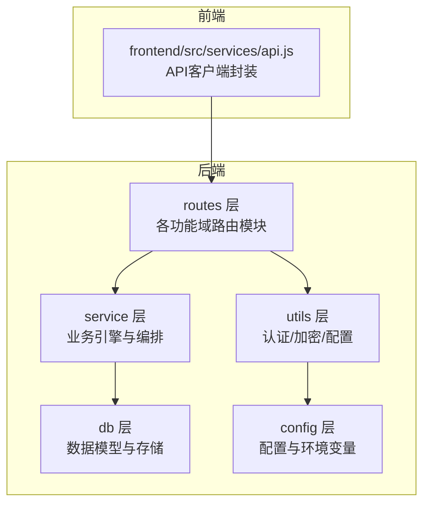
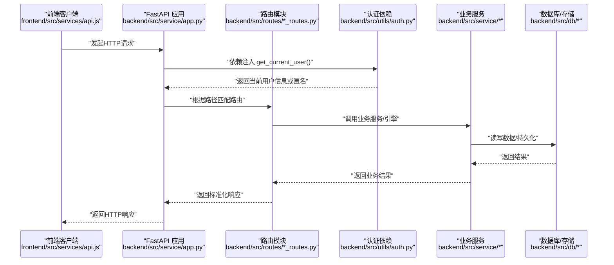
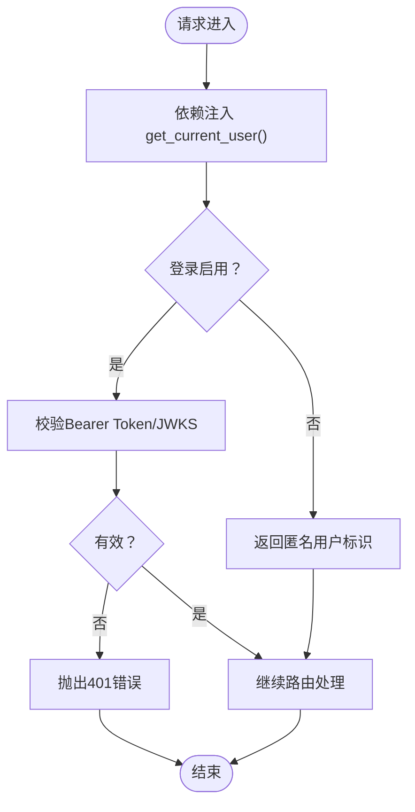
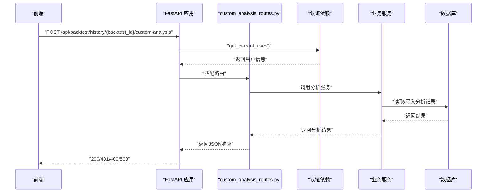
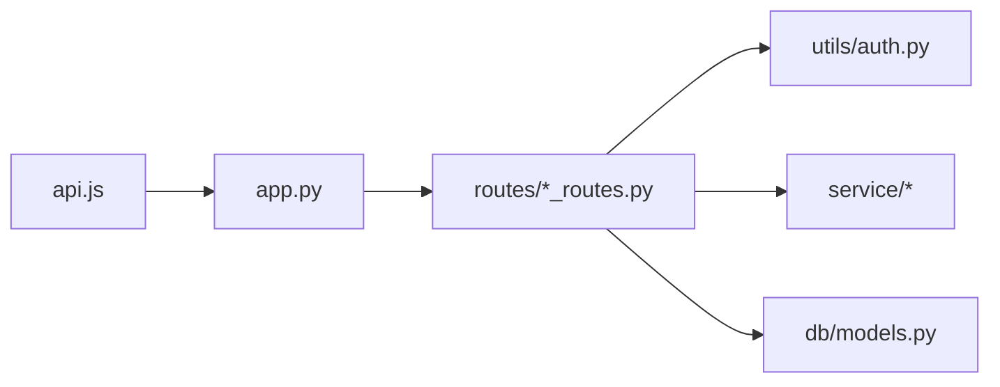

# 扩展API端点

<cite>
**本文引用的文件**
- [routes.md](file://backend/src/routes/routes.md)
- [app.py](file://backend/src/service/app.py)
- [api.js](file://frontend/src/services/api.js)
- [api_routes.py](file://backend/src/routes/api_routes.py)
- [live_routes.py](file://backend/src/routes/live_routes.py)
- [settings_routes.py](file://backend/src/routes/settings_routes.py)
- [auth.py](file://backend/src/utils/auth.py)
- [settings.py](file://backend/src/config/settings.py)
- [models.py](file://backend/src/db/models.py)
- [test_routes_imports.py](file://backend/tests/routes/test_routes_imports.py)
</cite>

## 目录
1. [简介](#简介)
2. [项目结构](#项目结构)
3. [核心组件](#核心组件)
4. [架构总览](#架构总览)
5. [详细组件分析](#详细组件分析)
6. [依赖关系分析](#依赖关系分析)
7. [性能考量](#性能考量)
8. [故障排查指南](#故障排查指南)
9. [结论](#结论)
10. [附录](#附录)

## 简介
本指南面向希望为系统新增RESTful API端点的开发者，基于现有设计规范与实现模式，提供从路由定义、服务注册、中间件兼容、前后端联调到安全与性能的完整实践路径。我们将以“添加用户自定义分析API”为例，演示如何在backend/src/routes/目录下创建新的{feature}_routes.py文件，使用FastAPI定义路由与请求处理函数；在app.py中完成注册；确保与认证、日志等中间件兼容；并在frontend/src/services/api.js中补充对应的API客户端方法。同时给出请求/响应数据结构设计建议、错误码规范、版本控制策略与安全性考虑（输入验证、速率限制）。

## 项目结构
后端采用分层架构：
- routes层：集中定义HTTP/WebSocket API，每个功能域一个路由模块，统一暴露router。
- service层：业务引擎与服务编排，路由层仅做编排，不直接操作DB或外部broker。
- utils层：通用工具（认证、加密、配置加载等）。
- db层：数据模型与持久化。
- config层：配置管理与环境变量解析。

图表来源
- [app.py](file://backend/src/service/app.py#L1-L46)
- [routes.md](file://backend/src/routes/routes.md#L1-L24)

章节来源
- [routes.md](file://backend/src/routes/routes.md#L1-L24)
- [app.py](file://backend/src/service/app.py#L1-L46)

## 核心组件
- 路由注册与前缀：所有路由在应用启动时统一注册，部分模块带前缀（如/api），部分不带（如WebSocket）。
- 认证中间件：通过依赖注入get_current_user实现鉴权，支持可选登录与作用域校验。
- 错误处理：统一抛出HTTPException，前端解析响应体中的detail或message字段。
- 数据模型：数据库模型定义了回测历史、组合回测、Walk-Forward优化、市场数据等实体，支撑历史查询与分析。

章节来源
- [app.py](file://backend/src/service/app.py#L1-L46)
- [auth.py](file://backend/src/utils/auth.py#L1-L211)
- [models.py](file://backend/src/db/models.py#L1-L683)

## 架构总览
下面的序列图展示了典型API请求从浏览器到后端的流转过程，包括认证、路由编排与服务调用。

图表来源
- [app.py](file://backend/src/service/app.py#L1-L46)
- [auth.py](file://backend/src/utils/auth.py#L1-L211)
- [api_routes.py](file://backend/src/routes/api_routes.py#L1-L507)
- [live_routes.py](file://backend/src/routes/live_routes.py#L1-L430)
- [settings_routes.py](file://backend/src/routes/settings_routes.py#L1-L403)

## 详细组件分析

### 设计规范与约定
- 路由文件命名：{feature}_routes.py，对外暴露router。
- 路由注册：统一在backend/src/service/app.py中include_router，按需加前缀。
- 响应结构：统一返回JSON对象，错误时包含detail或message字段；前端解析401时触发登录跳转。
- 安全：路由层做鉴权与权限检查，避免未授权访问；敏感参数与凭据通过数据库/环境变量管理。
- 可维护性：路由只做编排，不直接操作DB或外部broker。

章节来源
- [routes.md](file://backend/src/routes/routes.md#L1-L24)
- [app.py](file://backend/src/service/app.py#L1-L46)
- [api.js](file://frontend/src/services/api.js#L1-L403)

### 认证与中间件兼容
- 认证依赖：get_current_user从Authorization头中提取Bearer Token，通过Logto JWKS验证，支持可选登录与作用域校验。
- 中间件：CORS中间件在app.py中配置，支持Origin白名单、正则匹配与凭据控制。
- 兼容性：路由层通过Depends(get_current_user)自动接入认证；无需在每个endpoint重复鉴权。

图表来源
- [auth.py](file://backend/src/utils/auth.py#L1-L211)
- [settings.py](file://backend/src/config/settings.py#L1-L107)
- [app.py](file://backend/src/service/app.py#L1-L46)

章节来源
- [auth.py](file://backend/src/utils/auth.py#L1-L211)
- [settings.py](file://backend/src/config/settings.py#L1-L107)
- [app.py](file://backend/src/service/app.py#L1-L46)

### 请求/响应数据结构设计建议
- 统一响应结构：成功时返回包含业务字段的对象；错误时返回包含code/message/detail的对象，前端据此展示。
- 请求体建模：使用Pydantic BaseModel定义请求参数，配合字段约束（如min_length、ge/le）与类型校验。
- 查询参数：使用Query定义可选参数与默认值，避免硬编码。
- 响应模型：对复杂结构使用Pydantic BaseModel作为response_model，提升文档与类型安全。
- 前端对接：前端api.js已内置buildRequest与parseResponse，统一处理Authorization头与401重定向；新增端点需同步更新。

章节来源
- [api_routes.py](file://backend/src/routes/api_routes.py#L1-L507)
- [live_routes.py](file://backend/src/routes/live_routes.py#L1-L430)
- [settings_routes.py](file://backend/src/routes/settings_routes.py#L1-L403)
- [api.js](file://frontend/src/services/api.js#L1-L403)

### 错误码规范
- 成功：200
- 未授权：401（前端检测到401时跳转登录）
- 禁止访问：403
- 参数错误：400
- 资源未找到：404
- 内部错误：500
- 数据加载失败：502（示例：数据源异常）

章节来源
- [api_routes.py](file://backend/src/routes/api_routes.py#L1-L507)
- [live_routes.py](file://backend/src/routes/live_routes.py#L1-L430)
- [settings_routes.py](file://backend/src/routes/settings_routes.py#L1-L403)
- [api.js](file://frontend/src/services/api.js#L1-L403)

### 版本控制策略
- 路由前缀：当前路由多使用/api前缀，便于未来按功能域拆分版本（如/api/v1、/api/v2）。
- 命名空间：建议以feature为维度划分路由文件，避免跨域冲突。
- 文档同步：接口变更需同步更新前端api.js与示例文档。

章节来源
- [routes.md](file://backend/src/routes/routes.md#L1-L24)
- [app.py](file://backend/src/service/app.py#L1-L46)

### 安全性考虑
- 输入验证：使用Pydantic字段约束与自定义校验器，拒绝非法参数。
- 速率限制：当前未见全局速率限制中间件，可在路由层或网关层增加（如每IP/每用户限流）。
- 凭据管理：敏感凭据通过数据库加密存储，前端仅接收脱敏后的摘要信息。
- 日志与审计：路由层记录关键操作日志，避免泄露敏感信息。

章节来源
- [settings_routes.py](file://backend/src/routes/settings_routes.py#L1-L403)
- [auth.py](file://backend/src/utils/auth.py#L1-L211)

### 新增端点流程示例：用户自定义分析API
以下流程以“添加用户自定义分析API”为例，演示从路由定义到前端调用的完整步骤。

1) 在backend/src/routes/下创建custom_analysis_routes.py
- 文件命名：custom_analysis_routes.py
- 导出：router
- 路由前缀：按需选择是否加/api
- 鉴权：使用Depends(get_current_user)确保登录态
- 请求体：定义Pydantic模型，包含分析所需的metrics或其他参数
- 响应：返回标准化对象，包含analysis字段

2) 在backend/src/service/app.py中注册新路由
- 引入router：from src.routes.custom_analysis_routes import router as custom_analysis_router
- 注册：app.include_router(custom_analysis_router, prefix="/api")

3) 在frontend/src/services/api.js中添加对应方法
- 方法命名：如updateCustomAnalysis(backtestId, payload)
- 构造请求：buildRequest('/backtest/history/{backtest_id}/custom-analysis', { method: 'POST', body })
- 解析响应：parseResponse(res)返回数据
- 错误处理：401时前端跳转登录

4) 后续维护
- 更新测试：确保导入测试覆盖router存在且非空
- 文档同步：更新routes.md与前端示例

图表来源
- [app.py](file://backend/src/service/app.py#L1-L46)
- [api.js](file://frontend/src/services/api.js#L1-L403)
- [routes.md](file://backend/src/routes/routes.md#L1-L24)

章节来源
- [routes.md](file://backend/src/routes/routes.md#L1-L24)
- [app.py](file://backend/src/service/app.py#L1-L46)
- [api.js](file://frontend/src/services/api.js#L1-L403)
- [test_routes_imports.py](file://backend/tests/routes/test_routes_imports.py#L1-L22)

## 依赖关系分析
- 路由模块依赖：
  - 路由层依赖utils.auth进行鉴权
  - 路由层依赖service层业务引擎与db层存储
- 应用层依赖：
  - app.py统一注册所有路由，配置CORS中间件
- 前端依赖：
  - api.js统一构建请求与解析响应，自动注入Authorization头

图表来源
- [app.py](file://backend/src/service/app.py#L1-L46)
- [api.js](file://frontend/src/services/api.js#L1-L403)
- [auth.py](file://backend/src/utils/auth.py#L1-L211)
- [models.py](file://backend/src/db/models.py#L1-L683)

章节来源
- [app.py](file://backend/src/service/app.py#L1-L46)
- [api.js](file://frontend/src/services/api.js#L1-L403)
- [auth.py](file://backend/src/utils/auth.py#L1-L211)
- [models.py](file://backend/src/db/models.py#L1-L683)

## 性能考量
- 路由层不做重IO：路由仅做编排，耗时逻辑下沉至service层。
- 数据库连接：使用SQLAlchemy连接池与预热，SQLite场景开启WAL与PRAGMA优化。
- 缓存与降级：对高频查询（如回测历史）可引入索引与分页；保存历史时非阻塞记录，失败仅记录日志。
- 前端并发：合理使用Promise.all并行请求，减少等待时间。

章节来源
- [models.py](file://backend/src/db/models.py#L1-L683)
- [api_routes.py](file://backend/src/routes/api_routes.py#L1-L507)

## 故障排查指南
- 401未授权
  - 检查前端是否正确注入Authorization头
  - 确认后端登录开关与JWKS配置
- 403禁止访问
  - 检查作用域required_scopes配置
- 400参数错误
  - 检查Pydantic模型字段约束与类型
- 500内部错误
  - 查看后端日志与traceback
- 路由未生效
  - 确认app.py中include_router已注册
  - 确认路由文件导出router且非空

章节来源
- [auth.py](file://backend/src/utils/auth.py#L1-L211)
- [settings.py](file://backend/src/config/settings.py#L1-L107)
- [api.js](file://frontend/src/services/api.js#L1-L403)
- [test_routes_imports.py](file://backend/tests/routes/test_routes_imports.py#L1-L22)

## 结论
通过遵循routes.md的设计规范与现有实现模式，新增API端点可以快速、安全地融入系统。关键在于：
- 规范化路由文件命名与导出
- 在app.py中统一注册
- 使用Depends(get_current_user)接入认证
- 使用Pydantic定义请求/响应模型
- 前后端协同更新API客户端与文档
- 关注输入验证、错误码与安全策略

## 附录
- 示例端点清单（参考现有模块）
  - 回测相关：/api/backtest、/api/backtest/history、/api/backtest/history/{id}
  - 实盘相关：/api/live/start、/api/live/stop、/api/live/status/{session_id}
  - 设置与凭据：/api/settings、/api/settings/credentials、/api/settings/credentials/test
- 测试约定
  - 路由模块导入测试确保router存在且非空

章节来源
- [routes.md](file://backend/src/routes/routes.md#L1-L24)
- [test_routes_imports.py](file://backend/tests/routes/test_routes_imports.py#L1-L22)