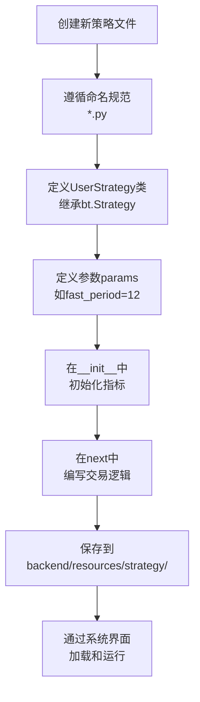
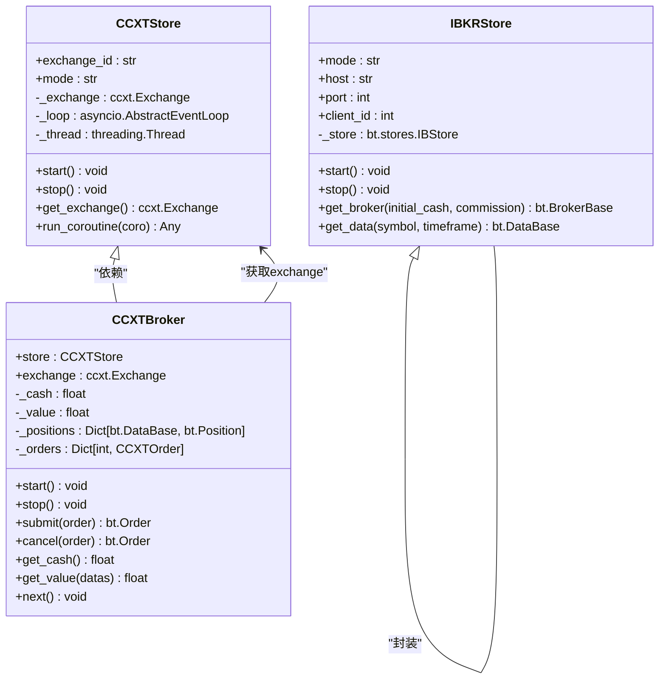
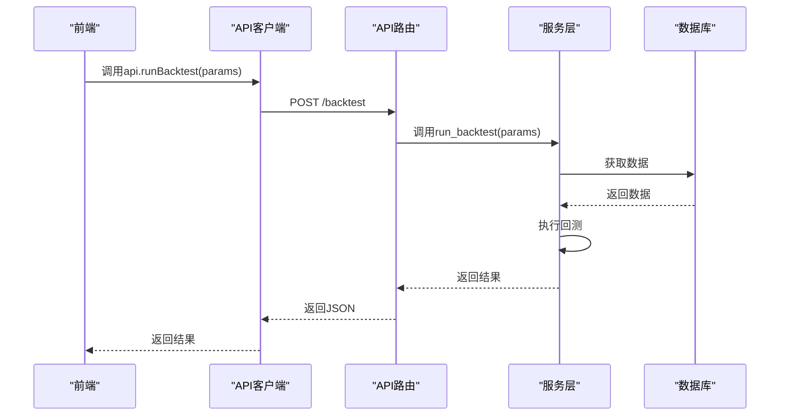

# 扩展与集成

<cite>
**本文档引用的文件**
- [strategy.md](file://backend/resources/strategy/strategy.md)
- [brokers.md](file://backend/src/brokers/brokers.md)
- [broker_config.json](file://backend/resources/config/broker_config.json)
- [routes.md](file://backend/src/routes/routes.md)
- [app.py](file://backend/src/service/app.py)
- [ccxt_broker.py](file://backend/src/brokers/ccxt_adapter/ccxt_broker.py)
- [ccxt_store.py](file://backend/src/brokers/ccxt_adapter/ccxt_store.py)
- [ibkr_store.py](file://backend/src/brokers/ibkr_adapter/ibkr_store.py)
- [api_routes.py](file://backend/src/routes/api_routes.py)
- [strategy_templates.py](file://backend/src/service/strategy_templates.py)
- [ema_cross.py](file://backend/resources/strategy/templates/ema_cross.py)
- [api.js](file://frontend/src/services/api.js)
- [config_manager.py](file://backend/src/config/config_manager.py)
- [config_loader.py](file://backend/src/utils/config_loader.py)
</cite>

## 目录
1. [引言](#引言)
2. [策略扩展](#策略扩展)
3. [交易所集成](#交易所集成)
4. [API扩展](#api扩展)
5. [测试与验证](#测试与验证)
6. [社区贡献](#社区贡献)

## 引言
本指南旨在为开发者提供在backtrader系统中进行扩展和集成的详细技术规范。系统采用模块化设计，支持通过明确定义的扩展点来添加新功能。核心扩展点包括：在`backend/resources/strategy/`目录下创建新的交易策略、利用适配器模式集成新的交易所（特别是CCXT支持的交易所）、以及根据约定创建新的API路由。本文档将详细说明每个扩展点的接口定义、配置要求和实现方法，确保新功能与现有系统架构保持一致。

## 策略扩展

在backtrader系统中，用户策略的扩展是通过在`backend/resources/strategy/`目录下创建新的Python文件来实现的。该目录专门存放用户维护的交易策略脚本，系统通过`service/strategy_templates.py`模块管理内置的策略模板，供用户参考或一键导入。开发者创建新策略时，应遵循既定的命名和结构规范，以确保与系统其他部分的兼容性。

**策略扩展的核心原则是：策略文件由用户亲自维护，AI生成的代码不得直接修改这些文件。** AI的角色仅限于提供文档优化、代码审阅或辅助脚本等支持。策略文件应使用小写加下划线的命名方式（如`sma_cross.py`），并且策略类必须命名为`UserStrategy`并继承`bt.Strategy`基类。临时实验文件应放入`sandbox/`目录或单独的分支，待稳定后再合并到主目录。

**策略扩展流程**
- [strategy.md](file://backend/resources/strategy/strategy.md#L1-L33)
- [strategy_templates.py](file://backend/src/service/strategy_templates.py#L1-L378)
- [ema_cross.py](file://backend/resources/strategy/templates/ema_cross.py#L1-L41)

## 交易所集成

交易所的集成是通过适配器模式实现的，该模式将不同交易所的异构API统一到系统内部的抽象接口。系统在`backend/src/brokers/`目录下为每个交易所提供独立的适配器，如`ccxt_adapter/`用于加密货币交易所，`ibkr_adapter/`用于传统证券经纪商。这种设计确保了`service/live_engine.py`可以基于配置自动选择正确的适配器，而无需修改上层策略代码。

对于新的交易所集成，特别是那些被CCXT库支持的交易所，开发者应创建一个新的适配器类。CCXT适配器的核心组件包括`ccxt_store.py`（负责连接管理）、`ccxt_data.py`（负责行情数据获取）和`ccxt_broker.py`（负责订单执行）。`ccxt_store`类管理着一个后台线程中的异步事件循环，通过`run_coroutine`方法桥接异步的CCXT调用与同步的Backtrader框架。`ccxt_broker`类则实现了`bt.BrokerBase`接口，负责处理订单的提交、取消、状态更新和资金管理。

**交易所适配器组件**
- [brokers.md](file://backend/src/brokers/brokers.md#L1-L23)
- [ccxt_adapter.md](file://backend/src/brokers/ccxt_adapter/ccxt_adapter.md#L1-L19)
- [ccxt_broker.py](file://backend/src/brokers/ccxt_adapter/ccxt_broker.py#L1-L545)
- [ccxt_store.py](file://backend/src/brokers/ccxt_adapter/ccxt_store.py#L1-L330)
- [ibkr_adapter.md](file://backend/src/brokers/ibkr_adapter/ibkr_adapter.md#L1-L20)
- [ibkr_store.py](file://backend/src/brokers/ibkr_adapter/ibkr_store.py#L1-L159)

## API扩展

API的扩展遵循`backend/src/routes/`目录下的约定。新的API功能应创建一个名为`{feature}_routes.py`的文件，其中定义一个FastAPI的`APIRouter`实例。该路由文件负责处理特定功能的HTTP请求，如`ai_routes.py`处理AI分析请求，`live_routes.py`处理实盘交易请求。所有路由的注册都在`backend/src/service/app.py`中统一完成，以确保路由的集中管理和避免冲突。

为了确保API的一致性，所有接口都应遵循统一的错误码和响应结构。路由层只负责请求的编排和验证，不直接操作数据库或调用外部交易所接口，这些操作应委托给`service`层的相应模块。当创建新的API时，必须同步更新前端的API客户端`frontend/src/services/api.js`，以便前端应用能够调用新功能。

**API扩展流程**
- [routes.md](file://backend/src/routes/routes.md#L1-L24)
- [app.py](file://backend/src/service/app.py#L1-L46)
- [api_routes.py](file://backend/src/routes/api_routes.py#L1-L507)
- [api.js](file://frontend/src/services/api.js#L1-L403)

## 测试与验证

为了确保新功能的稳定性和可靠性，系统提供了全面的测试框架。所有扩展都必须通过相应的测试用例。对于策略扩展，开发者应在本地运行最小回测或使用`strategy_sandbox.py`进行沙箱验证，记录关键指标。对于交易所适配器，必须提供最小的回测或模拟下单验证，以确保连接、行情获取和订单执行的正确性。

系统的测试用例位于`backend/tests/`目录下，采用分层结构，与源代码结构相对应。例如，`backend/tests/brokers/ccxt_adapter/`目录下包含了对`ccxt_broker.py`和`ccxt_data.py`的单元测试。开发者在贡献新功能时，应编写相应的测试用例，并确保所有现有测试用例都能通过。这可以通过运行`run_tests_coverage.bat`脚本来完成。

**测试与验证要求**
- [strategy.md](file://backend/resources/strategy/strategy.md#L21-L24)
- [ccxt_adapter.md](file://backend/src/brokers/ccxt_adapter/ccxt_adapter.md#L17-L18)
- [ibkr_adapter.md](file://backend/src/brokers/ibkr_adapter/ibkr_adapter.md#L19-L20)

## 社区贡献

我们鼓励社区开发者为backtrader系统贡献新功能。为了确保贡献的质量和与现有架构的一致性，所有贡献都必须遵循本文档中描述的技术规范。新功能的开发应基于最新的主分支，并通过Pull Request的方式提交。在提交前，开发者必须确保：

1.  **代码质量**：代码应遵循PEP 8规范，具有良好的可读性和文档注释。
2.  **功能一致性**：新功能应与现有系统的架构和设计模式保持一致。
3.  **测试覆盖**：必须提供充分的测试用例，覆盖主要功能和边界情况。
4.  **文档更新**：如果新功能引入了新的配置项或API，必须相应地更新文档。

通过遵循这些准则，社区贡献者可以帮助backtrader系统持续发展，同时保持其稳定性和可维护性。

**社区贡献指南**
- [strategy.md](file://backend/resources/strategy/strategy.md#L30-L32)
- [brokers.md](file://backend/src/brokers/brokers.md#L19-L22)
- [routes.md](file://backend/src/routes/routes.md#L20-L22)