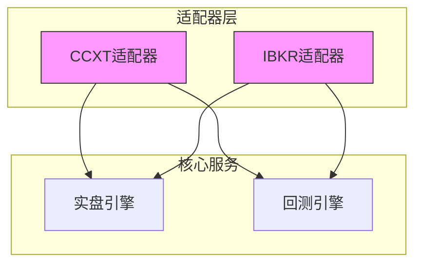
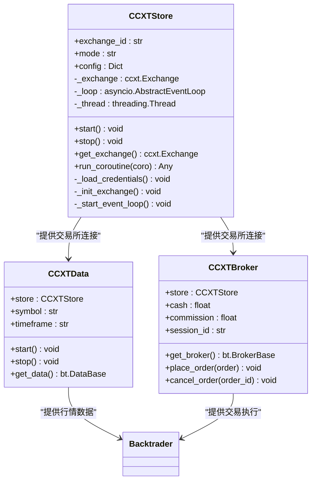
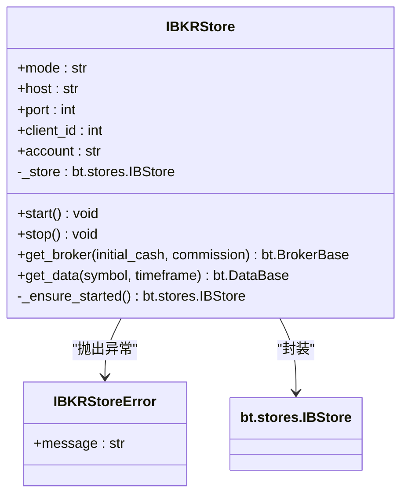
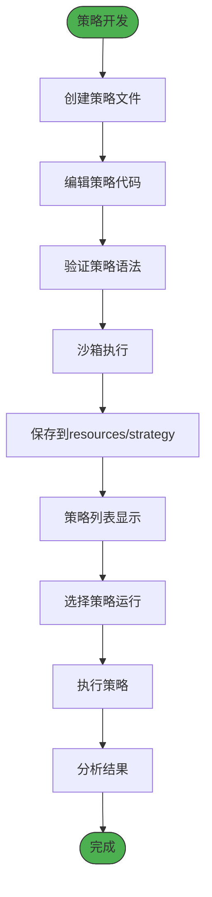
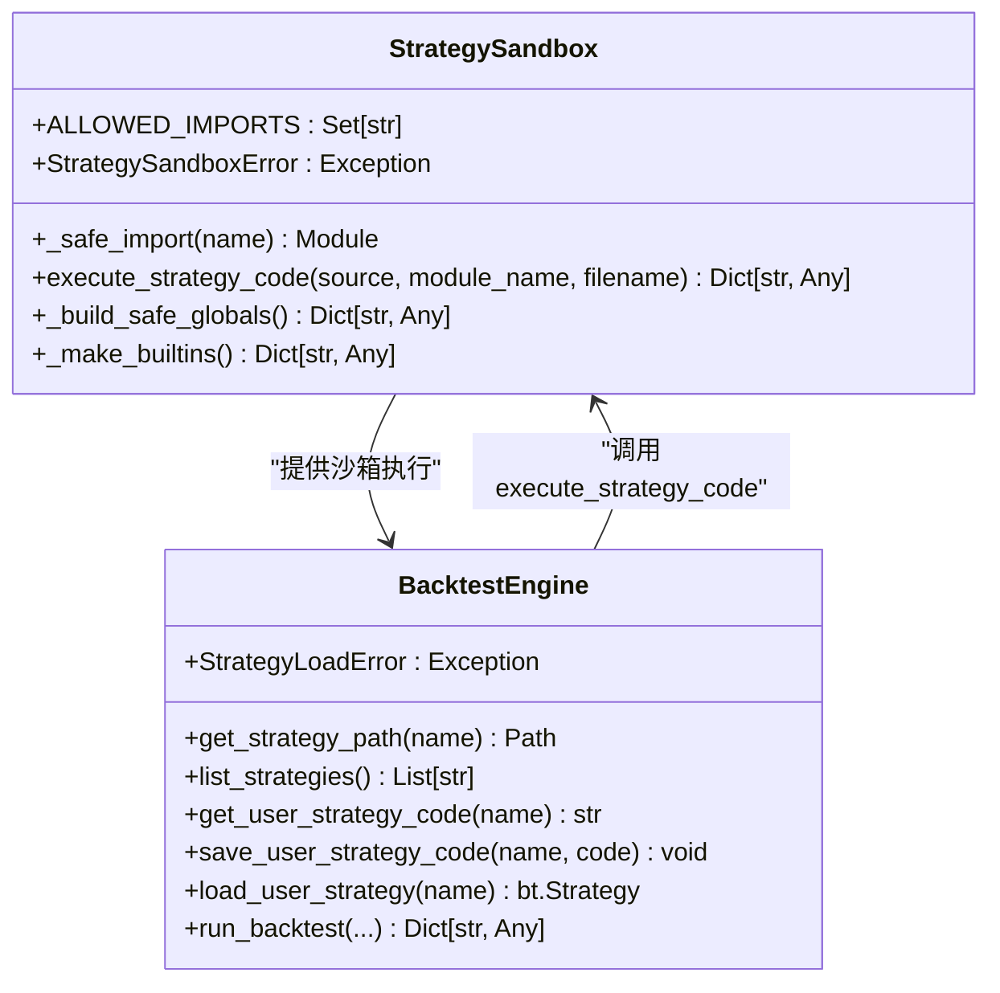
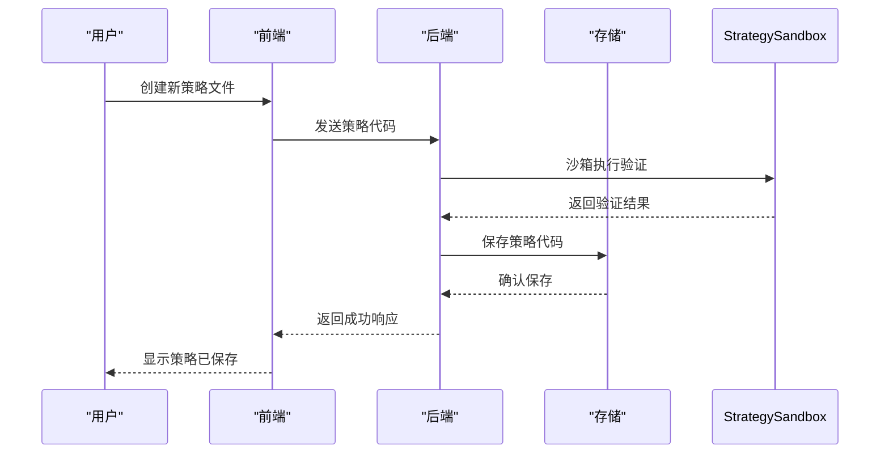
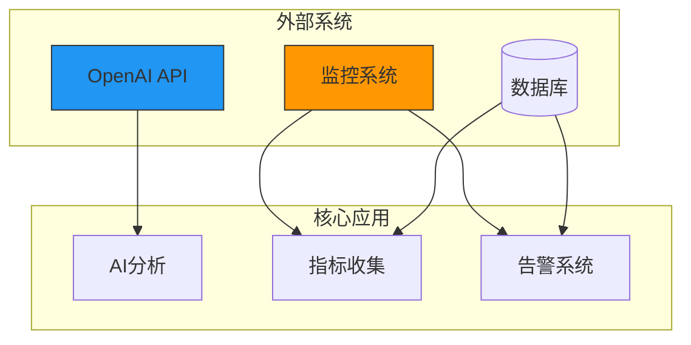
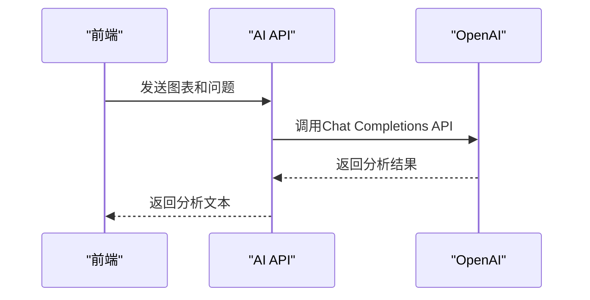
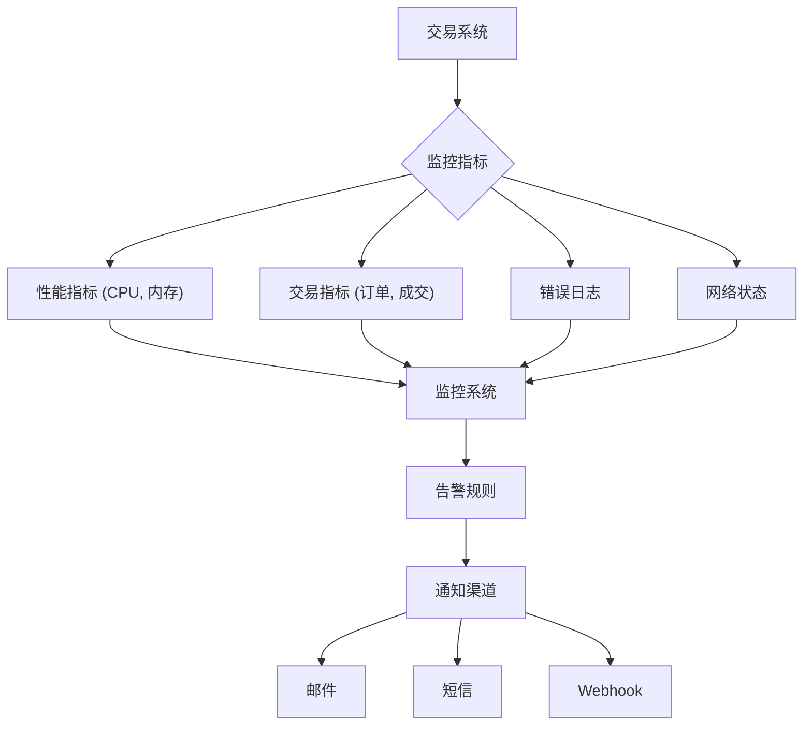
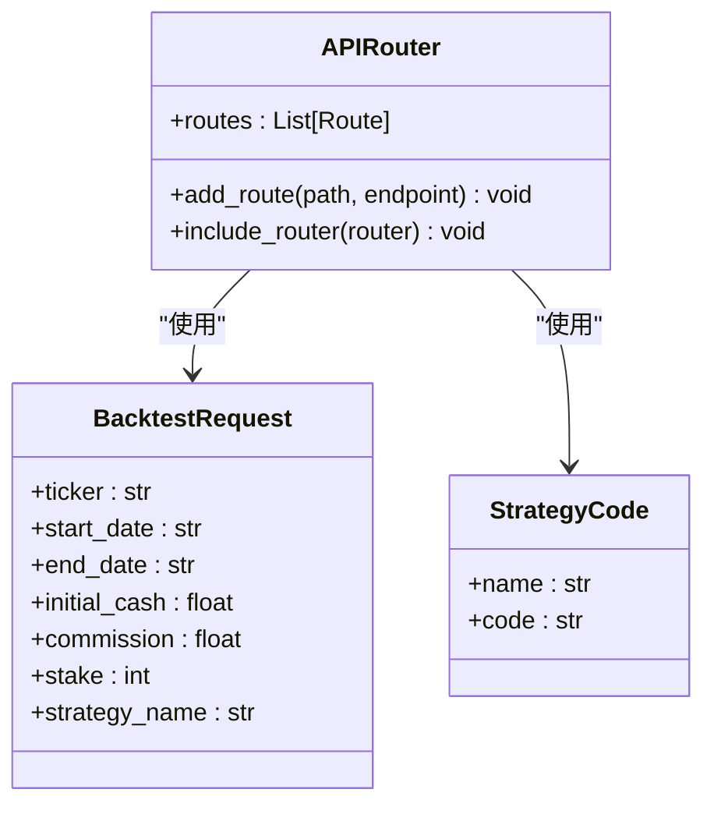

# 扩展与集成

<cite>
**本文档引用的文件**   
- [brokers.md](file://backend/src/brokers/brokers.md)
- [ccxt_adapter.md](file://backend/src/brokers/ccxt_adapter/ccxt_adapter.md)
- [ibkr_adapter.md](file://backend/src/brokers/ibkr_adapter/ibkr_adapter.md)
- [ccxt_store.py](file://backend/src/brokers/ccxt_adapter/ccxt_store.py)
- [ibkr_store.py](file://backend/src/brokers/ibkr_adapter/ibkr_store.py)
- [strategy.md](file://backend/resources/strategy/strategy.md)
- [breakout.py](file://backend/resources/strategy/breakout.py)
- [backtest_engine.py](file://backend/src/service/backtest_engine.py)
- [live_engine.py](file://backend/src/service/live_engine.py)
- [strategy_sandbox.py](file://backend/src/service/strategy_sandbox.py)
- [config_loader.py](file://backend/src/utils/config_loader.py)
- [api_routes.py](file://backend/src/routes/api_routes.py)
- [ai_routes.py](file://backend/src/routes/ai_routes.py)
- [backtest_storage.py](file://backend/src/db/backtest_storage.py)
</cite>

## 目录
1. [系统扩展点与集成概述](#系统扩展点与集成概述)
2. [交易所适配器集成](#交易所适配器集成)
3. [策略插件系统](#策略插件系统)
4. [外部系统集成](#外部系统集成)
5. [高级开发与优化指南](#高级开发与优化指南)

## 系统扩展点与集成概述

本系统设计了多个扩展点，支持灵活集成新的交易所和量化策略。通过适配器模式实现交易所接口的统一，通过策略插件机制支持用户自定义交易策略。同时，系统与OpenAI等外部AI服务以及监控系统实现了深度集成，为用户提供智能化的交易分析和实时监控能力。

**扩展点概述**
- **交易所适配器**：通过`brokers`目录下的适配器模式集成新的交易所
- **策略插件系统**：在`resources/strategy`目录下添加新的量化策略
- **外部系统集成**：与OpenAI、监控系统等外部服务的集成
- **API扩展**：通过FastAPI路由系统扩展新的API接口
- **插件开发**：支持自定义插件开发和性能优化

## 交易所适配器集成

系统通过适配器模式实现了对不同交易所的统一接入。`brokers`目录下的适配器将不同交易所的行情与下单接口统一到系统内部抽象，为上层应用提供一致的调用接口。

**适配器架构**
- **CCXT适配器**：集成CCXT库，支持多种加密货币交易所
- **IBKR适配器**：封装Interactive Brokers接口，支持股票、期货等传统金融产品
- **统一接口**：提供`get_broker`、`get_data`、`start/stop`等一致的调用面

**Diagram sources**
- [brokers.md](file://backend/src/brokers/brokers.md#L1-L19)
- [ccxt_adapter.md](file://backend/src/brokers/ccxt_adapter/ccxt_adapter.md#L1-L19)

### CCXT适配器实现

CCXT适配器通过`ccxt_store.py`、`ccxt_data.py`和`ccxt_broker.py`三个核心组件实现交易所的集成。

**关键特性**
- **异步支持**：通过后台线程管理asyncio事件循环，桥接异步CCXT操作与同步Backtrader框架
- **凭证管理**：API密钥通过环境变量加载，确保安全性
- **连接复用**：连接懒加载并可复用，提高性能
- **错误处理**：对网络超时、限频、交易所错误进行分类并抛出明确异常

**Diagram sources**
- [ccxt_store.py](file://backend/src/brokers/ccxt_adapter/ccxt_store.py#L21-L324)

**Section sources**
- [ccxt_store.py](file://backend/src/brokers/ccxt_adapter/ccxt_store.py#L21-L324)
- [ccxt_adapter.md](file://backend/src/brokers/ccxt_adapter/ccxt_adapter.md#L1-L19)

### IBKR适配器实现

IBKR适配器对Backtrader自带的`IBStore`进行封装，提供与CCXT适配器一致的调用接口。

**集成要点**
- **环境变量**：连接信息来自环境变量（如`IBKR_*`），不得硬编码账号
- **连接管理**：保持懒加载，避免在import阶段建立TWS/Gateway连接
- **合约格式**：支持IBKR合约字符串（如`AAPL-STK-SMART-USD`）
- **时间粒度**：支持常用时间粒度映射到Backtrader TimeFrame

**Diagram sources**
- [ibkr_store.py](file://backend/src/brokers/ibkr_adapter/ibkr_store.py#L45-L157)

**Section sources**
- [ibkr_store.py](file://backend/src/brokers/ibkr_adapter/ibkr_store.py#L45-L157)
- [ibkr_adapter.md](file://backend/src/brokers/ibkr_adapter/ibkr_adapter.md#L1-L19)

## 策略插件系统

系统通过策略插件机制支持用户自定义量化策略。所有用户策略脚本存放在`resources/strategy`目录下，系统提供完整的策略生命周期管理。

**策略管理流程**
1. 用户在`resources/strategy`目录下创建新的策略文件
2. 系统通过`backtest_engine.py`加载和验证策略
3. 策略在沙箱环境中执行，确保安全性和稳定性
4. 策略结果被记录和分析，供用户参考

### 策略插件工作机制

策略插件系统通过`backtest_engine.py`和`strategy_sandbox.py`两个核心模块实现。

**核心功能**
- **沙箱执行**：使用`strategy_sandbox.py`限制用户策略代码的执行环境
- **导入控制**：只允许导入预定义的安全模块（如backtrader、pandas等）
- **内置函数限制**：移除危险的内置函数，只保留安全的数学和数据处理函数
- **策略验证**：确保策略类继承自`backtrader.Strategy`

**Diagram sources**
- [strategy_sandbox.py](file://backend/src/service/strategy_sandbox.py#L11-L182)
- [backtest_engine.py](file://backend/src/service/backtest_engine.py#L25-L272)

**Section sources**
- [strategy_sandbox.py](file://backend/src/service/strategy_sandbox.py#L11-L182)
- [backtest_engine.py](file://backend/src/service/backtest_engine.py#L25-L272)
- [strategy.md](file://backend/resources/strategy/strategy.md#L1-L28)

### 添加新量化策略

在`resources/strategy`目录下添加新的量化策略需要遵循以下步骤：

**实施步骤**
1. 在`resources/strategy`目录下创建新的Python文件，如`my_strategy.py`
2. 定义继承自`bt.Strategy`的策略类
3. 实现`__init__`和`next`方法
4. 通过API或前端界面保存策略
5. 在回测或实盘中选择并运行新策略

**最佳实践**
- 策略文件名使用小写加下划线，如`ma_cross.py`
- 临时实验文件放入`sandbox/`或单独分支
- 策略代码中禁止写入真实交易密钥、账户信息
- 回测参数、滑点、手续费需与真实环境一致

**Diagram sources**
- [breakout.py](file://backend/resources/strategy/breakout.py#L1-L32)
- [api_routes.py](file://backend/src/routes/api_routes.py#L1-L341)

## 外部系统集成

系统与多个外部系统实现了深度集成，包括OpenAI等AI服务和监控系统，为用户提供智能化的交易分析和实时监控能力。

### OpenAI集成

系统通过`ai_routes.py`实现与OpenAI的集成，支持基于大模型的智能分析。

**集成要点**
- **环境变量**：通过`OPENAI_API_KEY`和`OPENAI_BASE_URL`配置API密钥和基础URL
- **代理支持**：支持通过HTTP/HTTPS代理访问OpenAI服务
- **图像分析**：支持上传图表图片进行视觉分析
- **多模型支持**：支持指定不同的AI模型（如gpt-4o）

**安全考虑**
- API密钥不存储在代码或配置文件中，只通过环境变量加载
- 请求内容经过验证，防止注入攻击
- 响应结果经过过滤，避免敏感信息泄露

**Diagram sources**
- [ai_routes.py](file://backend/src/routes/ai_routes.py#L1-L81)

**Section sources**
- [ai_routes.py](file://backend/src/routes/ai_routes.py#L1-L81)
- [config_loader.py](file://backend/src/utils/config_loader.py#L8-L343)

### 监控系统集成

系统通过多种机制实现与监控系统的集成，确保交易系统的稳定运行。

**监控维度**
- **系统性能**：CPU、内存、磁盘使用率等
- **交易指标**：订单数量、成交率、延迟等
- **错误日志**：异常堆栈、错误类型、发生频率
- **网络状态**：连接延迟、丢包率、带宽使用

**告警机制**
- 配置`broker_config.json`中的`notifications`部分定义告警规则
- 支持多种通知渠道，包括WebSocket、邮件、短信等
- 可配置告警事件类型，如订单成交、仓位变动、错误等

**Section sources**
- [config_loader.py](file://backend/src/utils/config_loader.py#L8-L343)
- [backtest_storage.py](file://backend/src/db/backtest_storage.py#L1-L444)

## 高级开发与优化指南

为高级用户提供定制化开发和系统集成的指导，包括API扩展、插件开发和性能优化。

### API扩展

系统基于FastAPI构建，支持灵活的API扩展。

**扩展步骤**
1. 在`src/routes`目录下创建新的路由文件，如`custom_routes.py`
2. 定义新的API端点和请求/响应模型
3. 在`src/service/app.py`中注册新的路由
4. 实现业务逻辑并连接到服务层

**最佳实践**
- 遵循RESTful设计原则
- 使用Pydantic模型进行请求验证
- 统一错误码和响应结构
- 在路由层做鉴权与权限检查

**Section sources**
- [api_routes.py](file://backend/src/routes/api_routes.py#L1-L341)
- [routes.md](file://backend/src/routes/routes.md#L1-L20)

### 插件开发

系统支持通过插件机制扩展功能，开发者可以创建自定义插件。

**开发指南**
- **插件结构**：遵循`src/service`目录下的模块结构
- **依赖管理**：在`requirements.txt`中声明依赖
- **配置集成**：通过`config_loader.py`读取配置
- **日志记录**：使用标准的logging模块记录日志

**性能优化建议**
- **连接复用**：避免频繁创建和销毁数据库或API连接
- **异步处理**：对I/O密集型操作使用异步编程
- **缓存机制**：对频繁访问的数据使用缓存
- **批量处理**：对大量数据操作使用批量处理

**Section sources**
- [live_engine.py](file://backend/src/service/live_engine.py#L1-L329)
- [backtest_engine.py](file://backend/src/service/backtest_engine.py#L1-L272)
- [config_loader.py](file://backend/src/utils/config_loader.py#L8-L343)