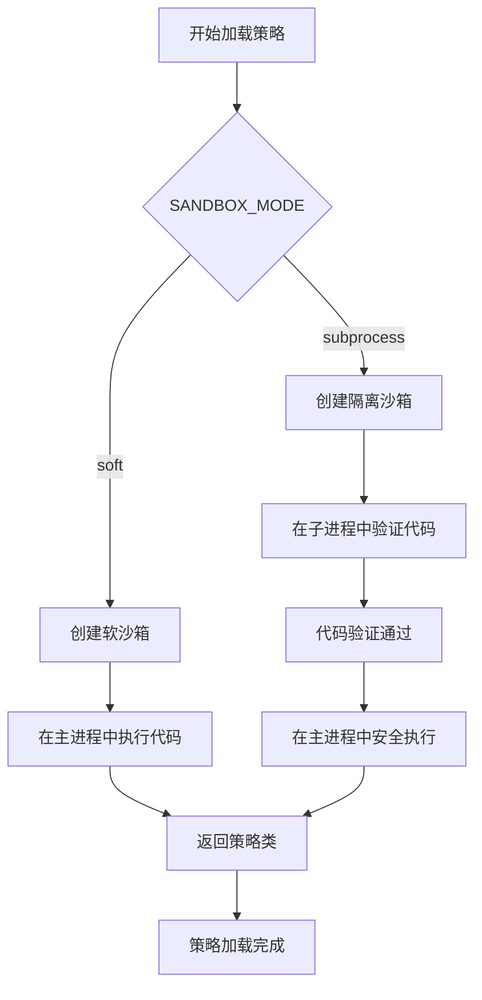
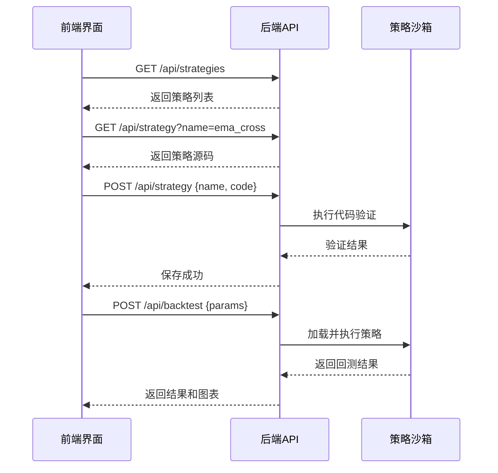

# 添加新策略

<cite>
**本文档引用的文件 **  
- [strategy_sandbox.py](file://backend/src/service/strategy_sandbox.py)
- [backtest_engine.py](file://backend/src/service/backtest_engine.py)
- [isolated_sandbox.py](file://backend/src/service/isolated_sandbox.py)
- [strategy_templates.py](file://backend/src/service/strategy_templates.py)
- [api_routes.py](file://backend/src/routes/api_routes.py)
- [sandbox_config.py](file://backend/src/config/sandbox_config.py)
- [strategy.md](file://backend/resources/strategy/strategy.md)
- [ema_cross.py](file://backend/resources/strategy/templates/ema_cross.py)
- [grid_trading.py](file://backend/resources/strategy/templates/grid_trading.py)
- [StrategyMaintain.jsx](file://frontend/src/pages/StrategyMaintain.jsx)
- [api.js](file://frontend/src/services/api.js)
</cite>

## 目录
1. [策略文件位置与命名规范](#策略文件位置与命名规范)
2. [基于模板开发新策略](#基于模板开发新策略)
3. [策略代码结构与规范](#策略代码结构与规范)
4. [策略沙箱安全执行机制](#策略沙箱安全执行机制)
5. [通过前端界面管理策略](#通过前端界面管理策略)
6. [完整自定义策略示例](#完整自定义策略示例)
7. [常见问题与优化建议](#常见问题与优化建议)

## 策略文件位置与命名规范

在backtrader系统中，所有用户自定义的交易策略文件必须放置在 `backend/resources/strategy/` 目录下。该目录是系统识别和加载策略的唯一位置。

**文件命名规范**：
- 策略文件应使用小写字母和下划线命名，例如 `sma_cross.py` 或 `grid_trading.py`。
- 文件扩展名必须为 `.py`。
- 策略类必须命名为 `UserStrategy` 并继承自 `backtrader.Strategy` 基类。

**目录结构说明**：
- `backend/resources/strategy/`：存放用户维护的策略脚本。
- `backend/resources/strategy/templates/`：存放系统内置的策略模板，供用户参考或一键导入。

此规范确保了策略文件的统一管理和安全加载。

**Section sources**
- [strategy.md](file://backend/resources/strategy/strategy.md#L1-L33)

## 基于模板开发新策略

开发者可以基于 `backend/resources/strategy/templates/` 目录下的示例策略来快速开发新策略。这些模板涵盖了多种经典交易策略，如均线交叉、布林带、网格交易等。

以 `ema_cross.py` 模板为例，它实现了一个简单的指数移动平均线（EMA）交叉策略。开发者可以复制此文件，重命名为新策略名（如 `my_ema_strategy.py`），然后根据需求修改参数和逻辑。

```python
# 示例：ema_cross.py 模板核心结构
class UserStrategy(bt.Strategy):
    params = (
        ("fast_period", 12),
        ("slow_period", 26),
    )
    
    def __init__(self):
        self.fast_ema = bt.indicators.EMA(self.data.close, period=self.p.fast_period)
        self.slow_ema = bt.indicators.EMA(self.data.close, period=self.p.slow_period)
        self.crossover = bt.indicators.CrossOver(self.fast_ema, self.slow_ema)

    def next(self):
        if not self.position:
            if self.crossover > 0:
                self.buy()
        else:
            if self.crossover < 0:
                self.close()
```

通过修改 `params` 元组中的参数和 `next()` 方法中的交易逻辑，即可创建一个全新的策略。

**Section sources**
- [ema_cross.py](file://backend/resources/strategy/templates/ema_cross.py#L1-L41)
- [strategy_templates.py](file://backend/src/service/strategy_templates.py#L1-L378)

## 策略代码结构与规范

一个完整的backtrader策略必须遵循特定的代码结构，以确保能够被系统正确加载和执行。

**核心组件**：
1. **导入模块**：必须导入 `backtrader as bt`。
2. **策略类定义**：类名必须为 `UserStrategy`，并继承 `bt.Strategy`。
3. **参数定义**：通过 `params` 元组定义可配置的策略参数。
4. **初始化方法**：`__init__()` 方法用于初始化指标和变量。
5. **主逻辑方法**：`next()` 方法在每个数据点上执行，是策略的核心逻辑所在。
6. **事件回调**：可实现 `notify_order()`、`notify_trade()` 等方法来处理订单和交易状态变化。

**参数定义方式**：
策略参数应在 `params` 元组中定义，格式为 `("参数名", 默认值)`。这些参数可以在回测或实盘运行时被外部覆盖。

```python
params = (
    ("fast_period", 10),
    ("slow_period", 30),
    ("stake", 100),
)
```

在 `next()` 方法中，通过 `self.p.参数名` 访问这些参数。

**Section sources**
- [ema_cross.py](file://backend/resources/strategy/templates/ema_cross.py#L1-L41)
- [grid_trading.py](file://backend/resources/strategy/templates/grid_trading.py#L1-L70)
- [buy_and_hold.py](file://backend/resources/strategy/buy_and_hold.py#L1-L11)

## 策略沙箱安全执行机制

为了安全地执行用户上传的策略代码，系统采用了沙箱机制。该机制通过 `backend/src/service/strategy_sandbox.py` 和 `backend/src/service/isolated_sandbox.py` 实现。

**软沙箱模式 (Soft Sandbox)**：
- 在主进程中执行策略代码。
- 限制可导入的模块，仅允许 `backtrader`、`math`、`pandas` 等安全模块。
- 移除危险的内置函数（如 `open`、`eval`）。
- **警告**：此模式无法完全防止恶意代码，仅适用于受信任的代码。

**隔离沙箱模式 (Isolated Sandbox)**：
- 推荐模式，通过子进程执行策略代码。
- 使用 `subprocess` 创建隔离环境，具有内存和超时限制。
- 通过环境变量配置安全策略，如 `SANDBOX_MODE=subprocess`。
- 提供更好的安全隔离，防止恶意代码影响主系统。

当系统加载策略时，会根据配置自动选择沙箱模式。在 `backtest_engine.py` 中，`load_user_strategy()` 函数负责此过程，它首先验证代码，然后在安全环境中执行。



**Diagram sources**
- [strategy_sandbox.py](file://backend/src/service/strategy_sandbox.py#L1-L213)
- [isolated_sandbox.py](file://backend/src/service/isolated_sandbox.py#L1-L393)
- [backtest_engine.py](file://backend/src/service/backtest_engine.py#L81-L164)

## 通过前端界面管理策略

用户可以通过前端的“策略维护”界面来加载、编辑和运行自定义策略。该界面由 `frontend/src/pages/StrategyMaintain.jsx` 实现。

**主要功能**：
1. **策略列表**：显示当前所有可用的策略文件。
2. **代码编辑器**：提供语法高亮的编辑器，用于修改策略代码。
3. **模板库**：一键导入系统内置的策略模板。
4. **保存与运行**：将修改后的代码保存到服务器，并可直接启动回测或实盘。

**API交互流程**：
1. **获取策略列表**：前端调用 `/api/strategies` 获取策略名称列表。
2. **加载策略代码**：调用 `/api/strategy?name=策略名` 获取指定策略的源码。
3. **保存策略代码**：通过 `POST /api/strategy` 将修改后的代码保存到服务器。
4. **运行回测**：调用 `/api/backtest` 启动回测任务。



**Diagram sources**
- [StrategyMaintain.jsx](file://frontend/src/pages/StrategyMaintain.jsx#L1-L208)
- [api.js](file://frontend/src/services/api.js#L89-L95)
- [api_routes.py](file://backend/src/routes/api_routes.py#L67-L323)

## 完整自定义策略示例

以下是一个完整的自定义策略示例，实现了基于RSI指标的均值回归策略。

```python
"""
RSI 均值回归策略
使用相对强弱指数（RSI）识别超买超卖状态，在超卖时买入，超买时卖出。
"""
import backtrader as bt

class UserStrategy(bt.Strategy):
    """
    RSI 均值回归策略
    
    Parameters:
        rsi_period: RSI计算周期 (默认: 14)
        rsi_overbought: 超买阈值 (默认: 70)
        rsi_oversold: 超卖阈值 (默认: 30)
        stake: 每次交易手数 (默认: 100)
    """
    params = (
        ("rsi_period", 14),
        ("rsi_overbought", 70),
        ("rsi_oversold", 30),
        ("stake", 100),
    )

    def __init__(self):
        # 初始化RSI指标
        self.rsi = bt.indicators.RSI(
            self.data.close, 
            period=self.p.rsi_period
        )
        # 用于跟踪是否已下单
        self.order = None

    def next(self):
        # 如果有订单在执行中，跳过
        if self.order:
            return

        # 如果没有持仓
        if not self.position:
            # RSI低于超卖阈值，买入
            if self.rsi[0] < self.p.rsi_oversold:
                self.order = self.buy(size=self.p.stake)
        # 如果有持仓
        else:
            # RSI高于超买阈值，卖出
            if self.rsi[0] > self.p.rsi_overbought:
                self.order = self.sell(size=self.p.stake)

    def notify_order(self, order):
        """订单状态变化回调"""
        if order.status in [order.Completed]:
            if order.isbuy():
                print(f"买入执行, 价格: {order.executed.price}")
            elif order.issell():
                print(f"卖出执行, 价格: {order.executed.price}")
            self.order = None
        elif order.status in [order.Canceled, order.Margin, order.Rejected]:
            print("订单执行失败")
            self.order = None

    def notify_trade(self, trade):
        """交易状态变化回调"""
        if trade.isclosed:
            print(f"交易完成, 盈亏: {trade.pnl:.2f}")
```

将此代码保存为 `rsi_reversion.py` 并放置在 `backend/resources/strategy/` 目录下，即可在前端界面中选择并运行该策略。

**Section sources**
- [grid_trading.py](file://backend/resources/strategy/templates/grid_trading.py#L1-L70)
- [ema_cross.py](file://backend/resources/strategy/templates/ema_cross.py#L1-L41)

## 常见问题与优化建议

### 常见问题

1. **语法错误**：
   - 现象：保存策略时提示“策略包含语法错误”。
   - 解决：检查Python语法，确保缩进正确，括号匹配。

2. **模块导入错误**：
   - 现象：`Import of module 'os' is not permitted`。
   - 解决：沙箱仅允许导入白名单中的模块（如 `math`、`pandas`），避免使用 `os`、`sys` 等系统模块。

3. **策略类未找到**：
   - 现象：`UserStrategy class not found in strategy file`。
   - 解决：确保策略类名正确为 `UserStrategy` 并继承 `bt.Strategy`。

4. **依赖包管理**：
   - 系统已预装 `backtrader`、`pandas`、`numpy` 等常用库。
   - 如需其他库，需修改 `backend/requirements.txt` 并重新部署。

### 性能优化建议

1. **避免在 `next()` 中进行复杂计算**：
   - 将耗时计算移至 `__init__()` 或使用 `bt.indicators`。

2. **合理设置参数**：
   - 过长的回测周期或过小的时间框架会显著增加计算量。

3. **使用向量化操作**：
   - 利用 `pandas` 和 `numpy` 进行批量数据处理。

4. **启用沙箱缓存**：
   - 在 `sandbox_config.py` 中设置 `enable_caching=True` 可缓存编译后的策略字节码。

通过遵循以上规范和建议，可以高效、安全地在backtrader系统中开发和部署新的交易策略。

**Section sources**
- [strategy_sandbox.py](file://backend/src/service/strategy_sandbox.py#L47-L64)
- [sandbox_config.py](file://backend/src/config/sandbox_config.py#L1-L115)
- [backtest_engine.py](file://backend/src/service/backtest_engine.py#L302-L383)