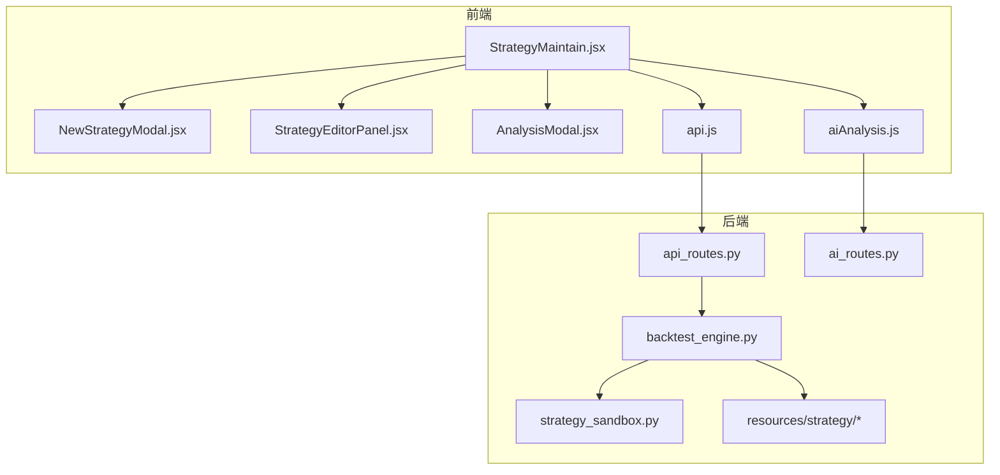
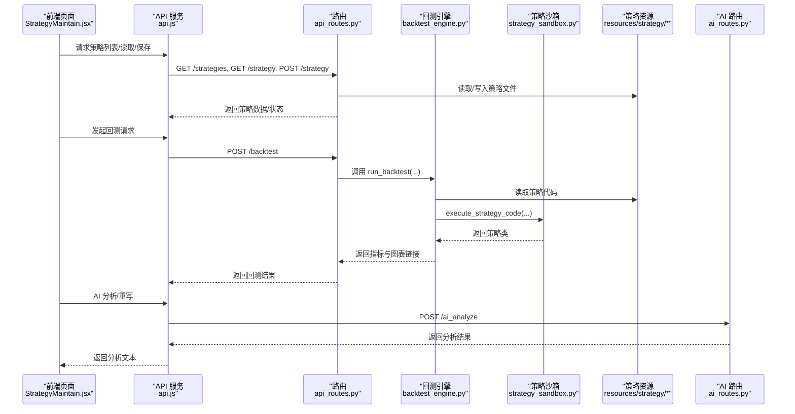
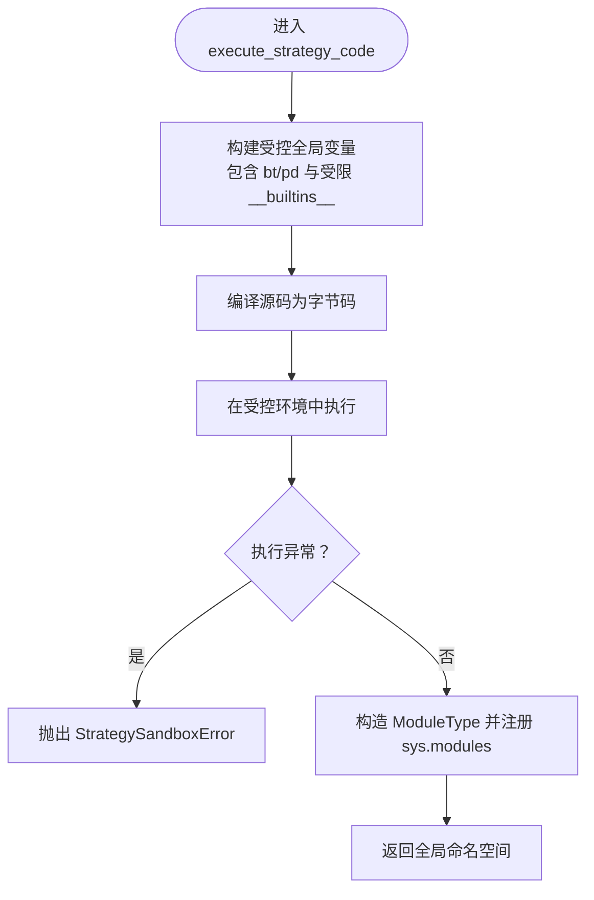
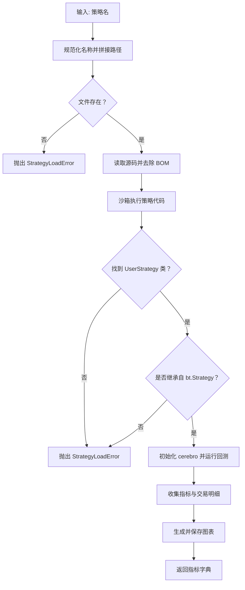
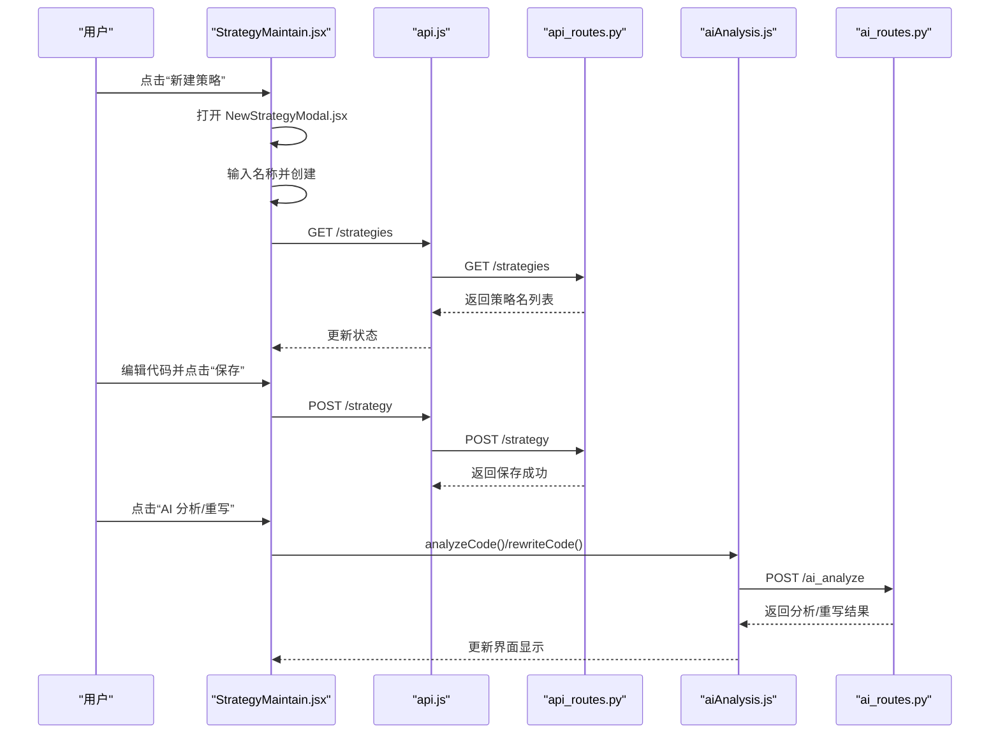
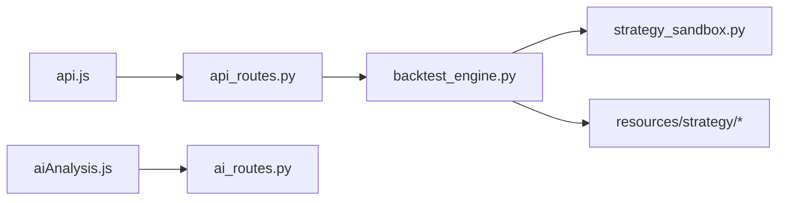

# 策略插件系统

<cite>
**本文引用的文件列表**
- [strategy_sandbox.py](file://backend/src/service/strategy_sandbox.py)
- [backtest_engine.py](file://backend/src/service/backtest_engine.py)
- [api_routes.py](file://backend/src/routes/api_routes.py)
- [ai_routes.py](file://backend/src/routes/ai_routes.py)
- [StrategyMaintain.jsx](file://frontend/src/pages/StrategyMaintain.jsx)
- [NewStrategyModal.jsx](file://frontend/src/components/StrategyMaintain/NewStrategyModal.jsx)
- [StrategyEditorPanel.jsx](file://frontend/src/components/StrategyMaintain/StrategyEditorPanel.jsx)
- [AnalysisModal.jsx](file://frontend/src/components/StrategyMaintain/AnalysisModal.jsx)
- [api.js](file://frontend/src/services/api.js)
- [aiAnalysis.js](file://frontend/src/services/aiAnalysis.js)
- [breakout.py](file://backend/resources/strategy/breakout.py)
- [strategy.md](file://backend/resources/strategy/strategy.md)
</cite>

## 目录
1. [引言](#引言)
2. [项目结构](#项目结构)
3. [核心组件](#核心组件)
4. [架构总览](#架构总览)
5. [组件详解](#组件详解)
6. [依赖关系分析](#依赖关系分析)
7. [性能与安全考量](#性能与安全考量)
8. [故障排查指南](#故障排查指南)
9. [结论](#结论)
10. [附录](#附录)

## 引言
本文件面向开发者，系统性解析基于文件系统的策略插件机制，覆盖以下要点：
- 在 resources/strategy 目录以 Python 模块形式新增策略（如 breakout.py），并通过 strategy_sandbox.py 在后端安全加载与执行。
- 前端 StrategyMaintain.jsx 提供策略管理界面，支持新建、编辑、保存与 AI 优化；结合 NewStrategyModal.jsx 与 API 服务完成策略元数据与代码内容的持久化。
- 明确策略代码结构要求、参数定义规范、沙箱执行安全限制，以及前后端交互的 REST 接口细节，帮助开发者从创建到部署形成闭环。

## 项目结构
策略插件系统由“前端策略维护界面 + 后端策略沙箱加载 + 回测引擎 + API 路由 + AI 分析路由 + 策略资源目录”构成。下图概览了关键文件与职责：

图表来源
- [StrategyMaintain.jsx](file://frontend/src/pages/StrategyMaintain.jsx#L1-L187)
- [NewStrategyModal.jsx](file://frontend/src/components/StrategyMaintain/NewStrategyModal.jsx#L1-L62)
- [StrategyEditorPanel.jsx](file://frontend/src/components/StrategyMaintain/StrategyEditorPanel.jsx#L1-L83)
- [AnalysisModal.jsx](file://frontend/src/components/StrategyMaintain/AnalysisModal.jsx#L1-L32)
- [api.js](file://frontend/src/services/api.js#L1-L255)
- [aiAnalysis.js](file://frontend/src/services/aiAnalysis.js#L1-L195)
- [api_routes.py](file://backend/src/routes/api_routes.py#L1-L341)
- [ai_routes.py](file://backend/src/routes/ai_routes.py#L1-L81)
- [backtest_engine.py](file://backend/src/service/backtest_engine.py#L1-L272)
- [strategy_sandbox.py](file://backend/src/service/strategy_sandbox.py#L1-L182)
- [breakout.py](file://backend/resources/strategy/breakout.py#L1-L32)

章节来源
- [StrategyMaintain.jsx](file://frontend/src/pages/StrategyMaintain.jsx#L1-L187)
- [api_routes.py](file://backend/src/routes/api_routes.py#L1-L341)
- [backtest_engine.py](file://backend/src/service/backtest_engine.py#L1-L272)

## 核心组件
- 策略沙箱执行器：在受限内置函数与导入白名单下编译并执行用户策略代码，确保安全隔离。
- 回测引擎：负责策略文件的读取、校验、加载与执行，产出指标与可视化图表。
- API 路由：提供策略列表、读取/保存、回测、历史查询等 REST 接口。
- AI 分析路由：封装外部大模型调用，支持带图片的综合分析。
- 前端策略维护页面：提供策略选择、编辑、保存、AI 分析与重写能力。

章节来源
- [strategy_sandbox.py](file://backend/src/service/strategy_sandbox.py#L1-L182)
- [backtest_engine.py](file://backend/src/service/backtest_engine.py#L1-L272)
- [api_routes.py](file://backend/src/routes/api_routes.py#L1-L341)
- [ai_routes.py](file://backend/src/routes/ai_routes.py#L1-L81)
- [StrategyMaintain.jsx](file://frontend/src/pages/StrategyMaintain.jsx#L1-L187)

## 架构总览
下图展示了从前端到后端的关键交互流程，包括策略读取/保存、回测执行与 AI 分析：

图表来源
- [StrategyMaintain.jsx](file://frontend/src/pages/StrategyMaintain.jsx#L1-L187)
- [api.js](file://frontend/src/services/api.js#L1-L255)
- [api_routes.py](file://backend/src/routes/api_routes.py#L1-L341)
- [backtest_engine.py](file://backend/src/service/backtest_engine.py#L1-L272)
- [strategy_sandbox.py](file://backend/src/service/strategy_sandbox.py#L1-L182)
- [ai_routes.py](file://backend/src/routes/ai_routes.py#L1-L81)

## 组件详解

### 策略沙箱执行器（strategy_sandbox.py）
- 安全目标：限制用户策略代码可访问的内置函数与模块，禁止相对导入，防止文件系统与网络访问。
- 关键机制：
  - 白名单导入：仅允许特定模块（如 backtrader、pandas、numpy、math 等）被导入。
  - 自定义 __import__：拦截导入请求，校验根模块是否在白名单内。
  - 限定内置函数：仅暴露有限的内置函数与异常类型。
  - 编译与执行：对用户源码进行编译，再在受控全局变量中执行，捕获语法错误与运行时异常。
- 返回值：返回执行后的全局命名空间，供后续查找策略类。

图表来源
- [strategy_sandbox.py](file://backend/src/service/strategy_sandbox.py#L148-L181)

章节来源
- [strategy_sandbox.py](file://backend/src/service/strategy_sandbox.py#L1-L182)

### 回测引擎（backtest_engine.py）
- 策略文件管理：
  - 列表：扫描 resources/strategy 下的 .py 文件，返回策略名列表。
  - 读取/保存：根据名称规范化路径，读取或写入 UTF-8 文本。
  - 名称校验：禁止路径穿越，仅允许字母、数字、连字符与下划线。
- 加载与校验：
  - 读取策略源码，去除 BOM。
  - 通过沙箱执行策略代码，提取名为 UserStrategy 的类。
  - 校验 UserStrategy 是否继承自 backtrader.Strategy。
- 回测执行：
  - 使用 cerebro 初始化策略、数据、佣金、固定仓位等。
  - 注册多个 Analyzer 与自定义 TradeRecorder，收集指标与交易明细。
  - 生成图表并保存至指定路径，返回指标字典。

图表来源
- [backtest_engine.py](file://backend/src/service/backtest_engine.py#L54-L116)
- [backtest_engine.py](file://backend/src/service/backtest_engine.py#L180-L257)

章节来源
- [backtest_engine.py](file://backend/src/service/backtest_engine.py#L1-L272)

### API 路由（api_routes.py）
- 策略接口：
  - GET /strategies：返回可用策略名列表。
  - GET /strategy?name=xxx：返回策略代码与名称。
  - POST /strategy：保存策略代码。
- 回测接口：
  - POST /backtest：执行回测，返回指标与图表链接；同时异步持久化到数据库。
- 历史与分析接口：
  - POST /backtest/history：分页查询回测历史。
  - GET /backtest/history/{id}：获取回测详情。
  - DELETE /backtest/history/{id}：删除回测记录。
  - POST /backtest/history/{id}/ai-analysis：更新回测的 AI 分析内容。
  - POST /analyze：基于指标生成简要分析文本（用于前端快速分析）。

章节来源
- [api_routes.py](file://backend/src/routes/api_routes.py#L1-L341)

### AI 分析路由（ai_routes.py）
- 提供 /ai_analyze 接口，接收文本消息与可选图片文件，转发给外部大模型（OpenAI），返回分析结果。
- 支持代理配置，便于内网环境使用。

章节来源
- [ai_routes.py](file://backend/src/routes/ai_routes.py#L1-L81)

### 前端策略维护界面（StrategyMaintain.jsx）
- 功能概览：
  - 初始化加载策略列表与默认策略代码。
  - 新建策略：弹出 NewStrategyModal.jsx，输入名称后生成默认模板。
  - 编辑策略：使用 Monaco 编辑器进行代码编辑。
  - 保存策略：调用 api.js 的 /strategy 接口保存。
  - AI 分析与重写：调用 aiAnalysis.js，通过 /ai_analyze 获取分析结果或优化后的代码。
- 状态管理：维护策略列表、当前选中策略、代码内容、加载状态与分析结果弹窗。

图表来源
- [StrategyMaintain.jsx](file://frontend/src/pages/StrategyMaintain.jsx#L1-L187)
- [NewStrategyModal.jsx](file://frontend/src/components/StrategyMaintain/NewStrategyModal.jsx#L1-L62)
- [StrategyEditorPanel.jsx](file://frontend/src/components/StrategyMaintain/StrategyEditorPanel.jsx#L1-L83)
- [AnalysisModal.jsx](file://frontend/src/components/StrategyMaintain/AnalysisModal.jsx#L1-L32)
- [api.js](file://frontend/src/services/api.js#L1-L255)
- [aiAnalysis.js](file://frontend/src/services/aiAnalysis.js#L1-L195)
- [api_routes.py](file://backend/src/routes/api_routes.py#L1-L341)
- [ai_routes.py](file://backend/src/routes/ai_routes.py#L1-L81)

章节来源
- [StrategyMaintain.jsx](file://frontend/src/pages/StrategyMaintain.jsx#L1-L187)
- [NewStrategyModal.jsx](file://frontend/src/components/StrategyMaintain/NewStrategyModal.jsx#L1-L62)
- [StrategyEditorPanel.jsx](file://frontend/src/components/StrategyMaintain/StrategyEditorPanel.jsx#L1-L83)
- [AnalysisModal.jsx](file://frontend/src/components/StrategyMaintain/AnalysisModal.jsx#L1-L32)
- [api.js](file://frontend/src/services/api.js#L1-L255)
- [aiAnalysis.js](file://frontend/src/services/aiAnalysis.js#L1-L195)

### 策略资源与模板（resources/strategy）
- 默认策略示例：breakout.py 展示了标准策略类结构，包含 params 定义与 next() 交易逻辑。
- 策略目录说明：强调人工负责策略逻辑与风控，AI 仅在授权下提供辅助，避免直接改动策略文件。

章节来源
- [breakout.py](file://backend/resources/strategy/breakout.py#L1-L32)
- [strategy.md](file://backend/resources/strategy/strategy.md#L1-L28)

## 依赖关系分析
- 前端依赖后端 API：
  - api.js 封装 /strategies、/strategy、/backtest、/backtest/history、/ai_analyze 等调用。
  - aiAnalysis.js 封装 AI 分析与重写流程，内部调用 /ai_analyze。
- 后端依赖关系：
  - api_routes.py 依赖 backtest_engine.py 进行策略读取/保存与回测执行。
  - backtest_engine.py 依赖 strategy_sandbox.py 执行策略代码。
  - ai_routes.py 依赖外部大模型服务，通过环境变量配置。

图表来源
- [api.js](file://frontend/src/services/api.js#L1-L255)
- [aiAnalysis.js](file://frontend/src/services/aiAnalysis.js#L1-L195)
- [api_routes.py](file://backend/src/routes/api_routes.py#L1-L341)
- [backtest_engine.py](file://backend/src/service/backtest_engine.py#L1-L272)
- [strategy_sandbox.py](file://backend/src/service/strategy_sandbox.py#L1-L182)

章节来源
- [api.js](file://frontend/src/services/api.js#L1-L255)
- [aiAnalysis.js](file://frontend/src/services/aiAnalysis.js#L1-L195)
- [api_routes.py](file://backend/src/routes/api_routes.py#L1-L341)
- [backtest_engine.py](file://backend/src/service/backtest_engine.py#L1-L272)
- [strategy_sandbox.py](file://backend/src/service/strategy_sandbox.py#L1-L182)

## 性能与安全考量
- 沙箱安全限制
  - 导入白名单：仅允许有限模块导入，阻止任意模块加载。
  - 禁止相对导入：防止策略通过相对路径访问非白名单模块。
  - 限制内置函数：仅暴露必要内置函数，降低攻击面。
  - 语法与运行时错误捕获：在编译阶段与执行阶段均进行错误上报，便于定位问题。
- 回测性能
  - 图表渲染关闭交互模式，避免弹窗与阻塞。
  - Analyzer 与 TradeRecorder 仅在需要时启用，减少额外计算。
- 前端体验
  - Monaco 编辑器提供语法高亮与自动布局，提升编辑效率。
  - AI 分析采用表单上传图片，支持代理配置，保证网络稳定性。

章节来源
- [strategy_sandbox.py](file://backend/src/service/strategy_sandbox.py#L1-L182)
- [backtest_engine.py](file://backend/src/service/backtest_engine.py#L1-L272)
- [ai_routes.py](file://backend/src/routes/ai_routes.py#L1-L81)

## 故障排查指南
- 策略加载失败
  - 现象：回测时报错提示无法加载策略。
  - 排查：检查策略文件是否存在、名称是否符合规范（字母、数字、连字符、下划线，不含路径穿越）。
  - 参考：后端会抛出策略加载错误，前端收到 4xx/5xx 错误。
- 导入异常
  - 现象：策略中导入了未在白名单内的模块。
  - 排查：确认仅使用白名单内模块；若需扩展，需在沙箱侧更新白名单。
- 语法错误
  - 现象：沙箱编译阶段报语法错误。
  - 排查：修正语法；前端可在编辑器中快速定位。
- 回测无结果
  - 现象：回测返回空指标或图表生成失败。
  - 排查：确认数据源可用、参数合理；查看后端日志中的异常堆栈。
- AI 分析失败
  - 现象：/ai_analyze 返回错误。
  - 排查：检查 OPENAI_API_KEY 与 OPENAI_BASE_URL 是否配置；网络代理设置是否正确。

章节来源
- [backtest_engine.py](file://backend/src/service/backtest_engine.py#L1-L272)
- [strategy_sandbox.py](file://backend/src/service/strategy_sandbox.py#L1-L182)
- [ai_routes.py](file://backend/src/routes/ai_routes.py#L1-L81)

## 结论
该策略插件系统通过“文件系统 + 沙箱执行 + 回测引擎 + API 路由 + AI 分析”的完整链路，实现了从策略创建、编辑、保存到回测与 AI 辅助优化的闭环。前端提供直观的策略维护界面，后端以白名单与受限内置函数保障执行安全，配合完善的 REST 接口与错误处理，为开发者提供了可靠且易用的策略开发与验证平台。

## 附录

### 策略代码结构与参数规范
- 必须定义一个名为 UserStrategy 的类，继承自 backtrader.Strategy。
- params 元组用于声明策略参数，例如移动窗口、止损止盈比例等。
- __init__() 中初始化指标与辅助变量。
- next() 中实现交易逻辑，包含入场、出场与风控判断。

参考示例
- [breakout.py](file://backend/resources/strategy/breakout.py#L1-L32)

章节来源
- [breakout.py](file://backend/resources/strategy/breakout.py#L1-L32)

### 新增策略步骤（后端）
- 在 resources/strategy 目录新增 Python 文件，遵循上述结构与参数规范。
- 确保策略名称仅包含字母、数字、连字符与下划线，避免路径穿越。
- 通过 /strategies 与 /strategy 接口验证策略可见与可读。

章节来源
- [backtest_engine.py](file://backend/src/service/backtest_engine.py#L34-L71)
- [api_routes.py](file://backend/src/routes/api_routes.py#L59-L106)

### 前端策略管理操作
- 新建：打开 NewStrategyModal.jsx，输入策略名，生成默认模板。
- 编辑：使用 Monaco 编辑器进行代码编辑。
- 保存：调用 api.js 的 /strategy 接口保存。
- AI 分析/重写：调用 aiAnalysis.js，通过 /ai_analyze 获取分析或优化后的代码。

章节来源
- [StrategyMaintain.jsx](file://frontend/src/pages/StrategyMaintain.jsx#L1-L187)
- [NewStrategyModal.jsx](file://frontend/src/components/StrategyMaintain/NewStrategyModal.jsx#L1-L62)
- [StrategyEditorPanel.jsx](file://frontend/src/components/StrategyMaintain/StrategyEditorPanel.jsx#L1-L83)
- [AnalysisModal.jsx](file://frontend/src/components/StrategyMaintain/AnalysisModal.jsx#L1-L32)
- [api.js](file://frontend/src/services/api.js#L76-L119)
- [aiAnalysis.js](file://frontend/src/services/aiAnalysis.js#L1-L195)

### REST 接口清单（摘要）
- GET /strategies：返回策略名列表。
- GET /strategy?name=xxx：返回策略代码与名称。
- POST /strategy：保存策略代码。
- POST /backtest：执行回测，返回指标与图表链接。
- POST /backtest/history：分页查询回测历史。
- GET /backtest/history/{id}：获取回测详情。
- DELETE /backtest/history/{id}：删除回测记录。
- POST /backtest/history/{id}/ai-analysis：更新回测的 AI 分析内容。
- POST /analyze：基于指标生成简要分析文本。
- POST /ai_analyze：AI 综合分析（文本+图片）。

章节来源
- [api_routes.py](file://backend/src/routes/api_routes.py#L59-L341)
- [ai_routes.py](file://backend/src/routes/ai_routes.py#L1-L81)