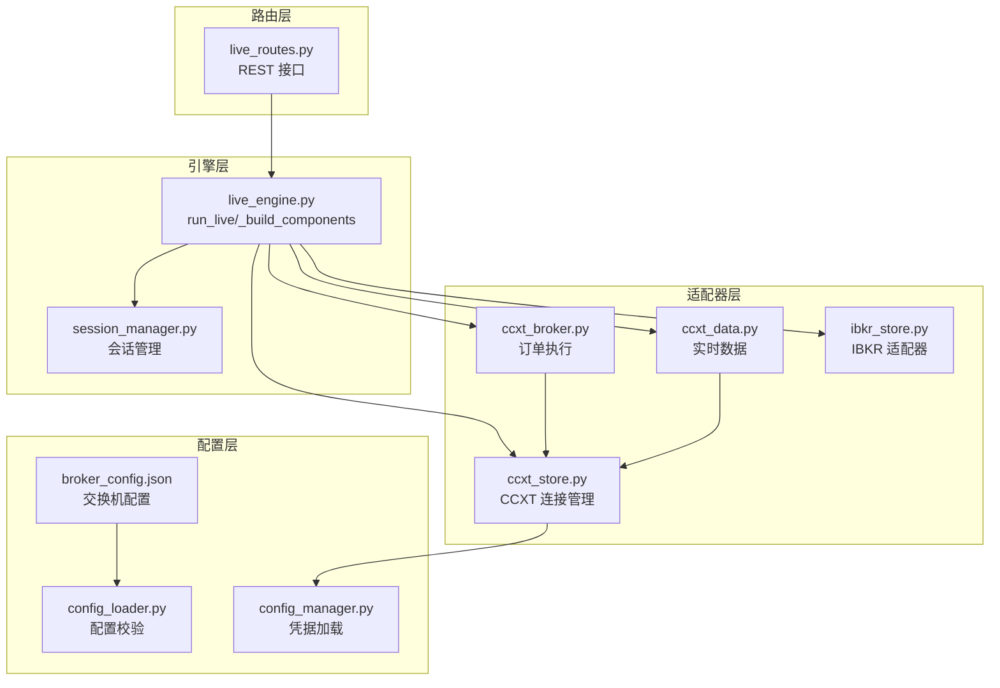
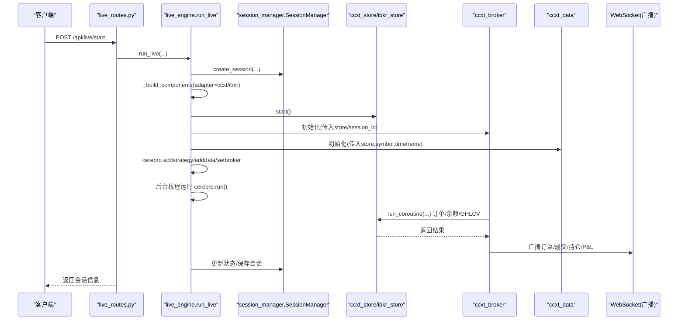
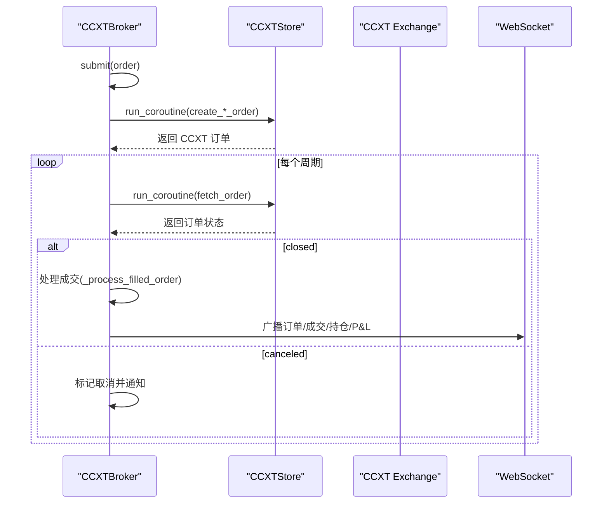
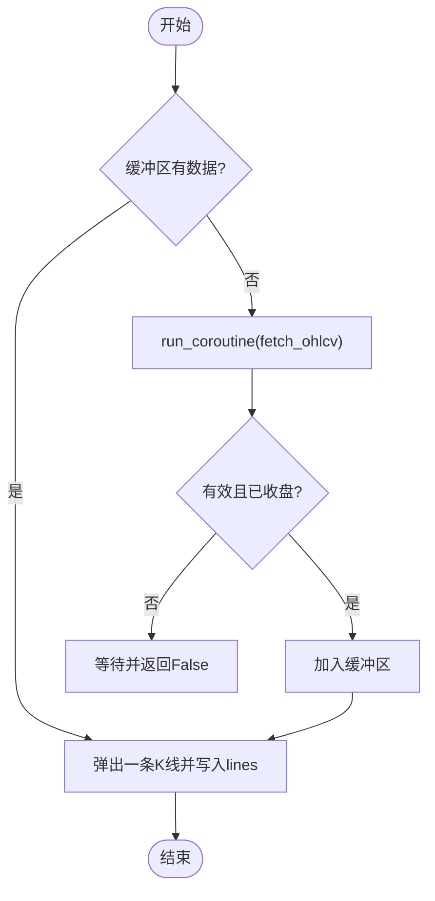
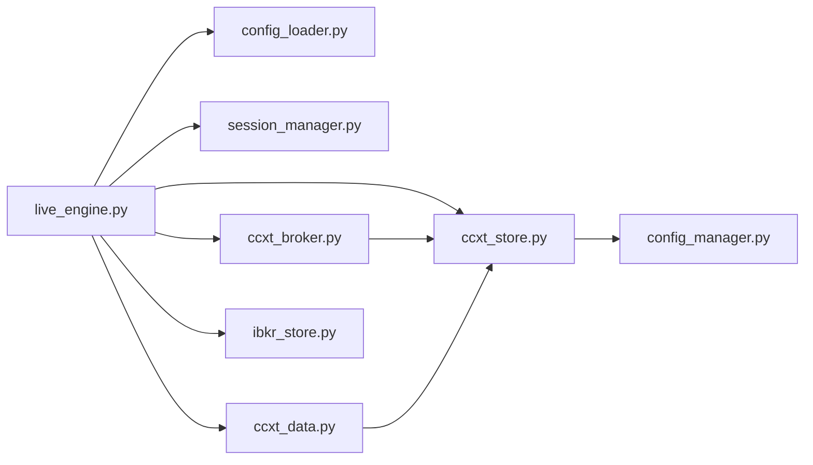

# 集成新交易所

<cite>
**本文引用的文件**
- [live_engine.py](file://backend/src/service/live_engine.py)
- [session_manager.py](file://backend/src/service/session_manager.py)
- [ccxt_store.py](file://backend/src/brokers/ccxt_adapter/ccxt_store.py)
- [ccxt_broker.py](file://backend/src/brokers/ccxt_adapter/ccxt_broker.py)
- [ccxt_data.py](file://backend/src/brokers/ccxt_adapter/ccxt_data.py)
- [ibkr_store.py](file://backend/src/brokers/ibkr_adapter/ibkr_store.py)
- [broker_config.json](file://backend/resources/config/broker_config.json)
- [config_loader.py](file://backend/src/utils/config_loader.py)
- [config_manager.py](file://backend/src/config/config_manager.py)
- [live_routes.py](file://backend/src/routes/live_routes.py)
- [test_ccxt_broker.py](file://backend/tests/brokers/ccxt_adapter/test_ccxt_broker.py)
- [test_ibkr_store.py](file://backend/tests/brokers/ibkr_adapter/test_ibkr_store.py)
</cite>

## 目录
1. [简介](#简介)
2. [项目结构](#项目结构)
3. [核心组件](#核心组件)
4. [架构总览](#架构总览)
5. [详细组件分析](#详细组件分析)
6. [依赖关系分析](#依赖关系分析)
7. [性能考量](#性能考量)
8. [故障排查指南](#故障排查指南)
9. [结论](#结论)
10. [附录](#附录)

## 简介
本文件面向希望为系统新增“全新交易所”或“CCXT 支持的交易所”的开发者，系统性阐述如何通过适配器模式完成集成。内容覆盖：
- 若新交易所已被 CCXT 支持：复用 ccxt_broker.py 的逻辑，仅需在 broker_config.json 中添加 API 密钥与配置即可上线。
- 若为全新交易所（未被 CCXT 支持）：仿照 ibkr_store.py 创建新的适配器类，实现统一的市场数据获取、下单、持仓查询等接口，并与 live_engine.py 和 session_manager.py 无缝对接。
- 说明配置文件字段、认证流程、错误处理机制，并给出测试新适配器的单元测试建议。

## 项目结构
系统采用“适配器 + 引擎 + 会话管理”的分层设计：
- 路由层：提供 REST 接口，负责参数校验与调用引擎。
- 引擎层：live_engine.py 根据配置选择适配器，构建 store/broker/data 并运行回测/实盘。
- 适配器层：ccxt_adapter 与 ibkr_adapter 提供统一接口封装。
- 会话管理层：session_manager.py 统一管理多个并发会话生命周期。
- 配置层：broker_config.json 定义交易所能力、默认市场、纸面交易参数、风控与通知设置；config_loader.py 进行结构化校验；config_manager.py 提供凭据加载与优先级策略。



图表来源
- [live_routes.py](file://backend/src/routes/live_routes.py#L1-L430)
- [live_engine.py](file://backend/src/service/live_engine.py#L1-L338)
- [session_manager.py](file://backend/src/service/session_manager.py#L1-L419)
- [ccxt_store.py](file://backend/src/brokers/ccxt_adapter/ccxt_store.py#L1-L330)
- [ccxt_broker.py](file://backend/src/brokers/ccxt_adapter/ccxt_broker.py#L1-L545)
- [ccxt_data.py](file://backend/src/brokers/ccxt_adapter/ccxt_data.py#L1-L288)
- [ibkr_store.py](file://backend/src/brokers/ibkr_adapter/ibkr_store.py#L1-L159)
- [broker_config.json](file://backend/resources/config/broker_config.json#L1-L131)
- [config_loader.py](file://backend/src/utils/config_loader.py#L1-L343)
- [config_manager.py](file://backend/src/config/config_manager.py#L1-L352)

章节来源
- [live_routes.py](file://backend/src/routes/live_routes.py#L1-L430)
- [live_engine.py](file://backend/src/service/live_engine.py#L1-L338)
- [session_manager.py](file://backend/src/service/session_manager.py#L1-L419)
- [ccxt_store.py](file://backend/src/brokers/ccxt_adapter/ccxt_store.py#L1-L330)
- [ccxt_broker.py](file://backend/src/brokers/ccxt_adapter/ccxt_broker.py#L1-L545)
- [ccxt_data.py](file://backend/src/brokers/ccxt_adapter/ccxt_data.py#L1-L288)
- [ibkr_store.py](file://backend/src/brokers/ibkr_adapter/ibkr_store.py#L1-L159)
- [broker_config.json](file://backend/resources/config/broker_config.json#L1-L131)
- [config_loader.py](file://backend/src/utils/config_loader.py#L1-L343)
- [config_manager.py](file://backend/src/config/config_manager.py#L1-L352)

## 核心组件
- 适配器选择与初始化
  - live_engine._build_components 根据 broker_config.json 中的 adapter 字段选择 ccxt 或 ibkr，并构造 store/broker/data。
- CCXT 适配器
  - CCXTStore：负责异步事件循环、凭据加载、连接初始化、重试与关闭。
  - CCXTBroker：负责订单提交/取消、状态轮询、成交处理、资金与头寸更新、WebSocket 广播。
  - CCXTData：负责实时 OHLCV 拉取、回填、过滤“形成中”K 线。
- IBKR 适配器
  - IBKRStore：封装 backtrader.stores.ibstore，提供 start/stop/get_broker/get_data 生命周期方法。
- 会话管理
  - SessionManager：单例管理会话创建、启动、停止、状态跟踪与持久化。
- 配置与凭据
  - broker_config.json：定义交易所启用状态、适配器、CCXT ID、默认市场、纸面交易参数、风控与通知。
  - config_loader.py：对 broker_config.json 做结构化校验与查询。
  - config_manager.py：按数据库 > 环境变量 > 默认值的优先级加载 CCXT 凭据。

章节来源
- [live_engine.py](file://backend/src/service/live_engine.py#L50-L103)
- [ccxt_store.py](file://backend/src/brokers/ccxt_adapter/ccxt_store.py#L1-L330)
- [ccxt_broker.py](file://backend/src/brokers/ccxt_adapter/ccxt_broker.py#L1-L545)
- [ccxt_data.py](file://backend/src/brokers/ccxt_adapter/ccxt_data.py#L1-L288)
- [ibkr_store.py](file://backend/src/brokers/ibkr_adapter/ibkr_store.py#L1-L159)
- [session_manager.py](file://backend/src/service/session_manager.py#L1-L419)
- [broker_config.json](file://backend/resources/config/broker_config.json#L1-L131)
- [config_loader.py](file://backend/src/utils/config_loader.py#L1-L343)
- [config_manager.py](file://backend/src/config/config_manager.py#L180-L234)

## 架构总览
下图展示从路由到引擎再到适配器与会话管理的整体交互路径。



图表来源
- [live_routes.py](file://backend/src/routes/live_routes.py#L102-L176)
- [live_engine.py](file://backend/src/service/live_engine.py#L105-L269)
- [session_manager.py](file://backend/src/service/session_manager.py#L139-L301)
- [ccxt_store.py](file://backend/src/brokers/ccxt_adapter/ccxt_store.py#L60-L123)
- [ccxt_broker.py](file://backend/src/brokers/ccxt_adapter/ccxt_broker.py#L132-L151)
- [ccxt_data.py](file://backend/src/brokers/ccxt_adapter/ccxt_data.py#L194-L258)

## 详细组件分析

### 适配器模式与集成路径
- CCXT 已支持的交易所
  - 在 broker_config.json 中新增交易所条目，设置 adapter=ccxt、ccxt_id 为 CCXT 支持的交易所名、markets/default_market、paper_mode 等。
  - 在 CCXTStore._load_credentials 中按 CCXT_{EXCHANGE}_{MODE}_API_KEY/SECRET/PASSPHRASE 加载凭据；live_engine._build_components 使用 CCXTStore/CCXTBroker/CCXTData。
  - 实盘时 mode='live'，store.start() 将初始化 CCXT exchange 并开启沙盒/测试网（如适用），随后 live_engine.run_live 启动 cerebro。
- 全新交易所（未被 CCXT 支持）
  - 参考 ibkr_store.py 的 IBKRStore 设计，新建一个适配器类，提供：
    - start()/stop() 生命周期管理
    - get_broker(initial_cash, commission) 返回 Backtrader Broker
    - get_data(symbol, timeframe) 返回 Backtrader DataFeed
  - 在 live_engine._build_components 中增加分支，根据 exchange.adapter 选择新适配器。
  - 保持与 CCXTStore 相同的职责边界：连接管理、异步桥接、错误与重试（如需）。

章节来源
- [broker_config.json](file://backend/resources/config/broker_config.json#L1-L131)
- [live_engine.py](file://backend/src/service/live_engine.py#L50-L103)
- [ccxt_store.py](file://backend/src/brokers/ccxt_adapter/ccxt_store.py#L171-L204)
- [ibkr_store.py](file://backend/src/brokers/ibkr_adapter/ibkr_store.py#L84-L159)

### CCXTStore：连接与凭据加载
- 异步事件循环与线程：后台线程启动 asyncio loop，run_coroutine 在同步框架中安全调度异步操作。
- 凭据加载优先级：数据库(user_settings) > 环境变量(.env) > 默认值；live 模式严格要求凭据存在。
- 连接初始化：根据 exchange_id 获取 CCXT 类，设置 apiKey/secret/password、enableRateLimit、timeout、options(defaultType)；纸面模式启用沙盒。
- 错误与重试：网络错误自动指数退避重试；异常透传，避免阻塞主线程。

```mermaid
flowchart TD
Start(["开始 start()"]) --> Loop["启动后台事件循环"]
Loop --> Creds["加载凭据(数据库/环境变量)"]
Creds --> Init["初始化 CCXT exchange(含沙盒/测试网)"]
Init --> Markets["加载 markets(带重试)"]
Markets --> Ready(["就绪"])
Creds --> |缺少凭据(LIVE)| Raise["抛出错误并停止"]
Init --> |异常| Stop["停止并清理"]
Markets --> |异常| Retry["指数退避重试"]
Retry --> Markets
```

图表来源
- [ccxt_store.py](file://backend/src/brokers/ccxt_adapter/ccxt_store.py#L60-L123)
- [ccxt_store.py](file://backend/src/brokers/ccxt_adapter/ccxt_store.py#L171-L204)
- [ccxt_store.py](file://backend/src/brokers/ccxt_adapter/ccxt_store.py#L205-L257)
- [ccxt_store.py](file://backend/src/brokers/ccxt_adapter/ccxt_store.py#L299-L320)

章节来源
- [ccxt_store.py](file://backend/src/brokers/ccxt_adapter/ccxt_store.py#L1-L330)
- [config_manager.py](file://backend/src/config/config_manager.py#L183-L234)

### CCXTBroker：订单执行与状态轮询
- 订单生命周期：submit() 生成本地订单号，映射 BT 订单类型到 CCXT 类型，提交至交易所；next() 轮询 fetch_order 并处理 filled/canceled；cancel() 调用交易所取消。
- 成交处理：提取 filled/average/cost/fee，更新 position 与 cash，计算 P&L，通知 cerebro，并通过 WebSocket 广播订单/成交/持仓/P&L。
- 现金与价值：get_cash()/get_value() 用于分析器与引擎读取。



图表来源
- [ccxt_broker.py](file://backend/src/brokers/ccxt_adapter/ccxt_broker.py#L170-L218)
- [ccxt_broker.py](file://backend/src/brokers/ccxt_adapter/ccxt_broker.py#L318-L362)
- [ccxt_broker.py](file://backend/src/brokers/ccxt_adapter/ccxt_broker.py#L467-L496)
- [ccxt_broker.py](file://backend/src/brokers/ccxt_adapter/ccxt_broker.py#L407-L458)

章节来源
- [ccxt_broker.py](file://backend/src/brokers/ccxt_adapter/ccxt_broker.py#L1-L545)

### CCXTData：实时数据拉取与回填
- 实时拉取：基于上次最后 K 线时间戳增量 fetch_ohlcv，过滤“形成中”K 线，缓冲后逐条供给 Backtrader。
- 回填：可选的历史回填，按批次拉取并过滤，尊重交易所 rateLimit。
- 时间窗映射：将 CCXT timeframe 映射为 Backtrader TimeFrame/Compression。



图表来源
- [ccxt_data.py](file://backend/src/brokers/ccxt_adapter/ccxt_data.py#L94-L123)
- [ccxt_data.py](file://backend/src/brokers/ccxt_adapter/ccxt_data.py#L124-L171)
- [ccxt_data.py](file://backend/src/brokers/ccxt_adapter/ccxt_data.py#L194-L258)

章节来源
- [ccxt_data.py](file://backend/src/brokers/ccxt_adapter/ccxt_data.py#L1-L288)

### IBKRStore：IBKR 适配器参考
- 生命周期：start() 通过 backtrader.stores.ibstore 初始化连接；stop() 断开连接。
- 数据与订单：get_broker()/get_data() 返回 Backtrader 对象；paper 模式允许自定义初始资金。
- 错误处理：显式检查未 start() 即调用 get_data() 的场景，抛出 IBKRStoreError。

章节来源
- [ibkr_store.py](file://backend/src/brokers/ibkr_adapter/ibkr_store.py#L1-L159)

### 会话管理：生命周期与状态
- 单例 SessionManager：创建/注册会话、更新状态、优雅停止、统计计数。
- run_live：创建会话、加载策略、构建组件、后台线程运行 cerebro、保存状态、异常时更新错误状态。
- stop_live：通过 SessionManager.stop_session 停止会话，关闭 store，等待线程退出。

章节来源
- [session_manager.py](file://backend/src/service/session_manager.py#L1-L419)
- [live_engine.py](file://backend/src/service/live_engine.py#L141-L269)

### 配置文件字段说明（broker_config.json）
- exchanges.{id}
  - enabled：是否启用该交易所
  - name：显示名称
  - adapter：适配器类型（ccxt/ibkr）
  - ccxt_id：当 adapter=ccxt 时，对应 CCXT 交易所名
  - markets：支持的市场类型列表（如 spot/futures/linear/stock/forex 等）
  - default_market：默认市场类型
  - paper_mode：纸面交易配置（enabled、sandbox_url、initial_balance_usdt）
  - rate_limits：限流配置（orders_per_second、requests_per_minute）
- risk_management：风控参数（最大仓位金额、最大仓位数量、最大杠杆、日最大亏损、最大回撤、订单最小/最大金额、最大滑点）
- trading_settings：交易设置（默认时间窗、支持的时间窗集合、断线重连、最大重连次数、心跳间隔）
- notifications：通知设置（启用、通道、事件）

章节来源
- [broker_config.json](file://backend/resources/config/broker_config.json#L1-L131)
- [config_loader.py](file://backend/src/utils/config_loader.py#L23-L106)

### 认证流程
- CCXTStore._load_credentials 优先从数据库(user_settings)读取，其次从环境变量 CCXT_{EXCHANGE}_{MODE}_API_KEY/SECRET/PASSPHRASE，最后使用默认值。
- live_engine._build_components 将 user_id 传递给 CCXTStore，以便凭据加载时进行用户级查找。
- live_routes 在启动前通过 config_loader 校验 exchange/symbol/timeframe，确保配置合法。

章节来源
- [config_manager.py](file://backend/src/config/config_manager.py#L183-L234)
- [ccxt_store.py](file://backend/src/brokers/ccxt_adapter/ccxt_store.py#L171-L204)
- [live_engine.py](file://backend/src/service/live_engine.py#L169-L188)
- [live_routes.py](file://backend/src/routes/live_routes.py#L142-L176)

### 错误处理机制
- CCXTStore：网络错误指数退避重试；run_coroutine 超时抛出 TimeoutError；start() 失败时 stop() 清理。
- CCXTBroker：submit/cancel/next 中捕获异常并记录日志；订单状态异常时进行告警与通知。
- live_engine：run_live 捕获异常，更新 SessionStatus=ERROR，记录错误消息并保存；stop_live 通过 SessionManager.stop_session 优雅停止。
- live_routes：对配置校验失败、找不到会话、内部异常分别返回 400/404/500。

章节来源
- [ccxt_store.py](file://backend/src/brokers/ccxt_adapter/ccxt_store.py#L299-L320)
- [ccxt_store.py](file://backend/src/brokers/ccxt_adapter/ccxt_store.py#L138-L170)
- [ccxt_broker.py](file://backend/src/brokers/ccxt_adapter/ccxt_broker.py#L218-L252)
- [live_engine.py](file://backend/src/service/live_engine.py#L236-L269)
- [session_manager.py](file://backend/src/service/session_manager.py#L247-L301)
- [live_routes.py](file://backend/src/routes/live_routes.py#L177-L189)

### 测试新适配器的单元测试建议
- CCXT 适配器
  - 行为验证：模拟 CCXTStore 的 get_exchange 返回对象，验证 CCXTBroker 的通知队列行为。
  - 参考：[test_ccxt_broker.py](file://backend/tests/brokers/ccxt_adapter/test_ccxt_broker.py#L1-L20)
- IBKR 适配器
  - 生命周期：通过猴子补丁 backtrader.stores.ibstore，验证 start/stop 是否正确调用连接断开。
  - 参考：[test_ibkr_store.py](file://backend/tests/brokers/ibkr_adapter/test_ibkr_store.py#L1-L52)
- 新适配器建议
  - 单元测试要点：start/stop 正常路径、未 start 直接 get_data 抛错、get_broker 返回对象可用、get_data 返回对象可被 Backtrader 使用。
  - 集成测试要点：与 live_engine._build_components 分支对接，确保 run_live 能成功创建会话并运行。

章节来源
- [test_ccxt_broker.py](file://backend/tests/brokers/ccxt_adapter/test_ccxt_broker.py#L1-L20)
- [test_ibkr_store.py](file://backend/tests/brokers/ibkr_adapter/test_ibkr_store.py#L1-L52)

## 依赖关系分析
- 组件耦合
  - live_engine 依赖 config_loader 与 session_manager，同时依赖适配器 store/broker/data。
  - CCXTStore 依赖 CCXT 库与 config_manager；CCXTBroker/CCXTData 依赖 CCXTStore。
  - IBKRStore 依赖 backtrader.stores.ibstore。
- 外部依赖
  - CCXT：异步/同步接口、沙盒/测试网、限流与错误码。
  - Backtrader：Broker/Data 生命周期、分析器、Cerebro 主循环。
  - FastAPI：REST 接口与请求/响应模型。



图表来源
- [live_engine.py](file://backend/src/service/live_engine.py#L1-L103)
- [config_loader.py](file://backend/src/utils/config_loader.py#L1-L106)
- [session_manager.py](file://backend/src/service/session_manager.py#L1-L138)
- [ccxt_store.py](file://backend/src/brokers/ccxt_adapter/ccxt_store.py#L1-L98)
- [ccxt_broker.py](file://backend/src/brokers/ccxt_adapter/ccxt_broker.py#L1-L103)
- [ccxt_data.py](file://backend/src/brokers/ccxt_adapter/ccxt_data.py#L1-L60)
- [ibkr_store.py](file://backend/src/brokers/ibkr_adapter/ibkr_store.py#L1-L83)

章节来源
- [live_engine.py](file://backend/src/service/live_engine.py#L1-L103)
- [ccxt_store.py](file://backend/src/brokers/ccxt_adapter/ccxt_store.py#L1-L98)
- [ccxt_broker.py](file://backend/src/brokers/ccxt_adapter/ccxt_broker.py#L1-L103)
- [ccxt_data.py](file://backend/src/brokers/ccxt_adapter/ccxt_data.py#L1-L60)
- [ibkr_store.py](file://backend/src/brokers/ibkr_adapter/ibkr_store.py#L1-L83)
- [config_loader.py](file://backend/src/utils/config_loader.py#L1-L106)

## 性能考量
- 事件循环与线程：CCXTStore 在独立线程中运行 asyncio loop，run_coroutine 使用 run_coroutine_threadsafe，避免阻塞 Backtrader 主线程。
- 重试与限流：CCXTStore 对网络错误进行指数退避重试；CCXTData 严格过滤“形成中”K 线，减少重复推送与回测噪音。
- 批量拉取：CCXTData 支持 limit 参数与回填，合理设置 batch 大小以平衡延迟与吞吐。
- WebSocket 广播：CCXTBroker 在成交后广播订单/成交/持仓/P&L，注意频率控制与前端订阅端处理能力。

[本节为通用指导，不直接分析具体文件]

## 故障排查指南
- 启动失败
  - live_engine 抛出 LiveTradingError：检查 exchange/symbol/timeframe 校验、策略是否存在、凭据是否完整。
  - CCXTStore start() 抛错：查看网络/限流/沙盒 URL 配置；确认 CCXT_{EXCHANGE}_{MODE}_* 环境变量。
- 订单异常
  - submit/cancel/next 抛错：查看日志中的异常堆栈；确认交易所是否支持相应接口。
- 会话无法停止
  - stop_live 返回失败：检查 SessionManager.stop_session 的超时与线程 join 结果；确认 store.stop() 是否执行。
- 配置问题
  - broker_config.json 结构错误：使用 config_loader 的校验报错定位字段缺失或类型不符。

章节来源
- [live_engine.py](file://backend/src/service/live_engine.py#L236-L269)
- [session_manager.py](file://backend/src/service/session_manager.py#L247-L301)
- [ccxt_store.py](file://backend/src/brokers/ccxt_adapter/ccxt_store.py#L60-L123)
- [config_loader.py](file://backend/src/utils/config_loader.py#L113-L177)

## 结论
通过适配器模式，系统实现了对 CCXT 与 IBKR 的统一抽象，既可快速复用 CCXT 生态，又可扩展全新交易所。集成步骤清晰：先在 broker_config.json 中声明，再按需实现适配器类，最后在 live_engine 中接入即可。配合完善的配置校验、凭据加载、错误处理与会话管理，可确保实时交易流程稳定可靠。

[本节为总结，不直接分析具体文件]

## 附录
- 新增 CCXT 支持交易所
  - 在 broker_config.json 中新增条目，设置 adapter=ccxt、ccxt_id、markets、default_market、paper_mode。
  - 在 .env 中配置 CCXT_{EXCHANGE}_{MODE}_API_KEY/SECRET/PASSPHRASE。
  - 如需用户级凭据，可在数据库 user_settings 中维护。
- 新增全新交易所适配器
  - 参考 IBKRStore 设计，实现 start/stop/get_broker/get_data。
  - 在 live_engine._build_components 中增加分支，按 adapter 选择新适配器。
  - 编写单元测试覆盖生命周期与错误场景。

章节来源
- [broker_config.json](file://backend/resources/config/broker_config.json#L1-L131)
- [config_manager.py](file://backend/src/config/config_manager.py#L183-L234)
- [ibkr_store.py](file://backend/src/brokers/ibkr_adapter/ibkr_store.py#L84-L159)
- [live_engine.py](file://backend/src/service/live_engine.py#L50-L103)