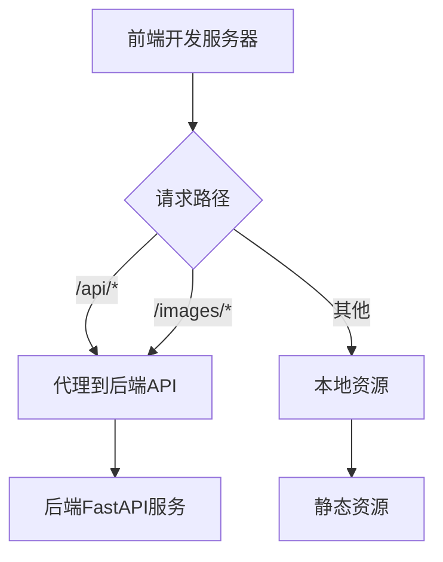
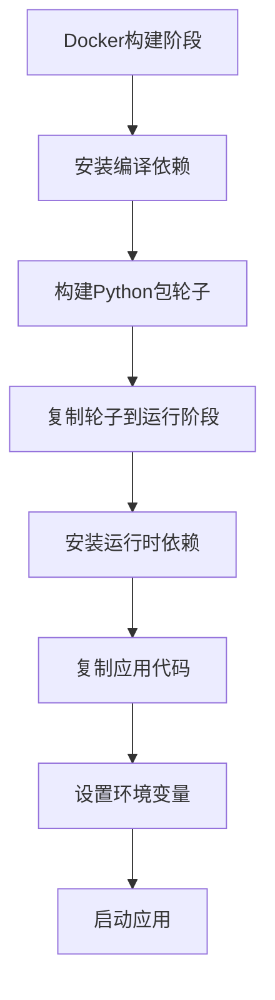
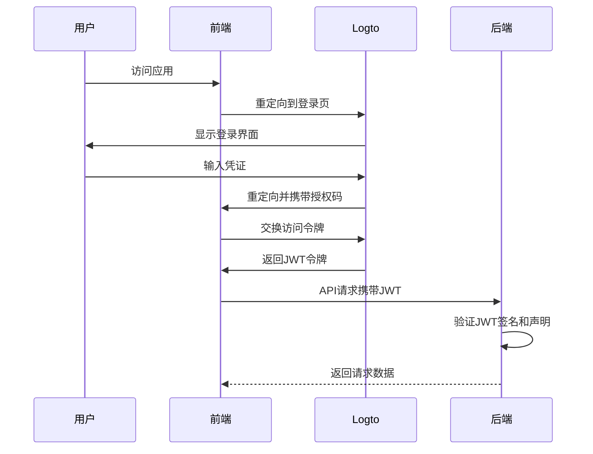

# 技术栈与依赖

<cite>
**本文档引用的文件**
- [requirements.txt](file://backend/requirements.txt)
- [package.json](file://frontend/package.json)
- [main.py](file://backend/main.py)
- [app.py](file://backend/src/service/app.py)
- [settings.py](file://backend/src/config/settings.py)
- [vite.config.js](file://frontend/vite.config.js)
- [Dockerfile](file://Dockerfile)
- [docker-compose.yml](file://docker-compose.yml)
- [api_routes.py](file://backend/src/routes/api_routes.py)
- [ccxt_broker.py](file://backend/src/brokers/ccxt_adapter/ccxt_broker.py)
- [ibkr_store.py](file://backend/src/brokers/ibkr_adapter/ibkr_store.py)
- [LogtoProvider.jsx](file://frontend/src/providers/LogtoProvider.jsx)
- [aiAnalysis.js](file://frontend/src/services/aiAnalysis.js)
</cite>

## 目录
1. [简介](#简介)
2. [后端技术栈](#后端技术栈)
3. [前端技术栈](#前端技术栈)
4. [依赖管理策略](#依赖管理策略)
5. [第三方服务集成](#第三方服务集成)
6. [环境搭建要求](#环境搭建要求)

## 简介
本系统是一个基于Python和JavaScript的量化交易分析平台，采用前后端分离架构。后端使用FastAPI构建RESTful API和WebSocket服务，以Backtrader为核心量化引擎，通过CCXT和Interactive Brokers (IBKR) API接入加密货币和传统金融市场。前端采用React框架，结合Vite构建工具和Ant Design组件库，提供现代化的用户界面。系统集成了Logto身份认证和OpenAI分析功能，支持多语言国际化。

## 后端技术栈

### FastAPI
FastAPI是本系统后端的核心框架，用于构建高性能的RESTful API和WebSocket服务。系统通过`src.service.app`模块创建FastAPI应用实例，并注册多个路由模块，包括API路由、AI分析路由、实盘交易路由和WebSocket路由。Daphne服务器用于处理WebSocket连接，支持实时交易数据推送。

**Section sources**
- [main.py](file://backend/main.py#L1-L21)
- [app.py](file://backend/src/service/app.py#L1-L31)
- [api_routes.py](file://backend/src/routes/api_routes.py#L1-L341)

### Backtrader
Backtrader作为量化策略的核心执行引擎，负责回测和实盘交易的执行。系统通过自定义的`CCXTBroker`和`IBKRStore`适配器，将Backtrader与外部交易所连接。在回测模式下，Backtrader加载历史数据并执行策略；在实盘模式下，它通过适配器将订单提交到实际交易所。

**Section sources**
- [ccxt_broker.py](file://backend/src/brokers/ccxt_adapter/ccxt_broker.py#L1-L545)
- [ibkr_store.py](file://backend/src/brokers/ibkr_adapter/ibkr_store.py#L1-L157)

### SQLAlchemy
SQLAlchemy作为ORM框架，用于管理系统的持久化数据存储。系统使用SQLAlchemy定义数据模型，并通过`BacktestStorage`类实现回测历史记录的存储和查询功能。数据库存储了回测配置、性能指标、策略代码快照和AI分析结果等重要信息。

**Section sources**
- [models.py](file://backend/src/db/models.py)
- [backtest_storage.py](file://backend/src/db/backtest_storage.py)

### CCXT
CCXT库用于接入加密货币交易所，支持Binance等主流平台。系统通过`ccxt_adapter`模块封装CCXT功能，实现订单提交、余额查询和市场数据获取。在纸面交易模式下，系统使用配置的初始资金；在实盘模式下，直接从交易所获取真实余额。

**Section sources**
- [ccxt_broker.py](file://backend/src/brokers/ccxt_adapter/ccxt_broker.py#L1-L545)
- [ccxt_store.py](file://backend/src/brokers/ccxt_adapter/ccxt_store.py)

### ibapi
Interactive Brokers的API（ibapi）用于接入传统金融市场。系统通过`ibkr_adapter`模块与IBKR的TWS（Trader Workstation）或网关建立连接，支持股票、期货等金融产品的交易。适配器处理连接管理、数据订阅和订单执行，为Backtrader提供市场数据和交易执行能力。

**Section sources**
- [ibkr_store.py](file://backend/src/brokers/ibkr_adapter/ibkr_store.py#L1-L157)

## 前端技术栈

### React
React是前端应用的核心框架，采用组件化架构构建用户界面。系统使用函数组件和Hooks管理状态，通过React Router实现页面路由。主要功能模块包括策略回测、实盘交易、策略维护和行走优化等，每个模块都由多个可复用的React组件构成。

**Section sources**
- [App.jsx](file://frontend/src/App.jsx)
- [main.jsx](file://frontend/src/main.jsx)

### Vite
Vite作为前端构建工具，提供快速的开发服务器和高效的生产构建。配置文件`vite.config.js`设置了API代理，将`/api`和`/images`请求转发到后端服务器（http://127.0.0.1:8000），解决了开发环境下的跨域问题。Vite的热模块替换功能显著提升了开发效率。

**Diagram sources**
- [vite.config.js](file://frontend/vite.config.js#L1-L24)

**Section sources**
- [vite.config.js](file://frontend/vite.config.js#L1-L24)

### i18next
i18next库实现系统的多语言支持，当前包含中文（zh）和英文（en）两种语言。系统通过`i18n.js`配置文件初始化i18next，使用`react-i18next`绑定React组件。语言资源文件存储在`locales`目录下，按功能模块组织，支持动态语言切换。

**Section sources**
- [i18n.js](file://frontend/src/i18n.js)
- [locales](file://frontend/src/locales)

### Ant Design
Ant Design作为UI组件库，提供了一致的视觉风格和丰富的交互组件。系统使用Ant Design的布局组件（Layout、Menu）、表单组件（Form、Input）和数据展示组件（Table、Chart）构建用户界面。结合`lightweight-charts`库，实现了专业的金融图表展示功能。

**Section sources**
- [Layout.jsx](file://frontend/src/components/Layout/Layout.jsx)
- [StrategyConfigForm.jsx](file://frontend/src/components/RunStrategy/StrategyConfigForm.jsx)

## 依赖管理策略

### 开发环境
开发环境通过`requirements.txt`和`package.json`分别管理Python和JavaScript依赖。后端依赖包括FastAPI、Backtrader、SQLAlchemy等核心库，前端依赖包括React、Vite、Ant Design等。开发人员通过`pip install -r requirements.txt`和`npm install`安装依赖。

**Section sources**
- [requirements.txt](file://backend/requirements.txt)
- [package.json](file://frontend/package.json)

### 测试环境
测试环境与开发环境共享依赖配置，但通过独立的配置文件（如`.env.test`）隔离环境变量。自动化测试脚本位于`auto_test`目录，使用Python的unittest框架验证核心功能，包括配置加载、会话管理和API路由。

**Section sources**
- [test_config_loader.py](file://auto_test/test_config_loader.py)
- [test_live_routes.py](file://auto_test/test_live_routes.py)

### 生产环境
生产环境采用Docker容器化部署，通过多阶段构建优化镜像大小。构建阶段使用`python:3.12-slim-bookworm`基础镜像安装编译依赖，运行阶段使用相同的基础镜像但仅安装运行时依赖，显著减小了最终镜像体积。Dockerfile中使用阿里云镜像加速依赖下载。

**Diagram sources**
- [Dockerfile](file://Dockerfile#L1-L78)

**Section sources**
- [Dockerfile](file://Dockerfile#L1-L78)
- [docker-compose.yml](file://docker-compose.yml#L1-L12)

## 第三方服务集成

### Logto认证
系统集成Logto作为身份认证服务，实现OAuth 2.0认证流程。前端通过`LogtoProvider`组件配置Logto应用信息，从环境变量读取`VITE_LOGTO_ENDPOINT`和`VITE_LOGTO_APP_ID`。后端验证JWT令牌的签发者和受众，确保请求的合法性。

**Diagram sources**
- [LogtoProvider.jsx](file://frontend/src/providers/LogtoProvider.jsx#L1-L34)
- [auth.py](file://backend/src/utils/auth.py)

**Section sources**
- [LogtoProvider.jsx](file://frontend/src/providers/LogtoProvider.jsx#L1-L34)
- [settings.py](file://backend/src/config/settings.py#L19-L28)

### OpenAI分析
系统集成OpenAI服务，提供策略代码分析和性能评估功能。前端通过`aiAnalysis.js`模块构建分析请求，将策略代码、性能指标和图表作为上下文发送到后端AI路由。后端使用OpenAI API生成分析报告，帮助用户优化交易策略。

**Section sources**
- [aiAnalysis.js](file://frontend/src/services/aiAnalysis.js#L1-L195)
- [ai_routes.py](file://backend/src/routes/ai_routes.py)

## 环境搭建要求

### Python版本
后端要求Python 3.12或更高版本，以确保与所有依赖库的兼容性。关键依赖库的版本要求如下：
- FastAPI >= 0.103.2
- Backtrader >= 1.9.78.123
- SQLAlchemy >= 2.0.0
- CCXT 最新版本
- ibapi >= 9.81.1

### JavaScript版本
前端要求Node.js 18或更高版本，以支持Vite 6和React 18的现代JavaScript特性。npm版本应为9或更高版本，以确保依赖解析的正确性。关键依赖库的版本要求如下：
- React >= 18.3.1
- Vite >= 6.0.5
- Ant Design >= 6.1.0
- i18next >= 25.7.2

### 环境变量配置
系统通过环境变量配置关键参数，包括数据库连接、API密钥和第三方服务配置。开发环境使用`.env.template`作为模板，生产环境使用`.env.prod`。敏感信息如API密钥不应硬编码在代码中，而应通过环境变量注入。

**Section sources**
- [.env.template](file://backend/.env.template)
- [.env.prod](file://backend/.env.prod)
- [settings.py](file://backend/src/config/settings.py#L17-L37)