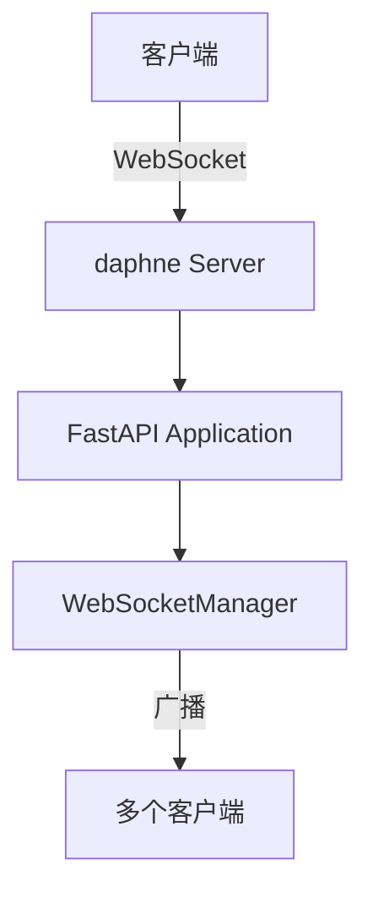

# 技术栈与依赖

<cite>
**本文档引用的文件**  
- [requirements.txt](file://backend/requirements.txt)
- [package.json](file://frontend/package.json)
- [Dockerfile](file://Dockerfile)
- [docker-compose.yml](file://docker-compose.yml)
- [main.py](file://backend/main.py)
- [app.py](file://backend/src/service/app.py)
- [websocket_routes.py](file://backend/src/routes/websocket_routes.py)
- [auth.py](file://backend/src/utils/auth.py)
- [LogtoProvider.jsx](file://frontend/src/providers/LogtoProvider.jsx)
- [vite.config.js](file://frontend/vite.config.js)
- [models.py](file://backend/src/db/models.py)
- [ccxt_broker.py](file://backend/src/brokers/ccxt_adapter/ccxt_broker.py)
- [ibkr_store.py](file://backend/src/brokers/ibkr_adapter/ibkr_store.py)
- [settings.py](file://backend/src/config/settings.py)
</cite>

## 目录
1. [后端技术栈](#后端技术栈)
2. [前端技术栈](#前端技术栈)
3. [基础设施](#基础设施)
4. [外部服务](#外部服务)
5. [关键依赖分析](#关键依赖分析)
6. [替代技术指导原则](#替代技术指导原则)

## 后端技术栈

后端技术栈以Python为核心，采用现代化的异步Web框架和数据处理库，构建了一个高性能、可扩展的量化回测与实盘交易系统。

### FastAPI (REST API构建)

FastAPI是本项目后端的核心Web框架，负责提供RESTful API接口。它基于Python的类型提示和Starlette框架，提供了极高的性能和开发效率。

- **作用**：作为主要的API服务器，处理来自前端的所有HTTP请求，包括策略回测、实盘交易控制、账户设置、AI分析等。
- **版本要求**：`fastapi>=0.124.4`
- **特性**：
  - 自动生成OpenAPI和JSON Schema文档
  - 内置数据验证和序列化（通过Pydantic）
  - 支持异步处理，提高I/O密集型操作的性能
  - 与Daphne集成，支持WebSocket通信

FastAPI通过模块化路由系统组织API，将不同功能的接口分散在`src/routes/`目录下的多个文件中，如`api_routes.py`、`live_routes.py`、`ai_routes.py`等，通过`app.include_router()`方法进行集成。

**Section sources**
- [app.py](file://backend/src/service/app.py#L21-L45)
- [api.py](file://backend/api.py)

### Backtrader (回测引擎核心)

Backtrader是本项目的核心量化回测引擎，负责执行策略代码、管理交易、计算指标和生成分析报告。

- **作用**：提供完整的回测环境，支持技术指标计算、订单执行、风险管理、绩效分析等功能。
- **版本要求**：`backtrader>=1.9.78.123`
- **集成方式**：通过自定义的Broker和Store适配器，将Backtrader与外部交易系统（如CCXT、IBKR）连接，实现从回测到实盘的无缝过渡。

项目通过`src/service/backtest_engine.py`和`src/service/live_engine.py`封装了Backtrader的复杂性，为上层应用提供简洁的接口。

**Section sources**
- [backtest_engine.py](file://backend/src/service/backtest_engine.py)
- [live_engine.py](file://backend/src/service/live_engine.py)

### SQLAlchemy (ORM数据访问)

SQLAlchemy是Python中最流行的ORM（对象关系映射）工具，用于管理与数据库的交互。

- **作用**：提供类型安全的数据库操作，将Python对象映射到数据库表，简化数据持久化逻辑。
- **版本要求**：`SQLAlchemy>=2.0.45`
- **应用**：在`src/db/models.py`中定义了所有数据库模型，包括回测历史、实盘交易会话、订单、持仓、市场数据等。通过`init_database()`函数初始化数据库连接和表结构。

项目使用SQLite作为默认数据库，但通过SQLAlchemy的抽象层，可以轻松切换到PostgreSQL、MySQL等其他关系型数据库。

**Section sources**
- [models.py](file://backend/src/db/models.py#L244-L280)
- [datasource.py](file://backend/src/db/datasource.py)

### CCXT (加密货币交易)

CCXT是一个统一的加密货币交易API库，支持超过100家交易所。

- **作用**：作为与加密货币交易所通信的桥梁，提供统一的接口来获取市场数据、提交订单、查询账户信息。
- **版本要求**：`ccxt>=4.5.28`
- **集成**：在`src/brokers/ccxt_adapter/`目录下实现了`CCXTStore`和`CCXTBroker`，将CCXT的功能封装成Backtrader兼容的组件，使策略代码无需关心底层交易所的差异。

**Section sources**
- [ccxt_store.py](file://backend/src/brokers/ccxt_adapter/ccxt_store.py)
- [ccxt_broker.py](file://backend/src/brokers/ccxt_adapter/ccxt_broker.py)

### IB API (传统证券)

Interactive Brokers (IB) API用于连接传统金融市场，如股票、期货、外汇等。

- **作用**：提供与IBKR（盈透证券）交易平台的连接，实现股票等传统金融产品的实盘交易。
- **版本要求**：`ibapi>=9.81.1`
- **集成**：在`src/brokers/ibkr_adapter/`目录下实现了`IBKRStore`，封装了IBStore的初始化和连接逻辑，使其与CCXT适配器具有相似的使用模式。

**Section sources**
- [ibkr_store.py](file://backend/src/brokers/ibkr_adapter/ibkr_store.py)

## 前端技术栈

前端技术栈采用现代JavaScript生态，提供流畅的用户体验和强大的交互功能。

### React 18.3

React是本项目前端的UI框架，负责构建用户界面。

- **作用**：作为组件化UI框架，管理应用的状态和视图更新。
- **版本要求**：`react@18.3.1`, `react-dom@18.3.1`
- **应用**：整个前端应用由多个React组件构成，如`StrategyMaintain.jsx`、`RunStrategy.jsx`、`LiveTradingDashboard.jsx`等，通过`react-router-dom`进行路由管理。

**Section sources**
- [App.jsx](file://frontend/src/App.jsx)
- [main.jsx](file://frontend/src/main.jsx)

### Vite (构建工具)

Vite是一个现代化的前端构建工具，提供极快的开发服务器启动和热更新。

- **作用**：作为开发服务器和生产构建工具，替代传统的Webpack。
- **版本要求**：`vite@6.0.5`
- **配置**：在`vite.config.js`中配置了代理，将`/api`前缀的请求转发到后端的FastAPI服务器（`http://127.0.0.1:8000`），解决了开发环境下的跨域问题。

**Section sources**
- [vite.config.js](file://frontend/vite.config.js)

### Ant Design 6.1 (UI组件库)

Ant Design是企业级UI设计语言和React组件库。

- **作用**：提供高质量的UI组件，如表格、表单、模态框、通知等，加速开发并保证视觉一致性。
- **版本要求**：`antd@6.1.0`
- **应用**：在`src/components/`目录下广泛使用，如`StrategyConfigForm.jsx`、`DataSourceConfigForm.jsx`等表单组件。

**Section sources**
- [StrategyConfigForm.jsx](file://frontend/src/components/RunStrategy/StrategyConfigForm.jsx)
- [DataSourceConfigForm.jsx](file://frontend/src/components/DataSource/DataSourceConfigForm.jsx)

### Monaco Editor (代码编辑)

Monaco Editor是VS Code使用的代码编辑器。

- **作用**：在浏览器中提供类似IDE的代码编辑体验，支持语法高亮、智能提示、错误检查。
- **版本要求**：`@monaco-editor/react@4.6.0`, `monaco-editor@0.52.0`
- **应用**：在`StrategyEditorPanel.jsx`中集成，用于编辑和调试量化交易策略代码。

**Section sources**
- [StrategyEditorPanel.jsx](file://frontend/src/components/StrategyMaintain/StrategyEditorPanel.jsx)

### Lightweight Charts (数据可视化)

Lightweight Charts是由TradingView开发的轻量级金融图表库。

- **作用**：显示K线图、技术指标、交易信号等，提供流畅的交互体验。
- **版本要求**：`lightweight-charts@4.2.2`
- **应用**：在`CandleStickChart.jsx`和`StrategyPlot.jsx`中使用，展示回测结果和实时行情。

**Section sources**
- [CandleStickChart.jsx](file://frontend/src/components/DataSource/CandleStickChart.jsx)
- [StrategyPlot.jsx](file://frontend/src/components/RunStrategy/StrategyPlot.jsx)

## 基础设施

基础设施采用容器化技术，确保开发、测试和生产环境的一致性。

### Docker

Docker用于将应用及其依赖打包成一个可移植的容器镜像。

- **作用**：实现环境隔离，避免“在我机器上能运行”的问题。
- **配置**：`Dockerfile`采用多阶段构建（multi-stage build）：
  - **构建阶段**：安装编译依赖，使用`pip wheel`预编译所有Python依赖为wheel文件。
  - **运行阶段**：仅安装运行时依赖，从构建阶段复制预编译的wheel文件进行安装，大大缩短部署时间并减少镜像体积。

**Section sources**
- [Dockerfile](file://Dockerfile)

### Docker Compose

Docker Compose用于定义和运行多容器Docker应用。

- **作用**：简化多服务应用的编排，本项目中用于启动后端应用容器。
- **配置**：`docker-compose.yml`定义了一个名为`app`的服务，构建当前目录（包含Dockerfile），并将容器的8000端口映射到主机的8020端口。

**Section sources**
- [docker-compose.yml](file://docker-compose.yml)

## 外部服务

项目集成了多个外部服务，扩展了核心功能。

### OpenAI API (AI分析)

OpenAI API用于提供人工智能驱动的策略分析。

- **作用**：对交易策略进行智能分析，生成改进建议，帮助用户理解策略的优缺点。
- **集成**：在`src/service/app.py`中通过`ai_routes.py`提供API接口，在`src/utils/auth.py`中处理认证。前端通过`aiAnalysis.js`调用后端API。
- **配置**：API密钥通过环境变量`OPENAI_API_KEY`注入，支持自定义API基础URL（`OPENAI_BASE_URL`），便于使用兼容OpenAI API的第三方服务。

**Section sources**
- [ai_routes.py](file://backend/src/routes/ai_routes.py)
- [aiAnalysis.js](file://frontend/src/services/aiAnalysis.js)
- [settings.py](file://backend/src/config/settings.py#L32-L33)

### Logto (认证授权)

Logto是一个开源的身份认证和访问管理平台。

- **作用**：提供OAuth 2.0和OpenID Connect认证，管理用户登录和权限。
- **集成**：
  - **后端**：在`src/utils/auth.py`中实现，通过`python-jose`库验证JWT令牌，从Logto的JWKS端点获取公钥。
  - **前端**：在`LogtoProvider.jsx`中使用`@logto/react` SDK，封装认证流程，提供`useAuth`等Hook。
- **配置**：通过环境变量（如`LOGTO_ISSUER`、`LOGTO_JWKS_URI`）或数据库配置进行设置。

**Section sources**
- [auth.py](file://backend/src/utils/auth.py)
- [LogtoProvider.jsx](file://frontend/src/providers/LogtoProvider.jsx)

## 关键依赖分析

从`requirements.txt`和`package.json`中提取的关键依赖及其必要性分析。

### daphne (ASGI服务器)

daphne是Django Channels的ASGI服务器，但也可用于任何ASGI应用，包括FastAPI。

- **必要性**：FastAPI默认使用`uvicorn`，但本项目选择`daphne`是因为它原生支持WebSocket协议，且与Channels的集成更成熟。在`main.py`中，通过`daphne.server.Server`启动服务器，明确配置了WebSocket端点。
- **版本要求**：`daphne>=4.2.1`

**Diagram sources**
- [main.py](file://backend/main.py#L3)
- [websocket_routes.py](file://backend/src/routes/websocket_routes.py)
- [websocket_manager.py](file://backend/src/service/websocket_manager.py)

**Section sources**
- [main.py](file://backend/main.py#L1-L32)
- [requirements.txt](file://backend/requirements.txt#L2)

### 其他关键依赖

- **pydantic**：`pydantic>=2.12.5,<3.0.0`，FastAPI的依赖，用于数据验证和设置管理。
- **python-jose[cryptography]**：`python-jose[cryptography]>=3.3.0`，用于JWT令牌的解码和验证，是Logto认证的核心。
- **websockets**：`websockets>=15.0.1`，支持WebSocket通信的底层库。
- **aiohttp**：`aiohttp>=3.13.2`，异步HTTP客户端，用于与外部API通信。

## 替代技术指导原则

为开发者提供选择替代技术的指导原则，以及各技术选型的优势和潜在限制。

### 后端替代方案

| 原技术 | 替代方案 | 指导原则 |
| :--- | :--- | :--- |
| FastAPI | Flask, Django | 若项目复杂度较低，可选择更轻量的Flask；若需要完整的MVC框架，可选择Django。 |
| daphne | uvicorn, hypercorn | `uvicorn`是FastAPI的官方推荐服务器，性能优异；`hypercorn`支持HTTP/3。 |
| SQLite | PostgreSQL, MySQL | 当数据量增大或需要多用户并发访问时，应迁移到更强大的数据库。 |

### 前端替代方案

| 原技术 | 替代方案 | 指导原则 |
| :--- | :--- | :--- |
| Vite | Webpack, Parcel | Vite是首选，因其启动速度快。若需更复杂的构建配置，可考虑Webpack。 |
| Ant Design | Material UI, Element Plus | 根据设计风格选择。Material UI更符合Google设计规范，Element Plus更接近Ant Design。 |
| Lightweight Charts | Chart.js, ECharts | 若需要更丰富的图表类型，可选择ECharts；若追求极简，可选择Chart.js。 |

### 优势与限制

- **优势**：
  - **全栈现代化**：前后端均采用当前主流技术，社区活跃，文档丰富。
  - **高性能**：FastAPI和Vite提供极快的响应速度。
  - **可扩展性**：模块化设计和容器化部署，便于横向扩展。
  - **安全性**：通过Logto实现标准化的认证授权。

- **潜在限制**：
  - **学习曲线**：技术栈较新，团队成员可能需要时间适应。
  - **依赖复杂性**：多阶段Docker构建和复杂的依赖管理可能增加运维难度。
  - **成本**：OpenAI API调用可能产生较高的云服务费用。