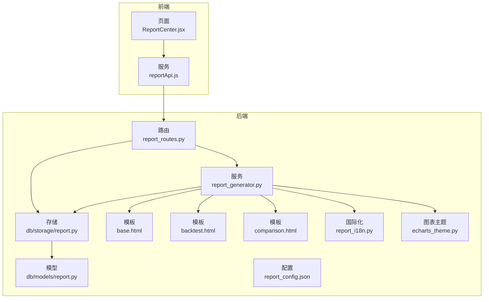
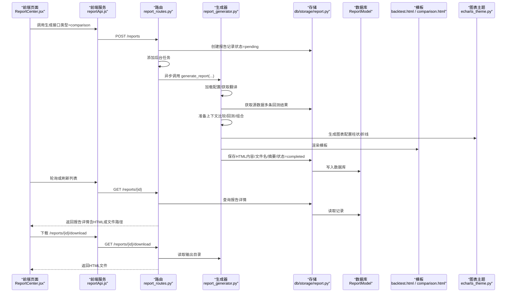
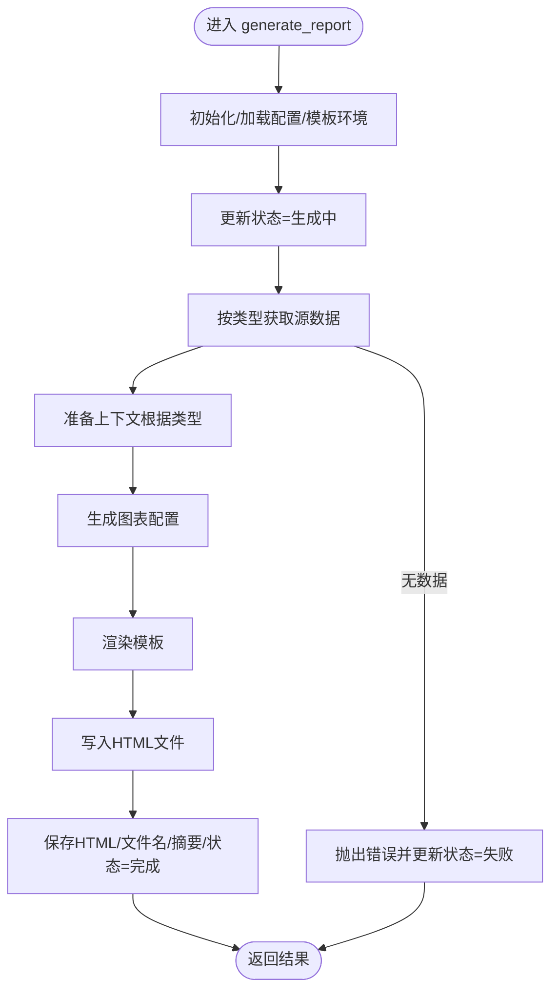
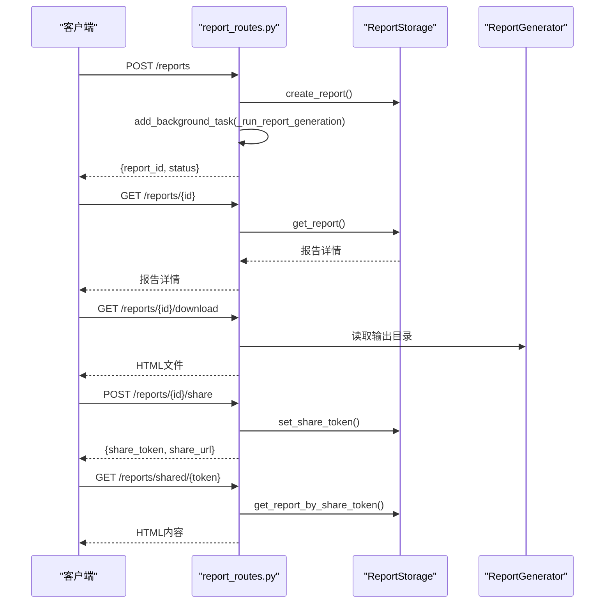
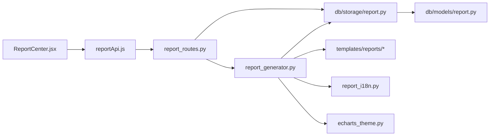

# 报告生成

<cite>
**本文引用的文件**
- [report_generator.py](file://backend/src/service/report_generator.py)
- [report_routes.py](file://backend/src/routes/report_routes.py)
- [report.py（存储层）](file://backend/src/db/storage/report.py)
- [report.py（模型）](file://backend/src/db/models/report.py)
- [base.html（模板基线）](file://backend/resources/templates/reports/base.html)
- [backtest.html（模板）](file://backend/resources/templates/reports/backtest.html)
- [comparison.html（模板）](file://backend/resources/templates/reports/comparison.html)
- [report_config.json（配置）](file://backend/resources/config/report_config.json)
- [report_i18n.py（国际化）](file://backend/src/utils/report_i18n.py)
- [echarts_theme.py（图表主题）](file://backend/src/service/echarts_theme.py)
- [ReportCenter.jsx（前端页面）](file://frontend/src/pages/ReportCenter.jsx)
- [reportApi.js（前端服务）](file://frontend/src/services/reportApi.js)
- [test_report_generator.py（单元测试）](file://backend/tests/service/test_report_generator.py)
</cite>

## 目录
1. [简介](#简介)
2. [项目结构](#项目结构)
3. [核心组件](#核心组件)
4. [架构总览](#架构总览)
5. [详细组件分析](#详细组件分析)
6. [依赖关系分析](#依赖关系分析)
7. [性能考量](#性能考量)
8. [故障排查指南](#故障排查指南)
9. [结论](#结论)
10. [附录](#附录)

## 简介
本文件聚焦“报告生成”功能，覆盖从后端服务到前端展示的完整链路，包括：
- 报告类型与模板体系：单回测、组合回测、滚动优化、对比报告
- 生成流程：异步后台任务、进度回调、状态持久化、HTML 文件落盘与数据库缓存
- 模板渲染：Jinja2 模板、ECharts 图表配置、国际化文案
- 前端集成：列表、下载、分享链接、公共访问
- 错误处理与可观测性：状态更新、错误消息、日志记录

## 项目结构
围绕报告生成的关键目录与文件如下：
- 后端服务
  - 路由：/reports（生成、查询、删除、下载、分享）
  - 服务：ReportGenerator（模板渲染、图表配置、文件保存）
  - 存储：ReportStorage（数据库读写、分享令牌）
  - 模型：ReportModel（数据库表结构）
  - 模板：base.html、backtest.html、comparison.html
  - 工具：report_i18n、echarts_theme
  - 配置：report_config.json
- 前端
  - 页面：ReportCenter.jsx
  - 服务：reportApi.js
  - 测试：test_report_generator.py



图表来源
- [report_routes.py](file://backend/src/routes/report_routes.py#L1-L391)
- [report_generator.py](file://backend/src/service/report_generator.py#L1-L672)
- [report.py（存储层）](file://backend/src/db/storage/report.py#L1-L509)
- [report.py（模型）](file://backend/src/db/models/report.py#L1-L106)
- [base.html](file://backend/resources/templates/reports/base.html#L1-L743)
- [backtest.html](file://backend/resources/templates/reports/backtest.html#L1-L397)
- [comparison.html](file://backend/resources/templates/reports/comparison.html#L1-L265)
- [report_config.json](file://backend/resources/config/report_config.json#L1-L32)
- [report_i18n.py](file://backend/src/utils/report_i18n.py#L1-L246)
- [echarts_theme.py](file://backend/src/service/echarts_theme.py#L1-L245)
- [ReportCenter.jsx](file://frontend/src/pages/ReportCenter.jsx#L1-L373)
- [reportApi.js](file://frontend/src/services/reportApi.js#L1-L125)

章节来源
- [report_routes.py](file://backend/src/routes/report_routes.py#L1-L391)
- [report_generator.py](file://backend/src/service/report_generator.py#L1-L672)
- [report.py（存储层）](file://backend/src/db/storage/report.py#L1-L509)
- [report.py（模型）](file://backend/src/db/models/report.py#L1-L106)
- [base.html](file://backend/resources/templates/reports/base.html#L1-L743)
- [backtest.html](file://backend/resources/templates/reports/backtest.html#L1-L397)
- [comparison.html](file://backend/resources/templates/reports/comparison.html#L1-L265)
- [report_config.json](file://backend/resources/config/report_config.json#L1-L32)
- [report_i18n.py](file://backend/src/utils/report_i18n.py#L1-L246)
- [echarts_theme.py](file://backend/src/service/echarts_theme.py#L1-L245)
- [ReportCenter.jsx](file://frontend/src/pages/ReportCenter.jsx#L1-L373)
- [reportApi.js](file://frontend/src/services/reportApi.js#L1-L125)

## 核心组件
- 报告生成器（ReportGenerator）
  - 负责：加载配置、准备上下文、渲染模板、生成图表配置、保存文件与数据库、状态管理
  - 关键方法：generate_report、_prepare_*_context、_add_chart_configs、_embed_image_as_base64
- 报告路由（report_routes.py）
  - 负责：接收请求、创建报告记录、启动后台任务、提供列表/详情/下载/分享接口
- 报告存储（ReportStorage）
  - 负责：创建/查询/更新状态/保存内容/设置分享令牌/删除报告
- 报告模型（ReportModel）
  - 负责：定义数据库字段、枚举状态与类型
- 模板与主题
  - base.html 提供统一布局与样式；backtest.html、comparison.html 定义各类型报告的结构
  - echarts_theme 提供图表主题与通用配置
- 国际化（report_i18n）
  - 提供中英文翻译字典与本地化名称映射
- 前端页面与服务
  - ReportCenter.jsx 展示报告列表、操作按钮、分享弹窗
  - reportApi.js 封装生成、列表、下载、分享等 API

章节来源
- [report_generator.py](file://backend/src/service/report_generator.py#L1-L672)
- [report_routes.py](file://backend/src/routes/report_routes.py#L1-L391)
- [report.py（存储层）](file://backend/src/db/storage/report.py#L1-L509)
- [report.py（模型）](file://backend/src/db/models/report.py#L1-L106)
- [report_i18n.py](file://backend/src/utils/report_i18n.py#L1-L246)
- [echarts_theme.py](file://backend/src/service/echarts_theme.py#L1-L245)
- [ReportCenter.jsx](file://frontend/src/pages/ReportCenter.jsx#L1-L373)
- [reportApi.js](file://frontend/src/services/reportApi.js#L1-L125)

## 架构总览
下面以序列图展示一次“生成对比报告”的典型流程。



图表来源
- [report_routes.py](file://backend/src/routes/report_routes.py#L137-L201)
- [report_generator.py](file://backend/src/service/report_generator.py#L84-L206)
- [report.py（存储层）](file://backend/src/db/storage/report.py#L37-L119)
- [report.py（模型）](file://backend/src/db/models/report.py#L18-L105)
- [backtest.html](file://backend/resources/templates/reports/backtest.html#L1-L397)
- [comparison.html](file://backend/resources/templates/reports/comparison.html#L1-L265)
- [echarts_theme.py](file://backend/src/service/echarts_theme.py#L118-L231)
- [ReportCenter.jsx](file://frontend/src/pages/ReportCenter.jsx#L1-L373)
- [reportApi.js](file://frontend/src/services/reportApi.js#L1-L125)

## 详细组件分析

### 报告生成器（ReportGenerator）
- 初始化与配置
  - 读取 report_config.json 并解析输出目录（支持相对路径相对于项目根）
  - 初始化 Jinja2 模板环境，注册自定义过滤器
  - 实例化 Backtest/Portfolio/WalkForward/Report 存储
- 生成主流程
  - 更新状态为“生成中”，可选进度回调
  - 按 report_type 选择源数据来源（回测/组合/滚动优化）
  - 选择模板并准备上下文（根据语言注入翻译）
  - 生成图表配置（资金曲线、对比柱状图等）
  - 渲染模板为 HTML，写入输出目录，保存到数据库
  - 成功后返回 report_id、文件名、摘要指标
- 上下文准备
  - 单回测：计算胜率、组织概览/图表/交易/参数/深度分析/AI分析等分栏
  - 组合回测：复用回测模板，标题与标的列表不同
  - 滚动优化：组织窗口数、训练/测试表现、退化程度等
  - 对比报告：聚合多结果，计算最佳回报、最佳夏普、最低最大回撤、最佳胜率，并统计均值/标准差/极值/中位数
- 图表构建
  - 使用 echarts_theme 的主题常量与组件配置，保证暗色主题一致性
  - 资金曲线折线图、对比柱状图等
- 图片嵌入
  - 将图片文件转为 base64 数据 URL，内嵌至 HTML，便于独立查看
- 错误处理
  - 捕获异常并更新状态为失败，记录错误信息



图表来源
- [report_generator.py](file://backend/src/service/report_generator.py#L84-L206)
- [report_generator.py](file://backend/src/service/report_generator.py#L207-L232)
- [report_generator.py](file://backend/src/service/report_generator.py#L234-L444)
- [report_generator.py](file://backend/src/service/report_generator.py#L599-L634)
- [report_generator.py](file://backend/src/service/report_generator.py#L636-L671)

章节来源
- [report_generator.py](file://backend/src/service/report_generator.py#L1-L672)

### 报告路由（report_routes.py）
- 生成接口
  - 校验 report_type 与 source_ids
  - 创建报告记录（状态=pending），异步启动后台任务
  - 返回 report_id 与初始状态
- 列表/详情/删除
  - 支持按类型/状态/时间范围筛选与分页
  - 详情包含 HTML 或从文件读取
- 下载接口
  - 仅已完成报告可下载；从配置的输出目录读取文件并返回
- 分享接口
  - 生成带过期时间的签名令牌，保存到数据库
  - 公共访问 /reports/shared/{token} 可直接返回 HTML



图表来源
- [report_routes.py](file://backend/src/routes/report_routes.py#L137-L201)
- [report_routes.py](file://backend/src/routes/report_routes.py#L203-L235)
- [report_routes.py](file://backend/src/routes/report_routes.py#L240-L278)
- [report_routes.py](file://backend/src/routes/report_routes.py#L283-L345)
- [report_routes.py](file://backend/src/routes/report_routes.py#L350-L391)

章节来源
- [report_routes.py](file://backend/src/routes/report_routes.py#L1-L391)

### 报告存储（ReportStorage）
- 功能点
  - 创建报告记录（状态=pending，进度=0）
  - 更新状态/进度/错误信息；完成后写入 completed_at
  - 保存 HTML 内容、文件名、摘要指标
  - 设置/清除分享令牌及过期时间
  - 删除报告并清理磁盘文件
  - 列表查询、排序、分页、过滤
- 设计要点
  - 通过 managed_session 管理事务
  - 支持用户维度过滤
  - 最大保留数量限制（每用户最多100条）

章节来源
- [report.py（存储层）](file://backend/src/db/storage/report.py#L1-L509)

### 报告模型（ReportModel）
- 字段说明
  - report_id、report_type、title、description
  - source_ids（JSON数组）、source_type
  - status、progress、error_message、created_at、completed_at
  - user_id、config（JSON）
  - html_content、html_filename
  - share_token、share_expires_at
  - metrics_summary（JSON）
- 枚举
  - ReportStatus：pending/generating/completed/failed
  - ReportType：backtest/portfolio/walkforward/comparison

章节来源
- [report.py（模型）](file://backend/src/db/models/report.py#L1-L106)

### 模板与国际化
- base.html
  - 提供统一布局、暗色主题样式、ECharts 初始化逻辑、标签页切换脚本
- backtest.html
  - 概览（总收益、夏普、最大回撤、交易数、胜率、盈亏比、SQN、年度收益）
  - 图表（资金曲线、回撤、策略图）
  - 交易明细（前50条）
  - 参数配置与策略参数
  - 深度分析与 AI 分析（可选）
- comparison.html
  - 概览表格、最佳表现指标、图表（累计收益/指标对比/回撤对比）
  - 详细卡片网格、相关矩阵可视化（可选）
  - 统计摘要（均值/标准差/最小/最大/中位数）
- report_i18n.py
  - 英/中双语翻译字典，支持报告类型名称本地化
- echarts_theme.py
  - 主题颜色与组件配置（tooltip、坐标轴、网格、缩放、系列样式）
  - equity_chart 与 comparison_bar_chart 构建函数

章节来源
- [base.html](file://backend/resources/templates/reports/base.html#L1-L743)
- [backtest.html](file://backend/resources/templates/reports/backtest.html#L1-L397)
- [comparison.html](file://backend/resources/templates/reports/comparison.html#L1-L265)
- [report_i18n.py](file://backend/src/utils/report_i18n.py#L1-L246)
- [echarts_theme.py](file://backend/src/service/echarts_theme.py#L1-L245)

### 前端集成
- ReportCenter.jsx
  - 列表：类型/状态筛选、分页、进度条、错误提示
  - 操作：查看（占位）、下载、分享、删除
  - 分享弹窗：生成/撤销分享链接
- reportApi.js
  - 生成、列表、详情、删除、下载、分享、公共访问

章节来源
- [ReportCenter.jsx](file://frontend/src/pages/ReportCenter.jsx#L1-L373)
- [reportApi.js](file://frontend/src/services/reportApi.js#L1-L125)

## 依赖关系分析
- 组件耦合
  - ReportRoutes 依赖 ReportStorage 与 ReportGenerator
  - ReportGenerator 依赖 ReportStorage（源数据）、模板引擎、国际化、图表主题
  - ReportStorage 依赖 SQLAlchemy 模型与数据库连接
- 外部依赖
  - Jinja2（模板渲染）
  - ECharts（图表）
  - FastAPI（路由与响应）
  - SQLAlchemy（ORM）
- 循环依赖
  - 未发现循环导入；模块职责清晰



图表来源
- [report_routes.py](file://backend/src/routes/report_routes.py#L1-L391)
- [report_generator.py](file://backend/src/service/report_generator.py#L1-L672)
- [report.py（存储层）](file://backend/src/db/storage/report.py#L1-L509)
- [report.py（模型）](file://backend/src/db/models/report.py#L1-L106)
- [report_i18n.py](file://backend/src/utils/report_i18n.py#L1-L246)
- [echarts_theme.py](file://backend/src/service/echarts_theme.py#L1-L245)
- [ReportCenter.jsx](file://frontend/src/pages/ReportCenter.jsx#L1-L373)
- [reportApi.js](file://frontend/src/services/reportApi.js#L1-L125)

章节来源
- [report_routes.py](file://backend/src/routes/report_routes.py#L1-L391)
- [report_generator.py](file://backend/src/service/report_generator.py#L1-L672)
- [report.py（存储层）](file://backend/src/db/storage/report.py#L1-L509)
- [report.py（模型）](file://backend/src/db/models/report.py#L1-L106)
- [report_i18n.py](file://backend/src/utils/report_i18n.py#L1-L246)
- [echarts_theme.py](file://backend/src/service/echarts_theme.py#L1-L245)
- [ReportCenter.jsx](file://frontend/src/pages/ReportCenter.jsx#L1-L373)
- [reportApi.js](file://frontend/src/services/reportApi.js#L1-L125)

## 性能考量
- 模板渲染
  - 使用 Jinja2 FileSystemLoader，建议将模板目录置于内存盘或SSD以降低I/O
  - 图表配置在内存中生成，避免重复计算
- 数据读取
  - 源数据按需拉取，避免一次性加载过多
  - 对交易明细限制前50条，控制前端渲染压力
- 文件写入
  - 输出目录可配置；建议使用高性能存储并开启同步策略
- 并发与后台任务
  - 生成过程异步执行，避免阻塞主线程
  - 进度回调用于前端反馈，减少轮询频率
- 图表与图片
  - 图片转为 base64 内嵌，HTML 独立可读；但会增大文件体积，建议在需要离线查看时启用

[本节为通用指导，不直接分析具体文件]

## 故障排查指南
- 常见问题
  - 生成失败：检查后台任务日志，确认状态是否更新为失败并记录错误信息
  - 无源数据：确保 source_ids 对应的记录存在且未被删除
  - 下载失败：确认报告状态为已完成，输出目录文件是否存在
  - 分享链接无效：确认令牌未过期，数据库中 share_token 是否存在
- 排查步骤
  - 后端
    - 查看路由层返回的状态码与错误信息
    - 检查 ReportStorage 的 update_status/save_content 是否成功
    - 确认模板渲染是否抛错
  - 前端
    - 使用 reportApi 的错误提示与网络面板定位问题
    - 分享链接访问失败时，确认公共接口已正确返回 HTML

章节来源
- [report_routes.py](file://backend/src/routes/report_routes.py#L137-L201)
- [report.py（存储层）](file://backend/src/db/storage/report.py#L221-L325)
- [report_generator.py](file://backend/src/service/report_generator.py#L197-L206)
- [reportApi.js](file://frontend/src/services/reportApi.js#L1-L125)

## 结论
报告生成功能以“模板驱动 + 图表主题 + 异步生成 + 数据持久化”为核心设计，具备以下特点：
- 易扩展：新增报告类型只需新增模板与上下文准备逻辑
- 可观测：状态机与进度回调贯穿全流程
- 可分享：基于令牌的公开访问机制
- 可维护：前后端职责清晰，单元测试覆盖关键路径

[本节为总结性内容，不直接分析具体文件]

## 附录

### 报告类型与模板映射
- backtest.html：单回测/组合回测
- comparison.html：对比报告
- base.html：通用布局与样式

章节来源
- [backtest.html](file://backend/resources/templates/reports/backtest.html#L1-L397)
- [comparison.html](file://backend/resources/templates/reports/comparison.html#L1-L265)
- [base.html](file://backend/resources/templates/reports/base.html#L1-L743)

### 配置项说明（report_config.json）
- report.output_directory：报告输出目录（相对路径基于项目根）
- report.default_format/supported_formats：默认与支持格式（当前模板为 HTML）
- templates.*：模板文件映射（当前模板为 backtest.html、portfolio.html、walkforward.html）
- export.pdf.*：PDF 导出配置（当前模板未实现 PDF）

章节来源
- [report_config.json](file://backend/resources/config/report_config.json#L1-L32)

### 关键类关系图
```mermaid
classDiagram
class ReportRoutes {
+POST /reports
+GET /reports
+DELETE /reports/{id}
+GET /reports/{id}/download
+POST/DELETE /reports/{id}/share
+GET /reports/shared/{token}
}
class ReportGenerator {
+generate_report(...)
+_prepare_*_context(...)
+_add_chart_configs(...)
+_embed_image_as_base64(...)
}
class ReportStorage {
+create_report(...)
+get_report(...)
+update_status(...)
+save_content(...)
+set_share_token(...)
+clear_share_token(...)
+delete_report(...)
}
class ReportModel {
+report_id
+report_type
+status
+progress
+html_content
+html_filename
+share_token
+metrics_summary
}
ReportRoutes --> ReportStorage : "读写"
ReportRoutes --> ReportGenerator : "调用"
ReportGenerator --> ReportStorage : "读取源数据/保存"
ReportStorage --> ReportModel : "ORM"
```

图表来源
- [report_routes.py](file://backend/src/routes/report_routes.py#L1-L391)
- [report_generator.py](file://backend/src/service/report_generator.py#L1-L672)
- [report.py（存储层）](file://backend/src/db/storage/report.py#L1-L509)
- [report.py（模型）](file://backend/src/db/models/report.py#L1-L106)

### 单元测试要点（test_report_generator.py）
- 生成回测报告：验证状态更新、文件保存、模板渲染
- 生成对比报告：验证多结果聚合、最佳指标计算、统计摘要
- 进度回调：验证生成过程中的进度推进
- 错误处理：验证异常捕获与失败状态更新
- 图像嵌入：验证 base64 内嵌与缺失图像处理
- 单例模式：验证 get_report_generator 返回同一实例

章节来源
- [test_report_generator.py](file://backend/tests/service/test_report_generator.py#L1-L372)