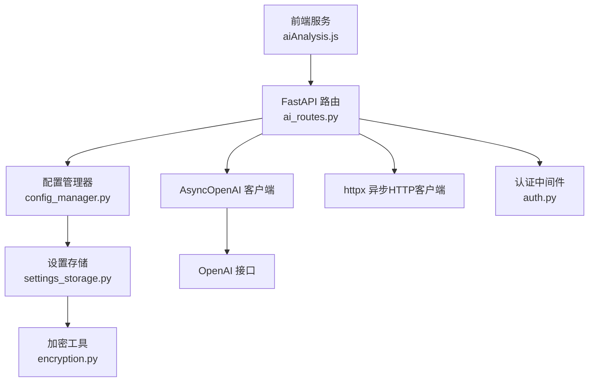
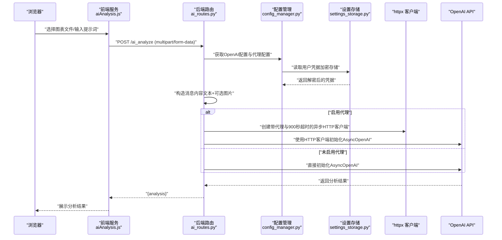
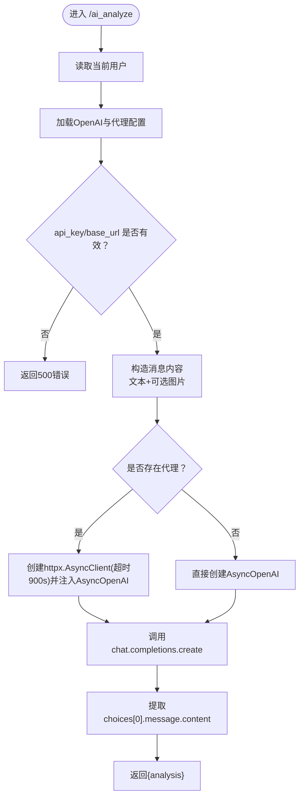
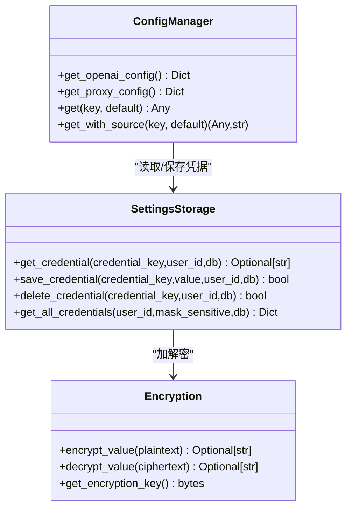
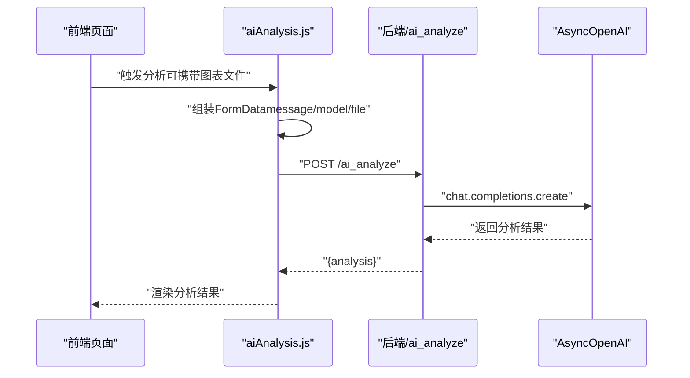
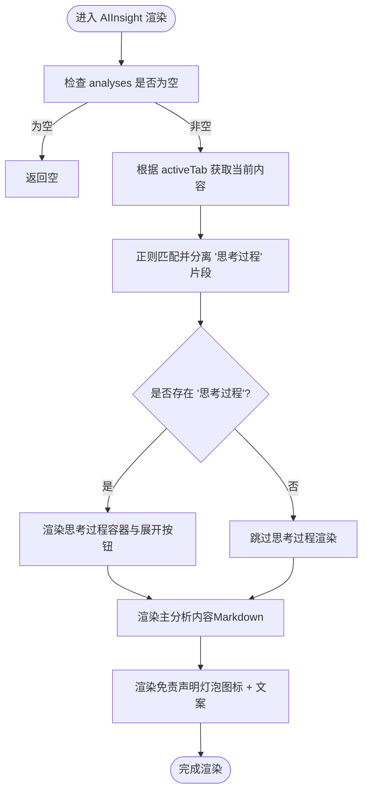
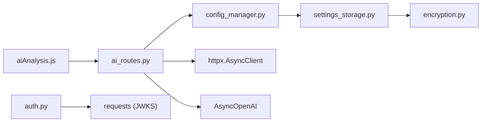

# AI分析API集成

<cite>
**本文引用的文件**
- [ai_routes.py](file://backend/src/routes/ai_routes.py)
- [config_manager.py](file://backend/src/config/config_manager.py)
- [settings_storage.py](file://backend/src/db/settings_storage.py)
- [encryption.py](file://backend/src/utils/encryption.py)
- [auth.py](file://backend/src/utils/auth.py)
- [aiAnalysis.js](file://frontend/src/services/aiAnalysis.js)
- [.env.template](file://backend/.env.template)
- [credential_validator.py](file://backend/src/utils/credential_validator.py)
- [CodeReview_2025-12-19 .md](file://CodeReview_2025-12-19 .md)
- [RunStrategy.jsx](file://frontend/src/pages/RunStrategy.jsx)
- [AIInsight.jsx](file://frontend/src/components/RunStrategy/AIInsight.jsx)
</cite>

## 更新摘要
**变更内容**
- 更新了“简介”、“核心组件”、“架构总览”和“详细组件分析”部分，以反映RunStrategy页面集成AI分析功能、支持多模型选择和完整策略分析的变更。
- 新增了“RunStrategy页面AI分析集成”和“完整策略分析实现机制”两个新章节。
- 更新了“错误处理与安全注意事项”部分，以反映模型白名单和默认模型的建议。

## 目录
1. [简介](#简介)
2. [项目结构](#项目结构)
3. [核心组件](#核心组件)
4. [架构总览](#架构总览)
5. [详细组件分析](#详细组件分析)
6. [依赖关系分析](#依赖关系分析)
7. [性能考量](#性能考量)
8. [故障排查指南](#故障排查指南)
9. [结论](#结论)
10. [附录](#附录)

## 简介
本文件面向后端与前端开发者，系统性说明AI分析API端点“/ai_analyze”的实现机制与集成方式。重点涵盖：
- 多部分表单请求的接收与解析（文本消息、图像文件、模型名称）
- 通过ConfigManager获取用户配置的OpenAI API密钥与代理设置
- 使用AsyncOpenAI客户端异步调用OpenAI API
- 代理配置下的HTTP客户端构建差异与900秒超时设计
- 错误处理机制（凭证缺失与调用异常统一返回500）
- 提示词与回测图表图像（base64编码）组合发送，形成上下文感知分析
- 安全性考虑（API密钥的安全存储、速率限制与成本控制建议）
- **RunStrategy页面集成AI分析功能，支持多模型选择和完整策略分析**

## 项目结构
围绕AI分析API的关键文件分布如下：
- 后端路由与业务逻辑：backend/src/routes/ai_routes.py
- 配置管理：backend/src/config/config_manager.py
- 数据库与凭据存储：backend/src/db/settings_storage.py
- 加解密工具：backend/src/utils/encryption.py
- 认证与授权：backend/src/utils/auth.py
- 前端调用封装：frontend/src/services/aiAnalysis.js
- 环境变量模板：backend/.env.template
- 凭据校验工具：backend/src/utils/credential_validator.py
- 代码评审建议：CodeReview_2025-12-19 .md
- **RunStrategy页面：frontend/src/pages/RunStrategy.jsx**
- **AI洞察组件：frontend/src/components/RunStrategy/AIInsight.jsx**

图示来源
- [ai_routes.py](file://backend/src/routes/ai_routes.py#L1-L92)
- [config_manager.py](file://backend/src/config/config_manager.py#L110-L131)
- [settings_storage.py](file://backend/src/db/settings_storage.py#L266-L320)
- [encryption.py](file://backend/src/utils/encryption.py#L79-L105)
- [auth.py](file://backend/src/utils/auth.py#L171-L184)

章节来源
- [ai_routes.py](file://backend/src/routes/ai_routes.py#L1-L92)
- [config_manager.py](file://backend/src/config/config_manager.py#L110-L131)
- [settings_storage.py](file://backend/src/db/settings_storage.py#L266-L320)
- [encryption.py](file://backend/src/utils/encryption.py#L79-L105)
- [auth.py](file://backend/src/utils/auth.py#L171-L184)

## 核心组件
- /ai_analyze端点：接收多部分表单，构造OpenAI消息内容，按需启用代理与长超时，返回AI分析结果。
- ConfigManager：提供数据库优先的凭据与配置读取，支持OpenAI配置与代理配置获取。
- SettingsStorage：负责从数据库读取/保存加密凭据，支持敏感字段自动加解密。
- AsyncOpenAI：异步客户端，支持自定义HTTP客户端（含代理与超时）。
- 前端aiAnalysis.js：封装表单提交、鉴权头注入与响应解析。
- **RunStrategy.jsx：策略运行页面，集成AI分析功能，支持多模型选择。**
- **AIInsight.jsx：AI洞察组件，展示多模型分析结果。**

章节来源
- [ai_routes.py](file://backend/src/routes/ai_routes.py#L17-L92)
- [config_manager.py](file://backend/src/config/config_manager.py#L110-L131)
- [settings_storage.py](file://backend/src/db/settings_storage.py#L266-L320)
- [aiAnalysis.js](file://frontend/src/services/aiAnalysis.js#L36-L57)
- [RunStrategy.jsx](file://frontend/src/pages/RunStrategy.jsx#L1-L415)
- [AIInsight.jsx](file://frontend/src/components/RunStrategy/AIInsight.jsx#L1-L99)

## 架构总览
下图展示从浏览器到后端API再到OpenAI的完整调用链路，以及关键的配置与安全环节。

图示来源
- [aiAnalysis.js](file://frontend/src/services/aiAnalysis.js#L36-L57)
- [ai_routes.py](file://backend/src/routes/ai_routes.py#L17-L92)
- [config_manager.py](file://backend/src/config/config_manager.py#L110-L131)
- [settings_storage.py](file://backend/src/db/settings_storage.py#L266-L320)

## 详细组件分析

### /ai_analyze端点实现机制
- 请求参数
  - 文本消息：message（必填）
  - 模型名称：model（默认值为“gpt-4o”）
  - 图像文件：file（可选，上传PNG图像）
  - 用户鉴权：依赖get_current_user中间件，确保已登录
- 内容构造
  - 必须包含一条文本类型的消息内容
  - 若存在图像文件，则读取二进制内容并base64编码，拼接为dataURL形式的image_url内容项
- OpenAI调用
  - 通过ConfigManager获取OpenAI配置（api_key、base_url）
  - 若api_key或base_url缺失，立即返回500错误
  - 构造messages数组，包含用户角色与上述内容
  - 代理检测：若存在http_proxy或https_proxy，使用httpx.AsyncClient包裹AsyncOpenAI，并设置timeout=900秒
  - 无代理时直接使用AsyncOpenAI
  - 返回choices[0].message.content作为analysis
- 错误处理
  - 任何异常均捕获并抛出HTTPException(status_code=500)

图示来源
- [ai_routes.py](file://backend/src/routes/ai_routes.py#L17-L92)

章节来源
- [ai_routes.py](file://backend/src/routes/ai_routes.py#L17-L92)

### 配置管理与凭据安全
- ConfigManager
  - OpenAI配置：get_openai_config返回api_key与base_url，优先从数据库读取，其次从环境变量读取
  - 代理配置：get_proxy_config返回http_proxy与https_proxy
- SettingsStorage
  - 读取凭据：get_credential对敏感字段自动解密
  - 保存凭据：save_credential对敏感字段自动加密
- 加密工具
  - encrypt_value/decrypt_value基于Fernet对称加密，ENCRYPTION_KEY来自环境变量
- 环境变量模板
  - .env.template提供OPENAI_API_KEY、OPENAI_BASE_URL、HTTP_PROXY、HTTPS_PROXY等键位

图示来源
- [config_manager.py](file://backend/src/config/config_manager.py#L110-L131)
- [settings_storage.py](file://backend/src/db/settings_storage.py#L266-L320)
- [encryption.py](file://backend/src/utils/encryption.py#L79-L105)

章节来源
- [config_manager.py](file://backend/src/config/config_manager.py#L110-L131)
- [settings_storage.py](file://backend/src/db/settings_storage.py#L266-L320)
- [encryption.py](file://backend/src/utils/encryption.py#L79-L105)
- [.env.template](file://backend/.env.template#L29-L35)

### 前端调用与上下文构建
- aiAnalysis.js
  - analyzeChart：构造FormData，追加message、model、可选file，附带Authorization头，调用后端/ai_analyze
  - performFullStrategyAnalysis：从后端拉取图表Blob，转为File对象，拼装上下文文本（策略、指标、交易日志），再调用analyzeChart
- 上下文感知分析
  - 将提示词与回测图表（PNG）结合，形成“文本+图像”的多模态消息，提升分析准确性

图示来源
- [aiAnalysis.js](file://frontend/src/services/aiAnalysis.js#L36-L57)
- [ai_routes.py](file://backend/src/routes/ai_routes.py#L17-L92)

章节来源
- [aiAnalysis.js](file://frontend/src/services/aiAnalysis.js#L36-L57)
- [aiAnalysis.js](file://frontend/src/services/aiAnalysis.js#L59-L169)

### RunStrategy页面AI分析集成
- **功能描述**：RunStrategy页面集成了AI分析功能，允许用户在完成回测后，对策略进行深入的AI分析。
- **状态管理**：
  - `aiLoading`：控制AI分析按钮的加载状态。
  - `analyses`：存储不同模型的分析结果，键为模型名，值为分析文本。
  - `activeTab`：记录当前激活的模型标签页。
  - `availableModels`：通过`getAvailableModels()`获取用户可用的AI模型列表。
  - `selectedModel`：用户当前选择的模型。
- **交互流程**：
  1. 用户点击“Start Analysis”按钮，触发`handleAIAnalysis`函数。
  2. `handleAIAnalysis`调用`performFullStrategyAnalysis`，传入回测结果、策略信息、用户选择的模型等参数。
  3. 分析结果返回后，更新`analyses`状态，并将`activeTab`设置为当前模型。
  4. 结果通过`AIInsight`组件展示，支持多模型标签页切换。

**章节来源**
- [RunStrategy.jsx](file://frontend/src/pages/RunStrategy.jsx#L35-L415)

### 完整策略分析实现机制
- **功能描述**：`performFullStrategyAnalysis`函数负责构建完整的策略分析上下文，并调用AI分析API。
- **实现步骤**：
  1. **获取策略代码**：优先使用传入的`initialStrategyCode`，否则通过API从后端获取。
  2. **获取图表图像**：通过`result.plot_url`下载回测图表，转换为File对象。
  3. **构建上下文文本**：
     - `contextText`：包含目标、时间范围、策略名称和策略源代码。
     - `metricsText`：格式化回测指标，如最终价值、收益率、夏普比率等。
     - `logsText`：格式化最近50笔交易日志为Markdown表格。
  4. **构建提示词**：使用`fullStrategyAnalysisPrompt`模板，将`contextText`、`metricsText`和`logsText`填充到模板中。
  5. **调用AI分析**：调用`analyzeChart`函数，发送提示词、模型和图表文件。

**章节来源**
- [aiAnalysis.js](file://frontend/src/services/aiAnalysis.js#L58-L176)

### AIInsight组件分析
- **功能描述**：AIInsight组件用于展示AI分析结果，支持多模型标签页和思考过程的展开/收起。
- **接收参数**：
  - `analyses`：对象，键为模型名（如gpt-4o、gpt-5.1），值为对应模型返回的分析文本。
  - `activeTab`：当前激活的模型键。
  - `onTabChange`：切换模型的回调函数。
- **内容解析与渲染**：
  - 使用正则表达式匹配并分离“思考过程”片段（`<think>`标签内），保留主分析内容。
  - 若存在“思考过程”，提供可展开/收起的交互按钮。
  - 主分析内容与“思考过程”均通过ReactMarkdown渲染，确保Markdown元素正确显示。
- **视觉与交互**：
  - 头部包含机器人图标与标题，底部包含“灯泡”免责声明。
  - 使用动画效果提升用户体验。
  - 模型标签页通过`active`类高亮当前模型，点击切换`activeTab`。

**图示来源**
- [AIInsight.jsx](file://frontend/src/components/RunStrategy/AIInsight.jsx#L8-L99)

**章节来源**
- [AIInsight.jsx](file://frontend/src/components/RunStrategy/AIInsight.jsx#L8-L99)

### 错误处理与安全注意事项
- 凭证缺失
  - 当api_key或base_url为空时，立即返回500错误，提示在设置中配置或在.env中设置
- 调用异常
  - 任何异常被捕获并统一转换为HTTP 500错误，避免泄露内部细节
- 安全性
  - API密钥通过数据库加密存储（Fernet），优先于.env配置
  - 前端仅通过Bearer Token访问，后端使用JWKS验证JWT
  - **建议**：在后端对model参数做白名单校验，避免用户选择昂贵模型导致成本失控；在前端限制可选模型列表与默认模型
- 速率限制与成本控制
  - **建议**：在后端引入用户级配额、模型白名单与计费统计；前端限制可选模型列表与默认模型
  - 可参考代码评审建议中关于模型白名单与默认模型的建议

章节来源
- [ai_routes.py](file://backend/src/routes/ai_routes.py#L33-L41)
- [ai_routes.py](file://backend/src/routes/ai_routes.py#L87-L92)
- [settings_storage.py](file://backend/src/db/settings_storage.py#L318-L371)
- [auth.py](file://backend/src/utils/auth.py#L171-L184)
- [CodeReview_2025-12-19 .md](file://CodeReview_2025-12-19 .md#L76-L80)

## 依赖关系分析
- 组件耦合
  - ai_routes.py依赖ConfigManager获取配置，ConfigManager依赖SettingsStorage访问数据库，SettingsStorage依赖Encryption进行加解密
  - 前端aiAnalysis.js依赖后端API与Authorization头
- 外部依赖
  - AsyncOpenAI用于异步调用OpenAI接口
  - httpx用于代理与长超时场景下的HTTP客户端封装
  - requests用于获取JWKS（认证相关）

图示来源
- [ai_routes.py](file://backend/src/routes/ai_routes.py#L17-L92)
- [config_manager.py](file://backend/src/config/config_manager.py#L110-L131)
- [settings_storage.py](file://backend/src/db/settings_storage.py#L266-L320)
- [encryption.py](file://backend/src/utils/encryption.py#L79-L105)
- [aiAnalysis.js](file://frontend/src/services/aiAnalysis.js#L36-L57)
- [auth.py](file://backend/src/utils/auth.py#L63-L91)

章节来源
- [ai_routes.py](file://backend/src/routes/ai_routes.py#L17-L92)
- [config_manager.py](file://backend/src/config/config_manager.py#L110-L131)
- [settings_storage.py](file://backend/src/db/settings_storage.py#L266-L320)
- [encryption.py](file://backend/src/utils/encryption.py#L79-L105)
- [aiAnalysis.js](file://frontend/src/services/aiAnalysis.js#L36-L57)
- [auth.py](file://backend/src/utils/auth.py#L63-L91)

## 性能考量
- 900秒超时设计
  - 在存在代理的网络环境下，为长连接与远端延迟预留充足时间，避免因网络抖动导致的早期中断
- 图像处理
  - 建议前端对大图进行压缩或尺寸裁剪，减少传输体积与API调用耗时
- 并发与资源
  - AsyncOpenAI与httpx均为异步实现，适合高并发场景；但应避免在同一请求中同时发起多个长耗时调用

[本节为通用性能建议，不直接分析具体文件]

## 故障排查指南
- 500错误：OpenAI凭据未配置
  - 现象：返回提示请在设置中配置或在.env中设置OPENAI_API_KEY/OPENAI_BASE_URL
  - 排查：确认数据库中已保存凭据或.env中已设置；检查ENCRYPTION_KEY是否正确
- 500错误：调用异常
  - 现象：任何异常被捕获并统一返回500
  - 排查：查看后端日志定位具体异常；检查网络连通性与代理配置
- 代理相关
  - 若设置了HTTP_PROXY/HTTPS_PROXY，确认代理地址可用且无需额外认证
- 前端调用
  - 确认Authorization头已正确注入；检查跨域与CORS配置

章节来源
- [ai_routes.py](file://backend/src/routes/ai_routes.py#L33-L41)
- [ai_routes.py](file://backend/src/routes/ai_routes.py#L87-L92)
- [.env.template](file://backend/.env.template#L29-L35)
- [auth.py](file://backend/src/utils/auth.py#L171-L184)

## 结论
/AI_analyze端点通过多模态消息（文本+图像）与用户级配置（OpenAI凭据、代理）实现了上下文感知的AI分析能力。其异步调用与长超时设计提升了在复杂网络环境下的稳定性；数据库加密存储与Bearer Token认证保障了安全性。为进一步优化，建议在后端引入模型白名单与成本控制策略，并在前端限制可选模型列表，从而实现更可控的成本与体验平衡。

[本节为总结性内容，不直接分析具体文件]

## 附录
- 环境变量与凭据位置
  - OPENAI_API_KEY、OPENAI_BASE_URL、HTTP_PROXY、HTTPS_PROXY位于.env.template
  - 数据库凭据通过SettingsStorage读写，敏感字段自动加解密
- 凭据测试
  - credential_validator提供OpenAI凭据有效性测试方法，可用于前端“测试”按钮

章节来源
- [.env.template](file://backend/.env.template#L29-L35)
- [settings_storage.py](file://backend/src/db/settings_storage.py#L266-L320)
- [credential_validator.py](file://backend/src/utils/credential_validator.py#L26-L47)